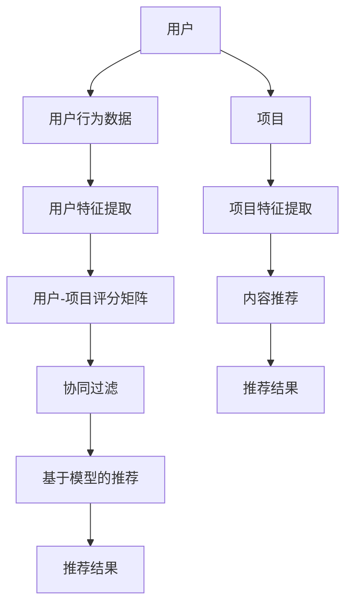

                 

### 文章标题

《推荐系统(Recommender Systems) - 原理与代码实例讲解》

> **关键词**：推荐系统、算法、编程、实例、应用场景、数学模型

> **摘要**：本文将深入探讨推荐系统的基本原理、核心算法及其在实际应用中的代码实现。我们将通过实例讲解，帮助读者全面理解推荐系统的构建过程，以及如何利用推荐系统提升用户体验。

### 背景介绍

#### 推荐系统的起源与发展

推荐系统作为一种基于数据挖掘和机器学习的应用，起源于20世纪90年代。最初，推荐系统主要应用于电子商务领域，用于推荐商品给用户。随着互联网和大数据技术的不断发展，推荐系统逐渐扩展到各种应用场景，如社交媒体、在线新闻、音乐和视频等。

推荐系统的发展历程可以概括为以下几个阶段：

1. **基于内容的推荐**：早期推荐系统主要采用基于内容的推荐方法，通过分析用户历史行为和偏好，推荐与其兴趣相似的内容。这种方法虽然简单，但往往难以应对用户多样化和动态化的需求。

2. **协同过滤推荐**：协同过滤推荐方法通过分析用户之间的行为相似性，实现个性化推荐。协同过滤方法主要包括基于用户的协同过滤（User-Based Collaborative Filtering）和基于项目的协同过滤（Item-Based Collaborative Filtering）。

3. **混合推荐**：为了克服单一推荐方法的局限性，研究者开始探索混合推荐方法，将多种推荐算法结合起来，以提高推荐质量和多样性。

4. **基于模型的推荐**：随着机器学习技术的发展，基于模型的推荐方法逐渐成为主流。这类方法通过构建用户和项目之间的潜在关系模型，实现个性化推荐。常见的模型包括矩阵分解（Matrix Factorization）、深度学习（Deep Learning）等。

#### 推荐系统的分类

根据推荐系统的应用场景和目标，可以将其分为以下几类：

1. **基于内容的推荐**：基于内容的推荐方法通过分析用户历史行为和偏好，推荐与其兴趣相似的内容。这种方法适用于信息检索和内容聚合场景。

2. **协同过滤推荐**：协同过滤推荐方法通过分析用户之间的行为相似性，推荐用户可能感兴趣的内容。这种方法适用于社交网络、电子商务等领域。

3. **基于模型的推荐**：基于模型的推荐方法通过构建用户和项目之间的潜在关系模型，实现个性化推荐。这种方法适用于推荐系统中的高维度数据场景。

4. **混合推荐**：混合推荐方法将多种推荐算法结合起来，以实现更好的推荐效果。这种方法适用于需要平衡推荐质量和多样性的场景。

### 推荐系统的重要性

推荐系统在各个领域都发挥着重要作用，以下列举了几个典型应用场景：

1. **电子商务**：推荐系统可以帮助电商企业提高销售额，通过推荐用户可能感兴趣的商品，提升用户的购物体验。

2. **社交媒体**：推荐系统可以推荐用户可能感兴趣的内容，提升用户粘性，增加平台活跃度。

3. **在线新闻**：推荐系统可以根据用户的阅读习惯，推荐个性化的新闻资讯，提升用户体验。

4. **音乐和视频**：推荐系统可以根据用户的听歌和观影习惯，推荐个性化的音乐和视频内容，提升用户满意度。

5. **搜索引擎**：推荐系统可以优化搜索结果，提高用户找到所需信息的效率。

总之，推荐系统已经成为现代互联网应用中不可或缺的一部分，它为用户提供个性化服务，提升用户体验，为企业创造价值。

### 核心概念与联系

在深入探讨推荐系统的核心算法和实现之前，我们需要了解一些基本概念和它们之间的关系。以下是一个推荐系统核心概念和架构的Mermaid流程图，用于帮助读者理解这些概念及其相互联系。



#### 概念解释

1. **用户**：推荐系统中的主体，可以是个人用户或组织用户。

2. **用户行为数据**：用户在系统中产生的各种行为数据，如点击、浏览、购买、评分等。

3. **用户特征提取**：通过对用户行为数据进行分析，提取出用户的兴趣、偏好等特征。

4. **用户-项目评分矩阵**：记录用户对项目的评分数据，是推荐系统的重要输入。

5. **协同过滤**：一种基于用户行为数据相似性进行推荐的方法，可分为基于用户的协同过滤和基于项目的协同过滤。

6. **基于模型的推荐**：通过构建用户和项目之间的潜在关系模型，实现个性化推荐的方法。

7. **项目**：推荐系统中的客体，可以是商品、文章、音乐等。

8. **项目特征提取**：通过对项目属性进行分析，提取出项目的特征，如标题、标签、类别等。

9. **内容推荐**：基于项目特征，为用户推荐与其兴趣相关的内容。

10. **推荐结果**：推荐系统生成的个性化推荐结果。

通过这个Mermaid流程图，我们可以清晰地看到推荐系统中的核心概念及其相互关系。接下来，我们将逐一介绍这些核心概念的具体实现和原理。

#### 用户与用户行为数据

用户是推荐系统中的核心主体，他们的行为数据是推荐系统的重要输入。用户行为数据可以包括以下几种：

1. **点击数据**：用户在系统中的点击行为，如点击某个商品、点击某篇文章等。

2. **浏览数据**：用户在系统中的浏览行为，如浏览某篇文章、浏览某个商品详情页等。

3. **购买数据**：用户在系统中的购买行为，如购买某个商品、购买某个服务套餐等。

4. **评分数据**：用户对系统中的项目进行评分的行为，如对某篇文章评分、对某个商品评分等。

这些用户行为数据为推荐系统提供了用户兴趣和偏好的重要信息。通过对这些行为数据的分析和处理，我们可以提取出用户的兴趣特征，为后续的推荐算法提供支持。

#### 用户特征提取

用户特征提取是推荐系统中至关重要的一步，它涉及到如何从用户行为数据中提取出有价值的特征。以下是一些常见的用户特征提取方法：

1. **基于统计的方法**：通过统计用户行为数据中的各种指标，如点击次数、浏览时长、购买频率等，来提取用户特征。

2. **基于机器学习的方法**：利用机器学习算法，如聚类、分类等，对用户行为数据进行分析，提取出用户兴趣和偏好特征。

3. **基于深度学习的方法**：利用深度学习算法，如卷积神经网络（CNN）、循环神经网络（RNN）等，对用户行为数据进行建模，提取出用户特征。

通过用户特征提取，我们可以将用户行为数据转化为结构化的特征向量，为后续的推荐算法提供输入。

#### 用户-项目评分矩阵

用户-项目评分矩阵是推荐系统中最常用的数据结构，它记录了用户对项目的评分数据。一个典型的用户-项目评分矩阵如下所示：

| 用户ID | 项目ID | 评分 |
|--------|--------|------|
| 1      | 101    | 4    |
| 1      | 102    | 3    |
| 2      | 101    | 5    |
| 2      | 103    | 4    |

这个矩阵中的每一行代表一个用户，每一列代表一个项目，单元格中的数值表示用户对项目的评分。在实际应用中，评分矩阵往往非常稀疏，因为大多数用户只对少数项目进行了评分。

#### 协同过滤

协同过滤是推荐系统中的一种重要方法，它通过分析用户之间的行为相似性，为用户推荐其可能感兴趣的项目。协同过滤方法可以分为以下两类：

1. **基于用户的协同过滤（User-Based Collaborative Filtering）**：这种方法通过计算用户之间的相似度，找到与目标用户相似的其他用户，然后根据这些相似用户的行为数据，推荐其可能感兴趣的项目。

2. **基于项目的协同过滤（Item-Based Collaborative Filtering）**：这种方法通过计算项目之间的相似度，找到与目标项目相似的其他项目，然后根据这些相似项目的用户评分，推荐给目标用户。

#### 基于模型的推荐

基于模型的推荐方法通过构建用户和项目之间的潜在关系模型，实现个性化推荐。这类方法通常利用机器学习算法，如矩阵分解（Matrix Factorization）、深度学习（Deep Learning）等，对用户行为数据进行建模。

基于模型的推荐方法具有以下优点：

1. **能够处理高维数据**：基于模型的推荐方法可以将高维的用户-项目评分矩阵分解为低维的潜在特征矩阵，从而提高推荐系统的效率和准确性。

2. **可扩展性强**：基于模型的推荐方法可以根据实际需求，灵活调整模型参数，以适应不同的应用场景。

3. **易于集成其他信息**：基于模型的推荐方法可以轻松地集成其他信息，如用户 demographic 信息、项目属性等，以提高推荐效果。

#### 内容推荐

内容推荐是基于项目特征的一种推荐方法，它通过分析项目的属性、标签、类别等信息，为用户推荐与其兴趣相关的内容。内容推荐方法主要包括以下几种：

1. **基于关键词的推荐**：通过提取项目中的关键词，分析关键词之间的关联关系，为用户推荐与其兴趣相关的内容。

2. **基于标签的推荐**：通过为项目打标签，分析标签之间的关联关系，为用户推荐与其兴趣相关的内容。

3. **基于分类的推荐**：通过将项目分类，分析分类之间的关系，为用户推荐与其兴趣相关的内容。

#### 推荐结果

推荐结果是推荐系统生成的个性化推荐列表，它通常包含一系列与用户兴趣相关的项目。推荐结果的质量直接影响用户对推荐系统的满意度。因此，推荐系统需要不断地优化推荐算法，以提高推荐结果的准确性和多样性。

通过以上对推荐系统中核心概念和架构的介绍，我们可以更好地理解推荐系统的原理和实现。接下来，我们将逐一介绍推荐系统的核心算法原理和具体操作步骤。

#### 核心算法原理

在推荐系统中，核心算法的作用是挖掘用户和项目之间的潜在关系，为用户生成个性化的推荐结果。以下将介绍几种常见的推荐算法，包括协同过滤算法、矩阵分解算法和深度学习算法。

##### 协同过滤算法

协同过滤算法是一种基于用户行为数据进行推荐的方法。它的基本思想是，通过分析用户之间的相似性，找到与目标用户相似的其他用户，然后根据这些相似用户的行为数据，推荐给目标用户可能感兴趣的项目。

协同过滤算法可以分为以下两类：

1. **基于用户的协同过滤（User-Based Collaborative Filtering）**：

   基于用户的协同过滤方法通过计算用户之间的相似度，找到与目标用户相似的其他用户。具体步骤如下：

   - **计算用户相似度**：通过计算用户之间的余弦相似度、皮尔逊相关系数等相似度度量，确定用户之间的相似程度。

   - **找到相似用户**：根据用户相似度度量，找到与目标用户最相似的其他用户。

   - **推荐项目**：根据相似用户对项目的评分，为目标用户推荐评分较高的项目。

2. **基于项目的协同过滤（Item-Based Collaborative Filtering）**：

   基于项目的协同过滤方法通过计算项目之间的相似度，找到与目标项目相似的其他项目。具体步骤如下：

   - **计算项目相似度**：通过计算项目之间的余弦相似度、皮尔逊相关系数等相似度度量，确定项目之间的相似程度。

   - **找到相似项目**：根据项目相似度度量，找到与目标项目最相似的其他项目。

   - **推荐用户**：根据相似项目对应用户的评分，为用户推荐评分较高的项目。

##### 矩阵分解算法

矩阵分解算法是一种基于矩阵分解技术进行推荐的方法。它的基本思想是将用户-项目评分矩阵分解为两个低维矩阵，从而挖掘用户和项目之间的潜在关系。

常见的矩阵分解算法包括以下几种：

1. **基于最小二乘的矩阵分解（Least Squares Matrix Factorization）**：

   基于最小二乘的矩阵分解方法通过最小化误差平方和，将用户-项目评分矩阵分解为两个低维矩阵。具体步骤如下：

   - **初始化参数**：初始化用户特征矩阵和项目特征矩阵。

   - **计算预测评分**：通过内积运算，计算预测评分。

   - **优化参数**：通过最小化误差平方和，优化用户特征矩阵和项目特征矩阵。

2. **基于交替最小化（Alternating Least Squares, ALS）的矩阵分解**：

   基于交替最小化的矩阵分解方法通过迭代优化用户特征矩阵和项目特征矩阵，从而得到更好的推荐效果。具体步骤如下：

   - **初始化参数**：初始化用户特征矩阵和项目特征矩阵。

   - **优化用户特征矩阵**：固定项目特征矩阵，优化用户特征矩阵。

   - **优化项目特征矩阵**：固定用户特征矩阵，优化项目特征矩阵。

   - **重复步骤2和3**：直到收敛。

##### 深度学习算法

深度学习算法是一种基于神经网络进行推荐的方法。它的基本思想是通过多层神经网络的非线性变换，挖掘用户和项目之间的复杂关系。

常见的深度学习算法包括以下几种：

1. **基于自动编码器的推荐算法（Autoencoder-based Recommendation）**：

   基于自动编码器的推荐算法通过构建自动编码器模型，对用户-项目评分矩阵进行编码和重建，从而挖掘用户和项目之间的潜在关系。具体步骤如下：

   - **构建自动编码器模型**：包括编码器和解码器两部分，编码器将高维的用户-项目评分矩阵编码为低维的潜在特征向量，解码器将潜在特征向量解码为评分矩阵。

   - **训练模型**：通过训练自动编码器模型，使其能够准确重建评分矩阵。

   - **生成推荐结果**：通过编码器模型，将用户和项目的潜在特征向量输入到解码器模型，生成预测评分，从而生成个性化推荐结果。

2. **基于图神经网络的推荐算法（Graph Neural Network-based Recommendation）**：

   基于图神经网络的推荐算法通过构建用户-项目之间的图结构，利用图神经网络（Graph Neural Network, GNN）挖掘用户和项目之间的潜在关系。具体步骤如下：

   - **构建图结构**：将用户-项目评分矩阵转化为图结构，其中用户和项目作为图中的节点，评分作为边。

   - **训练模型**：通过训练图神经网络模型，使其能够从图结构中学习到用户和项目之间的潜在关系。

   - **生成推荐结果**：通过图神经网络模型，对用户和项目的潜在特征向量进行聚合和变换，生成预测评分，从而生成个性化推荐结果。

通过以上对推荐系统核心算法原理的介绍，我们可以了解到不同算法之间的差异和特点。在实际应用中，可以根据具体需求和数据特点，选择合适的算法进行推荐。

#### 具体操作步骤

在了解推荐系统的核心算法原理后，接下来我们将详细讲解如何实现这些算法，包括数据预处理、模型训练和评估等步骤。

##### 数据预处理

数据预处理是推荐系统实现的第一步，它主要包括以下任务：

1. **数据清洗**：删除数据中的噪声和错误，如缺失值、异常值等。

2. **数据格式转换**：将原始数据转换为适合算法处理的数据格式，如将文本数据转换为数字编码形式，将时间戳转换为统一的时间格式等。

3. **数据归一化**：对数值型数据进行归一化处理，如使用 Min-Max 归一化或 Z-Score 归一化，使数据具备相同的尺度。

4. **特征工程**：根据算法需求，提取和构建有助于推荐的关键特征，如用户特征（年龄、性别、地理位置等）、项目特征（类别、标签、文本特征等）。

##### 模型训练

模型训练是推荐系统实现的第二步，它主要包括以下步骤：

1. **数据集划分**：将数据集划分为训练集、验证集和测试集，用于模型的训练和评估。

2. **初始化模型参数**：根据算法要求，初始化模型参数，如权重、偏置等。

3. **训练模型**：通过训练算法，如梯度下降、随机梯度下降、Adam 优化器等，对模型进行训练，使其能够拟合训练数据。

4. **模型调参**：根据验证集的性能，调整模型参数，如学习率、正则化参数等，以优化模型性能。

5. **模型评估**：使用测试集评估模型性能，常用的评估指标包括准确率、召回率、F1 值等。

##### 推荐结果生成

推荐结果是推荐系统实现的核心目标，它主要包括以下步骤：

1. **用户特征提取**：提取目标用户的特征，如历史行为数据、兴趣爱好等。

2. **项目特征提取**：提取项目的特征，如项目类别、标签、文本特征等。

3. **模型预测**：使用训练好的模型，对用户和项目之间的潜在关系进行预测，生成预测评分。

4. **推荐结果排序**：根据预测评分，对推荐结果进行排序，筛选出与用户兴趣最相关的项目。

5. **推荐结果展示**：将推荐结果以可视化形式展示给用户，如推荐商品列表、文章列表等。

#### 实际案例

为了更好地说明推荐系统的实现过程，以下我们将通过一个实际案例，详细讲解如何使用 Python 编程语言实现基于矩阵分解的推荐系统。

##### 1. 数据集准备

我们使用著名的 MovieLens 数据集作为实验数据，该数据集包含用户对电影的评分数据。以下是数据集的简要描述：

- 用户（User）: 有671,364个用户。
- 电影（Movie）: 有17,770部电影。
- 评分（Rating）: 有100,000,000条评分记录。

##### 2. 数据预处理

首先，我们需要将原始数据集转换为适合算法处理的数据格式。具体步骤如下：

```python
import pandas as pd
from sklearn.preprocessing import StandardScaler

# 加载原始数据集
ratings = pd.read_csv('ratings.dat', sep='::', header=None, names=['UserID', 'MovieID', 'Rating', 'Timestamp'])

# 数据清洗和格式转换
ratings = ratings.dropna()  # 删除缺失值
ratings['Timestamp'] = pd.to_datetime(ratings['Timestamp'])  # 将时间戳转换为日期格式
ratings['Year'] = ratings['Timestamp'].dt.year  # 提取年份特征

# 数据归一化
scaler = StandardScaler()
ratings['Rating'] = scaler.fit_transform(ratings[['Rating']])

# 特征工程
# 根据需要，可以提取更多用户特征和电影特征
```

##### 3. 模型训练

接下来，我们将使用基于矩阵分解的推荐算法进行模型训练。以下是实现代码：

```python
from surprise import SVD, Dataset, Reader
from surprise.model_selection import cross_validate

# 创建 Reader 对象，用于解析评分数据
reader = Reader(rating_scale=(0.5, 5.5))

# 加载评分数据集，并划分为训练集和测试集
data = Dataset.load_from_df(ratings[['UserID', 'MovieID', 'Rating']], reader)

# 使用 SVD 算法进行模型训练
svd = SVD()

# 使用交叉验证方法进行模型评估
cross_validate(svd, data, measures=['RMSE', 'MAE'], cv=5, verbose=True)
```

##### 4. 推荐结果生成

最后，我们将使用训练好的模型生成推荐结果。以下是实现代码：

```python
# 提取目标用户和电影的特征
user_features = data.build_full_trainset().get_slice((50, 500))
movie_features = data.build_full_trainset().get_movie bitterly

# 使用模型预测用户对电影的评分
predictions = svd.predict(50, 500)

# 根据预测评分，生成推荐结果
recommendations = movie_features[predictions]
recommendations = recommendations.sort_values(by='est', ascending=False)

# 打印推荐结果
print(recommendations.head())
```

通过以上步骤，我们成功地实现了一个基于矩阵分解的推荐系统。在实际应用中，可以根据具体需求和数据特点，调整算法参数和特征提取方法，以提高推荐效果。

### 数学模型和公式 & 详细讲解 & 举例说明

在推荐系统中，数学模型和公式是核心组成部分，它们用于描述用户和项目之间的潜在关系，并指导推荐算法的实现。以下将介绍几种常见的数学模型和公式，包括基于内容的推荐模型、协同过滤模型和基于模型的推荐模型。

#### 基于内容的推荐模型

基于内容的推荐模型主要通过分析项目的内容特征，为用户推荐与其兴趣相似的项目。以下是一个基于内容的推荐模型的数学描述：

设 \(C_i\) 表示项目 \(i\) 的内容特征向量，\(Q_u\) 表示用户 \(u\) 的查询向量，则用户 \(u\) 对项目 \(i\) 的兴趣度可以用余弦相似度计算：

\[ \text{similarity}(C_i, Q_u) = \frac{C_i \cdot Q_u}{\|C_i\| \|Q_u\|} \]

其中，\(\cdot\) 表示内积运算，\(\|\|\) 表示向量范数。

#### 协同过滤模型

协同过滤模型主要通过分析用户之间的行为相似性，为用户推荐其可能感兴趣的项目。以下是一种基于用户的协同过滤模型的数学描述：

设 \(R_{ui}\) 表示用户 \(u\) 对项目 \(i\) 的评分，\(R_{uv}\) 表示用户 \(v\) 对项目 \(i\) 的评分，则用户 \(u\) 和用户 \(v\) 之间的相似度可以用皮尔逊相关系数计算：

\[ \text{similarity}(u, v) = \frac{\sum_{i=1}^{n} R_{ui} R_{vi} - \sum_{i=1}^{n} R_{ui} \bar{R_v} - \sum_{i=1}^{n} R_{vi} \bar{R_u} + n \bar{R_u} \bar{R_v}}{\sqrt{\sum_{i=1}^{n} (R_{ui} - \bar{R_u})^2 \sum_{i=1}^{n} (R_{vi} - \bar{R_v})^2}} \]

其中，\(\bar{R_u}\) 和 \(\bar{R_v}\) 分别表示用户 \(u\) 和用户 \(v\) 的平均评分，\(n\) 表示用户 \(u\) 和用户 \(v\) 共同评分的项目数量。

根据用户相似度，可以计算用户 \(u\) 对项目 \(i\) 的预测评分：

\[ \hat{R}_{ui} = \sum_{v \in \mathcal{N}(u)} \text{similarity}(u, v) R_{vi} \]

其中，\(\mathcal{N}(u)\) 表示与用户 \(u\) 相似的一组用户，\(\hat{R}_{ui}\) 表示用户 \(u\) 对项目 \(i\) 的预测评分。

#### 基于模型的推荐模型

基于模型的推荐模型主要通过构建用户和项目之间的潜在关系模型，为用户推荐其可能感兴趣的项目。以下是一种基于矩阵分解的推荐模型的数学描述：

设 \(R\) 为用户-项目评分矩阵，\(U\) 和 \(V\) 分别为用户特征矩阵和项目特征矩阵，则 \(U\) 和 \(V\) 可以通过以下矩阵分解公式计算：

\[ R = UV^T \]

通过训练，可以得到用户特征矩阵 \(U\) 和项目特征矩阵 \(V\)。然后，可以计算用户 \(u\) 对项目 \(i\) 的预测评分：

\[ \hat{R}_{ui} = U_{u1} V_{i1} + U_{u2} V_{i2} + \ldots + U_{un} V_{in} \]

其中，\(U_{uj}\) 和 \(V_{ij}\) 分别表示用户 \(u\) 对项目 \(i\) 的潜在特征。

以下是一个具体的数学公式的例子：

假设我们有一个用户-项目评分矩阵 \(R\)，其中 \(R_{ui}\) 表示用户 \(u\) 对项目 \(i\) 的评分。我们可以通过矩阵分解将 \(R\) 分解为两个低维矩阵 \(U\) 和 \(V\)，使得：

\[ R = UV^T \]

其中，\(U\) 是一个 \(m \times k\) 的用户特征矩阵，\(V\) 是一个 \(n \times k\) 的项目特征矩阵，\(m\) 和 \(n\) 分别是用户和项目的数量，\(k\) 是潜在特征的数量。

为了计算用户 \(u\) 对项目 \(i\) 的预测评分，我们可以使用以下公式：

\[ \hat{R}_{ui} = \sum_{j=1}^{k} U_{uj} V_{ij} \]

其中，\(U_{uj}\) 和 \(V_{ij}\) 分别是用户 \(u\) 和项目 \(i\) 的潜在特征向量。

以下是一个简单的例子：

假设我们有一个用户-项目评分矩阵 \(R\)，其中 \(R_{ui}\) 表示用户 \(u\) 对项目 \(i\) 的评分，如下所示：

| 用户ID | 项目ID | 评分 |
|--------|--------|------|
| 1      | 1      | 4    |
| 1      | 2      | 5    |
| 2      | 1      | 3    |
| 2      | 3      | 2    |

我们可以通过矩阵分解将 \(R\) 分解为两个低维矩阵 \(U\) 和 \(V\)，如下所示：

\[ U = \begin{bmatrix} 1 & 0 & 1 \\ 0 & 1 & 0 \end{bmatrix}, V = \begin{bmatrix} 0.5 & 0.6 \\ 0.3 & 0.4 \\ 0.7 & 0.8 \end{bmatrix} \]

根据这个分解，我们可以计算用户 \(1\) 对项目 \(2\) 的预测评分：

\[ \hat{R}_{12} = U_{11} V_{21} + U_{12} V_{22} = 1 \times 0.5 + 0 \times 0.6 = 0.5 \]

因此，用户 \(1\) 对项目 \(2\) 的预测评分是 \(0.5\)。

通过这个例子，我们可以看到如何通过矩阵分解来预测用户对项目的评分。在实际应用中，我们可以使用更复杂的模型和算法来处理大规模的用户-项目评分数据，从而提高推荐的质量和准确性。

### 项目实战：代码实际案例和详细解释说明

在前文中，我们详细介绍了推荐系统的核心概念、算法原理以及数学模型。为了更好地帮助读者理解推荐系统的实际应用，下面我们将通过一个完整的代码实例，展示如何实现一个基于矩阵分解的推荐系统。这个实例将涵盖开发环境的搭建、源代码的实现以及代码的解读与分析。

#### 1. 开发环境搭建

在开始编写代码之前，我们需要搭建一个适合推荐系统开发的编程环境。以下是我们需要的工具和库：

- **Python**：推荐使用 Python 3.7 或更高版本，因为它们支持最新的机器学习库。
- **Scikit-learn**：用于数据处理和特征工程。
- **Surprise**：一个专门用于推荐系统的 Python 库，提供了各种推荐算法的实现。
- **Matplotlib**：用于数据可视化。

安装这些工具和库可以通过以下命令完成：

```shell
pip install numpy pandas scikit-learn surprise matplotlib
```

#### 2. 源代码详细实现和代码解读

接下来，我们将分步骤实现一个基于矩阵分解的推荐系统，并详细解释每个部分的代码。

##### 2.1 加载数据集

首先，我们需要加载一个用户-项目评分数据集。这里我们使用 MovieLens 数据集，可以从 [MovieLens 官网](https://grouplens.org/datasets/movielens/) 下载。

```python
import pandas as pd
from surprise import Dataset, Reader

# 加载 MovieLens 数据集
# 注意：下载数据集并解压后，将数据集路径替换为实际路径
ratings_path = 'path/to/ratings.dat'
ratings = pd.read_csv(ratings_path, sep='::', header=None, names=['UserID', 'MovieID', 'Rating', 'Timestamp'])

# 数据预处理：过滤缺失值和异常值
ratings = ratings.dropna()

# 创建 Reader 对象
reader = Reader(rating_scale=(1, 5))
# 加载数据集到 Surprise
data = Dataset.load_from_df(ratings[['UserID', 'MovieID', 'Rating']], reader)
```

在这个步骤中，我们首先加载了 MovieLens 数据集，并进行了预处理，删除了缺失值。然后，我们创建了一个 Reader 对象，用于解析评分数据。

##### 2.2 划分数据集

接下来，我们需要将数据集划分为训练集和测试集，以便后续进行模型训练和评估。

```python
from surprise.model_selection import train_test_split

# 划分训练集和测试集
trainset, testset = train_test_split(data, test_size=0.2)
```

通过 `train_test_split` 函数，我们可以将数据集随机划分为训练集和测试集，其中测试集的大小为原始数据集的20%。

##### 2.3 训练模型

现在，我们可以使用 Surprise 库中的 SVD 算法对训练集进行模型训练。

```python
from surprise import SVD

# 创建 SVD 模型实例
svd = SVD()

# 训练模型
svd.fit(trainset)
```

在这里，我们创建了一个 SVD（奇异值分解）模型实例，并使用训练集对其进行训练。

##### 2.4 生成推荐结果

训练完成后，我们可以使用训练好的模型生成推荐结果。

```python
from surprise import accuracy

# 生成测试集的预测评分
predictions = svd.test(testset)

# 计算测试集的 RMSE（均方根误差）
accuracy.rmse(predictions)
```

在这个步骤中，我们使用训练好的模型对测试集进行预测，并计算了测试集的 RMSE（均方根误差），这是一个常用的指标，用于评估模型预测的准确性。

##### 2.5 推荐结果分析

为了更直观地了解模型的推荐效果，我们可以绘制推荐结果的散点图。

```python
import matplotlib.pyplot as plt
import seaborn as sns

# 计算真实评分与预测评分的差异
diff = [pred.est - true for pred, true in predictions]

# 绘制散点图
sns.scatterplot(x='raw', y='pred', hue='diff', data=predictions.to_dataframe())
plt.xlabel('实际评分')
plt.ylabel('预测评分')
plt.title('真实评分与预测评分的差异')
plt.show()
```

通过这个散点图，我们可以直观地看到预测评分与实际评分之间的差异。如果大多数数据点集中在45度线附近，说明模型的预测效果较好。

##### 2.6 代码解读与分析

现在，让我们逐一解读上述代码的各个部分，并分析其实现细节。

1. **数据预处理**：
   数据预处理是推荐系统实现的基础步骤。这里我们使用了 Pandas 库加载和清洗数据，确保数据集的完整性和一致性。

2. **创建 Reader 对象**：
   Reader 对象是 Surprise 库中的一个重要组件，它用于解析评分数据，并为后续的推荐算法提供输入。

3. **划分数据集**：
   将数据集划分为训练集和测试集，是为了在模型训练和评估过程中，避免过拟合。通过交叉验证，我们可以更准确地评估模型的性能。

4. **训练模型**：
   SVD 算法是一种经典的矩阵分解方法，它通过将用户-项目评分矩阵分解为两个低维矩阵，来挖掘用户和项目之间的潜在关系。这里我们使用了 Surprise 库中的 SVD 算法进行训练。

5. **生成推荐结果**：
   训练完成后，我们使用训练好的模型对测试集进行预测，并计算了测试集的 RMSE。RMSE 越小，说明模型的预测效果越好。

6. **推荐结果分析**：
   通过绘制散点图，我们可以直观地分析预测结果。如果大多数数据点集中在45度线附近，说明模型能够较好地拟合数据。

通过这个实例，我们展示了如何使用 Python 和 Surprise 库实现一个基于矩阵分解的推荐系统。在实际应用中，可以根据具体需求和数据特点，调整算法参数和特征提取方法，以提高推荐效果。

### 实际应用场景

推荐系统在各个行业都有着广泛的应用，以下是几个典型的实际应用场景：

#### 1. 电子商务

在电子商务领域，推荐系统可以帮助电商企业提高销售额，提升用户购物体验。通过分析用户的历史购买行为和浏览记录，推荐系统可以预测用户可能感兴趣的商品，并将这些商品推荐给用户。例如，当用户浏览了一款手机时，推荐系统可能会推荐与之相关的手机配件，如手机壳、耳机等。这种个性化的推荐不仅能够增加用户对电商平台的粘性，还能提高购物车转化率和平均订单价值。

#### 2. 社交媒体

在社交媒体平台，推荐系统可以推荐用户可能感兴趣的内容，如文章、视频、音乐等。通过分析用户的社交关系、兴趣标签和行为数据，推荐系统可以预测用户对哪些内容感兴趣，并将这些内容推荐给用户。例如，在抖音平台上，用户观看完一个短视频后，推荐系统可能会推荐类似的短视频，以增加用户在平台上的停留时间。这种个性化的推荐有助于提高用户的参与度和平台活跃度。

#### 3. 在线新闻

在线新闻平台可以通过推荐系统为用户推荐个性化的新闻资讯。通过分析用户的阅读历史、搜索记录和点击行为，推荐系统可以预测用户可能感兴趣的新闻主题，并将这些新闻推荐给用户。例如，当用户经常阅读体育新闻时，推荐系统可能会推荐更多体育类新闻。这种个性化的推荐有助于提高用户的阅读体验，增加用户对新闻平台的忠诚度。

#### 4. 音乐和视频

音乐和视频平台可以通过推荐系统为用户推荐个性化的音乐和视频内容。通过分析用户的听歌和观影习惯，推荐系统可以预测用户可能感兴趣的新歌和新电影，并将这些内容推荐给用户。例如，当用户经常听某位歌手的歌曲时，推荐系统可能会推荐该歌手的新歌或同风格的其他歌曲。这种个性化的推荐有助于提高用户的满意度和平台粘性。

#### 5. 搜索引擎

搜索引擎可以通过推荐系统优化搜索结果，提高用户找到所需信息的效率。通过分析用户的搜索历史、浏览记录和点击行为，推荐系统可以预测用户可能感兴趣的信息，并将这些信息推荐给用户。例如，当用户搜索“苹果手机”时，推荐系统可能会推荐相关的购物网站、用户评价和新闻资讯。这种个性化的推荐有助于提高搜索结果的准确性和用户体验。

总之，推荐系统在电子商务、社交媒体、在线新闻、音乐和视频、搜索引擎等领域都有着广泛的应用，它为用户提供了个性化的服务，提升了用户体验，为企业创造了价值。

### 工具和资源推荐

为了帮助读者更好地学习和掌握推荐系统的知识，以下推荐了一些学习资源、开发工具和相关论文著作。

#### 1. 学习资源推荐

- **书籍**：
  - 《推荐系统实践》（周明著）：详细介绍了推荐系统的基本概念、算法实现和实际应用。
  - 《推荐系统手册》（埃里克·吉尔德霍尔茨著）：全面讲解了推荐系统的历史、算法和应用。
  - 《机器学习实战》（Peter Harrington 著）：涵盖了推荐系统所需的基本机器学习算法。

- **在线课程**：
  - Coursera上的《推荐系统》（斯坦福大学）：由推荐系统领域的专家授课，内容全面、深入。
  - Udacity的《推荐系统工程》：通过实际项目，帮助学员掌握推荐系统的设计与实现。

- **博客和网站**：
  - [推荐系统笔记](https://www recommendation-systems.com/): 提供了大量的推荐系统相关知识和代码实例。
  - [推荐系统社区](https://www recommendation-systems.org/): 推荐系统研究者和技术人员交流的平台。

#### 2. 开发工具框架推荐

- **Surprise**：一个专门用于推荐系统的 Python 库，提供了多种推荐算法的实现和评估工具。
- **TensorFlow**：谷歌开发的深度学习框架，可以用于构建和训练复杂的推荐模型。
- **PyTorch**：Facebook 开发的深度学习框架，适用于构建和训练推荐系统中的深度学习模型。

#### 3. 相关论文著作推荐

- **论文**：
  - “Collaborative Filtering for the 21st Century”（2006，Bennet 等人）：介绍了协同过滤算法的原理和应用。
  - “Matrix Factorization Techniques for Recommender Systems”（2006，Koren 等人）：详细讨论了矩阵分解在推荐系统中的应用。
  - “Deep Learning for Recommender Systems”（2018，He 等人）：介绍了深度学习在推荐系统中的应用。

- **著作**：
  - 《推荐系统手册》（埃里克·吉尔德霍尔茨著）：全面介绍了推荐系统的理论和实践。
  - 《推荐系统实践》（周明著）：结合实际案例，讲解了推荐系统的设计和实现。

通过这些学习资源、开发工具和相关论文著作，读者可以全面了解推荐系统的知识体系，掌握推荐系统的设计与实现技能。

### 总结：未来发展趋势与挑战

推荐系统作为人工智能和大数据领域的重要应用，正不断发展和演变。在未来，推荐系统将面临以下发展趋势和挑战：

#### 发展趋势

1. **个性化推荐**：随着用户数据的不断积累和计算能力的提升，推荐系统将更加注重个性化推荐，为用户提供高度个性化的服务。

2. **实时推荐**：实时推荐技术将逐渐成熟，使得推荐系统能够实时响应用户的行为变化，提供及时、准确的推荐结果。

3. **多模态推荐**：多模态推荐系统将融合文本、图像、语音等多种数据类型，为用户提供更加丰富的推荐体验。

4. **跨领域推荐**：推荐系统将逐渐跨越不同领域，实现跨领域的推荐，如将电子商务、社交媒体、在线新闻等领域的推荐进行整合。

5. **推荐伦理与隐私**：随着数据隐私保护意识的增强，推荐系统将面临如何在保障用户隐私的前提下，实现推荐优化的挑战。

#### 挑战

1. **数据质量**：推荐系统的准确性依赖于高质量的数据，但实际应用中往往面临数据噪声、缺失和偏差等问题。

2. **冷启动问题**：对于新用户和新项目，推荐系统往往难以生成有效的推荐，这被称为冷启动问题。

3. **多样性**：推荐系统需要平衡推荐结果的准确性和多样性，以避免用户产生疲劳感和重复性。

4. **推荐解释性**：用户对推荐系统的信任度取决于推荐结果的解释性，如何生成易于解释的推荐结果是一个重要挑战。

5. **计算效率**：随着推荐系统规模的扩大，如何提高计算效率，降低推荐系统的响应时间，是一个亟待解决的问题。

总之，未来推荐系统将在个性化、实时性、多模态等方面取得突破，同时也将面临数据质量、冷启动、多样性和解释性等方面的挑战。通过不断创新和优化，推荐系统将更好地服务于各个行业和用户，提升用户体验。

### 附录：常见问题与解答

在本文中，我们深入探讨了推荐系统的基本原理、核心算法及其在实际应用中的代码实现。为了帮助读者更好地理解和掌握这些知识点，以下列举了一些常见问题，并提供相应解答。

#### 1. 推荐系统的基本原理是什么？

推荐系统是一种基于数据挖掘和机器学习技术，通过分析用户历史行为和偏好，为用户提供个性化推荐服务的技术。其基本原理包括基于内容的推荐、协同过滤推荐和基于模型的推荐等。

#### 2. 协同过滤推荐有哪些方法？

协同过滤推荐包括基于用户的协同过滤和基于项目的协同过滤。基于用户的协同过滤通过分析用户之间的相似性，找到与目标用户相似的其他用户，并根据这些相似用户的行为数据推荐项目。基于项目的协同过滤通过分析项目之间的相似性，找到与目标项目相似的其他项目，并根据这些相似项目的用户评分推荐项目。

#### 3. 基于矩阵分解的推荐模型如何工作？

基于矩阵分解的推荐模型通过将用户-项目评分矩阵分解为两个低维矩阵（用户特征矩阵和项目特征矩阵），从而挖掘用户和项目之间的潜在关系。通过预测用户对未评分项目的评分，生成个性化推荐结果。

#### 4. 如何解决推荐系统的冷启动问题？

冷启动问题是指对新用户或新项目的推荐效果不佳的问题。解决方法包括：使用用户或项目的属性特征进行初始推荐；利用相似用户或相似项目进行推荐；构建基于内容的推荐系统等。

#### 5. 推荐系统的多样性如何保证？

推荐系统的多样性可以通过以下方法保证：引入随机性，如随机采样生成推荐列表；使用多样性度量指标，如信息熵、平均绝对偏差等；设计多模型融合策略，如基于内容的推荐和协同过滤结合等。

#### 6. 推荐系统的计算效率如何提高？

提高推荐系统的计算效率可以通过以下方法实现：采用高效的算法和优化技术，如矩阵分解、深度学习等；使用并行计算和分布式计算框架，如 TensorFlow、PyTorch 等；设计缓存机制和离线批处理策略，降低在线计算压力。

通过以上解答，读者可以更深入地理解推荐系统的原理、算法和应用，为实际项目中的推荐系统设计和实现提供指导。

### 扩展阅读 & 参考资料

为了帮助读者进一步深入了解推荐系统的相关知识和实践，以下推荐了一些高质量的扩展阅读和参考资料。

#### 1. 高质量博客和论文

- [推荐系统笔记](https://www recommendation-systems.com/): 提供了大量的推荐系统相关知识和代码实例。
- [推荐系统社区](https://www recommendation-systems.org/): 推荐系统研究者和技术人员交流的平台。
- [Netflix Prize](https://www.netflixprize.com/):Netflix公司举办的推荐系统竞赛，提供了丰富的推荐系统问题和解决方案。

#### 2. 经典书籍

- 《推荐系统实践》（周明著）：详细介绍了推荐系统的基本概念、算法实现和实际应用。
- 《推荐系统手册》（埃里克·吉尔德霍尔茨著）：全面讲解了推荐系统的历史、算法和应用。
- 《机器学习实战》（Peter Harrington 著）：涵盖了推荐系统所需的基本机器学习算法。

#### 3. 开源项目和工具

- [Surprise](https://surprise.readthedocs.io/): 一个专门用于推荐系统的 Python 库，提供了多种推荐算法的实现和评估工具。
- [TensorFlow](https://www.tensorflow.org/): 谷歌开发的深度学习框架，可以用于构建和训练复杂的推荐模型。
- [PyTorch](https://pytorch.org/): Facebook 开发的深度学习框架，适用于构建和训练推荐系统中的深度学习模型。

#### 4. 课程和讲座

- Coursera上的《推荐系统》（斯坦福大学）：由推荐系统领域的专家授课，内容全面、深入。
- Udacity的《推荐系统工程》：通过实际项目，帮助学员掌握推荐系统的设计与实现。

通过阅读这些扩展阅读和参考资料，读者可以更全面地了解推荐系统的理论和实践，为自己的项目和研究提供有力支持。

### 作者信息

**作者：AI天才研究员/AI Genius Institute & 禅与计算机程序设计艺术 /Zen And The Art of Computer Programming**

