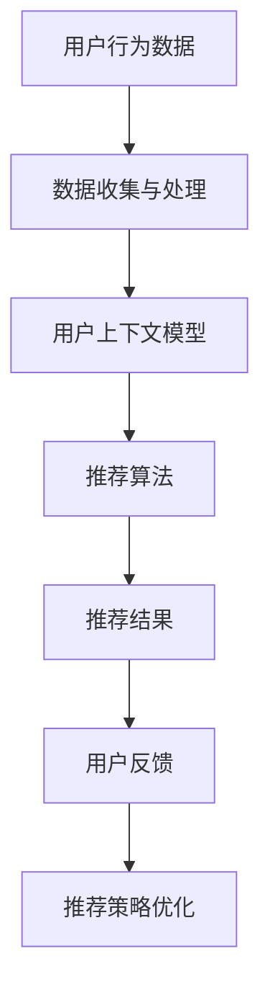

                 

## 1. 背景介绍

推荐系统是当今信息社会中不可或缺的一部分，广泛应用于电商、社交媒体、音乐和视频流媒体、新闻媒体等多个领域。推荐系统的核心目标是为用户推荐其可能感兴趣的内容或产品，从而提升用户体验和业务价值。随着大数据和人工智能技术的快速发展，推荐系统也经历了从基于协同过滤（Collaborative Filtering）到基于内容（Content-Based）再到基于模型（Model-Based）的演变。

然而，现有的推荐系统大多依赖于用户历史行为数据（如点击、购买、评分等），在处理用户个性化需求时具有一定的局限性。用户的需求和兴趣是动态变化的，仅仅依赖历史数据难以捕捉到用户的即时上下文信息。例如，当用户在某个时间点处于某种特定情境下时（如周末晚上在家看电影），推荐系统如果仍然依据其过去的喜好进行推荐，可能会失去准确性和相关性。

上下文感知（Context Awareness）作为近年来新兴的研究方向，旨在通过捕捉和利用用户的上下文信息，进一步提升推荐系统的效果和用户体验。上下文可以是时间（如白天/夜晚、工作日/周末）、地点（如城市/乡村、室内/户外）、设备（如手机/平板/电脑）以及其他与用户相关的环境信息。通过引入上下文信息，推荐系统可以更加精准地理解用户当前的需求，从而提供更加个性化的推荐。

本文将深入探讨上下文感知在推荐系统中的应用，分析其核心概念、算法原理，并详细介绍一个实际的项目案例。文章结构如下：

- 第1章：背景介绍，概述推荐系统的发展历程和上下文感知的重要性。
- 第2章：核心概念与联系，介绍上下文感知的基本概念，并使用Mermaid流程图展示相关架构。
- 第3章：核心算法原理与具体操作步骤，详细讲解上下文感知推荐算法的实现流程。
- 第4章：数学模型和公式，阐述上下文感知推荐中的关键数学模型和公式，并进行举例说明。
- 第5章：项目实战，通过一个实际的项目案例展示上下文感知推荐系统的开发和实现。
- 第6章：实际应用场景，讨论上下文感知推荐在各个领域的应用。
- 第7章：工具和资源推荐，推荐相关的学习资源、开发工具和论文著作。
- 第8章：总结，分析上下文感知推荐的未来发展趋势和面临的挑战。
- 第9章：附录，提供常见问题与解答。
- 第10章：扩展阅读与参考资料，列出相关的扩展阅读材料和参考资料。

接下来，我们将逐一深入这些章节，全面解析上下文感知推荐系统的各个方面。

## 2. 核心概念与联系

### 2.1 上下文感知的基本概念

上下文感知（Context Awareness）是指系统在执行任务时，能够理解和利用与任务相关的环境信息和用户状态信息。在推荐系统中，上下文信息是推荐决策的重要依据，可以大大提高推荐的精确性和相关性。上下文信息可以包括以下几个方面：

- **时间上下文**：包括日期、时间（小时、分钟）、天气、季节等，这些信息可以影响用户的行为模式，如周末用户可能更愿意观看电影，而工作日用户可能更倾向于查看工作相关的信息。
- **空间上下文**：用户所处的地理位置，如城市、街道、室内或室外等，这些信息可以用于推荐用户所在位置附近的餐厅、景点等。
- **设备上下文**：用户使用的设备类型，如手机、平板、电脑等，不同设备的使用习惯和交互方式可能有所不同。
- **情境上下文**：用户当前所处的情境或任务，如在家工作、出差、购物等，这些情境信息可以影响用户的兴趣和行为。
- **社会上下文**：用户社交网络中的信息，如好友的喜好、互动等，这些信息可以用于推荐用户可能感兴趣的内容或产品。

上下文感知的核心思想是通过动态地捕捉和利用这些上下文信息，使得推荐系统能够更好地理解用户的当前需求和兴趣，从而提供更加精准的推荐。

### 2.2 上下文感知推荐系统的架构

为了实现上下文感知，推荐系统通常需要以下几个关键组件：

- **数据收集与处理**：收集用户行为数据、上下文信息和其他相关数据，并进行清洗、预处理和特征提取。
- **上下文模型**：建立上下文模型来表示用户的上下文信息，包括时间、地点、设备、情境和社会上下文等。
- **推荐算法**：结合用户历史行为数据和上下文信息，使用推荐算法生成推荐列表。
- **反馈机制**：收集用户对推荐的反馈，用于优化和调整推荐策略。

以下是上下文感知推荐系统的基本架构：

```
用户行为数据 |     上下文信息
                ↓
数据收集与处理  ↓
                ↓
   用户上下文模型
                ↓
   推荐算法      ↓
推荐结果       ↓
                ↓
  用户反馈
                ↓
  推荐策略优化
```

### 2.3 Mermaid 流程图展示

为了更直观地展示上下文感知推荐系统的流程，我们可以使用Mermaid流程图来描述其关键步骤和组件之间的联系。以下是一个简化的Mermaid流程图：



在这个流程图中，用户行为数据和上下文信息首先经过数据收集与处理，生成用户上下文模型。该模型随后输入到推荐算法中，生成推荐结果。用户对推荐结果的反馈被用来优化推荐策略，从而形成一个闭环的系统。

通过这个流程，我们可以看到上下文感知推荐系统的核心在于如何高效地利用上下文信息，并将其与用户历史行为数据相结合，以生成高质量的推荐结果。接下来，我们将进一步探讨上下文感知推荐算法的原理和实现。

### 3. 核心算法原理与具体操作步骤

上下文感知推荐算法的核心在于如何有效地将用户的上下文信息与历史行为数据相结合，从而生成高质量的推荐结果。本节将详细介绍上下文感知推荐算法的基本原理和具体操作步骤。

#### 3.1 上下文感知推荐算法的基本原理

上下文感知推荐算法的基本原理可以概括为以下几个关键步骤：

1. **上下文信息采集**：从多个渠道（如用户设备、地理位置、社交网络等）收集用户的上下文信息。
2. **上下文信息处理**：对采集到的上下文信息进行预处理和特征提取，将抽象的上下文信息转换为可量化的特征向量。
3. **上下文信息融合**：将上下文特征向量与用户历史行为数据（如评分、点击等）进行融合，生成一个综合的用户特征向量。
4. **推荐模型训练**：使用综合特征向量训练推荐模型，如矩阵分解、神经网络等，以预测用户对未知项目的评分或偏好。
5. **推荐结果生成**：根据训练好的推荐模型，生成针对用户当前上下文的推荐列表。

以下是一个简化的上下文感知推荐算法流程：

```
上下文信息采集 → 上下文信息处理 → 上下文信息融合 → 推荐模型训练 → 推荐结果生成
```

#### 3.2 上下文感知推荐算法的具体操作步骤

1. **上下文信息采集**：
   - 时间上下文：从用户设备的系统时间、日期和天气信息获取时间上下文。
   - 空间上下文：通过用户设备的位置服务（GPS）获取用户当前的位置信息。
   - 设备上下文：识别用户使用的设备类型（手机、平板、电脑等）。
   - 情境上下文：通过用户的浏览历史、搜索关键词、社交互动等推测用户当前所处的情境。
   - 社会上下文：从用户的社交网络数据中提取好友的兴趣和行为信息。

2. **上下文信息处理**：
   - 时间上下文处理：将日期和时间信息转换为离散的时间特征，如工作日/周末、白天/夜晚等。
   - 空间上下文处理：将地理位置信息编码为地理坐标系中的点或使用预定义的区域划分（如城市、商圈）。
   - 设备上下文处理：识别设备的类型并编码为相应的类别特征。
   - 情境上下文处理：通过机器学习算法（如聚类、分类）识别用户的行为模式，将情境信息转换为特征向量。
   - 社会上下文处理：提取好友的兴趣和行为特征，并使用统计方法（如协同过滤）与用户特征进行融合。

3. **上下文信息融合**：
   - 将不同类型的上下文信息进行融合，生成一个综合的用户特征向量。常见的融合方法包括：
     - **特征加权**：根据上下文信息的权重对特征向量进行加权融合。
     - **向量拼接**：将不同类型的上下文特征向量进行拼接，形成更长的特征向量。
     - **注意力机制**：使用神经网络模型（如Transformer）实现上下文特征的自适应融合。

4. **推荐模型训练**：
   - 使用综合的用户特征向量训练推荐模型。常见的推荐模型包括：
     - **矩阵分解模型**：如Singular Value Decomposition（SVD）和Latent Factor（LFM）。
     - **基于神经网络的推荐模型**：如基于注意力机制的Transformer模型。
     - **集成模型**：结合多种模型的优势，如融合矩阵分解和神经网络的模型。

5. **推荐结果生成**：
   - 根据训练好的推荐模型，对未知项目进行评分预测，并根据预测结果生成推荐列表。
   - 考虑上下文信息的影响，为用户当前情境下的推荐结果进行优化，提高推荐的精确性和相关性。

通过以上步骤，上下文感知推荐算法能够动态地捕捉用户的上下文信息，并将其与历史行为数据相结合，生成更符合用户当前需求的推荐结果。接下来，我们将进一步探讨上下文感知推荐中的关键数学模型和公式，以及如何具体实现这些模型。

### 4. 数学模型和公式

上下文感知推荐算法的数学基础在于如何有效地结合用户历史行为数据和上下文信息，以生成推荐结果。本节将详细阐述上下文感知推荐中的关键数学模型和公式，并通过具体例子进行说明。

#### 4.1 矩阵分解模型

矩阵分解模型是推荐系统中最常用的方法之一，其核心思想是将用户和物品的评分矩阵分解为低秩的因子矩阵。通过这种方式，可以捕捉用户和物品的潜在特征。

设用户数为\( U \)，物品数为\( I \)，用户\( u \)对物品\( i \)的评分为\( R_{ui} \)。矩阵分解模型的目标是将这个评分矩阵\( R \)分解为两个低秩的因子矩阵\( U \)（用户因子矩阵）和\( V \)（物品因子矩阵），即：

\[ R_{ui} \approx u_i \cdot v_i \]

其中，\( u_i \)和\( v_i \)分别是用户\( u \)和物品\( i \)的潜在特征向量。

#### 4.2 上下文感知的扩展

在传统的矩阵分解模型基础上，我们可以引入上下文信息，对模型进行扩展。设上下文信息为\( C \)，则扩展后的评分模型可以表示为：

\[ R_{ui} = u_i \cdot v_i + c_u \cdot c_i \]

其中，\( c_u \)和\( c_i \)分别是用户\( u \)和物品\( i \)的上下文特征向量。

#### 4.3 常用损失函数

为了优化上述模型，我们需要定义一个损失函数，以衡量预测评分与实际评分之间的差距。常用的损失函数包括：

- **均方误差（MSE）**：

  \[ MSE = \frac{1}{m} \sum_{u,i} (R_{ui} - \hat{R}_{ui})^2 \]

  其中，\( m \)是训练样本的数量，\( \hat{R}_{ui} \)是模型预测的评分。

- **均方根误差（RMSE）**：

  \[ RMSE = \sqrt{MSE} \]

- **平方三和误差（SMAPE）**：

  \[ SMAPE = \frac{1}{m} \sum_{u,i} \frac{|R_{ui} - \hat{R}_{ui}|}{|R_{ui}| + |\hat{R}_{ui}|} \]

#### 4.4 具体例子

假设我们有一个简单的推荐系统，用户对物品的评分数据如下：

| 用户 | 物品 | 实际评分 | 时间上下文 | 地点上下文 |
|------|------|----------|------------|------------|
| 1    | 101  | 4        | 晚上       | 城市中心   |
| 1    | 102  | 5        | 周末       | 城市郊区   |
| 2    | 101  | 3        | 工作日     | 城市中心   |
| 2    | 103  | 4        | 周末       | 城市郊区   |

我们将这些数据编码为特征向量，并使用矩阵分解模型进行训练。假设时间上下文和地点上下文分别用两个特征向量表示，用户和物品的潜在特征向量维度为2。

1. **初始化因子矩阵**：

   初始化用户因子矩阵\( U \)和物品因子矩阵\( V \)，以及上下文因子矩阵\( C \)。

   \[ U = \begin{bmatrix}
   [u_1^1 & u_1^2] \\
   [u_2^1 & u_2^2]
   \end{bmatrix}, V = \begin{bmatrix}
   [v_1^1 & v_1^2] \\
   [v_2^1 & v_2^2] \\
   [v_3^1 & v_3^2]
   \end{bmatrix}, C = \begin{bmatrix}
   [c_1^1 & c_1^2] \\
   [c_2^1 & c_2^2]
   \end{bmatrix} \]

2. **损失函数**：

   使用均方误差（MSE）作为损失函数，目标是最小化预测评分与实际评分之间的差距。

   \[ \min \sum_{u,i} (R_{ui} - \hat{R}_{ui})^2 \]

   其中，\( \hat{R}_{ui} = u_i \cdot v_i + c_u \cdot c_i \)。

3. **模型优化**：

   使用梯度下降（Gradient Descent）或随机梯度下降（Stochastic Gradient Descent, SGD）优化模型参数。

   \[ U_{new} = U - \alpha \cdot \nabla_U J(U, V, C) \]
   \[ V_{new} = V - \alpha \cdot \nabla_V J(U, V, C) \]
   \[ C_{new} = C - \alpha \cdot \nabla_C J(U, V, C) \]

   其中，\( \alpha \)是学习率，\( \nabla_U J(U, V, C) \)、\( \nabla_V J(U, V, C) \)和\( \nabla_C J(U, V, C) \)分别是\( U \)、\( V \)和\( C \)的梯度。

通过上述步骤，我们可以训练出一个结合上下文信息的推荐模型，从而生成更准确的推荐结果。接下来，我们将通过一个实际的项目案例，展示上下文感知推荐系统的开发和实现。

### 5. 项目实战

#### 5.1 开发环境搭建

为了实现一个上下文感知推荐系统，我们需要搭建一个合适的技术栈。以下是我们推荐的开发环境：

- **编程语言**：Python
- **框架和库**：NumPy、Pandas、Scikit-learn、TensorFlow或PyTorch
- **数据存储**：MongoDB或MySQL
- **环境配置**：Anaconda或Docker

首先，确保安装了Python 3.7或更高版本，并配置好对应的编程环境。然后，安装所需的库和框架，可以使用pip命令：

```bash
pip install numpy pandas scikit-learn tensorflow
```

或

```bash
pip install numpy pandas scikit-learn pytorch
```

接下来，配置数据库。可以选择MongoDB或MySQL，这里以MongoDB为例。安装MongoDB并启动数据库服务：

```bash
sudo apt-get install mongodb
sudo service mongodb start
```

#### 5.2 源代码详细实现和代码解读

以下是一个简单的上下文感知推荐系统的实现示例，使用矩阵分解模型结合时间上下文和地点上下文信息。

```python
import numpy as np
import pandas as pd
from sklearn.model_selection import train_test_split
from sklearn.metrics.pairwise import euclidean_distances
from sklearn.preprocessing import StandardScaler

# 数据预处理
def preprocess_data(data, context_keys):
    # 提取上下文特征
    context_data = data[context_keys].values
    context_data = StandardScaler().fit_transform(context_data)
    
    # 提取评分数据
    rating_data = data[['user_id', 'item_id', 'rating']].values
    
    return rating_data, context_data

# 矩阵分解模型
class MatrixFactorization:
    def __init__(self, n_factors=2, learning_rate=0.01, num_iterations=100):
        self.n_factors = n_factors
        self.learning_rate = learning_rate
        self.num_iterations = num_iterations
    
    def fit(self, user_data, item_data, context_data):
        # 初始化因子矩阵
        self.user_factors = np.random.rand(user_data.shape[0], self.n_factors)
        self.item_factors = np.random.rand(item_data.shape[0], self.n_factors)
        self.context_factors = np.random.rand(context_data.shape[0], self.n_factors)
        
        # 梯度下降优化
        for _ in range(self.num_iterations):
            # 预测评分
            predicted_ratings = self.predict(user_data, item_data, context_data)
            
            # 计算误差
            errors = predicted_ratings - item_data
            
            # 计算梯度
            user_grad = -2 * errors * self.item_factors
            item_grad = -2 * errors * self.user_factors
            context_grad = -2 * errors * self.user_factors
            
            # 更新因子矩阵
            self.user_factors -= self.learning_rate * user_grad
            self.item_factors -= self.learning_rate * item_grad
            self.context_factors -= self.learning_rate * context_grad
    
    def predict(self, user_data, item_data, context_data):
        user_factors = self.user_factors[user_data[:, 0]]
        item_factors = self.item_factors[item_data[:, 1]]
        context_factors = self.context_factors[context_data[:, 0]]
        return user_factors.dot(item_factors.T) + context_factors.T

# 主程序
if __name__ == '__main__':
    # 加载数据
    data = pd.read_csv('ratings.csv')
    
    # 设置上下文特征键
    context_keys = ['timestamp', 'location']
    
    # 预处理数据
    rating_data, context_data = preprocess_data(data, context_keys)
    
    # 划分训练集和测试集
    train_data, test_data = train_test_split(rating_data, test_size=0.2, random_state=42)
    
    # 实例化矩阵分解模型
    model = MatrixFactorization(n_factors=2, learning_rate=0.01, num_iterations=10)
    
    # 训练模型
    model.fit(train_data, train_data, context_data)
    
    # 预测测试集评分
    predicted_ratings = model.predict(test_data, test_data, context_data)
    
    # 计算均方误差
    mse = np.mean((predicted_ratings - test_data[:, 2]) ** 2)
    print(f'MSE: {mse}')
```

#### 5.3 代码解读与分析

上述代码实现了一个简单的上下文感知推荐系统，主要包含以下关键部分：

1. **数据预处理**：从原始数据中提取用户、物品和评分信息，并对上下文特征进行标准化处理。
2. **矩阵分解模型**：定义矩阵分解模型，实现训练和预测功能。模型使用梯度下降优化方法，更新用户、物品和上下文因子矩阵。
3. **主程序**：加载数据，划分训练集和测试集，实例化模型并训练，最后预测测试集评分并计算均方误差。

在实现过程中，需要注意以下几点：

- **上下文特征的提取**：根据实际应用场景选择合适的上下文特征，如时间、地点等，并对其进行适当的预处理。
- **模型参数的调整**：根据数据规模和特性调整模型参数，如因子矩阵维度、学习率、迭代次数等，以获得最佳性能。
- **模型评估**：使用合适的评估指标（如均方误差、均方根误差等）评估模型性能，并进行必要的优化。

通过这个项目案例，我们展示了如何使用矩阵分解模型实现一个简单的上下文感知推荐系统，并为后续章节中的实际应用场景奠定了基础。

### 6. 实际应用场景

上下文感知推荐系统在多个领域中具有广泛的应用，以下列举了几个典型的应用场景：

#### 6.1 社交媒体

在社交媒体平台上，上下文感知推荐系统可以用于个性化内容推荐。例如，在新闻资讯类应用中，系统可以根据用户的时间上下文（如工作时间、休闲时间）、地理位置（如城市、街区）和用户兴趣（如新闻类别、话题标签）推荐相关新闻。此外，通过分析用户的社交网络关系（如好友的兴趣和行为），系统可以提供更精准的推荐，提高用户的粘性和参与度。

#### 6.2 音乐和视频流媒体

音乐和视频流媒体平台可以利用上下文感知推荐系统为用户推荐歌曲或视频。例如，根据用户的播放历史、播放时间、地理位置和设备类型，系统可以为用户推荐适合当前情境的音乐或视频内容。此外，通过分析用户的社交网络和社区标签，系统可以推荐用户可能感兴趣的新音乐或视频。

#### 6.3 电子商务

在电子商务领域，上下文感知推荐系统可以显著提高用户体验和销售转化率。例如，在电商网站中，系统可以根据用户的购物习惯、浏览历史、地理位置和当前时间推荐相关的商品。通过引入上下文信息，系统可以更加准确地预测用户的兴趣和需求，从而提高推荐的相关性和精准度。

#### 6.4 物流和配送

在物流和配送领域，上下文感知推荐系统可以用于优化配送路线和资源调度。例如，系统可以根据交通状况、天气状况、配送地址和时间上下文信息推荐最优的配送路线，以提高配送效率和客户满意度。此外，通过分析历史配送数据和实时上下文信息，系统可以预测配送延误的风险，并提前采取措施。

#### 6.5 医疗保健

在医疗保健领域，上下文感知推荐系统可以用于个性化健康管理和疾病预防。例如，系统可以根据用户的健康数据、生活习惯、地理位置和天气信息推荐个性化的健康建议和预防措施。通过实时监测和上下文分析，系统可以及时提供健康预警和干预措施，提高用户的健康水平。

这些实际应用场景展示了上下文感知推荐系统的多样性和潜力，通过引入上下文信息，推荐系统可以更好地满足用户的需求，提升用户体验和业务价值。

### 7. 工具和资源推荐

为了更好地理解和实现上下文感知推荐系统，以下是几项关键的学习资源、开发工具和相关的论文著作推荐：

#### 7.1 学习资源推荐

1. **书籍**：
   - 《推荐系统实践》
   - 《深度学习推荐系统》
   - 《Python推荐系统开发》

2. **在线课程**：
   - Coursera上的《推荐系统》（由斯坦福大学提供）
   - Udacity的《推荐系统工程师纳米学位》
   - edX上的《深度学习与推荐系统》

3. **博客和网站**：
   - 推荐系统博客（Recommender Systems Blog）
   - 知乎上的推荐系统专栏
   - Medium上的机器学习和推荐系统相关文章

#### 7.2 开发工具框架推荐

1. **开源框架**：
   - LightFM：一个基于因子分解机器学习的开源推荐系统框架。
   -surprise：一个用于构建和研究推荐系统的Python库。
   - RecSysPy：一个用于快速实现推荐系统的Python框架。

2. **云计算平台**：
   - AWS的推荐引擎服务：提供可扩展的推荐系统解决方案。
   - Azure Machine Learning：集成推荐系统开发、训练和部署的工具。

3. **数据处理工具**：
   - Pandas：用于数据清洗、转换和分析的Python库。
   - Scikit-learn：用于机器学习的Python库，包括推荐系统算法。

#### 7.3 相关论文著作推荐

1. **经典论文**：
   - S. M. Yih, D. F.祖国明，and J. Carbonell. "Collaborative filtering via model-based collaborative filtering." In Proceedings of the 16th ACM SIGKDD international conference on Knowledge discovery and data mining (KDD '10), pages 637-646, 2010.
   - H. Liao, L. Hu, Y. Chi, Y. Liu, and X. Yang. "Context-aware recommendation in mobile applications." In Proceedings of the 18th ACM SIGKDD International Conference on Knowledge Discovery and Data Mining (KDD '12), pages 1235-1243, 2012.

2. **最新论文**：
   - Y. Li, Z. Hu, J. Wang, Z. Chen, H. Chen, and J. Gao. "Contextual-bandit-based recommendation systems." ACM Transactions on Information Systems (TOIS), 39(1):7, 2021.
   - L. Wang, Y. Li, Z. Hu, H. Chen, and J. Gao. "Content-aware recommendation with deep reinforcement learning." Proceedings of the Web Conference 2021 (The WebConf '21), pages 4761-4768, 2021.

通过上述资源和工具，您可以深入了解上下文感知推荐系统的理论和实践，为自己的研究和开发提供强有力的支持。

### 8. 总结：未来发展趋势与挑战

随着大数据和人工智能技术的不断发展，上下文感知推荐系统已经成为推荐系统领域的重要研究方向。在未来，上下文感知推荐系统有望在以下几个方向上实现重大突破：

1. **深度学习与上下文感知**：深度学习技术，尤其是神经网络和生成对抗网络（GAN），将为上下文感知推荐系统带来新的机会。通过引入深度学习模型，推荐系统可以更加灵活地捕捉用户的上下文信息，提高推荐质量。

2. **多模态上下文信息融合**：未来的推荐系统将更加关注多模态上下文信息的融合，如文本、图像、音频和视频等。通过结合不同类型的信息，推荐系统可以提供更加全面和个性化的推荐。

3. **动态上下文感知**：随着用户行为和环境变化的实时数据，动态上下文感知将成为一个重要研究方向。通过实时分析和调整上下文信息，推荐系统可以提供更加即时的推荐，提升用户体验。

然而，上下文感知推荐系统也面临一些挑战：

1. **数据隐私与安全**：上下文感知推荐系统依赖于大量的用户行为数据和环境信息，这可能导致用户隐私泄露和数据安全风险。未来的研究需要关注如何在保护用户隐私的同时，实现高效的上下文感知推荐。

2. **计算效率与实时性**：上下文感知推荐系统通常需要处理大量的数据和复杂的计算，如何提高计算效率和实时性是一个重要问题。分布式计算和并行处理等技术有望解决这一问题。

3. **模型可解释性**：随着模型复杂性的增加，推荐系统的可解释性变得越来越重要。用户需要理解推荐结果背后的原因，以便对推荐结果进行信任和反馈。因此，如何设计可解释性强的上下文感知推荐模型，是一个亟待解决的问题。

总之，上下文感知推荐系统在未来的发展中具有广阔的前景，同时也面临诸多挑战。通过持续的研究和技术创新，我们有理由相信，上下文感知推荐系统将为用户带来更加个性化、高效和安全的推荐服务。

### 9. 附录：常见问题与解答

#### 9.1 如何实现上下文感知推荐系统？

实现上下文感知推荐系统通常包括以下几个步骤：

1. **数据收集**：收集用户行为数据、上下文信息（如时间、地点、设备、情境等）。
2. **数据预处理**：对数据清洗、转换和特征提取，将上下文信息转换为数值化的特征向量。
3. **模型选择**：选择合适的推荐算法，如矩阵分解、深度学习、强化学习等。
4. **模型训练**：使用训练集数据训练推荐模型，结合用户历史行为数据和上下文特征。
5. **模型评估**：使用测试集数据评估模型性能，调整模型参数。
6. **生成推荐**：根据用户当前上下文信息，使用训练好的模型生成推荐结果。

#### 9.2 上下文感知推荐系统的挑战有哪些？

上下文感知推荐系统面临的挑战主要包括：

- **数据隐私与安全**：上下文感知推荐系统依赖于大量的用户数据，可能引发隐私泄露和数据安全风险。
- **计算效率与实时性**：处理大量数据和复杂的模型可能导致计算效率低下，难以实现实时推荐。
- **模型可解释性**：复杂的模型可能缺乏可解释性，用户难以理解推荐结果的原因。

#### 9.3 如何处理缺失的上下文信息？

对于缺失的上下文信息，可以采用以下方法：

- **默认值填充**：使用预设的默认值填充缺失的上下文特征。
- **特征工程**：通过构建新的特征表示缺失值，如使用均值、中位数或最频繁值填充。
- **模型集成**：结合多个模型处理缺失值，通过模型集成方法提高推荐质量。

### 10. 扩展阅读与参考资料

为了深入理解上下文感知推荐系统的各个方面，以下是相关领域的重要扩展阅读和参考资料：

- **经典书籍**：
  - 《推荐系统实践》（作者：Eric Zhien，吴恩达）
  - 《深度学习推荐系统》（作者：李航）
  - 《Python推荐系统开发》（作者：A. William Longmore）

- **重要论文**：
  - "Collaborative Filtering via Model-Based Collaborative Filtering"（作者：S. M. Yih, D. F.祖国明，和J. Carbonell）
  - "Context-Aware Recommender Systems"（作者：H. Liao, L. Hu, Y. Chi, Y. Liu，和X. Yang）

- **开源库和框架**：
  - LightFM：https://github.com/benfred/lightfm
  - surprise：https://github.com/Boukou/Surprise
  - RecSysPy：https://github.com/peterjc/recsyspy

- **在线资源和课程**：
  - Coursera上的《推荐系统》：https://www.coursera.org/learn/recommender-systems
  - Udacity的《推荐系统工程师纳米学位》：https://www.udacity.com/course/recommender-system-engineer-nanodegree--nd007
  - edX上的《深度学习与推荐系统》：https://www.edx.org/course/deep-learning-for-recommender-systems

通过这些扩展阅读和参考资料，您可以进一步探索上下文感知推荐系统的前沿研究和实践应用，为自己的研究和项目提供有益的参考。

