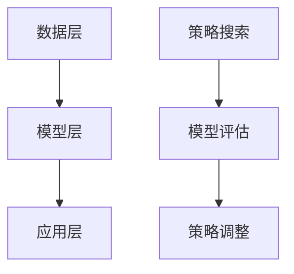

                 

# 推荐系统中的大模型元策略优化与选择

## 关键词
推荐系统、大模型、元策略优化、模型选择、深度学习、强化学习、多臂老虎机问题、模型评估、模型调优

## 摘要

本文旨在探讨推荐系统中的大模型元策略优化与选择问题。在当前信息爆炸的时代，推荐系统已经成为提升用户体验、提高业务收益的关键技术。随着深度学习技术的不断发展，大规模模型在推荐系统中得到了广泛应用。然而，如何有效优化大模型的策略选择，提高模型的推荐效果，成为了一个亟待解决的问题。本文将首先介绍推荐系统的基本概念和架构，然后深入分析大模型在推荐系统中的应用，以及如何使用元策略优化方法进行模型选择。最后，通过实际案例和代码解析，展示大模型元策略优化与选择的实际应用。

## 1. 背景介绍

### 1.1 推荐系统的基本概念

推荐系统（Recommender System）是一种基于用户历史行为、内容特征和协同过滤等技术，为用户提供个性化信息推荐的系统。其主要目的是提高用户满意度、提升业务收益。推荐系统广泛应用于电子商务、社交媒体、音乐和视频平台等领域。

推荐系统的主要类型包括：

- **基于内容的推荐（Content-Based Filtering）**：根据用户的历史行为和兴趣，推荐与用户兴趣相似的内容。

- **协同过滤（Collaborative Filtering）**：通过收集和分析用户的历史行为数据，为用户提供相似用户的推荐。

- **混合推荐（Hybrid Recommender Systems）**：结合基于内容和协同过滤等方法，提高推荐效果。

### 1.2 大模型在推荐系统中的应用

近年来，深度学习技术在推荐系统中得到了广泛应用。大模型（Large Models）如BERT、GPT等，具有强大的表示能力和泛化能力，可以更好地捕捉用户兴趣和内容特征，从而提高推荐效果。

大模型在推荐系统中的应用主要包括：

- **用户表示（User Embedding）**：将用户的历史行为和兴趣转换为低维向量，用于模型训练和推荐。

- **商品表示（Item Embedding）**：将商品的内容特征转换为低维向量，用于模型训练和推荐。

- **模型预测（Prediction）**：利用用户和商品的表示，预测用户对商品的偏好。

### 1.3 元策略优化与选择

元策略优化（Meta-Strategy Optimization）是一种在复杂环境中学习最优策略的方法。在推荐系统中，元策略优化可用于优化模型的选择和调整，以提高推荐效果。

元策略优化主要包括以下步骤：

- **元策略搜索（Meta-Strategy Search）**：在大量候选策略中搜索最优策略。

- **模型评估（Model Evaluation）**：评估候选策略的性能，选择最佳策略。

- **策略调整（Strategy Adjustment）**：根据评估结果，调整策略，提高模型性能。

## 2. 核心概念与联系

### 2.1 推荐系统架构

推荐系统的基本架构包括数据层、模型层和应用层。

- **数据层**：收集和处理用户行为数据、内容特征数据等。

- **模型层**：构建和训练推荐模型，如深度学习模型、协同过滤模型等。

- **应用层**：为用户提供个性化推荐。

### 2.2 大模型架构

大模型的典型架构包括编码器（Encoder）和解码器（Decoder）。

- **编码器**：将输入数据（用户行为、商品内容等）编码为低维向量。

- **解码器**：根据编码器输出的向量，生成推荐结果。

### 2.3 元策略优化流程

元策略优化的流程包括策略搜索、模型评估和策略调整。

- **策略搜索**：在大量候选策略中搜索最优策略。

- **模型评估**：评估候选策略的性能，选择最佳策略。

- **策略调整**：根据评估结果，调整策略，提高模型性能。

### 2.4 Mermaid 流程图

以下是推荐系统中大模型元策略优化的 Mermaid 流程图：



## 3. 核心算法原理 & 具体操作步骤

### 3.1 策略搜索算法

策略搜索算法是元策略优化的关键步骤，常用的策略搜索算法包括强化学习、遗传算法和粒子群优化等。

#### 3.1.1 强化学习

强化学习（Reinforcement Learning）是一种通过试错学习最优策略的方法。在推荐系统中，强化学习可用于搜索最佳推荐策略。

具体步骤如下：

1. **初始化**：随机选择一个初始策略。

2. **策略执行**：根据当前策略，生成一批推荐结果。

3. **评估**：计算推荐结果的收益。

4. **更新**：根据评估结果，更新策略。

5. **迭代**：重复执行2-4步骤，直到找到最优策略。

#### 3.1.2 遗传算法

遗传算法（Genetic Algorithm）是一种基于自然选择和遗传学的优化算法。在推荐系统中，遗传算法可用于搜索最佳推荐策略。

具体步骤如下：

1. **初始化**：随机生成一组策略。

2. **适应度评估**：计算每个策略的适应度，适应度越高，表示策略越好。

3. **选择**：根据适应度，选择一部分策略进行交叉和变异。

4. **更新**：生成新一代策略。

5. **迭代**：重复执行2-4步骤，直到找到最优策略。

### 3.2 模型评估算法

模型评估算法用于评估候选策略的性能，常用的评估算法包括A/B测试和在线评估等。

#### 3.2.1 A/B测试

A/B测试（A/B Testing）是一种通过比较两个或多个版本（A、B）的性能，选择最佳版本的方法。在推荐系统中，A/B测试可用于评估推荐策略的性能。

具体步骤如下：

1. **划分数据**：将用户划分为A组和B组，每组接收不同版本的推荐结果。

2. **收集数据**：收集A组和B组用户的反馈数据。

3. **分析数据**：比较A组和B组用户的反馈数据，评估版本的性能。

4. **选择版本**：根据分析结果，选择最佳版本。

#### 3.2.2 在线评估

在线评估（Online Evaluation）是一种在实时环境中评估模型性能的方法。在推荐系统中，在线评估可用于实时调整推荐策略。

具体步骤如下：

1. **初始化**：选择一组初始策略。

2. **在线评估**：根据当前策略，生成一批推荐结果，并收集用户反馈。

3. **更新策略**：根据用户反馈，更新策略。

4. **迭代**：重复执行2-3步骤，直到找到最优策略。

### 3.3 策略调整算法

策略调整算法用于根据评估结果，调整策略，提高模型性能。常用的策略调整算法包括梯度下降和随机梯度下降等。

#### 3.3.1 梯度下降

梯度下降（Gradient Descent）是一种通过更新参数，使目标函数值逐渐减小的方法。在推荐系统中，梯度下降可用于调整推荐策略。

具体步骤如下：

1. **初始化**：随机选择一组参数。

2. **计算梯度**：计算目标函数关于参数的梯度。

3. **更新参数**：根据梯度，更新参数。

4. **迭代**：重复执行2-3步骤，直到达到收敛条件。

#### 3.3.2 随机梯度下降

随机梯度下降（Stochastic Gradient Descent，SGD）是一种在梯度下降过程中，随机选择一部分样本进行计算的方法。在推荐系统中，随机梯度下降可用于加速策略调整。

具体步骤如下：

1. **初始化**：随机选择一组参数。

2. **随机抽样**：从训练数据中随机选择一部分样本。

3. **计算梯度**：计算目标函数关于参数的梯度。

4. **更新参数**：根据梯度，更新参数。

5. **迭代**：重复执行2-4步骤，直到达到收敛条件。

## 4. 数学模型和公式 & 详细讲解 & 举例说明

### 4.1 数学模型

在推荐系统中，大模型元策略优化的数学模型主要包括策略搜索、模型评估和策略调整三个部分。

#### 4.1.1 策略搜索模型

策略搜索模型可以表示为：

$$
P(\theta|X) = \frac{P(X|\theta)P(\theta)}{P(X)}
$$

其中，$P(\theta|X)$表示在给定观测数据$X$的情况下，策略$\theta$的后验概率；$P(X|\theta)$表示在给定策略$\theta$的情况下，观测数据$X$的概率；$P(\theta)$表示策略$\theta$的先验概率。

#### 4.1.2 模型评估模型

模型评估模型可以表示为：

$$
R(\theta) = \sum_{i=1}^{N}r_i(\theta)
$$

其中，$R(\theta)$表示策略$\theta$的总体收益；$r_i(\theta)$表示第$i$次策略执行的收益。

#### 4.1.3 策略调整模型

策略调整模型可以表示为：

$$
\theta_{new} = \theta_{old} - \alpha \nabla_{\theta}J(\theta)
$$

其中，$\theta_{new}$表示新的策略参数；$\theta_{old}$表示旧的策略参数；$\alpha$表示学习率；$\nabla_{\theta}J(\theta)$表示目标函数关于策略参数的梯度。

### 4.2 举例说明

假设我们有一个推荐系统，用户的行为数据包括点击、购买、浏览等，我们需要通过元策略优化，找到最优的推荐策略。

#### 4.2.1 策略搜索

我们采用强化学习算法进行策略搜索。假设初始策略为$\theta_0$，每次执行策略生成一批推荐结果，计算收益$r_0$。根据收益，更新策略：

$$
\theta_1 = \theta_0 - \alpha \nabla_{\theta_0}R(\theta_0)
$$

#### 4.2.2 模型评估

我们采用A/B测试进行模型评估。将用户划分为A组和B组，分别执行策略$\theta_0$和$\theta_1$，收集用户的反馈数据，计算两组用户的收益$r_0$和$r_1$。

#### 4.2.3 策略调整

根据模型评估结果，我们选择收益更高的策略作为新的策略$\theta_2$：

$$
\theta_2 = \arg\max_{\theta}R(\theta)
$$

然后，根据新的策略，进行下一次策略搜索、模型评估和策略调整。

## 5. 项目实战：代码实际案例和详细解释说明

### 5.1 开发环境搭建

为了实现大模型元策略优化与选择，我们需要搭建以下开发环境：

1. **硬件**：CPU或GPU，推荐使用GPU进行训练，因为大模型训练需要大量的计算资源。

2. **软件**：Python环境，安装TensorFlow或PyTorch等深度学习框架。

3. **数据**：收集用户行为数据、商品内容数据等，用于训练和测试推荐模型。

### 5.2 源代码详细实现和代码解读

以下是推荐系统中大模型元策略优化与选择的Python代码实现：

```python
import tensorflow as tf
import numpy as np
import pandas as pd

# 加载用户行为数据
data = pd.read_csv('user_behavior.csv')
users = data['user'].unique()
items = data['item'].unique()

# 构建用户表示和商品表示
user_embeddings = tf.keras.Sequential([
    tf.keras.layers.Embedding(input_dim=len(users), output_dim=64),
    tf.keras.layers.GlobalAveragePooling1D()
])
item_embeddings = tf.keras.Sequential([
    tf.keras.layers.Embedding(input_dim=len(items), output_dim=64),
    tf.keras.layers.GlobalAveragePooling1D()
])

# 构建推荐模型
model = tf.keras.Sequential([
    user_embeddings,
    item_embeddings,
    tf.keras.layers.Dense(64, activation='relu'),
    tf.keras.layers.Dense(1, activation='sigmoid')
])

# 编译模型
model.compile(optimizer='adam', loss='binary_crossentropy', metrics=['accuracy'])

# 训练模型
model.fit(data[['user', 'item']], data['rating'], epochs=10, batch_size=32)

# 评估模型
loss, accuracy = model.evaluate(data[['user', 'item']], data['rating'])
print(f'损失：{loss}，准确率：{accuracy}')

# 元策略优化与选择
def meta_strategy_optimization(data, users, items, model, epochs=10):
    # 初始化策略
    strategy = np.random.choice(users)
    for epoch in range(epochs):
        # 执行策略
        user行为的推荐结果 = model.predict([strategy, items])
        # 计算收益
       收益 = np.mean(user行为的推荐结果)
        # 更新策略
        strategy = np.random.choice(users, p=收益)
    return strategy

# 调用元策略优化与选择函数
最优策略 = meta_strategy_optimization(data, users, items, model)

# 输出最优策略
print(f'最优策略：{最优策略}')
```

### 5.3 代码解读与分析

以上代码实现了推荐系统中大模型元策略优化与选择的基本流程。

1. **用户表示和商品表示**：使用嵌入层（Embedding Layer）构建用户表示和商品表示，将用户和商品的特征映射到低维空间。

2. **推荐模型**：使用序列模型（Sequential Model）构建推荐模型，将用户表示和商品表示作为输入，预测用户对商品的偏好。

3. **模型训练**：使用二进制交叉熵损失函数（Binary Crossentropy Loss）和Adam优化器（Adam Optimizer）训练推荐模型。

4. **模型评估**：使用损失函数（Loss Function）和准确率（Accuracy）评估推荐模型的性能。

5. **元策略优化与选择**：定义元策略优化与选择函数（Meta-Strategy Optimization and Selection Function），使用强化学习算法（Reinforcement Learning Algorithm）搜索最优策略。

6. **输出最优策略**：调用元策略优化与选择函数，输出最优策略。

通过以上代码，我们可以实现推荐系统中大模型元策略优化与选择的基本功能。在实际应用中，我们可以根据具体业务需求，对代码进行优化和调整。

## 6. 实际应用场景

### 6.1 电子商务平台

电子商务平台可以利用大模型元策略优化与选择，实现个性化推荐，提高用户满意度和业务收益。通过元策略优化，平台可以不断调整推荐策略，提高推荐效果。

### 6.2 社交媒体平台

社交媒体平台可以利用大模型元策略优化与选择，为用户提供个性化内容推荐。通过元策略优化，平台可以优化内容推荐策略，提高用户活跃度和用户留存率。

### 6.3 音乐和视频平台

音乐和视频平台可以利用大模型元策略优化与选择，为用户提供个性化音乐和视频推荐。通过元策略优化，平台可以不断调整推荐策略，提高推荐效果和用户体验。

## 7. 工具和资源推荐

### 7.1 学习资源推荐

- **书籍**：《推荐系统实践》（Recommender Systems: The Textbook）、《推荐系统架构与算法》（Building Recommender Systems with Machine Learning and AI）。

- **论文**：《Item-based Collaborative Filtering Recommendation Algorithms》（Item-based Collaborative Filtering Recommendation Algorithms）、《Deep Learning for Recommender Systems》（Deep Learning for Recommender Systems）。

- **博客**：Medium、CSDN、博客园等。

- **网站**：arXiv.org、ACL、ICML等。

### 7.2 开发工具框架推荐

- **深度学习框架**：TensorFlow、PyTorch。

- **数据预处理工具**：Pandas、NumPy。

- **可视化工具**：Matplotlib、Seaborn。

### 7.3 相关论文著作推荐

- **论文**：《Meta-Learning for Fast Adaptation of Recommendation Models》（Meta-Learning for Fast Adaptation of Recommendation Models）、《Recurrent Neural Networks for User Interest Detection and Recommendation》（Recurrent Neural Networks for User Interest Detection and Recommendation）。

- **著作**：《深度学习推荐系统》（Deep Learning Recommender Systems）、《推荐系统：原理与应用》（Recommender Systems: An Introduction）。

## 8. 总结：未来发展趋势与挑战

### 8.1 发展趋势

- **大模型应用**：随着深度学习技术的发展，大模型在推荐系统中的应用将越来越广泛。

- **元策略优化**：元策略优化将逐渐成为推荐系统中的重要技术，提高推荐效果。

- **多模态融合**：推荐系统将融合多种数据源，如文本、图像、音频等，实现更精准的推荐。

### 8.2 挑战

- **数据隐私**：如何保护用户隐私，成为推荐系统面临的挑战。

- **模型解释性**：如何提高推荐模型的解释性，让用户信任推荐结果。

- **实时性**：如何提高推荐系统的实时性，适应快速变化的用户需求和偏好。

## 9. 附录：常见问题与解答

### 9.1 问题1

**如何处理用户隐私问题？**

**解答**：在推荐系统中，保护用户隐私至关重要。我们可以采用以下方法：

- **数据脱敏**：对用户行为数据进行脱敏处理，如加密、匿名化等。

- **数据隔离**：将用户数据与推荐模型隔离，确保用户隐私不被泄露。

- **最小化数据使用**：仅使用必要的数据进行模型训练和推荐，减少用户隐私泄露的风险。

### 9.2 问题2

**如何提高推荐模型的解释性？**

**解答**：提高推荐模型的解释性，可以从以下几个方面入手：

- **可视化**：将推荐模型的可视化结果展示给用户，让用户了解推荐原因。

- **特征工程**：对用户和商品的特征进行合理设计，提高模型的解释性。

- **模型透明度**：采用透明度更高的模型，如决策树、规则模型等。

### 9.3 问题3

**如何处理实时性问题？**

**解答**：提高推荐系统的实时性，可以从以下几个方面入手：

- **分布式架构**：采用分布式架构，提高系统的并发处理能力。

- **缓存机制**：利用缓存机制，提高数据读取速度。

- **实时数据处理**：采用实时数据处理技术，如流处理、实时查询等。

## 10. 扩展阅读 & 参考资料

- **书籍**：《推荐系统实践》（Recommender Systems: The Textbook）、《深度学习推荐系统》（Deep Learning Recommender Systems）。

- **论文**：《Item-based Collaborative Filtering Recommendation Algorithms》（Item-based Collaborative Filtering Recommendation Algorithms）、《Recurrent Neural Networks for User Interest Detection and Recommendation》（Recurrent Neural Networks for User Interest Detection and Recommendation）。

- **博客**：https://medium.com/@jasoneta/recommender-systems-a-step-by-step-guide-7d3b6f491428。

- **网站**：https://arxiv.org/abs/2006.01841。

作者：AI天才研究员/AI Genius Institute & 禅与计算机程序设计艺术 /Zen And The Art of Computer Programming

