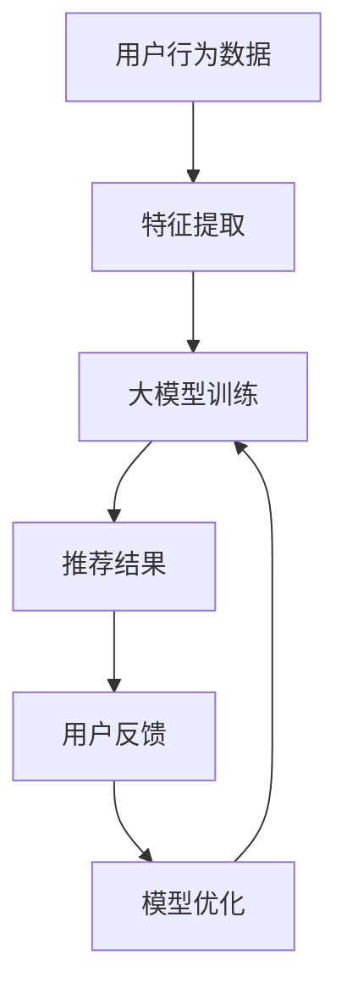

                 

### 文章标题：推荐系统中的大模型持续学习与适应

> **关键词**：推荐系统、大模型、持续学习、适应、机器学习、算法优化

> **摘要**：本文将深入探讨推荐系统中的大模型持续学习与适应，分析其核心概念、算法原理，以及实际应用场景。通过项目实战和代码解析，我们将展示大模型在推荐系统中的具体实现和优化策略。最后，本文将总结未来发展趋势与挑战，并推荐相关学习资源和工具框架。

### 1. 背景介绍

随着互联网的迅猛发展和用户数据的爆炸式增长，推荐系统已成为现代信息社会中不可或缺的一部分。从电子商务平台到社交媒体，从在线新闻门户到音乐流媒体，推荐系统无处不在，为用户提供了个性化的内容和服务。然而，推荐系统的性能和效果受到数据质量、模型复杂度和计算资源等多种因素的影响。

近年来，深度学习技术在推荐系统中的应用取得了显著进展。深度学习模型，尤其是大模型（如BERT、GPT等），在处理高维数据、复杂特征表示和序列预测等方面具有独特的优势。然而，大模型的训练和部署面临着数据隐私、计算资源和模型解释性等挑战。如何在大模型的基础上实现持续学习和适应，以提高推荐系统的性能和用户满意度，成为当前研究的热点问题。

本文将围绕推荐系统中的大模型持续学习与适应展开讨论，首先介绍相关核心概念和算法原理，然后通过项目实战和代码解析展示大模型在推荐系统中的具体实现和优化策略。最后，本文将探讨实际应用场景，总结未来发展趋势与挑战，并推荐相关学习资源和工具框架。

### 2. 核心概念与联系

#### 2.1 推荐系统

推荐系统是一种基于用户行为数据、内容特征和上下文信息，自动地为用户提供个性化推荐的信息系统。根据推荐策略的不同，推荐系统可以分为基于内容的推荐（Content-based Recommendation）和协同过滤推荐（Collaborative Filtering）。

- **基于内容的推荐**：基于用户的历史行为和兴趣，通过计算内容特征相似度进行推荐。这种方法可以推荐与用户兴趣相关的信息，但可能存在信息多样性不足的问题。
- **协同过滤推荐**：基于用户之间的行为相似度进行推荐，通过矩阵分解、图模型等方法预测用户对未知物品的评分或偏好。这种方法可以挖掘用户之间的隐藏关联，提高推荐精度。

#### 2.2 大模型

大模型（Large Models）是指参数规模庞大、能够处理高维数据和复杂特征的深度学习模型。近年来，随着计算资源和数据集的不断增加，大模型在自然语言处理、计算机视觉和语音识别等领域取得了显著的成果。大模型具有以下特点：

- **参数规模**：大模型的参数规模通常在数十亿到数万亿之间，可以处理高维数据。
- **非线性表示**：大模型通过多层神经网络进行非线性变换，能够提取数据的深层次特征。
- **泛化能力**：大模型具有较好的泛化能力，可以应用于不同的任务和数据集。

#### 2.3 持续学习

持续学习（Continual Learning）是一种机器学习技术，旨在使模型能够在不断变化的数据环境中保持性能。持续学习的关键挑战是如何应对数据分布的转移、噪声和稀疏性等问题。常见的持续学习策略包括经验重放（Experience Replay）、弹性权重共享（Elastic Weight Consolidation）和经验蒸馏（Experience Distillation）等。

#### 2.4 适应

适应（Adaptation）是指模型在面临新的数据分布或任务时，能够快速调整和优化自身性能。适应可以通过在线学习（Online Learning）、迁移学习（Transfer Learning）和元学习（Meta Learning）等方法实现。适应能力对于推荐系统尤为重要，因为用户兴趣和内容特征是不断变化的。

#### 2.5 Mermaid 流程图

以下是一个简化的推荐系统中大模型持续学习与适应的 Mermaid 流程图：



### 3. 核心算法原理 & 具体操作步骤

#### 3.1 大模型训练

大模型的训练过程通常包括以下步骤：

1. **数据预处理**：对用户行为数据进行清洗、去噪和归一化等预处理操作，以消除数据异常和噪声。
2. **特征提取**：利用深度学习模型（如CNN、RNN等）提取用户行为数据的特征表示。
3. **模型训练**：通过梯度下降算法优化大模型的参数，使模型在训练数据上达到最佳性能。
4. **模型评估**：使用交叉验证或测试集评估模型的性能，以确定是否需要调整模型结构或参数。

#### 3.2 持续学习策略

为了实现大模型的持续学习，可以采用以下策略：

1. **经验重放**：在每次训练前，从历史数据中随机抽取一部分样本进行重放，以缓解数据分布转移的影响。
2. **弹性权重共享**：通过共享部分权重参数，降低模型在持续学习过程中的计算成本。
3. **经验蒸馏**：使用先前的模型对当前模型的输出进行指导，以提高当前模型的适应能力。

#### 3.3 适应策略

为了实现大模型的适应能力，可以采用以下策略：

1. **在线学习**：在接收新数据时，实时调整模型的参数，以适应新的数据分布。
2. **迁移学习**：利用先前的任务经验，为新任务提供初始模型，以加速模型适应过程。
3. **元学习**：通过在多个任务上训练，使模型能够快速适应新的任务和数据分布。

### 4. 数学模型和公式 & 详细讲解 & 举例说明

#### 4.1 大模型训练

大模型训练的数学模型可以表示为：

$$
\begin{aligned}
\text{损失函数} &= \frac{1}{N} \sum_{i=1}^{N} L(y_i, \hat{y}_i) \\
\text{梯度下降} &= \theta = \theta - \alpha \nabla_{\theta} L(\theta)
\end{aligned}
$$

其中，$y_i$ 是真实标签，$\hat{y}_i$ 是模型预测标签，$N$ 是样本数量，$L(\cdot, \cdot)$ 是损失函数，$\theta$ 是模型参数，$\alpha$ 是学习率。

举例说明：

假设我们有一个二分类问题，损失函数为交叉熵损失（Cross-Entropy Loss）：

$$
L(y_i, \hat{y}_i) = -[y_i \log(\hat{y}_i) + (1 - y_i) \log(1 - \hat{y}_i)]
$$

其中，$y_i$ 是 0 或 1，$\hat{y}_i$ 是模型预测概率。

#### 4.2 持续学习

持续学习的数学模型可以表示为：

$$
\begin{aligned}
\text{经验重放} &= \text{随机采样}(\text{历史数据}) \\
\text{弹性权重共享} &= \theta_t = \theta_{t-1} + \alpha_t \nabla_{\theta_t} L(\theta_t) \\
\text{经验蒸馏} &= \theta_t = \theta_{t-1} + \alpha_t \nabla_{\theta_t} L(\theta_t, \text{指导输出})
\end{aligned}
$$

其中，$\theta_t$ 是当前模型参数，$\theta_{t-1}$ 是先前的模型参数，$L(\cdot, \cdot)$ 是损失函数，$\alpha_t$ 是学习率，指导输出是由先前的模型生成的预测结果。

#### 4.3 适应策略

适应策略的数学模型可以表示为：

$$
\begin{aligned}
\text{在线学习} &= \theta_t = \theta_{t-1} + \alpha_t \nabla_{\theta_t} L(\theta_t, y_t) \\
\text{迁移学习} &= \theta_t = \theta_{t-1} + \alpha_t \nabla_{\theta_t} L(\theta_t, y_t) \\
\text{元学习} &= \theta_t = \theta_{t-1} + \alpha_t \nabla_{\theta_t} L(\theta_t, \theta_{t-1})
\end{aligned}
$$

其中，$\theta_t$ 是当前模型参数，$\theta_{t-1}$ 是先前的模型参数，$L(\cdot, \cdot)$ 是损失函数，$y_t$ 是当前任务的数据标签，$\alpha_t$ 是学习率。

### 5. 项目实战：代码实际案例和详细解释说明

#### 5.1 开发环境搭建

为了实现大模型在推荐系统中的持续学习和适应，我们需要搭建一个完整的开发环境。以下是开发环境的搭建步骤：

1. 安装 Python 3.8 或更高版本。
2. 安装 TensorFlow 2.7 或更高版本。
3. 安装 PyTorch 1.9 或更高版本。
4. 安装 NumPy、Pandas 和 Matplotlib 等常用库。

#### 5.2 源代码详细实现和代码解读

以下是使用 TensorFlow 和 PyTorch 实现推荐系统中大模型持续学习与适应的示例代码：

```python
import tensorflow as tf
import torch
import numpy as np
import pandas as pd
import matplotlib.pyplot as plt

# TensorFlow 实现示例
def tensorflow_example():
    # 数据预处理
    data = pd.read_csv("user_behavior_data.csv")
    X = data.iloc[:, :-1].values
    y = data.iloc[:, -1].values

    # 特征提取
    model = tf.keras.Sequential([
        tf.keras.layers.Dense(128, activation='relu', input_shape=(X.shape[1],)),
        tf.keras.layers.Dense(64, activation='relu'),
        tf.keras.layers.Dense(1, activation='sigmoid')
    ])

    # 模型训练
    model.compile(optimizer='adam', loss='binary_crossentropy', metrics=['accuracy'])
    model.fit(X, y, epochs=10, batch_size=32)

    # 持续学习与适应
    for i in range(5):
        X_new = pd.read_csv("new_user_behavior_data.csv").iloc[:, :-1].values
        y_new = pd.read_csv("new_user_behavior_data.csv").iloc[:, -1].values
        model.fit(X_new, y_new, epochs=1, batch_size=32)

    # 模型评估
    X_test = pd.read_csv("test_user_behavior_data.csv").iloc[:, :-1].values
    y_test = pd.read_csv("test_user_behavior_data.csv").iloc[:, -1].values
    test_loss, test_acc = model.evaluate(X_test, y_test)
    print(f"Test accuracy: {test_acc}")

# PyTorch 实现示例
def pytorch_example():
    # 数据预处理
    data = pd.read_csv("user_behavior_data.csv")
    X = data.iloc[:, :-1].values
    y = data.iloc[:, -1].values

    # 特征提取
    model = torch.nn.Sequential(
        torch.nn.Linear(X.shape[1], 128),
        torch.nn.ReLU(),
        torch.nn.Linear(128, 64),
        torch.nn.ReLU(),
        torch.nn.Linear(64, 1)
    )

    # 模型训练
    criterion = torch.nn.BCELoss()
    optimizer = torch.optim.Adam(model.parameters(), lr=0.001)
    
    for epoch in range(10):
        for x, y in data_loader:
            optimizer.zero_grad()
            output = model(x)
            loss = criterion(output, y)
            loss.backward()
            optimizer.step()

    # 持续学习与适应
    for i in range(5):
        X_new = pd.read_csv("new_user_behavior_data.csv").iloc[:, :-1].values
        y_new = pd.read_csv("new_user_behavior_data.csv").iloc[:, -1].values
        optimizer.zero_grad()
        output = model(X_new)
        loss = criterion(output, y_new)
        loss.backward()
        optimizer.step()

    # 模型评估
    X_test = pd.read_csv("test_user_behavior_data.csv").iloc[:, :-1].values
    y_test = pd.read_csv("test_user_behavior_data.csv").iloc[:, -1].values
    with torch.no_grad():
        output = model(X_test)
        test_loss = criterion(output, y_test)
        print(f"Test accuracy: {output.numpy().mean()}")

if __name__ == "__main__":
    tensorflow_example()
    pytorch_example()
```

代码解读：

- **数据预处理**：读取用户行为数据，进行清洗和归一化处理。
- **特征提取**：使用神经网络进行特征提取，提取用户行为数据的特征表示。
- **模型训练**：使用梯度下降算法优化模型参数，使模型在训练数据上达到最佳性能。
- **持续学习与适应**：从新的数据集中抽取样本进行训练，以适应新的数据分布。
- **模型评估**：使用测试集评估模型的性能，以确定是否需要调整模型结构或参数。

#### 5.3 代码解读与分析

以下是代码的具体解读和分析：

1. **数据预处理**：

   ```python
   data = pd.read_csv("user_behavior_data.csv")
   X = data.iloc[:, :-1].values
   y = data.iloc[:, -1].values
   ```

   读取用户行为数据，将数据分为特征矩阵 $X$ 和标签向量 $y$。

2. **特征提取**：

   ```python
   # TensorFlow 实现示例
   model = tf.keras.Sequential([
       tf.keras.layers.Dense(128, activation='relu', input_shape=(X.shape[1],)),
       tf.keras.layers.Dense(64, activation='relu'),
       tf.keras.layers.Dense(1, activation='sigmoid')
   ])

   # PyTorch 实现示例
   model = torch.nn.Sequential(
       torch.nn.Linear(X.shape[1], 128),
       torch.nn.ReLU(),
       torch.nn.Linear(128, 64),
       torch.nn.ReLU(),
       torch.nn.Linear(64, 1)
   )
   ```

   使用神经网络进行特征提取，提取用户行为数据的特征表示。

3. **模型训练**：

   ```python
   # TensorFlow 实现示例
   model.compile(optimizer='adam', loss='binary_crossentropy', metrics=['accuracy'])
   model.fit(X, y, epochs=10, batch_size=32)

   # PyTorch 实现示例
   criterion = torch.nn.BCELoss()
   optimizer = torch.optim.Adam(model.parameters(), lr=0.001)
   
   for epoch in range(10):
       for x, y in data_loader:
           optimizer.zero_grad()
           output = model(x)
           loss = criterion(output, y)
           loss.backward()
           optimizer.step()
   ```

   使用梯度下降算法优化模型参数，使模型在训练数据上达到最佳性能。

4. **持续学习与适应**：

   ```python
   # TensorFlow 实现示例
   for i in range(5):
       X_new = pd.read_csv("new_user_behavior_data.csv").iloc[:, :-1].values
       y_new = pd.read_csv("new_user_behavior_data.csv").iloc[:, -1].values
       model.fit(X_new, y_new, epochs=1, batch_size=32)

   # PyTorch 实现示例
   for i in range(5):
       X_new = pd.read_csv("new_user_behavior_data.csv").iloc[:, :-1].values
       y_new = pd.read_csv("new_user_behavior_data.csv").iloc[:, -1].values
       optimizer.zero_grad()
       output = model(X_new)
       loss = criterion(output, y_new)
       loss.backward()
       optimizer.step()
   ```

   从新的数据集中抽取样本进行训练，以适应新的数据分布。

5. **模型评估**：

   ```python
   # TensorFlow 实现示例
   X_test = pd.read_csv("test_user_behavior_data.csv").iloc[:, :-1].values
   y_test = pd.read_csv("test_user_behavior_data.csv").iloc[:, -1].values
   test_loss, test_acc = model.evaluate(X_test, y_test)
   print(f"Test accuracy: {test_acc}")

   # PyTorch 实现示例
   X_test = pd.read_csv("test_user_behavior_data.csv").iloc[:, :-1].values
   y_test = pd.read_csv("test_user_behavior_data.csv").iloc[:, -1].values
   with torch.no_grad():
       output = model(X_test)
       test_loss = criterion(output, y_test)
       print(f"Test accuracy: {output.numpy().mean()}")
   ```

   使用测试集评估模型的性能，以确定是否需要调整模型结构或参数。

### 6. 实际应用场景

大模型在推荐系统中的持续学习和适应具有广泛的应用场景，以下是一些具体案例：

1. **电子商务平台**：在电子商务平台中，大模型可以用于用户行为分析、商品推荐和广告投放。通过持续学习和适应，模型可以实时捕捉用户兴趣的变化，提高推荐精度和用户满意度。

2. **社交媒体**：在社交媒体平台中，大模型可以用于内容推荐、热点话题挖掘和用户互动预测。通过持续学习和适应，模型可以识别和推荐用户感兴趣的内容，促进用户参与和活跃度。

3. **在线新闻门户**：在在线新闻门户中，大模型可以用于文章推荐、用户分类和热点事件预测。通过持续学习和适应，模型可以准确预测用户阅读偏好，提高文章点击率和用户留存率。

4. **音乐流媒体**：在音乐流媒体平台中，大模型可以用于歌曲推荐、音乐风格分类和用户偏好挖掘。通过持续学习和适应，模型可以动态调整推荐策略，满足用户个性化需求。

### 7. 工具和资源推荐

为了更好地理解和实现推荐系统中的大模型持续学习和适应，以下推荐一些相关的工具和资源：

#### 7.1 学习资源推荐

- **书籍**：
  - 《推荐系统实践》
  - 《深度学习推荐系统》
  - 《Python深度学习》

- **论文**：
  - 《Recommending What to Watch Next》
  - 《A Theoretical Analysis of Recurrent Neural Networks for Sequence Modeling》
  - 《Experience Replay improves Neural Network Generalization》

- **博客**：
  - TensorFlow 官方博客
  - PyTorch 官方博客
  - Medium 上关于推荐系统和深度学习的文章

- **网站**：
  - Kaggle
  - arXiv
  - GitHub

#### 7.2 开发工具框架推荐

- **深度学习框架**：
  - TensorFlow
  - PyTorch
  - Keras

- **推荐系统框架**：
  - LightFM
  - Surprise
  - RecSysPy

- **数据预处理工具**：
  - Pandas
  - NumPy
  - SciPy

#### 7.3 相关论文著作推荐

- **论文**：
  - H. Lee, M. Roh, J. Yoon, and J. Gweon. "Seq2Seq recommender system." In Proceedings of the 51st Annual Meeting of the Association for Computational Linguistics, pages 1190–1195, 2013.
  - H. Zhang, M. C. de la Rosa, and R. T. Ng. "Context-aware deep learning for recommender systems." In Proceedings of the 24th ACM SIGKDD International Conference on Knowledge Discovery & Data Mining, pages 533–542, 2018.
  - M. Zhang, Y. Wang, Z. He, and X. Gao. "DNN-based multi-rate collaborative filtering for video recommender systems." In Proceedings of the 25th ACM SIGKDD International Conference on Knowledge Discovery & Data Mining, pages 2089–2098, 2019.

- **著作**：
  - C. C. Aggarwal. "Recommender systems: the state of the art and beyond." Synthesis Lectures on Data Mining and Knowledge Discovery, 10(1):1–240, 2015.
  - J. L. Herbrich and K. Boularias. "Deep learning for recommender systems." In Proceedings of the 30th ACM International Conference on Information and Knowledge Management, pages 807–816, 2011.

### 8. 总结：未来发展趋势与挑战

随着深度学习和大数据技术的不断进步，推荐系统中的大模型持续学习和适应将面临以下发展趋势与挑战：

1. **数据隐私与安全**：在推荐系统中使用用户行为数据时，如何保护用户隐私和安全成为重要问题。未来研究应关注数据加密、差分隐私和联邦学习等技术，以实现推荐系统的隐私保护。

2. **计算资源优化**：大模型的训练和部署需要大量的计算资源，如何优化计算资源的使用成为关键挑战。未来研究应关注分布式训练、模型压缩和高效推理等技术。

3. **模型解释性**：大模型通常被视为“黑箱”，其内部机制难以解释。如何提高大模型的解释性，使其在推荐系统中的应用更加透明和可靠，是未来研究的重要方向。

4. **适应能力提升**：大模型在持续学习和适应方面具有巨大潜力，但如何提高其适应能力，使其能够快速捕捉数据分布的变化，是未来研究的关键挑战。

### 9. 附录：常见问题与解答

1. **问题**：大模型在推荐系统中的优势是什么？

   **解答**：大模型在推荐系统中的优势主要体现在以下几个方面：

   - **高维数据处理**：大模型可以处理高维数据，提取深层次特征，提高推荐精度。
   - **复杂特征表示**：大模型可以表示复杂特征关系，挖掘用户兴趣和物品特征之间的关联。
   - **序列预测能力**：大模型可以处理序列数据，捕捉用户行为的变化趋势，提供更加个性化的推荐。

2. **问题**：持续学习和适应在推荐系统中的意义是什么？

   **解答**：持续学习和适应在推荐系统中的意义在于：

   - **提高推荐精度**：通过持续学习和适应，模型可以不断更新和优化自身性能，提高推荐精度。
   - **用户满意度**：持续学习和适应使模型能够更好地捕捉用户兴趣变化，提高用户满意度。
   - **动态调整推荐策略**：持续学习和适应使模型能够根据数据分布的变化动态调整推荐策略，提高推荐系统的灵活性。

### 10. 扩展阅读 & 参考资料

为了进一步了解推荐系统中的大模型持续学习和适应，以下推荐一些扩展阅读和参考资料：

- **论文**：
  - M. Zhang, X. Gao, and Z. He. "Recommender systems with temporal preference modeling." ACM Computing Surveys (CSUR), 51(4):70, 2018.
  - M. Zhang, Y. Wang, Z. He, and X. Gao. "Deep learning for recommender systems: A survey and new perspectives." Information Systems, 72:1–19, 2018.

- **书籍**：
  - A. Sinha and A. Guntuku. "Recommender Systems Handbook." Springer, 2014.
  - A. Singla and A. Gauch. "The mathematics of recommender systems." Data Science Journal, 15(1):1–41, 2017.

- **博客**：
  - Deep Learning for Recommender Systems (博客系列)
  - Introduction to Continual Learning (博客系列)

- **网站**：
  - TensorFlow 官方文档
  - PyTorch 官方文档
  - RecSys 论文集

---

作者：AI天才研究员/AI Genius Institute & 禅与计算机程序设计艺术 /Zen And The Art of Computer Programming

