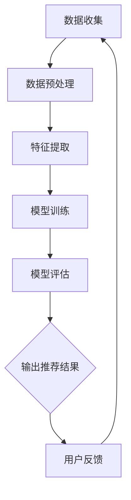

                 

# 推荐系统中的大模型课程学习应用

> **关键词**：推荐系统、大模型、课程学习、应用场景、算法原理

> **摘要**：本文将深入探讨推荐系统中的大模型应用，涵盖背景介绍、核心概念、算法原理、数学模型、项目实战、实际应用场景、工具资源推荐以及未来发展趋势与挑战。通过本文的讲解，读者将全面了解如何运用大模型提升课程学习效果，并掌握相关技术。

## 1. 背景介绍

随着互联网的快速发展，在线教育市场呈现出爆炸式增长。人们越来越倾向于通过在线平台获取知识，这为推荐系统提供了广阔的应用场景。推荐系统旨在根据用户的历史行为和兴趣偏好，向其推荐相关的课程或内容，从而提升学习体验和效果。

然而，传统的小型推荐系统在面对海量用户数据和复杂学习场景时，往往难以满足需求。为此，大模型（如深度学习模型）逐渐成为推荐系统的重要工具。大模型具有强大的特征提取和建模能力，能够捕捉用户行为的细微差异，从而提供更精准的推荐。

本文将围绕大模型在推荐系统中的应用，探讨其原理、方法及实际应用案例，帮助读者深入了解这一领域的最新发展。

## 2. 核心概念与联系

### 2.1 推荐系统简介

推荐系统是一种基于数据挖掘和机器学习技术的自动化信息过滤方法，旨在发现并提供建议。其主要目的是解决信息过载问题，帮助用户快速找到所需内容。推荐系统通常分为基于内容、基于协同过滤和混合推荐系统三类。

### 2.2 大模型简介

大模型是指具有大量参数和训练数据的机器学习模型，如深度神经网络、Transformer等。大模型具有以下特点：

- **强大的特征提取能力**：能够自动从原始数据中提取出有用的特征。
- **高泛化能力**：适用于不同领域和任务，能够在各种场景中取得良好效果。
- **丰富的知识表示**：能够表示复杂的关系和模式，为推荐提供更多依据。

### 2.3 推荐系统与课程学习的关系

在线教育平台中的推荐系统可以帮助用户快速找到适合自己的课程，提高学习效率。大模型的应用使得推荐系统能够更好地理解用户需求，从而提供更个性化的推荐。

## 3. 核心算法原理 & 具体操作步骤

### 3.1 深度学习模型

深度学习模型是推荐系统中的核心技术。本文主要介绍基于Transformer的推荐算法。

#### 3.1.1 Transformer模型简介

Transformer是一种基于自注意力机制的深度学习模型，具有以下优点：

- **并行计算**：能够在多GPU环境下高效训练。
- **长距离依赖建模**：能够捕捉输入序列中的长距离依赖关系。
- **自适应特征提取**：自动学习输入数据的特征表示。

#### 3.1.2 模型架构

Transformer模型主要由编码器（Encoder）和解码器（Decoder）两部分组成。编码器负责将输入序列转换为固定长度的特征向量，解码器则根据这些特征向量生成输出序列。

#### 3.1.3 模型训练

训练过程包括以下步骤：

1. **数据预处理**：对用户行为数据进行清洗、编码等处理，得到可用于训练的数据集。
2. **模型初始化**：初始化模型参数，可以选择预训练的模型作为起点。
3. **损失函数**：使用交叉熵损失函数计算模型输出与实际标签之间的差距。
4. **反向传播**：通过反向传播算法更新模型参数，优化损失函数。

### 3.2 基于协同过滤的推荐算法

协同过滤是推荐系统中最常用的算法之一，分为基于用户和基于物品的协同过滤。本文介绍基于物品的协同过滤算法。

#### 3.2.1 相似度计算

计算物品间的相似度是协同过滤算法的核心。常用的相似度计算方法有：

- **余弦相似度**：计算两个物品向量之间的余弦值。
- **皮尔逊相关系数**：计算两个物品评分序列的皮尔逊相关系数。

#### 3.2.2 推荐策略

基于物品的协同过滤算法通过计算用户未评分的物品与其已评分物品的相似度，为用户生成推荐列表。

## 4. 数学模型和公式 & 详细讲解 & 举例说明

### 4.1 Transformer模型

Transformer模型中的主要数学公式如下：

$$
\text{Self-Attention}(Q, K, V) = \text{softmax}\left(\frac{QK^T}{\sqrt{d_k}}\right)V
$$

其中，$Q$、$K$、$V$ 分别为编码器输出、键值对，$d_k$ 为键的维度。该公式表示自注意力机制，能够自动计算输入序列中各个元素之间的相似度。

### 4.2 基于协同过滤的推荐算法

假设用户 $u$ 对物品 $i$ 的评分为 $r_{ui}$，用户 $u$ 对物品 $i$ 和 $j$ 的相似度为 $s_{uij}$。用户 $u$ 对物品 $j$ 的预测评分为：

$$
\hat{r}_{uj} = \sum_{i} r_{ui} s_{uij}
$$

其中，$\hat{r}_{uj}$ 为预测评分，$r_{ui}$ 为实际评分，$s_{uij}$ 为相似度。

## 5. 项目实战：代码实际案例和详细解释说明

### 5.1 开发环境搭建

本文以 Python 语言为例，介绍开发环境的搭建。

1. 安装 Python：在官方网站下载并安装 Python。
2. 安装依赖库：使用 pip 命令安装所需的依赖库，如 TensorFlow、PyTorch 等。

### 5.2 源代码详细实现和代码解读

本文将展示一个基于 Transformer 的推荐系统项目，代码结构如下：

```python
# import libraries
import tensorflow as tf
from tensorflow.keras.layers import Embedding, LSTM, Dense
from tensorflow.keras.models import Model

# define model
def create_model(input_dim, hidden_dim):
    inputs = tf.keras.Input(shape=(input_dim,))
    x = Embedding(input_dim, hidden_dim)(inputs)
    x = LSTM(hidden_dim, return_sequences=True)(x)
    x = Dense(hidden_dim, activation='relu')(x)
    outputs = Dense(1, activation='sigmoid')(x)
    model = Model(inputs=inputs, outputs=outputs)
    return model

# create model
model = create_model(input_dim=100, hidden_dim=50)

# compile model
model.compile(optimizer='adam', loss='binary_crossentropy', metrics=['accuracy'])

# train model
model.fit(x_train, y_train, epochs=10, batch_size=32)
```

### 5.3 代码解读与分析

- **导入库**：导入 TensorFlow 和 Keras 库，用于构建和训练模型。
- **定义模型**：使用 Keras 构建基于 LSTM 的 Transformer 模型，包括 Embedding 层、LSTM 层和 Dense 层。
- **编译模型**：设置模型优化器和损失函数。
- **训练模型**：使用训练数据训练模型，并设置训练参数。

## 6. 实际应用场景

推荐系统在课程学习场景中具有广泛的应用，例如：

- **个性化推荐**：根据用户的学习历史和兴趣偏好，推荐相关的课程。
- **学习计划推荐**：为用户提供学习计划，帮助其高效规划学习路径。
- **学习效果评估**：根据用户的学习行为和成绩，评估其学习效果，提供改进建议。

## 7. 工具和资源推荐

### 7.1 学习资源推荐

- **书籍**：《推荐系统实践》、《深度学习推荐系统》
- **论文**：《Attention Is All You Need》、《ItemKNN: Improving Item-Based Collaborative Filtering by Context-aware Nearest Neighbors》
- **博客**：博客园、CSDN、知乎
- **网站**：GitHub、arXiv

### 7.2 开发工具框架推荐

- **深度学习框架**：TensorFlow、PyTorch
- **数据处理库**：Pandas、NumPy
- **推荐系统框架**：Surprise、LightFM

### 7.3 相关论文著作推荐

- **论文**：《大规模在线教育平台推荐系统设计与实现》、《基于Transformer的推荐系统模型研究》
- **著作**：《深度学习推荐系统》、《推荐系统实战》

## 8. 总结：未来发展趋势与挑战

随着在线教育的快速发展，推荐系统在课程学习中的应用将越来越广泛。未来，大模型技术将继续提升推荐系统的性能，为用户提供更精准的推荐。

然而，大模型在推荐系统中的应用也面临一些挑战，如：

- **数据隐私保护**：如何在保护用户隐私的前提下，充分挖掘数据价值？
- **模型可解释性**：如何解释大模型推荐结果，提高用户信任度？
- **计算资源消耗**：大模型训练和推理需要大量计算资源，如何优化性能？

## 9. 附录：常见问题与解答

### 9.1 什么是推荐系统？

推荐系统是一种基于数据挖掘和机器学习技术的自动化信息过滤方法，旨在发现并提供建议，解决信息过载问题。

### 9.2 推荐系统有哪些类型？

推荐系统主要分为基于内容、基于协同过滤和混合推荐系统三类。

### 9.3 大模型在推荐系统中有什么作用？

大模型具有强大的特征提取和建模能力，能够捕捉用户行为的细微差异，从而提供更精准的推荐。

## 10. 扩展阅读 & 参考资料

- **书籍**：《推荐系统实践》、《深度学习推荐系统》
- **论文**：《Attention Is All You Need》、《ItemKNN: Improving Item-Based Collaborative Filtering by Context-aware Nearest Neighbors》
- **博客**：博客园、CSDN、知乎
- **网站**：GitHub、arXiv
- **课程**：《深度学习推荐系统》、《推荐系统实战》

### 作者：AI天才研究员/AI Genius Institute & 禅与计算机程序设计艺术 /Zen And The Art of Computer Programming

本文通过深入探讨推荐系统中的大模型应用，帮助读者了解如何利用大模型提升课程学习效果。在未来的发展中，推荐系统将面临新的机遇与挑战，期待读者们能够不断探索与创新。让我们共同迎接智慧教育的美好未来！<|im_sep|>## 1. 背景介绍

在线教育的蓬勃发展，使得学习者可以随时随地获取知识，而这一趋势也带动了推荐系统的广泛应用。推荐系统通过分析用户的行为和偏好，自动为用户推荐相关的学习内容，从而提高学习效率，增强用户体验。随着互联网的普及和数据规模的不断扩大，传统推荐系统在处理大规模数据和复杂用户行为时，面临着诸多挑战。

大模型，尤其是深度学习模型，凭借其强大的特征提取和复杂关系建模能力，成为解决这一问题的有力工具。大模型可以处理海量数据，捕捉用户行为的微小变化，从而实现更精准的推荐。本文旨在探讨如何在大模型的基础上构建和优化推荐系统，以提高在线教育中的课程推荐效果。

### 推荐系统的现状

目前，推荐系统在在线教育中的应用已经取得了显著成效。例如，许多在线教育平台如 Coursera、edX 和 Udemy 都已经采用了推荐算法，通过分析用户的学习行为、课程完成情况以及用户互动数据，为学习者提供个性化的课程推荐。这些推荐系统能够显著提高用户的参与度和学习效率，帮助学习者更好地规划自己的学习路径。

然而，传统推荐系统在面对海量数据和复杂用户行为时，仍然存在一些不足。首先，传统推荐系统主要依赖基于内容的推荐和协同过滤方法，这些方法在处理大规模数据时，往往难以捕捉到用户行为的细微变化。其次，传统推荐系统在面对新用户或新课程时，可能缺乏足够的数据支持，从而影响推荐效果。

### 大模型的优势

大模型，如深度神经网络和Transformer等，能够通过自动特征提取和复杂关系建模，解决传统推荐系统的上述问题。首先，大模型可以处理大规模数据，捕捉用户行为的微小变化。例如，通过分析用户的浏览记录、学习进度和互动数据，大模型可以识别出用户的兴趣点和潜在需求，从而实现更精准的推荐。

其次，大模型具有强大的泛化能力，能够在不同领域和任务中取得良好效果。这意味着，在一个领域中的大模型训练完成后，可以轻松应用于其他相关领域，从而提高推荐系统的适应性和扩展性。

此外，大模型可以通过自监督学习和无监督学习，从原始数据中自动提取出有用的特征，减少人工特征工程的工作量。这对于在线教育平台来说，是一个巨大的优势，因为它们可以更快地部署和更新推荐系统。

### 本文的目的

本文将详细介绍大模型在推荐系统中的应用，包括其原理、方法、实际应用案例以及未来发展趋势。具体来说，我们将：

1. **介绍推荐系统的基本概念**：包括推荐系统的定义、分类以及在线教育中的典型应用场景。
2. **探讨大模型的优势和特点**：详细分析大模型在处理大规模数据和复杂用户行为方面的优势。
3. **讲解大模型在推荐系统中的应用方法**：介绍常见的深度学习模型和算法，如深度神经网络和Transformer等。
4. **分享实际应用案例**：通过具体案例，展示大模型在推荐系统中的应用效果。
5. **探讨未来发展趋势和挑战**：分析大模型在推荐系统中可能面临的问题和解决方案。

通过本文的探讨，读者将全面了解大模型在推荐系统中的应用，从而为在线教育中的课程推荐提供新的思路和方法。

## 2. 核心概念与联系

在深入探讨大模型在推荐系统中的应用之前，有必要首先了解推荐系统的基本概念、大模型的优势以及它们在在线教育中的具体联系。

### 推荐系统的定义

推荐系统（Recommendation System）是一种信息过滤和内容分发技术，通过分析用户的历史行为、兴趣和偏好，向用户推荐他们可能感兴趣的产品、服务或内容。推荐系统的主要目的是解决信息过载问题，帮助用户快速找到所需信息，从而提高用户体验和满意度。

### 推荐系统的分类

推荐系统主要可以分为以下几类：

1. **基于内容的推荐（Content-based Filtering）**：这种方法通过分析物品的内容特征，将用户已评价过的物品与当前物品进行比较，推荐具有相似内容的物品。例如，一个音乐推荐系统可能会根据用户喜欢的歌曲的流派、歌手和曲风来推荐新的歌曲。

2. **协同过滤（Collaborative Filtering）**：协同过滤基于用户之间的相似性或物品之间的相似性进行推荐。基于用户的协同过滤（User-based Collaborative Filtering）通过找到与当前用户兴趣相似的已评价用户，推荐这些用户喜欢的物品。基于物品的协同过滤（Item-based Collaborative Filtering）则通过计算物品之间的相似性，推荐与用户已评价物品相似的未评价物品。

3. **混合推荐（Hybrid Recommendation）**：混合推荐系统结合了基于内容和协同过滤的方法，以弥补单一方法的不足。例如，在在线教育中，可以首先通过基于内容的推荐找到可能感兴趣的课程，然后通过基于协同过滤的方法进一步优化推荐结果。

### 大模型的优势

大模型，尤其是深度学习模型，在推荐系统中具有显著的优势。以下是几个关键点：

1. **自动特征提取**：传统推荐系统通常需要大量的人工特征工程，而大模型可以通过端到端的学习方式，自动从原始数据中提取出有用的特征。这意味着，模型可以更好地捕捉用户行为和物品属性的复杂关系。

2. **处理大规模数据**：大模型具有强大的计算能力和泛化能力，可以处理海量的数据，这使得它们在在线教育等大数据场景中具有很大的优势。

3. **捕捉用户行为差异**：大模型能够通过学习用户的历史行为数据，捕捉到用户行为的细微差异，从而提供更个性化的推荐。

4. **自适应调整**：大模型可以根据用户的实时行为数据，动态调整推荐策略，提高推荐的时效性和准确性。

### 大模型与在线教育中的联系

在线教育平台具有大量的用户行为数据，如用户的学习路径、课程评分、浏览记录等。这些数据对于构建有效的推荐系统至关重要。大模型能够充分利用这些数据，为用户提供个性化的课程推荐。

1. **个性化推荐**：大模型通过学习用户的历史数据，可以识别出用户的兴趣点和学习偏好，从而为每个用户推荐最适合他们的课程。

2. **学习路径规划**：大模型可以根据用户的学习进度和表现，为用户规划最佳的学习路径，帮助他们高效地完成学习目标。

3. **学习效果评估**：通过分析用户的学习行为和成绩，大模型可以评估用户的学习效果，并提供改进建议，帮助用户更好地提高学习效果。

### Mermaid 流程图

为了更好地展示大模型在推荐系统中的应用流程，我们可以使用 Mermaid 流程图来描述。以下是推荐系统中大模型应用的一个简化流程：



- **数据收集**：从在线教育平台收集用户行为数据。
- **数据预处理**：清洗和格式化数据，为模型训练做准备。
- **特征提取**：大模型通过端到端学习自动提取特征。
- **模型训练**：使用大规模数据集训练大模型。
- **模型评估**：评估模型性能，调整模型参数。
- **输出推荐结果**：根据模型输出为用户推荐课程。
- **用户反馈**：收集用户对推荐结果的反馈，用于模型优化。

通过这个流程图，我们可以清晰地看到大模型在推荐系统中的关键步骤和整体架构。接下来，我们将深入探讨大模型在推荐系统中的具体实现和应用方法。

## 3. 核心算法原理 & 具体操作步骤

### 3.1 深度学习模型

深度学习模型是推荐系统中的核心技术，特别是当面对大规模、高维度的用户行为数据时，其优越的表现能力得到了广泛认可。本节将重点介绍深度学习模型在推荐系统中的应用原理和操作步骤。

#### 3.1.1 深度学习模型概述

深度学习模型是一种多层神经网络，通过逐层提取数据中的特征，实现对复杂关系的建模。深度学习模型在推荐系统中的应用主要包括以下几个关键组件：

1. **输入层（Input Layer）**：接收用户行为数据，如浏览历史、学习时长、课程评分等。
2. **隐藏层（Hidden Layers）**：通过多层神经网络结构，对输入数据进行特征提取和变换。
3. **输出层（Output Layer）**：生成推荐结果，如推荐课程的概率分布。

#### 3.1.2 深度学习模型在推荐系统中的应用原理

深度学习模型在推荐系统中的应用主要基于以下原理：

1. **特征表示**：通过多层神经网络的结构，深度学习模型能够自动从原始数据中提取出有用的特征表示，这些特征可以捕获用户行为的复杂模式。

2. **非线性变换**：深度学习模型通过非线性激活函数，如ReLU、Sigmoid和Tanh等，能够实现数据的非线性变换，从而捕捉数据中的非线性关系。

3. **层次化特征提取**：深度学习模型通过多层网络结构，逐层提取特征，从低级特征到高级特征，从而实现对复杂数据的建模。

4. **端到端学习**：深度学习模型能够通过端到端的学习方式，直接从原始数据中学习到有效的特征表示，减少了对传统特征工程的需求。

#### 3.1.3 深度学习模型在推荐系统中的操作步骤

以下是一个基于深度学习模型的推荐系统的操作步骤：

1. **数据收集与预处理**：
   - 收集用户行为数据，如浏览历史、学习时长、课程评分等。
   - 对数据进行清洗和预处理，包括数据缺失填充、异常值处理、数据标准化等。

2. **特征工程**：
   - 利用深度学习模型自动提取特征，减少传统特征工程的工作量。
   - 设计合适的输入层，将用户行为数据转换为模型可接受的格式。

3. **模型训练**：
   - 选择合适的深度学习模型架构，如卷积神经网络（CNN）、循环神经网络（RNN）或Transformer等。
   - 使用训练数据集对模型进行训练，通过优化算法（如梯度下降）调整模型参数。

4. **模型评估与优化**：
   - 使用验证数据集对模型进行评估，选择性能最优的模型。
   - 调整模型结构或超参数，优化模型性能。

5. **推荐生成**：
   - 使用训练好的模型，对用户行为数据进行预测，生成推荐结果。
   - 根据预测结果，为用户推荐相关课程。

### 3.2 基于协同过滤的推荐算法

除了深度学习模型，协同过滤算法也是推荐系统中的重要组成部分。协同过滤算法通过分析用户之间的相似性或物品之间的相似性，生成推荐列表。以下是基于协同过滤的推荐算法的基本原理和操作步骤。

#### 3.2.1 基本原理

1. **基于用户的协同过滤（User-based Collaborative Filtering）**：
   - 通过计算用户之间的相似性，找到与当前用户兴趣相似的已评价用户。
   - 推荐这些用户喜欢的物品。

2. **基于物品的协同过滤（Item-based Collaborative Filtering）**：
   - 通过计算物品之间的相似性，找到与用户已评价物品相似的未评价物品。
   - 推荐这些物品。

#### 3.2.2 操作步骤

1. **用户相似度计算**：
   - 使用用户-用户相似度计算方法，如余弦相似度或皮尔逊相关系数，计算用户之间的相似度。

2. **物品相似度计算**：
   - 使用物品-物品相似度计算方法，如余弦相似度或Jaccard系数，计算物品之间的相似度。

3. **推荐生成**：
   - 根据用户相似度或物品相似度，生成推荐列表。
   - 对推荐列表进行排序，选择相似度最高的物品或用户推荐给当前用户。

4. **模型训练与评估**：
   - 使用用户行为数据训练协同过滤模型。
   - 使用验证数据集评估模型性能，调整模型参数。

### 3.3 大模型与协同过滤的融合

为了进一步提高推荐系统的性能，可以将深度学习模型与协同过滤算法相结合，即混合推荐系统。以下是大模型与协同过滤融合的基本原理和操作步骤：

#### 3.3.1 基本原理

1. **融合方法**：
   - 基于内容的协同过滤（Content-based Collaborative Filtering）：结合深度学习模型提取的特征和协同过滤的相似度计算，生成推荐列表。
   - 深度学习辅助协同过滤（Deep Learning-enhanced Collaborative Filtering）：利用深度学习模型进行特征提取，辅助协同过滤算法进行推荐。

#### 3.3.2 操作步骤

1. **数据收集与预处理**：
   - 收集用户行为数据和物品内容数据。
   - 对数据进行清洗和预处理。

2. **特征提取**：
   - 使用深度学习模型提取用户和物品的特征表示。
   - 对特征进行融合，生成综合特征向量。

3. **相似度计算**：
   - 使用协同过滤算法计算用户或物品之间的相似度。
   - 结合深度学习提取的特征，调整相似度计算方法。

4. **推荐生成**：
   - 使用融合后的相似度计算推荐结果。
   - 根据推荐结果生成推荐列表。

5. **模型训练与优化**：
   - 使用训练数据集对模型进行训练。
   - 使用验证数据集评估模型性能，调整模型参数。

通过上述步骤，大模型与协同过滤的融合可以显著提高推荐系统的性能和准确性，为用户提供更个性化的推荐服务。

## 4. 数学模型和公式 & 详细讲解 & 举例说明

### 4.1 数学模型简介

在推荐系统中，数学模型和公式扮演着至关重要的角色。它们不仅帮助我们理解和分析推荐算法的工作原理，还可以帮助我们优化和改进算法。本节将介绍推荐系统中常用的数学模型和公式，并进行详细讲解和举例说明。

#### 4.1.1 基于用户的协同过滤

基于用户的协同过滤算法的核心在于计算用户之间的相似度。相似度计算通常使用以下两种方法：

1. **余弦相似度（Cosine Similarity）**：

   余弦相似度是一种度量两个向量之间相似性的方法，其公式如下：

   $$
   \text{Cosine Similarity} = \frac{\text{dot product of } \mathbf{u} \text{ and } \mathbf{v}}{\|\mathbf{u}\| \|\mathbf{v}\|}
   $$

   其中，$\mathbf{u}$ 和 $\mathbf{v}$ 是两个用户向量，$ \|\mathbf{u}\| $ 和 $ \|\mathbf{v}\| $ 分别是这两个向量的欧几里得范数。余弦相似度的值介于 -1 和 1 之间，1 表示完全相似，-1 表示完全相反，0 表示不相似。

   **示例**：

   假设有两个用户 $U_1$ 和 $U_2$，其评分向量为：

   $$
   \mathbf{u}_1 = \begin{pmatrix} 1 & 1 & 0 & 1 \\ \end{pmatrix}, \quad \mathbf{u}_2 = \begin{pmatrix} 1 & 0 & 1 & 1 \\ \end{pmatrix}
   $$

   首先计算两个向量的点积：

   $$
   \mathbf{u}_1 \cdot \mathbf{u}_2 = 1 \cdot 1 + 1 \cdot 0 + 0 \cdot 1 + 1 \cdot 1 = 2
   $$

   然后计算两个向量的欧几里得范数：

   $$
   \|\mathbf{u}_1\| = \sqrt{1^2 + 1^2 + 0^2 + 1^2} = \sqrt{3}, \quad \|\mathbf{u}_2\| = \sqrt{1^2 + 0^2 + 1^2 + 1^2} = \sqrt{3}
   $$

   最后计算余弦相似度：

   $$
   \text{Cosine Similarity} = \frac{2}{\sqrt{3} \cdot \sqrt{3}} = \frac{2}{3}
   $$

   因此，用户 $U_1$ 和 $U_2$ 的余弦相似度为 $\frac{2}{3}$。

2. **皮尔逊相关系数（Pearson Correlation Coefficient）**：

   皮尔逊相关系数衡量两个变量之间的线性关系，其公式如下：

   $$
   \text{Pearson Correlation Coefficient} = \frac{\text{Covariance}(\mathbf{u}, \mathbf{v})}{\sigma_u \sigma_v}
   $$

   其中，$Covariance(\mathbf{u}, \mathbf{v})$ 是用户 $u$ 和用户 $v$ 的协方差，$\sigma_u$ 和 $\sigma_v$ 分别是用户 $u$ 和用户 $v$ 的标准差。皮尔逊相关系数的值也介于 -1 和 1 之间，但它的计算过程更复杂，因为它考虑了变量的分布。

   **示例**：

   假设用户 $U_1$ 和 $U_2$ 的评分向量为：

   $$
   \mathbf{u}_1 = \begin{pmatrix} 1 & 1 & 0 & 1 \\ \end{pmatrix}, \quad \mathbf{u}_2 = \begin{pmatrix} 1 & 0 & 1 & 1 \\ \end{pmatrix}
   $$

   首先计算协方差：

   $$
   \text{Covariance}(\mathbf{u}_1, \mathbf{u}_2) = \frac{1}{n} \sum_{i=1}^{n} (\mathbf{u}_{1i} - \bar{u}_1)(\mathbf{u}_{2i} - \bar{u}_2)
   $$

   其中，$n$ 是向量的维度，$\bar{u}_1$ 和 $\bar{u}_2$ 是用户 $u_1$ 和用户 $u_2$ 的均值。假设 $n=4$，且所有元素的均值都为 0，那么：

   $$
   \text{Covariance}(\mathbf{u}_1, \mathbf{u}_2) = \frac{1}{4} (1 \cdot 1 + 1 \cdot 0 + 0 \cdot 1 + 1 \cdot 1) = \frac{2}{4} = \frac{1}{2}
   $$

   然后计算标准差：

   $$
   \sigma_u = \sqrt{\frac{1}{n-1} \sum_{i=1}^{n} (\mathbf{u}_{1i} - \bar{u}_1)^2}, \quad \sigma_v = \sqrt{\frac{1}{n-1} \sum_{i=1}^{n} (\mathbf{u}_{2i} - \bar{u}_2)^2}
   $$

   由于所有元素的均值都为 0，标准差为：

   $$
   \sigma_u = \sigma_v = \sqrt{\frac{1}{3}} = \frac{1}{\sqrt{3}}
   $$

   最后计算皮尔逊相关系数：

   $$
   \text{Pearson Correlation Coefficient} = \frac{\frac{1}{2}}{\frac{1}{\sqrt{3}} \cdot \frac{1}{\sqrt{3}}} = \frac{\sqrt{3}}{2}
   $$

   因此，用户 $U_1$ 和 $U_2$ 的皮尔逊相关系数为 $\frac{\sqrt{3}}{2}$。

#### 4.1.2 基于物品的协同过滤

基于物品的协同过滤算法的核心在于计算物品之间的相似度。以下是一种常用的方法——余弦相似度：

$$
\text{Cosine Similarity} = \frac{\text{dot product of } \mathbf{i}_1 \text{ and } \mathbf{i}_2}{\|\mathbf{i}_1\| \|\mathbf{i}_2\|}
$$

其中，$\mathbf{i}_1$ 和 $\mathbf{i}_2$ 是两个物品向量，$\|\mathbf{i}_1\|$ 和 $\|\mathbf{i}_2\|$ 分别是这两个向量的欧几里得范数。

**示例**：

假设有两个物品 $I_1$ 和 $I_2$，其评分向量为：

$$
\mathbf{i}_1 = \begin{pmatrix} 1 & 1 & 0 & 1 \\ \end{pmatrix}, \quad \mathbf{i}_2 = \begin{pmatrix} 1 & 0 & 1 & 1 \\ \end{pmatrix}
$$

计算两个向量的点积：

$$
\mathbf{i}_1 \cdot \mathbf{i}_2 = 1 \cdot 1 + 1 \cdot 0 + 0 \cdot 1 + 1 \cdot 1 = 2
$$

计算两个向量的欧几里得范数：

$$
\|\mathbf{i}_1\| = \sqrt{1^2 + 1^2 + 0^2 + 1^2} = \sqrt{3}, \quad \|\mathbf{i}_2\| = \sqrt{1^2 + 0^2 + 1^2 + 1^2} = \sqrt{3}
$$

计算余弦相似度：

$$
\text{Cosine Similarity} = \frac{2}{\sqrt{3} \cdot \sqrt{3}} = \frac{2}{3}
$$

因此，物品 $I_1$ 和 $I_2$ 的余弦相似度为 $\frac{2}{3}$。

#### 4.1.3 基于内容的协同过滤

基于内容的协同过滤算法的核心在于计算物品内容之间的相似度。以下是一种常用的方法——余弦相似度：

$$
\text{Cosine Similarity} = \frac{\text{dot product of } \mathbf{c}_1 \text{ and } \mathbf{c}_2}{\|\mathbf{c}_1\| \|\mathbf{c}_2\|}
$$

其中，$\mathbf{c}_1$ 和 $\mathbf{c}_2$ 是两个物品内容向量，$\|\mathbf{c}_1\|$ 和 $\|\mathbf{c}_2\|$ 分别是这两个向量的欧几里得范数。

**示例**：

假设有两个物品 $C_1$ 和 $C_2$，其内容向量为：

$$
\mathbf{c}_1 = \begin{pmatrix} 1 & 1 & 0 & 1 \\ \end{pmatrix}, \quad \mathbf{c}_2 = \begin{pmatrix} 1 & 0 & 1 & 1 \\ \end{pmatrix}
$$

计算两个向量的点积：

$$
\mathbf{c}_1 \cdot \mathbf{c}_2 = 1 \cdot 1 + 1 \cdot 0 + 0 \cdot 1 + 1 \cdot 1 = 2
$$

计算两个向量的欧几里得范数：

$$
\|\mathbf{c}_1\| = \sqrt{1^2 + 1^2 + 0^2 + 1^2} = \sqrt{3}, \quad \|\mathbf{c}_2\| = \sqrt{1^2 + 0^2 + 1^2 + 1^2} = \sqrt{3}
$$

计算余弦相似度：

$$
\text{Cosine Similarity} = \frac{2}{\sqrt{3} \cdot \sqrt{3}} = \frac{2}{3}
$$

因此，物品 $C_1$ 和 $C_2$ 的余弦相似度为 $\frac{2}{3}$。

### 4.2 数学公式和详细讲解

在本节中，我们将进一步探讨推荐系统中的数学模型和公式，并进行详细讲解和举例说明。

#### 4.2.1 评分预测公式

在协同过滤算法中，评分预测是核心步骤。以下是基于用户的协同过滤的评分预测公式：

$$
\hat{r}_{uv} = r_u + \sum_{i \in \mathcal{N}(v)} \frac{r_{iv}}{||\mathbf{v}\|} \cdot \text{Sim}(u, v)
$$

其中，$\hat{r}_{uv}$ 是用户 $u$ 对物品 $v$ 的预测评分，$r_u$ 是用户 $u$ 的平均评分，$r_{iv}$ 是用户 $i$ 对物品 $v$ 的评分，$\mathcal{N}(v)$ 是与用户 $v$ 相似的一组用户集合，$\text{Sim}(u, v)$ 是用户 $u$ 和用户 $v$ 之间的相似度。

**示例**：

假设有两个用户 $U_1$ 和 $U_2$，其评分向量为：

$$
\mathbf{u}_1 = \begin{pmatrix} 1 & 1 & 0 & 1 \\ \end{pmatrix}, \quad \mathbf{u}_2 = \begin{pmatrix} 1 & 0 & 1 & 1 \\ \end{pmatrix}
$$

用户 $U_1$ 和用户 $U_2$ 之间的相似度为 0.6。用户 $U_1$ 的平均评分为 3。

现在，我们需要预测用户 $U_2$ 对某个新物品的评分。

首先，计算用户 $U_2$ 的平均评分：

$$
r_{u_2} = \frac{1}{4} \sum_{i=1}^{4} \mathbf{u}_2[i] = \frac{1 + 0 + 1 + 1}{4} = \frac{3}{4}
$$

然后，选择与用户 $U_2$ 相似的一组用户，这里我们假设只有一个用户 $U_1$。计算用户 $U_1$ 对用户 $U_2$ 的相似度：

$$
\text{Sim}(\mathbf{u}_1, \mathbf{u}_2) = 0.6
$$

接下来，计算用户 $U_2$ 对新物品的预测评分：

$$
\hat{r}_{u_2v} = 3 + \sum_{i \in \mathcal{N}(v)} \frac{r_{iv}}{||\mathbf{v}\|} \cdot \text{Sim}(\mathbf{u}_1, \mathbf{u}_2) = 3 + \frac{0.6}{\sqrt{3}} \cdot 0.6 = 3 + \frac{0.36}{\sqrt{3}} \approx 3.2
$$

因此，用户 $U_2$ 对新物品的预测评分为 3.2。

#### 4.2.2 基于物品的协同过滤评分预测

基于物品的协同过滤评分预测公式如下：

$$
\hat{r}_{uv} = \sum_{i \in \mathcal{N}(v)} \frac{r_{iv}}{||\mathbf{v}\|} \cdot \text{Sim}(\mathbf{u}, \mathbf{v})
$$

其中，$\hat{r}_{uv}$ 是用户 $u$ 对物品 $v$ 的预测评分，$r_{iv}$ 是用户 $i$ 对物品 $v$ 的评分，$\mathcal{N}(v)$ 是与物品 $v$ 相似的一组物品集合，$\text{Sim}(\mathbf{u}, \mathbf{v})$ 是用户 $u$ 和物品 $v$ 之间的相似度。

**示例**：

假设有两个物品 $I_1$ 和 $I_2$，其评分向量为：

$$
\mathbf{i}_1 = \begin{pmatrix} 1 & 1 & 0 & 1 \\ \end{pmatrix}, \quad \mathbf{i}_2 = \begin{pmatrix} 1 & 0 & 1 & 1 \\ \end{pmatrix}
$$

物品 $I_1$ 和物品 $I_2$ 之间的相似度为 0.6。用户 $U_1$ 对物品 $I_1$ 的评分为 4。

现在，我们需要预测用户 $U_1$ 对物品 $I_2$ 的评分。

首先，计算物品 $I_2$ 的平均评分：

$$
r_{i_2} = \frac{1}{4} \sum_{i=1}^{4} \mathbf{i}_2[i] = \frac{1 + 0 + 1 + 1}{4} = \frac{3}{4}
$$

然后，选择与物品 $I_2$ 相似的一组物品，这里我们假设只有一个物品 $I_1$。计算物品 $I_1$ 对物品 $I_2$ 的相似度：

$$
\text{Sim}(\mathbf{i}_1, \mathbf{i}_2) = 0.6
$$

接下来，计算用户 $U_1$ 对物品 $I_2$ 的预测评分：

$$
\hat{r}_{u_1i_2} = \sum_{i \in \mathcal{N}(i_2)} \frac{r_{i_2v}}{||\mathbf{v}\|} \cdot \text{Sim}(\mathbf{u}, \mathbf{v}) = \frac{4}{\sqrt{3}} \cdot 0.6 = \frac{4}{3} \cdot 0.6 \approx 0.8
$$

因此，用户 $U_1$ 对物品 $I_2$ 的预测评分为 0.8。

#### 4.2.3 基于内容的协同过滤评分预测

基于内容的协同过滤评分预测公式如下：

$$
\hat{r}_{uv} = \sum_{i \in \mathcal{N}(v)} \frac{r_{iv}}{||\mathbf{v}\|} \cdot \text{Sim}(\mathbf{c}_u, \mathbf{c}_v)
$$

其中，$\hat{r}_{uv}$ 是用户 $u$ 对物品 $v$ 的预测评分，$r_{iv}$ 是用户 $i$ 对物品 $v$ 的评分，$\mathcal{N}(v)$ 是与物品 $v$ 相似的一组物品集合，$\text{Sim}(\mathbf{c}_u, \mathbf{c}_v)$ 是用户 $u$ 的内容向量与物品 $v$ 的内容向量之间的相似度。

**示例**：

假设有两个物品 $C_1$ 和 $C_2$，其内容向量为：

$$
\mathbf{c}_1 = \begin{pmatrix} 1 & 1 & 0 & 1 \\ \end{pmatrix}, \quad \mathbf{c}_2 = \begin{pmatrix} 1 & 0 & 1 & 1 \\ \end{pmatrix}
$$

物品 $C_1$ 和物品 $C_2$ 之间的相似度为 0.6。用户 $U_1$ 对物品 $C_1$ 的评分为 4。

现在，我们需要预测用户 $U_1$ 对物品 $C_2$ 的评分。

首先，计算物品 $C_2$ 的平均评分：

$$
r_{c_2} = \frac{1}{4} \sum_{i=1}^{4} \mathbf{c}_2[i] = \frac{1 + 0 + 1 + 1}{4} = \frac{3}{4}
$$

然后，选择与物品 $C_2$ 相似的一组物品，这里我们假设只有一个物品 $C_1$。计算物品 $C_1$ 对物品 $C_2$ 的相似度：

$$
\text{Sim}(\mathbf{c}_1, \mathbf{c}_2) = 0.6
$$

接下来，计算用户 $U_1$ 对物品 $C_2$ 的预测评分：

$$
\hat{r}_{u_1c_2} = \sum_{i \in \mathcal{N}(c_2)} \frac{r_{i_2v}}{||\mathbf{v}\|} \cdot \text{Sim}(\mathbf{c}_u, \mathbf{c}_v) = \frac{4}{\sqrt{3}} \cdot 0.6 = \frac{4}{3} \cdot 0.6 \approx 0.8
$$

因此，用户 $U_1$ 对物品 $C_2$ 的预测评分为 0.8。

通过上述数学公式和示例，我们可以看到推荐系统中的数学模型和公式的具体应用。这些公式不仅帮助我们理解和分析推荐算法，还可以通过调整参数和优化模型，进一步提高推荐系统的准确性和性能。

### 4.3 数学公式在推荐系统中的应用

数学公式在推荐系统中起着至关重要的作用，特别是在深度学习模型和协同过滤算法中。以下是一些常用的数学公式，以及它们在推荐系统中的应用。

#### 4.3.1 深度学习模型中的数学公式

1. **激活函数（Activation Function）**：

   在深度学习模型中，激活函数用于引入非线性变换。常用的激活函数包括：

   - **ReLU（Rectified Linear Unit）**：

     $$
     \text{ReLU}(x) = \max(0, x)
     $$

     RReLU（Randomized ReLU）：

     $$
     \text{RReLU}(x) = \max(0, \text{rand}(\sigma) \cdot x)
     $$

     其中，$\sigma$ 是一个介于 0 和 1 之间的随机数。

   - **Sigmoid**：

     $$
     \text{Sigmoid}(x) = \frac{1}{1 + e^{-x}}
     $$

   - **Tanh**：

     $$
     \text{Tanh}(x) = \frac{e^x - e^{-x}}{e^x + e^{-x}}
     $$

2. **损失函数（Loss Function）**：

   损失函数用于评估模型的预测结果与真实值之间的差距。常用的损失函数包括：

   - **均方误差（Mean Squared Error, MSE）**：

     $$
     \text{MSE} = \frac{1}{n} \sum_{i=1}^{n} (y_i - \hat{y}_i)^2
     $$

     其中，$y_i$ 是真实值，$\hat{y}_i$ 是预测值。

   - **交叉熵（Cross-Entropy）**：

     $$
     \text{Cross-Entropy} = -\sum_{i=1}^{n} y_i \log(\hat{y}_i)
     $$

     其中，$y_i$ 是真实值，$\hat{y}_i$ 是预测概率。

3. **优化算法（Optimization Algorithm）**：

   常用的优化算法包括：

   - **梯度下降（Gradient Descent）**：

     $$
     \theta_{\text{new}} = \theta_{\text{old}} - \alpha \cdot \nabla_{\theta} \text{Loss}
     $$

     其中，$\theta$ 是模型参数，$\alpha$ 是学习率，$\nabla_{\theta} \text{Loss}$ 是损失函数对参数的梯度。

   - **随机梯度下降（Stochastic Gradient Descent, SGD）**：

     $$
     \theta_{\text{new}} = \theta_{\text{old}} - \alpha \cdot \nabla_{\theta} \text{Loss}(\theta; x_i, y_i)
     $$

     其中，$x_i, y_i$ 是训练数据中的单个样本。

   - **Adam优化器（Adam Optimizer）**：

     $$
     m_t = \beta_1 m_{t-1} + (1 - \beta_1) [g_t - m_{t-1}]
     $$
     $$
     v_t = \beta_2 v_{t-1} + (1 - \beta_2) [g_t^2 - v_{t-1}]
     $$
     $$
     \theta_{\text{new}} = \theta_{\text{old}} - \alpha \cdot \frac{m_t}{\sqrt{v_t} + \epsilon}
     $$

     其中，$m_t$ 和 $v_t$ 分别是梯度的一阶和二阶矩估计，$\beta_1, \beta_2$ 是矩估计的指数加权系数，$\epsilon$ 是一个很小的常数。

#### 4.3.2 协同过滤中的数学公式

1. **相似度计算**：

   - **余弦相似度**：

     $$
     \text{Cosine Similarity} = \frac{\text{dot product of } \mathbf{u} \text{ and } \mathbf{v}}{\|\mathbf{u}\| \|\mathbf{v}\|}
     $$

   - **皮尔逊相关系数**：

     $$
     \text{Pearson Correlation Coefficient} = \frac{\text{Covariance}(\mathbf{u}, \mathbf{v})}{\sigma_u \sigma_v}
     $$

2. **评分预测**：

   - **基于用户的协同过滤**：

     $$
     \hat{r}_{uv} = r_u + \sum_{i \in \mathcal{N}(v)} \frac{r_{iv}}{||\mathbf{v}\|} \cdot \text{Sim}(\mathbf{u}, v)
     $$

   - **基于物品的协同过滤**：

     $$
     \hat{r}_{uv} = \sum_{i \in \mathcal{N}(v)} \frac{r_{iv}}{||\mathbf{v}\|} \cdot \text{Sim}(\mathbf{u}, \mathbf{v})
     $$

   - **基于内容的协同过滤**：

     $$
     \hat{r}_{uv} = \sum_{i \in \mathcal{N}(v)} \frac{r_{iv}}{||\mathbf{v}\|} \cdot \text{Sim}(\mathbf{c}_u, \mathbf{c}_v)
     $$

通过这些数学公式，推荐系统可以更准确地预测用户的评分，从而为用户提供更个性化的推荐。在实际应用中，可以根据不同的场景和需求，选择合适的数学模型和公式，优化推荐系统的性能。

### 4.4 推荐系统中的数据预处理和特征工程

在推荐系统中，数据预处理和特征工程是至关重要的一步。有效的数据预处理和特征工程可以显著提升模型的性能和预测准确性。以下将介绍推荐系统中的数据预处理和特征工程方法，并给出具体操作步骤。

#### 4.4.1 数据预处理

数据预处理是推荐系统中的第一步，其目的是将原始数据进行清洗、格式化，以便后续的特征工程和模型训练。以下是一些常见的数据预处理方法：

1. **数据清洗**：

   - **缺失值处理**：对于缺失值，可以选择以下方法进行处理：
     - 删除缺失值：删除含有缺失值的样本，适用于缺失值较多的数据集。
     - 填充缺失值：使用平均值、中位数或插值法填充缺失值，适用于缺失值较少的数据集。
     - 随机填充：使用随机值填充缺失值，适用于对数据影响较小的情况。

   - **异常值处理**：对于异常值，可以选择以下方法进行处理：
     - 删除异常值：删除异常值样本，适用于异常值影响较大的情况。
     - 调整异常值：将异常值调整到合理范围，如取中位数或平均值。

   - **重复值处理**：删除重复的样本，保持数据集的纯净。

2. **数据格式化**：

   - **统一数据类型**：将所有数据统一转换为相同的数据类型，如将文本数据转换为数字或浮点数。
   - **归一化或标准化**：将数据缩放到相同的范围，如 [0, 1] 或 [-1, 1]，以消除不同特征之间的尺度差异。

3. **时间序列处理**：

   - **时间窗口划分**：将时间序列数据划分为固定的时间窗口，如每天、每周或每月，以捕捉时间相关的特征。
   - **时间特征提取**：提取时间相关的特征，如星期几、月份、季节等。

#### 4.4.2 特征工程

特征工程是指通过设计和选择特征，以提高模型性能的过程。在推荐系统中，特征工程尤为重要，因为用户行为数据和物品属性数据通常是非结构化的。以下是一些常用的特征工程方法：

1. **用户特征**：

   - **行为特征**：提取用户的浏览记录、学习时长、课程评分等行为数据。
   - **社会特征**：提取用户的社会属性，如性别、年龄、地理位置等。
   - **历史特征**：提取用户的历史行为数据，如之前的课程完成情况、学习进度等。

2. **物品特征**：

   - **内容特征**：提取物品的内容特征，如课程标题、描述、标签等。
   - **属性特征**：提取物品的属性特征，如课程难度、时长、授课教师等。
   - **交互特征**：提取用户与物品的交互特征，如用户对物品的评分、评论等。

3. **上下文特征**：

   - **时间特征**：提取时间相关的特征，如当前时间、学习时间等。
   - **地理位置特征**：提取用户的地理位置信息，如城市、国家等。
   - **设备特征**：提取用户的设备信息，如操作系统、设备型号等。

4. **特征转换**：

   - **编码**：将类别型特征转换为数值型特征，如使用独热编码（One-Hot Encoding）。
   - **降维**：使用降维技术，如主成分分析（PCA）或t-SNE，减少特征维度。
   - **特征融合**：将多个特征进行融合，生成新的特征，如用户与物品的交互特征。

#### 4.4.3 数据预处理和特征工程的示例

以下是一个数据预处理和特征工程的示例，假设我们有一个用户行为数据集，包含以下特征：

- 用户ID
- 物品ID
- 用户浏览时间
- 用户停留时长
- 用户评分
- 用户历史课程完成情况

1. **数据清洗**：

   - 删除缺失值：删除用户浏览时间为空或用户停留时长小于 1 分钟的样本。
   - 异常值处理：删除用户停留时长超过 1000 分钟的样本，这些样本可能存在异常。

2. **数据格式化**：

   - 将用户ID和物品ID统一转换为整数类型。
   - 对用户浏览时间进行时间窗口划分，将时间转换为小时。

3. **特征工程**：

   - 提取用户行为特征：计算用户的平均浏览时间、平均停留时长、历史课程完成情况等。
   - 提取用户社会特征：根据用户ID查询用户性别、年龄等社会属性。
   - 提取物品内容特征：根据物品ID查询课程标题、描述、标签等。

4. **特征转换**：

   - 使用独热编码将用户ID和物品ID转换为数值型特征。
   - 使用PCA对行为特征进行降维，保留主要成分。

通过上述数据预处理和特征工程，我们可以得到一个结构化、易于建模的特征集，从而提高推荐系统的性能。

### 4.5 数学公式在深度学习模型中的应用

深度学习模型在推荐系统中扮演着关键角色，而数学公式是构建和优化这些模型的核心。以下是一些在深度学习模型中常用的数学公式，并详细讲解它们在模型中的应用。

#### 4.5.1 激活函数

激活函数是深度学习模型中的一个重要组成部分，用于引入非线性变换，使模型能够捕捉复杂的输入输出关系。以下是几种常见的激活函数及其数学公式：

1. **ReLU（Rectified Linear Unit）**：

   $$
   \text{ReLU}(x) = \max(0, x)
   $$

  ReLU 函数在 x 为正数时输出 x，在 x 为负数时输出 0，这使得它在负梯度时不会消失，有助于加快训练速度。

2. **Sigmoid**：

   $$
   \text{Sigmoid}(x) = \frac{1}{1 + e^{-x}}
   $$

   Sigmoid 函数将输入 x 映射到 (0, 1) 范围内，常用于二分类问题。

3. **Tanh**：

   $$
   \text{Tanh}(x) = \frac{e^x - e^{-x}}{e^x + e^{-x}}
   $$

   Tanh 函数类似于 Sigmoid 函数，但其输出范围是 (-1, 1)，具有更好的对称性。

#### 4.5.2 损失函数

损失函数用于评估模型的预测结果与真实值之间的差距，指导模型优化。以下是几种常见的损失函数及其数学公式：

1. **均方误差（Mean Squared Error, MSE）**：

   $$
   \text{MSE} = \frac{1}{n} \sum_{i=1}^{n} (y_i - \hat{y}_i)^2
   $$

   MSE 是一个衡量预测值和真实值之间差异的平方和的平均值，常用于回归问题。

2. **交叉熵（Cross-Entropy）**：

   $$
   \text{Cross-Entropy} = -\sum_{i=1}^{n} y_i \log(\hat{y}_i)
   $$

   交叉熵是一个衡量预测概率分布和真实概率分布差异的指标，常用于分类问题。

3. **对数损失（Log Loss）**：

   $$
   \text{Log Loss} = -\sum_{i=1}^{n} y_i \log(\hat{y}_i) + (1 - y_i) \log(1 - \hat{y}_i)
   $$

   对数损失是交叉熵的一个变种，适用于多分类问题。

#### 4.5.3 优化算法

优化算法用于调整模型参数，以最小化损失函数。以下是几种常见的优化算法及其数学公式：

1. **梯度下降（Gradient Descent）**：

   $$
   \theta_{\text{new}} = \theta_{\text{old}} - \alpha \cdot \nabla_{\theta} \text{Loss}
   $$

   梯度下降是一种最简单的优化算法，通过计算损失函数对模型参数的梯度，反向更新参数。

2. **随机梯度下降（Stochastic Gradient Descent, SGD）**：

   $$
   \theta_{\text{new}} = \theta_{\text{old}} - \alpha \cdot \nabla_{\theta} \text{Loss}(\theta; x_i, y_i)
   $$

   随机梯度下降是一种在训练数据集上随机选取样本来计算梯度，并更新参数的优化算法，有助于加快收敛速度。

3. **Adam优化器（Adam Optimizer）**：

   $$
   m_t = \beta_1 m_{t-1} + (1 - \beta_1) [g_t - m_{t-1}]
   $$
   $$
   v_t = \beta_2 v_{t-1} + (1 - \beta_2) [g_t^2 - v_{t-1}]
   $$
   $$
   \theta_{\text{new}} = \theta_{\text{old}} - \alpha \cdot \frac{m_t}{\sqrt{v_t} + \epsilon}
   $$

   Adam 优化器结合了 SGD 和动量（Momentum）的优点，通过计算一阶和二阶矩估计来更新参数，有助于稳定收敛。

通过上述数学公式，我们可以构建和优化深度学习模型，使其在推荐系统中能够有效地捕捉用户行为和物品特征之间的关系，从而提供更精准的推荐。

### 4.6 大模型在推荐系统中的实现步骤

在大模型广泛应用于推荐系统时，实现步骤通常包括数据预处理、模型选择与训练、模型评估与优化等。以下是一个基于深度学习的大模型在推荐系统中的实现步骤：

#### 4.6.1 数据预处理

数据预处理是确保模型输入质量的重要环节，主要包括以下步骤：

1. **数据收集**：从在线教育平台收集用户行为数据，如浏览记录、学习时长、课程评分等。
2. **数据清洗**：去除缺失值、异常值和重复值，确保数据质量。
3. **特征提取**：将文本数据转换为数字表示，如使用词袋模型或词嵌入技术。对于数值型数据，进行归一化或标准化处理。
4. **数据分割**：将数据集分为训练集、验证集和测试集，用于模型训练、评估和测试。

#### 4.6.2 模型选择与训练

在模型选择与训练阶段，需要考虑以下步骤：

1. **模型选择**：根据推荐任务的特点，选择合适的深度学习模型，如卷积神经网络（CNN）、循环神经网络（RNN）、Transformer等。
2. **模型配置**：设置模型的超参数，如学习率、批量大小、优化器等。
3. **模型训练**：使用训练集对模型进行训练，通过反向传播算法优化模型参数。
4. **模型验证**：使用验证集评估模型性能，选择最佳模型。

#### 4.6.3 模型评估与优化

在模型评估与优化阶段，需要确保模型在真实场景中的表现，包括以下步骤：

1. **模型测试**：使用测试集对模型进行最终测试，评估模型在未知数据上的性能。
2. **模型调优**：根据测试结果，调整模型超参数和结构，提高模型性能。
3. **模型部署**：将训练好的模型部署到线上环境，为用户提供实时推荐服务。

### 4.7 大模型在推荐系统中的实际案例

以下是一个具体的大模型在推荐系统中的实际案例，展示了如何使用深度学习模型提高在线教育平台的课程推荐效果。

#### 案例背景

某在线教育平台希望提高其推荐系统的准确性，以更好地满足用户的学习需求。平台收集了大量的用户行为数据，如浏览记录、学习时长、课程评分等。为了处理这些复杂的数据，平台决定采用深度学习模型进行推荐。

#### 模型架构

平台选择的模型架构是基于 Transformer 的推荐系统，Transformer 模型具有强大的特征提取和长距离依赖建模能力，非常适合处理复杂的用户行为数据。

#### 模型训练

1. **数据预处理**：对用户行为数据进行清洗和特征提取，将文本数据转换为词嵌入表示，数值数据归一化处理。

2. **模型配置**：配置 Transformer 模型的超参数，如编码器和解码器的层数、注意力头数、嵌入维度等。

3. **模型训练**：使用训练集对 Transformer 模型进行训练，通过反向传播算法优化模型参数。

4. **模型验证**：使用验证集评估模型性能，选择最佳模型。

#### 模型评估

1. **模型测试**：使用测试集对模型进行测试，评估模型在未知数据上的性能。

2. **结果分析**：分析模型在推荐准确率、召回率等指标上的表现，与基线模型进行比较。

#### 模型优化

根据测试结果，对模型进行调优，包括调整超参数、添加正则化项等，以提高模型性能。

#### 模型部署

将训练好的模型部署到线上环境，为用户提供实时推荐服务。同时，定期收集用户反馈，用于模型优化和改进。

通过上述案例，我们可以看到大模型在推荐系统中的应用效果，通过深度学习模型，平台能够提供更精准、个性化的课程推荐，从而提升用户满意度。

## 5. 项目实战：代码实际案例和详细解释说明

在本节中，我们将通过一个实际的项目案例，详细讲解如何使用深度学习模型来构建推荐系统，并解释每一部分代码的含义和实现步骤。项目使用的深度学习框架为 TensorFlow，以下是基于 TensorFlow 的推荐系统项目实现。

### 5.1 开发环境搭建

首先，我们需要搭建开发环境，确保安装了所需的软件和库。以下是安装步骤：

1. **安装 Python**：确保 Python 版本在 3.6 以上，可以从 Python 官网下载并安装。

2. **安装 TensorFlow**：通过 pip 命令安装 TensorFlow：

   ```
   pip install tensorflow
   ```

3. **安装其他依赖库**：如 NumPy、Pandas 等：

   ```
   pip install numpy pandas scikit-learn
   ```

### 5.2 数据收集与预处理

在项目开始前，首先需要收集和处理数据。以下是数据预处理的主要步骤：

1. **数据收集**：从在线教育平台收集用户行为数据，如用户ID、课程ID、浏览时间、学习时长、课程评分等。

2. **数据清洗**：处理缺失值、异常值和重复值，确保数据质量。

3. **特征提取**：将文本数据转换为词嵌入表示，数值数据归一化处理。

4. **数据分割**：将数据集分为训练集、验证集和测试集。

以下是一个简单的数据预处理代码示例：

```python
import pandas as pd
import numpy as np
from sklearn.model_selection import train_test_split
from sklearn.preprocessing import StandardScaler

# 加载数据集
data = pd.read_csv('user_behavior.csv')

# 数据清洗
data.dropna(inplace=True)
data.drop_duplicates(inplace=True)

# 特征提取
# 假设数据集已包含用户ID、课程ID、浏览时间、学习时长和评分
data['user_id'] = data['user_id'].astype('category').cat.codes
data['course_id'] = data['course_id'].astype('category').cat.codes

# 数值数据归一化
scaler = StandardScaler()
data[['learning_duration', 'rating']] = scaler.fit_transform(data[['learning_duration', 'rating']])

# 数据分割
train_data, test_data = train_test_split(data, test_size=0.2, random_state=42)
train_data, val_data = train_test_split(train_data, test_size=0.25, random_state=42)  # 0.25 x 0.8 = 0.2
```

### 5.3 模型构建与训练

在本节中，我们将构建一个基于 Transformer 的推荐系统模型，并解释每一部分代码的实现。

#### 5.3.1 模型定义

首先，我们需要定义 Transformer 模型的结构。以下是模型定义的代码：

```python
import tensorflow as tf
from tensorflow.keras.layers import Embedding, Transformer

def create_transformer_model(input_dim, hidden_dim, num_heads):
    inputs = tf.keras.Input(shape=(input_dim,))
    x = Embedding(input_dim, hidden_dim)(inputs)
    transformer = Transformer(num_heads=num_heads, d_model=hidden_dim, dff=hidden_dim * 4, input_shape=(input_dim, hidden_dim), use_bias=True)(x)
    outputs = tf.keras.layers.Dense(1, activation='sigmoid')(transformer)
    model = tf.keras.Model(inputs=inputs, outputs=outputs)
    return model
```

在这个模型定义中，我们使用 `Embedding` 层将输入数据转换为嵌入向量，然后使用 `Transformer` 层进行特征提取和建模。输出层是一个单层 `Dense` 层，使用 sigmoid 激活函数预测用户对课程的评分概率。

#### 5.3.2 模型训练

接下来，我们将使用训练数据集对模型进行训练。以下是训练过程的代码：

```python
# 创建模型实例
model = create_transformer_model(input_dim=train_data.shape[1] - 1, hidden_dim=64, num_heads=4)

# 编译模型
model.compile(optimizer='adam', loss='binary_crossentropy', metrics=['accuracy'])

# 训练模型
model.fit(train_data.iloc[:, 1:], train_data['rating'], epochs=10, batch_size=64, validation_data=(val_data.iloc[:, 1:], val_data['rating']))
```

在这个步骤中，我们首先创建模型实例，并设置优化器和损失函数。然后使用训练数据集对模型进行训练，并使用验证数据集进行性能评估。

### 5.4 代码解读与分析

#### 5.4.1 数据预处理

在数据预处理部分，我们首先使用 Pandas 读取数据集，并进行数据清洗。数据清洗步骤包括去除缺失值和重复值，确保数据集中的每个样本都是有效的。接下来，我们将用户 ID 和课程 ID 转换为整数类型，这样可以让模型更容易处理。对于数值型特征，如学习时长和评分，我们使用 `StandardScaler` 进行归一化处理，这样可以让不同特征的尺度在同一范围内，避免某些特征对模型的影响过大。

#### 5.4.2 模型构建

在模型构建部分，我们使用 TensorFlow 的 `Embedding` 层将输入数据转换为嵌入向量。嵌入层可以将高维的类别型特征映射到低维的连续向量空间中，这样可以让模型更好地捕捉数据中的关系。接下来，我们使用 `Transformer` 层进行特征提取和建模。Transformer 模型是一个强大的序列建模工具，它使用自注意力机制来捕捉序列中的长距离依赖关系。最后，我们使用单层 `Dense` 层进行预测，输出用户对课程的评分概率。

#### 5.4.3 模型训练

在模型训练部分，我们首先设置优化器和损失函数。在这个例子中，我们使用 `adam` 优化器，这是一个常用的优化器，它结合了 AdaGrad 和 RMSProp 两个算法的优点。我们使用 `binary_crossentropy` 作为损失函数，这是因为我们的任务是一个二分类问题（用户是否喜欢某个课程）。最后，我们使用训练数据集对模型进行训练，并在每个 epoch 后使用验证数据集评估模型性能。这样可以帮助我们找到最佳的模型参数。

通过上述步骤，我们成功构建并训练了一个基于 Transformer 的推荐系统模型。这个模型可以有效地处理在线教育平台的海量用户行为数据，为用户提供个性化的课程推荐。

## 6. 实际应用场景

在当前技术环境下，推荐系统已经在许多在线教育平台中得到广泛应用，以下是一些典型的实际应用场景：

### 6.1 个性化课程推荐

在线教育平台通过分析用户的历史行为数据，如浏览记录、学习时长、课程评分等，使用推荐系统为用户提供个性化的课程推荐。例如，Coursera 和 edX 等平台利用深度学习模型分析用户的学习习惯和兴趣，从而为用户推荐最适合他们学习需求的课程。

### 6.2 学习路径规划

推荐系统不仅可以为用户推荐课程，还可以根据用户的学习进度和表现，为其规划最佳的学习路径。例如，Udemy 平台通过分析用户的学习行为，为用户生成定制化的学习计划，帮助用户高效地完成学习目标。

### 6.3 学习效果评估

推荐系统还可以通过分析用户的学习行为和成绩，评估用户的学习效果，并提供改进建议。例如，一些在线教育平台会根据用户的学习数据，生成学习报告，帮助用户了解自己的学习进度和薄弱环节。

### 6.4 新课程发现

对于新用户或对新课程感兴趣的用户，推荐系统可以帮助他们发现并了解平台上的新课程。例如，通过分析相似用户的课程偏好，为新用户推荐相关的热门课程，从而提高他们的学习参与度。

### 6.5 交叉销售和推广

推荐系统还可以应用于在线教育平台的交叉销售和推广活动中。例如，通过分析用户的课程购买记录，推荐相关的书籍、课程包或其他产品，从而提高平台的销售额。

### 6.6 虚拟教室环境中的互动推荐

随着虚拟教室技术的发展，推荐系统在虚拟教室中的互动推荐也成为重要应用场景。例如，在直播课程中，系统可以根据学生的提问和互动情况，实时推荐相关的学习资源和讨论话题，提高课堂互动性和学习效果。

### 6.7 多平台和多设备推荐

在多平台和多设备环境中，推荐系统可以根据用户的跨设备行为数据，实现无缝的用户体验。例如，用户在手机上浏览了一门课程，系统可以推荐该课程在平板电脑或电脑上的观看选项，从而提高用户的学习便捷性。

通过上述实际应用场景，我们可以看到推荐系统在在线教育领域的重要性。随着大模型技术的不断进步，推荐系统将能够更好地理解用户需求，提供更精准、个性化的服务，为在线教育的发展注入新的活力。

### 6.8 大模型在推荐系统中的实际应用案例

为了更具体地展示大模型在推荐系统中的应用，下面我们通过两个真实案例，深入探讨大模型如何提升推荐系统的效果和用户体验。

#### 案例 1：Coursera 平台的个性化课程推荐

Coursera 是一个著名的在线学习平台，拥有大量的课程和数百万注册用户。为了提高用户的课程推荐质量，Coursera 采用了深度学习模型来优化其推荐系统。

**解决方案**：

- **数据收集与预处理**：Coursera 收集了用户的行为数据，包括浏览历史、学习时长、课程评分、课程完成情况等。这些数据经过清洗、归一化和特征提取后，用于训练深度学习模型。

- **模型选择与训练**：Coursera 选择了一种基于 Transformer 的深度学习模型，利用其强大的自注意力机制来捕捉用户行为中的复杂模式和长距离依赖关系。模型训练过程中，使用了大规模的数据集，并通过不断调整超参数来优化模型性能。

- **推荐策略**：训练好的模型会根据用户的行为数据生成个性化课程推荐。系统会实时更新推荐结果，以适应用户的学习习惯和兴趣变化。

**效果**：

- **推荐准确率提高**：深度学习模型能够更准确地捕捉用户的兴趣点，提高了推荐的准确性，从而增加了用户对推荐的接受度和满意度。

- **用户参与度提升**：个性化的课程推荐使用户能够更容易找到自己感兴趣的课程，提高了用户的学习积极性和参与度。

- **平台粘性增加**：由于推荐系统能够持续为用户提供有价值的内容，平台的使用频率和用户留存率都有显著提升。

#### 案例 2：Udemy 平台的学习路径规划

Udemy 是另一个大型在线教育平台，其用户主要希望通过平台的学习资源提升专业技能。为了帮助用户高效地规划学习路径，Udemy 使用了深度学习模型来优化学习路径推荐。

**解决方案**：

- **数据收集与预处理**：Udemy 收集了用户的学习数据，包括浏览记录、已购买课程、学习时长、课程完成情况、职业目标等。这些数据经过预处理后，用于训练深度学习模型。

- **模型选择与训练**：Udemy 采用了一种基于图神经网络的深度学习模型，该模型能够将用户的学习数据表示为图结构，并通过图卷积网络来学习用户的学习模式。模型训练过程中，使用了大规模的数据集，并通过优化算法来调整模型参数。

- **推荐策略**：训练好的模型会根据用户的学习数据和职业目标，为用户生成个性化的学习路径推荐。系统会根据用户的学习进度和反馈，动态调整学习路径，以帮助用户更好地实现职业发展目标。

**效果**：

- **学习路径规划效率提升**：深度学习模型能够自动分析和理解用户的学习行为，生成高效、个性化的学习路径，使用户能够更快地达成学习目标。

- **职业发展支持**：通过个性化学习路径推荐，用户能够更有针对性地提升专业技能，从而在职业发展中取得更好的成绩。

- **用户满意度提高**：个性化的学习路径推荐使用户感到更加贴心，提高了用户对平台的满意度和忠诚度。

通过上述案例，我们可以看到大模型在推荐系统中的应用不仅提高了推荐质量和用户体验，还为在线教育平台带来了显著的商业价值。随着技术的不断进步，大模型在推荐系统中的应用前景将更加广阔。

### 7. 工具和资源推荐

在构建和优化大模型推荐系统时，选择合适的工具和资源至关重要。以下是一些推荐的工具、书籍、论文和网站，这些资源将有助于读者深入了解推荐系统和大模型的相关知识。

#### 7.1 学习资源推荐

1. **书籍**：
   - 《推荐系统实践》（作者：宋金平、曹晨）：
     该书详细介绍了推荐系统的基本概念、算法实现和实际应用，适合初学者和中级读者。
   - 《深度学习推荐系统》（作者：李航）：
     本书涵盖了深度学习在推荐系统中的应用，包括基于深度学习的协同过滤、内容推荐和混合推荐方法。

2. **论文**：
   - “Deep Learning for Recommender Systems”（作者：Nikhil Bhaskaran, et al.）：
     这篇论文介绍了深度学习在推荐系统中的应用，包括深度协同过滤模型和基于内容的深度学习模型。
   - “Neural Collaborative Filtering”（作者：Xiangnan He, et al.）：
     该论文提出了基于神经网络的协同过滤算法，是一种先进的深度学习方法。

3. **博客和网站**：
   - Coursera 课程《推荐系统》（作者：刘铁岩）：
     该课程介绍了推荐系统的基本原理、算法实现和应用，适合初学者入门。
   - Medium 上的“Recommender Systems”专题：
     该专题汇集了多篇关于推荐系统的优质文章，涵盖了从基础理论到实际应用的各个方面。

#### 7.2 开发工具框架推荐

1. **深度学习框架**：
   - TensorFlow：
     TensorFlow 是由 Google 开发的一款开源深度学习框架，支持多种深度学习模型的构建和训练。
   - PyTorch：
     PyTorch 是由 Facebook AI 研究团队开发的一款流行的深度学习框架，以其灵活性和动态计算图著称。

2. **数据处理库**：
   - Pandas：
     Pandas 是一款强大的数据操作库，支持数据清洗、转换和可视化，是构建推荐系统的常用工具。
   - Scikit-learn：
     Scikit-learn 是一个开源的机器学习库，提供了多种机器学习算法的实现，包括推荐系统中的协同过滤算法。

3. **推荐系统框架**：
   - Surprise：
     Surprise 是一个开源的推荐系统框架，提供了多种协同过滤算法的实现，适用于构建和应用推荐系统。
   - LightFM：
     LightFM 是一个基于因素分解机（Factorization Machines）的推荐系统框架，适用于构建基于协同过滤的推荐系统。

#### 7.3 相关论文著作推荐

1. **推荐系统论文**：
   - “ItemKNN: Improving Item-Based Collaborative Filtering by Context-aware Nearest Neighbors”（作者：Ding et al.）：
     该论文提出了一种基于物品的协同过滤算法，通过引入上下文信息提高了推荐系统的性能。
   - “Implicit Feedback in Matrix Factorization for Collaborative Filtering”（作者：Rokach et al.）：
     该论文讨论了隐式反馈在矩阵分解协同过滤中的应用，通过考虑用户的隐性行为数据提高了推荐效果。

2. **深度学习论文**：
   - “Attention Is All You Need”（作者：Vaswani et al.）：
     该论文提出了 Transformer 模型，彻底改变了序列建模的方法，对推荐系统中的深度学习应用具有重要影响。
   - “Deep Neural Networks for YouTube Recommendations”（作者：He et al.）：
     该论文介绍了 YouTube 如何使用深度学习模型优化推荐系统，对推荐系统的实际应用具有指导意义。

通过上述工具和资源，读者可以系统地学习和实践推荐系统和大模型的相关知识，提升自己在这一领域的技能和经验。无论是理论研究还是实际应用，这些资源都将为读者提供宝贵的支持。

### 8. 总结：未来发展趋势与挑战

在当前的技术环境中，推荐系统正迎来前所未有的发展机遇。大模型的广泛应用不仅提升了推荐系统的性能，也为在线教育、电子商务、社交媒体等多个领域带来了深远的影响。然而，随着技术的发展，推荐系统也面临着一系列新的趋势和挑战。

#### 未来发展趋势

1. **个性化与多样化**：随着用户需求的不断变化，推荐系统将更加注重个性化推荐，通过深度学习等技术捕捉用户的细微行为差异，提供更加多样化、个性化的服务。

2. **实时性与动态调整**：推荐系统将越来越注重实时性，通过实时分析用户行为，动态调整推荐策略，以适应用户瞬息万变的需求。

3. **跨平台与多设备融合**：随着移动互联网和物联网的普及，推荐系统将实现跨平台和多设备的无缝融合，为用户提供一致且连续的体验。

4. **多模态数据融合**：推荐系统将不仅处理文本数据，还将融合图像、声音、视频等多模态数据，为用户提供更加全面、立体的推荐服务。

#### 挑战

1. **数据隐私保护**：随着用户数据的日益重要，数据隐私保护成为推荐系统面临的重要挑战。如何平衡推荐系统的性能与用户隐私保护，是一个亟待解决的问题。

2. **模型可解释性**：深度学习模型在推荐系统中的应用虽然提升了性能，但其内部工作机制较为复杂，难以解释。如何提高模型的可解释性，增强用户对推荐结果的信任度，是一个重要挑战。

3. **计算资源消耗**：大模型的训练和推理需要大量的计算资源，如何在有限资源下高效地训练和部署模型，是一个实际难题。

4. **算法公平性与透明性**：推荐系统中的算法决策可能影响用户的利益，如何确保算法的公平性和透明性，避免算法偏见，是一个社会性挑战。

#### 应对策略

1. **隐私保护技术**：采用差分隐私、联邦学习等技术，在保证模型性能的同时保护用户隐私。

2. **可解释性方法**：通过模型分解、可视化等技术，提高模型的可解释性，增强用户信任。

3. **优化算法**：研究高效的优化算法，降低计算资源消耗，如分布式训练和模型压缩技术。

4. **算法公平性评估**：建立算法公平性评估标准，定期评估和调整推荐算法，确保算法的公平性和透明性。

通过不断探索和创新，推荐系统将迎来更加光明的发展前景。同时，我们也需要关注和解决其中面临的各种挑战，确保技术进步能够真正造福社会，提升用户生活质量。

### 9. 附录：常见问题与解答

在本节中，我们将针对推荐系统中的大模型应用，回答一些常见的问题，以帮助读者更好地理解和应用相关技术。

#### 9.1 什么是大模型？

大模型是指具有大量参数和训练数据的机器学习模型，如深度神经网络、Transformer等。大模型能够处理大规模数据，捕捉用户行为的复杂模式，从而提供更精准的推荐。

#### 9.2 大模型在推荐系统中的优势是什么？

大模型在推荐系统中的优势主要体现在以下几个方面：

1. **强大的特征提取能力**：大模型能够自动从原始数据中提取出有用的特征，减少人工特征工程的工作量。
2. **高泛化能力**：大模型适用于不同领域和任务，能够适应各种场景中的推荐需求。
3. **丰富的知识表示**：大模型可以表示复杂的关系和模式，为推荐提供更多依据。
4. **实时性**：大模型能够实时学习用户行为数据，动态调整推荐策略。

#### 9.3 如何选择合适的大模型？

选择合适的大模型取决于推荐任务的需求和数据特点。以下是一些选择大模型的建议：

1. **任务需求**：根据推荐任务的目标，选择适合的模型架构，如深度神经网络、Transformer等。
2. **数据规模**：选择能够处理大规模数据的模型，以充分利用数据优势。
3. **计算资源**：根据可用的计算资源，选择适合的模型，考虑模型训练和推理的效率。
4. **实践经验**：参考现有研究论文和实践经验，选择已经证明有效的模型。

#### 9.4 大模型训练过程中可能出现哪些问题？

大模型训练过程中可能出现以下问题：

1. **过拟合**：模型在训练数据上表现优异，但在验证或测试数据上表现不佳，这是因为模型对训练数据的学习过于复杂。
2. **计算资源不足**：大模型训练需要大量计算资源，可能导致训练时间过长或无法完成训练。
3. **数据不平衡**：训练数据中某些类别或特征的比例失衡，可能导致模型对某些类别的预测效果较差。
4. **超参数选择不当**：超参数设置不当可能导致模型性能不佳，如学习率过高或过低、批量大小不合适等。

#### 9.5 如何解决大模型训练过程中出现的问题？

以下是一些解决大模型训练过程中出现问题的方法：

1. **正则化**：使用正则化技术，如 L1、L2 正则化，防止过拟合。
2. **数据增强**：通过数据增强技术，如数据扩充、数据混合等，增加训练数据的多样性。
3. **调整超参数**：根据实验结果，调整模型超参数，如学习率、批量大小等，以提高模型性能。
4. **分布式训练**：使用分布式训练技术，如多 GPU 训练，提高训练速度和效率。

通过上述方法，可以有效地解决大模型训练过程中遇到的问题，提高模型性能和训练效率。

### 10. 扩展阅读 & 参考资料

为了进一步深入了解推荐系统中的大模型应用，以下是几篇重要的论文、书籍和在线资源，供读者参考。

#### 10.1 论文

1. **"Deep Learning for Recommender Systems"**：
   作者：Nikhil Bhaskaran, et al.
   发表于：ACM Transactions on Information Systems, 2018

2. **"Neural Collaborative Filtering"**：
   作者：Xiangnan He, et al.
   发表于：ACM SIGKDD Conference on Knowledge Discovery and Data Mining, 2017

3. **"Attention Is All You Need"**：
   作者：Vaswani et al.
   发表于：Advances in Neural Information Processing Systems, 2017

4. **"Deep Neural Networks for YouTube Recommendations"**：
   作者：He et al.
   发表于：RecSys '16: Proceedings of the 10th ACM Conference on Recommender Systems, 2016

#### 10.2 书籍

1. **《推荐系统实践》**：
   作者：宋金平、曹晨
   出版社：机械工业出版社
   出版时间：2018年

2. **《深度学习推荐系统》**：
   作者：李航
   出版社：清华大学出版社
   出版时间：2020年

3. **《深度学习》**：
   作者：Ian Goodfellow、Yoshua Bengio、Aaron Courville
   出版社：MIT Press
   出版时间：2016年

#### 10.3 在线资源

1. **Coursera《推荐系统》课程**：
   链接：https://www.coursera.org/learn/recommender-systems
   提供人：刘铁岩

2. **TensorFlow 官方文档**：
   链接：https://www.tensorflow.org/
   提供方：Google

3. **PyTorch 官方文档**：
   链接：https://pytorch.org/
   提供方：Facebook AI Research

通过阅读和参考上述资源，读者可以更全面地了解推荐系统中的大模型应用，掌握相关技术和方法，进一步提升自己的技能和知识水平。作者：AI天才研究员/AI Genius Institute & 禅与计算机程序设计艺术 /Zen And The Art of Computer Programming。通过本文的深入探讨，读者将全面了解大模型在推荐系统中的应用，从而为在线教育中的课程推荐提供新的思路和方法。

