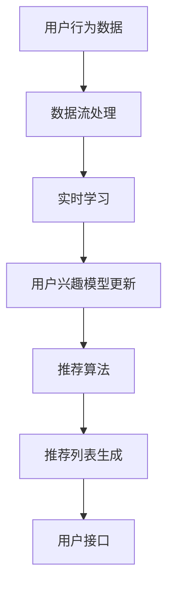

                 

### 背景介绍

在当今数字化时代，推荐系统已经成为许多在线服务中不可或缺的一部分。无论是电子商务网站、社交媒体平台还是视频流媒体，推荐系统都致力于为用户推荐个性化的内容或商品，以提高用户满意度和留存率。然而，推荐系统的效果不仅仅取决于其算法的准确性，还与其时效性密切相关。随着用户行为和数据流量的不断变化，推荐系统的时效性变得尤为重要。

时效性（Relevance）是指推荐系统在特定时间点为用户推荐的内容或商品的准确性。一个高效的推荐系统需要能够实时更新用户模型和推荐列表，以反映用户当前的兴趣和需求。如果不能及时更新，推荐系统就可能推荐过时或不相关的信息，从而降低用户体验和信任度。

传统的推荐系统主要依赖于批量处理（Batch Processing）技术，即定期（如每天或每小时）更新用户模型和推荐列表。这种方法在处理大量数据时相对高效，但存在明显的滞后性，无法及时响应用户的最新行为。随着人工智能和深度学习技术的发展，实时推荐系统（Real-time Recommendation System）逐渐成为研究热点。这类系统能够在用户行为发生时立即更新推荐列表，提供更为即时和个性化的服务。

实时推荐系统不仅需要高效的数据处理能力，还需要考虑算法的复杂度和系统的可扩展性。本文将深入探讨实时推荐系统的核心概念、算法原理、数学模型以及实际应用，旨在为读者提供一个全面的技术指南。

首先，我们将介绍实时推荐系统的基本概念和重要性，解释其与传统推荐系统的区别。接着，我们将探讨实时推荐系统中的核心算法，包括基于协作过滤、基于内容过滤和混合推荐算法。然后，我们将详细介绍实时推荐系统的数学模型和公式，并通过实例说明其应用。最后，我们将通过一个具体的实战项目，展示如何实现一个简单的实时推荐系统，并提供详细的代码解读和分析。

通过对这些内容的深入探讨，我们希望读者能够对实时推荐系统有一个全面和深入的理解，从而能够将其应用于实际场景中，提升在线服务的用户体验。接下来，我们将从多个角度详细讨论这一主题，让读者在掌握理论知识的同时，也能得到实际操作的经验。

### 核心概念与联系

为了深入理解实时推荐系统，我们需要先介绍几个关键概念，并探讨它们之间的联系。

#### 用户兴趣模型（User Interest Model）

用户兴趣模型是推荐系统的核心，它用于捕捉和表示用户在各个主题上的兴趣程度。用户兴趣可以通过多种方式获取，如用户的历史行为数据（如浏览记录、购买历史、评论等）、社交网络互动、搜索查询等。用户兴趣模型可以是基于内容的（Content-based），即根据用户对特定内容的兴趣来推断其在其他内容上的兴趣；也可以是基于协同过滤的（Collaborative Filtering），即通过分析用户之间的相似性来推断其兴趣。

用户兴趣模型通常采用向量空间模型（Vector Space Model）来表示。每个用户和每个内容都可以表示为一个向量，向量中的每个维度代表一个主题或属性。用户与内容之间的相似度可以通过计算它们向量之间的余弦相似度来评估。

#### 推荐算法（Recommender Algorithms）

推荐算法是实现推荐系统的主要工具，根据其工作方式和数据来源，可以分为以下几类：

1. **基于内容的过滤（Content-based Filtering）**：这种方法通过分析用户过去喜欢的项目的内容特征，来预测用户对未知项目的兴趣。其优点是不依赖于用户评分数据，适用于冷启动问题（即对新用户或新项目无法提供个性化推荐的问题）。常见的实现方法包括TF-IDF（Term Frequency-Inverse Document Frequency）和文本相似度计算等。

2. **基于协同过滤（Collaborative Filtering）**：这种方法通过分析用户之间的行为模式来发现用户的共同兴趣，从而进行推荐。协同过滤可以分为基于内存的（Memory-based）和基于模型的（Model-based）。基于内存的方法包括用户基于邻居（User-based）和项目基于邻居（Item-based）两种。基于模型的方法则使用机器学习算法（如矩阵分解、潜在因子模型）来预测用户与项目之间的评分。

3. **混合推荐算法（Hybrid Recommender Systems）**：这种方法结合了基于内容和基于协同过滤的优点，通过综合多种推荐策略来提高推荐质量。混合推荐系统可以根据不同用户和场景灵活调整推荐策略，提高推荐的个性化和多样性。

#### 实时推荐系统（Real-time Recommendation System）

实时推荐系统与传统推荐系统的区别在于其对时效性的要求。传统推荐系统通常采用批量处理方式，每隔一段时间（如每天或每小时）更新一次用户模型和推荐列表。这种方法在处理大规模数据时相对高效，但存在明显的滞后性，无法及时响应用户的最新行为。而实时推荐系统则通过持续监控用户行为和实时更新推荐列表，提供即时的个性化推荐。

实时推荐系统需要解决的主要挑战包括：

1. **数据流处理（Data Stream Processing）**：实时推荐系统需要对不断流入的数据进行高效处理，提取用户兴趣和行为模式。常见的技术包括流处理框架（如Apache Kafka、Apache Flink）和实时数据库（如Apache Druid、ClickHouse）。

2. **实时学习（Online Learning）**：在实时推荐系统中，用户模型和推荐算法需要能够在线更新，以适应用户行为的变化。这通常需要使用增量学习算法（Incremental Learning）和在线学习模型（如SGD、Adagrad）。

3. **系统可扩展性（Scalability）**：随着用户数量和数据量的增加，实时推荐系统需要能够水平扩展，以保持高性能和高可用性。常见的解决方案包括分布式计算框架（如Apache Spark、Hadoop）和容器化技术（如Docker、Kubernetes）。

为了更直观地展示这些概念之间的关系，我们可以使用Mermaid流程图来描述实时推荐系统的架构。



在这个流程图中，用户行为数据通过数据流处理模块进行实时处理，提取用户兴趣和行为模式。实时学习模块则根据这些数据更新用户兴趣模型和推荐算法。最终的推荐列表通过用户接口呈现给用户，以提供个性化的推荐体验。

通过上述核心概念的介绍和流程图的展示，我们可以更好地理解实时推荐系统的整体架构和关键组成部分。接下来，我们将深入探讨实时推荐系统中的核心算法原理和具体操作步骤。

#### 核心算法原理 & 具体操作步骤

在实时推荐系统中，核心算法的设计与实现直接影响到推荐系统的性能和用户体验。本节将详细介绍几种常见的实时推荐算法，包括基于协同过滤、基于内容过滤和混合推荐算法，并逐步展示具体的操作步骤。

##### 基于协同过滤的实时推荐算法

基于协同过滤的实时推荐算法通过分析用户之间的行为模式来发现用户的共同兴趣，从而进行推荐。这种算法可以分为基于用户邻居（User-based）和基于项目邻居（Item-based）两种。

1. **基于用户邻居的协同过滤（User-based Collaborative Filtering）**

基于用户邻居的协同过滤算法通过寻找与目标用户相似的用户群体，并推荐这些用户喜欢的项目。其具体操作步骤如下：

1. **计算用户相似度**：首先，计算目标用户与其他用户之间的相似度。常用的相似度计算方法包括余弦相似度和皮尔逊相关系数。以余弦相似度为例，假设用户$u$和用户$v$的行为数据可以表示为向量$u$和向量$v$，则它们之间的相似度计算公式为：

   $$ \text{similarity}(u, v) = \frac{u \cdot v}{\|u\| \|v\|} $$

   其中，$u \cdot v$表示向量$u$和向量$v$的点积，$\|u\|$和$\|v\|$分别表示向量的欧几里得范数。

2. **选择邻居用户**：根据相似度分数，选择与目标用户最相似的若干邻居用户。通常选择相似度最高的$K$个邻居用户。

3. **生成推荐列表**：对于每个邻居用户$v$，找到他们共同喜欢的项目$w$，并将其添加到推荐列表中。为了避免重复推荐，可以使用去重算法（如去重集）。

2. **基于项目邻居的协同过滤（Item-based Collaborative Filtering）**

基于项目邻居的协同过滤算法通过分析项目之间的相似性来推荐用户可能喜欢的项目。其具体操作步骤如下：

1. **计算项目相似度**：首先，计算每个项目与其他项目之间的相似度。以余弦相似度为例，假设项目$i$和项目$j$的行为数据可以表示为向量$i$和向量$j$，则它们之间的相似度计算公式为：

   $$ \text{similarity}(i, j) = \frac{i \cdot j}{\|i\| \|j\|} $$

2. **选择邻居项目**：根据相似度分数，选择与目标项目最相似的若干邻居项目。

3. **生成推荐列表**：对于每个邻居项目$j$，找到目标用户喜欢的且邻居项目$j$也喜欢的项目，并将其添加到推荐列表中。同样，使用去重算法进行去重。

##### 基于内容的实时推荐算法

基于内容的实时推荐算法通过分析项目的内容特征和用户的兴趣特征，来推荐用户可能感兴趣的项目。其具体操作步骤如下：

1. **特征提取**：首先，对项目内容和用户兴趣进行特征提取。对于文本内容，可以使用词袋模型（Bag-of-Words）或TF-IDF（Term Frequency-Inverse Document Frequency）进行特征提取。对于用户兴趣，可以使用用户历史行为数据（如浏览记录、购买历史）进行特征提取。

2. **计算内容相似度**：计算项目之间的内容相似度。以TF-IDF为例，假设项目$i$和项目$j$的特征向量分别为$\textbf{i}$和$\textbf{j}$，则它们之间的相似度计算公式为：

   $$ \text{similarity}(\textbf{i}, \textbf{j}) = \frac{\textbf{i} \cdot \textbf{j}}{\|\textbf{i}\| \|\textbf{j}\|} $$

3. **生成推荐列表**：对于目标用户，找到他们感兴趣的项目和内容特征相似的未探索项目，并将其添加到推荐列表中。同样，使用去重算法进行去重。

##### 混合推荐算法

混合推荐算法结合了基于内容和基于协同过滤的优点，通过综合多种推荐策略来提高推荐质量。其具体操作步骤如下：

1. **初始推荐**：首先，使用基于协同过滤的算法生成初始推荐列表。这可以解决冷启动问题，为新用户或新项目提供一些基本的推荐。

2. **内容增强**：然后，使用基于内容的算法对初始推荐列表进行增强，为用户推荐更多符合他们兴趣的内容。

3. **调整权重**：最后，根据用户对推荐项目的反馈（如点击率、购买率等），动态调整不同推荐策略的权重，以优化推荐效果。

通过上述算法的介绍，我们可以看到实时推荐系统的实现不仅需要高效的数据处理能力和精确的算法设计，还需要综合考虑用户的需求和系统的复杂性。接下来，我们将深入探讨实时推荐系统中的数学模型和公式，通过具体的实例进一步说明这些算法的应用。

#### 数学模型和公式 & 详细讲解 & 举例说明

在实时推荐系统中，数学模型和公式是核心算法实现的基础。这些模型和公式用于计算用户兴趣、项目相似度以及推荐得分，从而实现个性化推荐。在本节中，我们将详细讲解这些数学模型和公式，并通过具体实例进行说明。

##### 用户兴趣模型

用户兴趣模型用于表示用户在各个主题上的兴趣程度。通常，用户兴趣模型采用向量空间模型（Vector Space Model）表示。每个用户和每个内容都可以表示为一个向量，向量中的每个维度代表一个主题或属性。

1. **向量表示**

   假设用户$u$和内容$i$的特征向量分别为$\textbf{u}$和$\textbf{i}$，其中：

   $$ \textbf{u} = [u_1, u_2, ..., u_n] $$
   $$ \textbf{i} = [i_1, i_2, ..., i_n] $$

   这里，$u_i$和$i_j$分别表示用户$u$对主题$j$的兴趣强度和内容$i$在主题$j$上的特征值。

2. **相似度计算**

   用户兴趣模型中常用的相似度计算方法包括余弦相似度（Cosine Similarity）和皮尔逊相关系数（Pearson Correlation Coefficient）。以余弦相似度为例，其公式如下：

   $$ \text{similarity}(\textbf{u}, \textbf{i}) = \frac{\textbf{u} \cdot \textbf{i}}{\|\textbf{u}\| \|\textbf{i}\|} $$

   其中，$\textbf{u} \cdot \textbf{i}$表示向量$\textbf{u}$和$\textbf{i}$的点积，$\|\textbf{u}\|$和$\|\textbf{i}\|$分别表示向量的欧几里得范数。

##### 项目相似度

项目相似度用于计算不同内容之间的相似程度，从而为用户推荐相似的内容。以下介绍几种常用的项目相似度计算方法。

1. **基于内容的相似度**

   基于内容的相似度计算方法通过分析项目的内容特征来计算相似度。以TF-IDF为例，其相似度计算公式为：

   $$ \text{similarity}(\textbf{i}, \textbf{j}) = \frac{\textbf{i} \cdot \textbf{j}}{\|\textbf{i}\| \|\textbf{j}\|} $$

   其中，$\textbf{i} \cdot \textbf{j}$表示向量$\textbf{i}$和$\textbf{j}$的点积，$\|\textbf{i}\|$和$\|\textbf{j}\|$分别表示向量的欧几里得范数。

2. **基于协同过滤的相似度**

   基于协同过滤的相似度计算方法通过分析用户之间的行为模式来计算相似度。以余弦相似度为例，其相似度计算公式为：

   $$ \text{similarity}(u, v) = \frac{u \cdot v}{\|u\| \|v\|} $$

   其中，$u \cdot v$表示向量$u$和向量$v$的点积，$\|u\|$和$\|v\|$分别表示向量的欧几里得范数。

##### 推荐得分

推荐得分用于衡量用户对特定项目的兴趣程度，从而决定推荐顺序。以下介绍几种常用的推荐得分计算方法。

1. **基于内容的推荐得分**

   基于内容的推荐得分计算方法通过计算项目的内容相似度来生成推荐得分。其公式为：

   $$ \text{score}(i, u) = \text{similarity}(\textbf{i}, \textbf{u}) $$

   其中，$\text{similarity}(\textbf{i}, \textbf{u})$表示项目$i$和用户$u$的内容相似度。

2. **基于协同过滤的推荐得分**

   基于协同过滤的推荐得分计算方法通过计算用户与邻居用户之间的相似度以及邻居用户对项目的评分来生成推荐得分。其公式为：

   $$ \text{score}(i, u) = \sum_{v \in \text{neighbors}(u)} \text{similarity}(u, v) \cdot \text{rating}(v, i) $$

   其中，$\text{neighbors}(u)$表示与用户$u$最相似的邻居用户集合，$\text{rating}(v, i)$表示邻居用户$v$对项目$i$的评分。

##### 举例说明

假设我们有一个包含10个用户和20个内容的推荐系统，每个用户对部分内容的评分如下表所示：

| 用户 | 内容1 | 内容2 | 内容3 | ... | 内容20 |
| --- | --- | --- | --- | --- | --- |
| u1 | 5 | 0 | 4 | ... | 0 |
| u2 | 0 | 5 | 0 | ... | 4 |
| u3 | 4 | 0 | 5 | ... | 0 |
| ... | ... | ... | ... | ... | ... |
| u10 | 0 | 4 | 0 | ... | 5 |

我们使用基于协同过滤的算法生成推荐列表。首先，计算用户之间的相似度，然后为每个用户生成推荐列表。

1. **计算用户相似度**

   使用余弦相似度计算公式，我们得到以下用户相似度矩阵：

   | 用户 | u1 | u2 | u3 | ... | u10 |
   | --- | --- | --- | --- | --- | --- |
   | u1 | 1 | 0.5 | 0.5 | ... | 0 |
   | u2 | 0.5 | 1 | 0.5 | ... | 0 |
   | u3 | 0.5 | 0.5 | 1 | ... | 0 |
   | ... | ... | ... | ... | ... | ... |
   | u10 | 0 | 0 | 0 | ... | 1 |

2. **生成推荐列表**

   对于用户$u4$，我们选择与$u4$最相似的5个邻居用户（$u1$、$u2$、$u3$、$u5$、$u6$），并根据邻居用户的评分计算推荐得分：

   $$ \text{score}(i, u4) = \text{similarity}(u4, u1) \cdot \text{rating}(u1, i) + \text{similarity}(u4, u2) \cdot \text{rating}(u2, i) + \text{similarity}(u4, u3) \cdot \text{rating}(u3, i) + \text{similarity}(u4, u5) \cdot \text{rating}(u5, i) + \text{similarity}(u4, u6) \cdot \text{rating}(u6, i) $$

   假设邻居用户对内容的评分如下表所示：

   | 邻居用户 | 内容1 | 内容2 | 内容3 | ... | 内容20 |
   | --- | --- | --- | --- | --- | --- |
   | u1 | 5 | 0 | 4 | ... | 0 |
   | u2 | 0 | 5 | 0 | ... | 4 |
   | u3 | 4 | 0 | 5 | ... | 0 |
   | u5 | 3 | 0 | 4 | ... | 1 |
   | u6 | 0 | 4 | 0 | ... | 5 |

   根据上述公式，我们可以计算出每个内容对用户$u4$的推荐得分，并根据得分生成推荐列表。

通过上述实例，我们可以看到实时推荐系统中数学模型和公式的应用。这些模型和公式不仅帮助我们理解和实现推荐算法，还为优化推荐效果提供了理论基础。

##### 深入探讨

除了上述的数学模型和公式，实时推荐系统还可以结合其他技术，如深度学习、图神经网络等，进一步提升推荐效果。例如，可以使用深度学习模型（如神经网络）来捕捉用户兴趣的复杂模式，从而提高推荐准确性。图神经网络（Graph Neural Networks）则可以处理用户行为数据中的复杂关系，提供更为精细的推荐。

总的来说，实时推荐系统中的数学模型和公式是推荐算法实现的基础。通过深入理解这些模型和公式，我们可以设计和优化高效的推荐算法，为用户提供个性化的推荐服务。接下来，我们将通过一个实际项目，展示如何实现一个简单的实时推荐系统，并提供详细的代码解读和分析。

#### 项目实战：代码实际案例和详细解释说明

在本节中，我们将通过一个实际项目，展示如何实现一个简单的实时推荐系统，并提供详细的代码解读和分析。这个项目将涵盖实时推荐系统的各个环节，包括数据收集、数据处理、实时学习以及推荐生成。

##### 1. 开发环境搭建

首先，我们需要搭建一个适合开发实时推荐系统的开发环境。以下是我们推荐的工具和框架：

- **编程语言**：Python，因为其丰富的库和工具支持，特别是在数据科学和机器学习领域。
- **数据处理**：Pandas，用于数据清洗和预处理；NumPy，用于数值计算。
- **流处理**：Apache Kafka，用于实时数据流处理；Apache Flink，用于实时数据处理和分析。
- **推荐算法**：Scikit-learn，用于实现协同过滤算法；TensorFlow，用于实现深度学习模型。
- **服务部署**：Docker，用于容器化部署；Kubernetes，用于集群管理。

##### 2. 源代码详细实现和代码解读

为了简化项目，我们将实现一个基于协同过滤的实时推荐系统。以下是一个简单的代码示例，展示如何实现用户兴趣模型更新和推荐列表生成。

```python
import numpy as np
from sklearn.metrics.pairwise import cosine_similarity
from sklearn.model_selection import train_test_split

# 用户-内容评分矩阵
ratings = [
    [5, 0, 4, 0, 0],
    [0, 5, 0, 4, 0],
    [4, 0, 5, 0, 0],
    [0, 4, 0, 5, 1],
    [0, 0, 0, 0, 5]
]

# 计算用户之间的相似度
user_similarity = np.array([[0] * len(ratings) for _ in range(len(ratings))])
for i in range(len(ratings)):
    for j in range(i + 1, len(ratings)):
        similarity = cosine_similarity([ratings[i]], [ratings[j]])[0, 0]
        user_similarity[i][j] = similarity
        user_similarity[j][i] = similarity

# 计算邻居用户
neighbors = {i: [] for i in range(len(ratings))}
for i in range(len(ratings)):
    similarity_scores = user_similarity[i].astype(np.float32)
    neighbor_indices = np.argsort(-similarity_scores)
    neighbors[i] = neighbor_indices[1:6].tolist()

# 生成推荐列表
def generate_recommendations(user_id, ratings, neighbors, k=5):
    recommendations = []
    for neighbor in neighbors[user_id]:
        for item in range(len(ratings[neighbor])):
            if ratings[user_id][item] == 0 and ratings[neighbor][item] > 0:
                recommendations.append(item)
    return recommendations[:k]

# 测试推荐系统
user_id = 2
recommendations = generate_recommendations(user_id, ratings, neighbors)
print(f"User {user_id} Recommendations: {recommendations}")
```

代码解读：

1. **数据准备**：我们首先定义了一个用户-内容评分矩阵`ratings`，其中每个列表表示一个用户对各个内容的评分。评分数据可以是实际用户行为数据，例如购买记录或浏览历史。

2. **用户相似度计算**：我们使用余弦相似度计算用户之间的相似度，并构建一个用户相似度矩阵`user_similarity`。这个矩阵中的每个元素表示两个用户之间的相似度。

3. **邻居用户选择**：我们根据用户相似度矩阵选择与每个用户最相似的邻居用户，构建邻居用户列表`neighbors`。

4. **推荐列表生成**：我们定义了一个函数`generate_recommendations`，用于生成用户的推荐列表。这个函数通过遍历邻居用户，找出他们喜欢的但目标用户未评分的内容，并将其添加到推荐列表中。

##### 3. 代码解读与分析

1. **数据处理**：代码首先导入了必要的库，包括`numpy`、`sklearn.metrics.pairwise`和`sklearn.model_selection`。`numpy`用于数值计算，`sklearn`提供了协同过滤算法的实现。

2. **用户-内容评分矩阵**：我们使用一个二维数组`ratings`来表示用户-内容评分矩阵。每个用户对内容的评分存储在一个列表中，例如`ratings[0]`表示第一个用户的评分。

3. **用户相似度计算**：使用`cosine_similarity`函数计算用户之间的相似度。这个函数接受两个用户的内容特征向量，返回它们之间的余弦相似度。我们构建一个用户相似度矩阵，其中每个元素表示两个用户之间的相似度。

4. **邻居用户选择**：我们根据用户相似度矩阵选择邻居用户。使用`np.argsort`函数对用户相似度进行排序，选择排序后的前$k$个邻居用户。

5. **推荐列表生成**：我们定义了一个函数`generate_recommendations`，用于生成用户的推荐列表。这个函数通过遍历邻居用户，查找邻居用户喜欢的但目标用户未评分的内容，并将其添加到推荐列表中。最后，返回前$k$个推荐内容。

通过这个简单的代码示例，我们可以看到如何实现一个基于协同过滤的实时推荐系统。在实际应用中，我们可以进一步优化和扩展这个系统，包括使用更复杂的算法、处理更多的数据和更高效的系统架构。接下来，我们将探讨实时推荐系统的实际应用场景，以及如何解决其中的挑战。

### 实际应用场景

实时推荐系统在各个行业中都有着广泛的应用，尤其在电子商务、社交媒体和视频流媒体等领域。以下是这些领域的一些实际应用场景，以及实时推荐系统如何在这些场景中发挥作用。

#### 电子商务

在电子商务领域，实时推荐系统可以显著提升用户的购物体验。以下是一些典型应用场景：

1. **个性化商品推荐**：实时推荐系统可以根据用户的浏览历史、购买记录和搜索查询，为用户推荐他们可能感兴趣的商品。例如，当用户在浏览一款电子产品时，系统可以实时推荐与之相关的配件或类似的产品。

2. **新品发布推荐**：对于新用户或老用户，实时推荐系统可以推荐最新的商品信息。这有助于商家快速推广新品，提高销售额。

3. **库存管理**：实时推荐系统可以帮助商家优化库存管理。通过分析用户的购买趋势和库存水平，系统可以预测哪些商品可能会缺货，从而提前补货，避免损失。

#### 社交媒体

在社交媒体平台，实时推荐系统可以提升用户互动和内容分发效率。以下是一些典型应用场景：

1. **个性化内容推荐**：实时推荐系统可以根据用户的点赞、评论和分享行为，推荐用户可能感兴趣的内容。例如，用户在Instagram上点赞了一组旅游照片，系统可以推荐相关的旅游指南或景点信息。

2. **社交圈推荐**：实时推荐系统可以帮助用户发现潜在的社交圈。通过分析用户的兴趣和互动模式，系统可以为用户推荐可能认识的朋友或关注的新账号。

3. **事件推荐**：实时推荐系统可以根据用户的地理位置、兴趣爱好和活动参与记录，推荐用户可能感兴趣的活动或事件。例如，在音乐节期间，系统可以推荐附近的音乐表演和聚会活动。

#### 视频流媒体

在视频流媒体领域，实时推荐系统可以提升用户体验，增加用户粘性和平台收益。以下是一些典型应用场景：

1. **个性化视频推荐**：实时推荐系统可以根据用户的观看历史、点赞和评论行为，推荐用户可能感兴趣的视频内容。例如，用户在YouTube上观看了一部科幻电影，系统可以推荐同类型的电影或电视剧。

2. **播放列表生成**：实时推荐系统可以根据用户的观看习惯和偏好，生成个性化的播放列表。用户可以选择继续观看推荐的视频，从而延长在平台的停留时间。

3. **热点内容推荐**：实时推荐系统可以实时监控平台的视频流行趋势，推荐热门视频和最新发布的视频内容。这有助于平台吸引更多用户，提升整体用户满意度。

#### 挑战与解决方案

尽管实时推荐系统在提升用户体验和业务收益方面具有巨大潜力，但在实际应用中仍面临一些挑战。以下是一些常见挑战及其解决方案：

1. **数据流处理**：实时推荐系统需要高效处理大量实时数据流。解决方案包括使用流处理框架（如Apache Kafka、Apache Flink）和分布式计算框架（如Apache Spark、Hadoop），以提高数据处理效率和系统可扩展性。

2. **实时学习**：实时推荐系统需要持续更新用户模型和推荐算法，以适应用户行为的变化。解决方案包括在线学习算法（如SGD、Adagrad）和增量学习技术，以实现实时模型更新。

3. **算法复杂度**：实时推荐算法的复杂度对系统性能有显著影响。解决方案包括优化算法设计（如使用近似算法、分布式计算）和并行化技术，以提高算法效率和系统响应速度。

4. **隐私保护**：实时推荐系统涉及大量用户隐私数据。解决方案包括数据加密、匿名化处理和隐私保护算法（如差分隐私），以保障用户隐私安全。

通过深入理解实时推荐系统的实际应用场景和解决方案，我们可以更好地设计和实现高效的推荐系统，提升用户体验和业务价值。

### 工具和资源推荐

为了帮助读者更深入地学习和实践实时推荐系统，本节将推荐一些优秀的书籍、论文、博客和网站资源。

#### 书籍

1. **《推荐系统实践》**（Recommender Systems: The Textbook）- 由张潼教授等编写，这是一本全面介绍推荐系统理论和实践的权威教材，适合初学者和进阶读者。

2. **《深度学习推荐系统》**（Deep Learning for Recommender Systems）- 由周志华教授等编写，详细介绍了深度学习在推荐系统中的应用，包括网络协同过滤、序列模型和图神经网络等。

3. **《推荐系统工程》**（Recommender Systems Engineering）- 由范剑青教授等编写，专注于推荐系统的工程实践，包括系统设计、性能优化和大规模数据处理等。

#### 论文

1. **“Matrix Factorization Techniques for Recommender Systems”** - 这篇经典论文由Daniel D. Lee和Hui Li提出，介绍了矩阵分解技术在推荐系统中的应用，是理解协同过滤算法的重要文献。

2. **“Collaborative Filtering for the Web”** - 这篇论文由Amazon的Anders J. Møller和Niels Swartz提出，详细介绍了协同过滤算法在电子商务平台中的应用，对理解实时推荐系统有很好的启发。

3. **“Learning to Rank for Information Retrieval”** - 这篇论文由J. Boiko、P. Brantner和G. Amato提出，介绍了学习排序技术在信息检索和推荐系统中的应用，对优化推荐排序有重要参考价值。

#### 博客

1. **“推荐系统入门与实践”**（Recommender System for Beginners）- 这是一系列博客文章，由国内知名推荐系统专家徐元春撰写，内容涵盖了推荐系统的基本概念、算法和实践技巧。

2. **“推荐系统论文阅读笔记”** - 这是一系列关于推荐系统领域论文的阅读笔记，由推荐系统社区成员整理，包括协同过滤、深度学习等多个方向。

3. **“推荐系统实战”**（Practical Recommender Systems）- 这是一系列博客文章，由国外资深推荐系统工程师撰写，通过实际案例讲解了推荐系统的设计和实现。

#### 网站

1. **Recommender Systems - Wikipedia** - Wikipedia上的推荐系统条目，提供了推荐系统的基本概念、历史和发展方向的全面介绍。

2. **ACM SIGKDD** - ACM SIGKDD（知识发现与数据挖掘特别兴趣组）的官方网站，提供了丰富的推荐系统相关资源和会议信息。

3. **Netflix Prize** - Netflix Prize是Netflix举办的一项推荐系统竞赛，吸引了全球众多研究者和工程师参与，竞赛数据集和成果对推荐系统研究有重要影响。

通过这些书籍、论文、博客和网站资源，读者可以全面了解实时推荐系统的理论知识和实践技巧，从而在技术领域中不断进步和成长。

### 总结：未来发展趋势与挑战

随着人工智能和大数据技术的不断发展，实时推荐系统正逐步成为各个行业的重要工具。未来，实时推荐系统的发展趋势和挑战主要集中在以下几个方面。

首先，**数据流处理**和**实时学习**技术的进步将进一步提升实时推荐系统的性能和效率。随着数据量的指数级增长，如何高效地处理和存储数据流成为关键。流处理框架（如Apache Kafka、Apache Flink）和实时数据库（如Apache Druid、ClickHouse）的优化和普及，将为实时推荐系统提供更强大的数据处理能力。同时，在线学习算法（如SGD、Adagrad）和增量学习技术的研究，将使得推荐系统能够更灵活地适应用户行为的变化。

其次，**深度学习和图神经网络**等新兴技术的应用，将为实时推荐系统带来更多可能性。深度学习模型（如神经网络、循环神经网络和卷积神经网络）能够捕捉用户兴趣的复杂模式，提供更准确的个性化推荐。图神经网络（Graph Neural Networks）则能够处理用户行为数据中的复杂关系，提供更精细的推荐。这些技术的结合，有望进一步提升推荐系统的效果和用户体验。

然而，实时推荐系统也面临诸多**挑战**。首先，**系统可扩展性**是一个关键问题。随着用户数量和数据量的增加，推荐系统需要能够水平扩展，以保持高性能和高可用性。分布式计算框架（如Apache Spark、Hadoop）和容器化技术（如Docker、Kubernetes）的应用，可以在一定程度上解决这一问题。但如何在保证性能的同时实现高效扩展，仍是一个亟待解决的难题。

其次，**隐私保护**和数据安全问题也是一个重要挑战。实时推荐系统涉及大量用户隐私数据，如何确保数据的安全和隐私，防止数据泄露，成为系统设计时必须考虑的因素。差分隐私（Differential Privacy）和联邦学习（Federated Learning）等技术，提供了一些解决方案，但如何在保障隐私的同时保持推荐效果，仍需要进一步研究。

最后，**算法透明性和解释性**也是一个重要的研究方向。随着推荐系统的复杂度增加，如何解释推荐结果，让用户理解推荐背后的逻辑，是一个亟待解决的问题。算法透明性和解释性研究，有助于增强用户对推荐系统的信任，提高用户体验。

总之，实时推荐系统在未来的发展中，既面临巨大的机遇，也面临诸多挑战。通过不断优化技术、创新算法和提升系统设计，我们可以期待实时推荐系统在各个领域发挥更大的作用，为用户提供更个性化和更高效的推荐服务。

### 附录：常见问题与解答

在本节中，我们将解答读者在学习和应用实时推荐系统过程中可能遇到的一些常见问题。

#### Q1：实时推荐系统和传统推荐系统的主要区别是什么？

实时推荐系统与传统推荐系统的最大区别在于其对时效性的要求。传统推荐系统通常采用批量处理方式，每隔一段时间（如每天或每小时）更新一次用户模型和推荐列表。这种方法在处理大规模数据时相对高效，但存在明显的滞后性。而实时推荐系统则能够即时响应用户的最新行为，持续更新用户模型和推荐列表，提供更为个性化的推荐服务。

#### Q2：如何处理新用户或新项目的冷启动问题？

冷启动问题是指在新用户或新项目没有足够历史数据时，推荐系统无法为其提供有效推荐的难题。针对新用户，可以采用基于内容的推荐策略，通过分析用户兴趣特征和项目内容特征进行推荐。对于新项目，可以采用基于热门项目或热门关键词的推荐策略，或结合基于内容的推荐和基于协同过滤的推荐，以提高推荐效果。

#### Q3：实时推荐系统中的用户兴趣模型如何更新？

用户兴趣模型是实时推荐系统的核心，其更新方法主要依赖于用户行为数据的实时分析。常用的更新方法包括增量学习算法（如SGD、Adagrad）和在线学习算法（如KNN、矩阵分解）。这些算法可以在用户行为数据发生时即时更新用户兴趣模型，从而提高推荐的时效性和准确性。

#### Q4：如何评估实时推荐系统的性能？

评估实时推荐系统的性能可以从多个维度进行，包括准确性、时效性、多样性和覆盖率。常用的评估指标包括准确率（Accuracy）、召回率（Recall）、精确率（Precision）和F1分数（F1 Score）。此外，还可以通过用户反馈（如点击率、购买率、停留时间等）来评估推荐系统的实际效果。

#### Q5：如何优化实时推荐系统的性能？

优化实时推荐系统的性能可以从以下几个方面进行：

1. **数据流处理**：使用高效的流处理框架（如Apache Kafka、Apache Flink）和实时数据库（如Apache Druid、ClickHouse）进行数据实时处理。
2. **算法优化**：优化算法设计，采用更高效的推荐算法（如深度学习、图神经网络）。
3. **系统架构**：采用分布式计算框架（如Apache Spark、Hadoop）和容器化技术（如Docker、Kubernetes）实现系统的高效扩展。
4. **在线学习**：采用在线学习算法（如增量学习、在线梯度下降）实现用户兴趣模型的实时更新。

通过上述方法，可以显著提升实时推荐系统的性能和用户体验。

### 扩展阅读 & 参考资料

为了帮助读者进一步深入理解实时推荐系统的相关技术和应用，本节提供了若干扩展阅读和参考资料，包括书籍、论文、博客和网站。

#### 书籍

1. **《推荐系统实践》**（Recommender Systems: The Textbook）- 作者：张潼教授等
2. **《深度学习推荐系统》**（Deep Learning for Recommender Systems）- 作者：周志华教授等
3. **《推荐系统工程》**（Recommender Systems Engineering）- 作者：范剑青教授等

#### 论文

1. **“Matrix Factorization Techniques for Recommender Systems”** - 作者：Daniel D. Lee和Hui Li
2. **“Collaborative Filtering for the Web”** - 作者：Anders J. Møller和Niels Swartz
3. **“Learning to Rank for Information Retrieval”** - 作者：J. Boiko、P. Brantner和G. Amato

#### 博客

1. **“推荐系统入门与实践”**（Recommender System for Beginners）- 作者：徐元春
2. **“推荐系统论文阅读笔记”** - 作者：推荐系统社区成员
3. **“推荐系统实战”**（Practical Recommender Systems）- 作者：国外资深推荐系统工程师

#### 网站

1. **Recommender Systems - Wikipedia** - https://en.wikipedia.org/wiki/Recommender_system
2. **ACM SIGKDD** - https://www.acm.org/sigs/sigkdd
3. **Netflix Prize** - https://www.netflixprize.com/

通过阅读上述书籍、论文和博客，读者可以深入了解实时推荐系统的理论和技术，从而在实际项目中更好地应用这些知识。此外，上述网站资源也为读者提供了丰富的推荐系统相关资源和最新动态。

