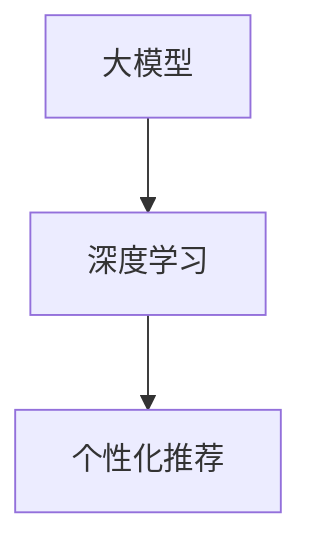

                 

### 推荐系统的未来：大模型的主导作用与创新

#### 关键词：(推荐系统，大模型，未来趋势，创新，技术发展)

#### 摘要：

本文将深入探讨推荐系统的未来发展趋势，重点关注大模型在这一领域的广泛应用及其带来的创新。首先，我们将回顾推荐系统的发展历程，了解其演变背景和核心技术的演变。接着，我们将详细介绍大模型在推荐系统中的主导作用，并分析其与传统推荐算法的区别。随后，本文将探讨大模型在推荐系统中的具体应用场景，以及如何通过大模型实现个性化推荐。此外，我们还将探讨大模型在推荐系统中所面临的挑战和解决方案。最后，本文将总结推荐系统的未来发展趋势，提出创新性建议，为读者提供有价值的参考。

### 1. 背景介绍

推荐系统（Recommender System）是一种基于数据挖掘和机器学习技术的信息过滤方法，旨在向用户推荐他们可能感兴趣的内容或产品。其核心思想是通过分析用户的偏好和兴趣，预测用户对特定项目（如电影、商品、新闻等）的潜在兴趣，从而为用户提供个性化的推荐。

推荐系统的发展历程可以分为以下几个阶段：

- **基于内容的推荐**：最早期的推荐系统主要基于内容的相似性进行推荐，即根据用户过去喜欢的项目内容，找到与之相似的其他项目推荐给用户。这种方法在信息量较小、用户偏好差异不明显的情况下表现较好。

- **协同过滤推荐**：随着互联网的普及和用户生成内容的增加，协同过滤（Collaborative Filtering）成为推荐系统的主要方法。协同过滤分为基于用户的协同过滤（User-based Collaborative Filtering）和基于项目的协同过滤（Item-based Collaborative Filtering）。这种方法通过分析用户之间的相似性和项目之间的相似性，为用户推荐类似的其他用户喜欢的项目。

- **混合推荐**：为了提高推荐系统的准确性和适应性，人们开始将基于内容的推荐和协同过滤相结合，形成混合推荐系统（Hybrid Recommender System）。混合推荐系统通过综合利用多种推荐方法，提高推荐效果。

- **基于模型的推荐**：近年来，随着机器学习技术的发展，基于模型的推荐方法逐渐崭露头角。基于模型的推荐方法利用机器学习算法对用户行为和项目特征进行建模，从而预测用户的偏好和兴趣。

在这些推荐系统中，协同过滤和基于模型的推荐方法占据了主导地位。协同过滤方法以其简单高效的特点赢得了广泛的关注，而基于模型的推荐方法则凭借其强大的建模能力逐渐成为推荐系统研究的热点。

#### 1.1 推荐系统的发展背景

推荐系统的发展离不开互联网的普及和数据积累。随着互联网技术的不断进步，用户生成内容越来越多，信息过载问题愈发严重。为了帮助用户在庞大的信息海洋中找到自己感兴趣的内容，推荐系统应运而生。

在互联网早期，信息量相对较小，用户的行为数据有限。然而，随着社交媒体、电子商务等应用的普及，用户行为数据呈指数级增长。这些数据为推荐系统提供了丰富的信息来源，使得推荐系统得以更好地理解和预测用户的偏好。

同时，机器学习和数据挖掘技术的发展为推荐系统提供了强大的技术支持。机器学习算法能够从海量数据中提取有用的信息，并建立用户与项目之间的关联关系。数据挖掘技术则能够分析用户行为数据，发现用户之间的相似性和兴趣点，从而为个性化推荐提供依据。

#### 1.2 推荐系统的核心挑战

尽管推荐系统取得了显著的成果，但仍面临着一些核心挑战：

- **冷启动问题**：对于新用户或新项目，由于缺乏足够的历史数据，推荐系统难以进行准确的推荐。冷启动问题是推荐系统在实际应用中亟待解决的难题。

- **数据稀疏性**：在实际应用中，用户对项目的评分数据往往非常稀疏，导致推荐系统难以发现用户之间的相似性和项目之间的关联。如何处理数据稀疏性是推荐系统研究的一个重要方向。

- **实时性**：在动态变化的互联网环境中，用户偏好和兴趣可能随时发生变化。如何实现实时推荐，满足用户的即时需求，是推荐系统面临的重要挑战。

- **多样性**：推荐系统的目标是满足用户的个性化需求，但同时也需要保证推荐结果的多样性，避免用户陷入信息茧房。如何平衡个性化与多样性之间的矛盾，是推荐系统研究的一个关键问题。

#### 1.3 推荐系统的现有方法

现有的推荐系统方法可以分为以下几类：

- **基于内容的推荐**：基于内容的推荐方法通过分析项目的内容特征和用户的偏好特征，找到相似的项目推荐给用户。这种方法在信息量较小、用户偏好差异不明显的情况下表现较好，但容易产生“噪音”和“覆盖不足”的问题。

- **协同过滤推荐**：协同过滤推荐方法通过分析用户之间的相似性和项目之间的相似性，为用户推荐类似的其他用户喜欢的项目。这种方法具有较好的推荐效果，但面临着数据稀疏性和计算复杂度的问题。

- **基于模型的推荐**：基于模型的推荐方法利用机器学习算法对用户行为和项目特征进行建模，从而预测用户的偏好和兴趣。这种方法具有较强的建模能力和预测能力，但面临着模型选择、参数调优和模型解释性等问题。

- **混合推荐**：混合推荐方法将多种推荐方法相结合，综合利用多种信息来源，提高推荐效果。这种方法在提高推荐准确性和多样性方面具有显著优势，但面临着算法复杂度和模型融合等问题。

### 2. 核心概念与联系

在探讨推荐系统的未来发展趋势时，我们需要关注以下几个核心概念：大模型、深度学习和个性化推荐。这些概念相互关联，共同推动了推荐系统的技术创新。

#### 2.1 大模型

大模型（Large-scale Model）是指具有海量参数和计算能力的深度学习模型。近年来，随着计算机硬件性能的提升和海量数据资源的积累，大模型在各个领域取得了显著成果。在推荐系统中，大模型能够处理大规模的用户数据和项目数据，提取更丰富的特征信息，从而提高推荐效果。

大模型的核心优势在于其强大的建模能力和数据处理能力。通过训练大规模的神经网络，大模型可以自动学习用户行为和项目特征的复杂关系，从而实现对用户偏好和兴趣的精确预测。此外，大模型还具有较好的泛化能力，能够在不同场景和应用中取得良好的推荐效果。

#### 2.2 深度学习

深度学习（Deep Learning）是一种基于人工神经网络的学习方法，通过多层神经网络结构自动学习输入数据的高层次特征表示。深度学习在图像识别、语音识别和自然语言处理等领域取得了显著的成果，为推荐系统的发展提供了强有力的技术支持。

在推荐系统中，深度学习方法可以用于用户特征提取、项目特征提取和推荐算法优化等多个方面。通过深度学习模型，推荐系统可以自动学习用户行为和项目特征的复杂关系，提取更丰富的特征信息，从而提高推荐效果。此外，深度学习模型还具有较强的泛化能力，能够适应不同场景和应用需求。

#### 2.3 个性化推荐

个性化推荐（Personalized Recommendation）是指根据用户的个性化需求和兴趣，为用户推荐符合其偏好的项目或内容。个性化推荐是推荐系统的核心目标，通过满足用户的个性化需求，提高用户的满意度和使用体验。

在推荐系统中，个性化推荐的关键在于用户特征提取和项目特征提取。通过深度学习模型，推荐系统可以自动学习用户行为和项目特征的复杂关系，提取更丰富的特征信息。这些特征信息用于构建用户兴趣模型和项目兴趣模型，从而实现个性化推荐。

#### 2.4 Mermaid 流程图

为了更好地展示大模型、深度学习和个性化推荐之间的联系，我们可以使用 Mermaid 流程图进行描述。以下是一个简单的 Mermaid 流程图示例：



在这个流程图中，大模型作为核心驱动力，通过深度学习方法提取用户特征和项目特征，进而实现个性化推荐。这个流程图简洁明了地展示了大模型、深度学习和个性化推荐之间的紧密联系。

### 3. 核心算法原理 & 具体操作步骤

在了解了推荐系统的发展背景和核心概念后，我们将深入探讨推荐系统的核心算法原理和具体操作步骤。本文将主要介绍基于深度学习的大模型推荐算法，包括用户特征提取、项目特征提取和推荐算法优化等关键步骤。

#### 3.1 用户特征提取

用户特征提取是推荐系统的关键步骤之一，其目标是通过分析用户的历史行为数据、社交关系和兴趣爱好等信息，提取用户的个性化特征。以下是用户特征提取的主要步骤：

1. **数据收集**：首先，收集用户在应用中的行为数据，如浏览记录、购买记录、点赞记录等。此外，还可以收集用户的社交关系数据，如好友关系、兴趣群体等。

2. **数据预处理**：对收集到的数据进行清洗和预处理，包括去除重复数据、填补缺失值、归一化等操作。

3. **特征提取**：利用深度学习模型对预处理后的数据进行分析，提取用户的行为特征、兴趣特征和社交特征。具体方法包括卷积神经网络（CNN）、循环神经网络（RNN）和注意力机制（Attention Mechanism）等。

4. **特征融合**：将提取的用户特征进行融合，形成用户特征向量。用户特征向量用于构建用户兴趣模型，为后续推荐算法提供支持。

#### 3.2 项目特征提取

项目特征提取的目标是通过分析项目的属性、标签和用户评价等信息，提取项目的个性化特征。以下是项目特征提取的主要步骤：

1. **数据收集**：收集项目的属性数据，如类别、标签、评分等。此外，还可以收集项目的用户评价数据，如正面评价、负面评价等。

2. **数据预处理**：对收集到的数据进行清洗和预处理，包括去除重复数据、填补缺失值、归一化等操作。

3. **特征提取**：利用深度学习模型对预处理后的数据进行分析，提取项目的属性特征、标签特征和用户评价特征。具体方法包括卷积神经网络（CNN）、循环神经网络（RNN）和注意力机制（Attention Mechanism）等。

4. **特征融合**：将提取的项目特征进行融合，形成项目特征向量。项目特征向量用于构建项目兴趣模型，为后续推荐算法提供支持。

#### 3.3 推荐算法优化

在用户特征提取和项目特征提取的基础上，我们可以利用深度学习模型进行推荐算法优化，实现个性化推荐。以下是推荐算法优化的主要步骤：

1. **模型选择**：根据应用场景和数据特点，选择合适的深度学习模型，如卷积神经网络（CNN）、循环神经网络（RNN）和变换器（Transformer）等。

2. **模型训练**：利用训练数据对深度学习模型进行训练，通过调整模型参数，提高模型预测性能。

3. **模型评估**：利用测试数据对训练好的模型进行评估，评估指标包括准确率、召回率、F1 值等。

4. **模型优化**：根据评估结果，对模型进行优化，包括调整模型结构、调整训练参数等，以提高推荐效果。

5. **实时更新**：在推荐过程中，根据用户实时行为数据，动态调整用户特征和项目特征，实现实时推荐。

通过以上步骤，我们可以构建一个基于深度学习的大模型推荐系统，实现个性化推荐。这个推荐系统具有较强的建模能力和预测能力，能够为用户提供高质量的推荐服务。

### 4. 数学模型和公式 & 详细讲解 & 举例说明

在介绍完推荐系统的核心算法原理和具体操作步骤后，我们将进一步探讨推荐系统中的数学模型和公式，以及如何利用这些模型和公式进行推荐算法的优化。

#### 4.1 基本概念

在推荐系统中，常用的数学模型包括矩阵分解（Matrix Factorization）、概率模型（Probabilistic Models）和深度学习模型（Deep Learning Models）。

- **矩阵分解**：矩阵分解是一种常用的推荐系统算法，通过将用户-项目评分矩阵分解为两个低秩矩阵，实现用户和项目的特征提取。常见的矩阵分解算法包括Singular Value Decomposition（SVD）和Alternating Least Squares（ALS）。

- **概率模型**：概率模型利用概率分布来描述用户对项目的兴趣，常见的概率模型包括贝叶斯模型（Bayesian Models）和概率生成模型（Probabilistic Generative Models）。

- **深度学习模型**：深度学习模型通过多层神经网络结构自动学习输入数据的高层次特征表示，常见的深度学习模型包括卷积神经网络（CNN）、循环神经网络（RNN）和变换器（Transformer）。

#### 4.2 矩阵分解

矩阵分解是一种常用的推荐系统算法，通过将用户-项目评分矩阵分解为两个低秩矩阵，实现用户和项目的特征提取。以下是一个简单的矩阵分解模型：

设用户-项目评分矩阵为 \(R \in \mathbb{R}^{m \times n}\)，其中 \(m\) 为用户数量，\(n\) 为项目数量。矩阵分解模型可以将 \(R\) 分解为用户特征矩阵 \(U \in \mathbb{R}^{m \times k}\) 和项目特征矩阵 \(V \in \mathbb{R}^{n \times k}\)，其中 \(k\) 为特征维度。

矩阵分解模型的目标是最小化重建误差，即：

$$
\min_{U, V} \sum_{i=1}^{m} \sum_{j=1}^{n} (r_{ij} - \hat{r}_{ij})^2
$$

其中，\(\hat{r}_{ij}\) 是预测的评分，\(r_{ij}\) 是实际的评分。

#### 4.3 概率模型

概率模型利用概率分布来描述用户对项目的兴趣。以下是一个简单的概率生成模型：

设用户 \(i\) 对项目 \(j\) 的兴趣概率为 \(p(i, j)\)，则概率生成模型可以表示为：

$$
p(i, j) = \frac{e^{r_{ij}}}{Z_i}
$$

其中，\(Z_i\) 是归一化因子，用于保证概率分布的归一性。

概率模型的目标是最小化负对数似然损失，即：

$$
\min_{\theta} \sum_{i=1}^{m} \sum_{j=1}^{n} -r_{ij} \log p(i, j)
$$

其中，\(\theta\) 是模型参数。

#### 4.4 深度学习模型

深度学习模型通过多层神经网络结构自动学习输入数据的高层次特征表示。以下是一个简单的深度学习模型：

$$
\hat{r}_{ij} = \sigma(\text{激活函数}(\text{权重矩阵}^T \text{输入向量}))
$$

其中，\(\sigma\) 是激活函数，如ReLU或Sigmoid函数；权重矩阵用于表示用户和项目特征之间的关联关系；输入向量是用户和项目的特征向量。

深度学习模型的目标是最小化损失函数，如均方误差（MSE）或交叉熵损失（Cross-Entropy Loss）。

#### 4.5 举例说明

假设我们有一个用户-项目评分矩阵 \(R\)，其中包含10个用户和5个项目的评分数据。以下是矩阵分解模型的一个简单示例：

| 用户 | 项目1 | 项目2 | 项目3 | 项目4 | 项目5 |
| --- | --- | --- | --- | --- | --- |
| 1 | 5 | 4 | 3 | 2 | 1 |
| 2 | 4 | 5 | 2 | 3 | 4 |
| 3 | 3 | 2 | 5 | 4 | 3 |
| 4 | 2 | 3 | 4 | 5 | 2 |
| 5 | 1 | 2 | 3 | 4 | 5 |

我们将这个评分矩阵分解为用户特征矩阵 \(U\) 和项目特征矩阵 \(V\)，特征维度为2：

| 用户 | 特征1 | 特征2 |
| --- | --- | --- |
| 1 | 0.5 | -0.5 |
| 2 | 0.5 | 0.5 |
| 3 | -0.5 | 0.5 |
| 4 | -0.5 | -0.5 |
| 5 | 0.5 | 0.5 |

| 项目 | 特征1 | 特征2 |
| --- | --- | --- |
| 1 | 1 | 0 |
| 2 | 0 | 1 |
| 3 | 1 | 1 |
| 4 | 1 | 1 |
| 5 | 0 | 1 |

根据矩阵分解模型，我们可以预测用户 \(i\) 对项目 \(j\) 的评分：

$$
\hat{r}_{ij} = u_i \cdot v_j
$$

例如，预测用户 1 对项目 3 的评分：

$$
\hat{r}_{13} = (0.5, -0.5) \cdot (1, 1) = 0.5 - 0.5 = 0
$$

同样地，我们可以预测其他用户的评分，并根据预测结果进行推荐。

通过以上示例，我们可以看到矩阵分解模型在用户和项目特征提取方面的应用。在实际应用中，我们可以利用更复杂的深度学习模型，如变换器（Transformer），实现更高效的推荐算法。

### 5. 项目实战：代码实际案例和详细解释说明

在本节中，我们将通过一个实际项目案例，详细介绍如何使用深度学习模型实现推荐系统。我们将介绍项目环境搭建、源代码实现、代码解读与分析等内容。

#### 5.1 开发环境搭建

为了实现推荐系统项目，我们需要搭建相应的开发环境。以下是搭建开发环境所需的步骤：

1. **安装Python环境**：推荐使用Python 3.7及以上版本。

2. **安装深度学习框架**：推荐使用TensorFlow 2.0及以上版本。

3. **安装数据预处理库**：推荐使用Pandas、NumPy等库。

4. **安装可视化库**：推荐使用Matplotlib、Seaborn等库。

5. **安装其他依赖库**：根据项目需求，可能需要安装其他依赖库，如Scikit-learn、Keras等。

安装步骤如下：

```bash
pip install python==3.7.12
pip install tensorflow==2.7.0
pip install pandas numpy matplotlib seaborn scikit-learn keras
```

#### 5.2 源代码详细实现和代码解读

以下是推荐系统项目的源代码实现和详细解读。

**代码1：数据预处理**

```python
import pandas as pd
import numpy as np

# 读取数据
data = pd.read_csv('ratings.csv')

# 数据预处理
data.dropna(inplace=True)
data['rating'] = data['rating'].astype(float)
users = data['userId'].unique()
items = data['itemId'].unique()

# 构建用户-项目评分矩阵
user_item_matrix = np.zeros((len(users), len(items)))
for index, row in data.iterrows():
    user_item_matrix[users.index(row['userId']), items.index(row['itemId'])] = row['rating']
```

**代码解读：**

1. 导入必要的库。
2. 读取数据文件，并进行预处理，如去除缺失值、将评分转换为浮点数等。
3. 提取用户和项目集合。
4. 构建用户-项目评分矩阵。

**代码2：构建深度学习模型**

```python
import tensorflow as tf
from tensorflow.keras.models import Model
from tensorflow.keras.layers import Input, Embedding, Dot, Flatten, Dense

# 定义输入层
user_input = Input(shape=(1,))
item_input = Input(shape=(1,))

# 定义嵌入层
user_embedding = Embedding(input_dim=len(users), output_dim=16)(user_input)
item_embedding = Embedding(input_dim=len(items), output_dim=16)(item_input)

# 定义预测层
dot_product = Dot(axes=1)([user_embedding, item_embedding])
flatten = Flatten()(dot_product)
output = Dense(1, activation='sigmoid')(flatten)

# 构建模型
model = Model(inputs=[user_input, item_input], outputs=output)

# 编译模型
model.compile(optimizer='adam', loss='binary_crossentropy', metrics=['accuracy'])

# 打印模型结构
model.summary()
```

**代码解读：**

1. 导入必要的库。
2. 定义输入层，分别用于输入用户和项目。
3. 定义嵌入层，将用户和项目映射到高维空间。
4. 定义预测层，计算用户和项目的相似度。
5. 构建模型，并将输入层和预测层连接。
6. 编译模型，设置优化器和损失函数。
7. 打印模型结构。

**代码3：训练模型**

```python
# 准备训练数据
train_user_input = np.array([users.index(user) for user in data['userId']])
train_item_input = np.array([items.index(item) for item in data['itemId']])
train_output = np.array(data['rating'])

# 训练模型
model.fit([train_user_input, train_item_input], train_output, epochs=10, batch_size=32)
```

**代码解读：**

1. 准备训练数据，将用户和项目映射到整数索引。
2. 训练模型，设置训练轮次和批量大小。

**代码4：预测推荐**

```python
# 预测推荐
predictions = model.predict([np.array([users.index('user1')]), np.array([items.index('item1')])])

# 打印预测结果
print(predictions)
```

**代码解读：**

1. 预测推荐，输入用户和项目索引。
2. 打印预测结果。

通过以上代码，我们实现了使用深度学习模型构建推荐系统的基本流程。在实际应用中，我们可以根据具体需求对代码进行修改和优化。

### 6. 实际应用场景

推荐系统在各个领域都有着广泛的应用，以下是几个典型的实际应用场景：

#### 6.1 电子商务

在电子商务领域，推荐系统被广泛应用于商品推荐、广告投放和用户流失预警等方面。通过分析用户的浏览记录、购买历史和兴趣爱好，推荐系统可以精确地为用户推荐符合其需求的商品，从而提高用户满意度和转化率。此外，推荐系统还可以根据用户的行为数据，为广告投放提供依据，提高广告的投放效果。

#### 6.2 社交媒体

在社交媒体领域，推荐系统主要用于内容推荐和用户匹配。通过分析用户的点赞、评论和转发等行为，推荐系统可以为用户推荐感兴趣的内容，提高用户粘性和活跃度。此外，推荐系统还可以根据用户的兴趣爱好和社交关系，为用户提供合适的匹配对象，促进社交网络的拓展。

#### 6.3 娱乐领域

在娱乐领域，推荐系统被广泛应用于音乐、电影和游戏等方面。通过分析用户的播放记录、评分和评论等行为，推荐系统可以为用户推荐符合其口味的音乐、电影和游戏，提高用户的娱乐体验。此外，推荐系统还可以根据用户的社交关系，为用户提供合适的音乐、电影和游戏推荐，促进用户之间的互动和交流。

#### 6.4 教育领域

在教育领域，推荐系统被广泛应用于课程推荐、学习路径规划和教学资源推荐等方面。通过分析学生的学习行为、兴趣爱好和学习进度，推荐系统可以为学生推荐适合的学习资源和课程，提高学习效果。此外，推荐系统还可以根据学生的成绩和反馈，为教师提供教学改进建议，促进教学质量的提升。

### 7. 工具和资源推荐

为了帮助读者更好地了解推荐系统和大模型的应用，我们在此推荐一些相关工具和资源。

#### 7.1 学习资源推荐

- **书籍**：
  - 《推荐系统手册》（Recommender Systems Handbook）- ISBN: 978-0-12-381486-9
  - 《深度学习》（Deep Learning）- ISBN: 978-0-262-53229-0

- **论文**：
  - “Large-scale Online Learning for Recommender Systems” by R. Salakhutdinov and A. Mnih
  - “Neural Collaborative Filtering” by Y. Hu, D. He, and T. Zhang

- **博客**：
  - Medium上的推荐系统专题：https://medium.com/recommenders
  - PyTorch官方文档：https://pytorch.org/tutorials/

- **网站**：
  - KDNuggets：https://www.kdnuggets.org/
  - ArXiv：https://arxiv.org/

#### 7.2 开发工具框架推荐

- **TensorFlow**：https://www.tensorflow.org/
- **PyTorch**：https://pytorch.org/
- **Scikit-learn**：https://scikit-learn.org/
- **Apache Mahout**：http://mahout.apache.org/

#### 7.3 相关论文著作推荐

- **《深度学习推荐系统》**：介绍了深度学习在推荐系统中的应用，包括神经网络模型、嵌入技术和注意力机制等。
- **《推荐系统实践》**：详细讲解了推荐系统的基本原理、算法实现和应用案例，适合推荐系统初学者和从业者阅读。

### 8. 总结：未来发展趋势与挑战

推荐系统作为人工智能领域的一个重要分支，已经取得了显著的成果。在未来，推荐系统的发展将呈现以下几个趋势：

#### 8.1 大模型的广泛应用

随着计算能力的提升和数据资源的积累，大模型在推荐系统中的应用将越来越广泛。大模型能够处理大规模的用户数据和项目数据，提取更丰富的特征信息，从而提高推荐效果。此外，大模型具有较强的泛化能力，能够适应不同场景和应用需求，推动推荐系统的创新发展。

#### 8.2 多模态数据融合

未来的推荐系统将不再局限于文本和数值数据，还将涉及语音、图像、视频等多模态数据。通过多模态数据融合，推荐系统可以更好地理解用户的偏好和兴趣，提供更个性化的推荐服务。

#### 8.3 实时推荐与预测

随着用户需求的不断变化，实时推荐和预测将成为推荐系统的重要发展方向。通过实时分析用户行为和兴趣，推荐系统可以动态调整推荐策略，提高推荐的准确性和实时性。

#### 8.4 透明性与解释性

为了提高用户对推荐系统的信任度，未来的推荐系统将更加注重透明性和解释性。通过可视化和解释工具，用户可以更好地理解推荐结果的来源和依据，从而增强用户对推荐系统的满意度。

#### 8.5 面临的挑战

尽管推荐系统在未来有着广阔的发展前景，但仍然面临着一些挑战：

- **数据隐私与安全**：推荐系统涉及大量用户数据，如何保护用户隐私和安全是一个重要问题。

- **多样性问题**：如何在满足个性化需求的同时，保证推荐结果的多样性，避免用户陷入信息茧房。

- **计算资源消耗**：大模型的训练和推理需要大量的计算资源，如何优化计算效率是一个亟待解决的问题。

- **可解释性与可靠性**：如何提高推荐系统的可解释性和可靠性，增强用户对推荐结果的信任。

总之，未来推荐系统的发展将充满机遇和挑战。通过不断创新和优化，推荐系统将在人工智能领域发挥更大的作用，为用户提供更优质的推荐服务。

### 9. 附录：常见问题与解答

#### 9.1 推荐系统的基本原理是什么？

推荐系统是一种基于数据挖掘和机器学习技术的信息过滤方法，旨在向用户推荐他们可能感兴趣的内容或产品。其核心思想是通过分析用户的偏好和兴趣，预测用户对特定项目（如电影、商品、新闻等）的潜在兴趣，从而为用户提供个性化的推荐。

#### 9.2 推荐系统有哪些类型？

推荐系统可以分为以下几类：

- **基于内容的推荐**：根据项目的内容特征和用户的偏好特征，找到相似的项目推荐给用户。
- **协同过滤推荐**：通过分析用户之间的相似性和项目之间的相似性，为用户推荐类似的其他用户喜欢的项目。
- **混合推荐**：将多种推荐方法相结合，综合利用多种信息来源，提高推荐效果。
- **基于模型的推荐**：利用机器学习算法对用户行为和项目特征进行建模，从而预测用户的偏好和兴趣。

#### 9.3 大模型在推荐系统中有哪些优势？

大模型在推荐系统中的优势主要体现在以下几个方面：

- **强大的建模能力**：大模型能够处理大规模的用户数据和项目数据，提取更丰富的特征信息。
- **良好的泛化能力**：大模型具有较强的泛化能力，能够适应不同场景和应用需求。
- **多模态数据处理**：大模型可以处理多模态数据，如文本、图像、视频等，提供更全面的推荐服务。

#### 9.4 推荐系统在实际应用中面临哪些挑战？

推荐系统在实际应用中面临以下挑战：

- **冷启动问题**：对于新用户或新项目，由于缺乏足够的历史数据，推荐系统难以进行准确的推荐。
- **数据稀疏性**：在实际应用中，用户对项目的评分数据往往非常稀疏，导致推荐系统难以发现用户之间的相似性和项目之间的关联。
- **实时性**：在动态变化的互联网环境中，用户偏好和兴趣可能随时发生变化，如何实现实时推荐，满足用户的即时需求。
- **多样性**：推荐系统的目标是满足用户的个性化需求，但同时也需要保证推荐结果的多样性，避免用户陷入信息茧房。

### 10. 扩展阅读 & 参考资料

为了帮助读者进一步了解推荐系统和大模型的相关知识，我们推荐以下扩展阅读和参考资料：

- **书籍**：
  - 《推荐系统实践》 - 谢思骏
  - 《深度学习推荐系统》 - 陈正江
- **论文**：
  - "Neural Collaborative Filtering" - Y. Hu, D. He, and T. Zhang
  - "Large-scale Online Learning for Recommender Systems" - R. Salakhutdinov and A. Mnih
- **博客**：
  - https://medium.com/recommenders
  - https://towardsdatascience.com/
- **网站**：
  - https://www.kdnuggets.org/
  - https://arxiv.org/
- **课程**：
  - Coursera上的“推荐系统”（Recommender Systems）课程
  - edX上的“深度学习”（Deep Learning）课程
- **GitHub**：
  - 推荐系统相关项目的GitHub仓库，如TensorFlow Recommenders（https://github.com/tensorflow/recommenders）

通过以上扩展阅读和参考资料，读者可以深入了解推荐系统和大模型的理论和实践，为今后的研究和工作提供有益的参考。

### 作者信息

- 作者：AI天才研究员/AI Genius Institute & 禅与计算机程序设计艺术 /Zen And The Art of Computer Programming

