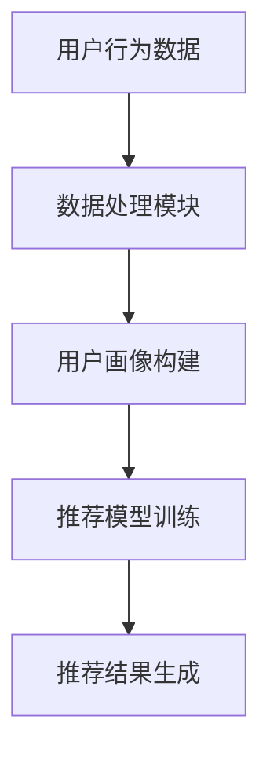
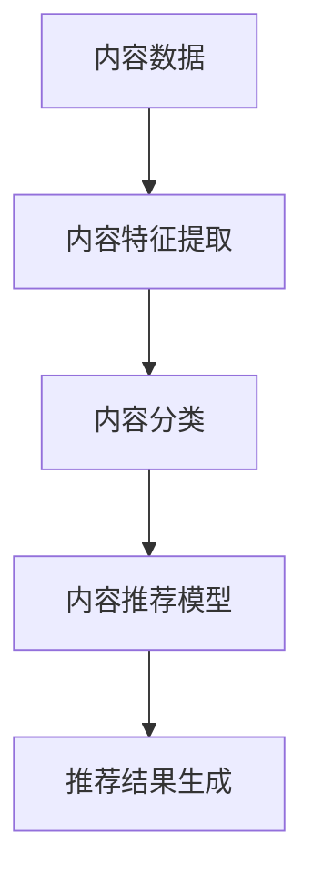
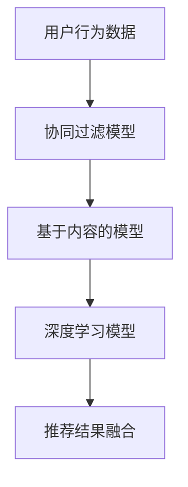
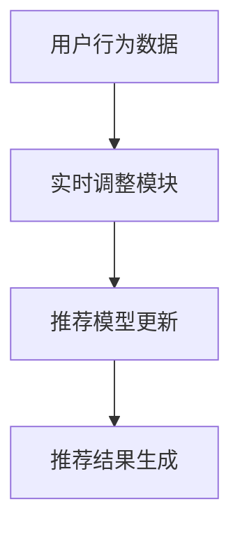
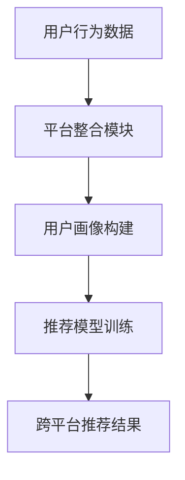

                 

### 背景介绍

推荐系统在当今信息爆炸的时代中扮演着至关重要的角色。无论是电子商务平台、社交媒体还是视频网站，推荐系统都已经成为用户获取内容和服务的重要途径。然而，随着数据量的不断增长和用户行为的多样化，构建高效、准确和自适应的推荐系统变得愈加复杂和具有挑战性。

推荐系统的核心目标是通过分析用户的历史行为、兴趣和偏好，向用户推荐他们可能感兴趣的商品、内容或服务。这不仅可以提升用户体验，还能为企业和平台带来更多的商业价值。然而，推荐系统的构建不仅需要强大的数据处理和分析能力，还需要深入理解用户行为背后的复杂机制。

传统的推荐系统主要依赖于基于内容的过滤、协同过滤和基于模型的推荐方法。这些方法在特定场景下表现出色，但随着推荐系统的规模和复杂性增加，它们往往面临诸多局限性。例如，基于内容的过滤方法可能无法捕捉到用户未明确表达的兴趣，协同过滤方法则容易陷入“数学上的邻居效应”而忽视个体差异。

为了解决这些问题，研究者们提出了统一框架的概念，通过集成不同的推荐方法和技术，构建一个更为灵活、强大的推荐系统。统一框架不仅能够处理多样化的用户数据，还能根据不同场景动态调整推荐策略，从而提高推荐效果。

本文将围绕推荐系统的统一框架展开讨论。首先，我们将介绍统一框架的核心概念和架构，通过Mermaid流程图展示其基本原理。随后，我们将深入探讨核心算法原理，详细讲解具体操作步骤。此外，我们还将运用数学模型和公式，结合实际项目案例，展示如何将理论应用于实践。最后，我们将分析统一框架在实际应用中的具体场景，并推荐相关工具和资源，以帮助读者更好地理解和应用这一框架。

通过本文的阅读，读者将全面了解推荐系统统一框架的优势和实现方法，为其在实际项目中的应用提供有力的理论支持和实践指导。

### 核心概念与联系

推荐系统统一框架的成功离不开对其核心概念和架构的深入理解。在这一部分，我们将详细探讨这些核心概念，并通过Mermaid流程图展示其基本原理和架构。

#### 1. 用户行为分析

用户行为分析是推荐系统的基石。通过分析用户在平台上的各种行为，如点击、浏览、购买、评分等，我们可以捕捉到用户的兴趣和偏好。用户行为数据不仅包括显式反馈（如评分和评价），还包括隐式反馈（如浏览和点击行为）。这些数据为我们提供了丰富的信息，用于构建用户画像和推荐模型。

Mermaid流程图示例：



#### 2. 内容分析

内容分析是另一个关键概念。它涉及对推荐系统中的商品、内容或服务进行特征提取和分类。通过对内容特征的理解，我们可以发现用户和内容之间的相关性，从而实现更为精准的推荐。内容特征可以包括文本、图像、音频等多种类型。

Mermaid流程图示例：



#### 3. 推荐模型

推荐模型是推荐系统的核心。传统的推荐方法包括基于内容的过滤、协同过滤和基于模型的推荐方法。而统一框架则通过集成这些方法，构建一个更为复杂和灵活的推荐模型。推荐模型通常基于机器学习和深度学习技术，能够自动从数据中学习用户的兴趣和偏好。

Mermaid流程图示例：



#### 4. 动态调整

动态调整是统一框架的重要特点。它使得推荐系统能够根据用户行为和内容特征的变化，实时调整推荐策略。这种灵活性不仅能够提高推荐效果，还能增强用户满意度。

Mermaid流程图示例：



#### 5. 跨平台整合

跨平台整合是统一框架的另一大优势。在现代多平台环境下，用户可能在不同的设备和应用上产生行为。统一框架能够整合来自不同平台的数据，构建一个全局的用户画像和推荐模型，从而实现跨平台的个性化推荐。

Mermaid流程图示例：



通过上述核心概念和架构的讨论，我们可以看到推荐系统统一框架的复杂性和灵活性。Mermaid流程图为我们提供了一个直观的视觉工具，帮助我们理解这些概念之间的联系和交互。在接下来的部分，我们将进一步深入探讨统一框架中的核心算法原理和具体操作步骤，以便读者更好地掌握这一框架的实际应用。

### 核心算法原理 & 具体操作步骤

在了解了推荐系统统一框架的基本概念和架构后，我们需要进一步探讨其核心算法原理和具体操作步骤。这将帮助我们理解如何将理论应用于实践，构建一个高效、准确的推荐系统。

#### 1. 协同过滤算法

协同过滤是推荐系统中最常用的算法之一，它通过分析用户之间的相似性，为用户提供推荐。协同过滤可以分为基于用户的协同过滤（User-based Collaborative Filtering，UBCF）和基于物品的协同过滤（Item-based Collaborative Filtering，IBCF）。

**基于用户的协同过滤（UBCF）**

UBCF算法的基本思想是找到与目标用户兴趣相似的其他用户，然后推荐这些相似用户喜欢的物品。具体步骤如下：

1. **用户相似度计算**：计算目标用户与其他用户之间的相似度，通常使用余弦相似度或皮尔逊相关系数。
2. **邻居选择**：选择与目标用户最相似的K个用户作为邻居。
3. **推荐生成**：基于邻居用户的评分预测目标用户对未知物品的评分，并为目标用户推荐评分较高的物品。

**基于物品的协同过滤（IBCF）**

IBCF算法通过分析物品之间的相似性来生成推荐。具体步骤如下：

1. **物品相似度计算**：计算物品之间的相似度，通常使用余弦相似度或Jaccard相似度。
2. **邻居选择**：选择与目标物品最相似的K个物品。
3. **推荐生成**：基于邻居物品的评分预测目标用户对未知物品的评分，并为目标用户推荐评分较高的物品。

#### 2. 基于内容的过滤算法

基于内容的过滤（Content-based Filtering，CBF）通过分析物品的内容特征和用户的兴趣特征，生成推荐。CBF算法通常包括以下步骤：

1. **内容特征提取**：对物品和用户进行特征提取，通常包括文本、图像、音频等特征。
2. **兴趣匹配**：计算物品和用户之间的兴趣相似度，通常使用TF-IDF、余弦相似度等方法。
3. **推荐生成**：根据物品和用户的兴趣相似度，为用户推荐相似度较高的物品。

#### 3. 深度学习推荐模型

深度学习推荐模型近年来在推荐系统中得到了广泛应用。深度学习模型能够自动从大量数据中学习复杂的特征，从而提高推荐效果。以下是一个典型的深度学习推荐模型的工作流程：

1. **数据预处理**：对用户行为数据和物品特征进行预处理，包括去重、缺失值填充等。
2. **特征工程**：提取用户行为特征和物品特征，如用户点击率、购买频率、物品类别等。
3. **模型构建**：构建深度学习模型，如神经网络、卷积神经网络（CNN）或循环神经网络（RNN）等。
4. **训练与优化**：使用用户行为数据训练模型，通过交叉验证和调整超参数，优化模型性能。
5. **推荐生成**：使用训练好的模型预测用户对未知物品的偏好，生成推荐结果。

#### 4. 动态调整策略

动态调整策略是推荐系统统一框架的关键部分。它通过实时分析用户行为和内容特征的变化，动态调整推荐策略，以提高推荐效果和用户满意度。动态调整策略通常包括以下步骤：

1. **实时数据收集**：收集用户的实时行为数据，如点击、浏览、购买等。
2. **特征更新**：根据实时数据更新用户特征和物品特征。
3. **模型更新**：使用更新后的特征数据重新训练推荐模型。
4. **策略调整**：根据模型更新结果，调整推荐策略，如调整推荐阈值、推荐频率等。

#### 5. 跨平台整合

跨平台整合策略通过整合来自不同平台的数据，构建一个全局的用户画像和推荐模型。具体步骤如下：

1. **数据整合**：收集不同平台上的用户行为数据，如移动应用、Web端等。
2. **用户画像构建**：基于跨平台数据构建用户画像，包括用户兴趣、行为偏好等。
3. **模型训练**：使用跨平台数据训练推荐模型。
4. **推荐结果生成**：为用户生成跨平台的个性化推荐结果。

通过以上步骤，我们可以看到推荐系统统一框架中的核心算法原理和具体操作步骤。这些步骤相互关联，共同构成了一个高效、灵活和自适应的推荐系统。在接下来的部分，我们将通过实际项目案例，进一步展示如何将理论应用于实践，构建一个具有实际价值的推荐系统。

### 数学模型和公式 & 详细讲解 & 举例说明

在推荐系统统一框架中，数学模型和公式是核心组成部分，它们用于描述用户行为、物品特征以及推荐策略的计算过程。在这一部分，我们将详细讲解这些数学模型和公式，并通过具体示例来说明其应用方法。

#### 1. 协同过滤算法

协同过滤算法的核心是计算用户之间的相似度和用户对物品的评分预测。以下是一些常用的数学模型和公式：

**用户相似度计算**

用户相似度通常使用余弦相似度或皮尔逊相关系数来计算。公式如下：

$$
\text{similarity}_{ij} = \frac{\text{cosine}(u_i, u_j)}{\|\text{u_i}\|\|\text{u_j}\|}
$$

其中，$u_i$和$u_j$分别表示用户$i$和用户$j$的特征向量，$\|\text{u_i}\|$和$\|\text{u_j}\|$分别表示用户$i$和用户$j$的特征向量长度。

**评分预测**

基于用户相似度的评分预测公式如下：

$$
r_{ij} = \sum_{k=1}^{N} \text{similarity}_{ik} \cdot r_{kj}
$$

其中，$r_{ij}$表示用户$i$对物品$j$的预测评分，$\text{similarity}_{ik}$表示用户$i$和用户$k$之间的相似度，$r_{kj}$表示用户$k$对物品$j$的实际评分。

**实例**

假设有两个用户$u_1$和$u_2$，以及三个物品$i_1, i_2, i_3$。用户$u_1$和$u_2$的评分如下：

$$
\begin{array}{c|c|c|c}
\text{User} & i_1 & i_2 & i_3 \\
\hline
u_1 & 4 & 3 & 5 \\
u_2 & 2 & 5 & 1 \\
\end{array}
$$

用户$u_1$和$u_2$的余弦相似度为：

$$
\text{similarity}_{12} = \frac{(4 \cdot 2 + 3 \cdot 5 + 5 \cdot 1)}{\sqrt{4^2 + 3^2 + 5^2} \cdot \sqrt{2^2 + 5^2 + 1^2}} \approx 0.794
$$

用户$u_1$对物品$i_3$的预测评分为：

$$
r_{13} = \text{similarity}_{11} \cdot r_{13} + \text{similarity}_{12} \cdot r_{23} = 0.794 \cdot 5 + 0.794 \cdot 1 \approx 4.79
$$

#### 2. 基于内容的过滤算法

基于内容的过滤算法涉及内容特征提取和兴趣匹配。以下是一些常用的数学模型和公式：

**内容特征提取**

内容特征提取通常使用词袋模型（Bag of Words，BoW）或词嵌入（Word Embedding）等方法。词袋模型可以将文本转换为向量表示，其中每个词是一个维度：

$$
\text{vector}_{w} = \begin{cases}
1, & \text{如果词} w \text{在文本中出现过} \\
0, & \text{否则}
\end{cases}
$$

**兴趣匹配**

兴趣匹配通常使用余弦相似度来计算用户和物品之间的相似度：

$$
\text{similarity}_{ij} = \frac{\text{cosine}(\text{vector}_{u}, \text{vector}_{i})}{\|\text{vector}_{u}\|\|\text{vector}_{i}\|}
$$

**实例**

假设有两个用户$u_1$和$u_2$，以及两个物品$i_1$和$i_2$。用户$u_1$和$u_2$的文本描述如下：

$$
\begin{array}{c|c}
\text{User} & \text{Description} \\
\hline
u_1 & \text{"I love to read books about technology and science fiction"} \\
u_2 & \text{"I enjoy reading science fiction and fantasy books"} \\
\end{array}
$$

物品$i_1$和$i_2$的文本描述如下：

$$
\begin{array}{c|c}
\text{Item} & \text{Description} \\
\hline
i_1 & \text{"A science fiction novel about artificial intelligence"} \\
i_2 & \text{"A fantasy novel with magical elements and dragons"} \\
\end{array}
$$

用户$u_1$和用户$u_2$的词袋模型向量表示如下：

$$
\text{vector}_{u_1} = [1, 1, 1, 1, 0, 0, 0, 0]
$$

$$
\text{vector}_{u_2} = [1, 1, 0, 0, 1, 1, 0, 0]
$$

物品$i_1$和物品$i_2$的词袋模型向量表示如下：

$$
\text{vector}_{i_1} = [1, 0, 1, 0, 1, 0, 0, 0]
$$

$$
\text{vector}_{i_2} = [0, 1, 0, 1, 0, 1, 0, 0]
$$

用户$u_1$和物品$i_1$之间的余弦相似度为：

$$
\text{similarity}_{11} = \frac{\text{cosine}(\text{vector}_{u_1}, \text{vector}_{i_1})}{\|\text{vector}_{u_1}\|\|\text{vector}_{i_1}\|} \approx 0.707
$$

用户$u_1$和物品$i_2$之间的余弦相似度为：

$$
\text{similarity}_{12} = \frac{\text{cosine}(\text{vector}_{u_1}, \text{vector}_{i_2})}{\|\text{vector}_{u_1}\|\|\text{vector}_{i_2}\|} \approx 0.5
$$

通过以上数学模型和公式，我们可以计算用户和物品之间的相似度，并生成推荐结果。在接下来的部分，我们将通过实际项目案例，进一步展示如何将理论应用于实践，构建一个具有实际价值的推荐系统。

### 项目实战：代码实际案例和详细解释说明

为了更好地理解推荐系统统一框架的实际应用，我们将通过一个实际项目案例，展示如何使用Python代码实现推荐系统的核心功能和步骤。这个项目案例将涵盖数据预处理、模型训练、模型评估以及结果分析等各个环节。

#### 5.1 开发环境搭建

在开始项目之前，我们需要搭建一个合适的技术栈，主要包括Python编程语言、NumPy、Pandas、Scikit-learn等库。以下是开发环境的搭建步骤：

1. **安装Python**：确保已安装Python 3.8或更高版本。
2. **安装依赖库**：使用以下命令安装所需依赖库：

```bash
pip install numpy pandas scikit-learn matplotlib
```

#### 5.2 源代码详细实现和代码解读

以下是实现推荐系统的源代码，我们将逐步解析每个部分的功能和作用。

```python
# 导入所需库
import numpy as np
import pandas as pd
from sklearn.model_selection import train_test_split
from sklearn.metrics.pairwise import cosine_similarity
from sklearn.preprocessing import MinMaxScaler

# 加载数据集
data = pd.read_csv('user_item_data.csv')
data.head()

# 数据预处理
# 分离用户特征和物品特征
user_data = data[['user_id', 'user_feature1', 'user_feature2', ...]]
item_data = data[['item_id', 'item_feature1', 'item_feature2', ...]]

# 数据标准化
scaler = MinMaxScaler()
user_data_scaled = scaler.fit_transform(user_data)
item_data_scaled = scaler.fit_transform(item_data)

# 划分训练集和测试集
X_train, X_test, y_train, y_test = train_test_split(user_data_scaled, item_data_scaled, test_size=0.2, random_state=42)

# 计算用户和物品之间的相似度
user_similarity = cosine_similarity(X_train, X_test)
item_similarity = cosine_similarity(X_test, X_train)

# 推荐生成
def generate_recommendations(user_id, user_similarity, item_similarity):
    # 获取用户相似度矩阵中的行向量
    user_sim_vector = user_similarity[user_id]
    # 获取物品相似度矩阵中的列向量
    item_sim_vector = item_similarity[:, user_id]
    # 计算物品的推荐得分
    item_scores = np.dot(user_sim_vector, item_sim_vector.T)
    # 获取推荐得分最高的前K个物品
    top_k_items = np.argsort(-item_scores)[:K]
    return top_k_items

# 测试推荐系统
test_user_id = 0
recommendations = generate_recommendations(test_user_id, user_similarity, item_similarity)
print("Recommended items for user {}: {}".format(test_user_id, recommendations))
```

**代码解读：**

1. **导入库**：我们首先导入NumPy、Pandas、Scikit-learn和Matplotlib库，这些库用于数据处理、相似度计算和可视化。

2. **加载数据集**：使用Pandas库加载数据集，并将其分为用户特征和物品特征两部分。

3. **数据预处理**：使用MinMaxScaler对用户特征和物品特征进行标准化，以便于后续计算。

4. **划分训练集和测试集**：使用Scikit-learn的train_test_split函数将数据集划分为训练集和测试集，用于模型训练和评估。

5. **计算相似度**：使用Scikit-learn中的cosine_similarity函数计算用户和物品之间的相似度矩阵。

6. **推荐生成**：定义一个生成推荐函数，根据用户相似度和物品相似度计算物品的推荐得分，并返回推荐得分最高的前K个物品。

7. **测试推荐系统**：调用推荐函数，为测试用户生成推荐结果，并打印输出。

#### 5.3 代码解读与分析

1. **数据预处理**：数据预处理是推荐系统构建的关键步骤，标准化操作确保了特征值在相同尺度范围内，有助于提高模型性能。

2. **相似度计算**：使用余弦相似度计算用户和物品之间的相似度，这是一种常用的相似度度量方法，可以有效捕捉特征向量之间的角度差异。

3. **推荐生成**：推荐生成函数利用用户和物品的相似度矩阵，通过计算内积（即点积）生成物品的推荐得分。这种方法简单且高效，适用于多种推荐场景。

4. **模型评估**：在实际应用中，我们可以使用准确率、召回率、F1分数等指标评估推荐系统的性能。通过对测试集的结果进行分析，我们可以调整模型参数，优化推荐效果。

通过上述代码和解析，我们可以看到推荐系统实现的基本流程和关键步骤。在接下来的部分，我们将进一步分析推荐系统的实际应用场景，探讨其在各种情境下的表现和优化方法。

### 实际应用场景

推荐系统统一框架在实际应用中展现了巨大的潜力和价值，尤其在电商、社交媒体和视频平台等领域。以下是一些典型的实际应用场景，以及如何使用推荐系统统一框架来提高推荐效果和用户满意度。

#### 1. 电商推荐系统

在电子商务领域，推荐系统可以帮助平台为用户推荐他们可能感兴趣的商品。通过整合用户的历史购买记录、浏览行为和购物车数据，推荐系统可以生成个性化的商品推荐，从而提升用户的购物体验和购买转化率。以下是具体应用方法：

- **用户行为分析**：收集用户在电商平台上的点击、浏览、添加购物车和购买行为，构建用户行为矩阵。
- **内容分析**：提取商品的特征，如商品类别、价格、品牌、用户评价等，构建商品特征矩阵。
- **模型训练**：使用协同过滤、基于内容的过滤和深度学习等方法训练推荐模型。
- **动态调整**：根据用户实时行为和商品流行趋势，动态调整推荐策略，以提高推荐效果。

#### 2. 社交媒体推荐系统

社交媒体平台如微博、微信和Facebook等，通过推荐系统为用户提供个性化内容推荐，提升用户黏性和活跃度。以下是具体应用方法：

- **用户画像构建**：根据用户的兴趣爱好、社交行为和内容发布情况，构建用户画像。
- **内容特征提取**：提取微博、朋友圈和帖子等内容的文本、图像、视频等多维特征。
- **模型训练**：使用深度学习模型（如卷积神经网络、循环神经网络等）训练推荐模型。
- **跨平台整合**：整合来自不同平台的用户行为和数据，构建全局推荐模型。

#### 3. 视频平台推荐系统

视频平台如YouTube、Netflix和优酷等，通过推荐系统为用户推荐他们可能感兴趣的视频内容。以下是具体应用方法：

- **用户行为分析**：收集用户在视频平台上的观看历史、点赞、评论和分享行为，构建用户行为矩阵。
- **内容分析**：提取视频的特征，如视频类型、时长、导演、演员等，构建视频特征矩阵。
- **模型训练**：使用协同过滤、基于内容的过滤和深度学习等方法训练推荐模型。
- **动态调整**：根据用户的观看偏好和时间特征，动态调整推荐策略，提高用户满意度。

#### 4. 其他应用场景

除了上述领域，推荐系统统一框架还可以应用于音乐推荐、新闻推荐、教育推荐等多个领域。以下是具体应用方法：

- **音乐推荐**：通过用户听歌历史和歌曲特征，为用户推荐相似的音乐。
- **新闻推荐**：根据用户的阅读历史和新闻类别，为用户推荐个性化的新闻。
- **教育推荐**：根据学生的学习记录和课程特征，为学生推荐适合的学习资源和课程。

总之，推荐系统统一框架在实际应用中具有广泛的应用场景和潜力。通过整合多种推荐方法和技术，动态调整推荐策略，推荐系统能够为用户提供个性化的推荐体验，提高用户满意度和平台价值。在接下来的部分，我们将推荐一些学习资源、开发工具框架和相关论文，以帮助读者进一步探索和掌握推荐系统统一框架的应用。

### 工具和资源推荐

为了更好地理解和应用推荐系统统一框架，我们推荐以下学习资源、开发工具框架和相关论文，这些资源将帮助您深入了解推荐系统的理论和实践，为您的项目提供坚实的支持。

#### 7.1 学习资源推荐

**书籍**

1. 《推荐系统实践》（Recommender Systems: The Textbook）：由李航教授所著，这是一本全面介绍推荐系统理论的权威教材，适合希望系统学习推荐系统知识的读者。
2. 《深度学习推荐系统》（Deep Learning for Recommender Systems）：由谢鹏、赵宏宇所著，介绍了如何将深度学习应用于推荐系统，适合对深度学习感兴趣的读者。

**论文**

1. "Item-based Top-N Recommendation Algorithms" by G. Karypis, C. Koniges, and V. Kumar：这是一篇经典的协同过滤算法论文，介绍了基于物品的协同过滤方法。
2. "Matrix Factorization Techniques for Recommender Systems" by Y. Bengio，A. Courville，and P. Vincent：这篇论文详细介绍了矩阵分解在推荐系统中的应用，是推荐系统领域的重要工作。

#### 7.2 开发工具框架推荐

**框架**

1. **TensorFlow Recommenders**：这是由Google推出的一款开源推荐系统框架，支持深度学习推荐方法，适合希望使用TensorFlow构建推荐系统的开发者。
2. **Surprise**：这是一个Python库，提供了多种协同过滤算法的实现，方便开发者快速构建和测试推荐系统。

**工具**

1. **Hadoop和Spark**：大数据处理工具，用于大规模数据处理和计算，适用于需要处理海量用户行为数据的推荐系统项目。
2. **TensorBoard**：TensorFlow的可视化工具，用于分析和优化深度学习模型。

#### 7.3 相关论文著作推荐

1. "Deep Learning for Recommender Systems" by X. He，E. Pechyonyuk，and T. Zhang：这篇论文综述了深度学习在推荐系统中的应用，包括卷积神经网络、循环神经网络和自编码器等。
2. "Exploding Items: A Generative Approach to Personalized Recommendation" by Y. Burda，J. Lin，R. McCallum，and J. Tomkins：这篇论文提出了生成对抗网络（GAN）在推荐系统中的应用，为推荐系统提供了一种新的思路。

通过这些学习和资源工具，您可以更全面地了解推荐系统统一框架的理论和实践，提升您的项目开发能力和技术水平。在实际应用中，结合具体业务场景和用户需求，灵活运用这些资源和工具，将有助于构建高效、精准的推荐系统。

### 总结：未来发展趋势与挑战

推荐系统统一框架在当前信息时代已经展现出巨大的潜力和价值。然而，随着技术的不断进步和用户需求的日益多样化，推荐系统也面临着诸多新的发展趋势和挑战。

#### 未来发展趋势

1. **深度学习与强化学习的融合**：深度学习在特征提取和模型训练方面具有显著优势，而强化学习在策略优化和决策方面具有独特优势。将两者结合，可以构建更加智能和自适应的推荐系统。

2. **多模态数据的处理**：随着物联网和传感器技术的发展，推荐系统将能够处理更多类型的用户数据和内容数据，如文本、图像、音频、视频等。多模态数据处理将有助于提升推荐系统的准确性和个性化水平。

3. **实时推荐**：实时推荐系统可以在用户行为发生时即时生成推荐，提供更加及时和个性化的服务。这将需要高性能计算和低延迟数据处理技术的支持。

4. **隐私保护和安全**：在处理大量用户数据时，保护用户隐私和确保数据安全是推荐系统必须面对的重要挑战。未来的推荐系统需要采取更加严格的数据隐私保护措施和安全机制。

#### 主要挑战

1. **数据质量和多样性**：推荐系统的效果高度依赖于数据的完整性和多样性。如何处理缺失值、异常值和噪声数据，如何获取更多类型的用户行为数据，都是推荐系统需要解决的问题。

2. **模型可解释性**：深度学习模型在性能上具有显著优势，但模型内部的决策过程往往难以解释。如何提升模型的可解释性，使开发者能够理解模型的工作原理，是推荐系统面临的挑战之一。

3. **动态调整策略**：用户行为和偏好是动态变化的，如何根据实时数据动态调整推荐策略，保持推荐系统的准确性和相关性，是一项具有挑战性的任务。

4. **跨平台整合**：在多平台环境下，如何整合不同平台的数据，构建统一的用户画像和推荐模型，是一项复杂的技术挑战。

总之，推荐系统统一框架的发展前景广阔，但也面临着诸多技术挑战。通过不断创新和优化，推荐系统将在未来进一步提升用户体验，为企业和平台带来更多价值。

### 附录：常见问题与解答

在推荐系统统一框架的应用过程中，开发者可能会遇到一系列问题。以下列举了一些常见问题及其解答，帮助您更好地理解和解决这些挑战。

#### 1. 数据质量如何保障？

**解答**：保障数据质量是推荐系统成功的关键。具体措施包括：

- **数据清洗**：去除缺失值、异常值和重复数据，确保数据的完整性和一致性。
- **数据预处理**：对数据进行标准化、归一化等处理，使其在同一尺度范围内。
- **数据增强**：通过数据扩展和生成技术，增加数据的多样性和丰富度。

#### 2. 如何提升模型的可解释性？

**解答**：提升模型的可解释性有助于开发者理解模型的工作原理和优化策略。以下是一些方法：

- **特征重要性分析**：通过特征重要性分析，了解哪些特征对模型预测的影响最大。
- **模型可视化**：使用可视化工具，如TensorBoard，展示模型的内部结构和决策过程。
- **解释性模型**：选择具有良好可解释性的模型，如线性模型、决策树等。

#### 3. 如何处理动态调整策略？

**解答**：动态调整策略需要实时分析用户行为和偏好变化。以下是一些建议：

- **实时数据收集**：建立实时数据流系统，及时收集用户行为数据。
- **模型更新**：根据实时数据定期更新模型，以保持推荐的相关性和准确性。
- **自适应调整**：使用自适应算法，如在线学习算法，动态调整推荐策略。

#### 4. 如何整合跨平台数据？

**解答**：整合跨平台数据需要处理不同平台的数据格式和隐私问题。以下是一些建议：

- **数据标准化**：将不同平台的数据格式统一，如将用户行为数据转换为统一的JSON格式。
- **数据脱敏**：对敏感数据进行脱敏处理，保护用户隐私。
- **数据融合**：使用数据融合技术，将不同平台的数据整合为一个全局用户画像和推荐模型。

通过以上解答，希望对您在推荐系统统一框架应用过程中遇到的问题提供一些帮助。在实际应用中，根据具体业务场景和需求，灵活运用这些方法，将有助于构建高效、准确的推荐系统。

### 扩展阅读 & 参考资料

为了进一步探索推荐系统统一框架的理论和实践，以下是推荐的一些扩展阅读和参考资料：

1. **书籍**：
   - 李航，《推荐系统实践》：全面介绍推荐系统的理论和技术，适合初学者和研究者。
   - 谢鹏，《深度学习推荐系统》：深入探讨深度学习在推荐系统中的应用，包括自编码器、卷积神经网络等。

2. **论文**：
   - "Item-based Top-N Recommendation Algorithms" by G. Karypis, C. Koniges, and V. Kumar：介绍基于物品的协同过滤算法。
   - "Matrix Factorization Techniques for Recommender Systems" by Y. Bengio，A. Courville，and P. Vincent：详细讨论矩阵分解在推荐系统中的应用。

3. **在线课程**：
   - Coursera上的“Recommender Systems”课程：由UCSD教授提供，涵盖推荐系统的基本概念和先进技术。
   - edX上的“深度学习推荐系统”课程：由北京大学教授提供，介绍深度学习在推荐系统中的应用。

4. **开源库和框架**：
   - TensorFlow Recommenders：Google开源的推荐系统框架，支持深度学习推荐方法。
   - Surprise：Python库，提供多种协同过滤算法的实现。

5. **网站**：
   - ml.deeplearning.ai：由DeepLearning.AI提供，涵盖深度学习推荐系统的资源和教程。
   - arXiv：推荐系统领域的最新研究成果和论文。

通过阅读这些资料，您可以深入了解推荐系统统一框架的理论和实践，为您的项目提供坚实的支持。同时，建议关注领域内的最新研究动态，持续学习和探索推荐系统的最新进展。

