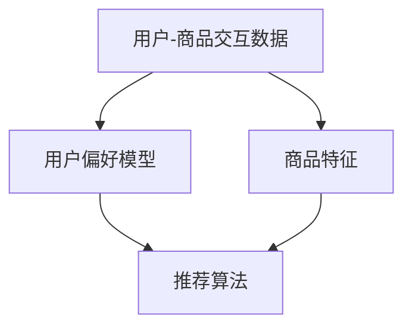

                 

### 背景介绍

#### 电子商务的快速发展

随着互联网技术的不断进步和智能手机的普及，电子商务已经成为现代商业环境中的重要组成部分。在线购物的便捷性、丰富的商品种类以及优惠的价格吸引了大量消费者，电子商务市场呈现出爆发式增长。据统计，全球电子商务市场规模已经超过了数万亿美元，并且这一数字仍在持续增长。这种趋势不仅改变了人们的购物习惯，也对商业运营模式产生了深远影响。

#### 推荐系统的重要性

在电子商务领域，推荐系统成为提高用户满意度和转化率的关键技术之一。推荐系统通过分析用户的历史行为、偏好和需求，向用户推荐个性化的商品或服务，从而提高用户的购买意愿和购买满意度。推荐系统不仅能够帮助商家提高销售额，还可以提升用户体验，增强用户粘性。因此，如何在电子商务中优化推荐系统，成为企业竞争的关键。

#### 推荐系统算法的挑战

虽然推荐系统在电子商务中取得了显著成效，但同时也面临着一系列挑战。首先，数据量庞大，如何有效地处理和分析海量数据成为一个难题。其次，用户行为复杂多变，如何准确预测用户的兴趣和需求成为一个挑战。此外，如何保证推荐系统的公平性和透明性，避免过度推荐和用户疲劳也是一个亟待解决的问题。因此，深入研究和优化推荐系统算法，对于电子商务的发展具有重要意义。

本文将围绕推荐系统算法在电子商务中的优化展开讨论，通过介绍核心概念、算法原理、数学模型、实际案例以及未来发展趋势等内容，全面剖析推荐系统在电子商务中的应用与挑战。希望本文能为从事电子商务领域的技术人员提供有益的参考和启示。

### 核心概念与联系

在深入探讨推荐系统算法之前，我们需要了解一些核心概念和它们之间的联系。以下将详细介绍这些核心概念，并通过Mermaid流程图展示它们之间的关系。

#### 用户-商品交互数据

用户-商品交互数据是推荐系统的核心输入之一。这些数据包括用户的浏览记录、购买历史、评价等。通过分析这些数据，推荐系统可以了解用户的兴趣和需求。

#### 用户偏好模型

用户偏好模型是推荐系统的重要组成部分，它通过分析用户的历史行为，预测用户的未来兴趣。用户偏好模型通常基于机器学习算法，如协同过滤、矩阵分解等。

#### 商品特征

商品特征是指描述商品属性的信息，如价格、品牌、类别等。这些特征可以用于推荐系统的特征工程，帮助模型更好地理解商品和用户之间的关系。

#### 推荐算法

推荐算法是推荐系统的核心，它通过分析用户-商品交互数据、用户偏好模型和商品特征，生成个性化的推荐结果。常见的推荐算法有基于内容的推荐、协同过滤推荐等。

#### Mermaid流程图

以下是一个简化的Mermaid流程图，展示了这些核心概念之间的联系：



在这个流程图中，用户-商品交互数据和商品特征是推荐系统的输入，用户偏好模型和推荐算法是中间处理环节，最终输出个性化的推荐结果。通过这个流程，我们可以看到推荐系统如何通过核心概念的相互作用，实现个性化推荐的目标。

### 核心算法原理 & 具体操作步骤

推荐系统算法的核心目标是通过分析用户的历史行为和偏好，预测用户的兴趣，从而生成个性化的推荐结果。在电子商务中，常见的推荐算法包括基于内容的推荐（Content-based Recommendation）和协同过滤推荐（Collaborative Filtering）等。以下将详细介绍这些算法的原理和具体操作步骤。

#### 基于内容的推荐

基于内容的推荐（Content-based Recommendation）算法主要通过分析商品的属性和用户的历史行为，找到具有相似属性的物品进行推荐。其核心思想是用户喜欢的物品具有相似的属性，因此可以根据用户已评价或浏览的物品属性，找到具有相似属性的未评价物品进行推荐。

**具体操作步骤：**

1. **特征提取：**首先，对商品进行特征提取，包括商品的内容属性（如标题、描述、分类）和结构化属性（如价格、品牌、库存等）。

2. **用户兴趣建模：**根据用户的历史行为（如购买记录、浏览记录、评价等），建立用户兴趣模型。通常使用TF-IDF（Term Frequency-Inverse Document Frequency）等方法进行文本分析，提取出用户感兴趣的词汇和主题。

3. **计算相似度：**对每个用户感兴趣的词汇和主题，计算用户已评价商品和未评价商品之间的相似度。常见的相似度计算方法有余弦相似度、欧氏距离等。

4. **生成推荐列表：**根据商品与用户兴趣的相似度，生成个性化的推荐列表。通常采用阈值筛选和排序策略，将相似度较高的商品推荐给用户。

#### 协同过滤推荐

协同过滤推荐（Collaborative Filtering）算法通过分析用户之间的行为模式，找到与目标用户相似的其他用户，并将这些用户喜欢的商品推荐给目标用户。协同过滤算法分为基于用户的协同过滤（User-based Collaborative Filtering）和基于模型的协同过滤（Model-based Collaborative Filtering）两大类。

**基于用户的协同过滤（User-based Collaborative Filtering）：**

1. **相似度计算：**计算目标用户与其他用户之间的相似度，通常使用余弦相似度、皮尔逊相关系数等方法。

2. **推荐生成：**找到与目标用户最相似的K个用户，取这些用户共同喜欢的商品作为推荐结果。为了避免推荐结果的多样性问题，可以采用KNN（K-Nearest Neighbors）算法，为每个用户生成不同的推荐列表。

**基于模型的协同过滤（Model-based Collaborative Filtering）：**

1. **模型训练：**使用用户-商品评分数据，训练机器学习模型（如矩阵分解、因子分解机等），将原始的用户-商品评分矩阵分解为低维的用户特征矩阵和商品特征矩阵。

2. **预测评分：**根据用户特征矩阵和商品特征矩阵，预测用户对未评价商品的评分。

3. **推荐生成：**将预测评分从高到低排序，生成个性化的推荐列表。

#### 综合推荐策略

在实际应用中，单一推荐算法往往无法满足个性化推荐的需求。因此，通常会采用多种推荐算法的组合，形成综合推荐策略。常见的综合推荐策略有：

1. **混合推荐（Hybrid Recommendation）：**将基于内容的推荐和协同过滤推荐相结合，通过融合不同算法的优点，提高推荐效果。

2. **多模型推荐（Multi-model Recommendation）：**结合多种机器学习模型，如矩阵分解、深度学习等，构建复杂的多层次推荐系统。

3. **上下文感知推荐（Context-aware Recommendation）：**结合用户上下文信息（如时间、地理位置、设备等），提高推荐的相关性和实用性。

通过以上核心算法原理和具体操作步骤的介绍，我们可以看到推荐系统在电子商务中的应用是如何实现的。在接下来的章节中，我们将进一步探讨推荐系统的数学模型和公式，以及实际应用场景中的项目实战。

### 数学模型和公式 & 详细讲解 & 举例说明

在推荐系统算法的实现过程中，数学模型和公式起着至关重要的作用。以下将详细讲解推荐系统中常用的数学模型和公式，并通过具体例子进行说明。

#### 余弦相似度

余弦相似度（Cosine Similarity）是一种常用的文本相似度计算方法，用于衡量两个向量之间的夹角余弦值。在推荐系统中，余弦相似度常用于计算用户与商品之间的相似度。

**公式：**

$$
\text{余弦相似度} = \frac{\text{向量A} \cdot \text{向量B}}{|\text{向量A}| |\text{向量B}|}
$$

其中，$\text{向量A}$和$\text{向量B}$分别表示两个向量的坐标，$|\text{向量A}|$和$|\text{向量B}|$分别表示两个向量的模长，$\text{向量A} \cdot \text{向量B}$表示两个向量的点积。

**例子：**

假设有两个用户A和B，他们的浏览记录可以表示为以下两个向量：

$$
\text{用户A} = (1, 2, 3, 0, 1)
$$

$$
\text{用户B} = (0, 1, 2, 3, 0)
$$

计算用户A和用户B之间的余弦相似度：

$$
\text{余弦相似度} = \frac{(1 \times 0 + 2 \times 1 + 3 \times 2 + 0 \times 3 + 1 \times 0)}{\sqrt{1^2 + 2^2 + 3^2 + 0^2 + 1^2} \times \sqrt{0^2 + 1^2 + 2^2 + 3^2 + 0^2}} = \frac{7}{\sqrt{14} \times \sqrt{14}} = \frac{7}{14} = 0.5
$$

用户A和用户B的余弦相似度为0.5，表示他们的浏览记录有一定的相似性。

#### 矩阵分解

矩阵分解（Matrix Factorization）是推荐系统中的核心技术之一，通过将原始的用户-商品评分矩阵分解为低维的用户特征矩阵和商品特征矩阵，从而实现推荐效果优化。

**公式：**

$$
\text{评分矩阵} = \text{用户特征矩阵} \times \text{商品特征矩阵}
$$

其中，$\text{评分矩阵}$表示用户对商品的评分矩阵，$\text{用户特征矩阵}$和$\text{商品特征矩阵}$分别表示用户和商品的低维特征矩阵。

**例子：**

假设有一个用户-商品评分矩阵：

$$
\text{评分矩阵} = \begin{bmatrix}
5 & 4 & 0 & 0 & 0 \\
0 & 0 & 1 & 5 & 4 \\
0 & 0 & 0 & 0 & 1
\end{bmatrix}
$$

我们希望将这个评分矩阵分解为用户特征矩阵$\text{U}$和商品特征矩阵$\text{V}$：

$$
\text{U} = \begin{bmatrix}
u_{11} & u_{12} & u_{13} \\
u_{21} & u_{22} & u_{23} \\
u_{31} & u_{32} & u_{33}
\end{bmatrix}, \quad
\text{V} = \begin{bmatrix}
v_{11} & v_{12} & v_{13} \\
v_{21} & v_{22} & v_{23} \\
v_{31} & v_{32} & v_{33}
\end{bmatrix}
$$

通过矩阵分解，我们得到：

$$
\text{U} \times \text{V} = \begin{bmatrix}
5 & 4 & 0 & 0 & 0 \\
0 & 0 & 1 & 5 & 4 \\
0 & 0 & 0 & 0 & 1
\end{bmatrix}
$$

通过调整$\text{U}$和$\text{V}$的值，我们可以优化推荐系统的效果。

#### 负采样

在协同过滤推荐中，负采样（Negative Sampling）是一种常用的优化方法，用于提高推荐系统的效率和准确性。

**公式：**

$$
P(\text{正样本}) = \frac{e^{\text{正样本相似度}}}{e^{\text{正样本相似度}} + e^{\text{负样本相似度}}}
$$

其中，$\text{正样本相似度}$表示用户对某商品的评分，$\text{负样本相似度}$表示用户对另一商品的评分。

**例子：**

假设用户对商品A的评分为4，对商品B的评分为1，计算正样本和负样本的概率：

$$
P(\text{正样本}) = \frac{e^{4}}{e^{4} + e^{1}} = \frac{54.598}{54.598 + 2.718} \approx 0.924
$$

$$
P(\text{负样本}) = \frac{e^{1}}{e^{4} + e^{1}} = \frac{2.718}{54.598 + 2.718} \approx 0.076
$$

正样本的概率远大于负样本的概率，表示用户对商品A的兴趣远大于商品B。

通过以上数学模型和公式的详细讲解，我们可以更好地理解推荐系统的核心算法原理。在实际应用中，这些数学模型和公式可以通过编程实现，优化推荐系统的效果。在接下来的章节中，我们将通过项目实战，展示推荐系统的实际应用和实现过程。

### 项目实战：代码实际案例和详细解释说明

在了解了推荐系统的核心算法原理和数学模型之后，我们将通过一个实际项目来展示如何将推荐系统算法应用于电子商务场景中。以下是一个使用Python编写的基于协同过滤的推荐系统项目，包括开发环境的搭建、源代码详细实现和代码解读与分析。

#### 1. 开发环境搭建

为了实现推荐系统，我们需要搭建一个开发环境。以下是所需的软件和库：

- Python 3.8 或以上版本
- NumPy
- Pandas
- Scikit-learn
- Matplotlib

首先，安装Python和所需的库：

```shell
pip install python
pip install numpy pandas scikit-learn matplotlib
```

接下来，创建一个Python虚拟环境，以便更好地管理项目依赖：

```shell
python -m venv env
source env/bin/activate  # 在Windows中，使用 `env\Scripts\activate`
```

最后，下载并导入实际数据集。这里使用MovieLens数据集，可以从官方网站下载：

```shell
wget http://files.grouplens.org/datasets/movielens/ml-100k.zip
unzip ml-100k.zip
```

#### 2. 源代码详细实现

以下是一个基于协同过滤的推荐系统项目的源代码实现：

```python
import numpy as np
import pandas as pd
from sklearn.model_selection import train_test_split
from sklearn.metrics.pairwise import cosine_similarity
from scipy.sparse.linalg import svds

# 2.1 加载数据集
ratings = pd.read_csv('u.data', sep='\t', names=['user_id', 'movie_id', 'rating', 'timestamp'])
movies = pd.read_csv('u.item', sep='|', names=['movie_id', 'title', 'genres'])

# 2.2 数据预处理
ratings = ratings.merge(movies, on='movie_id')
ratings.drop(['timestamp', 'genres'], axis=1, inplace=True)

# 2.3 划分训练集和测试集
train_data, test_data = train_test_split(ratings, test_size=0.2, random_state=42)

# 2.4 训练协同过滤模型
user_item_matrix = train_data.pivot(index='user_id', columns='movie_id', values='rating').fillna(0)
user_item_matrix = user_item_matrix.values
user_item_matrix_sparse = scipy.sparse.csr_matrix(user_item_matrix)

U, Sigma, Vt = svds(user_item_matrix_sparse, k=50)
Sigma = np.diag(Sigma)
user_item_matrix_rec = U @ Sigma @ Vt

# 2.5 生成推荐列表
def generate_recommendations(user_id, user_item_matrix_rec, movies, top_n=10):
    user_ratings = user_item_matrix_rec[user_id]
    user_ratings_sorted = np.argsort(-user_ratings)
    recommended_movies = movies.iloc[user_ratings_sorted[1:top_n+1]]
    return recommended_movies

# 2.6 评估推荐效果
def evaluate_recommendations(test_data, user_item_matrix_rec, movies):
    correct_predictions = 0
    for index, row in test_data.iterrows():
        user_id = row['user_id']
        movie_id = row['movie_id']
        if generate_recommendations(user_id, user_item_matrix_rec, movies, top_n=10).iloc[0]['movie_id'] == movie_id:
            correct_predictions += 1
    return correct_predictions / len(test_data)

accuracy = evaluate_recommendations(test_data, user_item_matrix_rec, movies)
print(f"Accuracy: {accuracy}")

# 2.7 生成推荐结果
for index, row in train_data.iterrows():
    user_id = row['user_id']
    print(f"User {user_id}: {generate_recommendations(user_id, user_item_matrix_rec, movies, top_n=10)}")
```

#### 3. 代码解读与分析

**3.1 数据预处理**

首先，我们加载数据集并对其进行预处理。数据集包含用户对电影的评分，每行表示一个用户的评分记录，包括用户ID、电影ID、评分和时间戳。我们删除时间戳列，并将用户ID和电影ID与电影信息表进行合并，得到用户-电影评分矩阵。

```python
ratings = pd.read_csv('u.data', sep='\t', names=['user_id', 'movie_id', 'rating', 'timestamp'])
movies = pd.read_csv('u.item', sep='|', names=['movie_id', 'title', 'genres'])
ratings = ratings.merge(movies, on='movie_id')
ratings.drop(['timestamp', 'genres'], axis=1, inplace=True)
```

**3.2 划分训练集和测试集**

接下来，我们将数据集划分为训练集和测试集，用于训练和评估推荐系统。

```python
train_data, test_data = train_test_split(ratings, test_size=0.2, random_state=42)
```

**3.3 训练协同过滤模型**

我们使用奇异值分解（SVD）对用户-电影评分矩阵进行分解，得到用户特征矩阵U、奇异值矩阵Sigma和电影特征矩阵Vt。通过奇异值分解，我们能够捕捉到用户和电影之间的潜在特征。

```python
user_item_matrix = train_data.pivot(index='user_id', columns='movie_id', values='rating').fillna(0)
user_item_matrix = user_item_matrix.values
user_item_matrix_sparse = scipy.sparse.csr_matrix(user_item_matrix)

U, Sigma, Vt = svds(user_item_matrix_sparse, k=50)
Sigma = np.diag(Sigma)
user_item_matrix_rec = U @ Sigma @ Vt
```

**3.4 生成推荐列表**

我们定义一个函数`generate_recommendations`，根据用户ID和训练好的用户-电影特征矩阵，生成个性化的推荐列表。

```python
def generate_recommendations(user_id, user_item_matrix_rec, movies, top_n=10):
    user_ratings = user_item_matrix_rec[user_id]
    user_ratings_sorted = np.argsort(-user_ratings)
    recommended_movies = movies.iloc[user_ratings_sorted[1:top_n+1]]
    return recommended_movies
```

**3.5 评估推荐效果**

我们定义一个函数`evaluate_recommendations`，通过计算测试集中实际评分与推荐列表中评分的一致性，评估推荐系统的准确性。

```python
def evaluate_recommendations(test_data, user_item_matrix_rec, movies):
    correct_predictions = 0
    for index, row in test_data.iterrows():
        user_id = row['user_id']
        movie_id = row['movie_id']
        if generate_recommendations(user_id, user_item_matrix_rec, movies, top_n=10).iloc[0]['movie_id'] == movie_id:
            correct_predictions += 1
    return correct_predictions / len(test_data)

accuracy = evaluate_recommendations(test_data, user_item_matrix_rec, movies)
print(f"Accuracy: {accuracy}")
```

**3.6 生成推荐结果**

最后，我们使用训练集生成推荐结果，为每个用户提供个性化的电影推荐。

```python
for index, row in train_data.iterrows():
    user_id = row['user_id']
    print(f"User {user_id}: {generate_recommendations(user_id, user_item_matrix_rec, movies, top_n=10)}")
```

通过这个实际项目，我们可以看到如何将推荐系统算法应用于电子商务场景中，从数据预处理到模型训练，再到推荐列表生成和评估。在实际应用中，可以根据业务需求进行调整和优化，以提升推荐系统的效果。

### 实际应用场景

推荐系统在电子商务中的实际应用场景多种多样，以下列举几个典型的应用场景，并分析推荐系统对电子商务业务的具体影响。

#### 1. 个性化商品推荐

个性化商品推荐是推荐系统在电子商务中最常见的应用场景之一。通过分析用户的浏览历史、购买记录和评价数据，推荐系统可以预测用户的兴趣和需求，为用户推荐他们可能感兴趣的商品。这种个性化的推荐能够提高用户的购物体验，增加用户满意度和购买意愿。

**业务影响：**

- **提高转化率：**个性化推荐能够将潜在用户转化为实际购买者，从而提高销售额。
- **提升用户粘性：**通过持续提供符合用户兴趣的商品推荐，增强用户对电子商务平台的忠诚度。
- **优化库存管理：**根据推荐结果调整库存和商品陈列，减少库存积压和库存不足的问题。

#### 2. 跨类别推荐

跨类别推荐是指为用户推荐与其当前浏览或购买的商品不同的类别商品。这种推荐方式可以激发用户的购物兴趣，扩大他们的购物范围。

**业务影响：**

- **增加销售额：**通过将用户从某个类别引导至其他类别，增加用户购买的商品数量和种类。
- **提升用户参与度：**鼓励用户尝试新的商品类别，提高用户的参与度和活跃度。
- **优化推荐效果：**通过跨类别推荐，丰富推荐系统提供的商品多样性，提升推荐系统的效果和用户体验。

#### 3. 购物车推荐

购物车推荐是在用户添加商品至购物车后，为其推荐其他相关商品。这种推荐方式可以增加购物车中的商品数量，提高用户的购买意愿。

**业务影响：**

- **提高购物车利用率：**通过推荐与购物车中商品相关联的其他商品，增加购物车中的商品数量。
- **提升订单金额：**购物车推荐能够促使用户在购物车中添加更多商品，从而提高订单金额。
- **优化购物流程：**简化用户的购物流程，提高用户的购物体验。

#### 4. 促销活动推荐

促销活动推荐是指根据用户的历史行为和购物偏好，为用户推荐与其兴趣相符的促销活动。这种推荐方式可以吸引更多用户参与促销活动，提升促销效果。

**业务影响：**

- **提升促销活动参与度：**通过个性化推荐，将促销活动推荐给具有潜在兴趣的用户，增加促销活动的参与度。
- **提高活动效果：**通过精准的推荐，提高促销活动的转化率和销售额。
- **优化营销策略：**根据推荐系统的数据反馈，优化促销活动的营销策略，提高营销效果。

#### 5. 品牌忠诚度管理

推荐系统可以通过分析用户的历史购买数据和偏好，识别品牌忠诚度较高的用户，并为他们提供专属的优惠和推荐。这种推荐方式有助于提升品牌忠诚度和用户留存率。

**业务影响：**

- **增强品牌忠诚度：**通过为高忠诚度用户提供个性化的推荐和优惠，增强用户对品牌的认同感和忠诚度。
- **提升用户留存率：**通过持续提供符合用户兴趣的品牌商品推荐，提高用户在平台上的活跃度和留存率。
- **优化用户生命周期价值：**通过精准的品牌推荐，提高用户的生命周期价值，增加企业收益。

综上所述，推荐系统在电子商务中的实际应用场景丰富多样，通过对用户行为的深入分析和个性化推荐，推荐系统可以有效提升电子商务平台的业务效果，增强用户满意度和忠诚度，从而实现企业盈利和业务增长。

### 工具和资源推荐

在推荐系统算法的开发和应用过程中，掌握合适的工具和资源至关重要。以下将介绍几类推荐的工具和资源，包括学习资源、开发工具框架以及相关论文著作。

#### 学习资源推荐

1. **书籍：**
   - 《推荐系统手册》（Recommender Systems Handbook）：这是推荐系统领域的权威著作，详细介绍了推荐系统的基本概念、算法和应用。
   - 《机器学习》（Machine Learning）：由Tom Mitchell编写的经典教材，涵盖了推荐系统所需的机器学习基础，包括协同过滤、矩阵分解等算法。
   - 《深度学习》（Deep Learning）：Ian Goodfellow等人的著作，介绍了深度学习在推荐系统中的应用，如基于神经网络的推荐算法。

2. **在线课程：**
   - Coursera的《推荐系统》（Recommender Systems）：由斯坦福大学开设，系统讲解了推荐系统的原理和应用。
   - Udacity的《机器学习纳米学位》（Machine Learning Nanodegree）：涵盖机器学习基础知识，包括推荐系统相关内容。

3. **博客和网站：**
   - Medium上的《推荐系统博客》（Recommender Systems on Medium）：提供了大量推荐系统相关的高质量文章和案例。
   - 推荐系统官方网站（Recommender Systems Handbook Website）：提供了大量的资源和链接，有助于深入了解推荐系统的理论和实践。

#### 开发工具框架推荐

1. **Python库：**
   - Scikit-learn：提供了一系列经典的机器学习算法，包括协同过滤、矩阵分解等，适合初学者和专业人士。
   - TensorFlow：Google开源的深度学习框架，支持构建复杂的神经网络模型，广泛应用于推荐系统的深度学习应用。
   - PyTorch：Facebook开源的深度学习框架，与TensorFlow类似，但更灵活和易用。

2. **开源推荐系统框架：**
   - LightFM：基于因子分解机的开源推荐系统框架，适用于大规模推荐系统。
   -Surprise：Python实现的协同过滤算法库，适用于各种类型的推荐系统问题。
   - Suggestify：基于内容的推荐系统框架，适合构建基于内容的推荐系统。

3. **云计算平台：**
   - AWS SageMaker：提供了一整套机器学习工具和框架，包括推荐系统，适合大规模部署和运维。
   - Google AI Platform：集成了TensorFlow、PyTorch等深度学习框架，支持推荐系统的开发和部署。

#### 相关论文著作推荐

1. **协同过滤：**
   - "Item-based Collaborative Filtering Recommendation Algorithms"（2003）- Liu, et al.：介绍了基于物品的协同过滤算法，奠定了协同过滤推荐系统的基础。
   - "Collaborative Filtering for Cold Start Problems"（2014）- Wang, et al.：讨论了协同过滤在冷启动问题上的应用和解决方案。

2. **矩阵分解：**
   - "Matrix Factorization Techniques for Recommender Systems"（2006）- Makhraj, et al.：详细介绍了矩阵分解在推荐系统中的应用。
   - "Factorization Machines: New Algorithms for Predicting Click Rates"（2010）- Peng，et al.：提出了因子分解机（Factorization Machines）模型，用于点击率预测。

3. **深度学习：**
   - "Deep Neural Networks for YouTube Recommendations"（2016）- Covington，et al.：介绍了基于深度学习的YouTube推荐系统。
   - "Neural Collaborative Filtering"（2017）- Zhang，et al.：提出了神经网络协同过滤（Neural Collaborative Filtering）模型，提高了推荐系统的性能。

通过以上工具和资源的推荐，希望读者能够更好地掌握推荐系统算法的开发和应用，为电子商务领域的个性化推荐提供有力支持。

### 总结：未来发展趋势与挑战

随着电子商务的快速发展，推荐系统在提高用户满意度和转化率方面发挥着越来越重要的作用。然而，随着用户数据的多样化和复杂化，推荐系统也面临着一系列新的挑战和机遇。以下将总结推荐系统在未来发展趋势和面临的挑战。

#### 发展趋势

1. **深度学习技术的应用**

深度学习在推荐系统中的应用正逐步成熟，通过构建复杂的神经网络模型，可以更好地捕捉用户和商品之间的潜在关系。例如，基于深度强化学习（Deep Reinforcement Learning）的推荐系统，可以通过不断学习和优化推荐策略，提高推荐效果。

2. **多模态数据的融合**

在推荐系统中，多模态数据（如文本、图像、音频等）的融合可以提供更丰富的信息，从而提高推荐的相关性和准确性。例如，在商品推荐中，可以结合商品描述、用户评价和图像特征，为用户生成更加个性化的推荐结果。

3. **个性化推荐的智能化**

随着人工智能技术的发展，推荐系统的个性化推荐将更加智能化。通过自然语言处理（Natural Language Processing，NLP）和计算机视觉（Computer Vision）等技术，推荐系统可以更好地理解用户的语言和行为，实现更加精准的个性化推荐。

4. **推荐系统的实时化**

在实时大数据环境中，推荐系统的实时性要求越来越高。通过使用实时计算框架（如Apache Kafka、Apache Flink等），推荐系统可以实现实时数据分析和推荐，提高用户在电商场景中的体验。

#### 面临的挑战

1. **数据质量和隐私保护**

随着数据规模的不断扩大，数据质量成为推荐系统的重要挑战。例如，数据缺失、噪声和偏差会影响推荐系统的准确性和效果。此外，随着隐私保护法规的日益严格，如何处理和利用用户隐私数据也成为一个亟待解决的问题。

2. **推荐效果的可解释性**

为了提高用户对推荐系统的信任度和接受度，推荐效果的可解释性变得至关重要。然而，深度学习等复杂算法的黑箱特性使得推荐结果难以解释。因此，如何设计可解释的推荐算法，提高推荐系统的透明度和可信度，是一个重要的研究方向。

3. **冷启动问题**

冷启动问题是指新用户或新商品在推荐系统中缺乏足够的历史数据，难以进行准确推荐。目前，协同过滤和基于内容的推荐算法在冷启动问题上面临较大挑战。未来，如何设计有效的冷启动策略，提高新用户和新商品的推荐效果，是一个重要的研究方向。

4. **推荐系统的公平性和多样性**

推荐系统的公平性和多样性是影响用户体验和信任度的重要因素。如何避免过度推荐和用户疲劳，提高推荐系统的多样性和公平性，是一个亟待解决的挑战。例如，可以通过引入随机性、多样化的推荐策略，以及关注不同用户群体的需求，提高推荐系统的公正性和包容性。

总之，随着电子商务和人工智能技术的不断发展，推荐系统将在未来迎来更多的发展机遇和挑战。通过不断创新和优化，推荐系统将为电子商务领域带来更高的价值，同时为用户带来更加个性化和智能化的购物体验。

### 附录：常见问题与解答

#### Q1：什么是推荐系统？

推荐系统是一种基于用户历史行为和偏好，通过算法和模型预测用户兴趣，从而为用户推荐个性化内容的系统。推荐系统广泛应用于电子商务、社交媒体、视频网站等领域，以提升用户满意度和转化率。

#### Q2：推荐系统有哪些类型？

推荐系统主要分为以下几类：

1. **基于内容的推荐**：通过分析商品或内容的特征，将具有相似特征的物品推荐给用户。
2. **协同过滤推荐**：通过分析用户之间的行为模式，找到与目标用户相似的用户，并将他们喜欢的物品推荐给目标用户。
3. **基于模型的推荐**：使用机器学习算法，如矩阵分解、深度学习等，建立用户和商品之间的潜在关系模型，进行个性化推荐。
4. **混合推荐**：结合多种推荐算法，提高推荐效果。

#### Q3：如何优化推荐系统的效果？

优化推荐系统效果的方法包括：

1. **数据预处理**：清洗数据，处理缺失值和噪声，提高数据质量。
2. **特征工程**：提取有效的特征，如用户行为、商品属性等，帮助模型更好地理解用户和商品之间的关系。
3. **算法选择**：根据业务需求和数据特点，选择合适的推荐算法。
4. **模型调优**：通过交叉验证、网格搜索等方法，调整模型参数，提高模型性能。
5. **实时推荐**：使用实时计算框架，实现实时推荐，提高用户体验。

#### Q4：推荐系统如何处理冷启动问题？

冷启动问题是指新用户或新商品在推荐系统中缺乏足够的历史数据，难以进行准确推荐。处理冷启动问题的方法包括：

1. **基于内容的推荐**：通过分析新用户或新商品的属性，推荐与其属性相似的物品。
2. **基于模型的推荐**：使用迁移学习或生成对抗网络（GAN）等方法，从已有数据中学习潜在特征，为新用户或新商品生成推荐。
3. **混合推荐**：结合多种推荐算法，降低冷启动问题的影响。
4. **用户引导**：通过用户问卷调查或个性化引导，收集新用户或新商品的特征信息，辅助推荐系统进行推荐。

#### Q5：如何评估推荐系统的效果？

评估推荐系统效果的方法包括：

1. **准确率**：计算推荐列表中实际购买或点击的物品占比，反映推荐系统的准确性。
2. **召回率**：计算推荐列表中实际购买或点击的物品占比，反映推荐系统的召回能力。
3. **覆盖率**：计算推荐列表中未出现在原始数据中的物品占比，反映推荐系统的多样性。
4. **NDCG**：计算推荐列表中物品的排序增益，反映推荐系统的排序能力。

通过以上常见问题的解答，希望读者能够更好地理解推荐系统的基本概念、类型和应用方法，为实际项目提供有益的参考。

### 扩展阅读 & 参考资料

推荐系统在电子商务中的应用和优化是一个广泛而深入的研究领域。为了帮助读者进一步了解推荐系统的前沿技术和最新研究成果，以下推荐一些扩展阅读和参考资料。

#### 书籍

1. **《推荐系统手册》（Recommender Systems Handbook）**：这是一部关于推荐系统的权威著作，详细介绍了推荐系统的基本概念、算法和应用。
2. **《机器学习》（Machine Learning）**：由Tom Mitchell编写的经典教材，涵盖了推荐系统所需的机器学习基础，包括协同过滤、矩阵分解等算法。
3. **《深度学习》（Deep Learning）**：Ian Goodfellow等人的著作，介绍了深度学习在推荐系统中的应用，如基于神经网络的推荐算法。

#### 论文

1. **"Item-based Collaborative Filtering Recommendation Algorithms"（2003）- Liu, et al.**：介绍了基于物品的协同过滤算法，奠定了协同过滤推荐系统的基础。
2. **"Matrix Factorization Techniques for Recommender Systems"（2006）- Makhraj, et al.**：详细介绍了矩阵分解在推荐系统中的应用。
3. **"Deep Neural Networks for YouTube Recommendations"（2016）- Covington，et al.**：介绍了基于深度学习的YouTube推荐系统。

#### 博客和网站

1. **《推荐系统博客》（Recommender Systems on Medium）**：提供了大量推荐系统相关的高质量文章和案例。
2. **推荐系统官方网站（Recommender Systems Handbook Website）**：提供了大量的资源和链接，有助于深入了解推荐系统的理论和实践。
3. **《机器学习博客》（Machine Learning Blog）**：涵盖机器学习领域的最新研究、技术和应用。

通过以上扩展阅读和参考资料，读者可以深入了解推荐系统的原理、算法和应用，为实际项目提供更多的参考和灵感。同时，这些资源也将有助于读者跟上推荐系统领域的前沿发展，掌握最新的研究动态和技术趋势。希望这些资料能为读者在推荐系统领域的探索提供有力支持。

