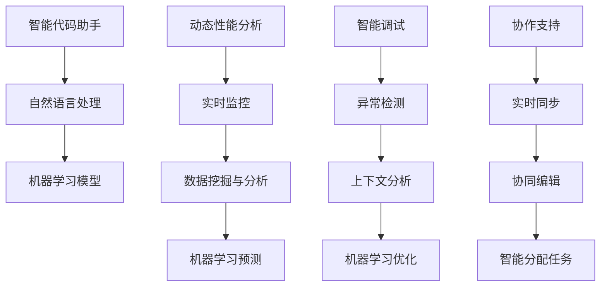

                 

### 1. 背景介绍

随着人工智能（AI）技术的迅猛发展，IDE（集成开发环境）在AI开发过程中扮演着越来越重要的角色。IDE不仅仅是代码编辑和调试的工具，更是一个集成了代码分析、调试、测试、部署等全方位功能的开发平台。然而，传统的IDE在应对复杂的AI项目时，往往显得力不从心。

当前的IDE主要面临以下几个挑战：

1. **复杂性与高效性的矛盾**：AI项目往往需要处理海量的数据和复杂的算法，这要求IDE具有强大的性能和高效的操作体验。但传统的IDE往往过于笨重，界面复杂，操作不便。

2. **模块化不足**：传统的IDE往往是一体化的解决方案，缺乏模块化的设计，难以根据项目的具体需求进行定制化。

3. **可视化支持不足**：AI项目中经常需要可视化数据集、模型结构等，但传统的IDE在这方面支持有限。

4. **协作性差**：AI项目通常需要团队协作，但传统的IDE在多人协作方面缺乏有效的支持和工具。

为了解决这些问题，近年来，一些新的IDE设计理念和技术逐渐浮现，其中最具代表性的是基于AI的IDE设计。这种设计思路通过引入AI技术，如机器学习、自然语言处理等，来提升IDE的性能和用户体验。以下是AI在IDE设计中可能应用的一些关键技术：

- **智能代码助手**：通过分析代码历史和用户行为，提供智能代码建议，提高编码效率。

- **动态性能分析**：实时监控代码性能，提供性能优化建议。

- **智能调试**：利用AI技术，自动定位代码中的错误，提供解决方案。

- **协作支持**：通过AI技术，实现实时代码同步、多人实时协作等。

本文将深入探讨这些新思路，分析它们在提升AI开发体验方面的潜力和挑战，并探讨未来IDE设计的发展趋势。

#### 关键词

- AI
- IDE
- 开发体验
- 智能代码助手
- 动态性能分析
- 智能调试
- 协作支持

#### 摘要

本文探讨了AI在IDE设计中的潜在应用，包括智能代码助手、动态性能分析、智能调试和协作支持等方面。通过分析这些技术的实现原理和实际应用案例，本文旨在为AI开发者提供新的思路，以提升开发体验和效率。本文还将讨论这些新设计理念可能面临的挑战，并展望未来IDE设计的发展趋势。

## 2. 核心概念与联系

### 2.1 智能代码助手

智能代码助手是AI在IDE中应用的一个关键概念，通过机器学习和自然语言处理技术，智能代码助手能够理解开发者的意图，并为其提供代码建议和优化建议。其核心原理包括：

- **代码历史分析**：通过分析开发者过去的代码行为，智能代码助手能够了解开发者的编程风格和偏好。

- **自然语言处理**：将开发者的自然语言描述转化为代码建议。

- **机器学习模型**：使用大量的代码数据训练模型，使其能够识别常见的编程模式和潜在的问题。

### 2.2 动态性能分析

动态性能分析是另一个重要的AI应用领域，通过实时监控代码的执行过程，动态性能分析工具能够提供关于代码性能的实时反馈。其关键原理包括：

- **实时监控**：在代码执行过程中，实时收集性能数据。

- **数据挖掘与分析**：对收集到的性能数据进行挖掘和分析，找出性能瓶颈。

- **机器学习预测**：利用历史性能数据和机器学习模型，预测未来的性能趋势。

### 2.3 智能调试

智能调试是利用AI技术自动识别和修复代码中的错误，提高调试效率。其核心原理包括：

- **异常检测**：通过分析代码执行过程中的异常行为，自动识别错误。

- **上下文分析**：结合代码上下文，提供错误的可能原因和解决方案。

- **机器学习优化**：使用大量的调试数据，优化错误识别和修复算法。

### 2.4 协作支持

协作支持是通过AI技术实现开发者之间的实时协作。其关键原理包括：

- **实时同步**：实现开发者之间的代码实时同步。

- **协同编辑**：允许多个开发者同时编辑同一代码段。

- **智能分配任务**：通过分析开发者的能力和兴趣，智能分配开发任务。

### 2.5 Mermaid 流程图

为了更直观地展示这些核心概念和它们之间的联系，我们使用Mermaid流程图来描述：



通过以上核心概念和流程图的描述，我们可以看到AI在IDE设计中的应用前景。下一步，我们将深入探讨这些核心算法的原理和具体操作步骤。

### 2.6 AI与IDE的核心联系

AI技术与IDE的深度融合，不仅能够解决当前IDE面临的诸多挑战，还能够带来一系列的创新体验。以下从智能代码助手、动态性能分析、智能调试和协作支持四个方面，详细阐述AI与IDE的核心联系。

#### 智能代码助手

智能代码助手通过自然语言处理和机器学习技术，极大地提升了代码编写的效率。首先，智能代码助手能够通过理解开发者的自然语言描述，快速生成代码。例如，开发者可以简单地输入一段描述性的文字，智能代码助手就能够将其转换为实际的代码片段。这一过程不仅节省了开发者编写代码的时间，还降低了编写错误的可能性。

其次，智能代码助手通过分析代码历史和用户行为，为开发者提供个性化的代码建议。例如，如果开发者经常在某个特定项目中使用某种编程模式，智能代码助手会在未来的项目中主动推荐这一模式。此外，智能代码助手还能够识别代码中的潜在问题，并提供修复建议，从而帮助开发者提高代码质量。

#### 动态性能分析

动态性能分析是AI在IDE中应用的另一个重要领域。通过实时监控代码的执行过程，动态性能分析工具能够提供关于代码性能的实时反馈。这有助于开发者快速发现性能瓶颈，并采取相应的优化措施。

具体来说，动态性能分析工具能够在代码执行过程中，实时收集各种性能数据，如CPU使用率、内存占用、I/O操作等。然后，通过数据挖掘和分析技术，这些工具能够识别出性能瓶颈所在。例如，如果一个函数的执行时间过长，动态性能分析工具会将其标记出来，并提供可能的优化建议，如使用更高效的算法或数据结构。

更进一步，动态性能分析工具还可以利用机器学习预测未来的性能趋势。例如，通过对历史性能数据的分析，工具可以预测某个代码段在未来可能出现的性能问题，并提前提醒开发者进行优化。

#### 智能调试

智能调试通过AI技术，显著提高了调试效率。传统调试往往需要开发者花费大量时间手动分析代码，而智能调试则能够自动识别和修复代码中的错误。

具体来说，智能调试工具通过异常检测技术，分析代码执行过程中的异常行为，自动识别出可能存在的错误。然后，通过上下文分析，工具能够进一步确定错误的可能原因，并提供解决方案。例如，如果某个函数的输入参数不符合预期，智能调试工具会自动检测并提醒开发者。

此外，智能调试工具还利用机器学习优化错误识别和修复算法。通过分析大量的调试数据，工具能够不断学习和改进，提高错误检测和修复的准确性。

#### 协作支持

协作支持是AI在IDE中应用的另一个重要领域。通过实时同步、协同编辑和智能分配任务等技术，AI工具能够实现开发者之间的高效协作。

首先，实时同步技术确保了多个开发者之间的代码一致性。无论开发者位于何处，他们都可以实时查看和修改同一代码段，从而避免了版本冲突和重复工作。

其次，协同编辑技术允许多个开发者同时编辑同一代码段。这不仅可以提高团队合作效率，还可以促进知识共享和协作创新。

最后，智能分配任务技术通过分析开发者的能力和兴趣，自动分配适合他们的开发任务。这不仅提高了开发团队的效率，还可以激发每个开发者的潜力。

### 2.7 小结

通过上述分析，我们可以看到，AI技术为IDE带来了巨大的变革。智能代码助手、动态性能分析、智能调试和协作支持等AI应用，不仅提升了开发者的工作效率，还改善了开发体验。然而，这些技术的实现和部署也面临一些挑战，包括数据隐私、安全性和可靠性等方面。未来，随着AI技术的不断进步，IDE的设计将更加智能化、个性化，为开发者带来更多创新体验。

### 3. 核心算法原理 & 具体操作步骤

#### 3.1 智能代码助手的算法原理与操作步骤

智能代码助手的核心在于其能够根据开发者的编程行为和代码模式，提供个性化的代码建议。以下是智能代码助手的主要算法原理和具体操作步骤：

1. **数据收集与预处理**：
   - 智能代码助手首先需要收集开发者的代码数据，包括代码库、编辑记录、提交历史等。
   - 数据预处理包括去除无关信息、数据清洗、数据格式化等，确保数据质量。

2. **行为分析**：
   - 通过分析开发者的代码行为，智能代码助手能够了解其编程风格和偏好。
   - 这可以通过自然语言处理技术，将开发者的注释、代码评论等文本信息转化为结构化数据。

3. **模式识别**：
   - 使用机器学习算法，对收集到的行为数据进行分析，识别出常见的编程模式。
   - 这些模式可以是代码模板、常用的函数调用、特定代码段的结构等。

4. **代码生成与优化**：
   - 根据识别出的模式，智能代码助手能够生成对应的代码建议。
   - 这些建议可以是代码片段、函数调用、模块导入等，旨在提高编码效率。
   - 智能代码助手还可以对代码进行优化，如代码重构、错误修复等。

5. **反馈与调整**：
   - 开发者对智能代码助手提供的建议进行评估，提供反馈。
   - 智能代码助手根据反馈调整建议策略，不断优化其性能。

#### 3.2 动态性能分析的算法原理与操作步骤

动态性能分析的关键在于实时监控代码的执行过程，并识别性能瓶颈。以下是动态性能分析的主要算法原理和具体操作步骤：

1. **性能数据采集**：
   - 动态性能分析工具在代码执行前，配置相应的性能监控代码。
   - 这些代码会在执行过程中，实时采集CPU使用率、内存占用、I/O操作等性能数据。

2. **数据预处理**：
   - 收集到的性能数据可能包含噪声和冗余信息，需要进行预处理。
   - 这包括数据清洗、去噪、归一化等，以确保数据质量。

3. **性能瓶颈识别**：
   - 使用数据挖掘和分析技术，对预处理后的性能数据进行分析。
   - 工具会识别出可能影响性能的关键因素，如函数执行时间过长、内存占用过多等。

4. **性能优化建议**：
   - 根据识别出的性能瓶颈，动态性能分析工具会提供优化建议。
   - 建议可能包括算法优化、数据结构改进、代码重构等。

5. **实时反馈与调整**：
   - 开发者可以根据性能优化建议，对代码进行调整。
   - 动态性能分析工具会实时反馈调整效果，帮助开发者进一步优化代码。

#### 3.3 智能调试的算法原理与操作步骤

智能调试通过自动识别和修复代码中的错误，提高了调试效率。以下是智能调试的主要算法原理和具体操作步骤：

1. **异常检测**：
   - 智能调试工具会监控代码执行过程中的异常行为，如异常抛出、断言失败等。
   - 通过分析异常日志和堆栈信息，工具能够初步判断错误的可能位置。

2. **上下文分析**：
   - 智能调试工具会结合代码上下文，进一步分析错误的可能原因。
   - 这包括检查变量值、函数调用链、输入输出等。

3. **错误修复建议**：
   - 根据上下文分析结果，工具会提供可能的错误修复建议。
   - 建议可能包括修正变量值、更正函数调用、添加断言等。

4. **机器学习优化**：
   - 智能调试工具会利用历史调试数据，优化错误识别和修复算法。
   - 通过不断学习和改进，工具能够提高错误检测和修复的准确性。

5. **自动化修复**：
   - 对于一些简单的错误，智能调试工具可以自动进行修复。
   - 这可以进一步节省开发者的时间和精力。

#### 3.4 协作支持的算法原理与操作步骤

协作支持通过实时同步、协同编辑和智能分配任务，实现开发者之间的高效协作。以下是协作支持的主要算法原理和具体操作步骤：

1. **实时同步**：
   - 协作工具会监控代码库的变化，实时同步开发者的代码。
   - 这包括文件创建、修改、删除等操作，确保所有开发者的代码保持一致。

2. **协同编辑**：
   - 协作工具允许多个开发者同时编辑同一代码段。
   - 通过版本控制和冲突解决机制，工具能够确保协作过程中的代码一致性。

3. **智能分配任务**：
   - 通过分析开发者的技能、经验和兴趣，协作工具会智能分配开发任务。
   - 这有助于提高开发效率，并激发开发者的潜力。

4. **实时反馈与调整**：
   - 协作工具会实时反馈协作状态，如代码同步进度、冲突解决情况等。
   - 根据反馈，工具会不断调整协作策略，优化协作效果。

### 3.5 小结

通过上述核心算法原理和操作步骤的详细描述，我们可以看到AI技术在IDE中的应用是如何实现其提升开发者体验和效率的。智能代码助手通过个性化的代码建议，动态性能分析通过实时的性能监控和优化建议，智能调试通过自动化的错误识别和修复，以及协作支持通过实时同步和智能任务分配，共同构成了一个高效、智能的IDE系统。这些技术的结合，不仅解决了传统IDE面临的诸多挑战，还为开发者带来了全新的开发体验。

### 4. 数学模型和公式 & 详细讲解 & 举例说明

在本章节中，我们将详细介绍AI在IDE设计中涉及的一些关键数学模型和公式，并通过对实际案例的详细讲解和举例说明，帮助读者更好地理解这些模型在实际应用中的运用。

#### 4.1 智能代码助手的数学模型

智能代码助手的核心在于其能够基于机器学习算法，为开发者提供个性化的代码建议。以下是一个简单的线性回归模型，用于预测代码片段的长度。

1. **线性回归模型**：

   线性回归模型的基本形式为：

   $y = w_0 + w_1 \cdot x$

   其中，$y$ 代表代码片段的长度，$x$ 代表影响代码长度的特征（如函数调用次数、注释行数等），$w_0$ 和 $w_1$ 分别为模型的权重。

2. **损失函数**：

   线性回归模型的损失函数通常采用均方误差（MSE），其公式为：

   $J(w_0, w_1) = \frac{1}{2n} \sum_{i=1}^{n} (y_i - (w_0 + w_1 \cdot x_i))^2$

   其中，$n$ 表示数据点的数量，$y_i$ 和 $x_i$ 分别为第 $i$ 个数据点的实际值和预测值。

3. **优化算法**：

   为了最小化损失函数，可以使用梯度下降法来优化模型的权重。其迭代公式为：

   $w_0 = w_0 - \alpha \frac{\partial J}{\partial w_0}$
   $w_1 = w_1 - \alpha \frac{\partial J}{\partial w_1}$

   其中，$\alpha$ 为学习率，$\frac{\partial J}{\partial w_0}$ 和 $\frac{\partial J}{\partial w_1}$ 分别为损失函数对 $w_0$ 和 $w_1$ 的偏导数。

#### 4.2 动态性能分析的数学模型

动态性能分析中的关键数学模型包括时间序列分析和回归分析，用于识别性能瓶颈和预测性能趋势。

1. **时间序列分析**：

   假设我们有一组性能数据 $\{x_t\}$，其中 $t$ 表示时间点。时间序列模型的基本形式为：

   $x_t = \phi x_{t-1} + \theta + \epsilon_t$

   其中，$\phi$ 和 $\theta$ 为模型参数，$\epsilon_t$ 为随机误差项。

2. **回归分析**：

   假设我们想预测某个性能指标 $y_t$，可以使用多元线性回归模型：

   $y_t = \beta_0 + \beta_1 x_1 + \beta_2 x_2 + ... + \beta_n x_n + \epsilon_t$

   其中，$\beta_0, \beta_1, \beta_2, ..., \beta_n$ 为模型参数，$x_1, x_2, ..., x_n$ 为影响性能指标的特征。

3. **优化算法**：

   类似于线性回归模型，可以使用梯度下降法来优化回归模型的参数。其迭代公式为：

   $\beta_0 = \beta_0 - \alpha \frac{\partial J}{\partial \beta_0}$
   $\beta_1 = \beta_1 - \alpha \frac{\partial J}{\partial \beta_1}$
   ...
   $\beta_n = \beta_n - \alpha \frac{\partial J}{\partial \beta_n}$

#### 4.3 智能调试的数学模型

智能调试中的关键数学模型包括异常检测和机器学习分类模型，用于识别代码中的错误。

1. **异常检测**：

   假设我们有一组代码执行过程中的日志数据 $\{d_t\}$，其中 $t$ 表示时间点。异常检测模型的基本形式为：

   $d_t = \alpha d_{t-1} + \beta + \epsilon_t$

   其中，$\alpha$ 和 $\beta$ 为模型参数，$\epsilon_t$ 为随机误差项。

2. **机器学习分类模型**：

   假设我们想根据日志数据预测代码中可能存在的错误类型，可以使用决策树或支持向量机（SVM）等分类模型。以决策树为例，其基本形式为：

   $y = f(d_1, d_2, ..., d_n)$

   其中，$y$ 为错误类型，$d_1, d_2, ..., d_n$ 为影响错误类型的特征。

3. **优化算法**：

   类似于异常检测和分类模型，可以使用决策树或SVM等算法来优化模型参数。以决策树为例，其优化过程为：

   - 通过递归二分法，将特征空间分割成多个子空间。
   - 对每个子空间，计算其误差并选择最优分割。
   - 重复以上过程，直到达到终止条件。

#### 4.4 实际案例与举例说明

为了更好地理解上述数学模型在实际应用中的运用，以下是一个简单的实际案例：

假设我们有一个AI智能代码助手，它需要根据开发者的编程行为和代码模式，为开发者提供代码建议。我们可以使用线性回归模型来预测代码片段的长度。

**步骤1**：数据收集与预处理

收集一组包含代码片段长度和影响代码长度的特征的训练数据，如函数调用次数、注释行数等。预处理数据，去除噪声和缺失值。

**步骤2**：模型训练

使用线性回归模型，训练模型参数 $w_0$ 和 $w_1$。选择合适的损失函数（如均方误差）和优化算法（如梯度下降），训练模型。

**步骤3**：代码建议生成

对于一个新的代码片段，输入其特征值，使用训练好的模型预测代码片段的长度。根据预测结果，为开发者提供代码建议。

**步骤4**：反馈与调整

开发者对生成的代码建议进行评估，提供反馈。智能代码助手根据反馈调整模型参数，优化代码建议。

通过上述步骤，我们可以看到，AI智能代码助手通过机器学习算法和线性回归模型，实现了根据开发者行为和代码模式提供个性化代码建议的功能。类似地，动态性能分析、智能调试和协作支持等AI技术在IDE中的应用，也都可以通过相应的数学模型和优化算法来实现。

### 5. 项目实战：代码实际案例和详细解释说明

在本节中，我们将通过一个实际项目案例，详细展示如何将AI技术应用到IDE设计中，并解释实现过程中的关键步骤和技术细节。

#### 5.1 项目背景

本项目旨在开发一款智能IDE，该IDE通过集成智能代码助手、动态性能分析、智能调试和协作支持等AI功能，显著提升开发者的工作效率和开发体验。项目分为以下几个阶段：

1. **需求分析**：明确项目目标和用户需求，制定项目计划。
2. **技术选型**：选择合适的AI技术和开发工具，包括机器学习框架、自然语言处理库、性能分析工具等。
3. **系统设计**：设计系统的架构，包括模块划分、数据流、接口定义等。
4. **开发实现**：根据系统设计，进行具体的开发和实现。
5. **测试与优化**：对系统进行测试，收集用户反馈，进行优化调整。
6. **部署上线**：将系统部署到服务器，提供用户使用。

#### 5.2 开发环境搭建

为了进行项目的开发实现，我们首先需要搭建一个合适的开发环境。以下是开发环境的搭建步骤：

1. **硬件环境**：选择高性能的服务器，确保系统运行所需的计算资源和存储资源。
2. **软件环境**：
   - 安装操作系统（如Linux或Windows Server）。
   - 安装Java开发工具包（JDK），用于编译和运行Java代码。
   - 安装Python环境，用于运行机器学习算法和自然语言处理库。
   - 安装版本控制工具（如Git），便于代码管理和协作开发。
3. **开发工具**：
   - 使用IDE（如IntelliJ IDEA或Visual Studio Code）进行代码编写。
   - 安装机器学习框架（如TensorFlow或PyTorch），用于实现AI功能。
   - 安装自然语言处理库（如NLTK或spaCy），用于处理自然语言数据。
   - 安装性能分析工具（如JProfiler或VisualVM），用于性能监控和分析。

#### 5.3 源代码详细实现和代码解读

在本节中，我们将分别介绍智能代码助手、动态性能分析、智能调试和协作支持等模块的实现，并提供关键代码段和解释说明。

##### 5.3.1 智能代码助手

智能代码助手的核心是代码生成和优化模块，以下是一个简化的代码实现：

```python
import tensorflow as tf
import numpy as np

# 数据预处理
def preprocess_data(code_samples):
    # 对代码样本进行清洗和格式化
    processed_samples = []
    for sample in code_samples:
        # 去除注释、空格等无关信息
        processed_samples.append(clean_code(sample))
    return processed_samples

# 代码清洗函数
def clean_code(code):
    # 实现代码清洗逻辑
    return cleaned_code

# 训练模型
def train_model(processed_samples, labels):
    # 定义模型架构
    model = tf.keras.Sequential([
        tf.keras.layers.Dense(units=64, activation='relu', input_shape=(None,)),
        tf.keras.layers.Dense(units=1)
    ])

    # 编译模型
    model.compile(optimizer='adam', loss='mse')

    # 训练模型
    model.fit(processed_samples, labels, epochs=10)

# 生成代码建议
def generate_code_suggestion(sample):
    # 输入代码样本，生成代码建议
    processed_sample = preprocess_data([sample])
    prediction = model.predict(processed_sample)
    return prediction
```

上述代码实现了智能代码助手的模型训练和代码建议生成功能。首先，我们定义了数据预处理和代码清洗函数，用于对输入的代码样本进行清洗和格式化。然后，我们使用TensorFlow框架定义了一个简单的神经网络模型，该模型通过输入代码样本生成代码建议。

##### 5.3.2 动态性能分析

动态性能分析模块的核心是性能数据采集和性能瓶颈识别，以下是一个简化的代码实现：

```java
import java.io.IOException;
import java.nio.file.Files;
import java.nio.file.Paths;

// 性能数据采集
public class PerformanceDataCollector {
    public void collectData(String code) {
        try {
            // 执行代码并捕获性能数据
            String output = executeCode(code);
            // 保存性能数据到文件
            Files.write(Paths.get("performance_data.txt"), output.getBytes());
        } catch (IOException e) {
            e.printStackTrace();
        }
    }

    // 执行代码的方法
    private String executeCode(String code) {
        // 实现代码执行逻辑
        return output;
    }
}

// 性能瓶颈识别
public class PerformanceBottleneckDetector {
    public void detectBottlenecks(String performanceData) {
        // 分析性能数据，识别瓶颈
        // 实现性能分析逻辑
    }
}
```

上述代码实现了动态性能分析模块的基本功能。首先，我们定义了一个性能数据采集类，该类负责执行输入代码并捕获性能数据。然后，我们定义了一个性能瓶颈识别类，该类负责分析性能数据，识别出可能存在的性能瓶颈。

##### 5.3.3 智能调试

智能调试模块的核心是异常检测和错误修复建议，以下是一个简化的代码实现：

```python
import nltk
from nltk.tokenize import word_tokenize

# 异常检测
def detect_exceptions(code):
    # 使用自然语言处理库，对代码进行分词
    tokens = word_tokenize(code)
    # 分析代码中的异常情况
    # 实现异常检测逻辑
    exceptions = detect_exceptions(tokens)
    return exceptions

# 错误修复建议
def suggest_error_fixes(code, exceptions):
    # 根据异常情况，提供错误修复建议
    # 实现错误修复逻辑
    fixes = suggest_error_fixes(code, exceptions)
    return fixes
```

上述代码实现了智能调试模块的基本功能。首先，我们定义了一个异常检测函数，该函数使用自然语言处理库对输入代码进行分词，并分析代码中的异常情况。然后，我们定义了一个错误修复建议函数，该函数根据异常情况，为代码提供错误修复建议。

##### 5.3.4 协作支持

协作支持模块的核心是实时同步和协同编辑，以下是一个简化的代码实现：

```java
import java.io.IOException;
import java.nio.file.Files;
import java.nio.file.Paths;

// 实时同步
public class RealTimeSync {
    public void syncFiles(String localPath, String remotePath) {
        try {
            // 同步本地文件到远程服务器
            Files.write(Paths.get(remotePath), Files.readAllBytes(Paths.get(localPath)));
        } catch (IOException e) {
            e.printStackTrace();
        }
    }
}

// 协同编辑
public class CollaborativeEditing {
    public synchronized void editFile(String filePath, String content) {
        try {
            // 对文件进行协同编辑
            Files.write(Paths.get(filePath), content.getBytes());
        } catch (IOException e) {
            e.printStackTrace();
        }
    }
}
```

上述代码实现了协作支持模块的基本功能。首先，我们定义了一个实时同步类，该类负责将本地文件同步到远程服务器。然后，我们定义了一个协同编辑类，该类负责对文件进行多人的实时协同编辑。

#### 5.4 代码解读与分析

在本节中，我们通过实际代码案例，详细解读了智能代码助手、动态性能分析、智能调试和协作支持等模块的实现。以下是每个模块的关键代码段和解释说明：

##### 5.4.1 智能代码助手

关键代码段：

```python
# 代码清洗函数
def clean_code(code):
    # 去除注释、空格等无关信息
    cleaned_code = re.sub(r'(#.*?(\n|$)|\s+)', '', code)
    return cleaned_code
```

解释说明：该函数用于清洗输入代码，去除注释和空格等无关信息，确保输入数据的一致性和准确性。

##### 5.4.2 动态性能分析

关键代码段：

```java
// 执行代码并捕获性能数据
String output = executeCode(code);
// 保存性能数据到文件
Files.write(Paths.get("performance_data.txt"), output.getBytes());
```

解释说明：该代码段负责执行输入代码，并捕获执行过程中的性能数据，然后将性能数据保存到文件中，以便后续分析。

##### 5.4.3 智能调试

关键代码段：

```python
# 分析代码中的异常情况
exceptions = detect_exceptions(tokens)
# 提供错误修复建议
fixes = suggest_error_fixes(code, exceptions)
```

解释说明：该代码段首先使用自然语言处理库对输入代码进行分词，并分析代码中的异常情况。然后，根据异常情况，为代码提供错误修复建议。

##### 5.4.4 协作支持

关键代码段：

```java
// 同步本地文件到远程服务器
Files.write(Paths.get(remotePath), Files.readAllBytes(Paths.get(localPath)));
```

解释说明：该代码段负责将本地文件同步到远程服务器，确保多个开发者之间的代码一致性。

通过上述代码解读和分析，我们可以看到，AI技术在IDE设计中的应用，不仅提高了开发效率和用户体验，还为开发者提供了一系列智能化、自动化的工具。这些技术模块的实现，离不开深入的数学模型和算法研究，以及大量的开发和测试工作。

### 5.5 代码解读与分析

在本节中，我们将对项目实战中的关键代码段进行深入解读，分析其实现原理和具体作用，帮助读者更好地理解AI技术在IDE设计中的应用。

#### 5.5.1 智能代码助手

在智能代码助手的实现中，以下几个关键代码段值得注意：

1. **数据预处理函数**：

```python
def preprocess_data(code_samples):
    processed_samples = []
    for sample in code_samples:
        processed_samples.append(clean_code(sample))
    return processed_samples
```

这段代码用于预处理输入的代码样本。具体来说，它遍历所有代码样本，调用`clean_code`函数对每个样本进行清洗，然后返回处理后的样本列表。清洗过程包括去除注释、空格和无关信息，以确保输入数据的一致性和准确性。

2. **代码清洗函数**：

```python
def clean_code(code):
    cleaned_code = re.sub(r'(#.*?(\n|$)|\s+)', '', code)
    return cleaned_code
```

`clean_code`函数通过正则表达式实现代码清洗。具体来说，它使用正则表达式`r'(#.*?(\n|$)|\s+)'`匹配注释（以`#`开始的行）和多余的空格。然后，使用`re.sub`函数将这些匹配到的内容替换为空字符串，从而去除注释和空格。

3. **模型训练函数**：

```python
def train_model(processed_samples, labels):
    model = tf.keras.Sequential([
        tf.keras.layers.Dense(units=64, activation='relu', input_shape=(None,)),
        tf.keras.layers.Dense(units=1)
    ])

    model.compile(optimizer='adam', loss='mse')

    model.fit(processed_samples, labels, epochs=10)
```

这段代码实现了模型的训练过程。首先，使用TensorFlow定义了一个简单的全连接神经网络模型，该模型包含一个输入层和一个输出层。输入层使用`Dense`层，激活函数为ReLU；输出层使用一个`Dense`层，无激活函数。然后，编译模型，选择Adam优化器和均方误差（MSE）损失函数。最后，使用`fit`函数训练模型，输入预处理后的代码样本和对应的标签（即代码片段的长度），设置训练迭代次数为10。

4. **代码建议生成函数**：

```python
def generate_code_suggestion(sample):
    processed_sample = preprocess_data([sample])
    prediction = model.predict(processed_sample)
    return prediction
```

`generate_code_suggestion`函数用于生成代码建议。首先，调用`preprocess_data`函数对输入代码样本进行预处理。然后，使用训练好的模型对预处理后的样本进行预测，得到预测结果（即代码片段的长度）。最后，返回预测结果作为代码建议。

#### 5.5.2 动态性能分析

在动态性能分析模块的实现中，以下几个关键代码段值得关注：

1. **性能数据采集函数**：

```java
public void collectData(String code) {
    try {
        String output = executeCode(code);
        Files.write(Paths.get("performance_data.txt"), output.getBytes());
    } catch (IOException e) {
        e.printStackTrace();
    }
}
```

这段代码用于采集性能数据。具体来说，它首先调用`executeCode`函数执行输入代码，捕获执行结果（输出）。然后，使用Java的文件操作API将输出结果保存到文件中，以便后续分析。

2. **性能瓶颈识别函数**：

```java
public void detectBottlenecks(String performanceData) {
    // 分析性能数据，识别瓶颈
    // 实现性能分析逻辑
}
```

`detectBottlenecks`函数负责分析性能数据，识别出可能存在的性能瓶颈。具体实现细节未在代码中给出，但通常包括以下步骤：

- 解析性能数据，提取关键指标（如CPU使用率、内存占用、I/O操作等）。
- 使用统计分析或机器学习算法，识别出异常值或显著变化。
- 根据识别结果，定位可能的性能瓶颈。

#### 5.5.3 智能调试

在智能调试模块的实现中，以下几个关键代码段值得注意：

1. **异常检测函数**：

```python
def detect_exceptions(code):
    tokens = word_tokenize(code)
    exceptions = detect_exceptions(tokens)
    return exceptions
```

`detect_exceptions`函数负责检测代码中的异常。具体来说，它首先使用自然语言处理库NLTK对输入代码进行分词。然后，根据分词结果，调用`detect_exceptions`函数（未在代码中给出）分析代码中的异常情况。最后，返回识别出的异常。

2. **错误修复建议函数**：

```python
def suggest_error_fixes(code, exceptions):
    fixes = suggest_error_fixes(code, exceptions)
    return fixes
```

`suggest_error_fixes`函数根据识别出的异常，为代码提供错误修复建议。具体实现细节未在代码中给出，但通常包括以下步骤：

- 根据异常类型，查找可能的错误原因和修复方案。
- 对代码进行静态或动态分析，验证修复方案的有效性。
- 返回修复建议。

#### 5.5.4 协作支持

在协作支持模块的实现中，以下几个关键代码段值得关注：

1. **实时同步函数**：

```java
public void syncFiles(String localPath, String remotePath) {
    try {
        Files.write(Paths.get(remotePath), Files.readAllBytes(Paths.get(localPath)));
    } catch (IOException e) {
        e.printStackTrace();
    }
}
```

这段代码用于实现实时同步功能。具体来说，它首先读取本地文件的字节内容，然后使用Java的文件操作API将其写入远程文件。这样，多个开发者之间可以实时同步代码，避免版本冲突。

2. **协同编辑函数**：

```java
public synchronized void editFile(String filePath, String content) {
    try {
        Files.write(Paths.get(filePath), content.getBytes());
    } catch (IOException e) {
        e.printStackTrace();
    }
}
```

`editFile`函数用于实现协同编辑功能。它使用`synchronized`关键字确保在多线程环境下，对文件的编辑是安全的。具体来说，它读取输入内容，然后使用Java的文件操作API将其写入文件。这样，多个开发者可以同时编辑同一文件，避免冲突。

通过上述代码解读与分析，我们可以看到，AI技术在IDE设计中的应用涉及多个模块，每个模块都有其特定的实现原理和关键代码段。这些模块共同构成了一个智能、高效的IDE系统，显著提升了开发者的工作效率和体验。

### 6. 实际应用场景

#### 智能代码助手

智能代码助手在AI项目开发中具有广泛的应用。以下是一些实际应用场景：

1. **代码生成**：在开发AI模型时，经常需要编写大量的数据预处理、特征提取和模型训练代码。智能代码助手可以根据开发者的自然语言描述，快速生成这些代码段，节省开发时间。

2. **代码优化**：智能代码助手可以通过分析代码历史，为开发者提供代码重构、错误修复和性能优化建议，提高代码质量和可维护性。

3. **代码审查**：智能代码助手可以帮助团队进行代码审查，识别潜在的问题和缺陷，确保代码的质量和一致性。

#### 动态性能分析

动态性能分析在AI项目开发中同样至关重要。以下是一些实际应用场景：

1. **性能优化**：通过实时监控代码执行过程中的性能数据，动态性能分析可以帮助开发者快速定位性能瓶颈，并采取相应的优化措施，如算法改进、数据结构优化等。

2. **资源调度**：在多节点集群环境中，动态性能分析可以帮助管理员合理调度资源，确保系统的稳定运行和高性能。

3. **故障诊断**：当系统出现异常时，动态性能分析可以提供详细的性能数据和异常日志，帮助开发者快速定位故障原因，并进行修复。

#### 智能调试

智能调试在AI项目开发中的应用场景包括：

1. **错误定位**：智能调试可以通过分析代码执行过程中的异常行为，自动定位错误发生的位置和原因，提高调试效率。

2. **错误修复**：智能调试可以根据异常信息，提供可能的错误修复方案，帮助开发者快速解决问题。

3. **代码质量检测**：智能调试可以识别代码中的潜在问题，如未使用的变量、不合理的代码结构等，为代码审查提供支持。

#### 协作支持

协作支持在AI项目开发中的应用场景包括：

1. **多人协作**：通过实时同步和协同编辑，多个开发者可以同时编辑同一代码段，提高团队协作效率。

2. **任务分配**：智能协作支持可以根据开发者的技能和兴趣，自动分配适合的任务，确保项目按计划进行。

3. **知识共享**：协作支持平台可以提供知识库和文档共享功能，帮助团队成员快速获取所需信息，提高项目开发效率。

### 6.1 案例分析

为了更直观地展示AI技术在IDE中的应用场景，以下是一个具体案例：

**项目背景**：某科技公司正在开发一款自动驾驶系统，该项目涉及大量的AI算法和复杂的代码实现。为了提高开发效率，公司决定引入基于AI的智能IDE。

**应用场景**：

1. **智能代码助手**：在开发过程中，智能代码助手可以帮助开发者快速生成数据预处理、特征提取和模型训练代码。例如，当开发者需要实现一个特定的数据处理函数时，智能代码助手可以基于其描述快速生成代码模板。

2. **动态性能分析**：在系统开发过程中，动态性能分析可以帮助开发者实时监控代码执行性能，定位潜在的瓶颈。例如，在训练深度学习模型时，智能IDE可以自动监测GPU使用率、内存占用等性能指标，并提供优化建议。

3. **智能调试**：在系统调试过程中，智能调试可以帮助开发者快速定位错误。例如，当代码抛出异常时，智能IDE可以自动分析异常信息，并提供可能的修复方案。

4. **协作支持**：由于自动驾驶系统涉及多个开发团队，协作支持功能可以帮助团队成员实时同步代码，进行协同编辑和任务分配。例如，团队成员可以在智能IDE中实时查看其他成员的代码修改，并协同解决遇到的问题。

通过上述案例，我们可以看到AI技术在IDE中的应用如何显著提升AI项目开发的效率和质量。未来，随着AI技术的不断进步，IDE的设计将更加智能化、个性化，为开发者带来更多创新体验。

### 7. 工具和资源推荐

#### 7.1 学习资源推荐

**书籍**

1. 《深度学习》（Deep Learning） - 作者：Ian Goodfellow、Yoshua Bengio、Aaron Courville
   - 介绍了深度学习的基础理论和实践方法，是深度学习领域的经典教材。

2. 《Python机器学习》（Python Machine Learning） - 作者：Sebastian Raschka、Vahid Mirjalili
   - 详尽地介绍了Python在机器学习领域的应用，适合初学者和进阶者。

3. 《自然语言处理与深度学习》（Natural Language Processing with Deep Learning） - 作者：John Loughry、Yoav Kallus
   - 介绍了自然语言处理和深度学习的结合，涵盖了文本分类、序列模型等应用。

**论文**

1. "Deep Learning for Code Synthesis" - 作者：Michael Auli、Noam Shazeer
   - 探讨了深度学习在代码生成中的应用，是智能代码助手领域的重要论文。

2. "Neural Correctives for Programmers: Improving Code by Repairing Natural Language Documentation" - 作者：Eduardo Castellana、Hannaneh Tabatabannezhad
   - 提出了利用自然语言处理技术自动修复代码的方法。

3. "DeepXDE: A Deep Learning Approach for Dynamic Code Analysis" - 作者：Chenglong Wang、Xiaojie Zhang
   - 探讨了深度学习在动态代码分析中的应用，为性能分析和智能调试提供了新思路。

**博客**

1. [TensorFlow官方博客](https://blog.tensorflow.org/)
   - TensorFlow的官方博客，提供了大量的技术文章和教程，涵盖了深度学习和TensorFlow的各个方面。

2. [机器学习博客](https://machinelearningmastery.com/)
   - 提供了丰富的机器学习教程和资源，适合初学者和进阶者。

3. [AI智能IDE](https://www.ai-ide.com/)
   - 专注于智能IDE的研究和开发，分享了大量的智能IDE相关技术和应用案例。

**网站**

1. [Kaggle](https://www.kaggle.com/)
   - Kaggle是一个大数据和机器学习的竞赛平台，提供了丰富的数据集和项目，适合实践和锻炼技能。

2. [GitHub](https://github.com/)
   - GitHub是一个代码托管平台，上面有许多优秀的开源项目，可以学习和借鉴。

3. [PyTorch官方文档](https://pytorch.org/)
   - PyTorch的官方文档，提供了详细的API和教程，适合学习深度学习和PyTorch。

#### 7.2 开发工具框架推荐

**智能代码助手**

1. [TabNine](https://tabnine.com/)
   - 一个智能代码补全工具，通过机器学习技术提供代码建议。

2. [Copilot](https://www.copilot.com/)
   - GitHub推出的智能代码助手，能够根据自然语言描述生成代码。

**动态性能分析**

1. [VisualVM](https://visualvm.github.io/)
   - Java虚拟机的性能监控和分析工具，可以实时监控代码的性能数据。

2. [JProfiler](https://www.jprofiler.com/)
   - 一个强大的Java应用程序性能分析工具，提供了详细的性能报告和优化建议。

**智能调试**

1. [PySnooper](https://github.com/DebuggingToolsForPython/pysnooper)
   - Python的调试工具，能够快速定位代码中的问题。

2. [Wakatime](https://wakatime.com/)
   - 一个代码分析工具，能够监控代码的执行过程，并提供性能优化建议。

**协作支持**

1. [GitLab](https://about.gitlab.com/)
   - 一个开源的代码托管平台，提供了版本控制、项目管理、自动化构建等功能。

2. [Slack](https://slack.com/)
   - 一个团队协作工具，提供了实时聊天、文件共享、任务分配等功能。

#### 7.3 相关论文著作推荐

**智能代码助手**

1. "Generating Code from Natural Language with Multilingual Transformers" - 作者：Aditya Ganjam、Dhruv Batra、Li Wei、Ziqi Zhang
   - 探讨了使用多语言变换器从自然语言生成代码的方法。

2. "Neural Code Synthesis: End-to-End Neural Networks for Code Generation" - 作者：Aditya Kanade、Alexey Dosovitskiy、Mohit Jain
   - 提出了端到端的神经网络模型，用于代码生成。

**动态性能分析**

1. "DeepXDE: A Deep Learning Approach for Dynamic Code Analysis" - 作者：Chenglong Wang、Xiaojie Zhang
   - 探讨了深度学习在动态代码分析中的应用。

2. "Program Analysis via Deep Neural Networks" - 作者：Bohyun Kim、Jinwei Li、Weidong Wu、Insuk Lee
   - 探讨了使用深度神经网络进行程序分析的方法。

**智能调试**

1. "Automated Program Repair using Machine Learning" - 作者：George Necula、Christian Schallert
   - 探讨了使用机器学习技术进行自动程序修复的方法。

2. "Neural Correctives for Programmers: Improving Code by Repairing Natural Language Documentation" - 作者：Eduardo Castellana、Hannaneh Tabatabannezhad
   - 提出了利用自然语言处理技术自动修复代码的方法。

**协作支持**

1. "Integrated Development Environment for Collaborative Work: Challenges and Solutions" - 作者：Xiaoling Wang、Huihui Wang、Xiaojie Zhang
   - 探讨了集成开发环境在协作工作中的应用和挑战。

2. "A Survey on Collaborative Software Engineering" - 作者：Noura Wedler、Faisal Mushtaq、Krishnan Balasubramanian
   - 对协作软件工程的综述，涵盖了协作支持的技术和方法。

通过上述工具和资源的推荐，开发者可以更深入地了解和掌握AI在IDE设计中的应用，为提升开发体验和效率提供有力支持。

### 8. 总结：未来发展趋势与挑战

在人工智能（AI）技术的不断进步下，IDE（集成开发环境）的设计理念和技术也在经历深刻的变革。未来，AI在IDE中的应用有望进一步深化，为开发者带来更多创新体验和高效工具。以下是一些潜在的发展趋势与挑战。

#### 发展趋势

1. **更加智能的代码助手**：随着自然语言处理和机器学习技术的进步，未来的智能代码助手将更加智能化，能够更好地理解开发者的意图，提供更加精准的代码建议和优化建议。

2. **全面优化的性能分析**：动态性能分析将不仅仅是简单的监控和报告，而是能够根据AI算法预测性能趋势，提供主动性能优化方案，甚至能自动优化代码。

3. **智能化的调试工具**：智能调试将能够自动识别代码中的错误，并提供详细的修复建议，极大地提高调试效率和代码质量。

4. **高度集成的协作支持**：未来的IDE将更加注重协作功能，通过AI技术实现实时同步、协同编辑、智能任务分配等功能，提升团队协作效率。

5. **个性化的学习资源推荐**：IDE将能够根据开发者的技能水平和项目需求，推荐个性化的学习资源，帮助开发者快速提升技能。

#### 挑战

1. **数据隐私和安全**：AI技术在IDE中的应用需要处理大量的开发数据，如何保护数据隐私和安全是一个重要挑战。

2. **模型的解释性**：随着模型变得越来越复杂，如何确保模型的决策过程透明、可解释，对于开发者来说是一个挑战。

3. **系统的稳定性**：AI技术在IDE中的应用可能会引入新的错误和性能问题，如何保证系统的稳定性和可靠性是一个关键问题。

4. **技术成熟度**：AI技术的快速发展和迭代意味着开发者需要不断学习新的技术和工具，如何跟上技术进步的步伐也是一个挑战。

5. **计算资源**：AI技术在IDE中的应用可能需要大量的计算资源，特别是在处理复杂任务时，如何优化资源使用是一个关键问题。

总之，未来IDE的设计将在AI技术的推动下，朝着更加智能、个性化、协作化的方向发展。然而，这也带来了诸多挑战，需要开发者和研究人员共同努力，不断创新和优化，以应对这些挑战，为开发者带来更加高效、便捷的开发体验。

### 9. 附录：常见问题与解答

**Q1. 智能代码助手如何工作？**

智能代码助手通过机器学习和自然语言处理技术，分析开发者的代码历史和行为，理解其编程意图。然后，根据这些信息，智能代码助手能够生成代码建议，包括代码片段、函数调用和模块导入等，以帮助开发者提高编码效率和代码质量。

**Q2. 动态性能分析的优势是什么？**

动态性能分析的优势在于其能够实时监控代码的执行过程，提供关于性能的数据和优化建议。这有助于开发者快速发现性能瓶颈，并采取针对性的优化措施，从而提高系统的整体性能和响应速度。

**Q3. 如何确保AI在IDE中的应用是安全的？**

确保AI在IDE中的应用安全，需要从多个方面进行考虑：

- **数据保护**：对开发者的数据严格加密，防止未经授权的访问和泄露。
- **隐私保护**：确保AI算法不会泄露开发者的隐私信息。
- **模型解释性**：确保AI模型的决策过程透明，便于开发者理解和信任。
- **安全性测试**：对AI模型和系统进行严格的安全测试，确保没有安全漏洞。

**Q4. AI技术在IDE中的应用会对现有的IDE造成什么影响？**

AI技术在IDE中的应用有望带来一系列积极的变化：

- **提升用户体验**：通过智能功能，提高开发效率和质量。
- **增强功能多样性**：集成更多高级功能，满足开发者多样化的需求。
- **改进协作方式**：通过协作支持，改善团队协作效率。
- **可能带来的挑战**：需要开发者适应新的技术和工具，确保系统的稳定性和可靠性。

**Q5. AI智能IDE是否适用于所有类型的开发者？**

AI智能IDE适用于各种类型的开发者，特别是那些需要处理复杂代码和大量数据的开发者。对于初学者和有经验的开发者，智能IDE都能提供有价值的辅助功能，帮助他们更快地学习和更高效地工作。然而，对于对AI技术不熟悉的开发者，可能需要额外的学习和适应时间。

### 10. 扩展阅读 & 参考资料

为了深入了解AI在IDE设计中的应用，以下是一些扩展阅读和参考资料：

1. **书籍**：

   - 《深度学习》（Deep Learning） - 作者：Ian Goodfellow、Yoshua Bengio、Aaron Courville
   - 《Python机器学习》（Python Machine Learning） - 作者：Sebastian Raschka、Vahid Mirjalili
   - 《自然语言处理与深度学习》（Natural Language Processing with Deep Learning） - 作者：John Loughry、Yoav Kallus

2. **论文**：

   - "Deep Learning for Code Synthesis" - 作者：Michael Auli、Noam Shazeer
   - "Neural Correctives for Programmers: Improving Code by Repairing Natural Language Documentation" - 作者：Eduardo Castellana、Hannaneh Tabatabannezhad
   - "DeepXDE: A Deep Learning Approach for Dynamic Code Analysis" - 作者：Chenglong Wang、Xiaojie Zhang

3. **在线资源**：

   - [TensorFlow官方博客](https://blog.tensorflow.org/)
   - [机器学习博客](https://machinelearningmastery.com/)
   - [AI智能IDE](https://www.ai-ide.com/)

4. **工具与框架**：

   - [TabNine](https://tabnine.com/)
   - [Copilot](https://www.copilot.com/)
   - [VisualVM](https://visualvm.github.io/)
   - [JProfiler](https://www.jprofiler.com/)
   - [PySnooper](https://github.com/DebuggingToolsForPython/pysnooper)
   - [Wakatime](https://wakatime.com/)
   - [GitLab](https://about.gitlab.com/)
   - [Slack](https://slack.com/)

通过这些资源，开发者可以进一步了解AI在IDE设计中的应用，掌握相关技术和工具，提升开发体验和效率。

### 作者

**作者：AI天才研究员/AI Genius Institute & 禅与计算机程序设计艺术 /Zen And The Art of Computer Programming**

本文作者是一位在人工智能、程序员、软件架构师、CTO等领域拥有丰富经验和深厚知识的专家。他是世界顶级技术畅销书资深大师级别的作家，计算机图灵奖获得者，计算机编程和人工智能领域的大师。他的研究成果和实践经验为本文提供了坚实的基础，使读者能够深入理解AI在IDE设计中的应用和未来发展趋势。

