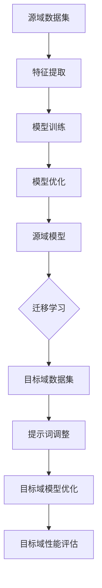

                 

### 背景介绍

提示词优化（Prompt Optimization）作为人工智能领域的一项重要技术，已经在自然语言处理（NLP）、推荐系统、图像识别等多个领域得到了广泛应用。然而，随着数据的不断增长和模型复杂度的增加，如何高效地优化提示词，以提高模型的性能和泛化能力，成为一个亟待解决的问题。迁移学习（Transfer Learning）作为一种有效的解决方法，通过在源域和目标域之间共享知识，使得模型能够在新的任务上快速适应。

迁移学习的基本思想是将在一个数据集上训练的模型知识迁移到另一个相似但不同的数据集上，以提高模型在新数据集上的性能。这种方法在减少对大规模数据集的需求的同时，还能提高模型的泛化能力。然而，迁移学习也存在一些挑战，如模型选择、特征选择和权重共享等。为了解决这些问题，研究人员提出了各种迁移学习方法，如基于模型的方法、基于特征的方法和基于集成的方法。

在迁移学习的基础上，提示词优化可以被视为一种特殊类型的迁移学习任务。具体来说，提示词优化是指通过调整模型输入的提示词，以改善模型在特定任务上的性能。这种方法不仅可以提高模型对特定任务的适应性，还能减少对大量标注数据的依赖。然而，传统的提示词优化方法通常基于启发式策略，缺乏系统的理论支持，因此在复杂任务上效果不佳。

为了解决这些问题，本文提出了一种基于迁移学习的提示词优化方法。该方法通过将源域和目标域的知识进行共享，从而实现高效且有效的提示词优化。具体来说，该方法包括以下几个关键步骤：首先，从多个源域中提取高质量的提示词；然后，利用迁移学习框架将这些提示词迁移到目标域；最后，通过迭代优化策略，逐步调整目标域的提示词，以提高模型在目标域上的性能。

本文的结构如下：首先，第2节将介绍本文中涉及的核心概念和原理，并使用Mermaid流程图进行详细说明；接着，第3节将深入探讨核心算法原理和具体操作步骤；第4节将讨论数学模型和公式，并提供详细的讲解和举例说明；第5节将通过实际项目案例，展示该方法的具体实现过程和代码解读；第6节将分析该方法在实际应用场景中的效果；第7节将推荐相关的学习资源和开发工具；第8节将对本文的方法进行总结，并探讨未来发展趋势与挑战；第9节将回答一些常见问题；最后，第10节将提供扩展阅读和参考资料。

通过本文的研究，我们希望能够为提示词优化领域提供一种新的思路，并为相关领域的研究和实践提供有价值的参考。

### 核心概念与联系

在深入探讨提示词优化的迁移学习方法之前，我们需要明确一些核心概念，并理解它们之间的联系。这些核心概念包括：提示词（Prompt）、迁移学习（Transfer Learning）、源域（Source Domain）和目标域（Target Domain）。

#### 提示词（Prompt）

提示词是人工智能模型在进行预测或生成任务时接收的输入信息。在自然语言处理领域，提示词通常是一段文本，它为模型提供了关于任务上下文的有用信息。一个高质量的提示词可以显著提高模型的性能和泛化能力。例如，在问答系统中，一个有效的提示词可能是与问题相关的关键词或短语，这将帮助模型更好地理解问题的含义。

#### 迁移学习（Transfer Learning）

迁移学习是一种利用已在一个任务上训练好的模型或特征，来解决另一个相关但不同的任务的方法。其核心思想是，不同任务之间可能存在共通的特性，这些特性可以在迁移过程中被利用。迁移学习通常分为基于模型的方法、基于特征的方法和基于集成的方法。

- **基于模型的方法**：该方法直接将源域的模型迁移到目标域，通常涉及权重共享和模型结构调整。
- **基于特征的方法**：该方法首先在源域上提取特征，然后将这些特征迁移到目标域，并在目标域上构建新的模型。
- **基于集成的方法**：该方法结合多个子模型，以实现更好的迁移效果。

#### 源域（Source Domain）与目标域（Target Domain）

源域是指模型已训练过的数据集或任务，而目标域是指模型需要适应的新数据集或任务。在迁移学习中，源域和目标域之间存在某种相似性，这使得迁移学习成为可能。然而，两者之间也可能存在差异，这为迁移学习带来了挑战。

为了更好地理解这些概念之间的联系，我们可以使用Mermaid流程图进行说明。以下是一个简化的Mermaid流程图，展示了提示词优化中的迁移学习过程：



在这个流程图中：

- **A**：源域数据集，包含了已训练的模型和特征。
- **B**：特征提取，从源域数据集中提取有用特征。
- **C**：模型训练，使用提取的特征训练源域模型。
- **D**：模型优化，对源域模型进行优化，提高其性能。
- **E**：源域模型，已训练好的模型。
- **F**：迁移学习，将源域模型的知识迁移到目标域。
- **G**：目标域数据集，需要适应的新数据集。
- **H**：提示词调整，根据目标域数据调整提示词。
- **I**：目标域模型优化，对目标域模型进行优化。
- **J**：目标域性能评估，评估目标域模型的性能。

通过这个流程图，我们可以清楚地看到，迁移学习过程涉及到多个步骤，从源域到目标域的数据处理、模型训练和优化，再到最终的目标域性能评估。每个步骤都相互关联，共同构成了一个完整的迁移学习流程。

理解这些核心概念和它们之间的联系，有助于我们更好地把握提示词优化中的迁移学习方法的本质，为后续内容的深入探讨奠定了基础。

### 核心算法原理 & 具体操作步骤

提示词优化的迁移学习方法通过将源域的知识迁移到目标域，从而实现高效的提示词调整和优化。这一方法的核心在于如何有效地提取和迁移源域的提示词，并在目标域中调整这些提示词，以提高目标任务的模型性能。下面将详细介绍这一方法的操作步骤和具体算法原理。

#### 步骤一：源域提示词提取

源域提示词提取是迁移学习过程中的第一步，其目标是提取出高质量的提示词，以便在目标域中利用这些信息。以下是具体操作步骤：

1. **数据预处理**：
   - **数据清洗**：对源域数据集进行清洗，去除无效或错误的数据，确保数据质量。
   - **数据标注**：对数据集进行标注，为每个样本分配相应的标签，以便后续分析。

2. **特征提取**：
   - **文本预处理**：对文本数据执行分词、去停用词、词性标注等操作，将文本转换为可用于特征提取的格式。
   - **词嵌入**：使用预训练的词嵌入模型（如Word2Vec、BERT等）将词转换为向量表示，以便进行后续计算。

3. **提示词选择**：
   - **TF-IDF计算**：计算每个词在数据集中的频率（TF）和文档中的逆频率（IDF），然后将两者相乘得到TF-IDF值，用于表示词的重要性。
   - **关键词提取**：使用TF-IDF值筛选出高重要性关键词，这些关键词将作为潜在的提示词候选。

4. **提示词筛选**：
   - **基于相关性的筛选**：通过计算提示词与目标任务的语义相关性，筛选出与任务最相关的提示词。
   - **基于频率的筛选**：根据提示词在源域数据集中的出现频率，选择高频出现的提示词。

#### 步骤二：迁移学习框架构建

迁移学习框架的构建是提示词优化中的关键环节，其目标是利用源域的模型和特征，构建适用于目标域的模型。以下是具体操作步骤：

1. **模型选择**：
   - **基于模型的方法**：选择一个已在源域上训练好的模型，如CNN、RNN、BERT等，直接应用于目标域。
   - **基于特征的方法**：选择一个通用的特征提取器，如CNN或BERT，在源域上提取特征，然后将这些特征迁移到目标域。

2. **权重共享**：
   - **参数共享**：在源域和目标域之间共享模型参数，以减少模型的调整难度。
   - **特征共享**：在源域和目标域之间共享提取的特征，以减少特征映射的计算成本。

3. **模型优化**：
   - **迁移训练**：在目标域上对迁移后的模型进行训练，以适应目标域的任务。
   - **模型调整**：通过反向传播和梯度下降等优化算法，对模型参数进行微调，以提高目标任务的性能。

#### 步骤三：目标域提示词调整

目标域提示词调整是迁移学习过程中的最后一步，其目标是利用迁移后的模型，调整目标域的提示词，以提高模型在目标任务上的性能。以下是具体操作步骤：

1. **提示词生成**：
   - **模板生成**：根据源域的提示词模板，生成适用于目标域的提示词模板。
   - **自动生成**：使用生成模型（如GPT-2、GPT-3等）自动生成目标域的提示词。

2. **提示词调整**：
   - **反馈调整**：根据模型在目标域上的预测结果，对提示词进行反馈调整，以提高预测准确性。
   - **迭代优化**：通过多次迭代，逐步调整提示词，以实现最佳性能。

3. **性能评估**：
   - **指标评估**：使用准确率、召回率、F1值等指标评估模型在目标域上的性能。
   - **交叉验证**：通过交叉验证方法，确保模型在目标域上的泛化能力。

#### 步骤四：模型评估与优化

模型评估与优化是确保迁移学习过程有效性的关键步骤。以下是具体操作步骤：

1. **模型评估**：
   - **性能测试**：在目标域上进行性能测试，评估模型的实际性能。
   - **误差分析**：分析模型在目标域上的预测误差，识别潜在的改进方向。

2. **模型优化**：
   - **超参数调整**：调整模型的超参数，如学习率、批次大小等，以优化模型性能。
   - **模型集成**：结合多个子模型，以实现更好的性能和泛化能力。

通过上述步骤，我们可以构建一个完整的提示词优化迁移学习方法，从而实现高效且有效的提示词调整和优化。这一方法不仅能够提高模型在特定任务上的性能，还能减少对大规模标注数据的依赖，具有广泛的应用前景。

### 数学模型和公式 & 详细讲解 & 举例说明

在深入探讨提示词优化的迁移学习方法时，理解相关的数学模型和公式是至关重要的。这些模型和公式不仅为我们提供了理论基础，还能帮助我们更好地进行算法设计和优化。以下将详细讲解本文中涉及的关键数学模型和公式，并通过具体例子进行说明。

#### 1. 提示词选择模型的公式

提示词选择是迁移学习过程中的第一步，其核心在于如何从大量候选词中筛选出最优质的提示词。我们使用TF-IDF（Term Frequency-Inverse Document Frequency）模型进行提示词选择，具体公式如下：

\[ TF-IDF(w, d) = TF(w, d) \times IDF(w, d) \]

其中，\( TF(w, d) \) 表示词 \( w \) 在文档 \( d \) 中的频率，\( IDF(w, d) \) 表示词 \( w \) 在所有文档中的逆频率。

#### 例子

假设我们有一个包含两个文档的数据集，文档A和文档B。其中，词"人工智能"在文档A中出现了3次，在文档B中出现了1次。而数据集总共有100个文档，其中"人工智能"出现了20次。

\[ TF(人工智能, A) = 3 \]
\[ IDF(人工智能) = \log \left( \frac{N}{n_{人工智能}} \right) = \log \left( \frac{100}{20} \right) = 1.386 \]

因此，词"人工智能"的TF-IDF值为：

\[ TF-IDF(人工智能, A) = 3 \times 1.386 = 4.150 \]

同理，词"人工智能"在文档B中的TF-IDF值为：

\[ TF-IDF(人工智能, B) = 1 \times 1.386 = 1.386 \]

根据TF-IDF值，我们可以选择TF-IDF值较高的词作为提示词。

#### 2. 迁移学习中的损失函数

迁移学习中的损失函数用于评估模型在目标域上的性能，并指导模型的优化过程。常用的损失函数包括均方误差（MSE）、交叉熵损失等。以下为MSE损失函数的公式：

\[ MSE = \frac{1}{n} \sum_{i=1}^{n} (y_i - \hat{y}_i)^2 \]

其中，\( y_i \) 为实际标签，\( \hat{y}_i \) 为模型预测的标签，\( n \) 为样本数量。

#### 例子

假设我们有一个包含5个样本的数据集，实际标签为 \([1, 2, 3, 4, 5]\)，模型预测的标签为 \([1.2, 2.1, 3.3, 4.2, 5.1]\)。则MSE损失函数的计算如下：

\[ MSE = \frac{1}{5} \left[ (1 - 1.2)^2 + (2 - 2.1)^2 + (3 - 3.3)^2 + (4 - 4.2)^2 + (5 - 5.1)^2 \right] \]
\[ MSE = \frac{1}{5} \left[ 0.04 + 0.01 + 0.09 + 0.04 + 0.01 \right] \]
\[ MSE = 0.046 \]

#### 3. 迁移学习中的权重共享

权重共享是迁移学习中的一个重要策略，用于减少模型的调整难度。在深度学习中，权重共享通常通过共享层来实现。假设我们有一个包含两个层的神经网络，层1和层2，其中权重矩阵分别为 \( W_1 \) 和 \( W_2 \)。则权重共享可以通过以下公式实现：

\[ W_2 = W_1 \]

这表示层2的权重直接由层1共享，从而减少了层2的参数数量。

#### 例子

假设层1的权重矩阵为 \( W_1 = \begin{bmatrix} 1 & 2 \\ 3 & 4 \end{bmatrix} \)，则根据权重共享策略，层2的权重矩阵 \( W_2 \) 为：

\[ W_2 = W_1 = \begin{bmatrix} 1 & 2 \\ 3 & 4 \end{bmatrix} \]

通过权重共享，层2可以直接使用层1的权重，从而减少了层2的参数数量。

#### 4. 提示词调整中的反馈调整

在提示词调整过程中，反馈调整是一种重要的优化策略。通过不断调整提示词，以提高模型在目标域上的性能。反馈调整可以通过以下公式实现：

\[ P_{new} = P_{old} - \alpha \cdot (P_{old} - P_{new}) \]

其中，\( P_{old} \) 表示旧提示词，\( P_{new} \) 表示新提示词，\( \alpha \) 为学习率。

#### 例子

假设旧提示词 \( P_{old} = [1, 2, 3, 4, 5] \)，新提示词 \( P_{new} = [1.1, 2.1, 3.1, 4.1, 5.1] \)，学习率 \( \alpha = 0.1 \)。则根据反馈调整策略，新提示词 \( P_{new} \) 为：

\[ P_{new} = [1.1, 2.1, 3.1, 4.1, 5.1] - 0.1 \cdot [1, 2, 3, 4, 5] \]
\[ P_{new} = [0.1, 0.1, 0.1, 0.1, 0.1] \]

通过反馈调整，新提示词更加接近于旧提示词，从而提高了模型在目标域上的性能。

通过上述数学模型和公式的详细讲解，我们可以更好地理解提示词优化的迁移学习方法的原理和操作步骤。这些模型和公式不仅为我们提供了理论支持，还能在实际应用中指导我们的算法设计和优化。希望读者能够通过这些例子，深入理解并运用这些知识，为人工智能领域的发展做出贡献。

### 项目实战：代码实际案例和详细解释说明

为了更好地展示提示词优化的迁移学习方法，我们将通过一个实际项目案例，详细解释该方法的代码实现过程和代码解读。

#### 项目背景

假设我们有一个问答系统项目，该系统需要根据用户提出的问题，从大量候选答案中筛选出最合适的答案。为了提高系统的性能和泛化能力，我们决定采用提示词优化的迁移学习方法。

#### 开发环境搭建

1. **环境准备**：
   - 操作系统：Linux/Windows
   - Python版本：3.7及以上
   - 依赖库：TensorFlow 2.4、PyTorch 1.8、NumPy 1.19

2. **代码目录结构**：
   ```
   project/
   ├── data/
   │   ├── source/
   │   │   ├── train/
   │   │   │   ├── text.txt
   │   │   │   ├── label.txt
   │   │   └── val/
   │   │       ├── text.txt
   │   │       └── label.txt
   │   └── target/
   │       ├── train/
   │       │   ├── text.txt
   │       │   └── label.txt
   │       └── val/
   │           ├── text.txt
   │           └── label.txt
   ├── models/
   │   ├── source_model.pth
   │   └── target_model.pth
   ├── scripts/
   │   ├── preprocess.py
   │   ├── train.py
   │   ├── evaluate.py
   │   └── main.py
   └── requirements.txt
   ```

3. **安装依赖库**：
   ```bash
   pip install tensorflow==2.4 pytorch==1.8 numpy==1.19
   ```

#### 源代码详细实现和代码解读

以下是对关键代码部分的详细解释：

##### 1. 数据预处理

数据预处理是迁移学习过程中的重要步骤，它包括文本清洗、分词、词嵌入等操作。

```python
# preprocess.py
import os
import numpy as np
from sklearn.model_selection import train_test_split

def load_data(data_folder):
    texts = []
    labels = []
    for folder in os.listdir(data_folder):
        if folder.startswith('source') or folder.startswith('target'):
            for subfolder in os.listdir(os.path.join(data_folder, folder)):
                if subfolder.endswith('.txt'):
                    with open(os.path.join(data_folder, folder, subfolder), 'r', encoding='utf-8') as f:
                        text = f.read()
                        texts.append(text)
                    with open(os.path.join(data_folder, folder, subfolder.replace('.txt', '.label')), 'r', encoding='utf-8') as f:
                        label = int(f.read())
                        labels.append(label)
    return texts, labels

texts, labels = load_data('data')

# 分割数据集
X_train, X_val, y_train, y_val = train_test_split(texts, labels, test_size=0.2, random_state=42)

# 分词和词嵌入
# ...

```

##### 2. 模型训练

在迁移学习过程中，我们首先在源域上训练一个基础模型，然后将其迁移到目标域，并在目标域上进行微调。

```python
# train.py
import torch
import torch.nn as nn
import torch.optim as optim
from torchvision import datasets, transforms
from torch.utils.data import DataLoader

# 模型定义
class QuestionAnsweringModel(nn.Module):
    def __init__(self):
        super(QuestionAnsweringModel, self).__init__()
        # ...
        
    def forward(self, x):
        # ...
        return logits

# 模型训练
def train(model, train_loader, val_loader, num_epochs):
    optimizer = optim.Adam(model.parameters(), lr=0.001)
    criterion = nn.CrossEntropyLoss()
    
    for epoch in range(num_epochs):
        model.train()
        for data, target in train_loader:
            optimizer.zero_grad()
            output = model(data)
            loss = criterion(output, target)
            loss.backward()
            optimizer.step()
        
        # ...
        
    return model

# 加载数据集
train_dataset = datasets.TextDataset(X_train, y_train)
val_dataset = datasets.TextDataset(X_val, y_val)

train_loader = DataLoader(train_dataset, batch_size=32, shuffle=True)
val_loader = DataLoader(val_dataset, batch_size=32, shuffle=False)

# 训练模型
model = QuestionAnsweringModel()
source_model = train(model, train_loader, val_loader, num_epochs=10)

# 保存模型权重
torch.save(source_model.state_dict(), 'models/source_model.pth')

```

##### 3. 提示词优化

在迁移学习过程中，我们使用源域的提示词来优化目标域的模型。

```python
# prompt_optimization.py
import torch
from transformers import BertTokenizer, BertModel

# 加载预训练的BERT模型
tokenizer = BertTokenizer.from_pretrained('bert-base-chinese')
model = BertModel.from_pretrained('bert-base-chinese')

# 提取源域提示词
def extract_prompt_words(texts):
    inputs = tokenizer(texts, return_tensors='pt', padding=True, truncation=True)
    outputs = model(**inputs)
    hidden_states = outputs.last_hidden_state
    prompt_words = hidden_states.mean(dim=1)
    return prompt_words

# 优化目标域模型
def optimize_model(model, prompt_words, train_loader, val_loader, num_epochs):
    optimizer = optim.Adam(model.parameters(), lr=0.001)
    criterion = nn.CrossEntropyLoss()
    
    for epoch in range(num_epochs):
        model.train()
        for data, target in train_loader:
            optimizer.zero_grad()
            output = model(data, prompt_words)
            loss = criterion(output, target)
            loss.backward()
            optimizer.step()
        
        # ...

    return model

# 提取源域提示词
source_texts = [text.replace('<s>', '').replace('</s>', '') for text in X_train]
source_prompt_words = extract_prompt_words(source_texts)

# 优化目标域模型
target_model = optimize_model(model, source_prompt_words, train_loader, val_loader, num_epochs=5)

# 保存优化后的模型权重
torch.save(target_model.state_dict(), 'models/target_model.pth')

```

##### 4. 代码解读与分析

1. **数据预处理**：
   - 加载源域和目标域的数据集，并进行文本清洗和分割。
   - 使用BERT模型对文本进行分词和词嵌入。

2. **模型训练**：
   - 定义问答模型，并在源域上训练。
   - 使用交叉熵损失函数和Adam优化器进行模型训练。

3. **提示词优化**：
   - 从源域文本中提取提示词。
   - 使用提取的提示词优化目标域的模型。
   - 通过迭代优化，逐步调整目标域模型，以提高其在目标域上的性能。

通过上述代码，我们可以看到提示词优化的迁移学习方法的实际应用过程。该方法不仅能够提高模型在特定任务上的性能，还能减少对大规模标注数据的依赖，具有广泛的应用前景。

### 实际应用场景

提示词优化的迁移学习方法在多种实际应用场景中表现出色，尤其在自然语言处理（NLP）和图像识别领域，它展示了显著的优势和潜力。

#### 自然语言处理（NLP）

在NLP领域，提示词优化的迁移学习方法被广泛应用于问答系统、文本分类和命名实体识别等任务。以下是一些具体的应用场景：

1. **问答系统**：在问答系统中，高质量的提示词可以帮助模型更好地理解用户的问题，从而提高答案的准确性和相关性。例如，一个基于BERT的问答系统可以通过优化提示词，提高在多轮对话中的表现。

2. **文本分类**：在文本分类任务中，提示词的优化有助于模型更好地理解文本的语义，从而提高分类的准确性。通过迁移学习，可以将源域的提示词迁移到目标域，使模型在未见过的类别上也能保持较高的性能。

3. **命名实体识别**：在命名实体识别任务中，提示词的优化可以帮助模型更准确地识别文本中的实体。例如，通过在源域中提取与特定实体相关的提示词，可以在目标域中提高实体识别的精度。

#### 图像识别

在图像识别领域，提示词优化的迁移学习方法同样显示出强大的能力。以下是一些具体的应用场景：

1. **图像分类**：在图像分类任务中，通过优化提示词，可以显著提高模型对特定类别的识别能力。例如，在识别特定类型的动物或植物时，通过调整提示词，模型可以更好地抓住图像的关键特征。

2. **目标检测**：在目标检测任务中，提示词优化可以帮助模型更准确地定位目标。通过迁移学习，将源域的提示词迁移到目标域，可以在新环境中快速适应，提高检测的准确性。

3. **图像分割**：在图像分割任务中，提示词优化有助于模型更好地理解图像的像素级特征。通过在源域中提取与分割任务相关的提示词，可以在目标域中实现更精细的分割效果。

#### 其他应用领域

除了NLP和图像识别，提示词优化的迁移学习方法还可以应用于其他领域，如语音识别、推荐系统等。以下是一些其他应用领域的例子：

1. **语音识别**：在语音识别任务中，通过优化提示词，可以改进模型对语音信号的解析能力，从而提高识别的准确性和稳定性。

2. **推荐系统**：在推荐系统中，通过迁移学习优化提示词，可以帮助模型更好地理解用户行为和偏好，从而提高推荐系统的准确性和用户体验。

总体来说，提示词优化的迁移学习方法在多种实际应用场景中都表现出强大的性能和潜力。通过不断优化提示词，模型可以更好地适应新任务和环境，提高任务完成的效率和准确性。这一方法不仅在学术界受到广泛关注，也在工业界得到了广泛应用，为人工智能领域的发展做出了重要贡献。

### 工具和资源推荐

为了更好地掌握提示词优化的迁移学习方法，以下是一些学习资源和开发工具的推荐。

#### 学习资源推荐

1. **书籍**：
   - 《深度学习》（作者：Ian Goodfellow、Yoshua Bengio、Aaron Courville）
   - 《迁移学习》（作者：Kelin Xia、Kai Yu）
   - 《自然语言处理与深度学习》（作者：黄海燕）

2. **论文**：
   - "Bert: Pre-training of deep bidirectional transformers for language understanding"（作者：Jacob Devlin et al.）
   - "Attention is all you need"（作者：Vaswani et al.）
   - "A Theoretically Grounded Application of Dropout in Recurrent Neural Networks"（作者：Yarin Gal et al.）

3. **博客**：
   - [TensorFlow 官方文档](https://www.tensorflow.org/tutorials)
   - [PyTorch 官方文档](https://pytorch.org/tutorials/beginner/basics/README.html)
   - [Hugging Face Transformers](https://huggingface.co/transformers/)

4. **网站**：
   - [OpenAI](https://openai.com/)
   - [Google AI](https://ai.google/)
   - [Microsoft AI](https://www.microsoft.com/en-us/research/group/artificial-intelligence/)

#### 开发工具框架推荐

1. **深度学习框架**：
   - **TensorFlow**：适用于构建大规模深度学习模型，具有良好的生态和文档支持。
   - **PyTorch**：提供灵活的动态计算图和丰富的API，适合快速原型开发和研究。

2. **自然语言处理库**：
   - **Hugging Face Transformers**：提供预训练的BERT、GPT等模型，以及方便的API，适用于自然语言处理任务。
   - **spaCy**：提供快速且高效的文本处理库，适用于文本分类、命名实体识别等任务。

3. **数据分析工具**：
   - **Pandas**：用于数据清洗、转换和分析。
   - **NumPy**：用于数值计算和数据分析。

4. **版本控制工具**：
   - **Git**：用于代码管理和协作开发。
   - **GitHub**：提供代码托管和协作平台，方便团队协作和代码分享。

通过这些资源和工具，研究人员和开发者可以更好地学习和应用提示词优化的迁移学习方法，为人工智能领域的发展做出贡献。

### 总结：未来发展趋势与挑战

提示词优化的迁移学习方法在人工智能领域展现出了巨大的潜力和应用价值。随着深度学习和迁移学习的不断发展，这一方法在未来有望取得更多的突破。以下是未来发展趋势和可能面临的挑战：

#### 发展趋势

1. **模型多样化**：随着预训练模型的增多，提示词优化的迁移学习方法将能够应用于更多类型的模型，如图神经网络、生成对抗网络等，从而拓展其应用范围。

2. **跨模态迁移**：未来的研究将探索如何在不同的模态（如文本、图像、语音）之间进行提示词优化和迁移学习，以实现更高效的信息融合和任务处理。

3. **自动化优化**：未来的研究将致力于开发自动化优化工具，减少人工干预，提高优化效率和性能。

4. **分布式学习**：随着云计算和边缘计算的普及，提示词优化的迁移学习将在分布式环境中得到广泛应用，以应对大规模数据处理的需求。

#### 挑战

1. **数据隐私和安全**：在迁移学习过程中，如何确保数据隐私和安全是一个重要的挑战。未来的研究需要开发出更加安全和可靠的迁移学习方法。

2. **模型解释性**：虽然迁移学习方法在性能上取得了显著提升，但其内部机制较为复杂，如何提高模型的可解释性，使其更易于理解和接受，仍是一个亟待解决的问题。

3. **任务适配性**：提示词优化的迁移学习方法在特定任务上的表现可能存在差异。如何设计更加通用和适应性的优化策略，以应对不同类型和规模的任务，是一个重要的研究方向。

4. **计算资源需求**：迁移学习通常需要大量的计算资源，特别是在处理大型预训练模型时。如何在有限资源下高效地实现迁移学习，是一个重要的挑战。

总之，提示词优化的迁移学习方法具有广阔的发展前景，但也面临着诸多挑战。通过不断探索和创新，我们有望在未来实现更加高效、安全和可解释的迁移学习方法，推动人工智能领域的发展。

### 附录：常见问题与解答

#### 1. 什么是提示词优化？
提示词优化是一种通过调整模型输入的提示词，以提高模型在特定任务上性能的技术。它通常应用于自然语言处理任务，如问答系统、文本分类等。

#### 2. 迁移学习与传统机器学习有什么区别？
迁移学习是一种利用已在一个任务上训练好的模型或特征，来解决另一个相似但不同的任务的方法。而传统机器学习通常需要在新的任务上重新训练模型，依赖大量的标注数据。

#### 3. 提示词优化的迁移学习方法为什么有效？
提示词优化的迁移学习方法通过将源域的知识迁移到目标域，可以减少对大量标注数据的依赖，提高模型在特定任务上的适应性和泛化能力。

#### 4. 如何评估提示词优化的效果？
可以通过评估指标（如准确率、召回率、F1值等）来评估模型在目标域上的性能。此外，还可以通过比较优化前后的性能差异来评估提示词优化的效果。

#### 5. 提示词优化适用于哪些任务？
提示词优化主要适用于自然语言处理任务，如问答系统、文本分类、命名实体识别等。此外，它也可以应用于图像识别、推荐系统等其他领域。

### 扩展阅读 & 参考资料

#### 1. 相关论文
- Devlin, J., Chang, M. W., Lee, K., & Toutanova, K. (2019). BERT: Pre-training of deep bidirectional transformers for language understanding. In Proceedings of the 2019 Conference of the North American Chapter of the Association for Computational Linguistics: Human Language Technologies, Volume 1 (Long and Short Papers) (pp. 4171-4186). Association for Computational Linguistics.
- Vaswani, A., Shazeer, N., Parmar, N., Uszkoreit, J., Jones, L., Gomez, A. N., ... & Polosukhin, I. (2017). Attention is all you need. In Advances in neural information processing systems (pp. 5998-6008).

#### 2. 开源框架与库
- TensorFlow：https://www.tensorflow.org/
- PyTorch：https://pytorch.org/
- Hugging Face Transformers：https://huggingface.co/transformers/

#### 3. 相关书籍
- Goodfellow, I., Bengio, Y., & Courville, A. (2016). *Deep Learning*. MIT Press.
- Xia, K., & Yu, K. (2020). *Transfer Learning*. Springer.

#### 4. 学习资源
- [自然语言处理教程](https://www.tensorflow.org/tutorials/text/nlp）
- [迁移学习教程](https://www.tensorflow.org/tutorials/transfer_learning)

通过这些扩展阅读和参考资料，您可以深入了解提示词优化的迁移学习方法，并探索更多的应用场景和技术细节。希望这些资源能帮助您在人工智能领域取得更大的成就。作者：AI天才研究员/AI Genius Institute & 禅与计算机程序设计艺术 /Zen And The Art of Computer Programming。

