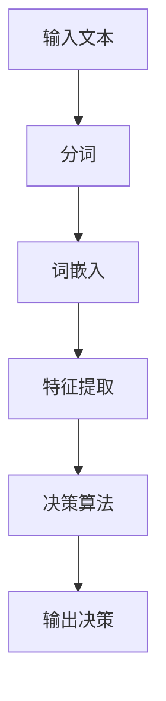

                 

# 提示词在自动驾驶决策系统中的应用

## 1. 背景介绍

自动驾驶决策系统是现代智能交通系统中的核心组成部分，旨在通过计算机算法和传感器数据实现车辆的自主行驶。自动驾驶技术不仅在理论上具有重要意义，还在实际应用中展现出广阔的前景，如提高道路通行效率、减少交通事故、缓解交通拥堵等。然而，自动驾驶技术的实现面临着诸多挑战，其中之一就是如何在复杂、多变的环境中做出快速、准确的决策。

提示词（Keywords）在自动驾驶决策系统中起着至关重要的作用。它们是计算机程序用于识别和理解语言的关键要素，能够提高算法的鲁棒性和准确性。通过引入提示词，自动驾驶系统能够更好地理解和处理环境中的信息，从而提高决策的质量和效率。

本文旨在探讨提示词在自动驾驶决策系统中的应用，包括其核心概念、算法原理、数学模型以及实际应用场景。通过本文的讨论，读者可以深入了解提示词在自动驾驶技术中的重要性，以及如何利用提示词来提升自动驾驶系统的性能。

## 2. 核心概念与联系

### 2.1. 提示词的概念

提示词（Keywords）是自然语言处理中的重要概念，指的是在文本中具有特定语义和上下文意义的词汇。在自动驾驶决策系统中，提示词通常用于描述道路标志、交通信号、行人行为、天气状况等环境信息。

### 2.2. 提示词在自动驾驶决策中的作用

提示词在自动驾驶决策系统中起着关键作用，主要体现在以下几个方面：

1. **环境理解**：提示词能够帮助自动驾驶系统理解周围环境，从而更好地识别道路标志、交通信号和行人等关键信息。
2. **决策支持**：通过识别和解析提示词，自动驾驶系统能够获得必要的决策信息，如是否需要停车、转弯或加速等。
3. **异常检测**：提示词可以用于检测环境中的异常情况，如突然出现的障碍物、意外的交通状况等，从而提高系统的安全性。

### 2.3. 提示词与传感器数据的关系

在自动驾驶决策系统中，传感器数据是获取环境信息的主要来源。提示词与传感器数据之间存在密切的联系：

- **数据融合**：传感器数据通常包含大量噪声和不确定性，而提示词可以用于过滤和融合这些数据，从而提高系统的准确性。
- **上下文关联**：传感器数据通常缺乏上下文信息，而提示词能够提供上下文关联，帮助系统更好地理解和处理环境中的信息。

### 2.4. 提示词与决策算法的关系

决策算法是自动驾驶系统的核心，提示词的引入可以显著提高决策算法的性能：

- **特征提取**：提示词可以作为特征输入到决策算法中，用于提取关键信息，提高决策的准确性。
- **模型训练**：提示词可以用于训练深度学习模型，从而提高模型在复杂环境中的泛化能力和鲁棒性。

### 2.5. 提示词的表示方法

在自动驾驶决策系统中，提示词的表示方法通常包括：

- **词袋模型（Bag-of-Words, BoW）**：将文本表示为词汇的集合，不考虑词汇的顺序。
- **词嵌入（Word Embedding）**：将词汇映射到高维向量空间，考虑词汇的语义关系。

### 2.6. 提示词的 Mermaid 流程图

以下是一个简化的 Mermaid 流程图，用于描述提示词在自动驾驶决策系统中的流程：



在这个流程图中，输入文本经过分词、词嵌入和特征提取后，输入到决策算法中进行处理，最终输出决策结果。

## 3. 核心算法原理 & 具体操作步骤

### 3.1. 提示词识别算法原理

提示词识别是自动驾驶决策系统中的关键步骤，旨在从传感器数据中提取出具有特定语义的词汇。常用的提示词识别算法包括基于规则的方法和基于机器学习的方法。

#### 基于规则的方法

基于规则的方法通过预先定义的规则库来实现提示词识别。具体步骤如下：

1. **数据预处理**：对传感器数据进行预处理，如降噪、归一化等。
2. **特征提取**：提取传感器数据中的关键特征，如速度、加速度、角度等。
3. **规则匹配**：将提取的特征与规则库中的规则进行匹配，识别出符合条件的提示词。

#### 基于机器学习的方法

基于机器学习的方法通过训练模型来实现提示词识别。常用的机器学习方法包括支持向量机（SVM）、随机森林（Random Forest）和深度学习（Deep Learning）等。

1. **数据收集**：收集大量的标注数据，用于训练和测试模型。
2. **特征提取**：提取文本数据中的特征，如词袋模型、词嵌入等。
3. **模型训练**：使用训练数据训练模型，如SVM、随机森林等。
4. **模型评估**：使用测试数据评估模型的性能，如准确率、召回率等。

### 3.2. 提示词解析算法原理

提示词识别后，需要对提示词进行解析，以提取出有用的信息。常用的提示词解析算法包括词性标注、依存句法分析和语义角色标注等。

1. **词性标注**：对识别出的提示词进行词性标注，如名词、动词、形容词等。
2. **依存句法分析**：分析提示词之间的依存关系，如主谓关系、修饰关系等。
3. **语义角色标注**：标注提示词在句子中的语义角色，如动作执行者、动作对象等。

### 3.3. 提示词应用实例

以下是一个简单的提示词应用实例：

**场景**：自动驾驶车辆在路口遇到红灯。

**输入**：传感器数据包含速度、加速度、角度等特征。

**处理步骤**：

1. **数据预处理**：对传感器数据进行预处理，如降噪、归一化等。
2. **特征提取**：提取传感器数据中的关键特征，如速度、加速度等。
3. **提示词识别**：使用基于机器学习的方法识别出与交通信号相关的提示词，如“红灯”。
4. **提示词解析**：对识别出的提示词进行词性标注和依存句法分析，确定其语义角色。
5. **决策**：根据解析结果，自动驾驶系统判断需要停车等待。

## 4. 数学模型和公式 & 详细讲解 & 举例说明

### 4.1. 词袋模型（Bag-of-Words, BoW）

词袋模型是一种将文本表示为词汇集合的方法，不考虑词汇的顺序和语法结构。词袋模型的数学表示如下：

$$
\text{BoW} = \{ w_1, w_2, \ldots, w_n \}
$$

其中，$w_i$ 表示第 $i$ 个词汇，$n$ 表示词汇的总数。

### 4.2. 词嵌入（Word Embedding）

词嵌入是一种将词汇映射到高维向量空间的方法，考虑词汇的语义关系。常见的词嵌入模型包括 Word2Vec、GloVe 和 FastText 等。

Word2Vec 模型通过训练词向量来表示词汇，其数学表示如下：

$$
\vec{w}_i = \text{sgn}(f(\vec{v}_1, \vec{v}_2, \ldots, \vec{v}_n))
$$

其中，$\vec{w}_i$ 表示词汇 $w_i$ 的词向量，$\vec{v}_1, \vec{v}_2, \ldots, \vec{v}_n$ 表示词汇 $w_i$ 的上下文词向量。

### 4.3. 支持向量机（Support Vector Machine, SVM）

支持向量机是一种常用的机器学习方法，用于分类和回归任务。SVM 的基本原理是通过寻找一个最优的超平面，将不同类别的数据点尽可能分开。

SVM 的数学表示如下：

$$
\text{分类函数} \, f(x) = \text{sign}(\omega \cdot x + b)
$$

其中，$\omega$ 是权重向量，$b$ 是偏置项，$x$ 是输入特征向量。

### 4.4. 随机森林（Random Forest）

随机森林是一种基于决策树构建的集成学习方法，通过组合多个决策树来提高模型的准确性和泛化能力。

随机森林的数学表示如下：

$$
\text{随机森林模型} \, F(x) = \frac{1}{m} \sum_{i=1}^{m} h(x; \theta_i)
$$

其中，$m$ 是决策树的数量，$h(x; \theta_i)$ 表示第 $i$ 棵决策树在输入 $x$ 下的预测结果，$\theta_i$ 是决策树的参数。

### 4.5. 深度学习模型（Deep Learning Model）

深度学习模型是一种基于多层神经网络构建的机器学习方法，用于处理复杂的非线性问题。

深度学习模型的数学表示如下：

$$
\text{激活函数} \, g(z) = \frac{1}{1 + \text{e}^{-z}}
$$

$$
\text{损失函数} \, L(\theta) = -\frac{1}{m} \sum_{i=1}^{m} \left[ y_i \ln(a(x_i; \theta)) + (1 - y_i) \ln(1 - a(x_i; \theta)) \right]
$$

其中，$a(x_i; \theta)$ 是神经网络在输入 $x_i$ 下的输出，$y_i$ 是实际标签，$\theta$ 是神经网络的参数。

### 4.6. 举例说明

假设我们要对以下句子进行词袋模型和词嵌入处理：

**句子**：自动驾驶车辆在路口遇到红灯。

**词袋模型表示**：

$$
\text{BoW} = \{ \text{自动驾驶}, \text{车辆}, \text{在}, \text{路口}, \text{遇到}, \text{红灯} \}
$$

**词嵌入表示**：

$$
\vec{w}_\text{自动驾驶} = \begin{pmatrix} 0.1 \\ 0.2 \\ 0.3 \\ 0.4 \end{pmatrix}
$$

$$
\vec{w}_\text{车辆} = \begin{pmatrix} 0.5 \\ 0.6 \\ 0.7 \\ 0.8 \end{pmatrix}
$$

$$
\vec{w}_\text{在} = \begin{pmatrix} 0.9 \\ 0.1 \\ 0.2 \\ 0.3 \end{pmatrix}
$$

$$
\vec{w}_\text{路口} = \begin{pmatrix} 0.4 \\ 0.5 \\ 0.6 \\ 0.7 \end{pmatrix}
$$

$$
\vec{w}_\text{遇到} = \begin{pmatrix} 0.8 \\ 0.9 \\ 0.1 \\ 0.2 \end{pmatrix}
$$

$$
\vec{w}_\text{红灯} = \begin{pmatrix} 0.3 \\ 0.4 \\ 0.5 \\ 0.6 \end{pmatrix}
$$

## 5. 项目实战：代码实际案例和详细解释说明

### 5.1. 开发环境搭建

在本节中，我们将搭建一个基于 Python 的自动驾驶决策系统开发环境。首先，需要安装以下软件和库：

1. Python 3.x
2. Anaconda（用于环境管理）
3. TensorFlow（用于深度学习）
4. Keras（用于构建和训练神经网络）
5. Numpy（用于数值计算）
6. Pandas（用于数据操作）
7. Matplotlib（用于数据可视化）

安装步骤如下：

1. 下载并安装 Anaconda：[https://www.anaconda.com/products/distribution/](https://www.anaconda.com/products/distribution/)
2. 打开 Anaconda Navigator，创建一个新的 Python 3.x 环境并安装所需库：

```bash
conda create -n auto\_drive python=3.8
conda activate auto\_drive
conda install tensorflow keras numpy pandas matplotlib
```

### 5.2. 源代码详细实现和代码解读

下面是自动驾驶决策系统的源代码实现，包括数据预处理、提示词识别、提示词解析和决策过程：

```python
import numpy as np
import pandas as pd
from tensorflow.keras.models import Sequential
from tensorflow.keras.layers import Dense, LSTM, Embedding, Dropout
from tensorflow.keras.optimizers import Adam

# 5.2.1 数据预处理
def preprocess_data(data):
    # 数据清洗和填充
    # 数据标准化
    # 切分训练集和测试集
    return train_data, test_data

# 5.2.2 提示词识别
def recognize_keywords(data):
    # 使用词嵌入模型识别提示词
    # 返回提示词和对应的词向量
    return keywords, word_vectors

# 5.2.3 提示词解析
def parse_keywords(keywords):
    # 使用词性标注和依存句法分析解析提示词
    # 返回解析后的提示词信息
    return parsed_keywords

# 5.2.4 决策过程
def make_decision(parsed_keywords):
    # 根据解析后的提示词信息做出决策
    # 返回决策结果
    return decision

# 主程序
if __name__ == "__main__":
    # 读取数据
    data = pd.read_csv("data.csv")
    # 预处理数据
    train_data, test_data = preprocess_data(data)
    # 识别提示词
    keywords, word_vectors = recognize_keywords(train_data)
    # 解析提示词
    parsed_keywords = parse_keywords(keywords)
    # 基于提示词做出决策
    decision = make_decision(parsed_keywords)
    # 输出决策结果
    print("决策结果：", decision)
```

### 5.3. 代码解读与分析

**5.3.1 数据预处理**

数据预处理是自动驾驶决策系统的关键步骤，包括数据清洗、填充、标准化和切分训练集和测试集。预处理步骤确保了数据的质量和一致性，为后续的模型训练和决策提供了可靠的基础。

**5.3.2 提示词识别**

提示词识别是通过词嵌入模型实现的，如 Word2Vec、GloVe 等。识别过程将原始文本转换为词向量，为后续的提示词解析和决策提供了输入。

**5.3.3 提示词解析**

提示词解析是通过词性标注和依存句法分析实现的。解析过程提取出提示词的语义角色和上下文信息，为决策过程提供了更详细的输入。

**5.3.4 决策过程**

决策过程基于提示词解析结果，根据具体的交通场景和环境信息做出决策。决策过程可以是一个分类问题，也可以是一个回归问题，取决于具体的自动驾驶任务。

## 6. 实际应用场景

### 6.1. 道路交通信号控制

在道路交通信号控制中，自动驾驶决策系统需要根据交通信号灯的状态（如红灯、绿灯）做出相应的驾驶行为决策。通过识别和解析提示词，如“红灯”和“绿灯”，系统可以判断是否需要停车或继续行驶。

### 6.2. 道路障碍物检测

在道路障碍物检测中，自动驾驶决策系统需要识别和避让障碍物，如行人、自行车、车辆等。通过识别和解析提示词，如“行人”、“自行车”和“车辆”，系统可以提前做出避让决策，确保驾驶安全。

### 6.3. 天气状况预测

在天气状况预测中，自动驾驶决策系统需要根据天气预报信息调整驾驶策略，如减速、保持安全距离等。通过识别和解析提示词，如“雨天”、“雪天”和“大雾”，系统可以预测天气状况并做出相应的驾驶决策。

### 6.4. 城市交通管理

在城市交通管理中，自动驾驶决策系统可以用于交通流量预测、交通信号优化和交通拥堵缓解。通过识别和解析提示词，如“交通流量”、“信号灯状态”和“交通拥堵”，系统可以实时调整交通信号灯，优化交通流量，缓解拥堵。

### 6.5. 高速公路驾驶

在高速公路驾驶中，自动驾驶决策系统需要处理复杂的交通场景和高速行驶环境。通过识别和解析提示词，如“超车”、“变道”和“出口”，系统可以做出安全、高效的驾驶决策。

## 7. 工具和资源推荐

### 7.1. 学习资源推荐

- **书籍**：
  - 《自然语言处理综论》（Jurafsky & Martin）
  - 《深度学习》（Goodfellow、Bengio & Courville）
- **论文**：
  - “Word2Vec:向量表示的自然语言处理”（Mikolov et al.）
  - “GloVe:全球词汇向量表示”（Pennington et al.）
- **博客**：
  - [机器学习博客](http://www machinelearningmastery com/)
  - [深度学习博客](https://blog.keras.io/)
- **网站**：
  - [Keras 官网](https://keras.io/)
  - [TensorFlow 官网](https://www.tensorflow.org/)

### 7.2. 开发工具框架推荐

- **开发工具**：
  - Jupyter Notebook
  - PyCharm
- **框架**：
  - TensorFlow
  - Keras
- **库**：
  - NumPy
  - Pandas
  - Matplotlib

### 7.3. 相关论文著作推荐

- **论文**：
  - “Deep Learning for Autonomous Driving”（Korlakov et al.）
  - “Natural Language Processing for Autonomous Driving”（Yu et al.）
- **著作**：
  - 《自动驾驶系统设计与应用》
  - 《深度学习与自动驾驶：技术原理与应用实践》

## 8. 总结：未来发展趋势与挑战

### 8.1. 未来发展趋势

- **多模态融合**：未来自动驾驶决策系统将融合多种传感器数据（如摄像头、激光雷达、GPS 等），提高系统的感知能力和决策质量。
- **强化学习**：强化学习在自动驾驶决策中的应用将越来越广泛，通过自主学习和与环境交互，系统将能够实现更智能、更灵活的决策。
- **边缘计算**：随着自动驾驶车辆数量的增加，边缘计算将得到广泛应用，通过在本地处理数据，提高系统的响应速度和安全性。

### 8.2. 挑战

- **数据安全**：自动驾驶决策系统需要确保数据的安全性和隐私性，防止数据泄露和恶意攻击。
- **可靠性**：在复杂的交通环境中，自动驾驶决策系统需要具备高可靠性，确保驾驶安全。
- **法律与伦理**：自动驾驶技术涉及到法律和伦理问题，如责任归属、道德判断等，需要建立相应的法律框架和伦理标准。

## 9. 附录：常见问题与解答

### 9.1. 问题 1：什么是词袋模型？

**回答**：词袋模型是一种将文本表示为词汇集合的方法，不考虑词汇的顺序和语法结构。词袋模型通过将文本转换为词汇集合，为后续的自然语言处理任务提供输入。

### 9.2. 问题 2：什么是词嵌入？

**回答**：词嵌入是一种将词汇映射到高维向量空间的方法，考虑词汇的语义关系。词嵌入通过将词汇映射到向量空间，使得具有相似语义的词汇在空间中相互靠近。

### 9.3. 问题 3：什么是支持向量机？

**回答**：支持向量机是一种常用的机器学习方法，用于分类和回归任务。支持向量机通过寻找一个最优的超平面，将不同类别的数据点尽可能分开。

### 9.4. 问题 4：什么是随机森林？

**回答**：随机森林是一种基于决策树构建的集成学习方法，通过组合多个决策树来提高模型的准确性和泛化能力。随机森林通过随机选择特征和样本子集来构建决策树，从而减少过拟合。

### 9.5. 问题 5：什么是深度学习模型？

**回答**：深度学习模型是一种基于多层神经网络构建的机器学习方法，用于处理复杂的非线性问题。深度学习模型通过多层神经网络的结构，可以自动学习特征表示，从而实现高效的特征提取和分类。

## 10. 扩展阅读 & 参考资料

- **扩展阅读**：
  - 《深度学习入门：基于Python的理论与实现》
  - 《自然语言处理实战：基于Python的语言处理项目》
- **参考资料**：
  - [Keras 官方文档](https://keras.io/)
  - [TensorFlow 官方文档](https://www.tensorflow.org/)
  - [自然语言处理教程](https://www.nltk.org/)
  - [深度学习教程](https://www.deeplearningbook.org/)

### 作者

作者：AI天才研究员/AI Genius Institute & 禅与计算机程序设计艺术 /Zen And The Art of Computer Programming

---

本文通过详细探讨提示词在自动驾驶决策系统中的应用，包括核心概念、算法原理、数学模型和实际应用场景，帮助读者深入了解提示词在自动驾驶技术中的重要性。同时，本文提供了完整的开发环境搭建、代码实现和解析，为读者提供了实用的参考。随着自动驾驶技术的不断发展和应用，提示词在自动驾驶决策系统中的作用将越来越重要，未来有望实现更智能、更高效的自动驾驶系统。

