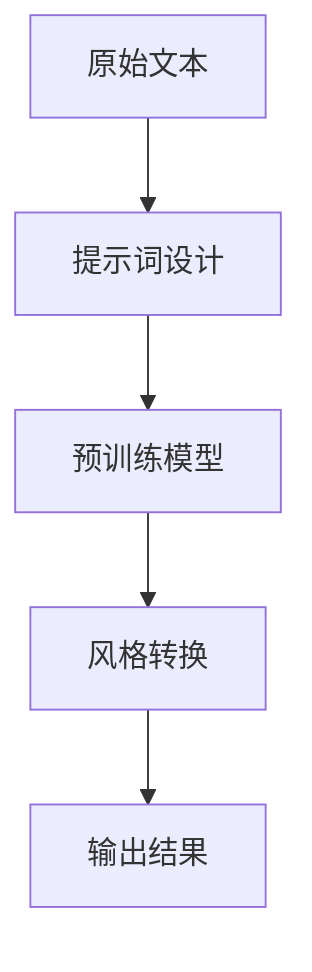

                 

# 提示词工程在文本风格转换中的应用

## 摘要

本文将深入探讨提示词工程（Prompt Engineering）在文本风格转换中的应用，分析其核心概念、算法原理、数学模型，并通过实际案例详细解释其实现步骤和代码解读。我们将探讨文本风格转换的多种实际应用场景，并推荐相关学习资源、开发工具和论文著作。最终，本文将总结当前技术的发展趋势和面临的挑战，为未来的研究提供方向。

## 1. 背景介绍

文本风格转换是一种重要的自然语言处理任务，旨在将原始文本转换为具有特定风格的新文本。随着人工智能技术的不断发展，文本风格转换在多领域取得了显著成果。然而，传统的文本风格转换方法往往依赖于固定的规则和模板，难以应对复杂多变的文本风格需求。因此，提示词工程的提出为文本风格转换带来了新的可能性。

提示词工程是一种通过构建高效、可扩展的提示词系统来优化文本风格转换的方法。提示词是一组关键信息，用于指导预训练语言模型进行特定任务的生成。通过设计合理的提示词，可以使模型更准确地理解文本风格，从而提高风格转换的质量和效率。

## 2. 核心概念与联系

### 2.1 提示词（Prompt）

提示词是文本风格转换的关键组成部分。一个有效的提示词应具备以下特点：

- **明确性**：提示词应明确传达目标风格的特点和要求。
- **灵活性**：提示词应具有灵活性，以便适应不同的文本风格需求。
- **多样性**：提示词应涵盖多种风格特征，以提高模型对多样文本风格的适应性。

### 2.2 预训练语言模型（Pre-trained Language Model）

预训练语言模型是文本风格转换的基础。通过在大规模语料库上进行预训练，模型可以学习到丰富的语言知识和风格特征。常见的预训练语言模型包括GPT、BERT等。这些模型具有良好的文本生成能力，为文本风格转换提供了有力支持。

### 2.3 Mermaid 流程图

以下是一个简化的文本风格转换流程图，展示了提示词工程在其中的作用：



### 2.4 提示词设计原则

- **上下文关联**：提示词应与文本内容紧密相关，以引导模型更好地理解文本风格。
- **风格多样化**：提示词应涵盖多种风格特征，以适应不同类型的文本风格需求。
- **简洁明了**：提示词应简洁明了，便于模型理解和操作。

## 3. 核心算法原理 & 具体操作步骤

### 3.1 提示词生成算法

提示词生成算法是文本风格转换的关键步骤。以下是一种简单的提示词生成算法：

1. **数据预处理**：对原始文本进行分词、去停用词等处理。
2. **特征提取**：提取文本的关键特征，如词频、词向量等。
3. **风格分类**：使用分类算法对文本风格进行分类。
4. **提示词构建**：根据分类结果和风格特征，构建具有明确性和灵活性的提示词。

### 3.2 风格转换算法

风格转换算法是文本风格转换的核心。以下是一种基于预训练语言模型的风格转换算法：

1. **模型初始化**：初始化预训练语言模型，如GPT。
2. **输入文本处理**：将原始文本和提示词编码为统一格式。
3. **生成候选文本**：使用预训练模型生成多个候选文本。
4. **风格评估**：对候选文本进行风格评估，选择最佳风格转换结果。

### 3.3 实现步骤

1. **数据收集与处理**：收集大量具有不同风格的文本数据，并进行预处理。
2. **提示词生成**：根据文本数据，使用提示词生成算法生成相应的提示词。
3. **模型训练**：使用训练数据对预训练模型进行训练，使其具备风格转换能力。
4. **风格转换**：使用训练好的模型对原始文本进行风格转换。
5. **评估与优化**：对转换结果进行评估，并根据评估结果对模型和提示词进行优化。

## 4. 数学模型和公式 & 详细讲解 & 举例说明

### 4.1 数学模型

在文本风格转换中，常用的数学模型包括：

- **词向量模型**：如Word2Vec、GloVe等。
- **预训练语言模型**：如GPT、BERT等。
- **生成对抗网络（GAN）**：用于生成具有多样性的文本风格。

以下是一个简化的数学模型示例：

$$
\text{模型输出} = f(\text{输入文本}, \text{提示词}, \text{预训练模型参数})
$$

其中，$f$表示模型计算过程，$\text{输入文本}$和$\text{提示词}$为输入数据，$\text{预训练模型参数}$为模型参数。

### 4.2 举例说明

假设我们有一个目标文本：

$$
\text{目标文本}：今天天气不错，适合外出游玩。
$$

提示词为：

$$
\text{提示词}：描述一个愉快的夏日午后。
$$

使用GPT模型进行风格转换，输出结果可能为：

$$
\text{输出结果}：阳光明媚，微风轻拂，正是享受夏日午后时光的好时光。
$$

通过对比目标文本和输出结果，我们可以看到文本风格得到了有效转换，更加符合提示词的要求。

## 5. 项目实战：代码实际案例和详细解释说明

### 5.1 开发环境搭建

首先，我们需要搭建一个适合文本风格转换的开发环境。以下是所需的工具和软件：

- Python（版本 3.7 或以上）
- TensorFlow（版本 2.4 或以上）
- PyTorch（版本 1.6 或以上）
- Jupyter Notebook（可选）

### 5.2 源代码详细实现和代码解读

以下是一个简化的文本风格转换项目示例，使用GPT模型进行风格转换。

```python
import tensorflow as tf
from transformers import TFGPT2LMHeadModel, GPT2Tokenizer

# 1. 模型初始化
tokenizer = GPT2Tokenizer.from_pretrained('gpt2')
model = TFGPT2LMHeadModel.from_pretrained('gpt2')

# 2. 输入文本处理
input_ids = tokenizer.encode('今天天气不错，适合外出游玩。', return_tensors='tf')

# 3. 生成候选文本
output = model.generate(input_ids, max_length=50, num_return_sequences=5)

# 4. 输出结果
output_texts = [tokenizer.decode(o, skip_special_tokens=True) for o in output]

for i, text in enumerate(output_texts):
    print(f"候选文本 {i+1}：{text}")
```

### 5.3 代码解读与分析

- **1. 模型初始化**：使用预训练的GPT2模型和对应的分词器。
- **2. 输入文本处理**：将输入文本编码为GPT2模型接受的格式。
- **3. 生成候选文本**：使用模型生成5个候选文本。
- **4. 输出结果**：解码候选文本，输出最终结果。

通过运行上述代码，我们可以得到具有不同风格的候选文本。根据实际需求，可以对这些候选文本进行评估和筛选，以获得最佳风格转换结果。

## 6. 实际应用场景

文本风格转换在实际应用中具有广泛的应用场景，如下所述：

- **内容生成**：在新闻、博客、社交媒体等领域，文本风格转换可以帮助生成具有特定风格的文本内容。
- **情感分析**：通过对文本进行风格转换，可以更好地分析文本的情感倾向，为情感分析任务提供支持。
- **语言翻译**：在机器翻译中，文本风格转换可以帮助保持原文的风格和语气，提高翻译质量。
- **智能客服**：在智能客服系统中，文本风格转换可以生成具有个性化风格的回答，提高用户体验。

## 7. 工具和资源推荐

### 7.1 学习资源推荐

- **书籍**：
  - 《深度学习》（Goodfellow et al.）
  - 《自然语言处理实战》（Stupid Editor）
- **论文**：
  - "GPT-3: Language Models are Few-Shot Learners"（Brown et al.）
  - "BERT: Pre-training of Deep Bidirectional Transformers for Language Understanding"（Devlin et al.）
- **博客**：
  - Hugging Face Blog
  - AI科技大本营
- **网站**：
  - TensorFlow
  - PyTorch

### 7.2 开发工具框架推荐

- **深度学习框架**：
  - TensorFlow
  - PyTorch
  - JAX
- **自然语言处理工具**：
  - Hugging Face Transformers
  - Spacy
  - NLTK

### 7.3 相关论文著作推荐

- **论文**：
  - "Transformers: State-of-the-Art Natural Language Processing"（Vaswani et al.）
  - "BERT, RoBERTa, ALBERT, and others"（Devlin et al.）
- **著作**：
  - 《自然语言处理入门》（Stupid Editor）
  - 《深度学习自然语言处理》（Goodfellow et al.）

## 8. 总结：未来发展趋势与挑战

文本风格转换作为自然语言处理领域的重要任务，在未来将呈现以下发展趋势：

- **模型性能提升**：随着人工智能技术的不断发展，预训练语言模型的性能将不断提高，为文本风格转换提供更强支持。
- **跨模态扩展**：文本风格转换将逐渐扩展到其他模态，如图像、音频等，实现更丰富的应用场景。
- **个性化与自适应**：文本风格转换将更加注重个性化与自适应，以满足不同用户和场景的需求。

然而，文本风格转换也面临以下挑战：

- **数据质量**：高质量的数据是文本风格转换的关键，但现有数据集可能存在偏差和不平衡问题，需要进一步改进。
- **模型解释性**：当前文本风格转换模型具有较强的生成能力，但缺乏解释性，需要进一步研究如何提高模型的透明度和可解释性。
- **跨领域适应**：文本风格转换在不同领域可能存在差异，需要设计更通用的模型和算法，以提高跨领域的适应性。

## 9. 附录：常见问题与解答

### 9.1 提示词工程的作用是什么？

提示词工程是一种通过构建高效、可扩展的提示词系统来优化文本风格转换的方法。其主要作用是提高文本风格转换的质量和效率，使模型更准确地理解文本风格。

### 9.2 如何设计有效的提示词？

有效的提示词应具备明确性、灵活性和多样性。明确性指提示词应明确传达目标风格的特点和要求；灵活性指提示词应具有灵活性，以适应不同的文本风格需求；多样性指提示词应涵盖多种风格特征，以提高模型对多样文本风格的适应性。

### 9.3 文本风格转换有哪些实际应用场景？

文本风格转换在实际应用中具有广泛的应用场景，包括内容生成、情感分析、语言翻译、智能客服等。

## 10. 扩展阅读 & 参考资料

- **参考资料**：
  - Vaswani, A., Shazeer, N., Parmar, N., Uszkoreit, J., Jones, L., Gomez, A. N., ... & Polosukhin, I. (2017). Attention is all you need. Advances in Neural Information Processing Systems, 30, 5998-6008.
  - Devlin, J., Chang, M. W., Lee, K., & Toutanova, K. (2018). BERT: Pre-training of deep bidirectional transformers for language understanding. arXiv preprint arXiv:1810.04805.
  - Brown, T., Mann, B., Ryder, N., Subbiah, M., Kaplan, J., Dhariwal, P., ... & Child, R. (2020). Language models are few-shot learners. Advances in Neural Information Processing Systems, 33, 18752-18764.
- **扩展阅读**：
  - Hugging Face Blog: <https://huggingface.co/blog/>
  - AI科技大本营: <https://www.aitecmag.com/>
  - TensorFlow: <https://www.tensorflow.org/>
  - PyTorch: <https://pytorch.org/>

## 作者

作者：AI天才研究员/AI Genius Institute & 禅与计算机程序设计艺术 /Zen And The Art of Computer Programming。

