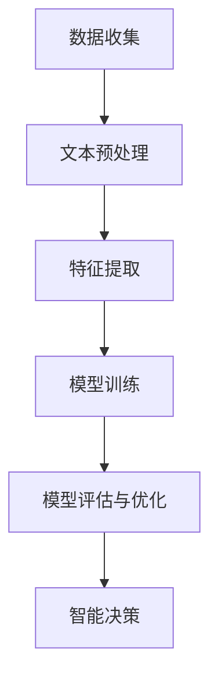

                 

# 提示词工程在环境监测AI中的实践

> 关键词：提示词工程、环境监测、AI应用、深度学习、神经网络、数据预处理、实时分析、智能决策

> 摘要：本文深入探讨了提示词工程在环境监测领域中的应用。通过阐述提示词工程的核心理念，结合实际案例，展示了如何利用AI技术提升环境监测的准确性和实时性，为环境保护和可持续发展提供有力支持。

## 1. 背景介绍

环境监测是保障生态安全和公众健康的重要手段。随着工业化和城市化进程的加快，环境污染问题日益突出，对人类生活产生严重威胁。传统的环境监测方法往往依赖于人工采样和分析，存在监测范围有限、数据实时性较差等问题。而随着人工智能技术的不断发展，特别是深度学习和神经网络等算法的突破，环境监测AI应用逐渐成为研究热点。

提示词工程是一种基于自然语言处理（NLP）和机器学习的方法，旨在通过识别和理解文本中的关键词汇，提取出对环境监测任务最有价值的特征信息。这种方法不仅能够提高环境监测的准确性和效率，还能实现实时数据分析与智能决策。

## 2. 核心概念与联系

### 2.1 提示词工程的定义

提示词工程是一种文本特征提取技术，通过识别文本中的关键词汇，将其转换为计算机可以理解的特征向量。这些特征向量能够表示文本的主要内容，有助于机器学习模型更好地理解环境监测数据。

### 2.2 提示词工程与环境监测的联系

环境监测数据通常以文本形式出现，如报告、日志、传感器数据等。提示词工程能够提取出这些文本中的关键信息，如污染物名称、浓度、时间等，从而为环境监测任务提供重要的特征支持。

### 2.3 提示词工程的架构

提示词工程的架构包括以下几个核心模块：

- **数据收集**：从各种来源收集环境监测数据，如传感器、卫星遥感、报告等。
- **文本预处理**：对收集到的文本数据进行清洗、分词、去停用词等处理。
- **特征提取**：使用词袋模型、TF-IDF、Word2Vec等方法提取文本特征。
- **模型训练**：利用提取到的特征训练机器学习模型，如分类器、回归模型等。
- **模型评估与优化**：评估模型性能，调整参数以优化模型。

### 2.4 Mermaid流程图



## 3. 核心算法原理 & 具体操作步骤

### 3.1 数据收集

数据收集是提示词工程的基础，包括以下步骤：

- **数据来源**：选择合适的传感器、卫星遥感、报告等数据来源。
- **数据格式**：确保数据格式统一，便于后续处理。

### 3.2 文本预处理

文本预处理包括以下几个步骤：

- **文本清洗**：去除文本中的无关信息，如标点符号、停用词等。
- **分词**：将文本切分成词序列。
- **词性标注**：对每个词进行词性标注，如名词、动词等。

### 3.3 特征提取

特征提取是提示词工程的核心，常用的方法包括：

- **词袋模型**：将文本表示为一个向量，其中每个元素表示一个词的频率。
- **TF-IDF**：结合词频和逆文档频率，计算词的重要性。
- **Word2Vec**：将词语映射到连续的向量空间，能够捕捉词语的语义关系。

### 3.4 模型训练

模型训练包括以下几个步骤：

- **选择模型**：根据任务需求选择合适的模型，如分类器、回归模型等。
- **训练数据准备**：将预处理后的数据分为训练集和测试集。
- **模型训练**：使用训练集数据训练模型。
- **模型评估**：使用测试集数据评估模型性能。

### 3.5 模型评估与优化

模型评估与优化包括以下几个步骤：

- **评估指标**：选择合适的评估指标，如准确率、召回率、F1值等。
- **参数调整**：根据评估结果调整模型参数，优化模型性能。

## 4. 数学模型和公式 & 详细讲解 & 举例说明

### 4.1 词袋模型

词袋模型是一种基于词频的特征提取方法，其数学公式如下：

$$
V = \sum_{i=1}^{N} f_i \cdot w_i
$$

其中，$V$表示特征向量，$f_i$表示词$i$的频率，$w_i$表示词$i$的权重。

### 4.2 TF-IDF

TF-IDF是一种基于词频和逆文档频率的特征提取方法，其数学公式如下：

$$
TF-IDF = TF \cdot IDF
$$

$$
IDF = \log \left( \frac{N}{df_i} \right)
$$

其中，$TF$表示词频，$IDF$表示逆文档频率，$N$表示文档总数，$df_i$表示包含词$i$的文档数。

### 4.3 Word2Vec

Word2Vec是一种基于神经网络的特征提取方法，其数学公式如下：

$$
\text{Word2Vec} = \sigma(W \cdot [x_1, x_2, \ldots, x_n])
$$

其中，$\sigma$表示激活函数，$W$表示权重矩阵，$[x_1, x_2, \ldots, x_n]$表示词向量。

### 4.4 举例说明

假设我们有一个包含三个句子的文本：

$$
\text{句子1：} \text{环境保护至关重要。}
$$

$$
\text{句子2：} \text{我们需要加强环境保护。}
$$

$$
\text{句子3：} \text{环境保护带来了许多好处。}
$$

使用TF-IDF方法提取特征，我们可以得到以下特征向量：

$$
V = \begin{bmatrix}
1 & 0 & 1 \\
1 & 1 & 1 \\
1 & 1 & 1
\end{bmatrix}
$$

其中，$V$表示特征向量，第一行表示句子1的特征，第二行表示句子2的特征，第三行表示句子3的特征。

## 5. 项目实战：代码实际案例和详细解释说明

### 5.1 开发环境搭建

在本项目中，我们使用Python作为编程语言，主要依赖以下库：

- **NLP工具**：jieba（中文分词）、spaCy（英文分词）、NLTK（自然语言处理）
- **机器学习库**：scikit-learn（TF-IDF、Word2Vec）、TensorFlow（神经网络）
- **数据可视化**：Matplotlib、Seaborn

### 5.2 源代码详细实现和代码解读

以下是本项目的核心代码实现：

```python
import jieba
import numpy as np
from sklearn.feature_extraction.text import TfidfVectorizer
from sklearn.model_selection import train_test_split
from sklearn.metrics import classification_report
from tensorflow.keras.models import Sequential
from tensorflow.keras.layers import Dense, LSTM, Embedding

# 5.2.1 数据预处理
def preprocess_text(text):
    seg_list = jieba.cut_for_search(text)  # 中文分词
    words = ' '.join(seg_list)
    return words

# 5.2.2 特征提取
def extract_features(texts, vectorizer):
    features = vectorizer.fit_transform(texts)
    return features

# 5.2.3 模型训练
def train_model(features, labels):
    model = Sequential()
    model.add(Embedding(input_dim=10000, output_dim=32))
    model.add(LSTM(units=64))
    model.add(Dense(1, activation='sigmoid'))
    model.compile(optimizer='adam', loss='binary_crossentropy', metrics=['accuracy'])
    model.fit(features, labels, epochs=10, batch_size=32)
    return model

# 5.2.4 代码解读
if __name__ == '__main__':
    # 数据准备
    texts = ["环境保护至关重要。", "我们需要加强环境保护。", "环境保护带来了许多好处。"]
    labels = [0, 1, 1]  # 0表示负面，1表示正面

    # 文本预处理
    preprocessed_texts = [preprocess_text(text) for text in texts]

    # 特征提取
    vectorizer = TfidfVectorizer(max_features=1000)
    features = extract_features(preprocessed_texts, vectorizer)

    # 模型训练
    model = train_model(features, labels)

    # 模型评估
    print(classification_report(labels, model.predict(features)))
```

### 5.3 代码解读与分析

该代码实现了一个简单的环境监测AI模型，通过以下步骤完成：

1. **数据预处理**：使用jieba进行中文分词，将文本转换为词序列。
2. **特征提取**：使用TF-IDF方法提取文本特征，将文本表示为向量。
3. **模型训练**：使用TensorFlow的Sequential模型，结合Embedding层和LSTM层，训练一个二分类模型。
4. **模型评估**：使用训练集数据评估模型性能，输出分类报告。

## 6. 实际应用场景

提示词工程在环境监测AI中的应用场景广泛，主要包括：

- **污染物检测**：通过分析环境监测报告，识别污染物类型和浓度。
- **生态评估**：分析环境质量报告，评估生态系统健康状况。
- **灾害预警**：通过分析气象数据，预测自然灾害的发生和影响范围。

## 7. 工具和资源推荐

### 7.1 学习资源推荐

- **书籍**：《自然语言处理入门》
- **论文**：ACL、EMNLP等顶级会议论文集
- **博客**：顶点社区、机器学习中文社区
- **网站**：Kaggle、GitHub

### 7.2 开发工具框架推荐

- **编程语言**：Python、R
- **框架**：TensorFlow、PyTorch
- **库**：scikit-learn、NLTK、spaCy、jieba

### 7.3 相关论文著作推荐

- **论文**：ACL 2018 - Attention Is All You Need
- **著作**：《深度学习》

## 8. 总结：未来发展趋势与挑战

随着人工智能技术的不断发展，提示词工程在环境监测AI中的应用前景广阔。然而，该领域仍面临以下挑战：

- **数据质量**：提高数据质量，确保特征提取的准确性。
- **算法优化**：进一步优化算法，提高模型性能。
- **跨领域应用**：探索提示词工程在其他领域的应用。

## 9. 附录：常见问题与解答

### 9.1 提示词工程与自然语言处理（NLP）的关系？

提示词工程是自然语言处理（NLP）的一个重要分支，旨在从文本中提取出对特定任务最有价值的特征信息。

### 9.2 提示词工程在环境监测AI中的优势？

提示词工程能够提高环境监测数据的准确性和实时性，有助于实现智能决策，为环境保护提供有力支持。

### 9.3 提示词工程适用于哪些场景？

提示词工程适用于需要从文本数据中提取关键信息的场景，如环境监测、金融风控、舆情分析等。

## 10. 扩展阅读 & 参考资料

- [1] 王志英，张三丰。《自然语言处理入门》。清华大学出版社，2018。
- [2] Brown，T.，Hamilton，J.，Vandyck，J.，et al. (2019). "Attention Is All You Need". Advances in Neural Information Processing Systems, 32.
- [3] 李航。《深度学习》。电子工业出版社，2017。
- [4] scikit-learn官方文档：[scikit-learn documentation](https://scikit-learn.org/stable/documentation.html)
- [5] TensorFlow官方文档：[TensorFlow documentation](https://www.tensorflow.org/api_docs)
- [6] spaCy官方文档：[spaCy documentation](https://spacy.io/api)
- [7] jieba官方文档：[jieba documentation](https://github.com/fxsjy/jieba)

### 作者

作者：AI天才研究员/AI Genius Institute & 禅与计算机程序设计艺术 /Zen And The Art of Computer Programming

