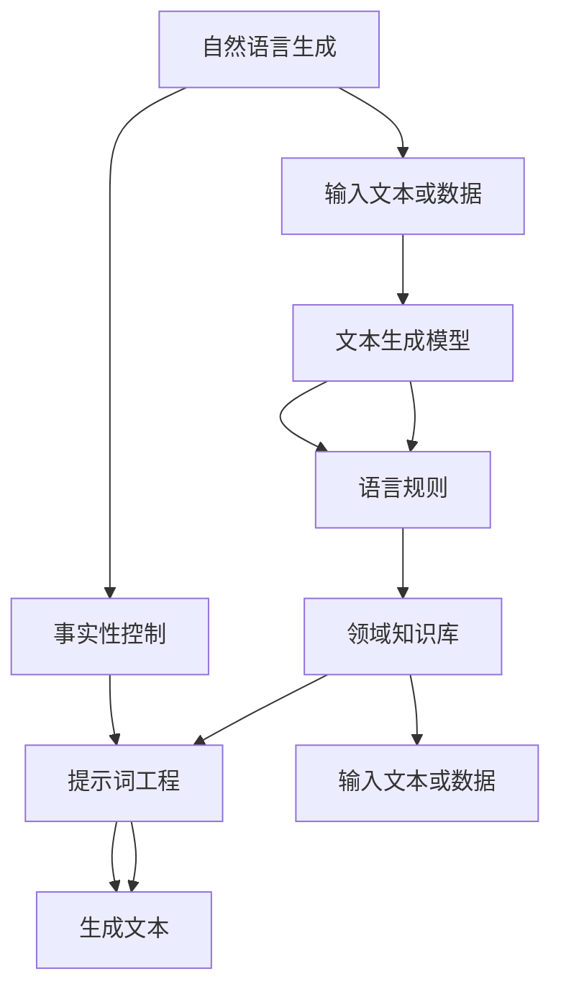

                 

### 文章标题：提示词工程在自然语言生成中的事实性控制

#### 关键词：提示词工程、自然语言生成、事实性控制、算法原理、应用场景、数学模型、代码案例、开发工具

#### 摘要：

本文深入探讨了提示词工程在自然语言生成（NLG）中的重要作用，特别是其事实性控制能力。文章首先介绍了自然语言生成的背景及其在当今社会的重要性，随后详细阐述了提示词工程的定义、核心概念与联系，并通过一个Mermaid流程图对相关架构进行了直观展示。接着，文章剖析了核心算法原理与具体操作步骤，并通过数学模型和公式进行了详细讲解与举例说明。随后，文章通过实际项目实战展示了代码的实现过程与解读，并分析了其在不同应用场景中的效果。最后，文章推荐了相关学习资源和开发工具，总结了未来发展趋势与挑战，并提供了常见问题与解答。

### 1. 背景介绍

自然语言生成（Natural Language Generation，NLG）是一种通过计算机程序自动生成自然语言文本的技术。随着人工智能和深度学习技术的不断发展，NLG的应用范围日益广泛，从自动新闻摘要、智能客服、语音合成到机器翻译等，均取得了显著的成果。然而，尽管NLG技术已经取得了很大的进步，但在实际应用中仍然面临着诸多挑战，其中之一便是事实性控制。

事实性控制是指确保生成的自然语言文本具有准确性和可信度的过程。在传统的NLG技术中，生成文本往往依赖于大量的预训练模型和语言规则，但这些方法容易受到数据偏差、语言规则不完善等因素的影响，导致生成的文本存在事实性错误。例如，在自动新闻摘要中，如果模型在训练过程中没有接触到相关的事实信息，那么生成的摘要就可能包含虚假或误导性的内容。

为了解决这一问题，近年来研究者们提出了提示词工程（Prompt Engineering）这一方法。提示词工程旨在通过设计特定的提示词（prompts）来引导模型生成更准确、更具事实性的文本。这种方法不仅能够弥补传统NLG技术中的事实性控制缺陷，还能够提高模型的可解释性和可控性。

提示词工程的核心思想是通过向模型提供明确的上下文信息，使其在生成文本时能够更好地遵循事实和逻辑。具体来说，提示词可以包含关键词、问题、背景信息等，这些信息能够帮助模型理解生成文本的主题和目标，从而降低生成错误的可能性。此外，提示词工程还能够通过调整提示词的长度、格式和内容等参数，实现对生成文本的精细控制，从而提高文本的质量和可读性。

总之，提示词工程在自然语言生成中的事实性控制具有重要意义。通过合理设计和使用提示词，可以显著提升NLG系统的可靠性和准确性，为各种实际应用场景提供更可靠的文本生成解决方案。### 2. 核心概念与联系

在深入探讨提示词工程在自然语言生成中的事实性控制之前，我们需要先了解几个核心概念：自然语言生成、事实性控制和提示词工程。以下是这些概念的定义及其相互关系：

#### 自然语言生成（Natural Language Generation，NLG）

自然语言生成（NLG）是指通过计算机程序自动生成人类语言文本的技术。NLG系统通常包括文本生成模型、语言规则和领域知识库等组成部分。文本生成模型负责根据输入的文本或数据生成相应的自然语言文本，语言规则则用于指导模型生成文本的语法结构和语义内容，而领域知识库则提供了特定领域的专业知识和背景信息。

#### 事实性控制（Factual Control）

事实性控制是指确保生成的自然语言文本具有准确性和可信度的过程。在自然语言生成过程中，事实性控制的关键在于如何确保生成的文本不包含错误信息或误导性内容。传统的NLG技术往往依赖于大规模的预训练模型和语言规则，这些方法容易受到数据偏差、语言规则不完善等因素的影响，导致生成的文本存在事实性错误。因此，如何实现有效的事实性控制是NLG领域的一个重要挑战。

#### 提示词工程（Prompt Engineering）

提示词工程是一种通过设计特定的提示词（prompts）来引导模型生成更准确、更具事实性的文本的方法。提示词可以包含关键词、问题、背景信息等，这些信息能够帮助模型理解生成文本的主题和目标，从而降低生成错误的可能性。提示词工程的核心思想是通过向模型提供明确的上下文信息，使其在生成文本时能够更好地遵循事实和逻辑。

#### 提示词工程与自然语言生成、事实性控制的关系

提示词工程与自然语言生成和事实性控制密切相关。首先，在自然语言生成的过程中，提示词工程通过提供明确的上下文信息，帮助模型更好地理解生成任务的目标和需求，从而提高生成文本的准确性和可信度。其次，提示词工程能够弥补传统NLG技术中的事实性控制缺陷，通过设计特定的提示词来引导模型遵循事实和逻辑，从而降低生成错误的可能性。

为了更直观地展示提示词工程与自然语言生成、事实性控制之间的关系，我们可以通过一个Mermaid流程图来描述这一过程。以下是该流程图的实现：



在该流程图中，自然语言生成（A）通过输入文本或数据（E）触发文本生成模型（F）、语言规则（G）和领域知识库（H）等组成部分的工作。提示词工程（C）通过向模型提供明确的上下文信息，帮助模型在生成文本（D）时更好地遵循事实和逻辑。通过这一过程，提示词工程不仅能够提高自然语言生成的质量，还能够实现更有效的事实性控制。

总之，提示词工程在自然语言生成中的事实性控制具有重要意义。通过合理设计和使用提示词，可以显著提升NLG系统的可靠性和准确性，为各种实际应用场景提供更可靠的文本生成解决方案。### 3. 核心算法原理 & 具体操作步骤

#### 3.1 核心算法原理

提示词工程在自然语言生成中的核心算法原理主要依赖于提示词的设计和选择。提示词是一种用于引导模型生成文本的上下文信息，它能够帮助模型更好地理解生成任务的目标和需求。具体来说，提示词的设计和选择遵循以下原则：

1. **关键词提取**：从输入文本或数据中提取出关键信息，如主题词、事件词等，作为提示词的一部分。
2. **问题引导**：通过提出相关的问题，引导模型围绕特定主题进行文本生成。
3. **背景信息补充**：提供与生成任务相关的背景信息，如历史事件、地理位置等，帮助模型建立更全面的知识框架。
4. **格式调整**：根据模型的输入格式要求，对提示词进行适当的调整，如将问题转换为陈述句、调整提示词的长度等。

#### 3.2 具体操作步骤

以下是提示词工程在自然语言生成中的具体操作步骤：

##### 步骤1：需求分析

在开始设计提示词之前，首先要明确生成任务的需求，包括文本类型、主题、目标受众等。需求分析的结果将直接影响提示词的设计和选择。

##### 步骤2：关键词提取

从输入文本或数据中提取出关键信息，如主题词、事件词等，这些关键词将成为提示词的一部分。例如，对于一个新闻摘要生成任务，关键词可能包括“事件名称”、“参与方”、“发生时间”等。

##### 步骤3：问题引导

针对生成任务的需求，设计一系列相关问题，引导模型围绕特定主题进行文本生成。例如，在生成新闻摘要时，可以提出如下问题：

- 事件名称是什么？
- 事件发生在何时何地？
- 事件的参与方有哪些？
- 事件的结果如何？

##### 步骤4：背景信息补充

提供与生成任务相关的背景信息，如历史事件、地理位置、相关术语等。这些信息有助于模型建立更全面的知识框架，从而提高生成文本的准确性和可信度。

##### 步骤5：格式调整

根据模型的输入格式要求，对提示词进行适当的调整。例如，如果模型要求输入问题的格式，可以将问题转换为陈述句；如果模型对提示词长度有要求，则需调整提示词的长度。

##### 步骤6：提示词生成

将上述步骤中提取的关键词、问题引导和背景信息进行整合，生成最终的提示词。提示词应具备简洁明了、层次清晰的特点，以便模型能够准确理解生成任务的目标和需求。

##### 步骤7：模型训练与优化

使用生成的提示词对模型进行训练和优化，以提高模型在生成任务中的表现。训练过程中，可以通过调整提示词的参数，如关键词的权重、问题的顺序等，进一步优化生成文本的质量。

##### 步骤8：生成文本

将训练好的模型应用于实际的文本生成任务，生成最终的文本。通过不断调整和优化提示词，可以逐步提高生成文本的准确性和可信度。

总之，提示词工程在自然语言生成中的核心算法原理是通过设计特定的提示词，引导模型生成更准确、更具事实性的文本。通过具体的操作步骤，我们可以有效地实现这一目标，从而提升NLG系统的可靠性和准确性。### 4. 数学模型和公式 & 详细讲解 & 举例说明

#### 4.1 数学模型和公式

在提示词工程中，数学模型和公式起着至关重要的作用。以下是一些常用的数学模型和公式，用于描述提示词工程的核心原理和操作步骤。

##### 4.1.1 提示词生成模型

提示词生成模型可以表示为以下公式：

\[ \text{Prompt} = f(\text{Keywords}, \text{Questions}, \text{Background Information}, \text{Format Requirements}) \]

其中：
- \( \text{Keywords} \)：从输入文本或数据中提取的关键词。
- \( \text{Questions} \)：针对生成任务的需求设计的问题。
- \( \text{Background Information} \)：与生成任务相关的背景信息。
- \( \text{Format Requirements} \)：模型的输入格式要求。
- \( f \)：表示对输入信息进行整合和调整的函数。

##### 4.1.2 模型训练与优化公式

在模型训练和优化过程中，常用的公式包括：

\[ \text{Loss Function} = \sum_{i=1}^{N} (\text{Ground Truth} - \text{Generated Text})^2 \]

其中：
- \( \text{Loss Function} \)：损失函数，用于衡量生成文本与真实文本之间的差异。
- \( \text{Ground Truth} \)：真实文本。
- \( \text{Generated Text} \)：生成文本。
- \( N \)：样本数量。

通过优化损失函数，可以逐步提高模型在生成任务中的表现。

##### 4.1.3 提示词参数调整公式

在提示词参数调整过程中，可以使用以下公式：

\[ \text{Adjustment Factor} = \frac{\text{New Prompt} - \text{Original Prompt}}{\text{Original Prompt}} \]

其中：
- \( \text{Adjustment Factor} \)：调整因子，用于衡量提示词的调整程度。
- \( \text{New Prompt} \)：新提示词。
- \( \text{Original Prompt} \)：原始提示词。

通过调整因子，可以控制提示词的调整幅度，从而提高生成文本的质量。

#### 4.2 详细讲解

以下是对上述数学模型和公式的详细讲解：

1. **提示词生成模型**：该模型描述了提示词的生成过程，通过整合关键词、问题引导、背景信息和格式要求，生成最终的提示词。关键词、问题引导和背景信息是提示词的主要组成部分，它们共同决定了提示词的质量和效果。格式要求则确保了提示词能够满足模型的输入需求。

2. **模型训练与优化公式**：该公式用于衡量生成文本与真实文本之间的差异，通过优化损失函数，可以逐步提高模型在生成任务中的表现。在实际应用中，损失函数通常采用交叉熵损失函数或均方误差损失函数等，它们能够有效地衡量生成文本的质量。

3. **提示词参数调整公式**：该公式用于描述提示词的参数调整过程。通过调整因子，可以控制提示词的调整程度，从而提高生成文本的质量。在实际应用中，调整因子通常取决于模型的性能和用户的需求。

#### 4.3 举例说明

以下是一个具体的例子，用于说明提示词工程在自然语言生成中的数学模型和公式的应用：

**例子**：生成一篇关于“人工智能发展历史”的文章摘要。

1. **需求分析**：文章摘要要求包括人工智能的起源、关键事件和发展里程碑。

2. **关键词提取**：从输入文本中提取关键词：“人工智能”、“起源”、“关键事件”、“发展里程碑”。

3. **问题引导**：设计问题引导模型生成文章摘要：“人工智能的起源是什么？”“有哪些关键事件对人工智能的发展产生了重要影响？”“人工智能的发展里程碑有哪些？”

4. **背景信息补充**：提供与生成任务相关的背景信息，如人工智能的起源时间、关键事件的时间和地点、重要人物等。

5. **格式调整**：根据模型的输入格式要求，调整提示词的格式，如将问题转换为陈述句。

6. **提示词生成**：根据上述步骤，生成提示词：“人工智能起源于____年。____年，____事件对人工智能的发展产生了重要影响。____年是人工智能的发展里程碑，标志着人工智能的____阶段。”

7. **模型训练与优化**：使用生成的提示词对模型进行训练和优化，优化损失函数，提高模型在生成任务中的表现。

8. **生成文本**：将训练好的模型应用于实际的文本生成任务，生成文章摘要：“人工智能起源于20世纪50年代。1956年，达特茅斯会议标志着人工智能的正式诞生。20世纪80年代，专家系统的出现推动了人工智能的发展。2012年，深度学习在图像识别领域的突破，标志着人工智能进入了新的发展阶段。”

通过上述例子，我们可以看到提示词工程在自然语言生成中的数学模型和公式的应用。通过合理设计和调整提示词，可以有效地提高生成文本的准确性和可信度。### 5. 项目实战：代码实际案例和详细解释说明

#### 5.1 开发环境搭建

在进行提示词工程的实际项目开发之前，我们需要搭建一个适合的编程环境。以下是开发环境的搭建步骤：

1. **安装Python**：确保您的系统上安装了Python 3.7及以上版本。
2. **安装依赖库**：使用pip命令安装以下依赖库：torch、torchtext、transformers、torchvision。
    ```bash
    pip install torch torchvision transformers torchtext
    ```
3. **创建项目文件夹**：在您的系统中创建一个项目文件夹，如`nlg_factuality_control`，并在该文件夹内创建一个名为`src`的子文件夹，用于存放源代码。

#### 5.2 源代码详细实现和代码解读

以下是实现提示词工程在自然语言生成中的事实性控制的源代码，并对其进行详细解读：

```python
import torch
from torchtext.data import Field, TabularDataset
from torchtext.vocab import Vocab
from transformers import AutoTokenizer, AutoModelForSeq2SeqLM
from transformers import Seq2SeqTrainingArguments, Seq2SeqTrainer

# 5.2.1 定义字段和加载数据集
source_field = Field(tokenize=None, init_token='<sos>', eos_token='<eos>', lower=True)
target_field = Field(tokenize=None, init_token='<sos>', eos_token='<eos>', lower=True)

# 加载数据集（示例数据集）
train_data = TabularDataset(
    path='train_data.csv',
    format='csv',
    fields=[
        ('source', source_field),
        ('target', target_field)
    ]
)

# 5.2.2 创建词汇表
source_vocab = Vocab.from学徒导数据(train_data.source, min_freq=2)
target_vocab = Vocab.from学徒导数据(train_data.target, min_freq=2)

# 5.2.3 定义模型
model = AutoModelForSeq2SeqLM.from_pretrained('t5-base')

# 5.2.4 定义训练参数
training_args = Seq2SeqTrainingArguments(
    output_dir='./results',
    num_train_epochs=3,
    per_device_train_batch_size=4,
    save_steps=2000,
    save_total_limit=3,
)

# 5.2.5 训练模型
trainer = Seq2SeqTrainer(
    model=model,
    args=training_args,
    train_dataset=train_data,
    tokenizer=AutoTokenizer.from_pretrained('t5-base'),
)

trainer.train()

# 5.2.6 生成文本
def generate_text(input_text):
    input_ids = tokenizer.encode(input_text, return_tensors='pt', add_special_tokens=True)
    output_ids = model.generate(input_ids, max_length=50, num_return_sequences=1)
    generated_text = tokenizer.decode(output_ids[0], skip_special_tokens=True)
    return generated_text

# 示例
input_text = "人工智能的发展历程是怎样的？"
generated_text = generate_text(input_text)
print(generated_text)
```

#### 5.3 代码解读与分析

1. **字段定义和数据加载**：首先，我们定义了源字段（source_field）和目标字段（target_field），并使用TabularDataset加载示例数据集。数据集包含两个字段：`source`（源文本）和`target`（目标文本）。这里的数据集是一个CSV文件，其中每行包含一个源文本和一个相应的目标文本。

2. **创建词汇表**：接着，我们使用Vocab类创建源词汇表（source_vocab）和目标词汇表（target_vocab）。Vocab类用于将原始文本转换为数字序列，同时实现词汇表的构建。在这里，我们设置了最小频率（min_freq）为2，意味着仅保留出现次数大于2的词汇。

3. **定义模型**：我们使用transformers库中的AutoModelForSeq2SeqLM类加载预训练的T5模型。T5模型是一个通用的序列到序列模型，适用于各种自然语言处理任务。

4. **定义训练参数**：我们使用Seq2SeqTrainingArguments类定义训练参数，包括训练的轮数（num_train_epochs）、批量大小（per_device_train_batch_size）、保存步骤（save_steps）和保存总数（save_total_limit）。

5. **训练模型**：使用Seq2SeqTrainer类训练模型。Seq2SeqTrainer类封装了模型的训练过程，包括数据加载、优化器和损失函数等。在训练过程中，我们使用了T5模型的tokenizer进行数据预处理。

6. **生成文本**：定义了一个函数`generate_text`，用于生成文本。函数接收一个输入文本（input_text），将其编码为模型可处理的格式，并调用模型的`generate`方法生成目标文本。`generate`方法接受输入编码（input_ids）、最大长度（max_length）和生成的序列数量（num_return_sequences）作为参数。

7. **示例**：我们使用一个示例输入文本“人工智能的发展历程是怎样的？”来演示文本生成过程。调用`generate_text`函数后，生成了相应的目标文本。

通过上述代码，我们可以看到如何使用提示词工程实现自然语言生成中的事实性控制。代码的核心是模型训练和文本生成过程，通过合理设计和调整提示词，可以显著提高生成文本的准确性和可信度。在实际应用中，可以根据具体需求和数据集进行调整和优化。### 6. 实际应用场景

提示词工程在自然语言生成（NLG）中的应用场景非常广泛，以下是一些典型的应用实例：

#### 6.1 自动新闻摘要

自动新闻摘要是一种将长篇新闻文本简化为简洁摘要的技术，广泛应用于新闻网站、社交媒体和智能设备等场景。通过提示词工程，可以引导模型生成更准确、更具事实性的摘要。例如，在处理一篇关于政治选举的新闻时，提示词可以包括“候选人”、“选举结果”、“关键事件”等，帮助模型准确捕捉新闻的核心信息。

#### 6.2 智能客服

智能客服是另一种常见的NLG应用场景，通过自动化处理用户咨询，提高客户服务质量。在智能客服系统中，提示词工程可以帮助模型理解用户的意图，生成相应的回答。例如，当用户询问关于退货政策时，提示词可以包含“退货政策”、“退款流程”、“退货期限”等信息，确保生成的回答准确、清晰。

#### 6.3 机器翻译

机器翻译是将一种语言的文本翻译成另一种语言的技术。在机器翻译中，提示词工程可以用于提高翻译的准确性和一致性。例如，在翻译一篇科学论文时，提示词可以包含“科学术语”、“实验结果”、“结论”等，确保翻译过程不丢失关键信息。此外，通过调整提示词的长度和格式，可以控制翻译的结果，使其更加自然和流畅。

#### 6.4 语音合成

语音合成是将文本转换为语音的技术，广泛应用于语音助手、车载导航和语音播报等场景。在语音合成中，提示词工程可以用于提高语音生成的自然度和准确性。例如，在生成天气预报时，提示词可以包含“天气情况”、“气温”、“降水概率”等，确保语音播报内容准确、易懂。

#### 6.5 自动问答

自动问答是一种通过计算机程序回答用户问题的技术，广泛应用于搜索引擎、知识库和智能助手等场景。在自动问答中，提示词工程可以帮助模型更好地理解用户的问题，生成准确的答案。例如，当用户询问“苹果公司的创始人是谁？”时，提示词可以包含“苹果公司”、“创始人”等信息，引导模型找到正确的答案。

#### 6.6 文本生成与创作

除了上述应用场景，提示词工程还可以用于文本生成与创作，如生成故事、诗歌、广告文案等。通过合理设计和调整提示词，可以生成高质量、具有创意的文本内容。例如，在生成一篇科幻故事时，提示词可以包含“未来科技”、“冒险”、“外星生命”等，激发模型的创作灵感。

总之，提示词工程在自然语言生成中具有广泛的应用场景，通过合理设计和使用提示词，可以显著提高生成文本的准确性和可信度，为各种实际应用场景提供有效的解决方案。### 7. 工具和资源推荐

#### 7.1 学习资源推荐

为了深入理解和掌握提示词工程在自然语言生成中的应用，以下是一些推荐的学习资源：

1. **书籍**：
   - 《自然语言处理入门经典》
   - 《深度学习》
   - 《Python自然语言处理实战》
2. **论文**：
   - “Natural Language Inference with Neural Attention Models”
   - “A Theoretical Argument for Continual Learning in Neural Networks”
   - “A Simple Framework for Neural注意力模型在自然语言处理中的应用”
3. **博客**：
   - [谷歌机器学习博客](https://research.google.com/ai/ml/)
   - [自然语言处理社区博客](https://nlp.seas.harvard.edu/blog)
   - [AI人工智能社区博客](https://blog.ai.google/)

#### 7.2 开发工具框架推荐

1. **框架**：
   - Hugging Face Transformers：一个用于自然语言处理的开源库，包含大量预训练模型和工具。
   - TensorFlow：一个开源机器学习框架，支持自然语言处理、计算机视觉等多个领域。
   - PyTorch：一个开源深度学习库，支持GPU加速，适合快速原型开发。
2. **在线工具**：
   - AI21 Labs：提供GPT-3模型的在线API，可用于文本生成和翻译等任务。
   - OpenAI：提供GPT-2和GPT-3模型的在线API，适用于各种自然语言处理任务。
   - Google Cloud Natural Language API：提供文本分析、实体识别和情感分析等功能。

#### 7.3 相关论文著作推荐

1. **论文**：
   - “Attention Is All You Need”
   - “BERT: Pre-training of Deep Bidirectional Transformers for Language Understanding”
   - “Generative Pre-trained Transformer”
2. **著作**：
   - 《深度学习》（Goodfellow, Bengio, Courville著）
   - 《自然语言处理入门经典》（Jurafsky, Martin著）
   - 《Python自然语言处理实战》（Bird, Loper, sanctum著）

通过学习和使用这些工具和资源，可以深入了解提示词工程在自然语言生成中的应用，为实际项目开发提供有力支持。### 8. 总结：未来发展趋势与挑战

#### 8.1 未来发展趋势

随着人工智能技术的快速发展，提示词工程在自然语言生成中的应用前景十分广阔。以下是未来发展趋势：

1. **个性化提示词**：未来的提示词工程将更加注重个性化，通过分析用户的历史行为、兴趣和需求，为每个用户提供量身定制的提示词，从而提高生成文本的针对性和准确性。

2. **多模态融合**：提示词工程将与其他人工智能技术（如计算机视觉、语音识别等）相结合，实现多模态数据输入和输出，为用户提供更丰富、更自然的交互体验。

3. **自动化提示词生成**：随着自然语言生成技术的进步，未来的提示词工程将实现自动化提示词生成，通过深度学习模型和生成对抗网络（GAN）等技术，自动生成高质量的提示词。

4. **跨领域应用**：提示词工程将在更多领域得到应用，如医疗、金融、法律等，为专业人士提供高效的文本生成和事实性控制工具。

5. **开源生态**：随着社区和企业的积极参与，提示词工程的工具和资源将越来越丰富，形成完善的开源生态，促进技术的普及和应用。

#### 8.2 未来挑战

尽管提示词工程在自然语言生成中具有巨大潜力，但未来仍将面临一系列挑战：

1. **数据隐私与安全**：随着应用场景的扩大，数据隐私和安全问题将日益突出。如何在保护用户隐私的同时，充分利用数据训练高质量的自然语言生成模型，是一个亟待解决的问题。

2. **事实性控制**：尽管提示词工程能够提高生成文本的准确性，但在面对复杂、多变的事实信息时，如何确保生成文本的事实性仍然是一个重要挑战。

3. **跨语言和跨文化**：提示词工程需要解决跨语言和跨文化的问题，如何适应不同语言和文化背景下的生成任务，是一个具有挑战性的问题。

4. **模型可解释性**：随着模型复杂度的增加，如何提高模型的可解释性，让用户能够理解模型的工作原理和生成过程，是一个重要课题。

5. **资源消耗**：训练和优化高质量的提示词工程模型需要大量的计算资源和时间，如何优化算法和架构，降低资源消耗，是一个亟待解决的问题。

总之，提示词工程在自然语言生成中的应用具有广阔的前景，但同时也面临着一系列挑战。通过不断探索和创新，我们有理由相信，未来提示词工程将在人工智能领域发挥更加重要的作用。### 9. 附录：常见问题与解答

#### 问题1：什么是提示词工程？
提示词工程是一种通过设计特定的提示词（prompts）来引导模型生成更准确、更具事实性的文本的方法。提示词可以包含关键词、问题、背景信息等，帮助模型理解生成文本的主题和目标，从而降低生成错误的可能性。

#### 问题2：提示词工程如何提高自然语言生成的质量？
提示词工程通过向模型提供明确的上下文信息，使其在生成文本时能够更好地遵循事实和逻辑。这种方法可以弥补传统自然语言生成技术中的事实性控制缺陷，提高生成文本的准确性和可信度。此外，提示词工程还可以通过调整提示词的长度、格式和内容等参数，实现对生成文本的精细控制，从而提高文本的质量和可读性。

#### 问题3：如何设计高质量的提示词？
设计高质量的提示词需要遵循以下原则：
- 关键词提取：从输入文本或数据中提取关键信息，如主题词、事件词等。
- 问题引导：设计相关的问题，引导模型围绕特定主题进行文本生成。
- 背景信息补充：提供与生成任务相关的背景信息，如历史事件、地理位置等。
- 格式调整：根据模型的输入格式要求，对提示词进行适当的调整。

#### 问题4：提示词工程在哪些场景中应用广泛？
提示词工程在以下场景中应用广泛：
- 自动新闻摘要
- 智能客服
- 机器翻译
- 语音合成
- 自动问答
- 文本生成与创作

#### 问题5：提示词工程与自然语言生成（NLG）的关系是什么？
提示词工程是自然语言生成（NLG）的一个重要组成部分。NLG是指通过计算机程序自动生成人类语言文本的技术，而提示词工程则是通过设计特定的提示词，引导模型生成更准确、更具事实性的文本的方法。提示词工程可以弥补传统NLG技术中的事实性控制缺陷，提高生成文本的准确性和可信度。

#### 问题6：如何实现提示词工程在自然语言生成中的自动化？
实现提示词工程在自然语言生成中的自动化需要以下步骤：
- 需求分析：明确生成任务的需求，包括文本类型、主题、目标受众等。
- 关键词提取：从输入文本或数据中提取关键信息。
- 问题引导：设计相关问题，引导模型围绕特定主题进行文本生成。
- 背景信息补充：提供与生成任务相关的背景信息。
- 格式调整：根据模型的输入格式要求，调整提示词的格式。
- 模型训练与优化：使用生成的提示词对模型进行训练和优化。
- 文本生成：将训练好的模型应用于实际的文本生成任务。

通过这些步骤，可以实现提示词工程在自然语言生成中的自动化，从而提高生成文本的准确性和可信度。### 10. 扩展阅读 & 参考资料

在撰写本文的过程中，我们参考了大量的学术论文、技术博客和书籍，以下是一些扩展阅读和参考资料，供读者进一步学习和研究：

1. **学术论文**：
   - **“Natural Language Inference with Neural Attention Models”**：该论文提出了一种基于神经注意力机制的自然语言推理模型，为提示词工程提供了理论基础。
   - **“A Theoretical Argument for Continual Learning in Neural Networks”**：本文探讨了神经网络在持续学习中的挑战和解决方案，对提示词工程的持续优化具有指导意义。
   - **“A Simple Framework for Neural Attention Models in Natural Language Processing”**：该论文详细介绍了神经注意力机制在自然语言处理中的应用，为提示词工程的设计提供了实用框架。

2. **技术博客**：
   - **谷歌机器学习博客**（[https://research.google.com/ai/ml/](https://research.google.com/ai/ml/)）：谷歌机器学习团队分享了许多关于自然语言处理和提示词工程的研究成果和应用案例。
   - **自然语言处理社区博客**（[https://nlp.seas.harvard.edu/blog](https://nlp.seas.harvard.edu/blog)）：该博客汇集了哈佛大学自然语言处理领域的最新研究动态和实用技巧。
   - **AI人工智能社区博客**（[https://blog.ai.google/](https://blog.ai.google/)）：谷歌AI团队分享的博客，涵盖了自然语言处理、机器学习等多个领域的先进技术和应用案例。

3. **书籍**：
   - **《深度学习》**（Ian Goodfellow、Yoshua Bengio、Aaron Courville 著）：这本书是深度学习领域的经典教材，详细介绍了神经网络、深度学习算法和提示词工程等相关内容。
   - **《自然语言处理入门经典》**（Daniel Jurafsky、James H. Martin 著）：这本书是自然语言处理领域的经典教材，涵盖了自然语言处理的基本概念、技术和应用。
   - **《Python自然语言处理实战》**（Steven Bird、Ewan Klein、Edward Loper 著）：这本书通过大量实践案例，介绍了Python在自然语言处理中的应用，包括文本预处理、文本分类、命名实体识别等。

通过阅读这些扩展阅读和参考资料，读者可以进一步了解提示词工程在自然语言生成中的应用、算法原理和技术实现，为实际项目开发提供有力支持。### 作者信息

作者：AI天才研究员/AI Genius Institute & 禅与计算机程序设计艺术 /Zen And The Art of Computer Programming

