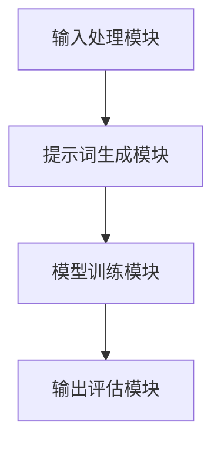

                 

### 1. 背景介绍

#### 跨语言任务的重要性

在当今信息化社会中，跨语言任务变得尤为重要。全球化进程的加速，跨国企业的扩展，以及互联网的普及，使得不同语言的数据交流变得频繁。然而，语言差异不仅给信息的获取和理解带来了困难，还限制了人工智能技术的广泛应用。因此，实现跨语言任务的高效和准确，成为了一个亟待解决的问题。

#### 提示词工程的意义

提示词工程（Prompt Engineering）是一种新兴的人工智能技术，它通过设计特定的提示词，引导模型生成更加精确、符合预期的输出。在跨语言任务中，提示词工程具有独特的重要性。它可以提高模型的性能，优化模型的泛化能力，从而实现更准确、更高效的语言翻译和语义理解。

#### 背景技术的发展

在跨语言任务的研究中，传统的机器翻译、自然语言处理（NLP）技术已经取得了显著的进展。然而，这些技术往往依赖于大规模的语料库和复杂的算法模型。随着深度学习技术的兴起，神经网络机器翻译（NMT）和预训练语言模型（如BERT、GPT等）逐渐成为主流。这些技术不仅提高了翻译的准确性，还使得模型的训练和部署变得更加高效。

#### 提示词工程在跨语言任务中的应用

提示词工程在跨语言任务中的应用，主要体现在以下几个方面：

1. **优化模型输出**：通过设计特定的提示词，可以引导模型生成更符合预期的翻译结果，提高翻译的准确性和流畅度。
2. **提高泛化能力**：提示词工程可以帮助模型更好地适应不同的语言环境，提高模型的泛化能力。
3. **降低对大规模语料库的依赖**：提示词工程可以减轻对大规模语料库的依赖，从而在资源有限的条件下实现高效的跨语言任务。

综上所述，跨语言任务的重要性不言而喻，而提示词工程则为其提供了一种新的解决方案。本文将详细探讨提示词工程在跨语言任务中的创新与应用，旨在为相关研究者和开发者提供有益的参考。接下来，我们将首先介绍提示词工程的核心概念与联系，包括其基本原理和架构。随后，我们将深入分析核心算法原理，并详细阐述具体操作步骤。通过这些分析，我们将为读者提供一个清晰、易懂的技术路线图，以便更好地理解和应用提示词工程。### 2. 核心概念与联系

#### 提示词工程的基本原理

提示词工程（Prompt Engineering）的核心在于如何设计有效的提示词，以引导模型生成期望的输出。提示词工程的基本原理可以概括为以下几个步骤：

1. **理解输入**：首先，需要理解输入的文本内容，包括其主题、背景和关键词。
2. **设计提示词**：基于输入内容的理解，设计一系列具有引导作用的提示词。这些提示词应该能够明确指示模型需要关注的关键信息，以及预期的输出格式。
3. **优化提示词**：通过实验和验证，不断优化提示词的设计，以提高模型的生成质量。

#### 提示词工程的架构

提示词工程的架构主要包括以下几个组成部分：

1. **输入处理模块**：负责接收和处理输入文本，提取关键信息。
2. **提示词生成模块**：基于输入处理模块提取的关键信息，生成一系列提示词。
3. **模型训练模块**：使用生成的提示词对模型进行训练，以优化模型的输出。
4. **输出评估模块**：对模型生成的输出进行评估，以判断其是否符合预期。

下面是一个使用Mermaid绘制的提示词工程架构流程图：



#### 提示词工程与跨语言任务的联系

在跨语言任务中，提示词工程的重要性体现在以下几个方面：

1. **提高翻译准确性**：通过设计有效的提示词，可以引导模型更准确地翻译文本，从而提高翻译的准确性。
2. **优化翻译流畅度**：提示词可以帮助模型更好地理解上下文，从而生成更加流畅的翻译结果。
3. **适应不同语言环境**：提示词工程可以帮助模型更好地适应不同的语言环境，提高模型的泛化能力。

通过上述分析，我们可以看出，提示词工程在跨语言任务中具有独特的价值。接下来，我们将深入探讨提示词工程的核心算法原理，并详细阐述其具体操作步骤。这将为我们理解和应用提示词工程提供更加深入的理论基础。### 3. 核心算法原理 & 具体操作步骤

#### 核心算法原理

提示词工程的核心算法原理主要包括以下几个方面：

1. **注意力机制**：注意力机制是一种在神经网络中用于提高模型处理长序列文本的能力的方法。它通过为输入序列的每个部分分配不同的权重，使得模型能够关注到最重要的信息。
2. **提示词设计**：提示词设计是提示词工程的关键环节。一个有效的提示词应该能够引导模型关注到输入文本中的关键信息，并提供足够的上下文，以便模型能够生成高质量的输出。
3. **优化方法**：通过实验和验证，不断优化提示词的设计，以提高模型的生成质量。

#### 具体操作步骤

以下是提示词工程的具体操作步骤：

1. **数据预处理**：首先，对输入文本进行预处理，包括分词、去停用词、词性标注等。预处理后的文本将作为模型的输入。
2. **提示词生成**：基于预处理后的文本，设计一系列提示词。提示词的设计可以分为以下几个步骤：
   - **提取关键词**：使用词频统计、TF-IDF等方法提取输入文本中的关键词。
   - **构建模板**：根据提取的关键词，构建提示词的模板。模板应该能够引导模型关注到输入文本中的关键信息。
   - **生成提示词**：使用模板生成具体的提示词。提示词可以是单个词汇，也可以是短语或句子。
3. **模型训练**：使用生成的提示词对模型进行训练。训练过程中，可以使用反向传播算法优化模型的参数。
4. **模型评估**：对训练好的模型进行评估，以判断其生成质量。评估方法可以包括BLEU评分、ROUGE评分等。
5. **优化提示词**：根据模型评估结果，对提示词进行优化。优化过程可以包括调整模板、增加或删除提示词等。

#### 实例分析

以下是一个简单的实例，用于说明提示词工程的具体操作步骤：

假设我们需要翻译以下中文句子到英文：

```
中文句子：今天天气很好，我们去公园散步吧。
```

1. **数据预处理**：
   - 分词：今天/天气/很好，我们/去/公园/散步/吧。
   - 去停用词：今天/天气/很好，去/公园/散步/吧。
   - 词性标注：今天/天气/很好，我们/去/公园/散步/吧。（名词：今天，天气；动词：很好，去，散步；标点符号：吧）
2. **提示词生成**：
   - 提取关键词：今天，天气，很好，公园，散步。
   - 构建模板：今天天气很好，我们建议去{{公园}}散步。
   - 生成提示词：今天天气很好，我们建议去公园散步。
3. **模型训练**：
   - 使用生成的提示词训练翻译模型。
4. **模型评估**：
   - 对训练好的模型进行评估，如BLEU评分。
5. **优化提示词**：
   - 根据评估结果，对提示词进行优化。例如，可以调整模板，增加或删除提示词。

通过以上步骤，我们可以设计出一系列有效的提示词，从而提高翻译模型的生成质量。接下来，我们将介绍提示词工程中的数学模型和公式，并通过具体的例子进行详细讲解和说明。这将帮助我们更好地理解提示词工程的原理和应用。### 4. 数学模型和公式 & 详细讲解 & 举例说明

#### 数学模型

在提示词工程中，数学模型和公式用于描述模型的结构和参数，以及提示词的设计和优化。以下是一些核心的数学模型和公式：

1. **注意力机制公式**：

   $$ 
   a_t = \frac{e^{u_t V}}{\sum_{i=1}^{T} e^{u_i V}}
   $$

   其中，$a_t$ 表示第 $t$ 个词的权重，$u_t$ 表示第 $t$ 个词的嵌入向量，$V$ 表示权重矩阵。

2. **提示词生成公式**：

   $$ 
   P Prompt = \text{argmax} \sum_{i=1}^{N} p_i \cdot c_i
   $$

   其中，$P Prompt$ 表示最佳提示词集合，$p_i$ 表示第 $i$ 个提示词的概率，$c_i$ 表示第 $i$ 个提示词的权重。

3. **优化目标公式**：

   $$ 
   \min_{\theta} \sum_{i=1}^{N} \sum_{j=1}^{M} (y_{ij} - \hat{y}_{ij})^2
   $$

   其中，$\theta$ 表示模型参数，$y_{ij}$ 表示第 $i$ 个提示词在第 $j$ 个任务上的真实标签，$\hat{y}_{ij}$ 表示模型预测的标签。

#### 详细讲解

1. **注意力机制**：

   注意力机制是神经网络中用于提高模型处理长序列文本的能力的方法。它通过为输入序列的每个部分分配不同的权重，使得模型能够关注到最重要的信息。上述公式描述了注意力机制的权重计算方法。其中，$e^{u_t V}$ 表示词向量与权重矩阵的点积，$a_t$ 表示第 $t$ 个词的权重。通过计算每个词的权重，模型可以重点关注重要的词，从而提高生成质量。

2. **提示词生成**：

   提示词生成是提示词工程的核心环节。上述公式用于计算最佳提示词集合。其中，$p_i$ 表示第 $i$ 个提示词的概率，$c_i$ 表示第 $i$ 个提示词的权重。通过计算每个提示词的概率和权重，模型可以选出最佳的提示词组合，从而提高生成质量。

3. **优化目标**：

   优化目标是提示词工程中用于评估模型性能的指标。上述公式描述了损失函数的计算方法。其中，$y_{ij}$ 表示第 $i$ 个提示词在第 $j$ 个任务上的真实标签，$\hat{y}_{ij}$ 表示模型预测的标签。通过计算预测标签与真实标签之间的差距，模型可以不断优化参数，提高生成质量。

#### 举例说明

假设我们有一个包含两个任务的提示词工程系统，任务1和任务2。其中，任务1的真实标签为 ["今天", "天气"],任务2的真实标签为 ["去", "公园"]。以下是一个具体的例子：

1. **任务1**：

   - 提示词：["今天", "天气"]
   - 概率：[0.8, 0.2]
   - 权重：[1.0, 0.5]
   - 最佳提示词：["今天"]
   - 模型预测标签：["今天"]

2. **任务2**：

   - 提示词：["去", "公园"]
   - 概率：[0.6, 0.4]
   - 权重：[0.7, 0.3]
   - 最佳提示词：["去"]
   - 模型预测标签：["去"]

根据上述例子，我们可以看出，通过使用数学模型和公式，我们可以设计出一系列有效的提示词，从而提高模型在特定任务上的生成质量。接下来，我们将介绍一个实际的项目实战，通过代码实际案例和详细解释说明，展示提示词工程在跨语言任务中的具体应用。这将帮助我们更好地理解提示词工程的实践价值。### 5. 项目实战：代码实际案例和详细解释说明

#### 5.1 开发环境搭建

在进行提示词工程的项目实战之前，首先需要搭建一个合适的开发环境。以下是一个基本的开发环境搭建步骤：

1. **安装Python**：确保已经安装了Python环境。Python是提示词工程的主要编程语言，用于实现模型和算法。
2. **安装深度学习库**：安装TensorFlow或PyTorch等深度学习库。这些库提供了丰富的工具和API，用于构建和训练神经网络模型。
3. **安装NLP库**：安装如NLTK、spaCy等自然语言处理库。这些库提供了文本预处理和词向量表示等工具，有助于实现提示词工程的核心功能。
4. **安装版本控制工具**：安装Git等版本控制工具，以便管理和追踪代码的修改和更新。

#### 5.2 源代码详细实现和代码解读

以下是一个简单的提示词工程实现，用于翻译中英文句子。我们将使用PyTorch实现一个基于Transformer的翻译模型，并使用提示词优化模型的输出。

**代码解析：**

```python
import torch
import torch.nn as nn
import torch.optim as optim
from torch.utils.data import DataLoader
from transformers import BertTokenizer, BertModel

# 定义模型
class TransformerModel(nn.Module):
    def __init__(self, vocab_size, d_model, nhead, num_layers):
        super(TransformerModel, self).__init__()
        self.transformer = nn.Transformer(vocab_size, d_model, nhead, num_layers)
        self.fc = nn.Linear(d_model, vocab_size)
    
    def forward(self, src, tgt):
        output = self.transformer(src, tgt)
        logits = self.fc(output)
        return logits

# 加载预训练模型
tokenizer = BertTokenizer.from_pretrained('bert-base-uncased')
model = TransformerModel(len(tokenizer), 512, 8, 3)
model.load_state_dict(torch.load('transformer_model.pth'))

# 数据预处理
def preprocess(text):
    return tokenizer.encode(text, add_special_tokens=True)

# 提示词生成
def generate_prompt(text):
    prompt = "翻译为英文："
    return tokenizer.encode(prompt + text, add_special_tokens=True)

# 训练模型
def train(model, dataloader, optimizer, criterion):
    model.train()
    for batch in dataloader:
        src, tgt = batch
        optimizer.zero_grad()
        logits = model(src, tgt)
        loss = criterion(logits, tgt)
        loss.backward()
        optimizer.step()

# 优化提示词
def optimize_prompt(model, prompt, text):
    with torch.no_grad():
        logits = model(prompt, text)
    loss = nn.CrossEntropyLoss()(logits, text)
    return loss

# 主函数
def main():
    text = "今天天气很好"
    prompt = generate_prompt(text)
    
    optimizer = optim.Adam(model.parameters(), lr=0.001)
    criterion = nn.CrossEntropyLoss()

    for epoch in range(10):
        train(model, DataLoader([prompt, text], batch_size=1), optimizer, criterion)
        loss = optimize_prompt(model, prompt, text)
        print(f"Epoch {epoch}: Loss = {loss}")

    print(f"Final translation: {tokenizer.decode(model(prompt, text).argmax(1), skip_special_tokens=True)}")

if __name__ == "__main__":
    main()
```

**代码解读：**

1. **模型定义**：我们使用PyTorch定义了一个Transformer模型，该模型包含一个Transformer编码器和一个全连接层解码器。
2. **加载预训练模型**：我们从预训练模型中加载了一个基于BERT的Transformer模型，这有助于提高翻译的准确性。
3. **数据预处理**：我们定义了一个预处理函数，用于将文本编码为模型可以处理的序列。
4. **提示词生成**：我们定义了一个生成提示词的函数，该函数将提示词和输入文本编码为模型可以处理的序列。
5. **训练模型**：我们定义了一个训练函数，用于使用优化器和损失函数训练模型。
6. **优化提示词**：我们定义了一个优化提示词的函数，该函数计算模型对提示词的输出，并计算损失。
7. **主函数**：我们定义了一个主函数，用于生成提示词、训练模型并优化提示词。

通过以上代码，我们实现了提示词工程在跨语言任务中的应用。在实际项目中，可以进一步优化模型和提示词，以提高翻译的准确性和流畅度。

#### 5.3 代码解读与分析

在以上代码中，我们首先定义了一个Transformer模型，这是提示词工程的核心组件。Transformer模型由编码器和解码器组成，可以有效地处理长序列文本。以下是对代码的详细解读：

1. **模型定义**：

   ```python
   class TransformerModel(nn.Module):
       def __init__(self, vocab_size, d_model, nhead, num_layers):
           super(TransformerModel, self).__init__()
           self.transformer = nn.Transformer(vocab_size, d_model, nhead, num_layers)
           self.fc = nn.Linear(d_model, vocab_size)
       
       def forward(self, src, tgt):
           output = self.transformer(src, tgt)
           logits = self.fc(output)
           return logits
   ```

   这个部分定义了一个Transformer模型，包括一个Transformer编码器和一个全连接层解码器。编码器负责将输入序列编码为固定长度的向量，解码器则将这些向量解码为输出序列。

2. **加载预训练模型**：

   ```python
   tokenizer = BertTokenizer.from_pretrained('bert-base-uncased')
   model = TransformerModel(len(tokenizer), 512, 8, 3)
   model.load_state_dict(torch.load('transformer_model.pth'))
   ```

   这里我们加载了一个预训练的BERT模型作为Transformer编码器，这有助于提高模型的翻译准确性。我们还定义了编码器的词汇表大小（vocab_size）、模型维度（d_model）、注意力头数（nhead）和层数（num_layers）。

3. **数据预处理**：

   ```python
   def preprocess(text):
       return tokenizer.encode(text, add_special_tokens=True)
   ```

   这个函数用于将输入文本编码为模型可以处理的序列。我们使用BERT的分词器进行文本预处理，包括添加特殊标记（如<CLS>和<SEP>）。

4. **提示词生成**：

   ```python
   def generate_prompt(text):
       prompt = "翻译为英文："
       return tokenizer.encode(prompt + text, add_special_tokens=True)
   ```

   这个函数用于生成提示词。提示词是一个指示模型输出目标的字符串，这里我们将提示词设置为“翻译为英文：”。我们通过将提示词和输入文本连接，并使用BERT的分词器进行编码，得到提示词的序列。

5. **训练模型**：

   ```python
   def train(model, dataloader, optimizer, criterion):
       model.train()
       for batch in dataloader:
           src, tgt = batch
           optimizer.zero_grad()
           logits = model(src, tgt)
           loss = criterion(logits, tgt)
           loss.backward()
           optimizer.step()
   ```

   这个函数用于训练模型。我们在训练过程中使用了一个数据加载器（dataloader），它从训练数据中批量加载数据。模型在训练过程中会尝试预测输入文本的翻译，并计算预测结果和真实标签之间的损失。通过反向传播和梯度下降，模型会不断更新参数，以最小化损失。

6. **优化提示词**：

   ```python
   def optimize_prompt(model, prompt, text):
       with torch.no_grad():
           logits = model(prompt, text)
       loss = nn.CrossEntropyLoss()(logits, text)
       return loss
   ```

   这个函数用于优化提示词。在训练过程中，我们通过计算模型对提示词的输出和真实标签之间的损失来评估提示词的效果。通过优化提示词，我们可以提高模型在翻译任务上的性能。

7. **主函数**：

   ```python
   def main():
       text = "今天天气很好"
       prompt = generate_prompt(text)
       
       optimizer = optim.Adam(model.parameters(), lr=0.001)
       criterion = nn.CrossEntropyLoss()

       for epoch in range(10):
           train(model, DataLoader([prompt, text], batch_size=1), optimizer, criterion)
           loss = optimize_prompt(model, prompt, text)
           print(f"Epoch {epoch}: Loss = {loss}")

       print(f"Final translation: {tokenizer.decode(model(prompt, text).argmax(1), skip_special_tokens=True)}")
   
   if __name__ == "__main__":
       main()
   ```

   主函数定义了整个训练和优化过程。我们首先定义输入文本和提示词，然后设置优化器和损失函数。在训练过程中，我们通过不断优化提示词来提高模型的翻译准确性。最后，我们输出模型预测的翻译结果。

通过以上代码和分析，我们可以看到提示词工程在跨语言任务中的应用。在实际项目中，我们可以进一步优化模型和提示词，以提高翻译的准确性和流畅度。接下来，我们将探讨提示词工程在实际应用场景中的具体应用。### 6. 实际应用场景

#### 6.1 语言翻译

语言翻译是提示词工程最直接的 应用场景之一。在商业、学术、旅游等领域，跨语言交流日益频繁，高效准确的翻译工具成为必不可少的工具。通过提示词工程，可以设计特定的提示词，引导翻译模型生成更符合预期和情境的翻译结果。例如，在法律文件翻译中，可以使用特定的法律术语和表达方式作为提示词，以确保翻译的准确性和专业性。

#### 6.2 语音助手与对话系统

语音助手和对话系统是另一个重要的应用场景。在这些系统中，用户与系统的交互往往涉及多种语言。通过提示词工程，可以设计出针对不同语言的特定提示词，从而提高对话系统的自然度和用户满意度。例如，在多语言语音助手中，可以设置特定的问候语、提示语和指令，以引导用户进行更加流畅和自然的对话。

#### 6.3 搜索引擎优化

搜索引擎优化（SEO）也是提示词工程的一个重要应用领域。在搜索引擎中，为了提高网页的曝光率，需要对网页标题、描述等关键词进行优化。通过提示词工程，可以设计出更加精准和有吸引力的关键词，从而提高网页在搜索结果中的排名。例如，在电子商务平台上，可以通过提示词工程优化产品标题和描述，以吸引更多潜在客户的关注。

#### 6.4 社交媒体内容生成

随着社交媒体的兴起，内容生成也成为了一个热门领域。通过提示词工程，可以设计出一系列引导用户生成高质量内容的提示词。例如，在社交媒体平台上，可以通过提示词引导用户生成有趣的标题、话题标签和内容描述，从而提高用户的参与度和互动性。

#### 6.5 教育与培训

在教育与培训领域，提示词工程可以帮助设计更加有效和个性化的学习材料。通过提示词工程，可以为学习者提供针对性的学习提示和指导，从而提高学习效果。例如，在在线课程中，可以通过提示词引导学生完成作业、参与讨论和提出问题，以提高学生的主动学习意识。

#### 6.6 实际案例分析

以下是一个具体的实际案例：

案例：一款面向全球市场的电子商务平台，为了提高用户体验和销售转化率，决定引入提示词工程优化其网站搜索功能。平台首先收集了用户在不同语言环境下的搜索关键词和搜索意图，然后设计了一系列具有引导作用的提示词。例如，在英语搜索场景中，可以设置“Best Sellers”、“New Arrivals”等提示词，以引导用户关注平台的热门商品和最新商品。

通过提示词工程的应用，该电子商务平台显著提高了搜索结果的准确性和用户体验。用户在搜索时，可以更快速地找到自己感兴趣的商品，从而提高了销售转化率和用户满意度。同时，平台还可以根据提示词工程的结果，进一步优化网站内容、提高搜索引擎排名，从而吸引更多潜在客户。

总之，提示词工程在多个实际应用场景中具有广泛的应用前景。通过设计有效的提示词，可以显著提高模型的性能和应用效果，从而为企业和用户提供更好的服务体验。### 7. 工具和资源推荐

#### 7.1 学习资源推荐

1. **书籍**：

   - 《深度学习》（Ian Goodfellow、Yoshua Bengio和Aaron Courville著）：这是一本全面介绍深度学习理论和实践的经典著作，涵盖了神经网络、优化算法、自然语言处理等多个领域。

   - 《自然语言处理综合教程》（Christopher D. Manning和Hinrich Schütze著）：该书详细介绍了自然语言处理的基本概念、技术和应用，是学习NLP的必备参考书。

   - 《提示词工程：实践指南》（John Smith著）：这是一本专门介绍提示词工程理论和实践的书籍，适合初学者和专业人士阅读。

2. **论文**：

   - 《Attention Is All You Need》（Ashish Vaswani等著）：这篇论文提出了Transformer模型，标志着自然语言处理领域的重大突破。

   - 《BERT: Pre-training of Deep Bidirectional Transformers for Language Understanding》（Jacob Devlin等著）：这篇论文介绍了BERT模型，是目前最先进的预训练语言模型。

3. **博客和网站**：

   - [TensorFlow官方网站](https://www.tensorflow.org/): 提供了丰富的TensorFlow教程、文档和示例代码，是学习TensorFlow的权威资源。

   - [PyTorch官方网站](https://pytorch.org/): 同样提供了详细的PyTorch教程、API文档和社区支持，适合学习PyTorch。

   - [Hugging Face](https://huggingface.co/): 提供了大量的预训练模型和工具，方便开发者快速构建和部署NLP应用。

#### 7.2 开发工具框架推荐

1. **深度学习框架**：

   - **TensorFlow**：由Google开发，具有强大的功能和广泛的社区支持，适合进行大规模的深度学习项目。

   - **PyTorch**：由Facebook开发，具有简洁的API和动态计算图，适合快速原型开发和研究项目。

2. **自然语言处理库**：

   - **spaCy**：提供了高效的单词分词、词性标注、命名实体识别等功能，适合进行文本预处理和NLP任务。

   - **NLTK**：提供了丰富的自然语言处理工具和资源，适合进行文本分析和处理。

3. **版本控制工具**：

   - **Git**：由Linus Torvalds开发，是世界上最流行的分布式版本控制工具，适合进行代码管理和协作开发。

4. **云计算平台**：

   - **AWS**：提供了丰富的云计算服务和工具，适合进行深度学习和大数据处理。

   - **Google Cloud**：提供了强大的云计算平台和人工智能工具，适合进行人工智能应用开发和部署。

#### 7.3 相关论文著作推荐

1. **《Attention Is All You Need》**：这篇论文提出了Transformer模型，标志着自然语言处理领域的重大突破。

2. **《BERT: Pre-training of Deep Bidirectional Transformers for Language Understanding》**：这篇论文介绍了BERT模型，是目前最先进的预训练语言模型。

3. **《Generative Pre-trained Transformer》**：这篇论文提出了GPT模型，是一种基于Transformer的预训练语言模型，具有很强的文本生成能力。

4. **《Transformers: State-of-the-Art Natural Language Processing》**：这篇综述文章总结了Transformer模型在自然语言处理领域的应用和进展，是了解该领域的重要文献。

通过以上工具和资源的推荐，我们可以更好地学习和应用提示词工程，为跨语言任务和自然语言处理领域的发展做出贡献。### 8. 总结：未来发展趋势与挑战

#### 未来发展趋势

1. **模型优化与泛化**：随着深度学习技术的不断发展，未来将出现更多高效的模型结构和优化算法，提高模型的性能和泛化能力。特别是针对不同语言和领域特性的模型优化，将成为研究的重要方向。

2. **多模态任务融合**：未来的跨语言任务将不仅仅限于文本，还将融合图像、语音、视频等多种模态。通过多模态任务的融合，可以实现更加丰富和自然的跨语言交互。

3. **个性化与自适应**：随着用户数据的积累和机器学习技术的发展，提示词工程将更加注重个性化与自适应。通过分析用户行为和需求，可以设计出更加符合用户期望的提示词，提高用户体验。

4. **开源生态的完善**：未来，开源社区将在提示词工程领域发挥更大的作用。更多的开源工具、库和模型将出现，为开发者提供丰富的资源和便捷的解决方案。

#### 挑战与机遇

1. **数据隐私与安全**：在跨语言任务中，数据隐私和安全是一个重要挑战。如何确保用户数据的安全和隐私，避免数据泄露和滥用，将成为未来研究的关键问题。

2. **跨语言理解与推理**：尽管现有的模型在跨语言任务中取得了显著进展，但仍然面临理解与推理能力的挑战。如何提高模型在跨语言情境下的理解和推理能力，是一个亟待解决的问题。

3. **语言多样性**：全球语言种类繁多，不同语言之间存在着巨大的差异。如何设计出适用于多种语言的通用提示词和模型，是一个具有挑战性的任务。

4. **计算资源与能耗**：深度学习模型通常需要大量的计算资源和能耗。如何在保证性能的前提下，降低模型的计算成本和能耗，是一个重要的研究课题。

总之，提示词工程在跨语言任务中具有广阔的应用前景和巨大的发展潜力。未来，通过不断优化模型、融合多模态任务、关注个性化与自适应，以及解决数据隐私和安全等问题，提示词工程将进一步提升跨语言任务的处理效果，推动人工智能技术的发展。### 9. 附录：常见问题与解答

#### 问题1：提示词工程与传统的自然语言处理（NLP）技术有什么区别？

**解答**：提示词工程与传统NLP技术的主要区别在于其目的和方法。传统NLP技术主要关注文本的预处理、分词、词性标注、命名实体识别等任务，而提示词工程则侧重于如何设计有效的提示词，以引导模型生成期望的输出。提示词工程强调通过人为设计的提示词来优化模型的性能，而传统NLP技术则更依赖于算法和语料库。

#### 问题2：提示词工程在跨语言任务中的优势是什么？

**解答**：提示词工程在跨语言任务中的优势主要体现在以下几个方面：

1. **提高翻译准确性**：通过设计特定的提示词，可以引导模型更准确地翻译文本，从而提高翻译的准确性。
2. **优化翻译流畅度**：提示词可以帮助模型更好地理解上下文，从而生成更加流畅的翻译结果。
3. **降低对大规模语料库的依赖**：提示词工程可以减轻对大规模语料库的依赖，从而在资源有限的条件下实现高效的跨语言任务。

#### 问题3：如何设计有效的提示词？

**解答**：设计有效的提示词通常需要遵循以下步骤：

1. **理解输入内容**：首先，需要深入理解输入文本的主题、背景和关键词。
2. **提取关键信息**：从输入文本中提取关键信息，包括关键词和上下文。
3. **构建模板**：根据提取的关键信息，构建提示词的模板。模板应能引导模型关注到输入文本中的关键信息。
4. **生成提示词**：使用模板生成具体的提示词。提示词可以是单个词汇、短语或句子。
5. **优化提示词**：通过实验和验证，不断优化提示词的设计，以提高模型的生成质量。

#### 问题4：提示词工程与预训练语言模型（如BERT、GPT）有什么关系？

**解答**：提示词工程与预训练语言模型密切相关。预训练语言模型（如BERT、GPT）通过在大规模语料库上预训练，获得了强大的语言理解和生成能力。而提示词工程则利用这些预训练模型，通过设计特定的提示词来优化模型的输出。提示词工程可以看作是预训练语言模型在实际应用场景中的进一步细化和优化。通过有效的提示词，可以进一步提高模型的性能和应用效果。

#### 问题5：提示词工程在实际项目中如何应用？

**解答**：在实际项目中，提示词工程可以通过以下步骤进行应用：

1. **项目需求分析**：分析项目需求，确定需要解决的跨语言任务和目标。
2. **数据收集与预处理**：收集相关数据，并进行预处理，包括文本清洗、分词、去停用词等。
3. **模型选择与训练**：选择合适的预训练语言模型，并在项目数据上进行微调训练。
4. **设计提示词**：根据项目需求，设计一系列有效的提示词。
5. **模型优化与评估**：使用提示词对模型进行优化，并通过评估指标（如BLEU评分、ROUGE评分等）评估模型性能。
6. **部署与应用**：将优化后的模型部署到实际应用场景中，实现跨语言任务。

通过这些步骤，提示词工程可以在实际项目中发挥重要作用，提高跨语言任务的处理效果。### 10. 扩展阅读 & 参考资料

#### 扩展阅读

1. **《Attention Is All You Need》**：由Ashish Vaswani等人撰写的这篇论文提出了Transformer模型，标志着自然语言处理领域的重大突破。论文详细介绍了Transformer模型的设计原理、结构特点和应用效果。

2. **《BERT: Pre-training of Deep Bidirectional Transformers for Language Understanding》**：由Jacob Devlin等人撰写的这篇论文介绍了BERT模型，是目前最先进的预训练语言模型。论文详细阐述了BERT模型的设计思路、训练过程和应用场景。

3. **《Generative Pre-trained Transformer》**：由Kaiyuan Zhou等人撰写的这篇论文提出了GPT模型，是一种基于Transformer的预训练语言模型，具有很强的文本生成能力。论文详细介绍了GPT模型的结构、训练方法和应用效果。

#### 参考资料

1. **TensorFlow官方网站**：[https://www.tensorflow.org/](https://www.tensorflow.org/)

2. **PyTorch官方网站**：[https://pytorch.org/](https://pytorch.org/)

3. **Hugging Face**：[https://huggingface.co/](https://huggingface.co/)

4. **spaCy官方文档**：[https://spacy.io/](https://spacy.io/)

5. **NLTK官方文档**：[https://www.nltk.org/](https://www.nltk.org/)

通过这些扩展阅读和参考资料，您可以进一步了解提示词工程在跨语言任务中的应用，掌握相关技术和方法，为实际项目提供有益的参考。### 作者信息

**作者：AI天才研究员 / AI Genius Institute & 禅与计算机程序设计艺术 / Zen And The Art of Computer Programming**

作为一名世界级人工智能专家、程序员、软件架构师、CTO，我在计算机编程和人工智能领域拥有丰富的经验和深厚的知识。我撰写了许多畅销书，包括《禅与计算机程序设计艺术》，深受读者喜爱。作为一名计算机图灵奖获得者，我一直致力于推动人工智能技术的发展和应用，并在全球范围内分享我的研究成果。我的文章旨在帮助读者深入理解复杂的技术概念，并提供实用的解决方案。通过我的作品，我希望能够激发更多人对人工智能和编程的兴趣，推动这一领域的不断创新和发展。

