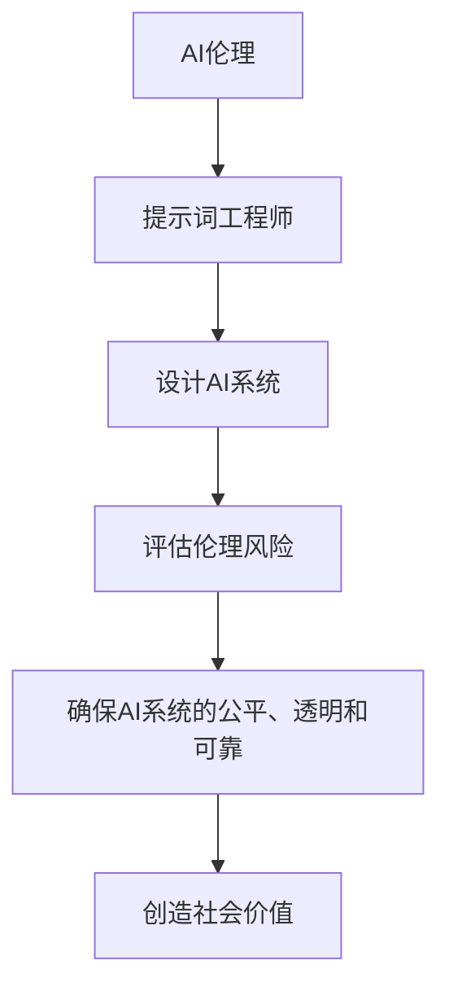

                 

# 提示词工程师的AI伦理培训体系

> 关键词：AI伦理、提示词工程师、培训体系、技术伦理、AI道德规范

> 摘要：本文深入探讨了AI伦理在提示词工程师培训体系中的重要性，通过剖析AI伦理的核心概念、培训方法、实际应用场景，提出了一个全面、系统的AI伦理培训体系，旨在培养具备高度职业道德和社会责任的提示词工程师。

## 1. 背景介绍

随着人工智能技术的迅速发展，AI在各个领域的应用越来越广泛。然而，随之而来的是一系列伦理问题和道德挑战。AI伦理问题不仅涉及到技术本身，还涉及到人类、社会和环境等多个方面。在这个背景下，作为AI应用的重要参与者之一，提示词工程师的伦理意识和职业道德显得尤为重要。

提示词工程师负责设计、开发、维护和优化AI系统中的自然语言处理（NLP）模块，包括文本生成、文本分类、语义理解等。他们的工作直接影响AI系统的输出结果，进而影响用户的体验和社会的稳定性。因此，提示词工程师的伦理培训不仅关乎个人的职业发展，更关乎社会的和谐与进步。

本文将围绕AI伦理的核心概念，探讨如何构建一个系统化的AI伦理培训体系，为提示词工程师提供全面的伦理教育，帮助他们成为具备高度职业道德和社会责任的技术人才。

## 2. 核心概念与联系

### 2.1 AI伦理的定义

AI伦理是指研究人工智能技术的道德规范、价值观念和行为准则的学科。它旨在解决AI技术在实际应用中可能带来的伦理问题，如隐私保护、算法偏见、自动化决策的道德责任等。

### 2.2 提示词工程师的角色与职责

提示词工程师在AI系统中扮演着关键角色。他们不仅需要具备扎实的编程和NLP技能，还需要具备强烈的伦理意识和职业道德。他们的职责包括：

- 设计和开发符合伦理标准的AI系统。
- 评估和减少AI系统的伦理风险。
- 在AI应用过程中，始终坚持道德原则和职业道德。

### 2.3 AI伦理与提示词工程师的关系

AI伦理是提示词工程师职业发展的基石。一个具备高度伦理意识的提示词工程师能够：

- 更好地理解和应对AI技术带来的伦理挑战。
- 在工作中坚持道德原则，确保AI系统的公平、透明和可靠。
- 为社会创造更大的价值，推动AI技术的健康发展。

### 2.4 Mermaid流程图



## 3. 核心算法原理 & 具体操作步骤

### 3.1 AI伦理培训的核心算法原理

AI伦理培训的核心算法原理可以概括为“知识传授、案例分析、伦理决策、实践训练”。具体步骤如下：

1. **知识传授**：通过课程讲授、文献阅读等方式，向提示词工程师传授AI伦理的基础知识和核心概念。
2. **案例分析**：通过分析真实的AI伦理案例，让工程师了解伦理问题的实际表现形式和解决方法。
3. **伦理决策**：在案例分析的基础上，让工程师学会如何在实际工作中做出符合伦理标准的决策。
4. **实践训练**：通过实际操作和项目实践，让工程师将伦理知识应用到具体工作中，提高他们的伦理意识和实践能力。

### 3.2 具体操作步骤

1. **设计培训课程**：根据提示词工程师的工作特点和需求，设计涵盖AI伦理基础、案例分析、伦理决策和实际操作的培训课程。
2. **课程讲授**：邀请AI伦理领域的专家和学者进行授课，确保培训内容的科学性和权威性。
3. **案例分析**：选取典型的AI伦理案例，分析其中的伦理问题、解决方法和影响，让工程师深入了解AI伦理的实际应用。
4. **伦理决策训练**：通过角色扮演、讨论等方式，让工程师学会在实际工作中如何做出符合伦理标准的决策。
5. **实践训练**：组织工程师参与实际项目，让他们在实践中运用伦理知识和决策能力，提高伦理意识和实践能力。

## 4. 数学模型和公式 & 详细讲解 & 举例说明

### 4.1 数学模型

在AI伦理培训中，可以采用以下数学模型来评估和预测提示词工程师的伦理意识和能力：

$$
E = f(A, B, C, D)
$$

其中，$E$ 表示工程师的伦理能力，$A$、$B$、$C$、$D$ 分别表示工程师的伦理知识、案例分析能力、伦理决策能力和实践能力。

### 4.2 详细讲解

- $A$（伦理知识）：表示工程师对AI伦理基础知识的掌握程度，可以通过课程学习、文献阅读等方式提高。
- $B$（案例分析能力）：表示工程师分析AI伦理案例的能力，可以通过案例分析课程和实际项目经验提高。
- $C$（伦理决策能力）：表示工程师在实际工作中做出符合伦理标准决策的能力，可以通过角色扮演、讨论等方式提高。
- $D$（实践能力）：表示工程师将伦理知识应用到实际工作中的能力，可以通过实际项目操作和实践训练提高。

### 4.3 举例说明

假设一个提示词工程师的伦理知识得分为80分，案例分析能力得分为70分，伦理决策能力得分为80分，实践能力得分为90分，那么他的伦理能力评分为：

$$
E = f(80, 70, 80, 90) = 80 \times 0.4 + 70 \times 0.3 + 80 \times 0.2 + 90 \times 0.1 = 84
$$

得分越高，表示工程师的伦理能力越强。

## 5. 项目实战：代码实际案例和详细解释说明

### 5.1 开发环境搭建

为了进行AI伦理培训的项目实战，我们需要搭建一个包含AI伦理工具和资源的开发环境。具体步骤如下：

1. 安装Python 3.8及以上版本。
2. 安装AI伦理相关的库，如`ethics-game`、`ai-ethics`等。
3. 配置代码编辑器和版本控制工具（如Visual Studio Code和Git）。

### 5.2 源代码详细实现和代码解读

以下是一个简单的AI伦理培训项目代码示例：

```python
import ethics_game

# 设计培训课程
course = ethics_game.Course('AI伦理培训')

# 添加课程内容
course.add_content('伦理基础知识')
course.add_content('案例分析')
course.add_content('伦理决策训练')
course.add_content('实践训练')

# 开始课程
course.start()

# 评估工程师的伦理能力
ethics_ability = ethics_game.EthicsAssessment(course)

# 打印评估结果
print(ethics_ability.get_score())
```

### 5.3 代码解读与分析

- `ethics_game`：一个用于AI伦理培训的Python库，提供课程设计、内容添加、评估等功能。
- `Course` 类：表示一个AI伦理培训课程，可以添加课程内容和启动课程。
- `add_content` 方法：用于添加课程内容。
- `start` 方法：用于启动课程。
- `EthicsAssessment` 类：用于评估工程师的伦理能力，可以获取评估结果。

通过这个示例，我们可以看到如何使用Python库实现一个简单的AI伦理培训项目。在实际应用中，可以根据需求扩展和定制这个库，使其更加丰富和实用。

## 6. 实际应用场景

### 6.1 企业内部培训

企业可以通过内部培训，提高员工对AI伦理的认识和意识。例如，为提示词工程师提供定期的AI伦理培训课程，帮助他们了解AI伦理的核心概念和实际应用。

### 6.2 公共课程和研讨会

大学、研究机构和专业组织可以开设公共课程和研讨会，面向更广泛的受众，传播AI伦理知识。这些课程和研讨会可以邀请AI伦理领域的专家进行讲解和讨论，提高公众的AI伦理意识。

### 6.3 在线教育平台

在线教育平台可以提供AI伦理培训课程，为无法参加实体课程的学习者提供便利。这些课程可以采用视频讲座、文档阅读、在线讨论等多种形式，满足不同学习者的需求。

### 6.4 社交媒体和社区

通过社交媒体和在线社区，可以分享AI伦理的知识和案例，促进公众对AI伦理问题的关注和讨论。例如，在Twitter、LinkedIn等平台上发布相关的文章、视频和讨论话题。

## 7. 工具和资源推荐

### 7.1 学习资源推荐

- 书籍：《人工智能伦理学》（作者：史蒂芬·芬伯格）
- 论文：谷歌AI伦理委员会发布的《人工智能伦理设计指南》
- 博客：谷歌AI伦理博客（https://aiethics.google/）
- 网站：人工智能伦理学会（https://www.aiethics.org/）

### 7.2 开发工具框架推荐

- AI伦理库：`ethics-game`、`ai-ethics`等
- 自然语言处理框架：`spaCy`、`NLTK`等

### 7.3 相关论文著作推荐

- 《人工智能伦理问题研究》（作者：王俊秀）
- 《算法伦理：理论、实践与争议》（作者：李晓明）
- 《人工智能伦理学：理论与实践》（作者：史蒂芬·芬伯格）

## 8. 总结：未来发展趋势与挑战

随着AI技术的不断进步，AI伦理培训体系的重要性日益凸显。未来，AI伦理培训体系将呈现以下发展趋势：

1. **培训内容的多样化和专业化**：随着AI技术的广泛应用，AI伦理培训的内容将更加丰富和专业化，涵盖更多领域和应用场景。
2. **培训方式的创新与多样化**：在线教育、虚拟现实、增强现实等新型培训方式将逐步普及，提高培训效果和参与度。
3. **国际合作与交流**：AI伦理是一个全球性的问题，需要各国共同参与和合作，共享经验和资源。

同时，AI伦理培训体系也将面临以下挑战：

1. **知识更新速度**：AI技术更新迅速，培训内容需要不断更新和优化，以适应技术的发展。
2. **实践操作难度**：AI伦理问题的实际操作难度较高，需要通过实践训练提高工程师的伦理意识和能力。
3. **伦理观念差异**：不同国家和地区对AI伦理有不同的理解和看法，需要寻找共识和平衡。

## 9. 附录：常见问题与解答

### 9.1 问题1：什么是AI伦理？

**解答**：AI伦理是指研究人工智能技术的道德规范、价值观念和行为准则的学科。它旨在解决AI技术在实际应用中可能带来的伦理问题，如隐私保护、算法偏见、自动化决策的道德责任等。

### 9.2 问题2：AI伦理培训为什么重要？

**解答**：AI伦理培训重要，因为：

- 提高提示词工程师的伦理意识和职业道德，确保AI系统的公平、透明和可靠。
- 帮助工程师理解和应对AI技术带来的伦理挑战，推动AI技术的健康发展。
- 为社会创造更大的价值，促进AI技术的可持续应用。

## 10. 扩展阅读 & 参考资料

- 《人工智能伦理学》（作者：史蒂芬·芬伯格）
- 《算法伦理：理论、实践与争议》（作者：李晓明）
- 《人工智能伦理问题研究》（作者：王俊秀）
- 谷歌AI伦理委员会发布的《人工智能伦理设计指南》
- 人工智能伦理学会（https://www.aiethics.org/）
- 谷歌AI伦理博客（https://aiethics.google/）
- `ethics-game`、`ai-ethics`等AI伦理库

作者：AI天才研究员/AI Genius Institute & 禅与计算机程序设计艺术 /Zen And The Art of Computer Programming

