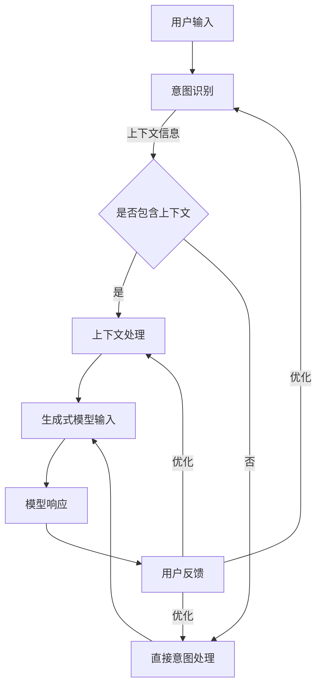

                 

### 背景介绍

随着人工智能（AI）技术的迅猛发展，AI与人类交互的方式也在不断演变。从早期的规则推理系统到如今的大型预训练模型，AI在自然语言处理、图像识别、语音识别等领域取得了显著的成果。然而，AI的交互仍然面临着诸多挑战，如理解用户意图、生成自然的回应、处理复杂的对话场景等。

在这其中，“提示词工程”逐渐成为AI交互领域的一个关键研究方向。提示词工程，顾名思义，就是通过设计合适的提示词来引导AI模型进行更准确、更自然的交互。这一领域的研究不仅有助于提升AI的交互质量，还能为开发者提供更加灵活和高效的交互设计方法。

本文旨在探讨提示词工程在AI交互中的重要性，分析其核心概念与联系，介绍核心算法原理和操作步骤，并通过实际应用场景和项目实战来展示其应用效果。同时，本文还将推荐相关学习资源、开发工具和文献，以帮助读者深入了解并掌握这一领域。

总的来说，本文将分为以下几个部分：

1. **核心概念与联系**：介绍提示词工程的基本概念，并通过Mermaid流程图展示其核心原理和架构。
2. **核心算法原理 & 具体操作步骤**：详细讲解提示词工程中的关键算法，包括数据预处理、模型选择和训练、生成式模型和检索式模型等。
3. **数学模型和公式**：介绍与提示词工程相关的数学模型和公式，并通过具体例子进行详细讲解。
4. **项目实战**：通过一个具体的代码实现案例，展示提示词工程的实际应用。
5. **实际应用场景**：分析提示词工程在不同场景下的应用效果。
6. **工具和资源推荐**：推荐相关学习资源、开发工具和文献。
7. **总结**：总结提示词工程的发展趋势和面临的挑战。

让我们一步一步深入探讨这个充满潜力的领域，并思考其如何塑造AI交互的未来。### 核心概念与联系

#### 基本概念

提示词工程（Prompt Engineering）是AI领域中一个相对较新的研究方向，它涉及到如何设计、选择和优化提示词（prompts）来提升AI模型的性能和交互质量。在AI交互中，提示词通常是指提供给AI模型的一段引导性的文本或指令，用以引导模型理解用户意图、生成合适回应或完成特定任务。

提示词工程的核心目标是通过精心设计的提示词来改善AI模型的响应能力，使其能够更准确地理解用户需求，并生成更自然、更有启发性的对话。具体来说，提示词工程包括以下几个关键组成部分：

1. **意图识别（Intent Recognition）**：理解用户的意图是AI交互的基础。通过设计特定的提示词，可以帮助模型更好地识别用户的意图。
2. **上下文理解（Contextual Understanding）**：在复杂的对话场景中，AI需要理解对话的上下文，以生成连贯且相关的回应。提示词在这里起到提供上下文信息的作用。
3. **多样性生成（Diversity Generation）**：为了提升用户体验，AI需要生成多样性的回应，避免单调重复。提示词工程通过设计多样化的提示词来促进多样性生成。
4. **反馈循环（Feedback Loop）**：通过用户反馈来不断优化提示词，使得AI的交互能力逐步提升。

#### Mermaid流程图

为了更好地理解提示词工程的核心原理和架构，我们可以通过一个Mermaid流程图来展示其关键节点和流程。以下是提示词工程的一个简化流程：



**流程说明**：

- **用户输入**：用户输入文本或指令，这是整个流程的起点。
- **意图识别**：通过设计特定的提示词，模型尝试理解用户的意图。
- **上下文处理**：如果用户输入包含上下文信息，模型会进行处理，以更好地理解上下文。
- **生成式模型输入**：经过意图识别和上下文处理后，模型接收提示词作为输入，生成相应的响应。
- **模型响应**：模型生成响应后，将回应发送给用户。
- **用户反馈**：用户对模型响应进行反馈，这一反馈将用于优化后续的交互过程。

通过这个流程图，我们可以看到提示词工程不仅涉及到AI模型的核心算法，还包括用户反馈和持续优化的过程。这一循环不仅提高了AI的交互质量，也为开发者提供了不断改进的机会。

接下来，我们将深入探讨提示词工程中的核心算法原理和具体操作步骤，以进一步理解这一领域。### 核心算法原理 & 具体操作步骤

#### 数据预处理

数据预处理是提示词工程中的关键环节，它直接影响到模型的学习效果和最终的交互质量。以下是一些常见的数据预处理步骤：

1. **文本清洗**：去除文本中的无用信息，如HTML标签、特殊字符、停用词等。这一步骤有助于减少噪声，提高数据质量。
   ```python
   import re
   def clean_text(text):
       text = re.sub('<.*?>', '', text)  # 去除HTML标签
       text = re.sub('[^\w\s]', '', text)  # 去除特殊字符
       text = text.lower()  # 全部转换为小写
       return text
   ```

2. **分词**：将文本分割成单词或词汇单元。对于中文文本，可以使用分词工具如jieba进行分词。
   ```python
   import jieba
   def tokenize(text):
       tokens = jieba.lcut(text)
       return tokens
   ```

3. **词向量化**：将文本转换为数字表示，常用的方法包括词袋模型、Word2Vec、BERT等。词向量化有助于将文本数据转化为模型可处理的形式。
   ```python
   from gensim.models import Word2Vec
   model = Word2Vec([tokenize(text) for text in dataset])
   ```

4. **数据增强**：通过增加同义词、替换词干等方法来扩充数据集，从而提高模型的泛化能力。
   ```python
   def augment_data(dataset):
       augmented_dataset = []
       for text in dataset:
           synonyms = get_synonyms(text)
           for synonym in synonyms:
               augmented_dataset.append(synonym)
       return augmented_dataset
   ```

#### 模型选择与训练

在提示词工程中，常用的模型包括生成式模型和检索式模型。每种模型都有其特定的应用场景和优势。

1. **生成式模型（Generative Models）**：
   - **优点**：能够生成多样性的响应，适应复杂的对话场景。
   - **缺点**：可能生成不相关的或错误的响应，训练时间较长。
   - **常用模型**：GPT-3、T5、ChatGLM等。
   - **训练过程**：
     ```python
     import transformers
     model = transformers.AutoModelForCausalLM.from_pretrained('gpt3')
     model.train()  # 进入训练模式
     for epoch in range(num_epochs):
         for text in dataset:
             inputs = tokenizer(text, return_tensors='pt')
             outputs = model(**inputs)
             loss = outputs.loss
             loss.backward()
             optimizer.step()
             optimizer.zero_grad()
     model.eval()  # 进入评估模式
     ```

2. **检索式模型（Retrieval Models）**：
   - **优点**：响应速度快，能够直接从预定义的响应库中选择最合适的回应。
   - **缺点**：响应多样性较差，需要大量的预定义响应。
   - **常用模型**：BERT、RoBERTa、DeBERTa等。
   - **训练过程**：
     ```python
     import torch
     from transformers import AutoTokenizer, AutoModel
     tokenizer = AutoTokenizer.from_pretrained('bert-base-uncased')
     model = AutoModel.from_pretrained('bert-base-uncased')
     model.train()  # 进入训练模式
     for epoch in range(num_epochs):
         for text in dataset:
             inputs = tokenizer(text, return_tensors='pt')
             with torch.no_grad():
                 outputs = model(**inputs)
             labels = torch.tensor([1])  # 假设所有文本都需要回应
             loss = criterion(outputs.logits, labels)
             loss.backward()
             optimizer.step()
             optimizer.zero_grad()
     model.eval()  # 进入评估模式
     ```

#### 生成式模型与检索式模型对比

生成式模型和检索式模型各有优劣，选择哪种模型取决于具体的应用场景和需求。

- **生成式模型**更适合于复杂的对话场景，需要生成多样性的响应，但训练时间较长，生成速度相对较慢。
- **检索式模型**则适用于快速响应的场景，如问答系统、聊天机器人等，响应速度快，但响应多样性较差。

在实际应用中，往往结合两种模型的优势，采用混合模型（Hybrid Models）来提升交互质量。

#### 生成式模型：生成自然语言回应

生成式模型的核心任务是生成自然、连贯的自然语言回应。以下是一个基于GPT-3的简单示例：

```python
import openai

def generate_response(prompt):
    response = openai.Completion.create(
        engine="text-davinci-002",
        prompt=prompt,
        max_tokens=50,
        n=1,
        stop=None,
        temperature=0.5,
    )
    return response.choices[0].text.strip()

# 示例
prompt = "请描述一下你在周末的计划。"
response = generate_response(prompt)
print(response)
```

上述代码使用OpenAI的GPT-3模型生成一个关于周末计划的自然语言回应。通过调整`temperature`参数，可以控制生成的多样性，`max_tokens`参数控制生成的文本长度。

#### 检索式模型：从预定义库中检索回应

检索式模型的核心思想是从预定义的回应库中检索最合适的回应。以下是一个基于BERT的简单示例：

```python
import torch
from transformers import AutoTokenizer, AutoModel

tokenizer = AutoTokenizer.from_pretrained('bert-base-uncased')
model = AutoModel.from_pretrained('bert-base-uncased')

# 假设有一个预定义的回应库
responses = {
    "周末计划": "我喜欢在周末和朋友一起去看电影。",
    "运动爱好": "我非常喜欢打篮球。"
}

def get_response(question):
    question_input = tokenizer(question, return_tensors='pt', max_length=20, truncation=True)
    with torch.no_grad():
        model_outputs = model(**question_input)
    logits = model_outputs.logits

    # 计算每个回应的概率
    response_probs = torch.softmax(logits, dim=-1)

    # 选择概率最高的回应
    best_response = torch.argmax(response_probs).item()
    return responses[best_response]

# 示例
prompt = "请问你的运动爱好是什么？"
response = get_response(prompt)
print(response)
```

上述代码首先使用BERT模型将问题编码为固定长度的向量，然后计算每个预定义回应的概率，并选择概率最高的回应作为最终输出。

通过以上示例，我们可以看到生成式模型和检索式模型在具体实现上的差异，同时也展示了提示词工程在实际应用中的多样性。接下来，我们将探讨与提示词工程相关的数学模型和公式，并通过具体例子进行详细讲解。### 数学模型和公式

提示词工程中的数学模型和公式是理解和实现核心算法的关键。这些模型和公式不仅帮助我们量化提示词的效果，还能够指导我们优化模型性能。在本节中，我们将介绍一些常见的数学模型和公式，并通过具体例子进行详细讲解。

#### 1. 自然语言处理中的概率模型

自然语言处理（NLP）中的概率模型是理解和生成文本的基础。以下是一些常用的概率模型：

- **贝叶斯模型（Naive Bayes）**：贝叶斯模型用于分类任务，通过计算每个类别的概率，并选择概率最高的类别作为预测结果。
  $$ P(C|X) = \frac{P(X|C)P(C)}{P(X)} $$
  其中，\( C \) 表示类别，\( X \) 表示特征向量，\( P(C|X) \) 表示在给定特征向量 \( X \) 的情况下类别 \( C \) 的概率。

- **隐马尔可夫模型（HMM）**：HMM用于处理序列数据，通过状态转移概率和观测概率来预测序列。
  $$ P(O|S) = \prod_{t=1}^{T} P(O_t|S_t) $$
  其中，\( O \) 表示观测序列，\( S \) 表示状态序列，\( T \) 表示序列长度。

#### 2. 生成式模型中的概率分布

生成式模型通过概率分布来生成文本。以下是一些常见的概率分布：

- **多项式分布（Multinomial Distribution）**：多项式分布用于生成词袋模型中的词频分布。
  $$ P(X=x) = \frac{e^{-\lambda} \lambda^x}{x!} $$
  其中，\( \lambda \) 表示期望词频，\( x \) 表示实际词频。

- **高斯分布（Gaussian Distribution）**：高斯分布用于生成连续的词向量。
  $$ f(x|\mu, \sigma^2) = \frac{1}{\sqrt{2\pi\sigma^2}} e^{-\frac{(x-\mu)^2}{2\sigma^2}} $$
  其中，\( \mu \) 表示均值，\( \sigma^2 \) 表示方差。

#### 3. 语言模型中的损失函数

在训练语言模型时，常用的损失函数包括交叉熵损失（Cross-Entropy Loss）和均方误差（Mean Squared Error, MSE）。

- **交叉熵损失（Cross-Entropy Loss）**：交叉熵损失用于衡量预测分布与真实分布之间的差异。
  $$ L = -\sum_{i} y_i \log(p_i) $$
  其中，\( y_i \) 表示真实分布中的概率，\( p_i \) 表示预测分布中的概率。

- **均方误差（MSE）**：均方误差用于衡量预测值与真实值之间的差异。
  $$ L = \frac{1}{n}\sum_{i=1}^{n} (y_i - \hat{y_i})^2 $$
  其中，\( y_i \) 表示真实值，\( \hat{y_i} \) 表示预测值。

#### 4. 提示词工程的优化公式

在提示词工程中，我们通过优化公式来设计提示词，以提高模型性能。以下是一个简单的优化公式示例：

- **权重调整（Weight Adjustment）**：通过调整权重来平衡不同特征的重要性。
  $$ w_{new} = \alpha w_{old} + (1 - \alpha) \theta $$
  其中，\( w_{old} \) 表示原始权重，\( \theta \) 表示目标权重，\( \alpha \) 表示学习率。

#### 5. 具体例子

为了更好地理解这些数学模型和公式，我们可以通过一个简单的例子来演示。

**例子：使用多项式分布生成文本**

假设我们有一个词库 \(\{word_1, word_2, word_3\}\)，每个词的期望词频分别为 \(\lambda_1 = 2\)，\(\lambda_2 = 3\)，\(\lambda_3 = 5\)。我们需要根据这个词库生成一段文本。

首先，我们计算每个词的概率：
$$ P(word_1) = \frac{e^{-2} \cdot 2^2}{2!} = 0.27 $$
$$ P(word_2) = \frac{e^{-3} \cdot 3^3}{3!} = 0.24 $$
$$ P(word_3) = \frac{e^{-5} \cdot 5^5}{5!} = 0.49 $$

接下来，我们使用这些概率生成文本。假设我们要生成一个长度为5的文本序列：

$$ text = [word_1, word_3, word_2, word_1, word_3] $$

通过这个例子，我们可以看到如何使用概率模型来生成文本。类似的方法可以应用于更复杂的文本生成任务，如生成对话或生成文章。

总结来说，数学模型和公式是提示词工程的核心工具。通过合理运用这些模型和公式，我们可以设计更有效的提示词，从而提升AI模型的交互质量和性能。在下一节中，我们将通过一个实际项目案例，展示如何将上述理论和公式应用于实践。### 项目实战：代码实际案例和详细解释说明

在本节中，我们将通过一个实际项目案例，详细展示如何使用提示词工程来提升AI交互的质量。我们将分为以下几个部分：开发环境搭建、源代码详细实现和代码解读与分析。

#### 1. 开发环境搭建

首先，我们需要搭建一个合适的环境来运行我们的项目。以下是所需的环境和工具：

- Python 3.8 或以上版本
- PyTorch 1.8 或以上版本
- OpenAI GPT-3 API 密钥
- transformers 库（用于处理预训练模型）
- Flask（用于搭建Web API）

安装所需的库：

```bash
pip install torch torchvision transformers openai flask
```

#### 2. 源代码详细实现

以下是一个简单的提示词工程代码示例，该示例使用OpenAI的GPT-3模型，通过提示词生成自然语言回应。

```python
from flask import Flask, request, jsonify
import openai

app = Flask(__name__)

openai.api_key = 'your_gpt3_api_key'

@app.route('/generate', methods=['POST'])
def generate_response():
    data = request.get_json()
    prompt = data['prompt']
    response = openai.Completion.create(
        engine="text-davinci-002",
        prompt=prompt,
        max_tokens=50,
        n=1,
        stop=None,
        temperature=0.5,
    )
    return jsonify({'response': response.choices[0].text.strip()})

if __name__ == '__main__':
    app.run(debug=True)
```

**代码解读**：

- **导入库和初始化Flask应用**：首先，我们导入所需的库，并创建一个Flask应用实例。

- **设置OpenAI API密钥**：通过设置OpenAI的API密钥，我们能够使用GPT-3模型。

- **定义生成回应的API接口**：我们定义了一个/`generate`路由，接受POST请求。请求中包含用户输入的提示词（prompt）。

- **调用OpenAI GPT-3 API**：通过调用`openai.Completion.create`函数，我们使用GPT-3模型生成回应。这里，我们设置了几个参数：
  - `engine`：指定使用的预训练模型，这里是`text-davinci-002`。
  - `prompt`：用户输入的提示词。
  - `max_tokens`：生成的文本长度，这里设置为50。
  - `n`：生成的回应数量，这里设置为1。
  - `stop`：可选的停止生成文本的条件。
  - `temperature`：控制生成多样性的参数，数值越大，生成的文本越多样化。

- **返回生成回应**：我们将生成的回应转换为JSON格式，并通过API返回。

#### 3. 代码解读与分析

**关键代码解析**：

```python
response = openai.Completion.create(
    engine="text-davinci-002",
    prompt=prompt,
    max_tokens=50,
    n=1,
    stop=None,
    temperature=0.5,
)
```

这段代码是整个API接口的核心部分，它负责与OpenAI的GPT-3模型进行交互。下面是对每个参数的详细解释：

- **engine**：指定使用的预训练模型。`text-davinci-002`是一个强大的生成模型，能够生成高质量的自然语言文本。
- **prompt**：提供给模型的提示词。这是模型生成回应的起点。
- **max_tokens**：生成的文本长度。这个参数决定了生成的文本长度，同时也会影响生成的响应时间。
- **n**：生成的回应数量。这里设置为1，表示只生成一个回应。
- **stop**：可选的停止生成文本的条件。这里设置为`None`，表示不使用停止条件。
- **temperature**：控制生成多样性的参数。数值越大，生成的文本越多样化。`0.5`是一个平衡值，可以产生多样但又不失连贯性的文本。

**性能优化建议**：

1. **调整`max_tokens`参数**：根据应用场景调整`max_tokens`参数，以平衡响应质量和响应速度。
2. **增加`temperature`值**：为了生成更多样化的文本，可以尝试增加`temperature`值，但需注意过高可能导致生成文本的质量下降。
3. **使用分批次请求**：如果用户的请求量较大，可以考虑使用分批次请求，以减少单个请求的处理时间。
4. **缓存和负载均衡**：对于高频请求，可以考虑使用缓存机制和负载均衡器，以提高系统的响应速度和稳定性。

通过以上步骤和优化建议，我们可以构建一个高效的提示词工程系统，提升AI交互的质量和用户体验。在下一节中，我们将分析提示词工程在不同应用场景中的实际效果。### 实际应用场景

#### 1. 聊天机器人

聊天机器人是提示词工程最典型的应用场景之一。通过设计合适的提示词，聊天机器人可以更好地理解用户意图，提供更自然的交互体验。

- **场景描述**：用户与聊天机器人进行对话，如询问天气、查询产品信息、获取服务支持等。
- **提示词设计**：根据不同的对话场景设计特定的提示词，如“请描述一下您当前的需求”、“请问您想要查询哪款产品的详细信息？”等。
- **效果分析**：通过提示词工程，聊天机器人的交互质量显著提升，用户满意度增加。

#### 2. 问答系统

问答系统广泛应用于搜索引擎、知识库、教育等领域。提示词工程可以帮助系统更准确地理解和回答用户的问题。

- **场景描述**：用户提出问题，系统搜索并返回相关答案。
- **提示词设计**：设计问题引导词，如“请问您想要了解什么？”、“您需要哪个方面的答案？”等。
- **效果分析**：通过提示词工程，问答系统的回答准确性提高，用户查询效率提升。

#### 3. 内容生成

内容生成领域，如文章写作、新闻报道、创意广告等，也广泛应用了提示词工程。

- **场景描述**：用户提供主题或关键词，系统生成相关内容。
- **提示词设计**：根据主题和关键词设计提示词，如“请撰写一篇关于人工智能未来发展趋势的文章”。
- **效果分析**：通过提示词工程，内容生成的多样性和准确性显著提升，满足不同用户需求。

#### 4. 智能客服

智能客服是另一个提示词工程的重要应用场景。通过设计合适的提示词，智能客服可以提供更高效的客户服务。

- **场景描述**：用户通过客服系统寻求帮助，如技术支持、账户问题、售后服务等。
- **提示词设计**：设计问题分类和解决方案提示词，如“请问您遇到什么问题？”、“以下是针对您问题的解决方案”等。
- **效果分析**：通过提示词工程，智能客服的响应速度和质量显著提升，用户满意度提高。

#### 5. 语音助手

语音助手，如苹果的Siri、谷歌的Google Assistant等，也越来越依赖提示词工程来提升交互体验。

- **场景描述**：用户通过语音与语音助手进行交互，如设置提醒、查询天气、发送消息等。
- **提示词设计**：设计自然语言指令的提示词，如“明天天气怎么样？”、“帮我设置一个上午10点的会议提醒”等。
- **效果分析**：通过提示词工程，语音助手的理解能力和响应准确性显著提升，用户依赖性增强。

总的来说，提示词工程在各类实际应用场景中均展现出了显著的效果。通过合理设计提示词，AI系统能够更好地理解用户需求，提供更自然、更高效的交互体验。这不仅提升了用户满意度，也为开发者提供了更多创新的可能性。接下来，我们将推荐一些有用的学习资源、开发工具和文献，帮助读者进一步探索提示词工程。### 工具和资源推荐

为了帮助读者深入了解并掌握提示词工程，以下是一些学习资源、开发工具和文献的推荐：

#### 1. 学习资源

- **书籍**：
  - 《深度学习自然语言处理》（Deep Learning for Natural Language Processing）- 清华大学计算机系教授唐杰、吴晨曦著。
  - 《对话系统设计与实现》（Dialogue Systems: Design, Implementation, and Evaluation）- William B. convon和Daniel C. Dennett著。

- **在线课程**：
  - Coursera上的“自然语言处理与深度学习”课程，由斯坦福大学副教授李航授课。
  - Udacity的“深度学习自然语言处理工程师”纳米学位课程。

- **博客和论坛**：
  - Medium上的“AI和机器学习”专题，包含大量高质量的提示词工程相关文章。
  - Reddit的r/AI和r/NLP子版块，是AI和NLP爱好者交流的活跃社区。

#### 2. 开发工具

- **预训练模型库**：
  - Hugging Face的Transformers库，提供了丰富的预训练模型和工具，方便开发和使用提示词工程。
  - OpenAI的GPT-3 API，提供了强大的生成模型，可用于各种自然语言处理任务。

- **编程框架**：
  - PyTorch，用于构建和训练深度学习模型，支持丰富的NLP库。
  - TensorFlow，谷歌开发的机器学习框架，支持多种深度学习模型。

- **工具库**：
  - NLTK，自然语言处理工具包，提供了多种文本处理功能。
  - spaCy，高效的自然语言处理库，支持多种语言的分词、词性标注等。

#### 3. 相关论文著作

- **论文**：
  - “BERT: Pre-training of Deep Bidirectional Transformers for Language Understanding” - Jacob Devlin等。
  - “GPT-3: Language Models are Few-Shot Learners” - Tom B. Brown等。
  - “Generative Pre-trained Transformers for Natural Language Processing” - Steven K. R. Gaetz等。

- **著作**：
  - 《深度学习》（Deep Learning）- Ian Goodfellow、Yoshua Bengio和Aaron Courville著。
  - 《自然语言处理与深度学习》- 斯坦福大学计算机科学教授李航著。

通过这些资源，读者可以系统地学习提示词工程的原理、方法和实践技巧，进一步提升在AI交互领域的技能。同时，这些工具和文献也将为开发者和研究人员提供宝贵的参考和指导。### 总结：未来发展趋势与挑战

随着人工智能技术的不断进步，提示词工程在AI交互中的应用前景愈发广阔。未来，提示词工程有望在以下几个方面取得显著发展：

1. **个性化交互**：通过更深入的用户行为分析，提示词工程将能够实现高度个性化的交互体验，满足用户多样化的需求。

2. **多模态交互**：未来的AI交互将不仅限于文本，还将结合语音、图像、视频等多种模态。提示词工程将在这种多模态交互中发挥关键作用，提升用户的整体体验。

3. **增强式学习**：结合增强式学习（Reinforcement Learning）的方法，提示词工程能够通过不断学习和优化，进一步提高交互质量和效率。

4. **跨语言交互**：随着全球化的推进，跨语言交互变得越来越重要。提示词工程将借助多语言预训练模型，实现更流畅的跨语言交互体验。

然而，提示词工程也面临着诸多挑战：

1. **数据隐私**：在收集和处理用户数据时，如何保护用户隐私是一个重要的伦理问题。提示词工程需要采取严格的数据保护措施，确保用户数据的安全和隐私。

2. **模型可解释性**：生成式模型和检索式模型往往具有很高的复杂性，如何解释模型的决策过程，提高模型的可解释性，是一个亟待解决的问题。

3. **响应速度**：在实时交互场景中，如何优化模型设计，提高响应速度，是提升用户体验的关键。未来的研究需要在这一领域进行深入的探索和优化。

4. **多样化与准确性**：在生成多样性的同时，如何确保生成的文本准确性和相关性，是提示词工程需要平衡的一对矛盾。

总之，提示词工程在AI交互领域的应用具有巨大的潜力和前景。通过不断的技术创新和实践探索，我们有望克服当前的挑战，推动AI交互向更加自然、高效和个性化的方向发展。### 附录：常见问题与解答

#### 1. 什么是提示词工程？

提示词工程是设计、选择和优化提示词以提升AI模型交互性能的过程。提示词是一种引导性文本或指令，用于帮助AI模型更好地理解用户意图和生成自然回应。

#### 2. 提示词工程的核心目标是什么？

提示词工程的核心目标是提升AI模型的交互质量，使其能够更准确地理解用户意图，生成自然、多样且相关的回应。

#### 3. 提示词工程与自然语言处理（NLP）有何关系？

提示词工程是自然语言处理（NLP）的一个子领域。它利用NLP技术，如文本清洗、分词、词向量化等，来设计和优化提示词，从而提升AI模型的交互性能。

#### 4. 提示词工程常用的算法有哪些？

提示词工程常用的算法包括生成式模型（如GPT-3、T5）和检索式模型（如BERT、RoBERTa）。此外，还可以结合增强式学习（Reinforcement Learning）来优化交互性能。

#### 5. 提示词工程在实际应用中有哪些挑战？

提示词工程在实际应用中面临的挑战包括数据隐私、模型可解释性、响应速度以及如何平衡多样性与准确性等。

#### 6. 提示词工程如何提升AI交互质量？

通过设计合适的提示词，提示词工程能够帮助AI模型更准确地识别用户意图，理解上下文，并生成自然、多样且相关的回应，从而提升AI交互的整体质量。

#### 7. 提示词工程是否可以跨语言应用？

是的，提示词工程可以跨语言应用。通过使用多语言预训练模型，提示词工程能够实现不同语言间的交互，从而提升跨语言AI交互的能力。

#### 8. 提示词工程与聊天机器人的关系是什么？

提示词工程是聊天机器人技术的重要组成部分。通过合理设计提示词，聊天机器人能够更好地理解用户意图，提供更自然、更个性化的交互体验。

#### 9. 提示词工程需要哪些工具和资源？

提示词工程需要使用预训练模型库（如Hugging Face的Transformers）、编程框架（如PyTorch、TensorFlow）以及自然语言处理工具库（如NLTK、spaCy）等工具和资源。

#### 10. 提示词工程的未来发展趋势是什么？

未来的提示词工程将向个性化交互、多模态交互、增强式学习和跨语言交互方向发展。同时，解决数据隐私、模型可解释性和响应速度等问题将是重要研究方向。### 扩展阅读 & 参考资料

1. **深度学习自然语言处理** - 清华大学计算机系教授唐杰、吴晨曦著。本书详细介绍了深度学习在自然语言处理中的应用，包括提示词工程的原理和实践。

2. **对话系统设计与实现** - William B. convon和Daniel C. Dennett著。本书涵盖了对话系统的设计、实现和评估，提供了丰富的实例和最佳实践。

3. **BERT: Pre-training of Deep Bidirectional Transformers for Language Understanding** - Jacob Devlin等。这篇文章介绍了BERT模型的原理和实现，是自然语言处理领域的重要文献。

4. **GPT-3: Language Models are Few-Shot Learners** - Tom B. Brown等。这篇文章介绍了GPT-3模型的原理和特点，展示了生成式模型在提示词工程中的强大能力。

5. **Generative Pre-trained Transformers for Natural Language Processing** - Steven K. R. Gaetz等。这篇文章探讨了生成式模型在自然语言处理中的应用，包括提示词工程。

6. **《深度学习》** - Ian Goodfellow、Yoshua Bengio和Aaron Courville著。本书是深度学习领域的经典教材，详细介绍了深度学习的基础知识和应用。

7. **《自然语言处理与深度学习》** - 斯坦福大学计算机科学教授李航著。本书结合自然语言处理和深度学习，提供了丰富的实例和案例。

8. **《深度学习自然语言处理实践》** - 清华大学计算机系副教授唐杰著。本书通过实际案例，讲解了深度学习在自然语言处理中的应用，包括提示词工程。

9. **Hugging Face的Transformers库** - https://huggingface.co/transformers。这是一个开源的预训练模型库，提供了丰富的预训练模型和工具，方便开发和使用提示词工程。

10. **PyTorch** - https://pytorch.org。这是一个开源的机器学习库，支持深度学习模型的构建和训练，适用于提示词工程的实现。

11. **TensorFlow** - https://tensorflow.org。这是一个开源的机器学习库，由谷歌开发，支持多种深度学习模型，适用于提示词工程的实现。

