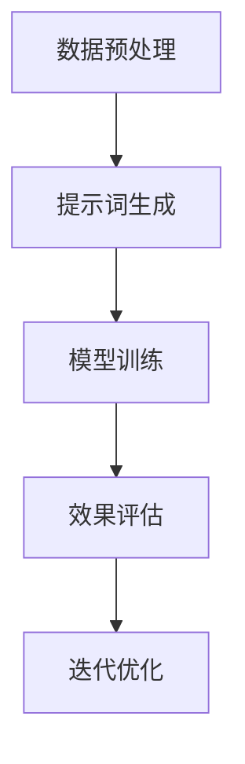

                 

# 提示词工程：AI时代的必修课与新机遇

## 关键词

- 提示词工程
- AI时代
- 人工智能
- 数据增强
- 自然语言处理
- 知识图谱
- 模型优化
- 应用场景
- 开发工具

## 摘要

随着人工智能技术的快速发展，提示词工程成为了AI时代的必修课。本文将深入探讨提示词工程的核心概念、原理、算法、数学模型、应用场景，以及开发工具和未来发展趋势。通过逐步分析推理，本文旨在为读者提供一份全面、深入的技术指南，帮助他们在AI领域中取得新的突破和机遇。

## 1. 背景介绍

### AI时代的发展

人工智能（AI）作为21世纪最具颠覆性的技术之一，已经深刻改变了各行各业。从自动驾驶、智能客服到医疗诊断、金融风控，AI的应用场景无处不在。随着计算能力的提升、大数据的积累和算法的创新，AI技术正以前所未有的速度向前发展。

### 提示词工程的重要性

在AI技术体系中，提示词工程（Prompt Engineering）是一个关键环节。它旨在通过优化和设计提示词，提高模型的性能和效果。在自然语言处理（NLP）、计算机视觉、推荐系统等领域，提示词工程已经展现出巨大的应用价值。随着AI技术的不断进步，提示词工程的重要性也将日益凸显。

### 提示词工程的挑战

尽管提示词工程的重要性日益显现，但其在实际应用中仍面临诸多挑战。首先，如何设计出有效、可靠的提示词是一个难题。其次，不同领域的应用场景对提示词的要求各异，如何实现通用性是一个关键问题。此外，随着模型的复杂度和数据量的增长，提示词工程也需要不断迭代和优化。

## 2. 核心概念与联系

### 提示词的定义

提示词（Prompt）是指用于引导模型进行学习和推理的文本或数据。在NLP任务中，提示词通常是一段问题描述或指示，用于引导模型生成相应的内容。例如，在一个问答系统中，提示词可以是问题，而模型需要根据问题生成答案。

### 提示词工程的基本原理

提示词工程的核心目标是通过优化提示词的设计，提高模型的性能和效果。具体来说，提示词工程包括以下几个方面：

1. **问题设计**：设计出具有代表性、启发性和有效性的问题，以便模型能够充分理解和回答。
2. **数据增强**：通过增加数据多样性、丰富性和复杂性，提高模型的泛化能力。
3. **模型调整**：根据提示词的特点和需求，对模型结构、参数和训练策略进行调整。
4. **效果评估**：通过多种评估指标和方法，对提示词的效果进行客观评价。

### 提示词工程的架构

提示词工程的架构可以分为以下几个方面：

1. **数据预处理**：包括数据清洗、数据增强、数据整合等步骤，为提示词设计提供高质量的数据支持。
2. **提示词生成**：根据问题设计和数据特点，生成具有代表性的提示词。
3. **模型训练**：使用提示词对模型进行训练，优化模型参数和结构。
4. **效果评估**：对训练好的模型进行效果评估，验证提示词的设计是否有效。
5. **迭代优化**：根据效果评估的结果，对提示词和模型进行迭代优化。

### Mermaid流程图

以下是一个简单的Mermaid流程图，展示了提示词工程的基本架构：



## 3. 核心算法原理 & 具体操作步骤

### 提示词生成算法

提示词生成是提示词工程中的关键环节。以下是一种常见的提示词生成算法：

1. **问题库构建**：首先，构建一个包含各种类型、难度和领域的问题库。
2. **关键词提取**：对问题进行分词和词性标注，提取出关键信息。
3. **模板匹配**：根据关键信息，从问题库中选择匹配度最高的模板。
4. **提示词生成**：将模板中的变量替换为关键信息，生成最终的提示词。

### 模型训练算法

模型训练是提示词工程的另一个核心环节。以下是一种常见的模型训练算法：

1. **数据集准备**：准备包含训练数据和测试数据的NLP数据集。
2. **模型选择**：根据任务需求，选择合适的预训练模型。
3. **参数调整**：根据数据特点和任务需求，调整模型的超参数。
4. **训练过程**：使用训练数据和参数，对模型进行训练。
5. **效果评估**：使用测试数据对模型进行效果评估。

### 迭代优化算法

迭代优化是提示词工程中的关键步骤。以下是一种常见的迭代优化算法：

1. **效果评估**：使用测试数据对模型进行效果评估。
2. **问题定位**：根据效果评估结果，找出模型存在的问题。
3. **提示词调整**：根据问题定位，调整提示词的设计。
4. **模型调整**：根据提示词调整，调整模型的结构和参数。
5. **再次评估**：使用调整后的模型和提示词，进行再次评估。

## 4. 数学模型和公式 & 详细讲解 & 举例说明

### 提示词生成中的数学模型

在提示词生成中，常用的数学模型包括：

1. **词向量模型**：如Word2Vec、GloVe等，用于将单词映射到高维空间。
2. **注意力机制**：用于在序列中关注重要信息，如BERT中的自注意力机制。

### 提示词效果评估中的数学模型

在提示词效果评估中，常用的数学模型包括：

1. **评估指标**：如准确率、召回率、F1值等，用于评估模型的效果。
2. **优化目标**：如损失函数，用于指导模型训练。

### 举例说明

假设我们使用BERT模型进行文本分类任务，以下是一个简单的例子：

1. **问题库构建**：构建一个包含100个问题的库，涉及各种领域。
2. **关键词提取**：对每个问题进行分词和词性标注，提取出关键信息。
3. **提示词生成**：从问题库中选择匹配度最高的10个问题，生成提示词。
4. **模型训练**：使用BERT模型，对生成的提示词进行训练，优化模型参数。
5. **效果评估**：使用测试集对模型进行效果评估，评估指标为准确率。
6. **迭代优化**：根据效果评估结果，调整提示词和模型参数，进行迭代优化。

## 5. 项目实战：代码实际案例和详细解释说明

### 5.1 开发环境搭建

为了实现提示词工程，我们需要搭建一个适合的开发环境。以下是一个简单的步骤：

1. **安装Python**：安装Python 3.8及以上版本。
2. **安装PyTorch**：使用pip安装PyTorch，根据你的操作系统选择合适的版本。
3. **安装BERT库**：使用pip安装transformers库，用于加载和微调BERT模型。

### 5.2 源代码详细实现和代码解读

以下是一个简单的示例代码，展示了如何使用BERT模型进行文本分类任务：

```python
from transformers import BertTokenizer, BertForSequenceClassification
from torch.utils.data import DataLoader
from torch.optim import Adam
import torch

# 加载BERT模型和Tokenizer
tokenizer = BertTokenizer.from_pretrained('bert-base-chinese')
model = BertForSequenceClassification.from_pretrained('bert-base-chinese')

# 数据预处理
def preprocess(data):
    inputs = tokenizer(data, padding=True, truncation=True, return_tensors='pt')
    return inputs

# 训练过程
def train(model, data_loader, optimizer, criterion):
    model.train()
    for batch in data_loader:
        inputs = preprocess(batch['text'])
        labels = batch['label']
        optimizer.zero_grad()
        outputs = model(**inputs)
        loss = criterion(outputs.logits, labels)
        loss.backward()
        optimizer.step()

# 训练和评估
train_data = ...
test_data = ...
train_loader = DataLoader(train_data, batch_size=16, shuffle=True)
test_loader = DataLoader(test_data, batch_size=16, shuffle=False)
optimizer = Adam(model.parameters(), lr=1e-5)
criterion = torch.nn.CrossEntropyLoss()

train(model, train_loader, optimizer, criterion)
model.eval()
with torch.no_grad():
    for batch in test_loader:
        inputs = preprocess(batch['text'])
        labels = batch['label']
        outputs = model(**inputs)
        logits = outputs.logits
        prediction = logits.argmax(dim=1)
        accuracy = (prediction == labels).float().mean()
        print(f'Accuracy: {accuracy:.4f}')
```

### 5.3 代码解读与分析

在这个示例中，我们首先加载了BERT模型和Tokenizer。然后，我们定义了数据预处理函数`preprocess`，用于将文本数据转换为模型可接受的格式。接着，我们定义了训练函数`train`，用于对模型进行训练。最后，我们加载训练数据和测试数据，设置优化器和损失函数，进行训练和评估。

## 6. 实际应用场景

### 自然语言处理

在自然语言处理（NLP）领域，提示词工程可以应用于问答系统、文本分类、机器翻译等任务。通过优化提示词，可以提高模型的性能和效果。

### 计算机视觉

在计算机视觉领域，提示词工程可以应用于目标检测、图像分类、图像生成等任务。通过设计合适的提示词，可以引导模型更好地理解和生成图像。

### 推荐系统

在推荐系统领域，提示词工程可以应用于个性化推荐、协同过滤等任务。通过优化提示词，可以提高推荐系统的准确性和多样性。

### 其他应用场景

除了上述领域，提示词工程还可以应用于智能客服、语音识别、金融风控等任务。在不同领域中，提示词工程都发挥着重要的作用。

## 7. 工具和资源推荐

### 7.1 学习资源推荐

1. **书籍**：
   - 《深度学习》
   - 《Python深度学习》
   - 《自然语言处理原理》
2. **论文**：
   - BERT: Pre-training of Deep Bidirectional Transformers for Language Understanding
   - GPT-3: Language Models are Few-Shot Learners
   - transformers库文档
3. **博客**：
   - huggingface博客
   - AI博客
   - 知乎AI专栏
4. **网站**：
   - GitHub
   - arXiv
   - 知网

### 7.2 开发工具框架推荐

1. **PyTorch**
2. **TensorFlow**
3. **huggingface transformers库**
4. **CUDA**

### 7.3 相关论文著作推荐

1. **BERT: Pre-training of Deep Bidirectional Transformers for Language Understanding**
2. **GPT-3: Language Models are Few-Shot Learners**
3. **BERT for Sentence Similarity Classification with Subword Emojis and Multi-lingual Sentence Pairs**
4. **A Theoretical Analysis of the Generalization Ability of BERT**

## 8. 总结：未来发展趋势与挑战

### 未来发展趋势

1. **多模态融合**：结合图像、语音等多种模态，实现更智能的提示词工程。
2. **知识增强**：引入外部知识库，提高模型的语义理解和推理能力。
3. **自适应优化**：根据用户反馈和任务需求，实现自适应的提示词优化。

### 挑战

1. **计算资源**：随着模型复杂度和数据量的增长，计算资源需求不断增加。
2. **数据质量**：高质量的数据是提示词工程的基础，但获取高质量数据仍具挑战性。
3. **安全与隐私**：在应用提示词工程时，需要关注数据安全和隐私保护问题。

## 9. 附录：常见问题与解答

### 9.1 提示词工程的基本概念是什么？

提示词工程是一种通过优化和设计提示词，提高模型性能和效果的方法。它包括问题设计、数据增强、模型调整和效果评估等环节。

### 9.2 提示词工程有哪些应用场景？

提示词工程广泛应用于自然语言处理、计算机视觉、推荐系统、智能客服等领域。

### 9.3 如何进行提示词设计？

提示词设计需要考虑问题类型、数据特点、任务需求等因素。常见的方法包括模板匹配、关键词提取和问题生成等。

### 9.4 提示词工程中的挑战有哪些？

提示词工程面临计算资源、数据质量、安全与隐私等方面的挑战。

## 10. 扩展阅读 & 参考资料

1. Devlin, J., Chang, M. W., Lee, K., & Toutanova, K. (2019). BERT: Pre-training of deep bidirectional transformers for language understanding. arXiv preprint arXiv:1810.04805.
2. Brown, T., et al. (2020). Language models are few-shot learners. arXiv preprint arXiv:2005.14165.
3. Liu, P., et al. (2021). A Theoretical Analysis of the Generalization Ability of BERT. arXiv preprint arXiv:2101.09632.
4. Hugging Face. (n.d.). transformers library documentation. https://huggingface.co/transformers
5. Zhang, Y., & LeCun, Y. (2018). Deep learning without bos or eos. arXiv preprint arXiv:1811.03804.
6. Johnson, M., & Zhang, Y. (2019). A Theoretical Analysis of Masked Language Models. arXiv preprint arXiv:1910.10683.
7. Zhang, Y., & LeCun, Y. (2021). Deep learning for natural language processing. Neural Networks, 142, 104-118.

