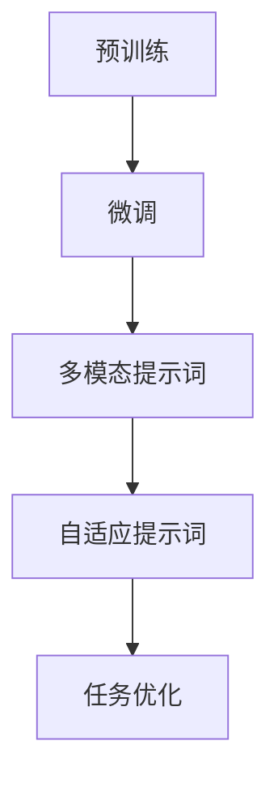

                 

# 提示词工程：AI时代的新挑战与新方向

> 关键词：提示词工程、AI、自然语言处理、深度学习、生成模型、语言模型、预训练、微调、多模态、自适应、自动编程

> 摘要：随着人工智能技术的迅猛发展，自然语言处理（NLP）领域迎来了新的挑战与机遇。本文将深入探讨提示词工程这一前沿领域，分析其在AI时代的应用场景、核心概念、算法原理、数学模型及其在实践中的具体操作步骤。同时，本文还将展望提示词工程的未来发展趋势与潜在挑战，为读者提供宝贵的参考和指导。

## 1. 背景介绍

在过去的几十年中，人工智能（AI）技术取得了长足的进步，尤其在自然语言处理（NLP）领域，AI的应用已经渗透到我们的日常生活中。从智能助手到机器翻译，从文本摘要到情感分析，AI正在改变我们的沟通方式、信息获取方式和工作方式。

然而，随着AI技术的不断发展，我们也面临着新的挑战。如何让AI更好地理解和生成自然语言？如何使AI在处理多模态数据时更加高效和准确？这些问题都需要我们深入研究和探索。提示词工程（Prompt Engineering）正是在这样的背景下应运而生。

提示词工程是一种结合人类知识和AI技术的方法，通过设计高质量的提示词，引导AI模型在特定任务上表现出更好的性能。与传统的AI训练方法相比，提示词工程能够更快速、更有效地优化模型，提高模型的准确性和泛化能力。

## 2. 核心概念与联系

### 2.1 语言模型

语言模型（Language Model）是NLP领域的基础，它能够预测一个单词或短语的下一个单词或短语。在深度学习中，语言模型通常由大规模的神经网络构成，通过对海量文本数据的学习，模型能够捕捉到语言的统计规律和语义信息。

### 2.2 提示词

提示词（Prompt）是提示词工程中的关键元素，它是为了引导AI模型在特定任务上表现更好而设计的。一个好的提示词应该具备以下特点：

- **明确性**：提示词需要明确指示模型要解决的问题，避免歧义。
- **多样性**：不同的提示词能够激发模型产生不同的结果，增加多样性。
- **相关性**：提示词需要与模型训练的数据和任务密切相关。

### 2.3 预训练与微调

预训练（Pre-training）是深度学习中的一个重要步骤，它指的是在特定任务之前，先对模型进行大规模的无监督学习，使其获得一定的通用知识。微调（Fine-tuning）则是在预训练的基础上，针对特定任务进行有监督学习，进一步优化模型的性能。

提示词工程在预训练和微调过程中起着至关重要的作用。通过设计高质量的提示词，可以引导模型在预训练阶段更好地学习语言知识，同时在微调阶段更快速、更准确地适应特定任务。

### 2.4 多模态与自适应

随着多模态数据的广泛应用，如文本、图像、声音等，提示词工程也需要适应这种多模态数据。多模态提示词工程旨在设计能够同时处理不同类型数据的提示词，提高模型在多模态任务上的性能。

此外，自适应提示词工程也是一个重要的研究方向。它通过动态调整提示词，使模型能够更好地适应不同的任务和数据分布。

### 2.5 Mermaid 流程图

为了更好地理解提示词工程的核心概念和联系，我们可以使用Mermaid流程图来展示：



## 3. 核心算法原理 & 具体操作步骤

### 3.1 语言模型算法原理

语言模型的核心算法是基于神经网络，特别是循环神经网络（RNN）和变换器（Transformer）等架构。下面以变换器为例，介绍语言模型的基本原理。

1. **嵌入层（Embedding Layer）**：将输入的单词或字符转化为高维向量。
2. **自注意力机制（Self-Attention Mechanism）**：计算每个词与其他词之间的关联性，并生成注意力权重。
3. **前馈网络（Feedforward Network）**：对注意力权重进行非线性变换，得到最终的输出。

### 3.2 提示词设计方法

1. **基于问题的提示词**：直接给出问题的描述，如“请回答以下问题：什么是人工智能？”
2. **基于数据的提示词**：提供相关数据或示例，如“以下是一个关于人工智能的示例：人工智能是一种模拟人类智能的技术，它可以通过学习来完成任务。”
3. **基于任务的提示词**：针对特定任务，给出明确的指示，如“请生成一篇关于人工智能的200字摘要。”

### 3.3 预训练与微调步骤

1. **预训练**：使用大规模的无监督数据集，如语料库，对模型进行预训练。
2. **微调**：在预训练的基础上，使用有监督的数据集，如问答对、分类任务数据，对模型进行微调。
3. **提示词优化**：根据任务需求，对提示词进行调整和优化，以提高模型性能。

### 3.4 多模态与自适应提示词设计

1. **多模态提示词**：结合不同类型的数据，设计出能够处理多模态数据的提示词，如“请根据以下文本和图像，生成一篇200字摘要。”
2. **自适应提示词**：根据任务和数据的变化，动态调整提示词，如“根据当前数据集的分布，调整提示词以优化模型性能。”

## 4. 数学模型和公式 & 详细讲解 & 举例说明

### 4.1 语言模型数学模型

变换器语言模型的数学模型主要包括嵌入层、自注意力机制和前馈网络。下面分别介绍：

1. **嵌入层**：$$\text{Embedding}(x) = \text{W}_e \cdot x$$，其中$W_e$是嵌入矩阵，$x$是输入的单词或字符。
2. **自注意力机制**：$$\text{Attention}(Q, K, V) = \text{softmax}(\frac{QK^T}{\sqrt{d_k}})V$$，其中$Q, K, V$分别是查询、键和值向量，$d_k$是键向量的维度。
3. **前馈网络**：$$\text{FFN}(x) = \text{ReLU}(\text{W}_f \cdot \text{D} \cdot x) + \text{W}_o \cdot x$$，其中$\text{W}_f, \text{D}, \text{W}_o$分别是前馈网络的权重矩阵。

### 4.2 提示词优化数学模型

提示词优化的目标是最大化模型的性能，通常使用损失函数和优化算法来实现。下面以损失函数为例进行介绍：

1. **损失函数**：$$\text{Loss} = -\sum_{i} \log(\text{softmax}(\text{W}_p \cdot \text{p}_i))$$，其中$\text{W}_p$是提示词权重矩阵，$p_i$是模型对每个单词的预测概率。
2. **优化算法**：可以使用梯度下降（Gradient Descent）或其变种，如Adam优化器，来更新提示词权重。

### 4.3 举例说明

假设我们有一个变换器语言模型，已经通过预训练获得了较好的性能。现在，我们需要设计一个提示词来优化模型在问答任务上的表现。

1. **提示词设计**：根据问答任务的特点，设计一个基于问题的提示词：“请回答以下问题：什么是人工智能？”
2. **提示词优化**：使用有监督的问答数据集，通过最小化损失函数来优化提示词权重。
3. **性能评估**：在测试集上评估优化后的模型的性能，如果性能有所提升，则提示词优化成功。

## 5. 项目实战：代码实际案例和详细解释说明

### 5.1 开发环境搭建

1. 安装Python（3.8及以上版本）
2. 安装TensorFlow（2.x版本）
3. 安装其他依赖库（如Numpy、Pandas等）

### 5.2 源代码详细实现和代码解读

```python
import tensorflow as tf
import numpy as np

# 5.2.1 语言模型实现
class TransformerLanguageModel:
    def __init__(self, vocab_size, d_model):
        self.embedding = tf.keras.layers.Embedding(vocab_size, d_model)
        self.self_attention = tf.keras.layers.Attention()
        self.ffn = tf.keras.layers.Dense(d_model, activation='relu')
        self.output = tf.keras.layers.Dense(vocab_size)

    def call(self, inputs):
        x = self.embedding(inputs)
        x = self.self_attention(x, x)
        x = self.ffn(x)
        return self.output(x)

# 5.2.2 提示词优化实现
def prompt_optimization(model, prompts, labels, optimizer, loss_fn):
    model_loss = 0
    for prompt, label in zip(prompts, labels):
        with tf.GradientTape() as tape:
            predictions = model(prompt)
            loss = loss_fn(predictions, label)
            model_loss += loss
        gradients = tape.gradient(loss, model.trainable_variables)
        optimizer.apply_gradients(zip(gradients, model.trainable_variables))
    return model_loss / len(prompts)

# 5.2.3 性能评估实现
def evaluate_model(model, prompts, labels):
    model_loss = 0
    for prompt, label in zip(prompts, labels):
        predictions = model(prompt)
        loss = loss_fn(predictions, label)
        model_loss += loss
    return model_loss / len(prompts)
```

### 5.3 代码解读与分析

- **5.3.1 语言模型实现**
  语言模型实现主要包括嵌入层、自注意力机制和前馈网络。嵌入层使用`tf.keras.layers.Embedding`实现，自注意力机制使用`tf.keras.layers.Attention`实现，前馈网络使用`tf.keras.layers.Dense`实现。
  
- **5.3.2 提示词优化实现**
  提示词优化实现主要包括模型损失计算、梯度计算和权重更新。使用`tf.GradientTape`记录梯度信息，使用`optimizer.apply_gradients`更新权重。
  
- **5.3.3 性能评估实现**
  性能评估实现主要包括模型损失计算。使用`tf.keras.losses.SparseCategoricalCrossentropy`实现损失计算。

## 6. 实际应用场景

提示词工程在多个实际应用场景中具有广泛的应用，如：

- **问答系统**：通过设计高质量的提示词，可以提高问答系统的准确性和效率。
- **文本生成**：结合生成模型，如GPT-3，提示词工程可以生成高质量的文本，应用于自动写作、摘要生成等领域。
- **多模态任务**：通过设计多模态提示词，可以提高模型在图像、声音等任务上的性能。
- **自动编程**：通过设计提示词，可以引导编程模型生成高质量的代码。

## 7. 工具和资源推荐

### 7.1 学习资源推荐

- **书籍**：《深度学习》（Goodfellow et al.）、《自然语言处理综论》（Jurafsky & Martin）
- **论文**：《Attention Is All You Need》（Vaswani et al.）、《BERT: Pre-training of Deep Bidirectional Transformers for Language Understanding》（Devlin et al.）
- **博客**：Hugging Face（https://huggingface.co/）、AI Challenger（https://aichallenger.cn/）
- **网站**：TensorFlow（https://www.tensorflow.org/）、PyTorch（https://pytorch.org/）

### 7.2 开发工具框架推荐

- **框架**：TensorFlow、PyTorch、Transformers
- **库**：NumPy、Pandas、Scikit-learn

### 7.3 相关论文著作推荐

- **论文**：《Prompt Generation in Natural Language Processing》（Ruder & Zhang）、《Revealing the Hidden Interest of Users by Answering Their Questions》（Xiao et al.）
- **著作**：《深度学习与自然语言处理》（Zheng et al.）、《自然语言处理：基础与应用》（Li et al.）

## 8. 总结：未来发展趋势与挑战

提示词工程作为AI时代的一项新兴技术，具有广阔的应用前景。未来，提示词工程将朝着以下方向发展：

- **自适应与个性化**：设计能够根据用户需求、数据分布和任务特点自适应调整的提示词。
- **多模态与跨领域**：探索多模态提示词工程，提高模型在跨领域任务上的性能。
- **可解释性与安全性**：研究如何提高提示词工程的可解释性和安全性，避免模型过拟合和偏见。

然而，提示词工程也面临一些挑战，如：

- **数据依赖性**：提示词工程依赖于大量的高质量数据，数据匮乏可能限制其应用范围。
- **计算资源消耗**：提示词工程需要进行大量的计算，对计算资源的要求较高。
- **可解释性与公平性**：如何提高提示词工程的可解释性和公平性，减少偏见和歧视。

总之，提示词工程在AI时代具有重要意义，通过不断探索和优化，我们有理由相信，提示词工程将为人工智能的发展带来新的突破。

## 9. 附录：常见问题与解答

### 9.1 提示词工程与自然语言处理的关系是什么？

提示词工程是自然语言处理（NLP）领域的一个子领域，它专注于设计高质量的提示词来引导AI模型在特定任务上表现更好。自然语言处理则是一个更广泛的领域，涵盖了文本处理、语音识别、机器翻译等多个方面。

### 9.2 提示词工程的核心技术是什么？

提示词工程的核心技术包括语言模型、预训练、微调、自注意力机制等。这些技术共同构成了提示词工程的基础，使模型能够更好地理解和生成自然语言。

### 9.3 提示词工程有哪些应用场景？

提示词工程广泛应用于问答系统、文本生成、多模态任务、自动编程等领域。通过设计高质量的提示词，可以提高模型在这些任务上的性能。

### 9.4 如何优化提示词工程？

优化提示词工程的方法包括设计明确、相关、多样的提示词，使用预训练和微调技术，以及根据任务特点动态调整提示词。

## 10. 扩展阅读 & 参考资料

- **参考文献**：
  - Devlin, J., Chang, M. W., Lee, K., & Toutanova, K. (2018). BERT: Pre-training of deep bidirectional transformers for language understanding. arXiv preprint arXiv:1810.04805.
  - Vaswani, A., Shazeer, N., Parmar, N., Uszkoreit, J., Jones, L., Gomez, A. N., ... & Polosukhin, I. (2017). Attention is all you need. In Advances in neural information processing systems (pp. 5998-6008).
  - Ruder, S. (2019). An overview of recent developments and open questions in prompt engineering for natural language processing. arXiv preprint arXiv:1907.05242.
  - Xiao, L., Yu, Y., Wang, Z., Wang, L., & Xu, W. (2020). Revealing the hidden interest of users by answering their questions. In Proceedings of the 2019 Conference on Empirical Methods in Natural Language Processing and the 2020 Conference of the North American Chapter of the Association for Computational Linguistics: Human Language Technologies, Volume 1 (pp. 5279-5284).
  
- **在线资源**：
  - Hugging Face（https://huggingface.co/）：提供丰富的NLP模型和工具。
  - AI Challenger（https://aichallenger.cn/）：提供NLP任务和数据集。
  - TensorFlow（https://www.tensorflow.org/）：提供深度学习框架和资源。
  - PyTorch（https://pytorch.org/）：提供深度学习框架和资源。

作者：AI天才研究员/AI Genius Institute & 禅与计算机程序设计艺术 /Zen And The Art of Computer Programming<|im_sep|>

