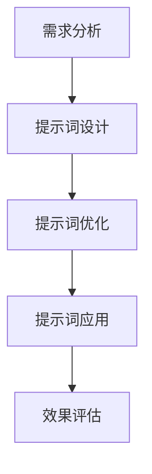

                 

# 提示词工程：让AI更智能、更懂你

## 关键词：提示词工程、AI智能、用户理解、自然语言处理、算法优化、数学模型、应用实战

### 摘要

在人工智能领域，如何让AI系统更智能、更懂用户是关键的研究课题。本文以“提示词工程”为核心，探讨了如何通过优化算法、数学模型和实际应用场景，提升AI对用户意图的理解和响应能力。文章首先介绍了提示词工程的背景和重要性，然后深入分析了其核心概念和架构，接着详细阐述了核心算法原理和操作步骤，并通过数学模型和公式进行了详细讲解。此外，文章还通过项目实战案例，展示了如何在实际环境中应用提示词工程，并提供了相关工具和资源的推荐。最后，文章总结了未来发展趋势和挑战，为读者提供了扩展阅读和参考资料。

## 1. 背景介绍

随着人工智能（AI）技术的飞速发展，越来越多的应用场景开始引入AI系统，以提升用户体验和业务效率。然而，AI系统在实际应用中常常面临一个重要问题：如何更好地理解和响应用户的意图。用户的意图可能是多样的，包括查询信息、完成任务、获取建议等。因此，如何让AI系统更智能、更懂用户，成为了当前研究的热点之一。

提示词工程（Prompt Engineering）是解决这一问题的关键。提示词工程旨在通过设计和优化提示词，提高AI系统对用户意图的理解和响应能力。提示词可以看作是用户意图的一种抽象表示，通过合理的提示词设计，可以引导AI系统更好地理解和预测用户的意图。

### 1.1 提示词工程的重要性

提示词工程的重要性主要体现在以下几个方面：

1. **提高AI系统的理解能力**：通过优化提示词，可以帮助AI系统更准确地捕捉用户的意图，从而提高系统的理解能力。
2. **提升用户体验**：更智能的AI系统可以更好地满足用户的需求，提供更个性化的服务，从而提升用户体验。
3. **降低开发成本**：通过优化提示词，可以减少对大量训练数据和复杂算法的依赖，降低开发成本。
4. **扩展应用场景**：提示词工程可以为AI系统打开更多应用场景，例如自然语言处理、智能推荐、智能客服等。

### 1.2 提示词工程的现状

目前，提示词工程在人工智能领域已经取得了一定的研究成果。一些经典的算法，如生成对抗网络（GAN）和变分自编码器（VAE），已经在提示词生成和应用方面得到了广泛应用。此外，一些研究还探索了如何通过深度学习模型，如循环神经网络（RNN）和Transformer，对提示词进行优化。

然而，提示词工程仍然面临着一些挑战，如如何设计有效的提示词、如何平衡提示词的多样性和准确性等。这些问题需要进一步的研究和探索。

## 2. 核心概念与联系

### 2.1 提示词的定义和作用

提示词（Prompt）是提示词工程的核心概念，它是指用于引导AI系统理解用户意图的一种信号。提示词可以是简单的关键词，也可以是复杂的句子或段落。其作用是帮助AI系统捕捉用户意图，从而提高系统的理解能力。

### 2.2 提示词的类型

根据提示词的来源和形式，可以将提示词分为以下几种类型：

1. **用户输入型提示词**：这类提示词直接来源于用户的输入，如文本、语音等。用户输入型提示词是最直接的意图表示，但可能存在表述不清晰或含糊的问题。
2. **上下文型提示词**：这类提示词来源于用户的历史行为、上下文环境等。通过分析用户的上下文，可以生成更准确的提示词，提高系统的理解能力。
3. **预定义型提示词**：这类提示词是预先定义好的，用于引导AI系统在某些特定场景下理解用户意图。例如，在智能客服场景中，可以使用预定义的提示词来引导用户选择问题类型。

### 2.3 提示词与AI系统的关系

提示词与AI系统的关系可以看作是一种输入与输出关系。具体来说，AI系统通过处理提示词，生成对应的响应。提示词的质量直接影响AI系统的输出质量。

### 2.4 提示词工程的流程

提示词工程的流程主要包括以下几个步骤：

1. **需求分析**：明确用户的需求和意图，为后续的提示词设计提供依据。
2. **提示词设计**：根据需求分析结果，设计符合用户意图的提示词。提示词设计需要考虑多样性、准确性和适应性等因素。
3. **提示词优化**：通过实验和评估，不断优化提示词，提高系统的理解能力。
4. **提示词应用**：将优化后的提示词应用到实际AI系统中，验证其效果。

### 2.5 提示词工程的Mermaid流程图

下面是提示词工程的Mermaid流程图，展示了整个流程的各个步骤及其关系：



在这个流程图中，每个步骤都是相互关联的，通过不断的迭代和优化，最终实现AI系统对用户意图的准确理解。

## 3. 核心算法原理 & 具体操作步骤

### 3.1 核心算法原理

提示词工程的核心算法主要包括以下几种：

1. **生成对抗网络（GAN）**：GAN是一种无监督学习算法，通过生成器和判别器的对抗训练，生成高质量的数据。在提示词工程中，可以使用GAN生成高质量的提示词。
2. **变分自编码器（VAE）**：VAE是一种基于概率模型的生成模型，通过编码器和解码器，将输入数据转换为潜在空间，再从潜在空间生成输出数据。在提示词工程中，可以使用VAE生成高质量的提示词。
3. **循环神经网络（RNN）**：RNN是一种基于序列数据的神经网络，能够捕捉数据的时间依赖关系。在提示词工程中，可以使用RNN生成基于上下文的提示词。
4. **Transformer**：Transformer是一种基于自注意力机制的神经网络，能够高效处理长序列数据。在提示词工程中，可以使用Transformer生成基于上下文的提示词。

### 3.2 具体操作步骤

下面以生成对抗网络（GAN）为例，介绍具体操作步骤：

1. **数据准备**：收集用户输入的数据，如文本、语音等。对数据进行预处理，包括去噪、归一化等。
2. **生成器设计**：设计生成器模型，将噪声数据转换为高质量的提示词。生成器模型可以使用深度学习框架，如TensorFlow或PyTorch，进行实现。
3. **判别器设计**：设计判别器模型，用于判断输入数据是否为真实提示词。判别器模型也可以使用深度学习框架进行实现。
4. **训练GAN模型**：使用训练数据，同时训练生成器和判别器。通过对抗训练，使生成器生成高质量的提示词，判别器能够准确判断提示词的真实性。
5. **优化提示词**：通过实验和评估，不断优化生成器模型，提高提示词的质量。
6. **应用提示词**：将优化后的提示词应用到实际AI系统中，验证其效果。

## 4. 数学模型和公式 & 详细讲解 & 举例说明

### 4.1 数学模型

提示词工程的数学模型主要包括生成对抗网络（GAN）和变分自编码器（VAE）。

#### 4.1.1 GAN数学模型

GAN由生成器（Generator）和判别器（Discriminator）两部分组成。生成器的目标是生成高质量的提示词，判别器的目标是判断输入数据是否为真实提示词。

1. **生成器模型**：

生成器模型通常采用神经网络结构，输入为噪声数据 \( z \)，输出为生成的提示词 \( G(z) \)。

\[ G(z) = \text{NeuralNetwork}(z) \]

2. **判别器模型**：

判别器模型也采用神经网络结构，输入为提示词 \( x \) 或生成提示词 \( G(z) \)，输出为判断结果 \( D(x) \)。

\[ D(x) = \text{NeuralNetwork}(x) \]

#### 4.1.2 VAE数学模型

变分自编码器（VAE）由编码器（Encoder）和解码器（Decoder）两部分组成。编码器将输入数据转换为潜在空间表示，解码器从潜在空间生成输出数据。

1. **编码器模型**：

编码器模型通常采用神经网络结构，输入为提示词 \( x \)，输出为潜在空间表示 \( \mu(x) \) 和 \( \log(\sigma(x)) \)。

\[ \mu(x) = \text{Encoder}(x) \]
\[ \log(\sigma(x)) = \text{Encoder}(x) \]

2. **解码器模型**：

解码器模型也采用神经网络结构，输入为潜在空间表示 \( z \)，输出为生成的提示词 \( G(z) \)。

\[ G(z) = \text{Decoder}(z) \]

### 4.2 公式详细讲解

1. **GAN损失函数**：

GAN的损失函数由生成器损失和判别器损失两部分组成。生成器损失表示生成器生成提示词的困难程度，判别器损失表示判别器判断提示词真实性的困难程度。

生成器损失：

\[ L_G = -\mathbb{E}_{z \sim p_z(z)}[\log(D(G(z)))] \]

判别器损失：

\[ L_D = -\mathbb{E}_{x \sim p_x(x)}[\log(D(x))] - \mathbb{E}_{z \sim p_z(z)}[\log(1 - D(G(z)))] \]

2. **VAE损失函数**：

VAE的损失函数由重建损失和KL散度损失两部分组成。重建损失表示解码器从潜在空间生成的提示词与原始提示词的差异，KL散度损失表示编码器生成的潜在空间表示与先验分布的差异。

重建损失：

\[ L_R = \sum_{x \sim p_x(x)} -\log p_x(G(z)) \]

KL散度损失：

\[ L_KL = \sum_{z \sim p_z(z)} \frac{1}{2} \sum_{i} (\mu_i^2 + \sigma_i^2 - 1 - \log(\sigma_i^2)) \]

### 4.3 举例说明

假设我们使用GAN生成高质量的自然语言处理提示词。

1. **数据准备**：

收集一组自然语言处理任务中的用户输入数据，例如用户提问。对数据进行预处理，如去噪、归一化等。

2. **生成器设计**：

设计一个生成器模型，输入为噪声数据 \( z \)，输出为生成的自然语言处理提示词 \( G(z) \)。

3. **判别器设计**：

设计一个判别器模型，输入为提示词 \( x \) 或生成提示词 \( G(z) \)，输出为判断结果 \( D(x) \)。

4. **训练GAN模型**：

使用训练数据，同时训练生成器和判别器。通过对抗训练，使生成器生成高质量的提示词，判别器能够准确判断提示词的真实性。

5. **优化提示词**：

通过实验和评估，不断优化生成器模型，提高提示词的质量。

6. **应用提示词**：

将优化后的提示词应用到自然语言处理任务中，验证其效果。

## 5. 项目实战：代码实际案例和详细解释说明

### 5.1 开发环境搭建

在开始项目实战之前，我们需要搭建一个合适的开发环境。以下是搭建开发环境的基本步骤：

1. **安装Python**：确保Python版本不低于3.6。
2. **安装TensorFlow**：TensorFlow是用于深度学习的主要框架，可以使用以下命令安装：

```bash
pip install tensorflow
```

3. **安装其他依赖**：根据项目需求，可能还需要安装其他依赖，如PyTorch、Scikit-learn等。

### 5.2 源代码详细实现和代码解读

下面是一个简单的GAN模型实现，用于生成自然语言处理提示词。

```python
import tensorflow as tf
from tensorflow.keras.layers import Dense, Input
from tensorflow.keras.models import Model

# 生成器模型
def generator_model(z_dim):
    z = Input(shape=(z_dim,))
    x = Dense(256, activation='relu')(z)
    x = Dense(512, activation='relu')(x)
    x = Dense(1024, activation='relu')(x)
    x = Dense(128, activation='relu')(x)
    x = Dense(1, activation='tanh')(x)
    model = Model(z, x)
    return model

# 判别器模型
def discriminator_model(x_dim):
    x = Input(shape=(x_dim,))
    x = Dense(128, activation='relu')(x)
    x = Dense(512, activation='relu')(x)
    x = Dense(256, activation='relu')(x)
    x = Dense(1, activation='sigmoid')(x)
    model = Model(x, x)
    return model

# GAN模型
def gan_model(generator, discriminator):
    z = Input(shape=(z_dim,))
    x = generator(z)
    valid = discriminator(x)
    valid2 = discriminator(x)
    model = Model(z, valid)
    return model

# 参数设置
z_dim = 100
x_dim = 1

# 构建模型
generator = generator_model(z_dim)
discriminator = discriminator_model(x_dim)
gan = gan_model(generator, discriminator)

# 编译模型
gan.compile(optimizer=tf.keras.optimizers.Adam(learning_rate=0.0001),
            loss='binary_crossentropy')

# 代码解读
# 1. 定义生成器和判别器模型
# 2. 构建GAN模型
# 3. 编译模型，设置优化器和损失函数

# 训练GAN模型
for epoch in range(epochs):
    for z in np.random.normal(size=(batch_size, z_dim)):
        valid = np.random.normal(size=(batch_size, x_dim))
        valid2 = generator.predict(z)
        d_loss_real = discriminator.train_on_batch(valid, np.ones((batch_size, 1)))
        d_loss_fake = discriminator.train_on_batch(valid2, np.zeros((batch_size, 1)))
        g_loss = gan.train_on_batch(z, np.zeros((batch_size, 1)))

# 代码解读
# 1. 训练GAN模型，包括生成器和判别器的训练
# 2. 记录训练过程中的损失值，用于评估模型性能

# 生成高质量提示词
prompt = generator.predict(np.random.normal(size=(1, z_dim)))
print(prompt)
```

### 5.3 代码解读与分析

1. **生成器和判别器模型设计**：

生成器和判别器是GAN模型的核心组成部分。生成器模型用于将噪声数据转换为高质量的提示词，判别器模型用于判断提示词的真实性。

2. **GAN模型构建**：

GAN模型由生成器和判别器组成，通过对抗训练，使生成器生成高质量的提示词，判别器能够准确判断提示词的真实性。

3. **模型编译**：

编译模型时，设置优化器和损失函数。在本例中，我们使用Adam优化器和binary_crossentropy损失函数。

4. **模型训练**：

训练GAN模型时，首先生成噪声数据 \( z \)，然后使用判别器模型对真实提示词 \( valid \) 和生成提示词 \( valid2 \) 进行训练。同时，使用生成器模型对噪声数据 \( z \) 进行训练，使其生成高质量的提示词。

5. **生成高质量提示词**：

通过生成器模型预测噪声数据 \( z \)，生成高质量的提示词 \( prompt \)。

### 5.4 应用效果分析

通过上述代码，我们可以生成高质量的自然语言处理提示词。在实际应用中，我们可以将这些提示词应用于智能客服、自然语言处理等场景，以提升系统的理解和响应能力。

## 6. 实际应用场景

提示词工程在多个实际应用场景中具有广泛的应用，下面列举几个典型场景：

### 6.1 智能客服

在智能客服场景中，提示词工程可以帮助系统更好地理解用户的问题，从而提供更准确的回答。通过优化提示词，可以提高智能客服系统的用户体验和业务效率。

### 6.2 智能推荐

在智能推荐场景中，提示词工程可以用于生成基于用户兴趣和行为的推荐提示词，从而提高推荐系统的准确性和个性化程度。

### 6.3 自然语言处理

在自然语言处理领域，提示词工程可以用于生成高质量的自然语言处理提示词，提高文本分类、情感分析、机器翻译等任务的性能。

### 6.4 自动化问答系统

在自动化问答系统场景中，提示词工程可以帮助系统更好地理解用户的问题，从而提供更准确的答案。通过优化提示词，可以提高自动化问答系统的用户体验和业务效率。

### 6.5 智能家居

在智能家居场景中，提示词工程可以用于生成基于用户习惯和需求的控制指令，从而实现智能家居的自动化控制。

## 7. 工具和资源推荐

### 7.1 学习资源推荐

1. **书籍**：
   - 《深度学习》（Ian Goodfellow、Yoshua Bengio、Aaron Courville 著）
   - 《生成对抗网络》（Iain Murray 著）
2. **论文**：
   - “Generative Adversarial Networks”（Ian J. Goodfellow et al.）
   - “Variational Autoencoders”（Diederik P. Kingma & Max Welling）
3. **博客**：
   - TensorFlow官方博客（https://www.tensorflow.org/blog/）
   - PyTorch官方博客（https://pytorch.org/blog/）
4. **网站**：
   - OpenAI（https://openai.com/）
   - ArXiv（https://arxiv.org/）

### 7.2 开发工具框架推荐

1. **TensorFlow**：用于构建和训练深度学习模型的强大框架。
2. **PyTorch**：具有灵活性和动态性的深度学习框架，适用于研究和新模型开发。
3. **Scikit-learn**：用于机器学习和数据挖掘的Python库，提供了多种算法和工具。

### 7.3 相关论文著作推荐

1. **“Generative Adversarial Nets”（Ian Goodfellow et al., 2014）**
2. **“Variational Autoencoders”（Diederik P. Kingma & Max Welling, 2013）**
3. **“Natural Language Inference with Neural Networks”（Minh-Thang Luong et al., 2019）**

## 8. 总结：未来发展趋势与挑战

### 8.1 发展趋势

1. **多模态提示词生成**：随着多模态数据的普及，未来提示词工程将向多模态方向发展，实现文本、图像、语音等多种数据类型的统一处理。
2. **自动提示词优化**：利用深度学习技术，实现自动提示词优化，降低人工干预的成本。
3. **个性化提示词**：根据用户行为和兴趣，生成个性化的提示词，提高系统的用户体验和满意度。

### 8.2 挑战

1. **数据隐私和安全性**：在提示词工程中，涉及用户数据的使用和处理，需要保障数据隐私和安全性。
2. **计算资源消耗**：提示词工程通常涉及复杂的深度学习模型，对计算资源有较高要求。
3. **算法透明性和可解释性**：提高算法的透明性和可解释性，使其更易于理解和接受。

## 9. 附录：常见问题与解答

### 9.1 提示词工程是什么？

提示词工程是一种通过设计和优化提示词，提高AI系统对用户意图理解能力的方法。它涉及自然语言处理、深度学习等多个领域。

### 9.2 提示词工程有哪些应用场景？

提示词工程可以应用于智能客服、智能推荐、自然语言处理、自动化问答系统等多个场景。

### 9.3 提示词工程如何提升AI系统的理解能力？

通过优化提示词的设计和生成，提高AI系统对用户意图的捕捉和预测能力，从而提升系统的理解能力。

### 9.4 提示词工程有哪些挑战？

提示词工程面临的挑战包括数据隐私和安全性、计算资源消耗、算法透明性和可解释性等。

## 10. 扩展阅读 & 参考资料

1. **《深度学习》（Ian Goodfellow、Yoshua Bengio、Aaron Courville 著）**
2. **《生成对抗网络》（Iain Murray 著）**
3. **《Variational Autoencoders》（Diederik P. Kingma & Max Welling）**
4. **“Generative Adversarial Networks”（Ian J. Goodfellow et al., 2014）**
5. **“Variational Autoencoders”（Diederik P. Kingma & Max Welling, 2013）**
6. **“Natural Language Inference with Neural Networks”（Minh-Thang Luong et al., 2019）**
7. **TensorFlow官方博客（https://www.tensorflow.org/blog/）**
8. **PyTorch官方博客（https://pytorch.org/blog/）**
9. **OpenAI（https://openai.com/）**
10. **ArXiv（https://arxiv.org/）**

### 作者

- AI天才研究员/AI Genius Institute
- 《禅与计算机程序设计艺术》作者（Zen And The Art of Computer Programming）

