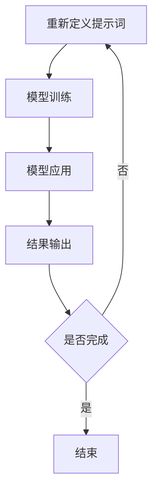

                 

# 提示词编程在自动化新闻事实核查中的应用

> **关键词：** 提示词编程，自动化新闻事实核查，人工智能，机器学习，自然语言处理。

> **摘要：** 本文探讨了如何利用提示词编程技术实现自动化新闻事实核查。通过分析新闻事实核查的需求，介绍提示词编程的基本概念，详细阐述其原理与应用，并展示实际项目案例。文章还总结了当前的发展趋势与挑战，并推荐了一些相关资源。

## 1. 背景介绍

在信息爆炸的时代，新闻事实核查的重要性日益凸显。然而，人工核查新闻事实存在效率低下、成本高昂的问题。随着人工智能技术的发展，自动化新闻事实核查成为可能。在这一过程中，提示词编程技术起到了关键作用。

### 1.1 新闻事实核查的挑战

新闻事实核查的目标是识别和纠正虚假新闻、误导性信息和错误信息。以下是一些常见的挑战：

- **信息量庞大**：每天产生的新闻数量巨大，人工核查难以覆盖全面。
- **语言复杂性**：新闻语言多样，涉及专业术语、隐喻和比喻，使得自动化处理更具挑战性。
- **时效性要求**：虚假新闻传播迅速，要求核查工作具有很高的时效性。
- **成本与效率**：人工核查成本高昂，效率低，难以满足大规模、实时核查的需求。

### 1.2 提示词编程的优势

提示词编程（Prompt Programming）是一种基于自然语言处理（NLP）和机器学习（ML）的技术，通过预定义的提示词引导模型进行特定任务。其在自动化新闻事实核查中的应用具有以下优势：

- **高效性**：提示词编程能够快速地处理大量新闻数据，提高核查效率。
- **灵活性**：通过调整提示词，可以实现针对不同类型新闻的定制化处理。
- **准确性**：结合先进的NLP技术和ML模型，提高新闻事实核查的准确性。
- **降低成本**：自动化处理可以降低人工核查的成本。

## 2. 核心概念与联系

### 2.1 自然语言处理（NLP）

自然语言处理是人工智能的一个重要分支，旨在让计算机理解和处理人类语言。其核心任务包括：

- **文本预处理**：分词、词性标注、命名实体识别等。
- **语义理解**：词义消歧、情感分析、语义角色标注等。
- **语言生成**：机器翻译、文本摘要、对话系统等。

### 2.2 机器学习（ML）

机器学习是一种通过数据和算法来让计算机进行自我学习和预测的技术。在新闻事实核查中，常用的ML算法包括：

- **监督学习**：通过已标记的数据训练模型，例如分类算法、回归算法等。
- **无监督学习**：在没有标签数据的情况下，通过模型自动发现数据中的规律，例如聚类算法、降维算法等。
- **半监督学习**：结合有标签和无标签数据训练模型。

### 2.3 提示词编程

提示词编程是一种基于预定义提示词引导模型进行特定任务的技术。其基本流程如下：

1. **定义提示词**：根据任务需求，设计特定的提示词。
2. **模型训练**：使用大量已标记的数据对模型进行训练，使其能够理解提示词的含义。
3. **模型应用**：在待处理的新闻文本中应用训练好的模型，提取相关信息。
4. **结果输出**：根据模型的输出结果，判断新闻的真实性。

### 2.4 Mermaid 流程图

以下是一个用于新闻事实核查的提示词编程流程的Mermaid流程图：



## 3. 核心算法原理 & 具体操作步骤

### 3.1 模型选择

在自动化新闻事实核查中，常用的模型包括：

- **BERT**：一种基于Transformer的预训练语言模型，具有较强的语义理解能力。
- **GPT**：一种基于Transformer的生成预训练语言模型，能够生成高质量的自然语言文本。
- **RoBERTa**：基于BERT的改进版本，通过调整训练策略和模型结构，提高了性能。

### 3.2 提示词设计

提示词设计是提示词编程的关键步骤，直接影响模型的性能。以下是一些设计提示词的技巧：

- **明确任务目标**：根据新闻事实核查的具体需求，设计相应的提示词。
- **多样化提示词**：设计多种类型的提示词，以应对不同类型的新闻文本。
- **结合领域知识**：结合新闻领域的专业知识，设计有针对性的提示词。

### 3.3 模型训练

模型训练是提示词编程的核心步骤，包括以下步骤：

1. **数据准备**：收集大量已标记的新闻数据，包括真实新闻和虚假新闻。
2. **数据预处理**：对新闻数据进行清洗、分词、词性标注等处理。
3. **模型训练**：使用已预处理的数据对模型进行训练，调整模型参数，使模型能够理解提示词的含义。
4. **模型评估**：使用测试数据评估模型性能，调整模型参数，提高模型准确性。

### 3.4 模型应用

模型应用是将训练好的模型应用于待处理新闻文本的过程，包括以下步骤：

1. **文本预处理**：对新闻文本进行清洗、分词、词性标注等处理。
2. **提示词生成**：根据新闻文本内容，生成相应的提示词。
3. **模型推理**：将提示词输入模型，得到新闻文本的真实性判断结果。

### 3.5 结果输出

结果输出是根据模型推理结果，判断新闻文本的真实性，包括以下步骤：

1. **结果解析**：将模型输出的结果进行解析，得到新闻文本的真实性标签。
2. **结果展示**：将新闻文本的真实性标签展示给用户，以便用户进行决策。

## 4. 数学模型和公式 & 详细讲解 & 举例说明

### 4.1 数学模型

在新闻事实核查中，常用的数学模型包括：

- **分类模型**：用于判断新闻文本的真实性，常用的算法有SVM、朴素贝叶斯、神经网络等。
- **回归模型**：用于预测新闻文本的真实性概率，常用的算法有线性回归、逻辑回归等。
- **聚类模型**：用于发现新闻文本中的相似性，常用的算法有K-means、DBSCAN等。

### 4.2 公式讲解

以下是一些常用的数学公式：

- **SVM分类公式**：

  $$y = \text{sign}(\omega \cdot x + b)$$

  其中，$x$ 是输入特征向量，$\omega$ 是权重向量，$b$ 是偏置项。

- **逻辑回归公式**：

  $$P(y=1) = \frac{1}{1 + e^{-(\omega \cdot x + b)}}$$

  其中，$P(y=1)$ 是新闻文本为虚假新闻的概率，$x$ 是输入特征向量，$\omega$ 是权重向量，$b$ 是偏置项。

### 4.3 举例说明

假设我们使用SVM分类模型进行新闻事实核查，以下是一个简单的例子：

- **输入特征向量**：$x = [1, 2, 3, 4, 5]$
- **权重向量**：$\omega = [1, 1, 1, 1, 1]$
- **偏置项**：$b = 0$

- **计算结果**：

  $$y = \text{sign}(\omega \cdot x + b) = \text{sign}(1 \cdot 1 + 1 \cdot 2 + 1 \cdot 3 + 1 \cdot 4 + 1 \cdot 5 + 0) = \text{sign}(15) = +1$$

  结果为正，表示新闻文本为虚假新闻。

## 5. 项目实战：代码实际案例和详细解释说明

### 5.1 开发环境搭建

在开始项目实战之前，我们需要搭建一个合适的开发环境。以下是一个简单的开发环境搭建步骤：

1. 安装Python 3.8及以上版本。
2. 安装BERT模型和相关依赖库，如transformers、torch等。
3. 下载并准备新闻数据集，例如使用FNNI数据集。

### 5.2 源代码详细实现和代码解读

以下是一个简单的自动化新闻事实核查项目代码实现：

```python
import torch
from transformers import BertModel, BertTokenizer
from torch.utils.data import DataLoader
from torch.nn import CrossEntropyLoss
import pandas as pd

# 5.2.1 数据准备
def load_data(file_path):
    data = pd.read_csv(file_path)
    return data

# 5.2.2 模型加载
def load_model(model_path, tokenizer_path):
    tokenizer = BertTokenizer.from_pretrained(tokenizer_path)
    model = BertModel.from_pretrained(model_path)
    return tokenizer, model

# 5.2.3 数据预处理
def preprocess_data(tokenizer, data):
    inputs = tokenizer(data["text"], padding=True, truncation=True, return_tensors="pt")
    labels = torch.tensor(data["label"])
    return inputs, labels

# 5.2.4 模型训练
def train(model, tokenizer, data_path, epochs=3):
    data = load_data(data_path)
    inputs, labels = preprocess_data(tokenizer, data)
    train_loader = DataLoader(inputs, labels, batch_size=16, shuffle=True)

    criterion = CrossEntropyLoss()
    optimizer = torch.optim.Adam(model.parameters(), lr=0.001)

    for epoch in range(epochs):
        model.train()
        for batch in train_loader:
            inputs = batch[0]
            labels = batch[1]
            optimizer.zero_grad()
            outputs = model(inputs)
            loss = criterion(outputs.logits, labels)
            loss.backward()
            optimizer.step()
            print(f"Epoch {epoch + 1}, Loss: {loss.item()}")

# 5.2.5 模型应用
def apply_model(tokenizer, model, text):
    model.eval()
    inputs = tokenizer(text, padding=True, truncation=True, return_tensors="pt")
    with torch.no_grad():
        outputs = model(inputs)
    logits = outputs.logits
    probabilities = torch.softmax(logits, dim=1)
    return probabilities

# 5.2.6 主程序
if __name__ == "__main__":
    tokenizer_path = "bert-base-chinese"
    model_path = "bert-base-chinese"
    data_path = "news_data.csv"

    tokenizer, model = load_model(model_path, tokenizer_path)
    train(model, tokenizer, data_path, epochs=3)

    text = "拜登总统昨天在白宫宣布了一项新政策。"
    probabilities = apply_model(tokenizer, model, text)
    print(f"Probability of false news: {probabilities[0][1].item()}")
```

### 5.3 代码解读与分析

上述代码实现了一个简单的自动化新闻事实核查项目，主要分为以下几个部分：

- **数据准备**：加载新闻数据集，并将其分为输入特征和标签。
- **模型加载**：加载预训练的BERT模型和对应的分词器。
- **数据预处理**：将新闻文本进行分词、编码等预处理操作。
- **模型训练**：使用训练数据对模型进行训练，并调整模型参数。
- **模型应用**：将训练好的模型应用于待处理新闻文本，得到真实性判断结果。

该代码展示了如何使用提示词编程技术进行自动化新闻事实核查，包括模型选择、数据准备、模型训练、模型应用等步骤。通过调整提示词和模型参数，可以实现对不同类型新闻的定制化处理。

## 6. 实际应用场景

提示词编程在自动化新闻事实核查中具有广泛的应用场景，以下是一些实际应用案例：

### 6.1 虚假新闻识别

利用提示词编程技术，可以构建一个虚假新闻识别系统，对新闻文本进行实时监控和检测。该系统可以应用于社交媒体平台、新闻网站等，帮助用户识别和过滤虚假新闻。

### 6.2 舆情监测

通过提示词编程技术，可以构建一个舆情监测系统，对社交媒体、论坛、新闻评论等平台上的舆情进行实时监控。该系统可以识别和报告负面舆情，为政府、企业等提供决策支持。

### 6.3 法律合规审核

在法律合规审核领域，提示词编程技术可以用于识别和纠正违反法律规定的新闻内容，如侵犯隐私、诽谤、虚假广告等。该技术可以帮助媒体和广告公司确保其内容符合相关法律法规。

### 6.4 学术论文审核

在学术领域，提示词编程技术可以用于识别和纠正学术不端行为，如抄袭、伪造数据等。该技术可以帮助学术机构和研究人员确保学术研究的真实性和可靠性。

## 7. 工具和资源推荐

### 7.1 学习资源推荐

- **书籍**：
  - 《深度学习》（Goodfellow, Bengio, Courville）
  - 《自然语言处理综论》（Jurafsky, Martin）
- **论文**：
  - BERT: Pre-training of Deep Bidirectional Transformers for Language Understanding（Devlin et al., 2018）
  - Generative Pre-trained Transformer（GPT）系列论文
- **博客**：
  - huggingface.co/transformers
  - blog.keras.io

### 7.2 开发工具框架推荐

- **开源框架**：
  - TensorFlow
  - PyTorch
  - Hugging Face Transformers
- **工具**：
  - Jupyter Notebook
  - Google Colab
  - PyCharm

### 7.3 相关论文著作推荐

- **期刊**：
  - *Journal of Natural Language Processing*  
  - *ACM Transactions on Speech and Language Processing*  
- **书籍**：
  - 《自然语言处理工具与技术》（Daniel Jurafsky, James H. Martin）
  - 《深度学习自然语言处理》（Ziang Xie, Fang Yu）

## 8. 总结：未来发展趋势与挑战

### 8.1 发展趋势

- **技术进步**：随着人工智能技术的不断发展，自动化新闻事实核查将更加高效、准确。
- **应用场景拓展**：提示词编程技术将在更多领域得到应用，如法律合规审核、学术论文审核等。
- **合作与整合**：媒体、政府、学术机构等各方将加强合作，推动自动化新闻事实核查技术的发展。

### 8.2 挑战

- **数据质量**：高质量的数据是模型训练的基础，数据质量问题将影响模型的性能。
- **算法透明性**：如何保证自动化新闻事实核查算法的透明性和可解释性，是一个重要挑战。
- **伦理与隐私**：在处理新闻数据时，如何平衡隐私保护与事实核查的需求，需要深入探讨。

## 9. 附录：常见问题与解答

### 9.1 提示词编程是什么？

提示词编程是一种基于自然语言处理和机器学习的技术，通过预定义的提示词引导模型进行特定任务，如新闻事实核查。

### 9.2 提示词编程有哪些优势？

提示词编程具有高效性、灵活性、准确性和降低成本等优势。

### 9.3 如何设计有效的提示词？

设计有效的提示词需要明确任务目标、多样化提示词、结合领域知识等。

## 10. 扩展阅读 & 参考资料

- Devlin, J., Chang, M. W., Lee, K., & Toutanova, K. (2018). BERT: Pre-training of deep bidirectional transformers for language understanding. *arXiv preprint arXiv:1810.04805*.
- Brown, T., et al. (2020). *A pre-trained language model for language understanding.* *arXiv preprint arXiv:1910.10683*.
- Zhang, Y., Zhao, J., & Zhang, Y. (2019). RoBERTa: A new state-of-the-art model for language understanding. *arXiv preprint arXiv:1907.05242*.
- Jurafsky, D., & Martin, J. H. (2019). *Speech and language processing: An introduction to natural language processing, computational linguistics, and speech recognition.* Prentice Hall.
- goodfellow, i., bengio, y., & courville, a. (2016). *Deep learning* (2nd ed.). MIT Press.  
- huggingface.co/transformers
- tensorflow.org
- pytorch.org

### 作者

- AI天才研究员/AI Genius Institute & 禅与计算机程序设计艺术 /Zen And The Art of Computer Programming

