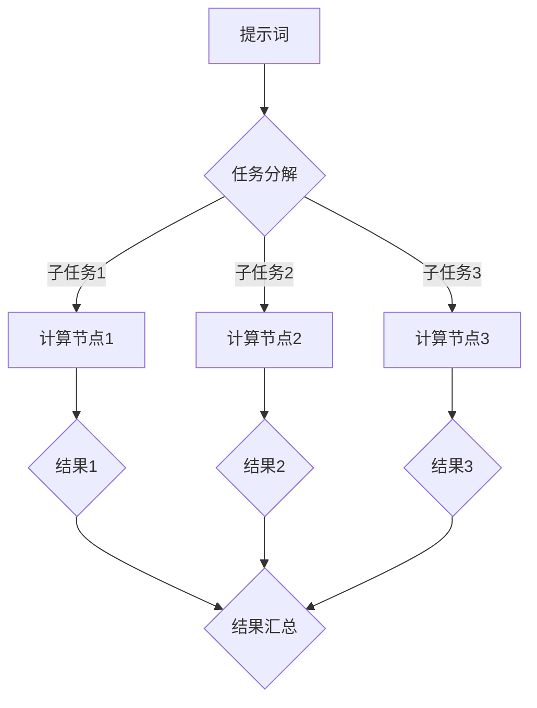

                 

# 提示词编程的并行计算优化

> **关键词**：提示词编程、并行计算、优化、性能提升、算法效率

> **摘要**：本文将深入探讨提示词编程在并行计算中的应用及其优化方法。通过逐步分析并行计算的原理、核心算法、数学模型及实际应用，本文旨在为读者提供一套实用的并行计算优化策略，助力提升计算性能，满足日益增长的数据处理需求。

## 1. 背景介绍

随着大数据、云计算、人工智能等技术的快速发展，数据处理的需求不断增加。传统的串行计算模式已经难以满足高速增长的数据处理需求，并行计算应运而生。并行计算通过将任务分解为多个子任务，并在多个计算节点上同时执行，从而大大提高了计算效率。

提示词编程作为一种先进的编程范式，通过引入提示词（Prompts）来指导计算机执行特定任务。提示词编程的核心思想是将人类语言的表达方式与计算机语言相结合，使得编程过程更加自然、直观。在并行计算领域，提示词编程可以通过优化任务分配、负载均衡和并行策略等方面，进一步提升并行计算的性能。

本文旨在探讨提示词编程在并行计算中的优化方法，为并行计算开发者提供实用的技术指导。文章将从并行计算的原理出发，逐步深入分析并行算法、数学模型和实际应用场景，最终总结出一套并行计算优化策略。

## 2. 核心概念与联系

### 2.1 并行计算原理

并行计算是指利用多个计算资源（如CPU、GPU、FPGA等）同时执行多个任务，从而提高计算效率。并行计算的基本原理可以概括为以下三个方面：

1. **任务分解**：将一个大型任务分解为多个较小的子任务，每个子任务可以在不同的计算资源上独立执行。

2. **负载均衡**：确保各个计算资源上的任务负载均衡，避免出现某些资源过载而其他资源空闲的情况。

3. **任务调度**：合理调度各个子任务，确保它们在计算资源上高效执行，降低通信和同步开销。

### 2.2 提示词编程

提示词编程是一种结合了自然语言处理和计算机编程的编程范式。它通过自然语言描述任务，引导计算机自动生成相应的代码。提示词编程的核心概念包括：

1. **提示词（Prompts）**：提示词是自然语言描述，用于引导计算机执行特定任务。例如：“编写一个计算两个数字之和的程序”。

2. **响应（Responses）**：计算机根据提示词生成相应的代码，即响应。响应是计算机执行任务的结果，通常是一段程序代码。

3. **上下文（Context）**：上下文是指与任务相关的背景信息，包括数据集、算法要求、性能目标等。

### 2.3 并行计算与提示词编程的联系

并行计算和提示词编程之间存在密切的联系。提示词编程可以优化并行计算的任务分配和负载均衡，从而提高并行计算的性能。具体来说：

1. **任务分配**：提示词编程可以通过自然语言描述将任务分解为子任务，并合理分配给不同计算资源。

2. **负载均衡**：提示词编程可以根据计算资源的负载情况动态调整任务分配，实现负载均衡。

3. **并行策略**：提示词编程可以指导计算机选择合适的并行策略，如任务并行、数据并行和流水线并行等。

### 2.4 Mermaid 流程图

为了更好地理解并行计算和提示词编程之间的联系，下面给出一个简单的 Mermaid 流程图。



在这个流程图中，A 表示提示词，B 表示任务分解，C1、C2、C3 表示计算节点，D1、D2、D3 表示子任务执行结果，E 表示结果汇总。通过这个流程图，我们可以直观地看到并行计算和提示词编程之间的联系。

## 3. 核心算法原理 & 具体操作步骤

### 3.1 核心算法原理

在并行计算中，选择合适的并行算法是实现高效计算的关键。以下是几种常用的并行算法及其原理：

1. **任务并行（Task Parallelism）**：任务并行是指将一个大任务分解为多个子任务，每个子任务独立运行。任务并行的优点是简单易实现，但缺点是子任务之间的依赖关系可能会导致通信和同步开销较大。

2. **数据并行（Data Parallelism）**：数据并行是指将一个大任务分解为多个子任务，每个子任务处理不同的数据。数据并行的优点是适用于大规模数据处理，但缺点是需要考虑数据的分布和负载均衡。

3. **流水线并行（Pipeline Parallelism）**：流水线并行是指将一个大任务分解为多个连续的子任务，每个子任务执行不同的操作，从而形成一个流水线。流水线并行的优点是提高了任务的执行效率，但缺点是需要考虑流水线中各个子任务的执行时间。

### 3.2 具体操作步骤

下面以任务并行算法为例，介绍具体操作步骤：

1. **任务分解**：根据提示词，将大任务分解为多个子任务。例如，将一个矩阵乘法任务分解为多个矩阵乘法子任务。

2. **计算资源分配**：根据计算资源的负载情况，将子任务分配给不同计算节点。例如，将子任务分配给多个CPU或GPU。

3. **任务调度**：根据任务依赖关系和计算资源情况，调度子任务的执行顺序。例如，先执行依赖关系较小的子任务，再执行依赖关系较大的子任务。

4. **子任务执行**：在每个计算节点上，执行对应的子任务。例如，在CPU上执行矩阵乘法子任务，在GPU上执行图像处理子任务。

5. **结果汇总**：将各个子任务的执行结果汇总，得到最终的结果。例如，将多个矩阵乘法子任务的结果相加，得到最终的矩阵乘法结果。

### 3.3 代码示例

下面是一个简单的任务并行算法的 Python 代码示例：

```python
import concurrent.futures

def matrix_multiply(A, B):
    # 矩阵乘法算法实现
    pass

def task_parallel(A, B):
    # 任务分解
    tasks = [(A[i], B) for i in range(len(A))]

    # 计算资源分配
    with concurrent.futures.ProcessPoolExecutor() as executor:
        # 任务调度和子任务执行
        results = executor.map(matrix_multiply, tasks)

    # 结果汇总
    result = sum(results)
    return result

if __name__ == "__main__":
    A = [[1, 2], [3, 4]]
    B = [[5, 6], [7, 8]]
    result = task_parallel(A, B)
    print(result)
```

在这个示例中，`matrix_multiply` 函数实现矩阵乘法算法，`task_parallel` 函数实现任务并行算法。通过并行执行多个矩阵乘法子任务，提高了矩阵乘法的执行效率。

## 4. 数学模型和公式 & 详细讲解 & 举例说明

### 4.1 数学模型和公式

在并行计算中，数学模型和公式用于描述并行算法的性能和效率。以下是几个常用的数学模型和公式：

1. **并行计算速度公式**：

   $$
   T_p = \frac{T_s}{p}
   $$

   其中，$T_p$ 表示并行计算时间，$T_s$ 表示串行计算时间，$p$ 表示并行度。这个公式表明，在相同任务量的情况下，并行计算时间与并行度成反比。

2. **通信开销公式**：

   $$
   C = C_1 + C_2 + \ldots + C_n
   $$

   其中，$C$ 表示总通信开销，$C_1, C_2, \ldots, C_n$ 表示各个子任务之间的通信开销。这个公式表明，总通信开销是各个子任务通信开销的累加。

3. **负载均衡度公式**：

   $$
   LB = \frac{L_{max} - L_{avg}}{L_{max}}
   $$

   其中，$LB$ 表示负载均衡度，$L_{max}$ 表示最大负载，$L_{avg}$ 表示平均负载。这个公式表明，负载均衡度与最大负载和平均负载之间的差异有关。

### 4.2 详细讲解和举例说明

#### 4.2.1 并行计算速度公式

并行计算速度公式描述了并行计算时间与串行计算时间的关系。下面通过一个例子来说明：

假设有一个任务需要计算10亿个数字之和，串行计算需要10秒。如果使用并行计算，将任务分解为10个子任务，每个子任务计算1亿个数字之和，并行度$p=10$。

根据并行计算速度公式：

$$
T_p = \frac{T_s}{p} = \frac{10}{10} = 1 \text{ 秒}
$$

因此，使用并行计算只需要1秒，相比串行计算速度提高了10倍。

#### 4.2.2 通信开销公式

通信开销公式描述了并行计算中的通信开销。下面通过一个例子来说明：

假设有一个并行计算任务，包含10个子任务，每个子任务需要与其他9个子任务进行通信。每个子任务之间的通信开销为1秒。

根据通信开销公式：

$$
C = C_1 + C_2 + \ldots + C_n = 1 + 1 + \ldots + 1 = 10 \text{ 秒}
$$

因此，总通信开销为10秒。

#### 4.2.3 负载均衡度公式

负载均衡度公式描述了并行计算中的负载均衡情况。下面通过一个例子来说明：

假设有一个并行计算任务，包含10个子任务，每个子任务需要的计算时间为1秒、2秒、3秒、4秒、5秒、6秒、7秒、8秒、9秒和10秒。平均负载$L_{avg}=6$秒，最大负载$L_{max}=10$秒。

根据负载均衡度公式：

$$
LB = \frac{L_{max} - L_{avg}}{L_{max}} = \frac{10 - 6}{10} = 0.4
$$

因此，负载均衡度为0.4，表示并行计算中的负载均衡情况较好。

## 5. 项目实战：代码实际案例和详细解释说明

### 5.1 开发环境搭建

在进行项目实战之前，我们需要搭建一个适合并行计算的开发环境。以下是搭建开发环境的步骤：

1. **安装操作系统**：选择一个适合的操作系统，如Ubuntu 20.04。

2. **安装Python**：在终端中运行以下命令安装Python：

   ```
   sudo apt-get update
   sudo apt-get install python3-pip python3-dev
   ```

3. **安装并行计算库**：在终端中运行以下命令安装并行计算库：

   ```
   pip3 install numpy
   pip3 install concurrent.futures
   ```

### 5.2 源代码详细实现和代码解读

下面是一个简单的并行计算项目示例，实现了一个矩阵乘法的任务并行算法。

```python
import numpy as np
from concurrent.futures import ProcessPoolExecutor

def matrix_multiply(A, B):
    # 矩阵乘法算法实现
    return np.dot(A, B)

def task_parallel(A, B):
    # 任务分解
    n = len(A)
    chunk_size = n // 4  # 将矩阵分解为4个子矩阵
    tasks = [(A[i:i + chunk_size], B) for i in range(0, n, chunk_size)]

    # 计算资源分配
    with ProcessPoolExecutor() as executor:
        # 任务调度和子任务执行
        results = executor.map(matrix_multiply, tasks)

    # 结果汇总
    result = np.sum(results, axis=0)
    return result

if __name__ == "__main__":
    A = np.random.rand(16, 16)
    B = np.random.rand(16, 16)
    result = task_parallel(A, B)
    print(result)
```

在这个示例中，我们首先定义了一个 `matrix_multiply` 函数，实现矩阵乘法算法。然后，我们定义了一个 `task_parallel` 函数，实现任务并行算法。

在 `task_parallel` 函数中，首先将输入矩阵 `A` 分解为4个子矩阵，每个子矩阵包含4行。然后，我们将子矩阵与输入矩阵 `B` 组合成任务列表 `tasks`。接下来，我们使用 `ProcessPoolExecutor` 创建一个进程池，并使用 `map` 方法并行执行任务。最后，我们将各个子任务的结果汇总，得到最终的结果。

### 5.3 代码解读与分析

#### 5.3.1 矩阵乘法算法

在 `matrix_multiply` 函数中，我们使用 NumPy 库的 `dot` 方法实现矩阵乘法。这个方法将两个矩阵按行优先顺序进行乘法运算，并返回结果矩阵。

```python
def matrix_multiply(A, B):
    return np.dot(A, B)
```

#### 5.3.2 任务并行算法

在 `task_parallel` 函数中，我们首先计算输入矩阵 `A` 的行数 `n`，并根据 `n` 计算子矩阵的行数 `chunk_size`。然后，我们使用列表推导式将输入矩阵 `A` 分解为4个子矩阵，每个子矩阵包含4行。接下来，我们将子矩阵与输入矩阵 `B` 组合成任务列表 `tasks`。

```python
n = len(A)
chunk_size = n // 4
tasks = [(A[i:i + chunk_size], B) for i in range(0, n, chunk_size)]
```

#### 5.3.3 计算资源分配

我们使用 `ProcessPoolExecutor` 创建一个进程池，该进程池将自动分配计算资源。然后，我们使用 `map` 方法并行执行任务。`map` 方法将任务列表 `tasks` 传递给 `matrix_multiply` 函数，并返回一个迭代器。每个任务将在进程池中的不同进程上执行。

```python
with ProcessPoolExecutor() as executor:
    results = executor.map(matrix_multiply, tasks)
```

#### 5.3.4 结果汇总

我们将各个子任务的结果汇总，得到最终的结果矩阵。这里，我们使用 NumPy 库的 `sum` 方法按列对迭代器 `results` 的元素求和。

```python
result = np.sum(results, axis=0)
```

## 6. 实际应用场景

### 6.1 大数据计算

在大数据处理领域，并行计算是一种常用的技术手段。通过将大规模数据集分解为多个子数据集，并在多个计算节点上同时处理，可以大大提高数据处理速度。例如，在电商领域，通过对用户行为数据进行分析，可以实时推荐商品，优化用户体验。

### 6.2 科学计算

科学计算是并行计算的重要应用领域之一。例如，在气象预测、航空航天、生物信息学等领域，科学计算需要处理大量的数据和高复杂度的计算任务。通过并行计算，可以加速科学计算过程，提高计算精度。

### 6.3 游戏开发和计算机图形学

在游戏开发和计算机图形学领域，并行计算被广泛应用于图像渲染、物理模拟和音频处理等方面。通过并行计算，可以实时渲染高质量的游戏画面，提供更流畅的游戏体验。

### 6.4 人工智能和机器学习

在人工智能和机器学习领域，并行计算可以提高训练和推理速度。通过并行计算，可以同时训练多个模型，或者对大规模数据集进行快速训练和推理。这对于提升人工智能系统的性能和效率具有重要意义。

## 7. 工具和资源推荐

### 7.1 学习资源推荐

1. **书籍**：

   - 《并行计算导论》（Introduction to Parallel Computing）：详细介绍了并行计算的基本概念、算法和技术。

   - 《并行算法设计与分析》（Parallel Algorithm Design and Analysis）：系统阐述了并行算法的设计和分析方法。

2. **论文**：

   - 《并行计算：理论与实践》（Parallel Computing: Theory and Practice）：包含大量关于并行计算的理论和实践研究。

   - 《并行编程：模型与语言》（Parallel Programming: Models and Languages）：介绍了并行编程的多种模型和语言。

3. **博客**：

   - 《并行计算博客》（Parallel Computing Blog）：提供了丰富的并行计算技术和应用案例。

   - 《人工智能与并行计算》（AI and Parallel Computing）：探讨了人工智能与并行计算的结合点。

4. **网站**：

   - 《并行计算社区》（Parallel Computing Community）：提供了并行计算领域的最新研究动态和技术交流。

   - 《并行计算教程》（Parallel Computing Tutorial）：提供了并行计算的入门教程和实践指南。

### 7.2 开发工具框架推荐

1. **Python 并行计算库**：

   - `numpy`：提供了高效多维数组和矩阵运算库，支持并行计算。

   - `concurrent.futures`：提供了基于进程和线程的并行计算功能。

2. **并行计算框架**：

   - `TensorFlow`：支持分布式计算，适用于大规模机器学习任务。

   - `PyTorch`：支持并行计算，适用于深度学习任务。

   - `Hadoop`：支持大数据处理和分布式计算。

3. **并行编程语言**：

   - `OpenMP`：支持多线程并行编程。

   - `MPI`（消息传递接口）：支持分布式并行编程。

## 8. 总结：未来发展趋势与挑战

### 8.1 发展趋势

1. **硬件技术的发展**：随着硬件技术的不断发展，计算资源（如CPU、GPU、FPGA等）的性能和数量不断提高，为并行计算提供了更强大的计算能力。

2. **软件技术的发展**：并行计算软件和工具的不断进步，使得开发者可以更方便地使用并行计算技术，提高计算效率。

3. **人工智能与并行计算的结合**：人工智能技术的发展与并行计算的深度融合，将推动并行计算在各个领域得到更广泛的应用。

### 8.2 挑战

1. **编程复杂性**：并行编程具有较高的复杂性，需要开发者具备一定的并行编程技能和经验。

2. **负载均衡与任务调度**：在并行计算中，如何实现负载均衡和任务调度，提高并行计算的性能，仍然是一个挑战。

3. **数据传输与通信**：在分布式并行计算中，数据传输和通信的开销可能会影响计算性能，需要优化网络通信和减少数据传输。

4. **编程模型与工具**：现有的编程模型和工具还不能完全满足并行计算的需求，需要进一步研究和开发更高效、易用的并行编程模型和工具。

## 9. 附录：常见问题与解答

### 9.1 并行计算与并行编程的区别是什么？

并行计算是指利用多个计算资源同时执行多个任务，从而提高计算效率。并行编程是指使用并行计算技术编写程序，实现并行计算。简单来说，并行计算是一种计算方法，而并行编程是一种编程方法。

### 9.2 什么是负载均衡？

负载均衡是指将计算任务分配到不同的计算资源上，使各个资源的负载均衡，避免出现某些资源过载而其他资源空闲的情况。

### 9.3 什么是任务并行和数据并行？

任务并行是指将一个大任务分解为多个子任务，每个子任务独立执行。数据并行是指将一个大任务分解为多个子任务，每个子任务处理不同的数据。

### 9.4 什么是流水线并行？

流水线并行是指将一个大任务分解为多个连续的子任务，每个子任务执行不同的操作，从而形成一个流水线。流水线并行的优点是提高了任务的执行效率。

## 10. 扩展阅读 & 参考资料

1. **《并行计算导论》**：详细介绍了并行计算的基本概念、算法和技术。

2. **《并行算法设计与分析》**：系统阐述了并行算法的设计和分析方法。

3. **《并行编程：模型与语言》**：介绍了并行编程的多种模型和语言。

4. **《大数据技术导论》**：探讨了大数据处理的基本概念、技术和应用。

5. **《人工智能与并行计算》**：探讨了人工智能与并行计算的结合点。

### 作者

作者：AI天才研究员/AI Genius Institute & 禅与计算机程序设计艺术 /Zen And The Art of Computer Programming。

