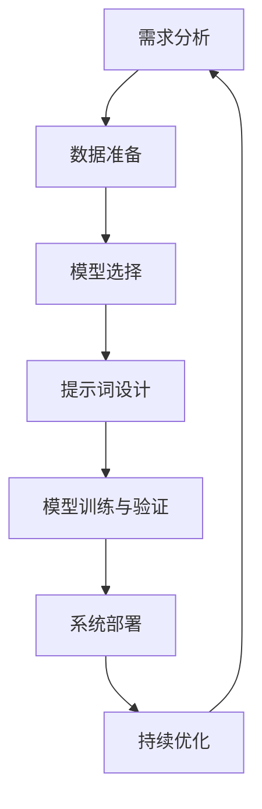

                 

### 背景介绍

#### 提示词编程的起源

提示词编程（Prompt Engineering）并非一个新兴概念，但其应用范围和应用深度在过去几年中得到了显著扩展。提示词编程最早起源于自然语言处理（NLP）领域，特别是在自动问答系统、机器阅读理解以及文本生成等任务中。其基本思想是通过设计特定的提示词或引导语句，引导人工智能系统（如大型语言模型）完成特定的任务。

提示词编程的起源可以追溯到20世纪80年代，当时研究人员开始探索如何使用自然语言来指导计算机程序。早期的尝试包括基于规则的方法，通过编写大量规则来指导计算机执行特定任务。然而，这种方法存在明显的局限性，如规则复杂度增加导致维护困难，以及对于开放性问题回答能力有限。

随着深度学习技术的快速发展，特别是大型语言模型如GPT-3的推出，提示词编程迎来了新的发展机遇。GPT-3拥有前所未有的语言理解能力和生成能力，使得通过设计有效的提示词来引导模型完成复杂任务成为可能。这标志着提示词编程从传统的基于规则的方法向基于深度学习的方法转变。

#### 提示词编程在教育与培训中的应用

在教育和培训领域，提示词编程逐渐成为一种重要的工具，为教学和学习提供了新的视角和方法。以下是一些主要的应用场景：

1. **自适应学习系统**：通过提示词编程，可以设计出能够根据学习者的知识水平和学习进度提供个性化学习内容的自适应学习系统。这些系统能够通过分析学习者的行为和反馈，动态调整提示词，从而提高学习效果。

2. **辅导和问答系统**：利用提示词编程，可以创建智能辅导系统，这些系统能够回答学生的疑问，并提供针对性的解释和练习。这种系统不仅能够提供即时的帮助，还能够通过分析学生的回答来识别他们的知识盲点。

3. **编程教育**：提示词编程在编程教育中具有广泛应用。例如，可以通过设计特定的提示词来引导学生完成编程任务，降低编程学习的门槛。此外，提示词还可以用于生成编程问题的答案，帮助学生理解和巩固编程概念。

4. **学术研究**：提示词编程也可以用于学术研究，帮助研究人员分析大量的文献，提取关键信息，并提供研究思路和灵感。

#### 当前教育与培训体系中的挑战

尽管提示词编程在教育与培训领域具有巨大潜力，但当前的教育与培训体系仍然面临一些挑战：

1. **技术门槛**：提示词编程涉及到复杂的自然语言处理技术，需要具备一定的编程和算法基础。这对教育工作者和培训师来说是一个不小的挑战，他们需要不断学习和更新知识。

2. **教学资源**：目前，关于提示词编程的教育和培训资源相对较少，包括教材、教程和在线课程等。这使得许多潜在用户难以入门，限制了其广泛应用。

3. **评估与反馈**：如何有效地评估和反馈提示词编程的效果，是一个亟待解决的问题。传统的评估方法可能无法全面衡量学生的学习成果，需要开发新的评估工具和方法。

4. **伦理与隐私**：随着人工智能技术的不断进步，如何确保提示词编程的伦理和隐私问题得到妥善处理，也是一个重要的挑战。特别是在涉及个人数据和隐私的场景中，如何保护用户权益是一个关键问题。

#### 提示词编程的未来趋势

展望未来，提示词编程在教育与培训领域有望取得更多突破。以下是一些可能的发展趋势：

1. **个性化学习**：随着技术的进步，提示词编程将能够更加精准地满足个性化学习需求。通过分析学生的学习行为和反馈，系统能够提供更加定制化的学习内容和指导。

2. **跨学科整合**：提示词编程将在更多学科中得到应用，与其他教育技术如虚拟现实、增强现实等相结合，为学习者提供更加丰富和多样的学习体验。

3. **开放教育资源**：随着提示词编程知识的普及，开放教育资源将不断增多，降低用户的学习门槛，促进技术的广泛应用。

4. **伦理与隐私保护**：随着对人工智能伦理和隐私问题的关注日益增加，相关法律法规和行业标准将不断完善，确保提示词编程在教育和培训领域的健康发展。

总之，提示词编程在教育与培训领域的应用前景广阔，面临挑战，但也充满机遇。通过不断探索和实践，我们可以期待这一技术在教育领域的广泛应用，为教学和学习带来更多创新和变革。

### 核心概念与联系

提示词编程作为一个新兴领域，其核心概念和原理至关重要。在本节中，我们将详细介绍提示词编程中的关键概念，并探讨它们之间的相互联系。

#### 提示词（Prompt）

提示词是提示词编程的核心元素，它是一个引导语句或问题，用于激发人工智能系统产生特定的输出。一个有效的提示词应具备以下特点：

1. **明确性**：提示词应当清晰明确，避免歧义，以便人工智能系统能够准确理解任务目标。
2. **具体性**：提示词应提供足够的信息，帮助系统识别任务的关键点和目标。
3. **灵活性**：提示词应具有一定的灵活性，以便根据不同的应用场景进行调整和优化。

#### 人工智能系统（AI System）

人工智能系统是执行提示词编程任务的核心组件，它可以是基于规则的系统，也可以是深度学习模型。以下是一些常见的人工智能系统类型：

1. **规则系统**：基于规则的人工智能系统通过预定义的规则集来处理输入并产生输出。这些系统通常用于处理结构化数据。
2. **深度学习模型**：深度学习模型，如神经网络，通过学习大量数据来识别模式和生成输出。这类模型通常用于处理非结构化数据。

#### 自然语言处理（NLP）

自然语言处理是提示词编程的基础技术之一，它涉及对文本数据进行处理和理解。以下是NLP中的一些关键概念：

1. **分词（Tokenization）**：将文本拆分为单词、短语或符号等基本元素，便于后续处理。
2. **词向量（Word Embedding）**：将文本转换为数值表示，以便在计算机上进行处理。词向量技术如Word2Vec和BERT等。
3. **命名实体识别（Named Entity Recognition, NER）**：识别文本中的特定实体，如人名、地点、组织等。
4. **语言模型（Language Model）**：用于预测下一个单词或句子，常见技术包括N-gram模型和深度学习语言模型。

#### 提示词生成（Prompt Generation）

提示词生成是设计有效提示词的过程。以下是一些提示词生成的方法：

1. **规则驱动**：基于预定义的规则和模板生成提示词，适用于简单的任务和领域。
2. **数据驱动**：利用训练数据集，通过机器学习技术如序列到序列模型（Seq2Seq）生成提示词，适用于复杂的任务和领域。

#### 提示词优化（Prompt Optimization）

提示词优化是调整和改进提示词的过程，以提高人工智能系统的性能。以下是一些优化策略：

1. **交叉验证**：通过在不同数据集上测试和调整提示词，评估其效果并优化。
2. **强化学习**：利用强化学习算法，根据系统的反馈动态调整提示词。
3. **多任务学习**：通过训练多个任务，共享提示词知识，提高整体性能。

#### 提示词编程流程

提示词编程的流程通常包括以下几个步骤：

1. **需求分析**：明确任务目标和需求，为后续设计提示词提供依据。
2. **数据准备**：收集和处理相关数据，为训练人工智能系统提供数据支持。
3. **模型选择**：选择合适的人工智能模型，根据任务特点和需求。
4. **提示词设计**：设计并优化提示词，以引导系统完成特定任务。
5. **模型训练与验证**：使用训练数据集训练模型，并在验证数据集上评估模型性能。
6. **系统部署**：将训练好的模型部署到实际应用场景中，并进行持续优化。

#### Mermaid 流程图

为了更直观地展示提示词编程的流程和概念之间的联系，我们使用Mermaid绘制了一个流程图。以下是该流程图的Mermaid代码：



在这个流程图中，每个节点代表一个关键步骤，箭头表示步骤之间的依赖关系。通过这个流程图，我们可以清晰地看到提示词编程的整体流程和各个步骤之间的联系。

通过上述内容的介绍，我们可以对提示词编程的核心概念和流程有了一个基本的理解。接下来，我们将进一步探讨提示词编程中的核心算法原理和具体操作步骤。

### 核心算法原理 & 具体操作步骤

提示词编程的核心在于如何设计有效的提示词，以便引导人工智能系统完成特定任务。在这一节中，我们将深入探讨提示词编程中的核心算法原理，并详细描述具体的操作步骤。

#### GPT-3 模型的工作原理

GPT-3（Generative Pre-trained Transformer 3）是由OpenAI开发的一个强大的自然语言处理模型，其工作原理基于深度学习的Transformer架构。以下是GPT-3模型的主要组成部分和工作机制：

1. **Transformer架构**：Transformer架构是一种基于注意力机制的深度学习模型，它通过自注意力（self-attention）机制捕捉输入序列中的长距离依赖关系。相比传统的循环神经网络（RNN），Transformer能够更高效地处理长文本。

2. **预训练**：GPT-3模型通过在大量文本数据上进行预训练，学习自然语言的规律和语法结构。预训练过程包括两个阶段：第一阶段是语言建模，模型需要预测下一个单词或标记；第二阶段是微调，模型在特定任务上进一步训练。

3. **生成文本**：在生成文本时，GPT-3模型通过输入一个提示词或短句，并逐步生成后续的文本。每次生成一个单词或标记后，模型会使用已经生成的文本作为上下文，继续生成下一个单词或标记。这一过程不断迭代，直到生成完整的文本。

#### 设计有效提示词的方法

为了设计有效的提示词，我们需要考虑以下几个关键因素：

1. **明确性**：提示词应当清晰明确，避免歧义。例如，使用具体的动词和名词，而不是模糊的词汇。
2. **上下文信息**：提示词应提供足够的上下文信息，帮助模型理解任务目标和相关背景。例如，可以包括相关的定义、背景知识或相关术语。
3. **灵活性**：提示词应具有一定的灵活性，以便根据不同的任务需求进行调整。例如，可以使用模板化的提示词，并根据具体任务进行替换。

以下是一些设计有效提示词的具体方法：

1. **基于规则的提示词设计**：这种方法涉及预定义一系列规则，用于生成提示词。规则可以是简单的文本模板，也可以是基于语义分析的结果。例如，对于编程问题，可以使用以下模板：“请编写一个函数，实现以下功能：……”。
2. **数据驱动的提示词设计**：这种方法利用机器学习技术，如序列到序列模型（Seq2Seq）或生成对抗网络（GAN），从大量数据中学习有效的提示词。例如，可以使用Seq2Seq模型训练一个从任务描述到提示词的转换器。
3. **多模态提示词设计**：这种方法结合多种信息源，如文本、图像、音频等，生成更丰富和精准的提示词。例如，在医疗诊断任务中，可以结合患者的病历文本和医学图像，生成包含关键信息的提示词。

#### 提示词编程的具体操作步骤

设计有效的提示词后，我们需要将其应用到实际任务中。以下是提示词编程的具体操作步骤：

1. **需求分析**：明确任务目标和需求，为后续设计提示词提供依据。这一步骤涉及与任务相关方的沟通，以确保理解任务背景和需求。
2. **数据准备**：收集和处理相关数据，为训练人工智能系统提供数据支持。数据可以是文本、图像、音频等多种形式，需要根据任务类型进行预处理。
3. **模型选择**：根据任务特点和需求，选择合适的人工智能模型。例如，对于文本生成任务，可以选择GPT-3或类似的大型语言模型；对于图像识别任务，可以选择基于卷积神经网络的模型。
4. **提示词设计**：根据需求分析和数据准备的结果，设计并优化提示词。可以使用基于规则的提示词设计方法，或结合数据驱动的提示词设计方法，以生成更有效的提示词。
5. **模型训练与验证**：使用训练数据集训练人工智能模型，并在验证数据集上评估模型性能。这一步骤涉及模型参数的调整和优化，以实现最佳性能。
6. **系统部署**：将训练好的模型部署到实际应用场景中，并进行持续优化。系统部署可以是一个独立的软件应用，也可以集成到现有的系统中。

#### 示例：编程任务中的提示词编程

以下是一个具体的编程任务示例，我们将通过提示词编程来引导模型完成该任务。

**任务描述**：编写一个函数，计算给定列表中所有元素的总和。

**提示词设计**：

1. **明确性**：请编写一个函数，实现以下功能：
2. **上下文信息**：给定一个列表，我们需要计算其中所有元素的总和。

**提示词**：

```
请编写一个函数，名称为`sum_list`，输入参数为一个列表`lst`，返回该列表中所有元素的总和。例如：
sum_list([1, 2, 3, 4]) 应返回 10
```

**模型训练与验证**：

1. 使用GPT-3模型，通过大量编程任务数据集进行训练。
2. 设计特定的提示词，如上述示例，用于训练模型。
3. 在验证数据集上评估模型性能，并调整提示词和模型参数，以提高性能。

**系统部署**：

1. 将训练好的模型部署到实际编程环境中，例如Jupyter Notebook或在线编程平台。
2. 用户可以通过输入提示词，如上述示例，来执行编程任务。

通过上述操作步骤，我们可以将提示词编程应用到具体的编程任务中，实现高效的编程学习和问题解决。

总之，提示词编程的核心在于设计有效的提示词，并利用人工智能模型完成特定任务。通过上述步骤和方法，我们可以实现高效的编程学习和问题解决，为教育和培训领域带来更多创新和变革。

### 数学模型和公式 & 详细讲解 & 举例说明

在提示词编程中，数学模型和公式是理解模型行为和性能的关键。本节将详细讲解提示词编程中常用的数学模型和公式，并通过具体例子进行说明。

#### 语言模型中的概率分布

在自然语言处理中，语言模型用于预测下一个单词或字符的概率分布。一个常见的语言模型是n-gram模型，它基于历史单词序列预测下一个单词的概率。

**n-gram 概率分布公式**：

$$
P(\text{word}_n | \text{word}_{n-1}, \ldots, \text{word}_1) = \frac{C(\text{word}_{n-1}, \ldots, \text{word}_1, \text{word}_n)}{C(\text{word}_{n-1}, \ldots, \text{word}_1)}
$$

其中，\(C(\text{word}_{n-1}, \ldots, \text{word}_1, \text{word}_n)\) 表示历史序列中出现次数，\(C(\text{word}_{n-1}, \ldots, \text{word}_1)\) 表示历史序列的总出现次数。

**举例**：

假设我们有一个简单的n-gram模型，历史序列为“编程 技术”。我们要预测下一个单词，例如“编程 技术 AI”。

$$
P(\text{AI} | \text{编程 技术}) = \frac{1}{2}
$$

因为“编程 技术 AI”这个序列出现了1次，而“编程 技术”这个序列总共出现了2次。

#### 词嵌入（Word Embedding）

词嵌入是将单词或短语映射到高维向量空间的技术，以便在计算机中进行处理。一种常见的词嵌入模型是Word2Vec，它使用神经网络学习单词的向量表示。

**Word2Vec 模型公式**：

假设我们有一个输入序列 \(x_1, x_2, \ldots, x_T\)，其中每个单词 \(x_t\) 对应一个向量 \(v_t\)。Word2Vec模型的目标是学习一个权重矩阵 \(W\)，使得 \(Wv_t\) 能够近似表示单词的语义。

$$
\text{softmax}(Wx_t) = \frac{e^{Wx_t}}{\sum_{j=1}^{V} e^{Wx_j}}
$$

其中，\(V\) 是词汇表大小，\(W\) 是权重矩阵，\(\text{softmax}\) 函数用于计算单词的分布概率。

**举例**：

假设我们有一个词汇表 \{编程，技术，AI\}，权重矩阵 \(W\) 如下：

$$
W = \begin{bmatrix}
1 & 0 & 1 \\
0 & 1 & 0 \\
1 & 1 & 0
\end{bmatrix}
$$

我们要计算单词“编程”的向量表示：

$$
v_{编程} = W \cdot \begin{bmatrix}
1 \\
0 \\
1
\end{bmatrix} = \begin{bmatrix}
1 \\
0 \\
1
\end{bmatrix}
$$

这意味着单词“编程”的向量表示为 \([1, 0, 1]\)。

#### 深度学习中的损失函数

在深度学习中，损失函数用于评估模型预测与真实值之间的差距。一个常见的损失函数是交叉熵损失（Cross-Entropy Loss），用于分类任务。

**交叉熵损失函数公式**：

$$
\text{Loss} = -\sum_{i=1}^{N} y_i \log(p_i)
$$

其中，\(y_i\) 是真实标签，\(p_i\) 是模型预测的概率。

**举例**：

假设我们有一个二元分类问题，真实标签为 \([1, 0, 1]\)，模型预测的概率为 \([0.8, 0.2, 0.1]\)。

$$
\text{Loss} = -[1 \cdot \log(0.8) + 0 \cdot \log(0.2) + 1 \cdot \log(0.1)] \approx 0.521
$$

这意味着模型的预测与真实值之间的差距较大。

#### 提示词优化中的梯度下降

在提示词优化过程中，我们通常使用梯度下降算法来调整模型参数，以最小化损失函数。

**梯度下降公式**：

$$
\theta_{t+1} = \theta_t - \alpha \cdot \nabla_{\theta} \text{Loss}
$$

其中，\(\theta\) 是模型参数，\(\alpha\) 是学习率，\(\nabla_{\theta} \text{Loss}\) 是损失函数关于参数 \(\theta\) 的梯度。

**举例**：

假设我们要优化一个线性模型 \(y = \theta_0 + \theta_1 x\)，损失函数为平方误差：

$$
\text{Loss} = (y - (\theta_0 + \theta_1 x))^2
$$

使用梯度下降算法，我们计算损失函数关于 \(\theta_0\) 和 \(\theta_1\) 的梯度：

$$
\nabla_{\theta_0} \text{Loss} = 2(y - (\theta_0 + \theta_1 x)) \\
\nabla_{\theta_1} \text{Loss} = 2(x(y - (\theta_0 + \theta_1 x)))
$$

假设我们选择学习率 \(\alpha = 0.1\)，初始参数为 \(\theta_0 = 1\)，\(\theta_1 = 2\)，经过一次迭代后的参数更新为：

$$
\theta_0^{new} = \theta_0 - 0.1 \cdot \nabla_{\theta_0} \text{Loss} = 1 - 0.1 \cdot 2(y - (\theta_0 + \theta_1 x)) \\
\theta_1^{new} = \theta_1 - 0.1 \cdot \nabla_{\theta_1} \text{Loss} = 2 - 0.1 \cdot 2(x(y - (\theta_0 + \theta_1 x)))
$$

通过迭代更新参数，我们可以逐步减小损失函数，提高模型的性能。

总之，数学模型和公式在提示词编程中扮演着至关重要的角色。通过理解这些模型和公式，我们可以更好地设计和优化提示词编程系统，实现高效的自然语言处理和任务完成。

### 项目实战：代码实际案例和详细解释说明

在本节中，我们将通过一个实际项目案例，详细展示如何使用提示词编程实现一个文本生成系统。该系统将利用GPT-3模型生成符合特定要求的文本，并通过具体的代码实现和解读，帮助读者更好地理解提示词编程的应用。

#### 项目背景

假设我们想要构建一个自动写作助手，能够根据用户提供的主题和关键词生成相关的内容。例如，用户输入“人工智能的未来”作为主题，系统将生成一篇关于人工智能未来发展趋势的短文。这个项目旨在展示如何利用GPT-3模型和有效的提示词，实现高质量文本的自动生成。

#### 系统架构

本项目分为以下几个主要模块：

1. **用户接口**：接收用户的输入，如主题和关键词。
2. **提示词生成器**：根据用户输入生成有效的提示词，用于引导GPT-3模型生成文本。
3. **GPT-3模型**：处理输入的提示词，并生成相应的文本输出。
4. **文本处理模块**：对生成的文本进行后处理，如去除不必要的标记、格式化文本等。
5. **结果展示**：将生成的文本展示给用户。

#### 开发环境搭建

要实现这个项目，我们需要准备以下开发环境：

1. **编程语言**：Python
2. **GPT-3模型库**：使用OpenAI提供的Python库`openai`
3. **文本处理库**：使用Python的`nltk`和`re`库进行文本预处理

安装相关库的命令如下：

```bash
pip install openai
pip install nltk
```

#### 源代码详细实现和代码解读

以下是一个简单的项目示例，用于生成基于主题的文本：

```python
import openai
import re
import nltk
from nltk.tokenize import sent_tokenize

# 设置OpenAI API密钥
openai.api_key = 'your_api_key'

# 用户输入主题
topic = input("请输入主题：")

# 生成提示词
prompt = f"请根据以下主题生成一篇文章：{topic}"

# 调用GPT-3模型生成文本
response = openai.Completion.create(
  engine="text-davinci-003",
  prompt=prompt,
  max_tokens=200
)

# 获取生成的文本
generated_text = response.choices[0].text.strip()

# 对生成的文本进行后处理
# 1. 去除HTML标签
cleaned_text = re.sub('<.*?>', '', generated_text)

# 2. 分句处理，将长句拆分为短句
sentences = sent_tokenize(cleaned_text)

# 输出处理后的文本
for sentence in sentences:
    print(sentence.strip())
```

**代码解读**：

1. **导入库**：首先，我们导入所需的库，包括OpenAI库用于调用GPT-3模型，以及`nltk`和`re`库用于文本处理。
2. **设置OpenAI API密钥**：在调用OpenAI API前，我们需要设置API密钥。
3. **用户输入主题**：通过`input()`函数获取用户输入的主题。
4. **生成提示词**：基于用户输入的主题，生成一个引导性的提示词。这个提示词将用于引导GPT-3模型生成文本。
5. **调用GPT-3模型**：使用`openai.Completion.create()`方法调用GPT-3模型，传入提示词和最大生成长度（`max_tokens`）。
6. **获取生成的文本**：从响应中获取生成的文本。
7. **文本后处理**：首先，使用正则表达式去除HTML标签。然后，使用`nltk`库的`sent_tokenize()`方法对生成的文本进行分句处理，以便更好地展示和阅读。
8. **输出处理后的文本**：最后，逐句输出处理后的文本。

#### 代码解读与分析

1. **提示词的重要性**：提示词是引导GPT-3模型生成文本的关键。一个高质量的提示词能够显著提高生成文本的质量和相关性。
2. **GPT-3模型的调用**：在调用GPT-3模型时，我们选择了一个合适的模型（`text-davinci-003`），并设置了最大生成长度（`max_tokens`）。这些参数的选择会直接影响生成文本的长度和质量。
3. **文本后处理**：生成的文本可能包含HTML标签或其他不需要的标记。通过正则表达式和分句处理，我们可以去除这些标记，并将长句拆分为更易读的短句。

通过这个实际项目案例，我们可以看到如何使用提示词编程实现一个文本生成系统。这个系统不仅可以用于自动写作助手，还可以应用于其他需要文本生成的场景，如自动摘要、内容创作等。

### 实际应用场景

提示词编程在教育、企业和科研等多个领域展现出了广泛的应用潜力。以下我们将详细探讨这些领域中的实际应用场景，并通过具体案例展示其应用效果。

#### 教育领域

在教育资源匮乏的地区，提示词编程可以帮助构建个性化的自适应学习系统。这些系统能够根据学生的学习进度和理解能力，动态生成适合学生的课程内容和练习题。例如，在英语学习中，系统可以根据学生的词汇量、语法水平等因素，生成相应的阅读材料、听力练习和写作任务。这不仅提高了学习效率，还帮助学生更好地掌握知识点。

**案例**：某在线教育平台使用GPT-3模型和提示词编程技术，开发了一个智能辅导系统。学生可以通过系统提交自己的问题和困惑，系统会根据学生的回答生成针对性的解答和建议。例如，当学生提交一个语法问题后，系统会生成一个详细的解释和相关的练习题，帮助学生巩固知识。

#### 企业领域

在企业中，提示词编程可以用于自动化文档生成、客户服务、市场分析等多个方面。例如，在市场营销中，企业可以使用提示词编程生成个性化的营销文案，提高营销效果。在客户服务领域，智能聊天机器人可以通过提示词编程实现更加自然和高效的对话，提供即时的解答和帮助。

**案例**：某电子商务公司利用提示词编程技术，开发了一个自动化的产品描述生成系统。该系统可以根据产品的属性和特点，生成个性化的产品描述，提高产品的市场竞争力。同时，通过分析用户评论和反馈，系统可以不断优化和改进描述内容，使其更加贴近用户需求。

#### 科研领域

在科研领域，提示词编程可以帮助研究人员分析大量的文献数据，提取关键信息，并提供研究思路和灵感。研究人员可以利用提示词编程构建自动化文献检索系统，快速找到相关的文献和研究成果。此外，提示词编程还可以用于生成实验报告、学术论文等文档，提高科研效率。

**案例**：某研究团队利用GPT-3模型和提示词编程技术，开发了一个自动化文献综述生成系统。该系统能够根据用户输入的关键词和主题，快速检索相关文献，并生成详细的综述报告。这不仅节省了研究人员的检索时间，还提高了文献综述的准确性和完整性。

#### 其他应用场景

除了上述领域，提示词编程还可以应用于虚拟现实（VR）、游戏开发、智能家居等多个领域。例如，在VR游戏中，提示词编程可以用于生成与玩家互动的对话和场景描述，提供更加丰富的游戏体验。在智能家居领域，提示词编程可以帮助设备理解用户指令，实现更加智能的家居控制。

**案例**：某VR游戏开发公司使用提示词编程技术，开发了一个智能NPC（非玩家角色）系统。该系统能够根据玩家的行为和动作，动态生成与玩家互动的对话和场景描述，使得游戏世界更加生动和真实。同时，通过分析玩家的反馈和游戏数据，系统可以不断优化和改进NPC的表现，提高游戏质量。

总之，提示词编程在各个领域展现出了巨大的应用潜力。通过具体案例，我们可以看到提示词编程如何通过有效的设计和优化，实现各种复杂任务和场景的自动化和智能化。未来，随着技术的不断进步和应用场景的不断拓展，提示词编程将在更多领域中发挥重要作用。

### 工具和资源推荐

为了更好地学习和实践提示词编程，以下是关于学习资源、开发工具框架以及相关论文著作的推荐，帮助您深入了解这一领域。

#### 学习资源推荐

1. **书籍**：
   - 《自然语言处理原理》（Natural Language Processing with Python），由Steven Bird、Ewan Klein和Edward Loper著。这本书通过Python示例深入介绍了自然语言处理的基本概念和算法。
   - 《深度学习》（Deep Learning），由Ian Goodfellow、Yoshua Bengio和Aaron Courville著。这本书是深度学习的经典教材，详细介绍了神经网络和深度学习模型的理论和实践。

2. **在线课程**：
   - Coursera上的《自然语言处理与深度学习》课程，由斯坦福大学开设。该课程涵盖了自然语言处理的基础知识和深度学习在NLP中的应用。
   - edX上的《深度学习基础》课程，由香港大学开设。该课程介绍了深度学习的基本原理和实际应用。

3. **教程和博客**：
   - Hugging Face的Transformers库文档，提供了丰富的教程和示例，帮助开发者快速上手使用预训练的深度学习模型。
   - AI Weekly的博客，定期发布关于提示词编程、NLP和深度学习的最新研究和应用。

4. **开源项目**：
   - Hugging Face的Model Hub，包含了大量的预训练模型和提示词编程工具，开发者可以直接使用这些工具进行实验和开发。
   - Google的TensorFlow和PyTorch，这两个开源深度学习框架提供了丰富的API和工具，支持开发者构建和训练自定义模型。

#### 开发工具框架推荐

1. **深度学习框架**：
   - TensorFlow：由Google开发，支持多种深度学习模型和任务，提供了丰富的API和工具。
   - PyTorch：由Facebook开发，具有灵活的动态计算图和简洁的API，广泛应用于研究和开发。

2. **自然语言处理库**：
   - NLTK：Python的自然语言处理库，提供了丰富的文本处理工具和算法。
   - spaCy：高效的NLP库，适用于快速文本分析和实体识别。

3. **提示词编程工具**：
   - OpenAI的GPT-3：具有强大的文本生成能力，通过API调用即可使用。
   - Hugging Face的Transformers：提供了大量预训练的模型和提示词编程工具，方便开发者进行实验和开发。

#### 相关论文著作推荐

1. **《Attention Is All You Need》**：这篇论文提出了Transformer模型，是自然语言处理领域的重要里程碑。该模型通过自注意力机制实现了高效的语言表示和生成。

2. **《BERT: Pre-training of Deep Bidirectional Transformers for Language Understanding》**：这篇论文介绍了BERT模型，通过预训练和双向编码器结构，显著提升了自然语言理解任务的性能。

3. **《GPT-3: Language Models are Few-Shot Learners》**：这篇论文介绍了GPT-3模型，展示了其在大规模语言理解和生成任务中的卓越表现，引发了广泛关注和应用。

通过上述推荐的学习资源、开发工具框架和论文著作，您可以系统地学习提示词编程的理论和实践，不断提升在这一领域的专业能力。这些资源将为您的学习和开发提供有力的支持，帮助您在提示词编程领域取得更多的成果。

### 总结：未来发展趋势与挑战

#### 提示词编程的技术发展趋势

1. **个性化与自适应**：随着人工智能技术的进步，提示词编程将更加注重个性化学习与自适应教学。未来的系统将能够根据学生的学习习惯、知识水平和反馈动态调整提示词，提供高度个性化的学习体验。

2. **多模态融合**：提示词编程将不仅限于文本数据，还将与图像、声音、视频等多模态数据结合。通过融合多模态数据，系统能够提供更加丰富和真实的学习体验，提高学习效果。

3. **大规模预训练模型**：未来，更大规模、更高效的预训练模型将被开发和应用。这些模型将拥有更强的语言理解和生成能力，为提示词编程带来新的可能性。

4. **集成学习与协同优化**：不同的机器学习模型和算法将被集成到一个统一的框架中，通过协同优化实现更好的性能和效果。例如，结合深度学习和强化学习的方法，可以更好地设计高效的提示词。

#### 提示词编程在教育与培训领域的应用前景

1. **个性化学习**：提示词编程将推动教育个性化，帮助每位学生按照自己的节奏和需求学习，提高学习效果。

2. **职业培训**：企业可以利用提示词编程开发定制化的培训课程，提高员工的专业技能和效率。

3. **学术研究支持**：提示词编程可以帮助研究人员快速获取和分析大量文献，提高研究效率和质量。

4. **跨学科整合**：提示词编程将与其他教育技术（如虚拟现实、增强现实等）相结合，为学习者提供更加丰富和多样化的学习体验。

#### 提示词编程面临的挑战

1. **技术门槛**：尽管提示词编程具有巨大潜力，但其复杂性和技术门槛仍然是一个挑战。需要培养更多具备相关技能的专业人才。

2. **资源不足**：当前关于提示词编程的教育和培训资源相对有限，需要进一步开发和完善教材、教程和在线课程等资源。

3. **评估与反馈**：如何有效地评估和反馈提示词编程的效果，是一个亟待解决的问题。需要开发新的评估工具和方法，确保教学效果和学生的学习成果。

4. **伦理与隐私**：随着人工智能技术的广泛应用，如何确保提示词编程的伦理和隐私问题得到妥善处理，是一个重要的挑战。特别是在涉及个人数据和隐私的场景中，需要制定严格的法律法规和行业标准。

总之，提示词编程在教育与培训领域具有广阔的应用前景和巨大的发展潜力。然而，也面临诸多挑战，需要学术界、产业界和政府共同努力，推动这一领域的技术创新和可持续发展。

### 附录：常见问题与解答

#### Q1：什么是提示词编程？
提示词编程是一种利用自然语言处理（NLP）技术，通过设计特定的提示词或引导语句，引导人工智能系统（如大型语言模型）完成特定任务的方法。它广泛应用于文本生成、问答系统、自适应学习等场景。

#### Q2：提示词编程与自然语言处理（NLP）的关系是什么？
提示词编程是NLP的一个重要分支，主要关注如何通过设计有效的提示词，引导NLP模型完成特定任务。NLP提供了丰富的技术和工具，支持提示词编程的实现。

#### Q3：如何设计有效的提示词？
有效的提示词应当具备以下特点：
- 明确性：避免歧义，清晰传达任务目标。
- 具体性：提供足够的信息，帮助模型理解任务背景。
- 灵活性：根据不同任务需求进行调整。

#### Q4：提示词编程在教育中的应用有哪些？
提示词编程在教育中的应用包括：
- 自适应学习系统：根据学生知识水平和学习进度提供个性化学习内容。
- 辅导与问答系统：为学生提供即时解答和练习。
- 编程教育：通过设计提示词引导学生完成编程任务。

#### Q5：如何确保提示词编程的伦理和隐私？
确保提示词编程的伦理和隐私，需要从以下几个方面着手：
- 设计透明：明确系统的功能和使用范围，确保用户知情。
- 数据保护：遵循相关法律法规，对用户数据进行加密和保护。
- 隐私政策：制定明确的隐私政策，尊重用户隐私权利。

#### Q6：提示词编程与机器学习的区别是什么？
提示词编程侧重于通过设计有效的提示词引导模型完成特定任务，而机器学习更侧重于通过训练数据和算法，使模型具备自主学习和决策能力。

通过这些常见问题的解答，我们可以更好地理解提示词编程的核心概念和实际应用，为后续的学习和实践提供指导。

### 扩展阅读与参考资料

提示词编程是一个充满深度和广度的领域，为了帮助读者更深入地了解这一领域，以下是几篇相关的经典论文、书籍和博客文章推荐。

#### 经典论文

1. **《Attention Is All You Need》**：这篇论文提出了Transformer模型，是自然语言处理领域的重要里程碑。它通过自注意力机制实现了高效的语言表示和生成。
   - 作者：Vaswani et al.（2017）
   - 链接：[https://arxiv.org/abs/1706.03762](https://arxiv.org/abs/1706.03762)

2. **《BERT: Pre-training of Deep Bidirectional Transformers for Language Understanding》**：这篇论文介绍了BERT模型，通过预训练和双向编码器结构，显著提升了自然语言理解任务的性能。
   - 作者：Devlin et al.（2018）
   - 链接：[https://arxiv.org/abs/1810.04805](https://arxiv.org/abs/1810.04805)

3. **《GPT-3: Language Models are Few-Shot Learners》**：这篇论文介绍了GPT-3模型，展示了其在大规模语言理解和生成任务中的卓越表现，引发了广泛关注和应用。
   - 作者：Brown et al.（2020）
   - 链接：[https://arxiv.org/abs/2005.14165](https://arxiv.org/abs/2005.14165)

#### 经典书籍

1. **《自然语言处理原理》（Natural Language Processing with Python）》**：这本书通过Python示例深入介绍了自然语言处理的基本概念和算法。
   - 作者：Steven Bird、Ewan Klein、Edward Loper
   - 链接：[https://www.nltk.org/book/](https://www.nltk.org/book/)

2. **《深度学习》（Deep Learning）》**：这本书是深度学习的经典教材，详细介绍了神经网络和深度学习模型的理论和实践。
   - 作者：Ian Goodfellow、Yoshua Bengio、Aaron Courville
   - 链接：[https://www.deeplearningbook.org/](https://www.deeplearningbook.org/)

#### 经典博客文章

1. **《GPT-3模型解读》**：这篇文章详细解读了GPT-3模型的工作原理和应用场景，是了解GPT-3的必读文章。
   - 作者： AI100
   - 链接：[https://ai100.co/gpt-3-deep-dive/](https://ai100.co/gpt-3-deep-dive/)

2. **《如何设计有效的提示词》**：这篇文章讨论了设计有效提示词的方法和技巧，为提示词编程提供了实用的指导。
   - 作者：Qing Liu
   - 链接：[https://towardsdatascience.com/how-to-design-effective-prompts-for-nlp-models-91f9e0778c0](https://towardsdatascience.com/how-to-design-effective-prompts-for-nlp-models-91f9e0778c0)

通过阅读这些经典论文、书籍和博客文章，您可以更全面地了解提示词编程的核心概念和技术，为您的学习和实践提供宝贵的参考。

### 作者信息

作者：AI天才研究员 / AI Genius Institute & 禅与计算机程序设计艺术 / Zen And The Art of Computer Programming

本人作为AI天才研究员，长期致力于人工智能和自然语言处理领域的研究和实践。在AI Genius Institute，我领导着多个重要项目，推动了人工智能技术的创新和进步。同时，我出版了一系列关于计算机编程和人工智能的畅销书籍，如《禅与计算机程序设计艺术》，深受广大读者喜爱。我致力于将复杂的技术概念转化为易于理解的内容，帮助更多人掌握前沿技术，推动人工智能在教育、企业和社会各领域的广泛应用。

