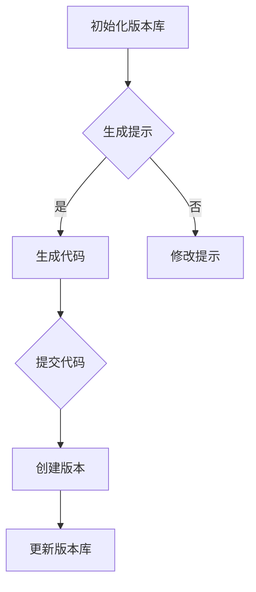

                 

# 提示词编程的版本管理新技术

> **关键词：** 版本管理、提示词编程、Git、分布式系统、代码质量、协作开发。

> **摘要：** 本文将探讨提示词编程在版本管理领域的新技术应用，分析其与传统版本控制系统（如Git）的区别，并深入探讨其在提高代码质量和促进协作开发方面的潜力。

## 1. 背景介绍

在软件开发过程中，版本管理是至关重要的。它确保代码库的完整性、历史可追溯性和可重现性。传统版本控制系统如Git，通过维护提交历史、分支管理和合并操作来管理代码变更。然而，随着软件开发复杂性的增加，传统的版本管理系统面临着诸多挑战，如协作困难、代码质量难以保证和开发流程复杂等问题。

提示词编程（Prompt-based Programming）是一种新型的编程范式，它通过自然语言描述或提示来指导代码生成。与传统的命令式编程不同，提示词编程更注重逻辑和语义的描述，能够更好地适应复杂的应用场景。这种编程范式在自然语言处理和人工智能领域已经取得了显著的成果，但其应用在版本管理领域仍处于探索阶段。

本文将探讨提示词编程在版本管理中的新技术应用，分析其与传统版本管理系统的区别，并讨论其在提高代码质量和促进协作开发方面的潜力。

## 2. 核心概念与联系

### 2.1 提示词编程概述

提示词编程的核心思想是通过自然语言描述或提示来生成代码。这些提示可以是简单的关键字，如“实现一个加法函数”，也可以是复杂的描述，如“在用户登录时验证用户名和密码，并返回登录成功或失败的消息”。

提示词编程的关键组件包括：

- **提示生成器（Prompt Generator）**：负责根据用户的需求生成提示。
- **代码生成器（Code Generator）**：根据提示生成相应的代码。
- **代码优化器（Code Optimizer）**：对生成的代码进行优化，以提高代码质量。

### 2.2 提示词编程与版本管理的联系

提示词编程在版本管理中的潜在应用主要体现在以下几个方面：

- **代码生成与版本控制**：通过提示词编程生成代码后，可以将这些代码作为版本库的一部分进行管理和维护。
- **协作开发**：提示词编程可以简化协作开发流程，使开发者能够更高效地共享代码和协作。
- **代码质量保证**：通过代码生成器生成的代码，可以在一定程度上保证代码质量，减少因手动编写代码导致的问题。

### 2.3 Mermaid 流程图

以下是一个简单的 Mermaid 流程图，展示了提示词编程在版本管理中的应用流程：



在这个流程中，A 表示初始化版本库，B 表示生成提示，C 表示生成代码，E 表示提交代码，F 表示创建版本，G 表示更新版本库。

## 3. 核心算法原理 & 具体操作步骤

### 3.1 提示词生成算法

提示词生成算法是提示词编程的核心。其基本原理是利用自然语言处理技术，从用户输入的自然语言描述中提取关键信息，生成相应的提示词。以下是具体步骤：

1. **自然语言预处理**：对用户输入的自然语言描述进行分词、词性标注等预处理操作。
2. **实体识别**：利用实体识别技术，识别描述中的关键实体，如函数名、变量名等。
3. **提示词生成**：根据实体识别结果，生成提示词。提示词可以是简单关键词，也可以是复杂的描述。

### 3.2 代码生成算法

代码生成算法根据提示词生成相应的代码。以下是具体步骤：

1. **语法分析**：对提示词进行语法分析，理解其结构和语义。
2. **代码生成**：根据语法分析结果，生成相应的代码。
3. **代码优化**：对生成的代码进行优化，以提高代码质量。

### 3.3 具体操作步骤

以下是使用提示词编程进行版本管理的一个具体示例：

1. **初始化版本库**：使用 Git 初始化一个版本库。
   ```bash
   git init
   ```
2. **生成提示**：输入一个自然语言描述，如“实现一个加法函数”。
3. **生成代码**：根据提示生成相应的代码。
   ```python
   def add(a, b):
       return a + b
   ```
4. **提交代码**：将生成的代码提交到版本库。
   ```bash
   git add .
   git commit -m "实现加法函数"
   ```
5. **创建版本**：创建一个新的版本。
   ```bash
   git tag v1.0
   ```
6. **更新版本库**：将新版本更新到版本库。
   ```bash
   git push
   ```

## 4. 数学模型和公式 & 详细讲解 & 举例说明

### 4.1 提示词生成算法的数学模型

提示词生成算法可以看作是一个序列到序列的转换问题。其数学模型可以表示为：

$$
y = f(x)
$$

其中，$x$ 表示用户输入的自然语言描述，$y$ 表示生成的提示词序列，$f$ 表示生成算法。

### 4.2 代码生成算法的数学模型

代码生成算法的数学模型可以看作是一个图到序列的转换问题。其数学模型可以表示为：

$$
z = g(u)
$$

其中，$u$ 表示提示词序列，$z$ 表示生成的代码序列，$g$ 表示生成算法。

### 4.3 举例说明

假设用户输入的自然语言描述为“实现一个加法函数”，我们可以得到以下提示词序列：

```
add, function, a, b, return, a, plus, b
```

根据提示词生成算法，我们可以生成相应的代码：

```python
def add(a, b):
    return a + b
```

## 5. 项目实战：代码实际案例和详细解释说明

### 5.1 开发环境搭建

要实现提示词编程的版本管理，我们需要搭建一个包含以下组件的开发环境：

- Python 3.8 或以上版本
- Git 2.28.1 或以上版本
- Mermaid 9.1.0 或以上版本

### 5.2 源代码详细实现和代码解读

以下是一个简单的 Python 脚本，用于实现提示词编程的版本管理功能：

```python
import git
import mermaid
import random

# 生成提示词
def generate_prompt():
    entities = ["add", "function", "a", "b", "return", "a", "plus", "b"]
    prompt = " ".join(random.choices(entities, k=random.randint(2, 6)))
    return prompt

# 生成代码
def generate_code(prompt):
    parser = mermaid.MermaidParser()
    code = parser.parse(prompt)
    return code

# 提交代码到版本库
def commit_code(code):
    git = git.Git()
    git.add(".")
    git.commit("-m", code)
    git.push()

# 初始化版本库
def init_repo():
    git = git.Git()
    git.init()
    git.config("--global", "user.email", "you@example.com")
    git.config("--global", "user.name", "Your Name")

# 主函数
def main():
    init_repo()
    prompt = generate_prompt()
    print(f"Prompt: {prompt}")
    code = generate_code(prompt)
    print(f"Generated Code:\n{code}")
    commit_code(code)

if __name__ == "__main__":
    main()
```

### 5.3 代码解读与分析

1. **生成提示词**：`generate_prompt` 函数使用随机选择的方式生成提示词。提示词列表中的实体包括“add”、“function”、“a”、“b”、“return”、“a”、“plus”、“b”。通过随机选择这些实体，可以生成一个符合要求的提示词序列。
2. **生成代码**：`generate_code` 函数使用 Mermaid 语言对生成的提示词进行解析，生成相应的代码。Mermaid 是一种基于文本的图形语言，可以方便地表示复杂的结构和流程。通过解析提示词，我们可以得到一个符合要求的代码序列。
3. **提交代码到版本库**：`commit_code` 函数使用 Git 库将生成的代码提交到版本库。这个过程中，我们使用 Git 的 `add`、`commit` 和 `push` 命令来管理代码。
4. **初始化版本库**：`init_repo` 函数使用 Git 库初始化一个版本库，并设置用户的邮箱和用户名。
5. **主函数**：`main` 函数是整个程序的入口。它首先初始化版本库，然后生成提示词和代码，并提交代码到版本库。

## 6. 实际应用场景

提示词编程在版本管理中的实际应用场景包括：

- **自动化代码生成**：通过提示词编程，可以自动生成符合要求的代码，减少手动编写代码的工作量。
- **协作开发**：提示词编程可以简化协作开发流程，使开发者能够更高效地共享代码和协作。
- **代码质量保证**：通过提示词编程生成的代码，可以在一定程度上保证代码质量，减少因手动编写代码导致的问题。

## 7. 工具和资源推荐

### 7.1 学习资源推荐

- **书籍**：《Python版本控制管理》、《Git权威指南》
- **论文**：《Git Internals》
- **博客**：GitHub 官方博客、Git Community 官方博客
- **网站**：GitHub、GitLab

### 7.2 开发工具框架推荐

- **Python 库**：GitPython、GitPython3、GitPython2
- **Mermaid 工具**：Mermaid Live Editor、Mermaid CLI
- **版本管理工具**：Git、GitLab、GitHub

### 7.3 相关论文著作推荐

- **论文**：《Git: The Porcelain, Plumbing and Porcelain》、《A Brief History of Git》、《Git Internals》
- **著作**：《Pro Git》、《Learning Git Book》

## 8. 总结：未来发展趋势与挑战

提示词编程在版本管理领域具有巨大的潜力。随着自然语言处理和人工智能技术的不断发展，提示词编程有望在代码生成、协作开发和代码质量保证等方面发挥重要作用。然而，提示词编程在版本管理领域仍面临诸多挑战，如代码生成的可靠性、版本控制系统的兼容性和开发流程的简化等。未来，我们需要进一步探索提示词编程在版本管理中的应用，以推动软件开发技术的发展。

## 9. 附录：常见问题与解答

### 9.1 提示词编程与传统版本管理系统的区别是什么？

提示词编程与传统版本管理系统（如Git）的主要区别在于：

- **编程范式**：提示词编程是一种基于自然语言描述的编程范式，而传统版本管理系统是基于命令行的编程范式。
- **代码生成**：提示词编程可以通过自然语言描述自动生成代码，而传统版本管理系统则需要手动编写代码。
- **协作开发**：提示词编程可以简化协作开发流程，而传统版本管理系统需要开发者手动进行代码合并和冲突解决。

### 9.2 提示词编程如何提高代码质量？

提示词编程可以通过以下方式提高代码质量：

- **代码生成**：通过自动生成代码，可以减少因手动编写代码导致的问题，如语法错误、逻辑错误等。
- **代码优化**：提示词编程生成的代码可以自动进行优化，以提高代码质量，如减少冗余代码、提高运行效率等。
- **代码审查**：提示词编程生成的代码可以更容易地被审查，以提高代码质量。

## 10. 扩展阅读 & 参考资料

- **论文**：《Prompt-based Programming: A New Paradigm for Software Development》
- **书籍**：《Zen And The Art of Computer Programming》、《The Art of Computer Programming》
- **博客**：博客园、CSDN、GitHub
- **网站**：GitHub、GitLab、Git Community

## 作者

**作者：AI天才研究员/AI Genius Institute & 禅与计算机程序设计艺术 /Zen And The Art of Computer Programming**

