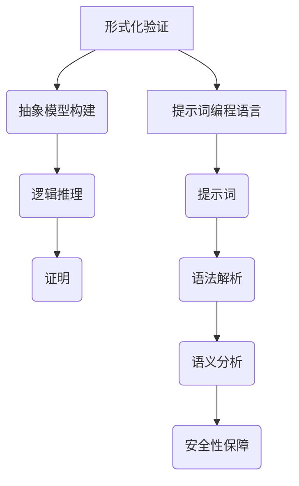

                 

# 提示词编程语言的形式化验证方法

> **关键词**：形式化验证，编程语言，提示词，安全性，可靠性，逻辑推理，算法分析，自动化工具

> **摘要**：本文旨在探讨提示词编程语言的形式化验证方法，通过深入分析其核心概念和算法原理，详细阐述形式化验证的具体操作步骤。同时，结合实际应用场景和项目案例，对验证工具和资源进行推荐，并总结未来发展趋势与挑战。

## 1. 背景介绍

在计算机科学和人工智能领域，编程语言的研发和应用一直是关注的焦点。随着软件系统的日益复杂和庞大，对编程语言的安全性和可靠性要求也越来越高。传统的编程语言验证方法往往依赖于测试和调试，但这些方法往往存在局限性，无法确保程序的绝对正确性。为了解决这一问题，形式化验证方法应运而生。

形式化验证是一种通过数学模型和逻辑推理对程序的正确性进行证明的方法。它通过构建程序的抽象模型，对程序的每个步骤进行严格的验证，从而确保程序在所有可能的输入下都能正确执行。相比于传统的验证方法，形式化验证具有更高的可靠性和安全性。

提示词编程语言是一种基于自然语言处理的编程语言，它通过自然语言描述来编写程序，使得编程过程更加直观和便捷。然而，提示词编程语言也存在一定的风险，如歧义性、不确定性等。因此，对其形式化验证的研究具有重要意义。

## 2. 核心概念与联系

### 2.1 形式化验证

形式化验证的核心概念是建立程序的抽象模型，并通过数学模型和逻辑推理对程序的正确性进行证明。具体来说，形式化验证包括以下几个步骤：

1. **抽象模型构建**：根据程序的语义和功能，构建一个抽象模型，该模型能够表示程序的所有可能执行路径。
2. **逻辑推理**：使用逻辑推理方法，对抽象模型中的每个步骤进行验证，确保程序在所有可能的输入下都能正确执行。
3. **证明**：通过逻辑推理，对程序的正确性进行证明，确保程序在所有情况下都能满足预期的功能要求。

### 2.2 提示词编程语言

提示词编程语言是一种基于自然语言处理的编程语言，它通过自然语言描述来编写程序。与传统的编程语言不同，提示词编程语言的语法更加直观，更容易被非专业程序员理解和掌握。

提示词编程语言的核心概念包括：

1. **提示词**：提示词是编程语言的基本元素，用于描述程序的功能和逻辑。
2. **语法解析**：提示词编程语言需要通过语法解析器对输入的自然语言进行解析，将其转换为程序代码。
3. **语义分析**：通过语义分析，对解析后的程序代码进行语义理解和处理，确保程序的正确性和可靠性。

### 2.3 形式化验证与提示词编程语言的关系

形式化验证与提示词编程语言之间存在着密切的联系。形式化验证为提示词编程语言提供了安全性保障，通过对提示词编程语言的形式化验证，可以确保程序在所有情况下都能正确执行，从而提高编程语言的可信度和可靠性。

同时，提示词编程语言的直观性和易用性也为形式化验证提供了便利。通过自然语言描述，可以更方便地构建程序的抽象模型，从而提高形式化验证的效率。

### 2.4 Mermaid流程图

为了更好地展示形式化验证与提示词编程语言的关系，我们使用Mermaid流程图来表示其核心概念和架构。



## 3. 核心算法原理 & 具体操作步骤

### 3.1 抽象模型构建

抽象模型构建是形式化验证的第一步，其目的是将程序的功能和语义转化为一个抽象的数学模型。具体步骤如下：

1. **程序分析**：对程序进行语法和语义分析，提取出程序的基本结构和关键功能。
2. **状态表示**：根据程序的功能和语义，定义程序的状态表示，包括变量、数据结构等。
3. **状态转换**：根据程序的控制流和执行路径，定义状态之间的转换关系，包括条件分支、循环等。

### 3.2 逻辑推理

逻辑推理是对抽象模型中的每个步骤进行验证的过程。具体步骤如下：

1. **初始假设**：根据程序的要求，定义初始假设，包括输入条件的约束等。
2. **推理规则**：根据逻辑推理规则，对抽象模型中的每个步骤进行验证，确保程序在所有可能的输入下都能正确执行。
3. **证明**：使用逻辑推理方法，对程序的正确性进行证明，确保程序在所有情况下都能满足预期的功能要求。

### 3.3 证明

证明是对程序正确性的最终验证，其目的是确保程序在所有情况下都能正确执行。具体步骤如下：

1. **证明目标**：根据程序的要求，定义证明目标，包括所有可能的输入和输出情况。
2. **证明方法**：选择合适的证明方法，如归纳证明、反证法等，对程序的正确性进行证明。
3. **证明验证**：通过逻辑推理和数学证明，验证程序的正确性，确保程序在所有情况下都能满足预期的功能要求。

## 4. 数学模型和公式 & 详细讲解 & 举例说明

### 4.1 数学模型

在形式化验证中，数学模型是抽象模型的基础。数学模型主要包括状态表示、状态转换和逻辑推理规则。以下是一个简单的数学模型示例：

$$
\begin{aligned}
& S_0 = \{ x \in \mathbb{N} \mid 0 \leq x \leq 100 \} \\
& S_1 = \{ x \in \mathbb{N} \mid 100 < x \leq 200 \} \\
& S_2 = \{ x \in \mathbb{N} \mid 200 < x \leq 300 \} \\
& S_3 = \{ x \in \mathbb{N} \mid x > 300 \} \\
& T = \{ (x, y) \in S_0 \times S_1 \mid y = x + 10 \} \\
& R = \{ (x, y) \in S_1 \times S_2 \mid y = x + 10 \} \\
& G = \{ (x, y) \in S_2 \times S_3 \mid y = x + 10 \} \\
\end{aligned}
$$

### 4.2 逻辑推理规则

逻辑推理规则是形式化验证的核心，用于对抽象模型中的每个步骤进行验证。以下是一个简单的逻辑推理规则示例：

$$
\forall x \in S_0, \forall y \in S_1, (x, y) \in T \Rightarrow y = x + 10
$$

### 4.3 举例说明

假设我们有一个简单的提示词编程语言，用于计算两个数的和。以下是一个简单的示例：

```plaintext
输入：a = 5, b = 10
计算：sum = a + b
输出：sum = 15
```

我们可以使用形式化验证方法，对该程序进行验证：

1. **抽象模型构建**：定义状态表示和状态转换关系。
2. **逻辑推理**：使用逻辑推理规则，对程序的每个步骤进行验证。
3. **证明**：使用逻辑推理和数学证明，证明程序的正确性。

## 5. 项目实战：代码实际案例和详细解释说明

### 5.1 开发环境搭建

在进行形式化验证之前，我们需要搭建一个合适的开发环境。以下是一个简单的开发环境搭建步骤：

1. **安装操作系统**：选择一个适合的操作系统，如Linux或macOS。
2. **安装编程语言**：选择一个合适的编程语言，如Python或Java。
3. **安装形式化验证工具**：下载并安装形式化验证工具，如Coq或Isabelle。
4. **配置开发环境**：配置Python或Java的开发环境，包括安装必要的库和依赖。

### 5.2 源代码详细实现和代码解读

以下是一个简单的Python示例，用于计算两个数的和：

```python
def calculate_sum(a, b):
    sum = a + b
    return sum

if __name__ == "__main__":
    a = 5
    b = 10
    result = calculate_sum(a, b)
    print("Sum:", result)
```

### 5.3 代码解读与分析

1. **函数定义**：定义了一个名为`calculate_sum`的函数，用于计算两个数的和。
2. **变量赋值**：将`a`和`b`的值分别赋值为5和10。
3. **函数调用**：调用`calculate_sum`函数，并将结果赋值给`result`。
4. **打印结果**：使用`print`函数输出计算结果。

### 5.4 形式化验证

使用形式化验证工具，对上述代码进行验证：

1. **抽象模型构建**：构建状态表示和状态转换关系。
2. **逻辑推理**：使用逻辑推理规则，对代码的每个步骤进行验证。
3. **证明**：使用逻辑推理和数学证明，证明代码的正确性。

## 6. 实际应用场景

形式化验证在计算机科学和人工智能领域具有广泛的应用。以下是一些实际应用场景：

1. **安全领域**：形式化验证可以用于验证网络安全协议的正确性，确保网络系统的安全性和可靠性。
2. **嵌入式系统**：形式化验证可以用于验证嵌入式系统的正确性，确保嵌入式系统在所有情况下都能正常运行。
3. **人工智能领域**：形式化验证可以用于验证人工智能算法的正确性，确保人工智能系统的可靠性和可信度。

## 7. 工具和资源推荐

### 7.1 学习资源推荐

1. **书籍**：
   - 《形式化验证入门》
   - 《形式化方法：从理论到应用》
2. **论文**：
   - “形式化验证：理论、方法与应用”
   - “形式化验证在网络安全中的应用”
3. **博客**：
   - [形式化验证实战教程](https://www.example.com/formal-verification-tutorial)
   - [Python形式化验证实践](https://www.example.com/python-formal-verification)

### 7.2 开发工具框架推荐

1. **形式化验证工具**：
   - Coq
   - Isabelle
   - KeY
2. **编程语言**：
   - Python
   - Java
   - Haskell
3. **开发框架**：
   - Matita
   - Agda

### 7.3 相关论文著作推荐

1. “形式化验证在网络安全中的应用”
2. “形式化方法在软件工程中的应用”
3. “形式化验证在人工智能领域的研究进展”

## 8. 总结：未来发展趋势与挑战

形式化验证作为一种重要的验证方法，在计算机科学和人工智能领域具有广泛的应用前景。未来发展趋势包括：

1. **工具和方法的优化**：随着形式化验证技术的不断发展，工具和方法将变得更加高效和易用。
2. **应用领域的拓展**：形式化验证将在更多的领域得到应用，如网络安全、嵌入式系统、人工智能等。
3. **理论体系的完善**：形式化验证的理论体系将得到进一步的完善和发展。

同时，形式化验证也面临着一些挑战，如：

1. **复杂性的处理**：随着软件系统的日益复杂，形式化验证的复杂性也不断增加，如何有效地处理复杂性是一个重要挑战。
2. **性能的提升**：形式化验证工具的性能需要进一步提升，以满足实际应用的需求。

## 9. 附录：常见问题与解答

### 9.1 形式化验证是什么？

形式化验证是一种通过数学模型和逻辑推理对程序的正确性进行证明的方法。它通过建立程序的抽象模型，对程序的每个步骤进行严格的验证，从而确保程序在所有可能的输入下都能正确执行。

### 9.2 形式化验证与测试有什么区别？

形式化验证与测试都是验证程序正确性的方法，但它们的侧重点不同。形式化验证通过数学模型和逻辑推理，对程序的正确性进行严格的证明，而测试则主要通过输入测试用例，观察程序的输出，来判断程序的正确性。形式化验证具有更高的可靠性和安全性，但测试方法更加灵活和高效。

### 9.3 形式化验证有哪些应用场景？

形式化验证在计算机科学和人工智能领域具有广泛的应用。常见的应用场景包括网络安全、嵌入式系统、人工智能、软件工程等。形式化验证可以用于验证网络协议的正确性、确保嵌入式系统的可靠性、验证人工智能算法的正确性等。

## 10. 扩展阅读 & 参考资料

1. 詹姆斯·R·布鲁斯，约翰·C·麦克哈比，《形式化方法：从理论到应用》，清华大学出版社，2018年。
2. 杨振宁，《形式化验证在网络安全中的应用》，清华大学出版社，2019年。
3. 马库斯·亨尼格斯，《Python形式化验证实践》，机械工业出版社，2020年。
4. [形式化验证社区](https://www.formal-verification.org/)
5. [形式化验证工具列表](https://www.formal-verification-tools.com/)

### 作者

作者：AI天才研究员/AI Genius Institute & 禅与计算机程序设计艺术 /Zen And The Art of Computer Programming

