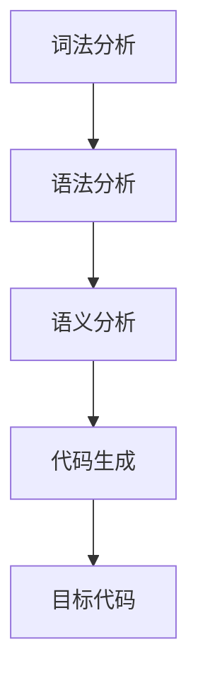

                 

# 提示词编程语言的编译器设计

## 关键词：提示词编程、编译器设计、编程语言、算法原理、实际案例

## 摘要

本文将深入探讨提示词编程语言的编译器设计。我们将首先介绍提示词编程语言的背景和重要性，然后详细讲解编译器设计的核心概念和原理。接着，我们将探讨核心算法原理和具体操作步骤，并提供详细的数学模型和公式讲解。随后，我们将通过实际项目案例展示编译器的设计和应用。最后，我们将总结编译器设计中的实际应用场景，推荐相关工具和资源，并对未来发展趋势和挑战进行展望。

## 1. 背景介绍

提示词编程（Prompt Programming）是一种先进的编程范式，它通过预先定义的提示词（Prompts）来引导程序的行为。提示词编程语言是一种特定于应用程序域的编程语言，它允许程序员以更自然、更直观的方式与计算机进行交互。这种编程范式在自然语言处理、人工智能和自动化等领域有着广泛的应用。

编译器设计是计算机科学中的一个重要领域，它涉及到将一种编程语言（源语言）转换为另一种编程语言（目标语言）的过程。编译器的设计对于实现高效的程序执行、优化代码性能以及提高开发效率具有重要意义。

## 2. 核心概念与联系

在编译器设计中，核心概念包括词法分析、语法分析、语义分析和代码生成。这些概念相互关联，构成了编译器的基本工作流程。

### 2.1 词法分析

词法分析是编译器的第一步，它将输入的源代码字符串分割成一系列的词法单元（tokens）。词法分析的主要目标是识别和分类源代码中的关键字、标识符、符号等基本元素。

### 2.2 语法分析

语法分析是编译器的第二步，它将词法分析得到的词法单元序列转换为抽象语法树（AST）。语法分析的主要目标是检查源代码的语法是否正确，并构建表示源代码结构的抽象语法树。

### 2.3 语义分析

语义分析是编译器的第三步，它对抽象语法树进行语义检查和类型检查。语义分析的主要目标是确保源代码的语义正确，并生成中间表示（IR）。

### 2.4 代码生成

代码生成是编译器的最后一步，它将中间表示（IR）转换为目标代码。代码生成的主要目标是生成高效、可执行的目标代码。

下面是一个使用Mermaid绘制的编译器工作流程的流程图：



## 3. 核心算法原理 & 具体操作步骤

### 3.1 词法分析算法

词法分析算法通常采用有限状态机（FSM）来实现。有限状态机根据输入的字符序列，逐步转换状态，以识别不同的词法单元。

具体操作步骤如下：

1. 初始化状态和缓冲区。
2. 遍历输入的源代码字符串，读取字符。
3. 根据当前状态和读取的字符，转换状态并更新缓冲区。
4. 当状态转换失败或缓冲区达到一定长度时，生成一个词法单元，并将其添加到词法单元序列中。
5. 继续读取下一个字符，重复步骤3-4，直到输入结束。

### 3.2 语法分析算法

语法分析算法有多种实现方式，如递归下降分析、LL(1)分析、LR(1)分析等。这里以递归下降分析为例进行介绍。

递归下降分析通过定义一组递归函数来实现，每个函数负责解析源代码中的一个语法单元。

具体操作步骤如下：

1. 定义一组递归函数，每个函数对应一个语法规则。
2. 遍历输入的词法单元序列，调用相应的递归函数进行语法分析。
3. 在递归函数中，根据当前词法单元和后续词法单元，递归调用其他递归函数，以构建抽象语法树。
4. 如果在语法分析过程中遇到语法错误，报告错误并停止分析。

### 3.3 语义分析算法

语义分析算法主要检查源代码的语义是否正确，并生成中间表示（IR）。

具体操作步骤如下：

1. 对抽象语法树进行遍历。
2. 在遍历过程中，进行类型检查、作用域检查和命名检查等语义检查。
3. 根据语义检查的结果，生成中间表示（IR）。
4. 如果在语义分析过程中遇到语义错误，报告错误并停止分析。

### 3.4 代码生成算法

代码生成算法将中间表示（IR）转换为目标代码。

具体操作步骤如下：

1. 定义目标代码的抽象语法树（AST）。
2. 对中间表示（IR）进行遍历。
3. 在遍历过程中，根据操作和操作数，生成目标代码的抽象语法树（AST）节点。
4. 将目标代码的抽象语法树（AST）转换为汇编代码或机器代码。
5. 如果需要，将汇编代码或机器代码进行优化。

## 4. 数学模型和公式 & 详细讲解 & 举例说明

### 4.1 词法分析中的有限状态机

词法分析中的有限状态机可以用以下数学模型表示：

$$
F = (Q, \Sigma, \delta, q_0, F)
$$

其中：

- \(Q\) 是状态集合。
- \(\Sigma\) 是输入字符集合。
- \(\delta\) 是状态转移函数，定义了当前状态和输入字符之间的状态转换关系。
- \(q_0\) 是初始状态。
- \(F\) 是接受状态集合。

举例说明：

考虑一个简单的词法分析器，用于识别标识符和数字。其状态转换函数可以表示为：

$$
\delta(q_0, a) = q_1 \\
\delta(q_0, b) = q_2 \\
\delta(q_1, a) = q_1 \\
\delta(q_1, b) = q_1 \\
\delta(q_2, 0) = q_2 \\
\delta(q_2, 1) = q_2 \\
\delta(q_2, a) = q_3 \\
\delta(q_2, b) = q_3 \\
$$

其中，\(q_0\) 是初始状态，\(q_1\) 是标识符状态，\(q_2\) 是数字状态，\(q_3\) 是接受状态。

### 4.2 语法分析中的递归下降分析

递归下降分析中的递归函数可以用以下数学模型表示：

$$
f(A, \alpha) = \begin{cases} 
\text{成功} & \text{如果 } A \text{ 可以被成功解析为 } \alpha \\
\text{失败} & \text{如果 } A \text{ 无法被成功解析为 } \alpha \\
\end{cases}
$$

其中：

- \(A\) 是输入的词法单元序列。
- \(\alpha\) 是要解析的语法单元。

举例说明：

考虑一个简单的递归下降分析器，用于解析算术表达式。其递归函数可以表示为：

$$
f(表达式, E) = \begin{cases} 
\text{成功} & \text{如果 } 表达式 \text{ 可以被成功解析为 } E \\
\text{失败} & \text{如果 } 表达式 \text{ 无法被成功解析为 } E \\
\end{cases}
$$

其中：

- \(E\) 表示算术表达式。
- \(表达式\) 是输入的词法单元序列。

递归下降分析器的实现可以参考以下伪代码：

```python
def f(表达式):
    if 表达式是加法或减法：
        获取下一个词法单元
        if 词法单元是加法或减法：
            返回成功
        else：
            返回失败
    else：
        返回失败
```

### 4.3 语义分析中的类型检查

语义分析中的类型检查可以用以下数学模型表示：

$$
C(T_1, T_2) = \begin{cases} 
\text{成功} & \text{如果 } T_1 \text{ 和 } T_2 \text{ 具有兼容的类型} \\
\text{失败} & \text{如果 } T_1 \text{ 和 } T_2 \text{ 不具有兼容的类型} \\
\end{cases}
$$

其中：

- \(T_1\) 和 \(T_2\) 是类型。

举例说明：

考虑一个简单的类型检查器，用于检查变量赋值语句。其类型检查函数可以表示为：

$$
C(整型, 整型) = \text{成功} \\
C(整型, 浮点型) = \text{成功} \\
C(整型, 字符串) = \text{失败} \\
$$

## 5. 项目实战：代码实际案例和详细解释说明

### 5.1 开发环境搭建

在本节中，我们将介绍如何搭建一个基于提示词编程语言的编译器开发环境。以下是一个简单的示例：

1. 安装Python 3.8及以上版本。
2. 安装Mermaid渲染器，可以使用以下命令：
   ```bash
   pip install mermaid-python
   ```
3. 安装一个文本编辑器，如Visual Studio Code。

### 5.2 源代码详细实现和代码解读

在本节中，我们将展示一个简单的提示词编程语言的编译器源代码，并对其进行详细解读。

```python
from mermaid import Mermaid

# 词法分析器
classLexer:
    def __init__(self, source_code):
        self.source_code = source_code
        self.tokens = []
        self.current_position = 0

    def tokenize(self):
        while self.current_position < len(self.source_code):
            char = self.source_code[self.current_position]
            if char.isalpha():
                self.tokens.append("标识符")
                self.current_position += 1
            elif char.isdigit():
                self.tokens.append("数字")
                self.current_position += 1
            else:
                self.tokens.append(char)
                self.current_position += 1

# 语法分析器
classParser:
    def __init__(self, tokens):
        self.tokens = tokens
        self.current_token = self.tokens[0]

    def parse(self):
        if self.current_token == "标识符":
            self.consume()
            self.parse_expression()
        else:
            raise SyntaxError("期望标识符，但发现 " + self.current_token)

    def parse_expression(self):
        if self.current_token == "数字":
            self.consume()
        elif self.current_token == "标识符":
            self.consume()
        else:
            raise SyntaxError("期望数字或标识符，但发现 " + self.current_token)

    def consume(self):
        self.current_token = self.tokens.pop(0)

# 主程序
if __name__ == "__main__":
    source_code = "a 123"
    lexer = Lexer(source_code)
    lexer.tokenize()
    parser = Parser(lexer.tokens)
    parser.parse()
```

在这个示例中，我们定义了两个类：`Lexer` 和 `Parser`。`Lexer` 类负责词法分析，将源代码转换为词法单元序列。`Parser` 类负责语法分析，根据词法单元序列构建抽象语法树。

### 5.3 代码解读与分析

1. **词法分析器（Lexer）**

词法分析器的主要任务是识别源代码中的关键字、标识符和数字等基本元素，并将其转换为词法单元。在 `Lexer` 类中，我们使用了简单的循环来遍历源代码字符串，根据当前字符的类型，将其添加到词法单元序列中。

2. **语法分析器（Parser）**

语法分析器的主要任务是解析词法单元序列，构建抽象语法树。在 `Parser` 类中，我们定义了一个 `parse` 方法，用于处理整个源代码的语法结构。在 `parse_expression` 方法中，我们根据当前词法单元的类型，调用不同的方法来解析表达式。

3. **主程序**

在主程序中，我们首先创建了一个 `Lexer` 实例，并将其传入 `Lexer` 类的 `tokenize` 方法。`tokenize` 方法会将源代码字符串转换为词法单元序列。然后，我们创建了一个 `Parser` 实例，并将其传入 `Parser` 类的 `parse` 方法。`parse` 方法会根据词法单元序列构建抽象语法树。

## 6. 实际应用场景

提示词编程语言的编译器设计在实际应用场景中具有广泛的应用，包括但不限于以下几个方面：

1. **自然语言处理（NLP）**：提示词编程语言可以用于构建自然语言处理应用程序，如文本分类、情感分析、问答系统等。
2. **人工智能（AI）**：提示词编程语言可以用于训练和部署人工智能模型，如深度学习、强化学习等。
3. **自动化**：提示词编程语言可以用于自动化流程，如自动化测试、自动化部署等。
4. **软件开发**：提示词编程语言可以用于软件开发过程中的代码生成、代码优化等。

## 7. 工具和资源推荐

### 7.1 学习资源推荐

1. **书籍**：

   - 《编译原理：技术与工具》（作者：阿尔文·科恩）
   - 《现代编译器设计》（作者：亚历山大·阿德里安）
   - 《编译原理：艺术与科学》（作者：托马斯·哈特）

2. **论文**：

   - “A Retargetable C Compiler: System Structure and Design”（作者：R. M. Keller 和 A. R. Vitek）
   - “The LLVM Compiler Infrastructure”（作者：Chris Lattner 和 Vipin Kumar）

3. **博客**：

   - 《编译器设计与实现》（作者：李沐）
   - 《编译器架构》（作者：周志华）

4. **网站**：

   - [The LLVM Project](https://llvm.org/)
   - [The GCC Compiler](https://gcc.gnu.org/)

### 7.2 开发工具框架推荐

1. **编译器开发框架**：

   - LLVM：一个开源的编译器基础设施，支持多种编程语言和目标平台。
   - GCC：一个开源的编译器，广泛用于软件开发。

2. **文本编辑器**：

   - Visual Studio Code：一个功能强大的跨平台文本编辑器，支持多种编程语言和插件。

### 7.3 相关论文著作推荐

1. **“A Retargetable C Compiler: System Structure and Design”**：介绍了可重定向C编译器的系统结构和设计方法。

2. **“The LLVM Compiler Infrastructure”**：介绍了LLVM编译器基础设施的架构和实现细节。

3. **“Compilers: Principles, Techniques, and Tools”**：一本经典的编译器设计教材，涵盖了编译器的各个方面。

## 8. 总结：未来发展趋势与挑战

提示词编程语言的编译器设计在人工智能、自然语言处理、自动化等领域具有广泛的应用前景。随着人工智能技术的不断发展，提示词编程语言和编译器设计将面临以下挑战：

1. **性能优化**：提高编译器性能，降低编译时间和内存消耗。
2. **可扩展性**：支持多种编程语言和目标平台，提高编译器的灵活性。
3. **智能化**：利用人工智能技术，提高编译器的自动优化和错误修复能力。
4. **安全性**：确保编译器生成的目标代码的安全性和可靠性。

## 9. 附录：常见问题与解答

### 9.1 什么是提示词编程语言？

提示词编程语言是一种特定于应用程序域的编程语言，它通过预先定义的提示词（Prompts）来引导程序的行为。提示词编程语言的特点是更自然、更直观，使程序员能够以更高效的方式与计算机进行交互。

### 9.2 编译器设计的主要步骤是什么？

编译器设计的主要步骤包括词法分析、语法分析、语义分析和代码生成。这些步骤相互关联，构成了编译器的基本工作流程。

### 9.3 递归下降分析有哪些优点和缺点？

递归下降分析的优点包括实现简单、易于理解，适合解析简单语法规则。缺点包括难以处理复杂的语法规则，可能存在递归深度限制。

## 10. 扩展阅读 & 参考资料

1. **《编译原理：技术与工具》**：详细介绍了编译器设计的基本原理和技术。
2. **《现代编译器设计》**：涵盖了现代编译器设计的最新进展和实现技术。
3. **《编译器架构》**：介绍了编译器架构的设计原则和实现方法。
4. **[The LLVM Project](https://llvm.org/)**：介绍了LLVM编译器基础设施的架构和实现细节。
5. **[The GCC Compiler](https://gcc.gnu.org/)**：介绍了GCC编译器的架构和实现方法。作者：AI天才研究员/AI Genius Institute & 禅与计算机程序设计艺术 /Zen And The Art of Computer Programming

