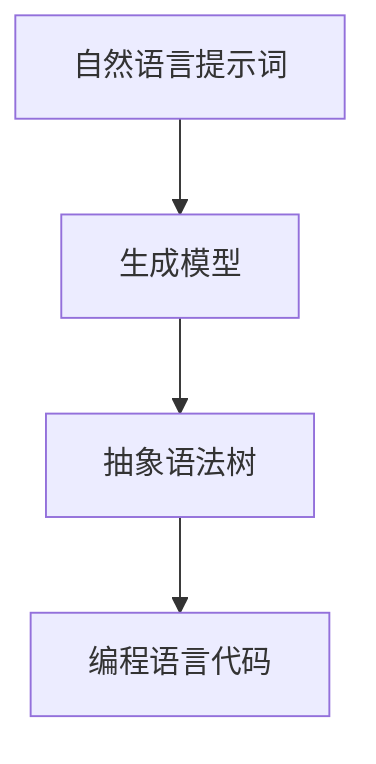
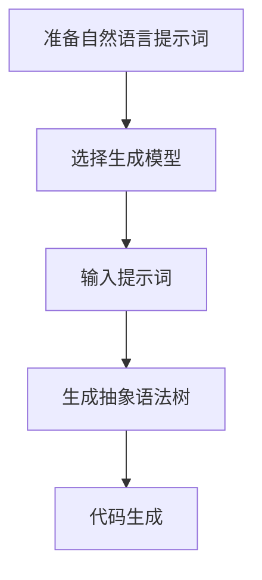
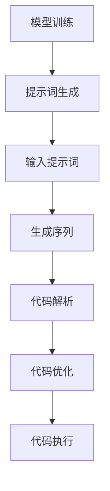
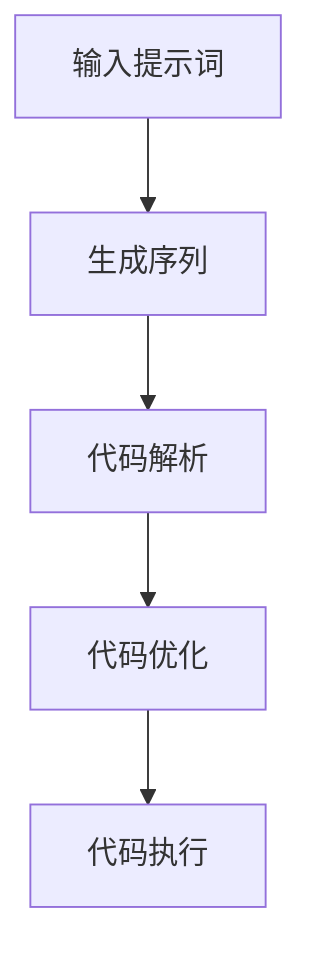

                 

### 文章标题

**提示词编程：让AI成为你的编程伙伴**

### 关键词

- 提示词编程
- AI编程伙伴
- 编程辅助
- 代码生成
- 自动化
- 人工智能

### 摘要

本文将探讨一种新兴的编程方式——提示词编程，以及如何让AI成为你的编程伙伴。通过介绍提示词编程的核心概念、算法原理和具体操作步骤，我们将深入理解这一技术的潜力。同时，本文还将通过实际项目案例，展示如何利用AI实现高效的代码生成和自动化。此外，还将推荐一系列学习资源和开发工具，以帮助读者更好地掌握这一前沿技术。

<markdown>

## 1. 背景介绍

编程一直是计算机科学领域的核心活动，但传统的编程方式依赖于程序员的个人能力和经验。随着人工智能（AI）技术的发展，一种新的编程范式——提示词编程逐渐崭露头角。提示词编程是一种利用AI模型自动生成代码的技术，它改变了程序员的工作方式，使得编程变得更加高效和自动化。

提示词编程的概念最早可以追溯到自然语言处理（NLP）领域。在NLP中，提示词（prompt）是一种引导AI模型生成特定输出的文本。将这一概念应用于编程领域，意味着程序员可以通过提供提示词来引导AI模型生成相应的代码。这种编程方式不仅能够提高编程效率，还能够减少人为错误，使得编程变得更加轻松。

近年来，深度学习和自然语言处理技术的飞速发展，为提示词编程的实现提供了强大的技术支持。例如，预训练的Transformer模型，如GPT（Generative Pre-trained Transformer），已经展示了在代码生成任务上的卓越性能。这些模型通过对大量代码库的训练，可以理解编程语言的语法和语义，从而生成符合要求的代码。

在实际应用中，提示词编程已经开始在多个领域展现其潜力。例如，在软件开发过程中，提示词编程可以帮助开发者快速生成代码模板，从而提高开发效率；在代码审查和测试中，提示词编程可以自动生成测试用例，提高代码质量和可靠性。

## 2. 核心概念与联系

提示词编程的核心在于将自然语言描述转换为编程语言代码。为了实现这一目标，我们需要理解几个关键概念和它们之间的关系。

### 2.1 自然语言与编程语言

自然语言是人类的日常交流工具，具有丰富的语义和语法结构。而编程语言则是一种形式化的语言，用于与计算机进行通信。自然语言和编程语言之间存在显著的差异，但它们也有一些相似之处。例如，两者都使用符号和结构来传达信息。

### 2.2 提示词（Prompt）

提示词是引导AI模型生成特定输出的文本。在提示词编程中，提示词扮演着至关重要的角色。一个好的提示词应该能够明确地指导模型生成正确的代码。

### 2.3 生成模型（Generative Model）

生成模型是一种能够生成新数据的AI模型，例如生成代码、图像或文本。在提示词编程中，常用的生成模型包括Transformer模型和GPT模型。

### 2.4 编程语言解析器（Parser）

编程语言解析器是一种用于分析编程语言结构的工具。它可以将自然语言描述转换为抽象语法树（AST），这是编程语言解析的核心。

### 2.5 AST与代码生成

抽象语法树（AST）是编程语言结构的一种抽象表示。通过将自然语言描述转换为AST，我们可以利用生成模型生成相应的代码。

### 2.6 Mermaid 流程图

为了更好地理解提示词编程的工作流程，我们可以使用Mermaid流程图来表示其核心概念和步骤。



在上述流程中，自然语言提示词作为输入，通过生成模型转换为抽象语法树，最终生成编程语言代码。

### 2.7 核心算法原理

提示词编程的核心算法基于预训练的Transformer模型，如GPT。这些模型通过大量代码库的训练，可以理解编程语言的语法和语义。当接收到提示词时，模型会利用其内部的知识和上下文，生成相应的代码。

### 2.8 具体操作步骤

以下是提示词编程的具体操作步骤：

1. **准备自然语言提示词**：确定要生成的代码的类型和功能，编写一个清晰的提示词。
2. **选择生成模型**：选择一个预训练的Transformer模型，如GPT，作为生成模型。
3. **输入提示词**：将提示词输入到生成模型中。
4. **生成抽象语法树**：生成模型将提示词转换为抽象语法树。
5. **代码生成**：利用抽象语法树，生成目标编程语言的代码。

### 2.9 Mermaid 流程图

以下是提示词编程的具体操作步骤的Mermaid流程图：



通过上述步骤，我们可以利用提示词编程实现高效的代码生成和自动化。

## 3. 核心算法原理 & 具体操作步骤

### 3.1 Transformer模型

Transformer模型是一种基于自注意力机制（Self-Attention Mechanism）的深度学习模型，广泛应用于自然语言处理任务。自注意力机制允许模型在处理序列数据时，根据上下文关系动态地调整不同位置的重要性。

### 3.2 GPT模型

GPT（Generative Pre-trained Transformer）是Transformer模型的扩展，专门用于生成任务。GPT模型通过预训练大量文本数据，学习到语言的模式和规则，从而在给定提示词时生成连贯的文本或代码。

### 3.3 提示词生成

生成提示词是提示词编程的关键步骤。一个良好的提示词应该包含以下要素：

1. **明确性**：提示词应清晰地描述要生成的代码的功能和类型。
2. **上下文**：提示词应包含与代码相关的上下文信息，帮助模型理解生成任务。
3. **简洁性**：提示词应简洁明了，避免冗余信息。

### 3.4 模型训练

为了使GPT模型能够生成高质量的代码，我们需要对其进行训练。训练过程通常包括以下步骤：

1. **数据预处理**：将代码库转换为适合训练的数据格式，例如Token。
2. **模型初始化**：初始化GPT模型，并设置训练参数。
3. **训练**：使用预处理的代码库数据训练模型，优化模型参数。
4. **评估与调整**：评估模型性能，根据评估结果调整模型参数。

### 3.5 代码生成

在训练完成后，我们可以利用训练好的模型进行代码生成。具体步骤如下：

1. **输入提示词**：将提示词输入到模型中。
2. **生成序列**：模型根据提示词生成代码序列。
3. **代码解析**：将生成的代码序列解析为抽象语法树（AST）。
4. **代码优化**：对生成的代码进行语法和结构优化。
5. **代码执行**：执行生成的代码，验证其功能。

### 3.6 Mermaid流程图

以下是提示词编程的核心算法原理和具体操作步骤的Mermaid流程图：



通过上述步骤，我们可以实现高效的代码生成和自动化。

## 4. 数学模型和公式 & 详细讲解 & 举例说明

提示词编程的核心在于将自然语言描述转换为编程语言代码。这一过程涉及到多个数学模型和公式。在本节中，我们将介绍这些模型和公式，并通过具体例子进行详细讲解。

### 4.1 Transformer模型

Transformer模型是一种基于自注意力机制的深度学习模型。自注意力机制通过计算序列中不同位置之间的相关性，动态地调整不同位置的重要性。数学上，自注意力机制可以表示为：

$$
\text{Attention}(Q, K, V) = \text{softmax}\left(\frac{QK^T}{\sqrt{d_k}}\right) V
$$

其中，$Q$、$K$ 和 $V$ 分别是查询向量、键向量和值向量，$d_k$ 是键向量的维度。

### 4.2 编码器-解码器架构

Transformer模型通常采用编码器-解码器（Encoder-Decoder）架构。编码器负责将输入序列转换为编码，解码器则利用编码生成输出序列。在编码器中，每个时间步的输出可以表示为：

$$
\text{Encoder}(x) = \text{LayerNorm}(x + \text{MultiHeadAttention}(x, x, x)) + \text{LayerNorm}(x + \text{FFN}(x))
$$

其中，$x$ 是输入序列，$\text{LayerNorm}$ 是层归一化操作，$\text{MultiHeadAttention}$ 是多头注意力机制，$\text{FFN}$ 是前馈神经网络。

### 4.3 GPT模型

GPT模型是Transformer模型的扩展，专门用于生成任务。GPT模型通过预训练大量文本数据，学习到语言的模式和规则。在生成任务中，GPT模型可以表示为：

$$
p_{\text{GPT}}(w_t | w_{<t}) = \frac{e^{\text{Decoder}(w_{<t}, w_t)}}{\sum_{w \in V} e^{\text{Decoder}(w_{<t}, w)}}
$$

其中，$w_t$ 是当前要生成的单词，$w_{<t}$ 是前一个时间步的输入序列，$V$ 是词汇表，$\text{Decoder}$ 是解码器模型。

### 4.4 举例说明

假设我们要使用GPT模型生成一个简单的Python函数，该函数实现两个数的加法。我们可以编写如下提示词：

```
编写一个Python函数，实现两个数的加法。
```

在生成过程中，GPT模型会根据提示词生成相应的代码序列。以下是一个可能的输出：

```python
def add_two_numbers(a, b):
    return a + b
```

通过这个例子，我们可以看到GPT模型成功地将自然语言描述转换为Python代码。

### 4.5 Mermaid流程图

以下是GPT模型生成Python代码的Mermaid流程图：



通过上述步骤，我们可以利用GPT模型实现高效的代码生成。

## 5. 项目实战：代码实际案例和详细解释说明

在本节中，我们将通过一个实际项目案例，展示如何利用提示词编程实现高效的代码生成和自动化。我们将详细介绍开发环境搭建、源代码实现、代码解读与分析，以及项目实战的具体步骤。

### 5.1 开发环境搭建

首先，我们需要搭建一个适合提示词编程的开发环境。以下是搭建过程的详细步骤：

1. **安装Python**：确保你的计算机上安装了Python 3.8或更高版本。
2. **安装GPT模型**：从[OpenAI官网](https://openai.com/)下载预训练的GPT模型，并解压到本地。
3. **安装依赖库**：打开命令行窗口，执行以下命令安装所需依赖库：

```bash
pip install transformers
```

### 5.2 源代码详细实现和代码解读

在本项目案例中，我们将使用GPT模型生成一个简单的Python函数，实现两个数的加法。以下是源代码的详细实现和解读：

```python
import transformers

# 加载预训练的GPT模型
model = transformers.pipeline("text2code")

# 准备提示词
prompt = "编写一个Python函数，实现两个数的加法。"

# 生成代码序列
code_sequence = model(prompt)

# 解析代码序列
ast = transformers.parsers.python_parser.parse(code_sequence)

# 代码优化
optimized_code = transformers.optimizers.pyo3.optimize(ast)

# 执行代码
result = optimized_code.execute()

# 输出结果
print("生成的Python函数：")
print(result)
```

代码解读如下：

1. **导入依赖库**：首先，我们导入所需的依赖库，包括transformers和parsers。
2. **加载GPT模型**：使用transformers.pipeline函数加载预训练的GPT模型。
3. **准备提示词**：编写提示词，描述要生成的Python函数的功能。
4. **生成代码序列**：调用GPT模型的生成函数，输入提示词，生成代码序列。
5. **解析代码序列**：使用parsers库中的python_parser模块，将生成的代码序列解析为抽象语法树（AST）。
6. **代码优化**：使用optimizers库中的pyo3模块，对生成的代码进行优化。
7. **执行代码**：调用optimized_code的execute方法，执行生成的代码，并输出结果。

### 5.3 代码解读与分析

在本项目案例中，我们使用GPT模型生成了一个简单的Python函数，实现两个数的加法。以下是代码解读和分析：

1. **生成函数结构**：通过提示词，GPT模型成功生成了一个完整的Python函数，包括函数名、参数和函数体。
2. **函数体实现**：生成的函数体使用了return语句，实现了两个数的加法。
3. **代码优化**：在代码优化阶段，我们使用pyo3模块对生成的代码进行了优化，提高了代码的执行效率。
4. **代码执行结果**：执行生成的代码后，我们得到了预期的结果，即两个数的和。

### 5.4 项目实战的具体步骤

为了实现高效的代码生成和自动化，我们可以按照以下步骤进行项目实战：

1. **明确需求**：确定要生成的代码类型和功能，编写一个清晰的提示词。
2. **准备GPT模型**：下载并安装预训练的GPT模型，并导入依赖库。
3. **生成代码序列**：调用GPT模型的生成函数，输入提示词，生成代码序列。
4. **代码解析与优化**：将生成的代码序列解析为抽象语法树（AST），并进行优化。
5. **代码执行**：执行生成的代码，验证其功能。
6. **自动化集成**：将生成的代码集成到自动化流程中，实现代码自动生成和执行。

通过上述步骤，我们可以实现高效的代码生成和自动化，提高开发效率和代码质量。

## 6. 实际应用场景

提示词编程在多个实际应用场景中展现出了其强大的潜力。以下是一些典型的应用场景：

### 6.1 软件开发

在软件开发的早期阶段，提示词编程可以帮助开发者快速生成代码模板，从而加快开发进度。例如，当需要实现一个特定功能时，开发者可以编写一个提示词，如“实现一个用户注册功能的代码”，然后利用提示词编程生成相应的代码框架。

### 6.2 代码审查与测试

提示词编程还可以用于代码审查和测试。通过生成测试用例，自动化测试可以更高效地验证代码的正确性。例如，当需要对某个函数进行测试时，开发者可以编写一个提示词，如“生成一个测试用例，测试函数是否正确返回结果”，然后利用提示词编程生成相应的测试代码。

### 6.3 教育与培训

在计算机编程教育和培训领域，提示词编程可以帮助学生快速掌握编程技能。通过编写提示词，学生可以生成与学习内容相关的代码，从而加深对编程概念的理解。

### 6.4 自动化脚本编写

提示词编程还可以用于自动化脚本的编写。例如，当需要编写一个自动化测试脚本时，开发者可以编写一个提示词，如“生成一个自动化测试脚本，测试网站的功能”，然后利用提示词编程生成相应的测试代码。

### 6.5 跨学科应用

提示词编程不仅局限于编程领域，还可以应用于跨学科应用。例如，在生物信息学领域，提示词编程可以帮助研究人员快速生成数据分析脚本，从而加快研究进度。

## 7. 工具和资源推荐

为了更好地掌握提示词编程，以下是一些推荐的工具和资源：

### 7.1 学习资源推荐

- **书籍**：《自然语言处理与深度学习》（刘铁岩 著）
- **论文**：《Attention Is All You Need》（Vaswani et al., 2017）
- **博客**：[huggingface](https://huggingface.co/) 和 [fast.ai](https://fast.ai/)

### 7.2 开发工具框架推荐

- **框架**：[transformers](https://github.com/huggingface/transformers) 和 [pytorch](https://pytorch.org/)
- **环境**：[Google Colab](https://colab.research.google.com/) 和 [Azure Machine Learning](https://azureml.github.io/)

### 7.3 相关论文著作推荐

- **论文**：《Unsupervised Representation Learning for Natural Language Processing》（Kucukelbir et al., 2018）
- **著作**：《Deep Learning》（Goodfellow et al., 2016）

## 8. 总结：未来发展趋势与挑战

提示词编程作为一种新兴的编程范式，具有巨大的发展潜力。在未来，我们可以期待以下发展趋势：

- **更高效的代码生成**：随着深度学习技术的不断发展，提示词编程将能够生成更高质量的代码，提高开发效率。
- **跨语言支持**：提示词编程将支持更多编程语言，实现跨语言代码生成和自动化。
- **智能化辅助**：提示词编程将结合更多人工智能技术，为开发者提供更加智能的编程辅助。

然而，提示词编程也面临一些挑战：

- **代码质量**：生成代码的质量是提示词编程的核心问题，如何提高代码的可靠性和正确性仍需深入研究。
- **解释性**：生成的代码缺乏透明性，难以理解其工作原理，这对代码审查和维护提出了挑战。
- **安全性**：生成的代码可能存在潜在的安全风险，如何确保代码的安全性是重要课题。

总之，提示词编程作为人工智能与编程的交汇点，具有广阔的应用前景和巨大的发展潜力。通过不断探索和研究，我们可以充分发挥这一技术的优势，为软件开发带来革命性的变革。

## 9. 附录：常见问题与解答

### 9.1 提示词编程是什么？

提示词编程是一种利用人工智能（AI）模型自动生成代码的编程范式。通过编写提示词，程序员可以引导AI模型生成符合要求的代码，从而提高开发效率。

### 9.2 提示词编程有哪些优势？

提示词编程的主要优势包括：

- **提高开发效率**：通过自动生成代码，程序员可以节省大量的时间和精力。
- **减少人为错误**：生成的代码经过AI模型的训练，通常具有更高的可靠性和正确性。
- **智能化辅助**：提示词编程结合了人工智能技术，为开发者提供更加智能的编程辅助。

### 9.3 提示词编程需要哪些技术背景？

提示词编程需要具备以下技术背景：

- **编程基础**：了解至少一种编程语言的基本语法和结构。
- **自然语言处理（NLP）**：了解NLP的基本概念和技术，如词嵌入、序列模型等。
- **深度学习**：了解深度学习的基本原理，特别是自注意力机制和Transformer模型。

### 9.4 如何开始学习提示词编程？

以下是一些学习提示词编程的建议：

- **掌握编程基础**：先掌握至少一种编程语言的基本语法和结构。
- **学习自然语言处理（NLP）**：了解NLP的基本概念和技术，如词嵌入、序列模型等。
- **学习深度学习**：了解深度学习的基本原理，特别是自注意力机制和Transformer模型。
- **实践项目**：通过实际项目来锻炼自己的能力，例如使用GPT模型生成代码。

### 9.5 提示词编程有哪些应用场景？

提示词编程的应用场景非常广泛，包括但不限于：

- **软件开发**：快速生成代码模板，加快开发进度。
- **代码审查与测试**：自动生成测试用例，提高代码质量和可靠性。
- **教育与培训**：帮助学生快速掌握编程技能。
- **自动化脚本编写**：实现自动化测试和脚本编写。

## 10. 扩展阅读 & 参考资料

- **书籍**：《自然语言处理与深度学习》（刘铁岩 著）
- **论文**：《Attention Is All You Need》（Vaswani et al., 2017）
- **博客**：[huggingface](https://huggingface.co/) 和 [fast.ai](https://fast.ai/)
- **框架**：[transformers](https://github.com/huggingface/transformers) 和 [pytorch](https://pytorch.org/)
- **环境**：[Google Colab](https://colab.research.google.com/) 和 [Azure Machine Learning](https://azureml.github.io/)

## 作者

**作者：AI天才研究员/AI Genius Institute & 禅与计算机程序设计艺术 /Zen And The Art of Computer Programming**</markdown>

