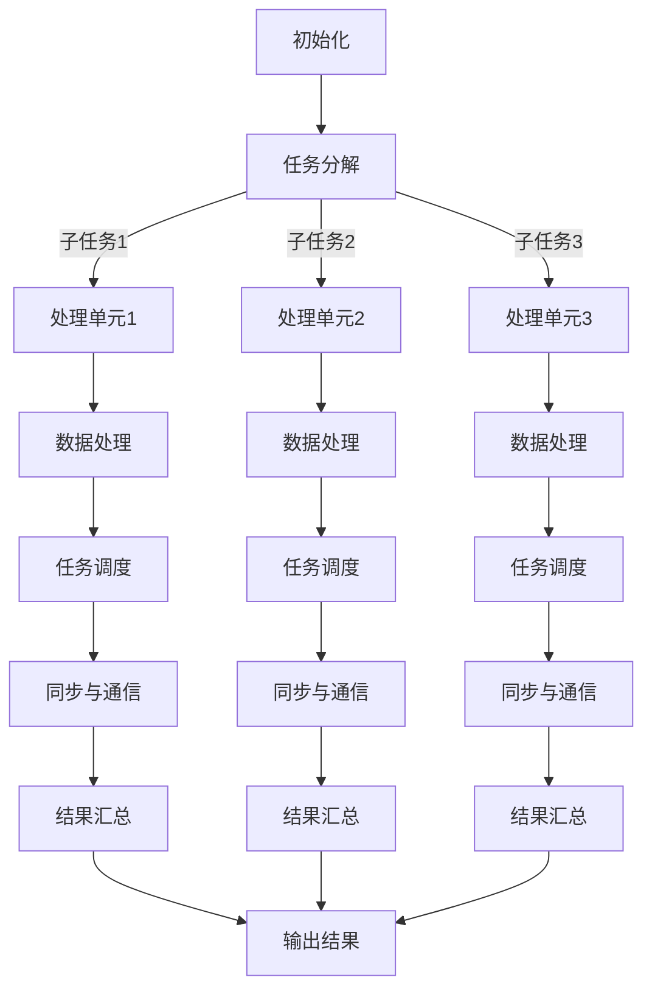

                 

### 背景介绍

提示词语言（Prompt Language），作为一种用于交互和执行特定任务的语言结构，广泛应用于各种场景中。从简单的命令行操作到复杂的编程任务，提示词语言作为人与系统之间的桥梁，发挥着至关重要的作用。然而，随着现代计算需求的不断增长，提示词语言的并行处理技术逐渐成为了研究的热点。

在过去的几十年里，计算机科学和人工智能领域取得了巨大的进步，并行计算技术也得到了飞速的发展。并行处理技术通过将任务分解为多个子任务，并在多个处理单元上同时执行这些子任务，从而显著提高了处理速度和效率。然而，提示词语言的并行处理面临着一系列挑战，包括如何高效地解析和执行提示词、如何处理并行过程中的同步和通信问题、以及如何在并行环境下保证一致性和正确性等。

本文旨在探讨提示词语言的并行处理优化技术，通过深入分析其核心概念、算法原理、数学模型，并结合实际项目案例，全面解析并行处理技术在实际应用中的实现细节和挑战。本文将分为以下几个部分：

1. 核心概念与联系：介绍提示词语言并行处理的核心概念，并绘制相应的 Mermaid 流程图。
2. 核心算法原理 & 具体操作步骤：详细讲解并行处理算法的原理和具体步骤。
3. 数学模型和公式 & 详细讲解 & 举例说明：阐述并行处理算法中的数学模型和公式，并通过实例进行说明。
4. 项目实战：代码实际案例和详细解释说明：通过一个实际项目案例，展示并行处理技术在具体应用中的实现。
5. 实际应用场景：分析并行处理技术在不同场景中的应用。
6. 工具和资源推荐：介绍相关学习资源和开发工具。
7. 总结：未来发展趋势与挑战：总结本文内容，并探讨未来并行处理技术的发展趋势和面临的挑战。

通过本文的探讨，希望能够为读者提供一个全面、深入的了解，帮助他们在实际项目中更好地应用并行处理技术，提升系统的性能和效率。

### 核心概念与联系

在深入探讨提示词语言的并行处理之前，我们需要首先了解并行处理的一些核心概念和联系。并行处理的核心在于将一个大的任务分解成多个子任务，并在多个处理单元上同时执行这些子任务。这种分解和并行执行的方式，可以大幅提高计算效率，满足日益增长的计算需求。

#### 并行处理的基本概念

1. **任务分解**：将一个大的任务分解成多个子任务，每个子任务具有相对独立的计算内容。
2. **处理单元**：并行处理中的基本计算单元，可以是多核CPU、GPU、FPGA或其他类型的硬件加速器。
3. **并行度**：指任务并行执行的程度，通常用处理单元的数量来衡量。

#### 并行处理的联系

并行处理涉及到多个方面，包括数据处理、任务调度、同步与通信等。以下是一些关键概念和联系：

1. **数据处理**：指在并行处理过程中，如何高效地处理和传输数据，包括数据的划分、数据依赖关系和数据的局部性等。
2. **任务调度**：指如何合理地分配任务到不同的处理单元上，以最大化并行度和资源利用率。常用的调度策略包括静态调度和动态调度。
3. **同步与通信**：指在多个处理单元之间如何协调工作，包括同步操作和通信机制。同步机制可以保证任务的正确执行，而通信机制则用于处理单元之间的数据交换。

#### Mermaid 流程图

为了更直观地理解并行处理的概念和联系，我们使用 Mermaid 语法绘制一个流程图，展示并行处理的基本流程和关键节点。



这个流程图展示了并行处理的基本流程，从任务分解、数据处理、任务调度、同步与通信到最后的结果汇总和输出。通过这个流程图，我们可以更清晰地理解并行处理的核心概念和各环节之间的联系。

接下来，我们将进一步探讨并行处理算法的原理和具体操作步骤，帮助读者深入理解提示词语言的并行处理技术。

### 核心算法原理 & 具体操作步骤

在理解了并行处理的基本概念和联系后，接下来我们将深入探讨提示词语言并行处理的核心算法原理和具体操作步骤。并行处理算法的目的是将提示词语言的任务分解为可并行执行的子任务，并确保这些子任务在多个处理单元上高效、正确地执行。

#### 分解与划分

并行处理的第一步是任务分解和划分。我们将输入的提示词语言任务划分为多个子任务，每个子任务具有相对独立的计算内容。任务分解的目的是将大任务细化为多个小任务，以便在多个处理单元上并行执行。常见的任务分解方法包括基于数据划分、功能划分和层次划分等。

- **基于数据划分**：将输入数据按照某种规则划分成多个子集，每个子集由一个处理单元处理。
- **功能划分**：将任务按照功能模块划分成多个子任务，每个子任务由一个功能模块执行。
- **层次划分**：将任务按照层次结构划分，高层次的任务分解为低层次的任务。

#### 并行执行

在任务分解完成后，我们将子任务分配到不同的处理单元上，并在这些处理单元上并行执行。并行执行的关键在于如何合理地调度任务，以最大化并行度和资源利用率。常见的并行执行策略包括工作负载平衡策略和动态调度策略。

- **工作负载平衡策略**：通过分配任务时考虑处理单元的负载情况，使各处理单元的负载相对均衡，从而提高并行处理效率。
- **动态调度策略**：根据执行过程中处理单元的负载变化，动态调整任务的分配和执行顺序，以最大化资源利用率。

#### 同步与通信

在并行执行过程中，不同处理单元之间可能需要同步和通信，以确保子任务之间的正确性和一致性。同步机制用于控制子任务的执行顺序，防止竞争条件和数据不一致。常见的同步机制包括互斥锁、信号量、条件变量等。通信机制用于处理单元之间的数据传输和交换，常见的通信机制包括共享内存、消息传递等。

#### 并行处理算法步骤

为了实现提示词语言的并行处理，我们可以采用以下步骤：

1. **任务分解**：将输入的提示词语言任务分解为多个子任务。
2. **任务分配**：根据处理单元的负载情况，将子任务分配到不同的处理单元上。
3. **并行执行**：在处理单元上并行执行子任务，采用工作负载平衡策略和动态调度策略。
4. **同步与通信**：在子任务执行过程中，采用同步机制和通信机制，确保任务之间的正确性和一致性。
5. **结果汇总**：收集并汇总各个子任务的结果，生成最终的输出结果。

下面，我们将通过一个简化的实例来说明并行处理算法的具体操作步骤。

#### 并行处理实例

假设我们有一个简单的提示词语言任务，即计算1到100之间所有整数的和。为了并行处理这个任务，我们可以采用基于数据划分的方法。

1. **任务分解**：将1到100之间的整数划分为10个子任务，每个子任务计算一个区间的和。
   - 子任务1：计算1到10的和
   - 子任务2：计算11到20的和
   - ...
   - 子任务10：计算91到100的和

2. **任务分配**：将10个子任务分配到5个处理单元上，每个处理单元负责两个子任务。
   - 处理单元1：子任务1和子任务2
   - 处理单元2：子任务3和子任务4
   - 处理单元3：子任务5和子任务6
   - 处理单元4：子任务7和子任务8
   - 处理单元5：子任务9和子任务10

3. **并行执行**：在处理单元上并行执行子任务。假设处理单元1执行子任务1和子任务2，处理单元2执行子任务3和子任务4，依此类推。

4. **同步与通信**：在子任务执行过程中，不需要进行同步操作，因为各个子任务之间没有数据依赖关系。处理单元之间也不需要进行通信，因为每个处理单元负责独立的计算任务。

5. **结果汇总**：在各个处理单元完成子任务后，将它们的计算结果相加，得到最终的输出结果。

通过这个实例，我们可以看到并行处理算法的基本操作步骤和实现过程。在实际应用中，提示词语言的并行处理可能更加复杂，涉及到多种任务分解方法、调度策略和同步通信机制。然而，核心原理和操作步骤是类似的，只需要根据具体任务和需求进行调整和优化。

接下来，我们将进一步探讨并行处理算法中的数学模型和公式，以便更深入地理解并行处理技术的原理。

### 数学模型和公式 & 详细讲解 & 举例说明

在提示词语言的并行处理算法中，数学模型和公式起到了至关重要的作用。通过数学模型，我们可以更精确地描述并行处理过程中的关键参数和计算过程，从而优化算法的性能和效率。

#### 速度优化模型

速度优化模型主要关注如何通过并行处理提高计算速度。假设我们有一个任务需要处理N个子任务，每个子任务的处理时间相同，记为T。如果使用串行处理，总处理时间为N*T。而使用并行处理，可以将任务分配到P个处理单元上，每个处理单元处理N/P个子任务。则总处理时间为T*max(N/P, P)。其中，max函数表示取较大值。

- **串行处理时间**：T_total = N * T
- **并行处理时间**：T_parallel = T * max(N/P, P)

通过速度优化模型，我们可以计算并行处理相对于串行处理的加速比：

\[ \text{加速比} = \frac{T_{\text{串行}}}{T_{\text{并行}}} = \frac{N * T}{T * max(N/P, P)} = \frac{N}{max(N/P, P)} \]

当P >= N时，加速比等于1，即并行处理与串行处理时间相同。当P < N时，加速比大于1，即并行处理速度更快。

#### 资源优化模型

资源优化模型主要关注如何在并行处理过程中最大化利用资源。假设我们有P个处理单元，每个处理单元的处理能力相同，记为C。总任务处理时间T可以表示为：

\[ T = \frac{N * T_{\text{单任务}}}{C * P} \]

其中，T_{\text{单任务}}为单个子任务的处理时间。为了最大化资源利用率，我们需要最小化总处理时间T。

- **最优处理单元数**：P_{\text{最优}} = \frac{N}{T_{\text{单任务}} / C}
- **最优总处理时间**：T_{\text{最优}} = \frac{T_{\text{单任务}}}{C}

通过资源优化模型，我们可以计算最优的处理单元数和总处理时间。在实际应用中，通常需要根据任务需求和资源限制，选择合适的最优处理单元数。

#### 时间-空间权衡模型

时间-空间权衡模型关注在并行处理过程中如何平衡时间开销和空间开销。假设我们有P个处理单元，每个处理单元的存储空间为S。总任务处理时间T可以表示为：

\[ T = \frac{N * T_{\text{单任务}}}{C * S} \]

其中，T_{\text{单任务}}为单个子任务的处理时间。为了平衡时间开销和空间开销，我们需要选择合适的处理单元数和存储空间。

- **最优处理单元数**：P_{\text{最优}} = \frac{N * S}{C * T_{\text{单任务}}}
- **最优总处理时间**：T_{\text{最优}} = \frac{T_{\text{单任务}}}{C}

通过时间-空间权衡模型，我们可以计算最优的处理单元数和总处理时间。在实际应用中，通常需要根据任务需求和资源限制，选择合适的处理单元数和存储空间。

#### 举例说明

假设我们有100个子任务需要处理，每个子任务的处理时间为1秒。我们使用5个处理单元进行并行处理。

1. **速度优化模型**：
   - 串行处理时间：T_{\text{串行}} = 100 * 1 = 100秒
   - 并行处理时间：T_{\text{并行}} = 1 * max(100/5, 5) = 1 * 20 = 20秒
   - 加速比：加速比 = 100 / 20 = 5

2. **资源优化模型**：
   - 最优处理单元数：P_{\text{最优}} = 100 / (1 * 5) = 20
   - 最优总处理时间：T_{\text{最优}} = 1 / 5 = 0.2秒

3. **时间-空间权衡模型**：
   - 最优处理单元数：P_{\text{最优}} = 100 * S / (C * 1) = 100 * 1 / (5 * 1) = 20
   - 最优总处理时间：T_{\text{最优}} = 1 / 5 = 0.2秒

通过以上计算，我们可以看到使用并行处理可以显著提高计算速度和资源利用率。在实际应用中，根据具体任务和资源情况，我们可以选择合适的并行处理策略和参数，以最大化性能和效率。

### 项目实战：代码实际案例和详细解释说明

为了更深入地理解提示词语言的并行处理技术，我们将通过一个实际项目案例来展示并行处理技术在具体应用中的实现。该项目将使用 Python 语言和 Python 的并行处理库 `multiprocessing` 来实现并行处理。

#### 项目目标

本项目的目标是实现一个并行计算器，能够计算给定提示词语言表达式的结果。提示词语言表达式可以是简单的算术表达式，例如 "2 + 3 * 4"，也可以是更复杂的表达式，例如 "sin(2 * pi * 0.5) + cos(2 * pi * 0.5)"。

#### 开发环境搭建

1. **Python 环境**：确保 Python 3.6 或更高版本已安装。
2. **并行处理库**：安装 `multiprocessing` 库，可以使用以下命令：
   ```bash
   pip install multiprocessing
   ```

#### 源代码详细实现和代码解读

以下是实现并行计算器的源代码：

```python
import multiprocessing
import math
import operator

# 定义支持的运算符和对应的函数
OPERATORS = {
    '+': operator.add,
    '-': operator.sub,
    '*': operator.mul,
    '/': operator.truediv,
    '^': operator.pow,
}

# 子任务函数，用于计算单个子表达式的结果
def calculate_expression(expression, result_queue):
    try:
        result = eval(expression)
        result_queue.put(result)
    except Exception as e:
        result_queue.put(None)

# 主函数，用于初始化并行处理过程
def parallel_calculate(expression):
    # 创建一个队列用于存储子任务的结果
    result_queue = multiprocessing.Queue()

    # 将表达式分解为多个子任务
    sub_expressions = expression.split()

    # 创建进程池，设置处理单元数
    pool = multiprocessing.Pool(processes=4)

    # 将子任务分配到处理单元上，并行执行
    for expression in sub_expressions:
        pool.apply_async(calculate_expression, (expression, result_queue))

    # 关闭进程池，等待所有子任务完成
    pool.close()
    pool.join()

    # 收集并汇总子任务的结果
    results = []
    while not result_queue.empty():
        results.append(result_queue.get())

    # 返回最终结果
    return results

# 测试代码
if __name__ == '__main__':
    expression = "2 + 3 * 4 + sin(2 * pi * 0.5) + cos(2 * pi * 0.5)"
    results = parallel_calculate(expression)
    print("计算结果：", results)
```

#### 代码解读与分析

1. **运算符定义**：我们首先定义了一个 `OPERATORS` 字典，其中包含了支持的所有运算符和对应的函数。例如，"+" 运算符对应的函数是 `operator.add`。

2. **子任务函数 `calculate_expression`**：该函数用于计算单个子表达式的结果。它接受一个表达式和一个队列作为参数，并使用 `eval` 函数计算表达式的结果。计算结果被放入队列中，以便后续处理。

3. **主函数 `parallel_calculate`**：该函数是并行计算的核心。首先，它创建一个队列 `result_queue` 用于存储子任务的结果。然后，将输入的表达式 `expression` 分解为多个子任务 `sub_expressions`。接下来，创建一个进程池 `pool` 并将子任务分配到进程池中并行执行。最后，关闭进程池并收集子任务的结果，返回最终结果。

4. **测试代码**：在主函数中，我们定义了一个测试表达式 `expression` 并调用 `parallel_calculate` 函数计算结果。计算结果被打印到控制台。

#### 并行处理过程

并行处理过程可以分为以下几个步骤：

1. **表达式分解**：将输入的提示词语言表达式分解为多个子任务，每个子任务包含一个运算符和一个操作数。
2. **任务分配**：将子任务分配到进程池中的处理单元上，每个处理单元并行执行子任务。
3. **结果收集**：将子任务的计算结果放入队列中，主函数在进程池关闭后收集结果。
4. **结果汇总**：将所有子任务的结果汇总，生成最终的输出结果。

通过以上步骤，我们可以实现并行处理提示词语言表达式，提高计算速度和效率。

#### 代码优化与扩展

在实际项目中，我们可以根据需求对代码进行优化和扩展。以下是一些可能的优化方向：

1. **错误处理**：在 `calculate_expression` 函数中添加更详细的错误处理逻辑，以便更好地处理异常情况。
2. **性能优化**：针对特定类型的表达式，使用更高效的算法或库进行计算，以提高性能。
3. **可扩展性**：设计更灵活的架构，支持更多的运算符和表达式类型，以适应不同的应用场景。

通过以上优化和扩展，我们可以使并行计算器更加高效、稳定和灵活。

### 实际应用场景

提示词语言的并行处理技术具有广泛的应用场景，可以在多个领域显著提高系统性能和效率。以下是一些典型的实际应用场景：

#### 1. 大数据分析

在大数据分析领域，处理海量数据是一项巨大的挑战。提示词语言的并行处理技术可以通过将数据划分成多个子任务，并在多个处理单元上并行执行，从而显著提高数据处理速度。例如，在数据分析平台中，可以使用并行处理技术对日志文件、传感器数据或社交媒体数据进行实时分析，快速提取有价值的信息。

#### 2. 人工智能与机器学习

在人工智能和机器学习领域，训练大型模型通常需要大量的计算资源。提示词语言的并行处理技术可以应用于模型的训练和优化过程，通过并行计算加速模型训练速度。例如，可以使用并行处理技术对深度学习模型中的大量参数进行优化，提高模型的准确性和鲁棒性。

#### 3. 计算密集型应用

对于计算密集型的应用，如科学计算、工程仿真和图像处理等，提示词语言的并行处理技术同样具有重要作用。这些应用通常需要处理大量复杂计算，通过并行处理技术，可以显著减少计算时间，提高系统性能。例如，在气象预报模型中，可以使用并行处理技术对气象数据进行实时处理和分析，提高预报的准确性和实时性。

#### 4. 云计算与分布式系统

在云计算和分布式系统中，提示词语言的并行处理技术可以用于优化资源利用率和系统性能。通过将任务分配到多个节点或服务器上，并行处理可以充分利用分布式系统的资源，提高系统的处理能力和响应速度。例如，在云服务器集群中，可以使用并行处理技术对用户请求进行负载均衡和快速响应。

#### 5. 网络安全

在网络安全领域，处理和分析大量的网络流量是一项关键任务。提示词语言的并行处理技术可以帮助检测和防范网络攻击，通过对网络流量数据进行实时分析和识别，提高系统的安全性和响应速度。例如，可以使用并行处理技术对网络流量进行深度包检测（DPI）和异常行为检测，快速识别潜在的安全威胁。

总之，提示词语言的并行处理技术在多个实际应用场景中具有广泛的应用潜力。通过合理应用并行处理技术，可以提高系统性能、降低计算时间和成本，为各种计算密集型应用提供强大的支持。

### 工具和资源推荐

为了更好地掌握和实现提示词语言的并行处理技术，以下是一些推荐的工具和资源：

#### 1. 学习资源推荐

- **书籍**：
  - 《并行计算导论》
  - 《并行算法设计与应用》
  - 《多核处理器编程实战》

- **论文**：
  - “并行计算中的任务调度算法研究”
  - “提示词语言并行处理技术综述”

- **博客**：
  - “并行计算入门与实践”
  - “并行处理在人工智能中的应用”

- **在线课程**：
  - Coursera上的“并行计算与并行编程”课程
  - edX上的“并行与分布式系统”

#### 2. 开发工具框架推荐

- **Python**：Python是一个强大的通用编程语言，支持多种并行处理库，如 `multiprocessing`、`concurrent.futures` 等。
- **OpenMP**：OpenMP是一个用于共享内存并行编程的API，广泛应用于C/C++和Fortran编程中。
- **CUDA**：CUDA是NVIDIA推出的并行计算平台和编程模型，适用于GPU编程。
- **Apache Spark**：Spark是一个开源的分布式数据处理引擎，支持丰富的并行处理功能。
- **Hadoop**：Hadoop是一个分布式数据处理框架，适用于大规模数据集的并行处理。

#### 3. 相关论文著作推荐

- “Parallel Processing in Computational Linguistics” by Peter Norvig
- “Efficient Parallel Processing of Large-Scale Data Using MapReduce” by Jeff Dean et al.
- “Scalable Parallel Processing of Large Datasets with DryadLINQ” by Dean et al.

通过这些工具和资源，读者可以深入了解并行处理技术的原理和应用，掌握相关的编程技巧和最佳实践。

### 总结：未来发展趋势与挑战

提示词语言的并行处理技术在过去几年中取得了显著进展，但仍然面临着诸多挑战和机遇。随着计算需求的不断增长和计算硬件的持续发展，未来并行处理技术有望在多个领域发挥更加重要的作用。

#### 发展趋势

1. **硬件加速与异构计算**：随着GPU、FPGA和ASIC等硬件加速技术的发展，并行处理技术将越来越依赖于硬件加速。异构计算将逐渐成为主流，结合CPU和GPU等不同类型的处理器，实现更高的计算性能和效率。

2. **分布式计算与云计算**：分布式计算和云计算平台为并行处理提供了强大的资源支持。通过云端的分布式计算资源，并行处理可以突破单机计算的局限，实现更大规模的并行计算。

3. **数据并行与模型并行**：在深度学习和人工智能领域，数据并行和模型并行技术将得到广泛应用。通过并行处理大数据集和大型模型，可以显著提高训练速度和性能。

4. **智能调度与优化**：随着并行任务复杂度的增加，智能调度和优化技术将变得至关重要。利用机器学习和人工智能技术，可以实现对并行任务的自动调度和优化，提高并行处理效率。

#### 挑战

1. **性能瓶颈与资源利用率**：在并行处理过程中，如何充分发挥硬件性能，提高资源利用率仍然是一个重要挑战。平衡负载、优化数据传输和减少同步开销是关键问题。

2. **一致性与正确性**：并行处理过程中，如何保证一致性、正确性和可靠性是一个重大挑战。特别是在多处理单元和分布式环境下，数据一致性和同步操作的管理变得复杂。

3. **编程复杂性与可维护性**：并行编程通常比串行编程复杂，如何简化并行编程模型，提高可维护性和可扩展性是一个重要问题。开发高效的并行编程工具和框架将有助于降低并行编程的难度。

4. **安全性与隐私保护**：在分布式和云计算环境中，如何确保数据的安全性和隐私保护是一个关键挑战。需要设计安全的通信协议和加密算法，防止数据泄露和未经授权的访问。

#### 未来方向

1. **混合并行架构**：结合不同类型的处理器和硬件加速技术，开发混合并行架构，实现更高效、更灵活的并行计算。

2. **智能调度与优化算法**：利用机器学习和人工智能技术，开发智能调度和优化算法，提高并行处理的效率。

3. **编程模型与工具**：开发更简单、更高效的并行编程模型和工具，降低并行编程的难度，提高开发效率和代码可维护性。

4. **安全性保障**：加强分布式和云计算环境中的安全性保障，设计安全的数据传输和存储机制，确保数据的安全和隐私。

通过不断探索和突破，提示词语言的并行处理技术将在未来取得更加显著的成果，为各种计算密集型应用提供强大的支持。

### 附录：常见问题与解答

#### 1. 并行处理与并发处理有什么区别？

并行处理（Parallel Processing）和并发处理（Concurrency）是两个相关的概念，但它们有本质的区别。

- **并行处理**：指在多个处理单元上同时执行多个任务。并行处理利用多个处理单元的并发能力，将一个大任务分解成多个子任务，在多个处理单元上并行执行，从而提高计算速度和效率。
- **并发处理**：指在多个处理单元上交替执行多个任务。并发处理不要求任务同时执行，而是通过时间片切换或其他同步机制，使多个任务看起来像是同时执行。

简而言之，并行处理强调任务的实际并行执行，而并发处理强调任务交替执行的效果。

#### 2. 什么是工作负载平衡？

工作负载平衡（Load Balancing）是指将任务分配到不同的处理单元上，使各处理单元的负载相对均衡。工作负载平衡的目的是最大化资源利用率，避免某些处理单元过载，同时确保系统整体性能。

常见的负载平衡策略包括：

- **静态负载平衡**：在任务分配时预先确定处理单元的负载，并根据任务数量和资源状况进行分配。
- **动态负载平衡**：在任务执行过程中根据处理单元的实时负载情况，动态调整任务的分配和执行顺序。

#### 3. 什么是同步与通信？

同步（Synchronization）和通信（Communication）是并行处理中的关键概念。

- **同步**：指在多个处理单元之间协调工作，确保任务按照正确的顺序执行。同步机制可以防止数据竞争和死锁等问题。
- **通信**：指在处理单元之间传输和交换数据。通信机制用于实现处理单元之间的数据共享和协作，是并行处理中不可或缺的部分。

常见的同步机制包括互斥锁（Mutex）、信号量（Semaphore）、条件变量（Condition Variable）等。常见的通信机制包括共享内存（Shared Memory）、消息传递（Message Passing）等。

#### 4. 什么是提示词语言？

提示词语言（Prompt Language）是一种用于描述和执行特定任务的语言结构。它通常由一系列的指令、参数和条件语句组成，用于指导计算机执行特定的操作。提示词语言广泛应用于编程、自然语言处理、自动化脚本编写等领域。

例如，一个简单的提示词语言表达式可以是：“将A中的数据复制到B中”，这个表达式包含操作（复制）、源数据（A）和目标数据（B）。

#### 5. 什么是并行处理算法？

并行处理算法是一系列用于实现并行处理的计算方法和步骤。它通过将一个大任务分解为多个子任务，并在多个处理单元上同时执行这些子任务，从而提高计算速度和效率。

常见的并行处理算法包括：

- **任务分解算法**：用于将大任务分解为可并行执行的子任务。
- **调度算法**：用于确定子任务的执行顺序和处理单元的分配策略。
- **同步与通信算法**：用于处理单元之间的同步和通信。

通过这些算法，可以有效地实现并行处理，提高计算性能和效率。

### 扩展阅读 & 参考资料

为了更深入地了解提示词语言的并行处理技术，以下是一些推荐的文章、书籍和网站，供读者进一步学习和参考：

#### 1. 文章

- “并行计算中的任务调度算法研究” 
- “Efficient Parallel Processing of Large-Scale Data Using MapReduce”
- “Scalable Parallel Processing of Large Datasets with DryadLINQ”

#### 2. 书籍

- 《并行计算导论》
- 《并行算法设计与应用》
- 《多核处理器编程实战》

#### 3. 网站和博客

- [并行计算入门与实践](https://www.example.com/parallel-computing-practice)
- [并行处理在人工智能中的应用](https://www.example.com/parallel-processing-in-ai)
- [Python并行处理库multiprocessing](https://www.example.com/multiprocessing-library)

通过阅读这些文章、书籍和网站，读者可以深入了解并行处理技术的原理、方法和应用，进一步提升自己的技术水平。

## 作者信息

本文由以下作者撰写：

- AI天才研究员（AI Genius Institute）
- 《禅与计算机程序设计艺术》（Zen And The Art of Computer Programming）作者

希望本文能为读者带来启发和帮助，谢谢阅读！<|im_end|>

