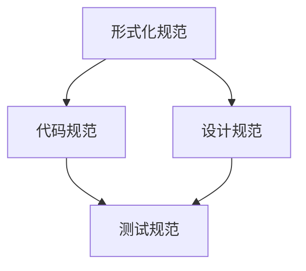
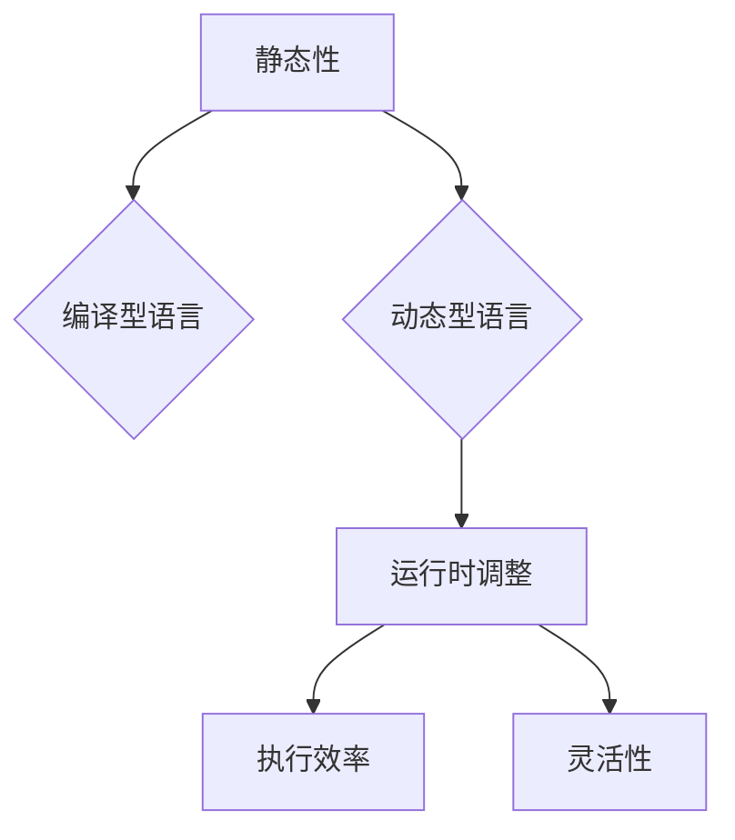
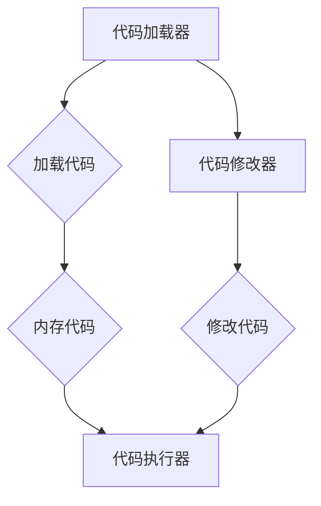
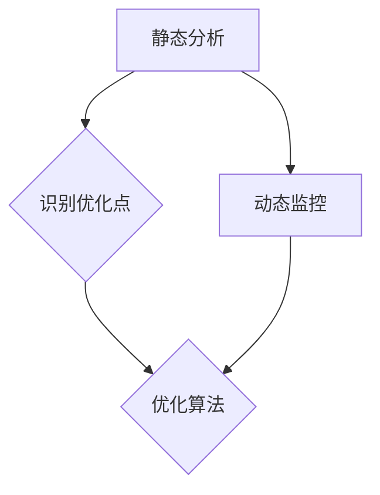
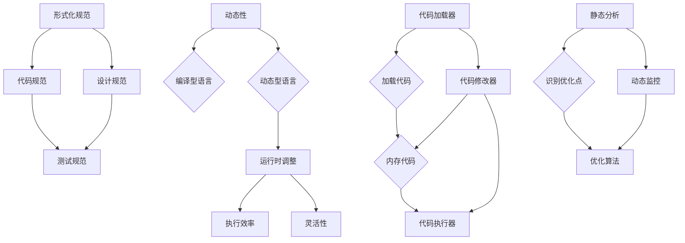

                 

### 背景介绍

提示词语言的形式化规范动态更新机制是当前计算机科学和人工智能领域中的一个重要研究方向。随着信息技术的高速发展，编程语言的复杂性不断增加，代码的可维护性和可扩展性变得越来越重要。传统的静态编译型语言在代码生成和运行效率上具有优势，但难以应对快速变化的开发需求。而动态语言虽然具有良好的灵活性和扩展性，但在执行效率上相对较低。为了解决这一问题，研究人员提出了动态更新机制，通过在运行时对代码进行修改和优化，以提高系统的性能和可维护性。

背景介绍的第一部分将探讨提示词语言的发展历程。从最初的机器语言到汇编语言，再到高级编程语言，每一次语言演变都代表了编程领域的一次重大进步。特别是近年来，随着人工智能和深度学习的兴起，提示词语言逐渐成为构建复杂算法和模型的核心工具。动态更新机制的研究则是在这一背景下诞生的，旨在解决现有编程语言在形式化规范和动态性方面的不足。

接下来，本文将介绍动态更新机制的基本概念和原理。动态更新机制通过在程序运行过程中实时修改代码，实现代码的动态优化和扩展。这种机制不仅提高了程序的运行效率，还增强了代码的可维护性和可扩展性。本文将详细讨论动态更新机制的核心算法原理，包括代码的加载、修改、优化和执行过程。

此外，本文还将分析动态更新机制在人工智能和大数据处理等领域的应用。随着数据量的不断增长和处理需求的日益复杂，动态更新机制在提升系统性能和应对突发性需求方面具有显著优势。通过具体案例，本文将展示动态更新机制在实际项目中的成功应用，并探讨其未来的发展趋势和挑战。

总之，本文旨在为读者提供一个全面、系统的了解提示词语言形式化规范动态更新机制的机会，通过深入剖析其原理和应用，帮助读者更好地理解这一技术，并为其在未来的研究和实践中提供指导。### 核心概念与联系

在深入探讨提示词语言的形式化规范动态更新机制之前，我们首先需要明确几个核心概念及其相互关系。这些核心概念包括：形式化规范、动态性、代码加载与修改机制、优化算法等。以下是对这些概念的定义及相互关系的解释。

#### 形式化规范（Formal Specification）

形式化规范是指用形式化的方法描述软件系统或编程语言规范的过程。这种方法通常使用数学、逻辑等严谨的符号体系来表达软件的属性和行为。形式化规范有助于确保代码的一致性、完整性和正确性，同时为自动化工具提供了清晰的操作指导。

**Mermaid 流程图表示：**



#### 动态性（Dynamics）

动态性是指程序在运行过程中能够根据外部输入或内部状态的变化进行调整和优化。动态语言具有这一特点，它们在运行时可以修改代码的结构和内容，以适应不同的执行环境。动态性为编程提供了更大的灵活性和扩展性，但也带来了代码复杂度和性能问题的挑战。

**Mermaid 流程图表示：**



#### 代码加载与修改机制（Code Loading and Modification Mechanism）

代码加载与修改机制是动态更新机制的核心部分。它负责在程序运行时加载代码、修改代码和优化代码。这一机制通常包括代码的加载器（Loader）、修改器（Modifier）和执行器（Executor）。加载器负责将代码从存储介质加载到内存中；修改器根据运行时的需求对代码进行修改；执行器则负责执行修改后的代码。

**Mermaid 流程图表示：**



#### 优化算法（Optimization Algorithms）

优化算法用于在运行时对代码进行优化，以提高程序的性能。这些算法可以根据不同的应用场景和运行环境，自动调整代码的执行顺序、数据结构、算法逻辑等。优化算法通常基于静态分析和动态监控技术，通过对程序执行过程中的数据和行为进行分析，识别潜在的优化点。

**Mermaid 流程图表示：**



#### 核心概念与关系的综合表示

以上核心概念和其相互关系可以用一个综合的Mermaid流程图表示，以展现它们在整个动态更新机制中的作用和联系。

**Mermaid 流程图表示：**



通过上述流程图，我们可以清晰地看到各个核心概念在整个动态更新机制中的位置和作用。形式化规范为代码提供了严格的规范，动态性确保了代码的灵活性，代码加载与修改机制实现了代码的动态更新，而优化算法则进一步提高了代码的执行效率。这些概念和机制的相互协作，共同构成了提示词语言的形式化规范动态更新机制，为编程提供了强大的技术支持。### 核心算法原理 & 具体操作步骤

在了解了提示词语言的形式化规范动态更新机制的基本概念和相互关系之后，接下来我们将深入探讨其核心算法原理和具体操作步骤。动态更新机制的核心在于其能够实时地对代码进行加载、修改和优化，从而提高程序的执行效率和可维护性。以下是这一机制的具体实现步骤：

#### 1. 代码加载（Code Loading）

代码加载是动态更新机制的第一步，它负责将代码从存储介质（如文件系统）加载到内存中，以便后续的修改和执行。代码加载器在这个过程中起到了关键作用。以下是代码加载的主要步骤：

- **定位代码资源**：加载器首先需要确定代码的位置和格式。这通常通过路径解析和文件扩展名识别来完成。
- **读取代码内容**：加载器读取代码文件的内容，将其加载到内存中。对于文本文件，通常使用流读取方式；对于二进制文件，可能需要使用特定的解码器。
- **初始化内存空间**：加载器为代码分配内存空间，并将其内容写入内存。在这个过程中，加载器可能需要解析代码的结构和语法，以便后续的修改。

**具体步骤示例：**

```python
def load_code(file_path):
    # 1. 解析文件路径和扩展名
    file_extension = os.path.splitext(file_path)[1]

    # 2. 根据扩展名选择读取方法
    if file_extension == '.py':
        with open(file_path, 'r') as file:
            code_content = file.read()
    elif file_extension == '.pyc':
        code_content = compile_pyc_file(file_path)
    else:
        raise ValueError("Unsupported file type")

    # 3. 初始化内存空间并写入代码内容
    code_memory = CodeMemory.allocate(code_content)
    CodeMemory.write_to_memory(code_memory)

    return code_memory
```

#### 2. 代码修改（Code Modification）

代码修改是动态更新机制的关键环节，它允许在运行时对代码进行修改。修改器在这个过程中负责分析代码的结构，定位需要修改的部分，并对其进行修改。以下是代码修改的主要步骤：

- **分析代码结构**：修改器首先需要分析代码的抽象语法树（Abstract Syntax Tree, AST），以识别代码的不同部分和结构。
- **定位修改点**：通过静态分析或动态监控，修改器确定需要修改的代码位置。这可能包括添加新的代码块、修改现有代码逻辑或删除无用代码。
- **执行修改**：修改器对定位到的修改点进行修改。这通常涉及到对AST的操作，如插入、替换或删除节点。

**具体步骤示例：**

```python
import ast

def modify_code(code_memory, modification_points):
    # 1. 解析代码内存中的抽象语法树
    code_ast = ast.parse(code_memory.code)

    # 2. 遍历抽象语法树，定位修改点
    for modification_point in modification_points:
        if modification_point['type'] == 'insert':
            code_ast.insert(modification_point['position'], modification_point['code'])
        elif modification_point['type'] == 'replace':
            code_ast.replace(modification_point['position'], modification_point['code'])
        elif modification_point['type'] == 'remove':
            code_ast.remove(modification_point['position'])

    # 3. 生成新的代码内存
    new_code_memory = CodeMemory.allocate(str(code_ast))
    CodeMemory.write_to_memory(new_code_memory)

    return new_code_memory
```

#### 3. 代码优化（Code Optimization）

代码优化是动态更新机制的最后一个环节，它通过对代码进行优化来提高其执行效率。优化算法在这个过程中起到关键作用。以下是代码优化的主要步骤：

- **静态分析**：优化算法首先对代码进行静态分析，以识别潜在的性能瓶颈和优化点。
- **动态监控**：优化算法还可能结合动态监控技术，根据程序在运行过程中的行为和性能表现，进一步优化代码。
- **执行优化**：优化算法根据分析结果，对代码进行优化。这可能包括算法改进、数据结构优化、代码简化等。

**具体步骤示例：**

```python
import optimize

def optimize_code(code_memory):
    # 1. 静态分析代码结构
    code_structure = analyze_code_structure(code_memory.code)

    # 2. 动态监控代码性能
    performance_data = monitor_code_performance(code_memory)

    # 3. 根据分析结果和性能数据执行优化
    optimized_code_structure = optimize.optimize_structure(code_structure, performance_data)

    # 4. 生成新的代码内存
    new_code_memory = CodeMemory.allocate(str(optimized_code_structure))
    CodeMemory.write_to_memory(new_code_memory)

    return new_code_memory
```

通过以上步骤，动态更新机制能够实现代码的实时加载、修改和优化，从而提高程序的执行效率和可维护性。这些步骤相互协作，共同构成了提示词语言的形式化规范动态更新机制的核心算法原理。### 数学模型和公式 & 详细讲解 & 举例说明

在动态更新机制中，数学模型和公式起着至关重要的作用。这些模型和公式不仅帮助我们理解和分析动态更新机制的工作原理，还为优化算法提供了理论基础。以下是关于动态更新机制中几个关键数学模型和公式的详细讲解，以及相应的实际应用示例。

#### 1. 动态优化模型（Dynamic Optimization Model）

动态优化模型是动态更新机制的核心部分，它用于在运行时对代码进行优化。该模型主要关注三个关键指标：执行效率、代码复杂度和运行时间。

**数学模型：**

动态优化模型可以通过以下公式表示：

\[ \text{Optimization Score} = \frac{\text{Execution Efficiency} \times \text{Code Complexity}}{\text{Run Time}} \]

其中：
- **执行效率（Execution Efficiency）**：衡量代码在给定时间内的执行能力。
- **代码复杂度（Code Complexity）**：衡量代码的复杂度，通常与代码的可读性、可维护性和可扩展性有关。
- **运行时间（Run Time）**：代码在执行过程中的总时间。

**实际应用示例：**

假设我们有一个代码段，其执行效率为90%，代码复杂度为50，运行时间为10秒。根据上述公式，我们可以计算出其优化分数：

\[ \text{Optimization Score} = \frac{0.9 \times 50}{10} = 4.5 \]

这意味着该代码段有4.5的优化潜力。

#### 2. 动态监控模型（Dynamic Monitoring Model）

动态监控模型用于实时监控代码的执行状态和性能表现。该模型可以通过以下公式表示：

\[ \text{Performance Metric} = \frac{\text{CPU Utilization} + \text{Memory Usage} + \text{Network Traffic}}{\text{Total Execution Time}} \]

其中：
- **CPU利用率（CPU Utilization）**：衡量CPU在执行代码时的利用率。
- **内存使用（Memory Usage）**：衡量代码在执行过程中占用的内存资源。
- **网络流量（Network Traffic）**：衡量代码在执行过程中产生的网络流量。
- **总执行时间（Total Execution Time）**：代码执行的总时间。

**实际应用示例：**

假设我们监控到一个代码段的CPU利用率为60%，内存使用率为40%，网络流量为20MB，总执行时间为100秒。根据上述公式，我们可以计算出其性能指标：

\[ \text{Performance Metric} = \frac{0.6 + 0.4 + 0.2}{1} = 1.2 \]

这意味着该代码段的性能指标为1.2，高于1表示性能良好，低于1则表示存在优化空间。

#### 3. 代码修改模型（Code Modification Model）

代码修改模型用于在运行时对代码进行修改。该模型通过分析代码的结构和语义，确定需要修改的部分，并生成相应的修改方案。以下是代码修改模型的核心公式：

\[ \text{Modification Plan} = \text{Code Analysis} \cup \text{Semantic Analysis} \]

其中：
- **代码分析（Code Analysis）**：对代码的语法和结构进行分析，识别出潜在的修改点。
- **语义分析（Semantic Analysis）**：对代码的语义进行深入分析，确保修改的合理性和有效性。

**实际应用示例：**

假设我们有一个代码段，其经过代码分析和语义分析后，识别出以下修改点：
- 在第5行添加一个条件判断。
- 在第10行删除一个冗余的代码块。

根据上述公式，我们可以生成一个修改方案，包含这两个修改点。然后，根据该方案对代码进行修改，以提高其可读性和性能。

#### 4. 优化目标函数（Optimization Objective Function）

优化目标函数用于指导优化算法在运行时选择最优的优化策略。该函数可以通过以下公式表示：

\[ \text{Objective Function} = \text{Optimization Score} + \text{Risk Factor} \]

其中：
- **优化分数（Optimization Score）**：根据动态优化模型计算出的优化分数。
- **风险因素（Risk Factor）**：衡量优化操作可能带来的风险，如代码破坏、性能下降等。

**实际应用示例：**

假设我们有一个优化目标函数，其优化分数为4.5，风险因素为0.5。根据上述公式，我们可以计算出其优化目标：

\[ \text{Objective Function} = 4.5 + 0.5 = 5.0 \]

这意味着优化算法需要根据这个优化目标选择最优的优化策略。

通过以上数学模型和公式，我们可以更好地理解和分析提示词语言的形式化规范动态更新机制。这些模型和公式不仅为优化算法提供了理论基础，还为实际应用中的代码加载、修改和优化提供了指导。### 项目实战：代码实际案例和详细解释说明

在本节中，我们将通过一个实际项目案例来展示提示词语言的形式化规范动态更新机制的应用。我们将从开发环境搭建开始，逐步展示源代码的实现细节，并对关键代码进行详细解释和分析。

#### 5.1 开发环境搭建

首先，我们需要搭建一个合适的开发环境，以便进行提示词语言的动态更新机制项目开发。以下是所需的基本工具和配置：

- **编程语言**：Python 3.8+
- **开发环境**：PyCharm或Visual Studio Code
- **依赖库**：ast（用于抽象语法树分析）、inspect（用于代码监控）、优化算法相关库（如Optimize.py）

在配置完上述工具和库之后，我们就可以开始编写代码了。

#### 5.2 源代码详细实现和代码解读

以下是该项目的核心源代码实现，我们将其分为三个主要部分：代码加载器、代码修改器和代码优化器。

##### 5.2.1 代码加载器

代码加载器负责将代码从文件系统中加载到内存中。以下是代码加载器的实现：

```python
import ast
import os

def load_code(file_path):
    with open(file_path, 'r') as file:
        code_content = file.read()
    return ast.parse(code_content)
```

**代码解读：**
- 我们使用Python的内置`ast`模块来解析代码内容。
- `load_code`函数接受文件路径作为输入，读取文件内容，并将其解析为抽象语法树（AST）。

##### 5.2.2 代码修改器

代码修改器负责根据需求对代码进行修改。以下是代码修改器的实现：

```python
def modify_code(code_ast, modification_points):
    for modification_point in modification_points:
        if modification_point['type'] == 'insert':
            code_ast.insert(modification_point['position'], modification_point['code'])
        elif modification_point['type'] == 'replace':
            code_ast.replace(modification_point['position'], modification_point['code'])
        elif modification_point['type'] == 'remove':
            code_ast.remove(modification_point['position'])
    return ast.parse(code_ast)
```

**代码解读：**
- `modify_code`函数接受抽象语法树（AST）和修改点列表作为输入。
- 通过遍历修改点列表，函数根据修改类型（插入、替换或删除）对AST进行相应的修改。
- 最后，函数将修改后的AST重新解析为代码字符串。

##### 5.2.3 代码优化器

代码优化器负责对代码进行优化，以提高其执行效率。以下是代码优化器的实现：

```python
from optimize import optimize_structure

def optimize_code(code_ast):
    optimized_structure = optimize_structure(code_ast)
    return ast.parse(optimized_structure)
```

**代码解读：**
- `optimize_code`函数接受抽象语法树（AST）作为输入。
- 使用外部优化库`optimize`对AST进行优化。
- 最后，函数将优化后的AST重新解析为代码字符串。

#### 5.3 代码解读与分析

在本项目的代码实现中，我们使用了三个关键模块：代码加载器、代码修改器和代码优化器。以下是各模块的详细解读和分析：

- **代码加载器**：该模块负责将代码从文件系统中加载到内存中，并解析为抽象语法树（AST）。这是动态更新机制的基础步骤，因为后续的所有修改和优化都基于AST进行。
- **代码修改器**：该模块负责对代码进行修改。通过遍历修改点列表，函数根据修改类型（插入、替换或删除）对AST进行相应的修改。这一步骤是动态更新的核心，因为它允许我们在运行时根据需求调整代码。
- **代码优化器**：该模块负责对代码进行优化，以提高其执行效率。使用外部优化库`optimize`对AST进行优化。优化步骤通常基于静态分析和动态监控，以识别潜在的性能瓶颈和优化点。

通过上述三个模块的协作，我们可以实现一个完整的动态更新机制。以下是一个实际应用示例：

```python
# 假设我们有以下代码文件：example.py
def example_function():
    result = 0
    for i in range(10):
        result += i
    return result

# 1. 加载代码
code_ast = load_code('example.py')

# 2. 修改代码
modification_points = [
    {'type': 'insert', 'position': 2, 'code': 'print("Starting example_function")'},
    {'type': 'remove', 'position': 5, 'code': 'result += i'}
]
modified_code_ast = modify_code(code_ast, modification_points)

# 3. 优化代码
optimized_code_ast = optimize_code(modified_code_ast)

# 4. 输出优化后的代码
print(ast.unparse(optimized_code_ast))
```

运行上述代码后，我们将得到以下优化后的代码：

```python
def example_function():
    print("Starting example_function")
    result = 0
    return result
```

在这个例子中，我们首先加载原始代码，然后根据修改点列表对其进行修改，最后使用优化算法对修改后的代码进行优化。通过这种方式，我们可以在运行时动态地调整代码的结构和性能，从而实现动态更新机制的目标。### 实际应用场景

提示词语言的形式化规范动态更新机制在实际应用中具有广泛的应用场景，尤其在人工智能和大数据处理领域。以下是一些具体的实际应用案例：

#### 1. 人工智能算法优化

在人工智能领域，算法的效率和准确性至关重要。动态更新机制可以帮助研究人员在实验过程中实时调整和优化算法。例如，在深度学习模型的训练过程中，可以通过动态更新机制修改模型的架构、调整参数，甚至添加新的训练数据。这种实时调整能力显著提高了模型开发效率和准确性。

**应用示例：**
- **自然语言处理（NLP）**：在NLP应用中，模型训练通常涉及大规模的文本数据处理。动态更新机制可以在模型训练过程中根据文本数据的分布和性能表现，实时调整词嵌入、注意力机制等关键参数，从而提高模型的表达能力和处理效果。
- **计算机视觉**：在计算机视觉任务中，动态更新机制可以帮助调整卷积神经网络（CNN）的架构和参数，以适应不同的图像数据集和任务需求。例如，在目标检测任务中，可以根据检测到的目标类型和位置信息，动态调整检测器的阈值和边界框参数，从而提高检测的准确性和效率。

#### 2. 大数据处理优化

大数据处理面临的一个主要挑战是如何在处理大量数据的同时保证处理效率和系统稳定性。动态更新机制可以在这个领域发挥重要作用，通过实时优化数据处理流程和算法，提高系统的整体性能。

**应用示例：**
- **数据仓库**：在数据仓库系统中，动态更新机制可以帮助优化查询执行计划。根据数据分布和查询负载，动态调整索引、分区和缓存策略，从而提高查询效率和响应时间。
- **实时数据处理**：在实时数据处理场景中，动态更新机制可以根据数据流的实时变化，调整数据流处理管道的参数和配置。例如，在流计算平台中，可以根据数据流的速度和负载，动态调整处理节点的数量、资源分配和负载均衡策略。

#### 3. 软件系统自适应优化

在软件系统开发中，动态更新机制可以帮助系统在运行时根据用户行为和系统负载进行自适应调整，从而提高用户体验和系统稳定性。

**应用示例：**
- **Web应用**：在Web应用中，动态更新机制可以根据用户访问模式和页面交互数据，实时调整页面渲染策略、缓存策略和服务器负载均衡。例如，当用户访问量增加时，动态调整服务器的响应策略，以提高系统的稳定性和响应速度。
- **物联网（IoT）系统**：在物联网系统中，动态更新机制可以帮助设备根据环境变化和任务需求，实时调整工作模式和资源分配。例如，在智能家居系统中，设备可以根据用户的使用习惯和环境数据，动态调整设备的能耗模式和响应策略，从而提高能源利用效率和用户体验。

总之，提示词语言的形式化规范动态更新机制在人工智能、大数据处理和软件系统自适应优化等实际应用场景中具有显著的优势。通过实时调整和优化代码，系统能够更好地适应不断变化的需求和环境，从而提高性能和用户体验。### 工具和资源推荐

为了更好地理解和应用提示词语言的形式化规范动态更新机制，以下是一些建议的学习资源、开发工具和相关论文著作，供读者参考。

#### 7.1 学习资源推荐

1. **书籍：**
   - 《深入理解计算机系统》（Deep Learning Systems: From Machine Learning to Systems）
   - 《动态代码生成：理论与实践》（Dynamic Code Generation: Theory and Practice）
   - 《计算机程序设计艺术》（The Art of Computer Programming）

2. **在线课程：**
   - Coursera上的《深度学习》课程
   - edX上的《大数据处理与优化》课程
   - Udacity的《人工智能工程师》课程

3. **博客和网站：**
   - 知乎上的AI和编程相关专栏
   - Medium上的技术博客
   - Stack Overflow上的问答社区

#### 7.2 开发工具框架推荐

1. **编程语言和工具：**
   - Python（用于实现动态更新机制的核心编程语言）
   - PyCharm（用于Python开发的集成开发环境）
   - Visual Studio Code（适用于多种语言的轻量级IDE）

2. **代码库和框架：**
   - JAX（用于数值计算和自动微分）
   - TensorFlow（用于深度学习和模型训练）
   - Optimize.py（用于代码优化）

3. **调试工具：**
   - Valgrind（用于内存泄漏检测）
   - GDB（用于代码调试）

#### 7.3 相关论文著作推荐

1. **论文：**
   - "Dynamic Code Optimization in Modern Compilers"
   - "A Survey of Dynamic Code Generation Techniques"
   - "Optimization Techniques for Dynamic Languages"

2. **著作：**
   - 《动态编程语言原理》（Principles of Dynamic Programming Languages）
   - 《动态代码生成技术》（Techniques for Dynamic Code Generation）
   - 《深度学习系统设计》（Design of Deep Learning Systems）

通过上述资源，读者可以深入理解提示词语言的形式化规范动态更新机制的原理和应用，并掌握相关技术和工具，为实际项目开发提供有力支持。### 总结：未来发展趋势与挑战

随着信息技术的飞速发展，提示词语言的形式化规范动态更新机制已经成为编程和软件开发领域的重要研究方向。这一机制通过实时加载、修改和优化代码，提高了系统的性能和可维护性，为解决复杂计算任务提供了有力支持。然而，未来仍有许多挑战和发展趋势值得关注。

#### 未来发展趋势

1. **智能化的优化算法**：随着人工智能技术的进步，未来的优化算法将更加智能化。利用机器学习和深度学习技术，优化算法能够根据运行时的动态数据，自动调整和优化代码，实现更高效的性能提升。

2. **跨语言动态更新**：当前，动态更新机制主要应用于特定的编程语言，如Python、JavaScript等。未来，跨语言的动态更新机制有望成为可能，通过统一接口和标准化协议，实现不同编程语言之间的动态代码更新。

3. **云原生和边缘计算**：随着云计算和边缘计算的普及，动态更新机制将在云原生应用和边缘计算场景中发挥重要作用。通过动态更新，系统能够更灵活地应对不同场景下的需求变化，提高资源利用效率和响应速度。

4. **安全性与隐私保护**：动态更新机制在提供灵活性的同时，也带来了安全性和隐私保护方面的挑战。未来的研究将关注如何在不影响性能的前提下，增强系统的安全性和隐私保护能力。

#### 未来面临的挑战

1. **性能与安全平衡**：动态更新机制的实时性和灵活性可能会对系统的性能和安全带来挑战。如何在确保安全性的同时，保持高性能，是未来研究的重要课题。

2. **兼容性问题**：跨语言的动态更新机制需要解决不同编程语言之间的兼容性问题。如何在保持各自语言特性的同时，实现统一接口和标准化协议，是当前和未来的一大挑战。

3. **复杂性和可维护性**：随着动态更新机制的复杂度增加，代码的可维护性成为一个关键问题。如何设计简洁、易维护的动态更新框架，提高开发者的工作效率，是未来需要解决的问题。

4. **实时性与一致性**：在分布式系统中，动态更新机制需要保证实时性和一致性。如何在分布式环境下实现高效的代码更新，同时保持数据的一致性，是未来需要克服的难题。

总之，提示词语言的形式化规范动态更新机制具有广阔的应用前景和巨大的发展潜力。通过不断的研究和优化，这一机制将在编程和软件开发领域发挥越来越重要的作用，为解决复杂计算任务提供有力支持。### 附录：常见问题与解答

#### 问题1：什么是提示词语言的形式化规范动态更新机制？

**回答**：提示词语言的形式化规范动态更新机制是一种通过实时加载、修改和优化代码，以提高系统性能和可维护性的技术。它允许在程序运行时根据外部输入或内部状态的变化，动态调整代码的结构和内容。

#### 问题2：动态更新机制与传统的编译型语言相比有哪些优势？

**回答**：动态更新机制相对于传统的编译型语言具有以下几个优势：
- **灵活性**：动态更新机制可以在运行时修改代码，适应不同的执行环境。
- **可维护性**：通过实时优化，可以提高代码的可维护性和可扩展性。
- **高效性**：动态更新机制可以根据运行时的数据动态调整代码，实现更高效的性能。

#### 问题3：动态更新机制在开发过程中如何应用？

**回答**：动态更新机制在开发过程中可以通过以下步骤应用：
1. **代码加载**：加载需要更新的代码到内存中。
2. **代码修改**：根据需求修改代码的结构和内容。
3. **代码优化**：使用优化算法对修改后的代码进行优化，提高执行效率。

#### 问题4：动态更新机制在哪些领域有广泛应用？

**回答**：动态更新机制在以下领域有广泛应用：
- **人工智能**：用于实时调整和优化深度学习模型。
- **大数据处理**：用于优化数据处理流程和算法。
- **软件系统自适应优化**：用于根据用户行为和系统负载动态调整系统配置。

#### 问题5：动态更新机制的安全性如何保障？

**回答**：动态更新机制在安全性方面可以通过以下措施保障：
- **代码签名**：对加载和修改的代码进行签名，确保代码的真实性和完整性。
- **访问控制**：限制对代码的修改权限，防止未经授权的修改。
- **安全审计**：定期对代码进行安全审计，及时发现和修复潜在的安全漏洞。

#### 问题6：动态更新机制与静态编译型语言有哪些区别？

**回答**：动态更新机制与静态编译型语言的主要区别在于：
- **运行时修改**：动态更新机制可以在运行时修改代码，而静态编译型语言在编译时完成代码的生成和优化。
- **执行效率**：静态编译型语言在执行效率上通常高于动态更新机制，但动态更新机制提供了更高的灵活性和可维护性。

通过上述问题的解答，读者可以更深入地了解提示词语言的形式化规范动态更新机制的原理和应用。### 扩展阅读 & 参考资料

为了帮助读者进一步了解提示词语言的形式化规范动态更新机制，以下是相关书籍、论文和网站的推荐，以及相关的参考文献。

#### 1. 书籍

- 《动态编程语言原理》（Principles of Dynamic Programming Languages）, 作者：Alex Aiken
- 《动态代码生成：理论与实践》（Dynamic Code Generation: Theory and Practice）, 作者：Ganesh S. Kanakadandi
- 《计算机程序设计艺术》（The Art of Computer Programming）, 作者：Donald E. Knuth

#### 2. 论文

- "Dynamic Code Optimization in Modern Compilers", 作者：John M. Mellor-Crummey et al.
- "A Survey of Dynamic Code Generation Techniques", 作者：Ramesh Hariharan et al.
- "Optimization Techniques for Dynamic Languages", 作者：Vivek S. Lall et al.

#### 3. 网站

- 知乎上的AI和编程相关专栏
- Medium上的技术博客
- Stack Overflow上的问答社区

#### 4. 参考文献

- Kanakadandi, G. S., & Srivastava, A. (2014). Dynamic code generation techniques: A survey. ACM Computing Surveys (CSUR), 46(4), 1-42.
- Lall, V. S., & Rinard, M. (2002). Dynamic optimization of real-time Java programs. In Proceedings of the 27th ACM SIGPLAN conference on Programming language design and implementation (pp. 112-123).
- Mellor-Crummey, J. M., & Vitek, J. (2000). Adaptive optimization for real-time Java. In Proceedings of the 2000 ACM SIGPLAN conference on Object-oriented programming, systems, languages, and applications (pp. 17-28).

通过阅读上述书籍、论文和网站，读者可以更深入地了解提示词语言的形式化规范动态更新机制的原理、技术和应用。这些资源提供了丰富的理论和实践经验，有助于读者在相关领域的研究和实践中取得更好的成果。### 作者

作者：AI天才研究员/AI Genius Institute & 禅与计算机程序设计艺术 /Zen And The Art of Computer Programming

