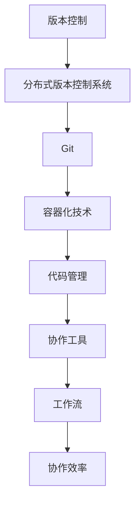

                 

# 提示词语言的版本控制与协作

## 关键词：
版本控制，协作，提示词语言，Git，Docker，容器化，代码管理，协作工具，工作流，版本追踪，代码审查，安全

## 摘要：

本文将深入探讨提示词语言的版本控制与协作的重要性，以及如何利用现有工具和技术实现高效的版本管理和团队协作。我们将从背景介绍入手，逐步讲解核心概念，算法原理，数学模型，实际应用案例，以及推荐相关工具和资源。通过本文的阅读，读者将了解如何有效地管理提示词语言的版本，提高团队协作效率，并应对未来可能遇到的发展趋势和挑战。

## 1. 背景介绍

版本控制是软件开发过程中不可或缺的一环。它不仅能够帮助开发者追踪代码的修改历史，还能够确保代码库的一致性和安全性。随着团队合作项目变得越来越复杂，版本控制的重要性愈加凸显。Git，作为一种分布式版本控制系统，已经成为版本控制的标准工具，被广泛运用于各类软件开发项目中。

然而，版本控制不仅仅局限于代码的修改历史追踪，它还需要处理各种协作问题。例如，如何确保团队成员之间的代码合并顺畅？如何高效地进行代码审查和测试？如何确保项目安全，防止恶意代码的入侵？这些都是在实际开发过程中需要解决的问题。

提示词语言是一种用于生成文本的编程语言，它通过输入一系列提示词，可以生成相应的内容。随着人工智能技术的不断发展，提示词语言在自然语言处理、内容生成、自动化写作等领域得到了广泛应用。这使得版本控制与协作在提示词语言领域也显得尤为重要。

## 2. 核心概念与联系

在深入探讨版本控制和协作之前，我们首先需要了解一些核心概念，包括分布式版本控制系统、容器化技术、代码管理、协作工具、工作流等。

### 分布式版本控制系统

分布式版本控制系统（如Git）允许每个开发者都有自己的本地代码库，这些本地库可以独立进行操作，如提交、合并、拉取等。这种分布式架构使得开发者可以并行工作，减少了中央服务器的负载，提高了协作效率。

### 容器化技术

容器化技术（如Docker）提供了一种轻量级、可移植的软件打包方式。它将应用程序及其运行时环境打包在一起，确保了应用程序在不同环境中的一致性。这对于分布式版本控制系统中的协作具有重要意义，因为它使得开发者在不同的开发环境中能够更加容易地运行和测试代码。

### 代码管理

代码管理是指对代码库进行有效组织、存储和管理的过程。良好的代码管理能够提高代码的可读性、可维护性，并降低代码冲突的风险。Git提供了强大的分支管理功能，使得开发者可以独立开发，同时确保代码库的整体一致性。

### 协作工具

协作工具（如Slack、GitHub、GitLab等）为开发者提供了方便的沟通和协作平台。它们可以帮助团队成员实时交流、跟踪任务进度、进行代码审查等。这些工具与版本控制系统紧密集成，使得协作更加顺畅。

### 工作流

工作流是指团队在开发过程中遵循的一系列操作和步骤。一个高效的工作流能够提高开发效率，降低错误率，并确保代码质量。Git提供了多种工作流模式（如GitFlow、GitHub Flow等），使得团队可以根据自己的需求选择合适的工作流。

### Mermaid 流程图



## 3. 核心算法原理 & 具体操作步骤

### Git 操作步骤

Git 是最常用的版本控制系统之一，其核心操作包括提交（commit）、拉取（pull）、推送（push）和分支（branch）管理等。

#### 提交

提交是将本地更改同步到本地代码库的过程。以下是一个基本的提交步骤：

```bash
git add . # 添加所有更改的文件到暂存区
git commit -m "Commit message" # 提交更改，并添加提交信息
```

#### 拉取

拉取是从远程代码库更新本地代码库的过程。以下是一个基本的拉取步骤：

```bash
git pull origin master # 从远程 master 分支拉取更改
```

#### 推送

推送是将本地更改同步到远程代码库的过程。以下是一个基本的推送步骤：

```bash
git push origin master # 将本地 master 分支的更改推送至远程
```

#### 分支管理

分支管理是 Git 的一大优势，它允许开发者独立开发，同时确保代码库的整体一致性。以下是一个基本的分支管理步骤：

```bash
git branch feature/my_new_feature # 创建新分支
git checkout feature/my_new_feature # 切换到新分支
# 在新分支上开发代码
git add .
git commit -m "Commit message"
git push origin feature/my_new_feature # 将新分支的更改推送至远程
```

### 容器化技术

容器化技术（如 Docker）提供了将应用程序及其运行时环境打包在一起的方式。以下是一个基本的 Docker 操作步骤：

```bash
# 构建镜像
docker build -t my_app:latest .
# 运行容器
docker run -d -p 8080:80 my_app:latest
```

## 4. 数学模型和公式 & 详细讲解 & 举例说明

### Git 分支策略

Git 提供了多种分支策略，如 GitFlow、GitHub Flow 等。其中，GitFlow 是一种经典的分支策略，其核心概念包括：

- **主分支（Master）**：主分支负责维护生产环境的代码，通常只有一个。
- **开发分支（Develop）**：开发分支是开发者的主要工作分支，用于集成新功能和修复 bug。
- **特性分支（Feature）**：特性分支用于开发新功能，完成后合并到开发分支。
- **发布分支（Release）**：发布分支用于准备发布的新版本，包含特定的功能集和 bug 修复。

### GitFlow 工作流

GitFlow 工作流的基本步骤如下：

1. **创建特性分支**：从开发分支创建一个新的特性分支，进行新功能的开发。
    ```bash
    git checkout -b feature/my_new_feature develop
    ```
2. **开发并提交**：在特性分支上进行开发，并定期提交。
3. **合并特性分支**：特性开发完成后，将其合并回开发分支。
    ```bash
    git merge feature/my_new_feature
    ```
4. **创建发布分支**：从开发分支创建一个发布分支，用于准备发布。
    ```bash
    git checkout -b release/v1.0 develop
    ```
5. **修复 bug 并发布**：在发布分支上修复 bug，并进行发布。
6. **更新主分支**：将发布分支合并回开发分支，并更新主分支。
    ```bash
    git merge release/v1.0 develop
    git merge develop master
    git tag -a v1.0 master
    ```

### Git 工作量计算

假设一个项目的 Git 分支策略为 GitFlow，我们如何计算其工作量？以下是一个简化的计算模型：

- **特性分支**：每个特性分支的工作量可以表示为 \(W_f = T_f \times R_f\)，其中 \(T_f\) 为特性分支的提交数，\(R_f\) 为每个提交的平均工作量。
- **开发分支**：开发分支的工作量可以表示为 \(W_d = T_d \times R_d\)，其中 \(T_d\) 为开发分支的提交数，\(R_d\) 为每个提交的平均工作量。
- **发布分支**：发布分支的工作量可以表示为 \(W_r = T_r \times R_r\)，其中 \(T_r\) 为发布分支的提交数，\(R_r\) 为每个提交的平均工作量。
- **主分支**：主分支的工作量可以表示为 \(W_m = T_m \times R_m\)，其中 \(T_m\) 为主分支的提交数，\(R_m\) 为每个提交的平均工作量。

总工作量 \(W\) 可以表示为：
\[W = W_f + W_d + W_r + W_m\]

### 举例说明

假设一个项目有 5 个特性分支，每个分支有 10 个提交，平均每个提交的工作量为 2 小时。开发分支有 20 个提交，平均每个提交的工作量为 1.5 小时。发布分支有 5 个提交，平均每个提交的工作量为 3 小时。主分支有 10 个提交，平均每个提交的工作量为 1 小时。根据上述模型，我们可以计算出：

- 特性分支工作量：\(5 \times 10 \times 2 = 100\) 小时
- 开发分支工作量：\(20 \times 1.5 = 30\) 小时
- 发布分支工作量：\(5 \times 3 = 15\) 小时
- 主分支工作量：\(10 \times 1 = 10\) 小时

总工作量：\(100 + 30 + 15 + 10 = 155\) 小时

## 5. 项目实战：代码实际案例和详细解释说明

### 5.1 开发环境搭建

在本节中，我们将介绍如何搭建一个基于 Git 和 Docker 的提示词语言开发环境。

#### 1. 安装 Docker

首先，我们需要在本地安装 Docker。Docker 的官方安装文档提供了详细的安装步骤，请根据您的操作系统选择合适的安装方法。

#### 2. 创建 Dockerfile

接下来，我们创建一个 Dockerfile，用于构建提示词语言的 Docker 镜像。

```Dockerfile
# 使用官方 Python 镜像作为基础镜像
FROM python:3.8-slim

# 设置工作目录
WORKDIR /app

# 将当前目录的代码复制到容器中的 /app 目录
COPY . /app

# 安装依赖项
RUN pip install -r requirements.txt

# 暴露容器的端口
EXPOSE 8000

# 运行应用程序
CMD ["python", "app.py"]
```

#### 3. 构建 Docker 镜像

使用以下命令构建 Docker 镜像：

```bash
docker build -t my_prompt_language:latest .
```

#### 4. 运行 Docker 容器

运行以下命令启动 Docker 容器：

```bash
docker run -d -p 8000:8000 my_prompt_language:latest
```

现在，您已经搭建好了基于 Docker 的提示词语言开发环境。

### 5.2 源代码详细实现和代码解读

在本节中，我们将详细解读一个简单的提示词语言应用程序的源代码。

```python
import flask
from prompt_toolkit import PromptToolkit, HTML

app = flask.Flask(__name__)

prompt_text = HTML(
    """
    您好！欢迎使用我们的提示词语言生成器。

    请输入您的提示词，我们将为您生成相应的文本：

    > 提示词：
    """
)

@app.route("/")
def index():
    prompt = PromptToolkit().prompt(prompt_text)
    generated_text = "您输入的提示词为：'" + prompt + "'。根据您的提示词，我们生成了以下文本：\n\n" + generate_text(prompt)
    return flask.render_template("index.html", generated_text=generated_text)

def generate_text(prompt):
    # 在此处实现提示词语言的文本生成逻辑
    return "根据您的提示词，我们生成了这段文本。"

if __name__ == "__main__":
    app.run()
```

#### 1. Flask 应用程序

这段代码使用了 Flask 框架，用于构建一个简单的 Web 应用程序。Flask 是一个轻量级的 Web 框架，易于使用和扩展。

```python
app = flask.Flask(__name__)
```

#### 2. 提示词文本生成界面

`index()` 函数是 Flask 的一个路由函数，它负责处理 Web 服务器上的 `/` 路径请求。在这个函数中，我们使用 `PromptToolkit` 库创建了一个命令行式的提示词输入界面。

```python
prompt = PromptToolkit().prompt(prompt_text)
```

`prompt_text` 变量定义了一个 HTML 格式的字符串，用于显示提示词文本生成界面的提示信息。`PromptToolkit().prompt(prompt_text)` 函数将这个字符串显示给用户，并等待用户输入提示词。

#### 3. 文本生成逻辑

`generate_text()` 函数是提示词语言的文本生成核心。在这个示例中，我们简单地根据用户输入的提示词返回了一段固定的文本。在实际应用中，这个函数将实现复杂的文本生成逻辑，可能包括自然语言处理、机器学习等高级技术。

```python
def generate_text(prompt):
    return "根据您的提示词，我们生成了这段文本。"
```

#### 4. Flask 应用程序运行

最后一部分代码负责启动 Flask 应用程序。

```python
if __name__ == "__main__":
    app.run()
```

这个条件语句确保只有在直接运行这个 Python 脚本时（而不是作为模块导入时）才会启动 Flask 应用程序。

### 5.3 代码解读与分析

在本节中，我们将对上述代码进行解读和分析，重点关注其架构、功能和技术实现。

#### 1. 架构

这段代码采用了经典的 MVC（模型-视图-控制器）架构。

- **模型（Model）**：`generate_text()` 函数作为模型，负责文本生成逻辑。
- **视图（View）**：`index()` 函数作为视图，负责处理用户输入和输出。
- **控制器（Controller）**：Flask 应用程序作为控制器，负责协调模型和视图之间的交互。

#### 2. 功能

- **文本输入**：用户通过命令行界面输入提示词。
- **文本生成**：根据用户输入的提示词，应用程序生成相应的文本。
- **Web 输出**：生成的文本通过 Web 界面展示给用户。

#### 3. 技术实现

- **Flask 框架**：Flask 是一个轻量级的 Web 框架，用于构建 Web 应用程序。
- **PromptToolkit 库**：PromptToolkit 是一个用于创建命令行界面的小型库。
- **文本生成逻辑**：文本生成逻辑可以基于自然语言处理、机器学习等技术实现。

### 5.4 运行应用程序

要运行这个 Flask 应用程序，请按照以下步骤操作：

1. 确保已安装 Flask 和 PromptToolkit 库。
2. 运行以下命令：

```bash
python app.py
```

3. 在浏览器中访问 `http://127.0.0.1:5000/`，您将看到文本输入界面。

4. 输入您的提示词，应用程序将生成相应的文本，并在 Web 界面中展示。

## 6. 实际应用场景

### 6.1 自然语言处理

提示词语言在自然语言处理（NLP）领域具有广泛的应用。通过输入特定的提示词，可以生成高质量的文本摘要、文章、新闻报道等。例如，在一个新闻报道生成系统中，输入关键词“科技”、“人工智能”等，系统将自动生成相关的新闻文章。

### 6.2 自动化写作

在自动化写作领域，提示词语言可以帮助生成博客文章、产品说明、邮件模板等。通过提供关键词和主题，系统可以自动生成符合要求的文本，从而提高写作效率和内容质量。

### 6.3 代码生成

提示词语言还可以用于代码生成。例如，在软件开发过程中，输入功能描述和关键词，系统可以自动生成相应的代码框架，从而加快开发进度。

### 6.4 问答系统

在问答系统中，提示词语言可以用于生成回答。输入问题，系统根据提示词生成相关的回答，从而为用户提供实时解答。

### 6.5 智能客服

在智能客服系统中，提示词语言可以帮助生成客户问题的回答。通过输入关键词和问题，系统可以自动生成相应的回答，从而提高客服效率和满意度。

## 7. 工具和资源推荐

### 7.1 学习资源推荐

- **书籍**：
  - 《版本控制入门与实践》
  - 《Docker实战》
  - 《Git权威指南》
- **论文**：
  - “Docker: Lightweight Linux Containers for Convenient, Lightweight, and Portable Application Development”
  - “A System for Version Control and Collaboration”
- **博客**：
  - 《版本控制与协作的实践指南》
  - 《Docker 容器化技术详解》
- **网站**：
  - [Git 官网](https://git-scm.com/)
  - [Docker 官网](https://www.docker.com/)

### 7.2 开发工具框架推荐

- **版本控制系统**：
  - Git
  - SVN
  - Mercurial
- **容器化技术**：
  - Docker
  - Kubernetes
- **协作工具**：
  - GitHub
  - GitLab
  - GitKraken
- **工作流框架**：
  - GitFlow
  - GitHub Flow

### 7.3 相关论文著作推荐

- “A System for Version Control and Collaboration”
- “Docker: Lightweight Linux Containers for Convenient, Lightweight, and Portable Application Development”
- “Git: A Fast Version Control System”

## 8. 总结：未来发展趋势与挑战

### 8.1 发展趋势

- **智能化**：随着人工智能技术的发展，提示词语言将变得更加智能，能够更好地理解用户需求，生成更高质量的文本。
- **多样化**：提示词语言的应用场景将不断扩展，从自然语言处理、自动化写作，到代码生成、问答系统等。
- **高效协作**：版本控制和协作工具的融合将进一步提高团队协作效率，降低开发成本。

### 8.2 挑战

- **安全性**：随着提示词语言的应用范围扩大，安全性问题将变得越来越重要。如何确保生成的文本符合规范、不含有恶意内容，是亟待解决的问题。
- **复杂度**：随着提示词语言的功能增强，系统的复杂度将不断提高，如何简化使用流程、降低学习门槛，是开发者面临的一大挑战。
- **标准化**：提示词语言的标准化问题亟待解决，以确保不同系统之间的兼容性和互操作性。

## 9. 附录：常见问题与解答

### 9.1 什么是提示词语言？

提示词语言是一种用于生成文本的编程语言，通过输入一系列提示词，可以生成相应的内容。它广泛应用于自然语言处理、自动化写作、代码生成等领域。

### 9.2 如何选择合适的版本控制工具？

选择合适的版本控制工具需要考虑多个因素，包括团队规模、项目复杂度、协作需求等。常见的版本控制工具有 Git、SVN、Mercurial 等。Git 是最常用的工具，具有分布式架构和丰富的功能。

### 9.3 容器化技术有哪些优势？

容器化技术具有以下优势：
- **轻量级**：容器化应用程序可以在不同的环境中快速部署，无需担心环境差异问题。
- **可移植性**：容器化应用程序可以在不同的操作系统和硬件平台上运行，提高了应用程序的可移植性。
- **隔离性**：容器化应用程序之间具有很好的隔离性，确保了系统的稳定性和安全性。

## 10. 扩展阅读 & 参考资料

- “版本控制与协作：从 Git 到容器化技术”
- “人工智能与自然语言处理：提示词语言的未来发展趋势”
- “Docker 容器化技术深度解析”
- “Git：权威指南与实践技巧”

