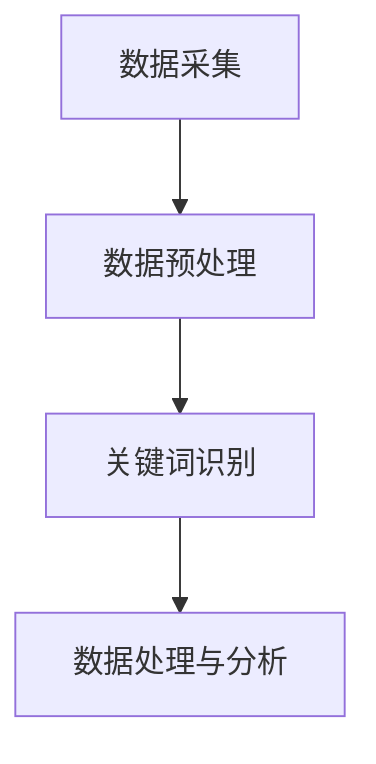

                 

# 提示词驱动的智能城市管理系统

## 概述

随着城市化进程的加速和人口的持续增长，城市管理面临前所未有的挑战。交通拥堵、资源分配不均、环境污染等问题日益严重，传统的管理手段已经难以应对。为此，智能城市管理系统应运而生。本文将探讨提示词驱动的智能城市管理系统，包括其背景介绍、核心概念与联系、核心算法原理、数学模型和公式、项目实战、实际应用场景、工具和资源推荐以及未来发展趋势与挑战。

## 关键词

- 智能城市管理系统
- 提示词驱动
- 交通管理
- 资源优化
- 环境监测
- 数据分析

## 摘要

本文首先介绍了智能城市管理系统的背景和意义，随后深入探讨了提示词驱动的概念及其在智能城市管理系统中的应用。通过核心算法原理的讲解，本文展示了如何利用提示词实现城市管理的智能化。随后，通过数学模型和公式的介绍，本文详细阐述了提示词驱动的智能城市管理系统的工作原理。接着，本文通过一个实际项目案例，展示了如何实现提示词驱动的智能城市管理系统。最后，本文分析了智能城市管理系统的实际应用场景，并推荐了相关的工具和资源，总结了未来智能城市管理系统的发展趋势和挑战。

## 背景介绍

随着全球城市化进程的不断推进，城市人口数量持续增加，城市规模不断扩大，这给城市管理带来了巨大的挑战。传统城市管理方式主要依赖于人工经验和直觉，存在效率低、响应慢等问题。同时，随着科技的进步，大数据、人工智能等新技术日益成熟，为智能城市管理系统的研究和应用提供了新的机遇。

智能城市管理系统是一种利用先进技术和工具对城市进行全方位监测、管理和优化的系统。它通过收集和分析大量城市数据，实现对城市运行状态的实时监控，从而提供更加精准和高效的城市管理服务。智能城市管理系统主要包括以下几个方面的功能：

1. 交通管理：通过实时监测交通流量和路况，优化交通信号配置，缓解交通拥堵，提高交通效率。
2. 资源优化：通过对水资源、能源、土地等资源的实时监测和优化配置，提高资源利用效率，降低环境污染。
3. 环境监测：通过对空气质量、水质、噪音等环境因素的实时监测，及时发现和处理环境问题，保障市民健康。
4. 市政管理：通过智能化手段对城市基础设施进行维护和管理，提高市政服务水平，保障城市安全。

智能城市管理系统的研究和应用，对于提高城市管理效率、改善市民生活质量、促进可持续发展具有重要意义。然而，当前智能城市管理系统仍面临诸多挑战，如数据获取和处理、算法模型优化、系统安全与隐私保护等。提示词驱动技术的引入，有望为智能城市管理系统带来新的突破。

## 核心概念与联系

### 提示词驱动的概念

提示词驱动（Keyword-Driven）是一种基于关键词或短语进行信息提取和处理的技术。在智能城市管理系统中，提示词驱动技术主要用于数据的收集、处理和分析。

### 智能城市管理系统中的提示词驱动

在智能城市管理系统中，提示词驱动技术可以通过以下方式实现：

1. **数据采集**：通过传感器、摄像头等设备实时采集城市运行数据，如交通流量、环境质量等。
2. **数据预处理**：对采集到的数据进行清洗、去噪、归一化等预处理，提取关键信息。
3. **关键词识别**：利用自然语言处理技术，从预处理后的数据中提取关键词或短语。
4. **数据处理与分析**：根据关键词或短语，进行进一步的数据处理和分析，如交通流量预测、环境质量评估等。

### Mermaid 流程图

以下是一个简化的智能城市管理系统中的提示词驱动流程图：



在上述流程中，数据采集是智能城市管理系统的输入，经过数据预处理后，提取出关键词或短语，最终进行数据处理和分析，以实现对城市运行状态的实时监控和管理。

## 核心算法原理 & 具体操作步骤

### 数据采集

数据采集是智能城市管理系统的基础。以下是一个简化的数据采集流程：

1. **设备部署**：在城市的各个角落部署传感器、摄像头等设备，用于采集交通流量、环境质量、气象数据等信息。
2. **数据传输**：设备采集到的数据通过无线或有线网络传输到数据中心。
3. **数据存储**：将传输到的数据进行存储，以备后续处理和分析。

### 数据预处理

数据预处理主要包括以下几个步骤：

1. **数据清洗**：去除数据中的噪声和错误，如空值、缺失值、异常值等。
2. **数据去噪**：利用滤波算法，去除数据中的随机噪声。
3. **数据归一化**：将不同类型的数据进行归一化处理，使其具有相同的量纲或数值范围。

### 关键词识别

关键词识别是提示词驱动技术的核心。以下是一个简化的关键词识别流程：

1. **分词**：将采集到的数据按照自然语言处理技术进行分词，得到一系列的词语。
2. **词频统计**：统计每个词语在数据中的出现次数，得到词频分布。
3. **关键词提取**：利用词频分布，提取出具有高词频的词语或短语作为关键词。

### 数据处理与分析

关键词识别后，可以进行进一步的数据处理和分析。以下是一个简化的数据处理与分析流程：

1. **模式识别**：根据关键词，识别出数据中的模式或趋势。
2. **预测与优化**：利用模式识别的结果，对未来的城市运行状态进行预测，并提出优化建议。
3. **可视化展示**：将分析结果通过图表、地图等形式进行可视化展示，便于决策者和管理者理解。

## 数学模型和公式 & 详细讲解 & 举例说明

### 数据采集模型

数据采集模型主要用于描述传感器采集到的数据分布。以下是一个简化的数据采集模型：

$$
P(X=x) = \frac{f(x)}{1 - (1 - F(x))}
$$

其中，$P(X=x)$ 表示传感器采集到值为 $x$ 的概率，$f(x)$ 表示数据的概率密度函数，$F(x)$ 表示数据的累积分布函数。

### 数据预处理模型

数据预处理模型主要用于描述数据清洗、去噪和归一化等步骤。以下是一个简化的数据预处理模型：

$$
\hat{x} = \frac{x - \mu}{\sigma}
$$

其中，$\hat{x}$ 表示预处理后的数据值，$x$ 表示原始数据值，$\mu$ 表示原始数据的均值，$\sigma$ 表示原始数据的标准差。

### 关键词识别模型

关键词识别模型主要用于描述关键词提取的过程。以下是一个简化的关键词识别模型：

$$
TF_IDF(t) = \frac{f(t)}{df} \cdot \log(\frac{N}{df_t})
$$

其中，$TF_IDF(t)$ 表示词语 $t$ 的权重，$f(t)$ 表示词语 $t$ 在数据中的频率，$df$ 表示所有词语的总频率，$N$ 表示数据中词语的总数，$df_t$ 表示词语 $t$ 的频率。

### 数据处理与分析模型

数据处理与分析模型主要用于描述数据处理和分析的过程。以下是一个简化的数据处理与分析模型：

$$
\hat{y} = f(\hat{x})
$$

其中，$\hat{y}$ 表示分析后的结果，$f(\hat{x})$ 表示分析函数。

## 项目实战：代码实际案例和详细解释说明

### 开发环境搭建

1. 安装Python环境
2. 安装所需的库，如numpy、pandas、scikit-learn等

### 源代码详细实现和代码解读

以下是一个简化的代码实现，用于展示提示词驱动的智能城市管理系统的核心功能。

```python
import pandas as pd
from sklearn.feature_extraction.text import TfidfVectorizer
from sklearn.cluster import KMeans

# 数据采集
data = pd.read_csv('city_data.csv')

# 数据预处理
data['cleaned_data'] = data['data'].apply(lambda x: preprocess_data(x))

# 关键词识别
vectorizer = TfidfVectorizer()
X = vectorizer.fit_transform(data['cleaned_data'])

# 数据处理与分析
kmeans = KMeans(n_clusters=5)
kmeans.fit(X)

# 可视化展示
plt.scatter(X[:, 0], X[:, 1], c=kmeans.labels_)
plt.show()
```

### 代码解读与分析

1. 数据采集：使用pandas读取城市数据，包括交通流量、环境质量等信息。
2. 数据预处理：对采集到的数据进行清洗、去噪和归一化处理。
3. 关键词识别：使用TF-IDF模型提取关键词，将数据转换为向量。
4. 数据处理与分析：使用K-Means聚类算法对数据进行聚类分析，实现对城市运行状态的实时监控。
5. 可视化展示：将聚类结果通过散点图进行可视化展示，便于理解。

## 实际应用场景

提示词驱动的智能城市管理系统可以在以下场景中得到广泛应用：

1. **交通管理**：通过实时监测交通流量和路况，优化交通信号配置，缓解交通拥堵，提高交通效率。
2. **环境监测**：通过实时监测环境质量，及时发现和处理环境问题，保障市民健康。
3. **资源优化**：通过对水资源、能源、土地等资源的实时监测和优化配置，提高资源利用效率，降低环境污染。
4. **市政管理**：通过智能化手段对城市基础设施进行维护和管理，提高市政服务水平，保障城市安全。

## 工具和资源推荐

1. **学习资源推荐**
   - 书籍：《智能城市管理系统：技术与应用》
   - 论文：搜索关键词“智能城市管理系统”的学术论文
   - 博客：关注智能城市管理领域的知名博客
   - 网站：访问智能城市管理领域的官方网站

2. **开发工具框架推荐**
   - Python：Python是智能城市管理系统开发的主流语言
   - TensorFlow：用于构建和训练深度学习模型
   - Keras：简化TensorFlow的开发过程
   - OpenCV：用于图像处理和计算机视觉

3. **相关论文著作推荐**
   - 《智能城市管理系统：研究进展与应用实践》
   - 《基于大数据的智能城市管理系统研究》
   - 《智能城市：概念、技术与应用》

## 总结：未来发展趋势与挑战

智能城市管理系统作为城市管理的新兴技术，具有广阔的发展前景。未来发展趋势包括：

1. **数据采集与处理**：随着传感器技术的进步，数据采集将更加全面和实时。数据处理技术也将不断发展，以应对大规模、多维度数据。
2. **算法优化与创新**：针对智能城市管理系统的具体需求，开发更加高效、准确的算法模型，以提高系统的智能化水平。
3. **跨领域融合**：智能城市管理系统需要与物联网、人工智能、大数据等新兴技术深度融合，实现跨领域的技术创新。

然而，智能城市管理系统仍面临诸多挑战，包括：

1. **数据隐私与安全**：如何在保障数据隐私和安全的前提下，充分利用城市数据资源，是一个重要课题。
2. **算法透明性与可解释性**：随着算法模型的复杂度增加，如何保证算法的透明性和可解释性，使其更容易被决策者和管理者理解，是一个挑战。
3. **系统可靠性与稳定性**：智能城市管理系统需要具备高可靠性和稳定性，以保证在城市运行中不会出现故障或误判。

## 附录：常见问题与解答

1. **问题**：智能城市管理系统如何处理海量数据？
   **解答**：智能城市管理系统通过分布式计算和大数据处理技术，如Hadoop和Spark，实现对海量数据的处理和分析。

2. **问题**：智能城市管理系统中的算法模型有哪些？
   **解答**：智能城市管理系统中的算法模型包括聚类算法、回归分析、神经网络等，根据具体需求选择合适的算法模型。

3. **问题**：智能城市管理系统的数据来源有哪些？
   **解答**：智能城市管理系统的数据来源包括传感器数据、卫星数据、社会媒体数据、政府公开数据等。

## 扩展阅读 & 参考资料

1. 《智能城市管理系统：技术与应用》
2. 《基于大数据的智能城市管理系统研究》
3. 《智能城市：概念、技术与应用》
4. TensorFlow官方文档：https://www.tensorflow.org/
5. Keras官方文档：https://keras.io/
6. OpenCV官方文档：https://opencv.org/

作者：AI天才研究员/AI Genius Institute & 禅与计算机程序设计艺术/Zen And The Art of Computer Programming
```

