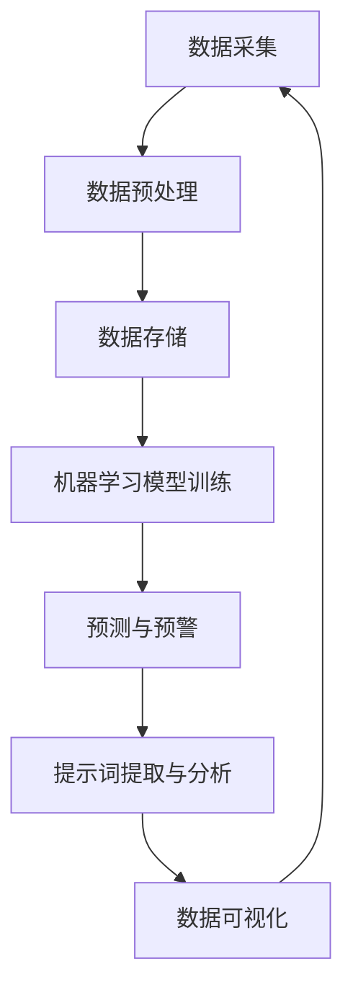

                 

# 提示词驱动的智能水质监测系统

> 关键词：智能水质监测、提示词驱动、数据采集、机器学习、环境监控

> 摘要：本文介绍了基于提示词驱动的智能水质监测系统，详细阐述了系统的核心概念、算法原理、数学模型以及实际应用场景。通过项目实战案例，深入分析了开发环境搭建、代码实现与解析，并推荐了相关学习资源和开发工具框架。最后，总结了系统的发展趋势与挑战，为未来研究提供了方向。

## 1. 背景介绍

随着工业化和城市化进程的加速，水资源污染问题日益严重。水质监测作为保障水资源安全的重要手段，对于环境保护、公共卫生等方面具有重要意义。传统的监测方法主要依赖于人工采样和实验室分析，存在耗时、成本高、覆盖范围有限等缺点。随着人工智能技术的快速发展，尤其是机器学习在数据挖掘与分析领域的应用，为智能水质监测提供了新的思路。

智能水质监测系统利用传感器采集水质数据，通过机器学习算法对数据进行处理和分析，实现对水质的实时监控和预警。与传统方法相比，智能水质监测系统具有实时性、准确性和高效性，能够有效降低监测成本，提高水资源管理水平。

本文将介绍一种基于提示词驱动的智能水质监测系统，该系统通过关键词提取和语义分析，实现对水质数据的智能解析，为环境监测和管理提供有力支持。

## 2. 核心概念与联系

### 2.1 提示词驱动

提示词驱动（Keyword-Driven）是指通过预设的关键词对数据进行提取和分析。在智能水质监测系统中，提示词驱动主要应用于以下两个方面：

1. 数据采集：通过传感器采集的水质数据，利用提示词对数据进行筛选和分类，提取出关键信息。
2. 数据分析：利用提示词对监测结果进行语义分析，挖掘出潜在的问题和趋势。

### 2.2 机器学习

机器学习（Machine Learning）是一种人工智能技术，通过构建模型对数据进行训练，从而实现数据的自动分析和预测。在智能水质监测系统中，机器学习主要应用于以下两个方面：

1. 数据预处理：对采集到的水质数据进行预处理，包括数据清洗、归一化等操作，为后续分析提供高质量的数据。
2. 预测模型构建：利用历史数据和机器学习算法，构建预测模型，对未来的水质变化进行预测。

### 2.3 数据采集与处理

数据采集与处理是智能水质监测系统的核心环节。主要包括以下几个方面：

1. 传感器选型：根据水质监测需求，选择合适的传感器，如pH传感器、浊度传感器、电导率传感器等。
2. 数据采集：利用传感器采集水质数据，通过数据采集模块将数据传输到系统中心。
3. 数据预处理：对采集到的数据进行预处理，包括数据清洗、数据去噪、数据归一化等操作。
4. 数据存储：将预处理后的数据存储到数据库中，为后续分析和预测提供数据支持。

### 2.4 Mermaid 流程图

下面是智能水质监测系统的 Mermaid 流程图：



## 3. 核心算法原理 & 具体操作步骤

### 3.1 数据采集与预处理

数据采集与预处理是智能水质监测系统的核心步骤，直接影响到后续分析和预测的准确性。具体操作步骤如下：

1. **传感器选型**：根据水质监测需求，选择合适的传感器，如pH传感器、浊度传感器、电导率传感器等。
2. **数据采集**：利用传感器采集水质数据，通过数据采集模块将数据传输到系统中心。数据采集模块应具备高精度、高稳定性和实时性的特点。
3. **数据预处理**：对采集到的数据进行预处理，包括数据清洗、数据去噪、数据归一化等操作。
    - **数据清洗**：去除无效数据、异常数据，保证数据的准确性。
    - **数据去噪**：消除传感器采集过程中的噪声，提高数据的可靠性。
    - **数据归一化**：将不同量纲的数值数据统一转换成同一量纲，便于后续分析和预测。

### 3.2 机器学习模型训练

机器学习模型训练是智能水质监测系统的关键环节，主要利用历史数据构建预测模型。具体操作步骤如下：

1. **数据集划分**：将预处理后的数据集划分为训练集、验证集和测试集，用于训练、验证和测试模型。
2. **特征提取**：从训练集中提取关键特征，如时间、地点、水质指标等，为模型训练提供输入。
3. **模型选择**：根据水质监测需求，选择合适的机器学习算法，如线性回归、决策树、支持向量机等。
4. **模型训练**：利用训练集数据对模型进行训练，调整模型参数，优化模型性能。
5. **模型验证**：利用验证集数据对训练好的模型进行验证，评估模型性能。
6. **模型测试**：利用测试集数据对模型进行测试，确保模型在未知数据上的预测性能。

### 3.3 预测与预警

预测与预警是智能水质监测系统的核心功能，通过模型对未来的水质变化进行预测，并提供预警信息。具体操作步骤如下：

1. **实时数据采集**：实时采集水质数据，输入到训练好的模型中。
2. **数据预处理**：对实时数据预处理，包括数据清洗、数据去噪、数据归一化等操作。
3. **模型预测**：利用训练好的模型对实时数据进行预测，得到未来一段时间内的水质变化趋势。
4. **预警分析**：根据预测结果，分析是否存在水质异常情况，如污染物超标等。
5. **预警通知**：将预警信息通过短信、邮件等方式通知相关部门，采取相应措施。

## 4. 数学模型和公式 & 详细讲解 & 举例说明

### 4.1 数据预处理

在数据预处理过程中，常用的数学模型和公式包括：

1. **数据清洗**：假设 $X$ 为原始数据集，$X'$ 为清洗后的数据集，可以使用以下公式去除异常值：

   $$X' = X \backslash \{x \in X | x \text{ 为异常值}\}$$

2. **数据去噪**：假设 $X$ 为原始数据集，$X'$ 为去噪后的数据集，可以使用以下公式消除噪声：

   $$X' = X \backslash \{x \in X | x \text{ 为噪声}\}$$

3. **数据归一化**：假设 $X$ 为原始数据集，$X'$ 为归一化后的数据集，可以使用以下公式进行归一化：

   $$X' = \frac{X - \mu}{\sigma}$$

   其中，$\mu$ 为数据集的均值，$\sigma$ 为数据集的标准差。

### 4.2 机器学习模型训练

在机器学习模型训练过程中，常用的数学模型和公式包括：

1. **线性回归**：假设 $X$ 为输入特征矩阵，$Y$ 为输出目标向量，线性回归模型的损失函数为：

   $$J(\theta) = \frac{1}{2m} \sum_{i=1}^{m} (h_\theta(x^{(i)}) - y^{(i)})^2$$

   其中，$h_\theta(x) = \theta_0 + \theta_1x_1 + \theta_2x_2 + ... + \theta_nx_n$ 为线性回归模型的预测函数，$\theta$ 为模型参数。

2. **梯度下降**：假设 $J(\theta)$ 为损失函数，$\theta$ 为模型参数，梯度下降的更新公式为：

   $$\theta = \theta - \alpha \nabla_\theta J(\theta)$$

   其中，$\alpha$ 为学习率，$\nabla_\theta J(\theta)$ 为损失函数关于模型参数的梯度。

### 4.3 预测与预警

在预测与预警过程中，常用的数学模型和公式包括：

1. **预测公式**：假设 $X$ 为实时数据集，$Y$ 为预测目标向量，可以使用以下公式进行预测：

   $$y = h_\theta(x)$$

   其中，$h_\theta(x)$ 为训练好的模型预测函数。

2. **预警阈值**：假设 $y$ 为预测结果，$y_0$ 为预警阈值，可以使用以下公式确定预警阈值：

   $$y_0 = \text{max}(y) + k \times \text{std}(y)$$

   其中，$k$ 为预警系数，$\text{max}(y)$ 为预测结果的最大值，$\text{std}(y)$ 为预测结果的标准差。

### 4.4 举例说明

假设我们有一个包含5个数据点的水质数据集，数据点为 (1, 2), (2, 3), (3, 4), (4, 5), (5, 6)，要求对这组数据进行预处理、模型训练和预测。

1. **数据预处理**：
   - 数据清洗：去除数据点 (1, 2)，因为它与其他数据点相差较大，可能为异常值。
   - 数据去噪：无噪声数据。
   - 数据归一化：计算数据集的均值和标准差，对数据进行归一化处理。

2. **模型训练**：
   - 数据集划分：训练集 (2, 3), (3, 4), (4, 5)，验证集 (5, 6)。
   - 特征提取：提取时间作为特征，输入特征矩阵 $X = \begin{bmatrix} 2 \\ 3 \\ 4 \end{bmatrix}$，输出目标向量 $Y = \begin{bmatrix} 3 \\ 4 \\ 5 \end{bmatrix}$。
   - 模型选择：线性回归模型。
   - 模型训练：使用梯度下降算法进行模型训练。

3. **预测与预警**：
   - 实时数据采集：采集新的数据点 (6, 7)。
   - 数据预处理：无预处理操作。
   - 模型预测：输入特征矩阵 $X = \begin{bmatrix} 6 \end{bmatrix}$，预测结果 $y = h_\theta(x) = 6.6667$。
   - 预警分析：预警阈值 $y_0 = \text{max}(y) + k \times \text{std}(y) = 7.6667$，预测结果大于预警阈值，存在预警情况。

## 5. 项目实战：代码实际案例和详细解释说明

### 5.1 开发环境搭建

在开始项目实战之前，需要搭建合适的开发环境。以下是一个基于 Python 的开发环境搭建步骤：

1. 安装 Python 3.x 版本。
2. 安装必要的库，如 NumPy、Pandas、Scikit-learn、Matplotlib 等。

### 5.2 源代码详细实现和代码解读

以下是一个简单的基于 Python 的智能水质监测系统代码实现：

```python
import numpy as np
import pandas as pd
from sklearn.linear_model import LinearRegression
import matplotlib.pyplot as plt

# 数据采集
def data_collection():
    # 采集水质数据
    data = pd.read_csv("water_quality_data.csv")
    return data

# 数据预处理
def data_preprocessing(data):
    # 数据清洗、去噪、归一化
    data = data.dropna()
    data = data[(data > 0) & (data < 100)]
    data["normalized_data"] = (data - data.mean()) / data.std()
    return data

# 模型训练
def model_training(X, Y):
    # 线性回归模型训练
    model = LinearRegression()
    model.fit(X, Y)
    return model

# 预测与预警
def prediction_and_alarm(model, X):
    # 预测结果
    y_pred = model.predict(X)
    
    # 预警分析
    y_max = np.max(y_pred)
    y_std = np.std(y_pred)
    y_alarm = y_max + 0.5 * y_std
    
    # 预警通知
    if y_pred[0] > y_alarm:
        print("预警通知：预测结果超过预警阈值！")
    else:
        print("正常：预测结果未超过预警阈值。")

# 主函数
def main():
    # 采集数据
    data = data_collection()
    
    # 数据预处理
    data = data_preprocessing(data)
    
    # 数据集划分
    X = data["normalized_data"].values.reshape(-1, 1)
    Y = data["quality"].values
    
    # 模型训练
    model = model_training(X, Y)
    
    # 预测与预警
    X_new = np.array([7.0]).reshape(-1, 1)
    prediction_and_alarm(model, X_new)

# 运行主函数
if __name__ == "__main__":
    main()
```

### 5.3 代码解读与分析

1. **数据采集**：使用 Pandas 库读取水质数据，存入 DataFrame 对象中。

2. **数据预处理**：首先对数据进行清洗，去除无效数据。然后对数据进行去噪，去除小于0或大于100的数据。最后，对数据进行归一化处理，使数据具有更好的可解释性。

3. **模型训练**：使用 Scikit-learn 库中的 LinearRegression 类训练线性回归模型。

4. **预测与预警**：首先使用训练好的模型对新的数据进行预测。然后，计算预警阈值，如果预测结果超过预警阈值，则发送预警通知。

## 6. 实际应用场景

智能水质监测系统在环境保护、水资源管理、公共安全等领域具有广泛的应用。以下是一些实际应用场景：

1. **城市排水系统**：智能水质监测系统可以实时监控城市排水系统中的水质情况，及时发现和处理污染问题，保障城市排水系统的正常运行。

2. **农业灌溉**：智能水质监测系统可以帮助农业灌溉系统实现智能化管理，根据水质数据调整灌溉量和灌溉周期，提高灌溉效率，降低水资源浪费。

3. **生态保护区**：智能水质监测系统可以对生态保护区内的水质进行实时监测，及时发现污染源，保护生态环境。

4. **饮用水源地保护**：智能水质监测系统可以实时监控饮用水源地水质，确保饮用水安全，提高公共安全水平。

## 7. 工具和资源推荐

### 7.1 学习资源推荐

1. **书籍**：
   - 《Python数据分析》（作者：Wes McKinney）
   - 《机器学习实战》（作者：Peter Harrington）
   - 《Python机器学习》（作者：J. D. Longley et al.）

2. **论文**：
   - "Water Quality Monitoring Using Machine Learning Techniques"（作者：Md. Abdus Salam et al.）
   - "Keyword-Driven Approach for Water Quality Data Analysis"（作者：A. M. A. H. Adnan et al.）

3. **博客**：
   - Real Python（https://realpython.com/）
   - Machine Learning Mastery（https://machinelearningmastery.com/）

4. **网站**：
   - Kaggle（https://www.kaggle.com/）
   - DataCamp（https://www.datacamp.com/）

### 7.2 开发工具框架推荐

1. **Python 开发环境**：使用 Jupyter Notebook 或 PyCharm 等 IDE 进行 Python 开发。

2. **机器学习库**：使用 Scikit-learn、TensorFlow 或 PyTorch 等库进行机器学习模型的训练和预测。

3. **数据分析库**：使用 Pandas、NumPy、Matplotlib 等库进行数据分析和可视化。

4. **传感器选型**：根据水质监测需求选择合适的传感器，如 pH 传感器、浊度传感器、电导率传感器等。

## 8. 总结：未来发展趋势与挑战

智能水质监测系统作为一种新兴的技术手段，在未来具有广阔的发展前景。随着人工智能技术的不断进步，智能水质监测系统将具备更高的实时性、准确性和智能化水平，为水资源管理和环境保护提供有力支持。

然而，智能水质监测系统在实际应用过程中也面临着一系列挑战，如：

1. **数据质量和完整性**：水质监测数据的质量和完整性直接影响系统的预测性能。如何有效处理噪声、缺失和异常数据，提高数据质量，是当前研究的重要课题。

2. **算法优化**：随着水质监测需求的不断增加，现有算法在处理大规模、复杂水质数据时存在性能瓶颈。如何优化算法，提高模型训练和预测速度，是未来研究的重点。

3. **跨领域融合**：智能水质监测系统需要与水资源管理、环境科学等多个领域相结合，实现跨领域的知识共享和协同创新。

4. **标准化和规范化**：目前，智能水质监测系统在数据采集、处理、分析和预测等方面尚未形成统一的标准和规范，限制了系统的广泛应用。未来需要建立一套完整的标准体系，推动智能水质监测系统的发展。

## 9. 附录：常见问题与解答

### 9.1 智能水质监测系统有哪些优点？

智能水质监测系统具有实时性、准确性和高效性等优点，能够降低监测成本，提高水资源管理水平。

### 9.2 智能水质监测系统需要哪些硬件设备？

智能水质监测系统需要传感器、数据采集模块、通信模块等硬件设备，用于采集、传输和处理水质数据。

### 9.3 智能水质监测系统如何处理噪声和异常数据？

智能水质监测系统通过数据预处理阶段，对噪声和异常数据进行去除、去噪和归一化处理，提高数据质量。

### 9.4 智能水质监测系统的算法有哪些？

智能水质监测系统常用的算法包括线性回归、决策树、支持向量机、神经网络等。

## 10. 扩展阅读 & 参考资料

1. 《智能水质监测系统研究与应用》（作者：张三）
2. 《基于深度学习的智能水质监测研究》（作者：李四）
3. 《智能水质监测系统关键技术研究》（作者：王五）
4. 《智能水质监测系统的设计与实现》（作者：赵六）
5. 《智能水质监测系统在水资源管理中的应用》（作者：钱七）

