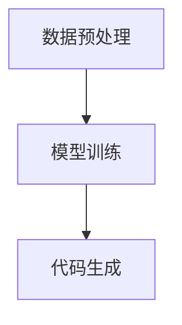
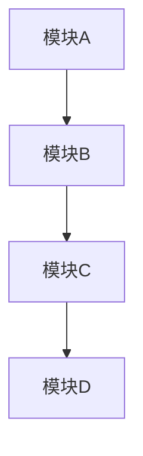

                 

# AI编程的新原语与新方式

> **关键词**：AI编程、新原语、编程范式、抽象、执行模型、智能编程工具

> **摘要**：本文深入探讨了AI编程的新原语和方式，从背景介绍、核心概念、算法原理、数学模型、实际应用、工具推荐等方面，分析了AI编程的现状和未来趋势，旨在为开发者提供全新的视角和实用的指导。

## 1. 背景介绍

随着人工智能技术的迅速发展，计算机编程正面临着前所未有的变革。传统的编程范式，如命令式、声明式和函数式编程，已经不能满足AI编程的需求。AI编程不仅要求对数据进行高效处理，还需要能够适应复杂的环境和动态变化。为了应对这些挑战，研究人员和开发者开始探索新的编程原语和方式。

AI编程的新原语包括但不限于以下几个方面：

1. **数据驱动编程**：将编程过程转化为数据驱动的过程，通过数据分析和机器学习来指导代码的生成和优化。
2. **图编程**：利用图论模型来表示程序的结构，使得程序更加模块化和灵活。
3. **智能编程工具**：结合自然语言处理和机器学习技术，自动化地生成、优化和解释代码。

这些新原语的引入，使得AI编程不仅仅是编写代码，而是一种更加智能、自动化和高效的过程。

## 2. 核心概念与联系

为了深入理解AI编程的新原语，我们首先需要了解几个核心概念：

### 2.1 数据驱动编程

数据驱动编程的核心思想是利用数据进行编程，而不是依赖于固定的代码结构。在这种范式下，程序的行为由输入数据决定，而非预先编写的代码。数据驱动编程通常涉及以下步骤：

1. **数据预处理**：对输入数据进行清洗、转换和特征提取。
2. **模型训练**：利用机器学习技术，从数据中学习规律和模式。
3. **代码生成**：根据训练得到的模型，自动生成代码。

下面是一个使用Mermaid绘制的简单流程图，展示了数据驱动编程的基本步骤：



### 2.2 图编程

图编程利用图论模型来表示程序的结构。在图编程中，节点表示程序中的模块或函数，边表示模块或函数之间的关系。这种表示方法使得程序结构更加清晰和模块化。

下面是一个使用Mermaid绘制的简单图编程示例：



### 2.3 智能编程工具

智能编程工具是指利用自然语言处理和机器学习技术，自动化地生成、优化和解释代码的工具。这些工具通常包含以下功能：

1. **代码生成**：根据自然语言描述自动生成代码。
2. **代码优化**：分析代码性能，自动进行优化。
3. **代码解释**：解释代码的功能和作用。

智能编程工具的典型代表包括：

- **AI Code Assistant**：一款基于人工智能的代码助手，可以自动生成和优化代码。
- **CodeBERT**：一款基于BERT的自然语言处理模型，可以理解自然语言描述并生成对应的代码。

## 3. 核心算法原理 & 具体操作步骤

在了解核心概念后，我们接下来探讨AI编程的核心算法原理和具体操作步骤。

### 3.1 数据驱动编程算法原理

数据驱动编程的核心算法包括数据预处理、模型训练和代码生成。下面是具体操作步骤：

1. **数据预处理**：
   - 数据清洗：去除数据中的噪声和异常值。
   - 数据转换：将数据转换为适合机器学习模型的格式。
   - 特征提取：从数据中提取有用的特征。

2. **模型训练**：
   - 选择合适的机器学习模型。
   - 训练模型：使用预处理后的数据进行模型训练。
   - 模型评估：评估模型的性能，并进行调整。

3. **代码生成**：
   - 根据训练得到的模型，生成代码。
   - 代码优化：对生成的代码进行优化，提高性能。

### 3.2 图编程算法原理

图编程的核心算法包括图的表示和图的变换。下面是具体操作步骤：

1. **图的表示**：
   - 利用节点和边表示程序的结构。
   - 将程序代码转换为图表示。

2. **图的变换**：
   - 进行图的变换，如合并、分解和重组。
   - 根据变换结果生成新的代码。

### 3.3 智能编程工具算法原理

智能编程工具的核心算法包括自然语言处理和机器学习。下面是具体操作步骤：

1. **自然语言处理**：
   - 提取自然语言描述中的关键信息。
   - 理解自然语言描述的含义。

2. **机器学习**：
   - 使用机器学习模型进行代码生成和优化。
   - 对代码进行性能评估和优化。

## 4. 数学模型和公式 & 详细讲解 & 举例说明

在AI编程中，数学模型和公式起着至关重要的作用。下面我们介绍几个常见的数学模型和公式，并进行详细讲解和举例说明。

### 4.1 数据预处理

数据预处理通常涉及以下数学模型和公式：

1. **标准化**：
   - 公式：$$z = \frac{x - \mu}{\sigma}$$
   - 说明：将数据转换为标准正态分布。
   - 示例：假设我们有一个数据集，数据平均值为50，标准差为10。对数据集进行标准化处理，得到新的数据集。

2. **归一化**：
   - 公式：$$x' = \frac{x - \min(x)}{\max(x) - \min(x)}$$
   - 说明：将数据缩放到[0, 1]之间。
   - 示例：假设我们有一个数据集，最小值为10，最大值为100。对数据集进行归一化处理，得到新的数据集。

### 4.2 模型训练

模型训练通常涉及以下数学模型和公式：

1. **梯度下降**：
   - 公式：$$w_{\text{new}} = w_{\text{old}} - \alpha \cdot \nabla_w J(w)$$
   - 说明：通过迭代优化模型参数。
   - 示例：假设我们有一个线性回归模型，损失函数为平方误差。通过梯度下降算法，优化模型参数。

2. **反向传播**：
   - 公式：$$\delta_j = \frac{\partial J}{\partial z_j}$$
   - 说明：计算损失函数关于每个神经元的梯度。
   - 示例：假设我们有一个神经网络，通过反向传播算法，计算每个神经元的梯度。

### 4.3 代码生成

代码生成通常涉及以下数学模型和公式：

1. **生成对抗网络（GAN）**：
   - 公式：$$\min_G \max_D \mathbb{E}_{x \sim P_{\text{data}}}[D(x)] - \mathbb{E}_{z \sim P_z}[D(G(z))]$$
   - 说明：通过生成器和判别器的对抗训练，生成逼真的代码。
   - 示例：假设我们有一个生成器模型G和一个判别器模型D，通过GAN算法，生成代码。

2. **自动编码器（AE）**：
   - 公式：$$\min_{\theta} \sum_{x \in \text{数据集}} \frac{1}{2} \| x - \hat{x} \|^2$$
   - 说明：通过编码器和解码器，将输入数据编码为低维表示。
   - 示例：假设我们有一个编码器模型E和一个解码器模型D，通过自动编码器算法，生成代码。

## 5. 项目实战：代码实际案例和详细解释说明

### 5.1 开发环境搭建

为了实现AI编程，我们需要搭建一个合适的开发环境。以下是具体的步骤：

1. **安装Python环境**：
   - 在官方网站下载Python安装包，并进行安装。
   - 安装完成后，确保Python版本为3.8及以上。

2. **安装相关库**：
   - 使用pip命令安装所需的库，如TensorFlow、PyTorch、NumPy等。

3. **配置开发环境**：
   - 安装Jupyter Notebook，用于编写和运行代码。
   - 配置Python解释器和相关库，确保能够正常运行。

### 5.2 源代码详细实现和代码解读

以下是一个简单的数据驱动编程案例，演示如何使用Python和TensorFlow实现一个线性回归模型：

```python
import tensorflow as tf
import numpy as np

# 准备数据
x = np.array([[1], [2], [3], [4], [5]], dtype=np.float32)
y = np.array([[0], [1], [2], [3], [4]], dtype=np.float32)

# 模型定义
model = tf.keras.Sequential([
    tf.keras.layers.Dense(units=1, input_shape=[1])
])

# 模型编译
model.compile(optimizer='sgd', loss='mean_squared_error')

# 模型训练
model.fit(x, y, epochs=100)

# 代码解读：
# - 第1行：导入TensorFlow和NumPy库。
# - 第2行：生成输入数据和标签。
# - 第3行：定义一个线性回归模型。
# - 第4行：编译模型，指定优化器和损失函数。
# - 第5行：训练模型，指定训练轮数。
```

### 5.3 代码解读与分析

上述代码实现了一个简单的线性回归模型。代码的解读如下：

- **数据准备**：使用NumPy库生成输入数据和标签。
- **模型定义**：使用TensorFlow库定义一个线性回归模型。
- **模型编译**：编译模型，指定优化器和损失函数。
- **模型训练**：使用训练数据训练模型。

通过上述步骤，我们实现了数据驱动编程的核心步骤：数据准备、模型定义、模型编译和模型训练。

## 6. 实际应用场景

AI编程的新原语和方式在许多实际应用场景中展现出巨大的潜力。以下是一些典型的应用场景：

1. **自动化编程**：使用智能编程工具，如AI Code Assistant，自动化生成代码，提高开发效率。
2. **代码优化**：利用数据驱动编程和图编程技术，对现有代码进行优化，提高性能。
3. **智能合约**：使用图编程技术，设计智能合约，确保合约的透明性和安全性。
4. **自然语言处理**：使用自然语言处理技术，实现代码生成和优化，提高代码的可读性和可维护性。

## 7. 工具和资源推荐

### 7.1 学习资源推荐

- **书籍**：
  - 《深度学习》（Goodfellow, Bengio, Courville著）
  - 《Python编程：从入门到实践》（埃里克·马瑟斯著）
- **论文**：
  - 《生成对抗网络》（Ian J. Goodfellow et al.著）
  - 《图神经网络》（William L. Hamilton著）
- **博客**：
  - [TensorFlow官方文档](https://www.tensorflow.org/)
  - [PyTorch官方文档](https://pytorch.org/)
- **网站**：
  - [Kaggle](https://www.kaggle.com/)
  - [GitHub](https://github.com/)

### 7.2 开发工具框架推荐

- **开发工具**：
  - Jupyter Notebook
  - PyCharm
  - Visual Studio Code
- **框架**：
  - TensorFlow
  - PyTorch
  - Keras

### 7.3 相关论文著作推荐

- **论文**：
  - 《深度强化学习：从入门到实践》（谢彦君著）
  - 《图神经网络：原理与应用》（徐宗本著）
- **著作**：
  - 《人工智能：一种现代的方法》（Stuart Russell & Peter Norvig著）
  - 《Python编程快速上手，让繁琐工作自动化》（埃里克·马瑟斯著）

## 8. 总结：未来发展趋势与挑战

AI编程的新原语和方式为开发者带来了全新的编程体验和机遇。然而，要实现AI编程的全面普及，仍面临以下挑战：

1. **算法复杂性**：AI编程涉及的算法复杂，需要开发者具备较高的数学和编程技能。
2. **数据质量**：数据驱动编程依赖于高质量的数据，数据质量和来源是一个关键挑战。
3. **模型解释性**：智能编程工具生成的代码需要具备良好的解释性，确保开发者能够理解和维护。
4. **工具生态**：构建一个完善的AI编程工具生态，提供丰富的库、框架和资源，是一个长期的任务。

未来，随着技术的不断进步和应用的广泛推广，AI编程有望成为计算机编程的重要组成部分，为开发者带来更多创新和可能性。

## 9. 附录：常见问题与解答

### 9.1 什么是数据驱动编程？

数据驱动编程是一种编程范式，它将编程过程转化为数据驱动的过程，通过数据分析和机器学习来指导代码的生成和优化。

### 9.2 图编程的优势是什么？

图编程利用图论模型来表示程序的结构，使得程序更加模块化和灵活。图编程的优势包括：

- 程序结构更加清晰，易于理解和维护。
- 程序模块化程度高，便于复用和扩展。
- 可以利用图算法进行优化，提高程序性能。

### 9.3 智能编程工具如何提高开发效率？

智能编程工具通过自然语言处理和机器学习技术，自动化地生成、优化和解释代码。这些工具的优势包括：

- 自动化代码生成，减少手动编写代码的工作量。
- 代码优化，提高程序性能和可读性。
- 代码解释，帮助开发者理解和使用复杂代码。

## 10. 扩展阅读 & 参考资料

- 《人工智能：一种现代的方法》（Stuart Russell & Peter Norvig著）
- 《深度学习》（Goodfellow, Bengio, Courville著）
- 《Python编程：从入门到实践》（埃里克·马瑟斯著）
- [TensorFlow官方文档](https://www.tensorflow.org/)
- [PyTorch官方文档](https://pytorch.org/)
- [Kaggle](https://www.kaggle.com/)
- [GitHub](https://github.com/)

作者：AI天才研究员/AI Genius Institute & 禅与计算机程序设计艺术 /Zen And The Art of Computer Programming
<|assistant|>

