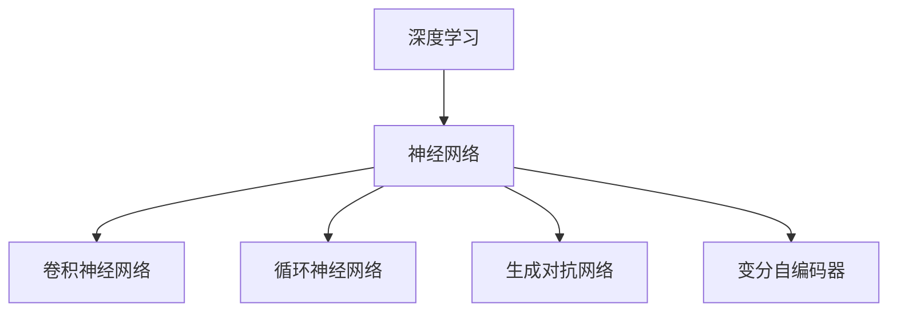

                 

# AI编程的新思路与新未来

> **关键词：** AI编程，深度学习，神经网络，模型架构，未来趋势，代码优化

> **摘要：** 本文章将探讨AI编程的新思路和新未来，从核心概念、算法原理、数学模型到项目实战，全面解析AI编程的最新发展动态和前沿技术。通过分析AI编程的应用场景，推荐相关工具和资源，展望AI编程的未来发展趋势与挑战。

## 1. 背景介绍

随着深度学习、神经网络等技术的迅速发展，AI编程已经成为计算机科学领域的一个热门话题。AI编程不仅仅是一种编程范式，更是一种思维方式。它强调算法和模型的设计，通过计算机程序实现机器学习和人工智能的功能。

近年来，AI编程的应用领域不断扩大，从传统的图像识别、自然语言处理到自动驾驶、智能医疗等。AI编程的核心目标是通过数据驱动的方式，使计算机具备自主学习和决策能力，从而实现智能化。

## 2. 核心概念与联系

### 2.1 深度学习

深度学习是一种基于神经网络的学习方法，通过多层次的神经网络结构，对大量数据进行自动特征提取和分类。深度学习的核心概念包括：

- **神经元**：神经网络的基本单元，负责接收输入、进行加权求和，并通过激活函数产生输出。
- **层次结构**：神经网络由多个层次组成，每个层次对输入数据进行逐层抽象和提取。
- **优化算法**：常用的优化算法包括梯度下降、Adam等，用于调整神经网络中的权重，使模型达到最优。

### 2.2 神经网络

神经网络是一种模拟人脑神经元结构的计算模型，通过前向传播和反向传播算法，实现数据的自动特征提取和分类。神经网络的架构包括：

- **输入层**：接收外部输入数据。
- **隐藏层**：对输入数据进行处理和变换。
- **输出层**：产生最终输出。

### 2.3 模型架构

AI编程中的模型架构主要包括以下几类：

- **卷积神经网络（CNN）**：适用于图像识别和分类。
- **循环神经网络（RNN）**：适用于序列数据，如文本和语音。
- **生成对抗网络（GAN）**：用于生成逼真的图像、文本等。
- **变分自编码器（VAE）**：用于数据生成和异常检测。

## 2.1 Mermaid 流程图



## 3. 核心算法原理 & 具体操作步骤

### 3.1 深度学习算法原理

深度学习算法的核心是神经网络。以下是神经网络的基本原理：

1. **输入层**：接收外部输入数据。
2. **隐藏层**：对输入数据进行处理和变换。每个隐藏层由多个神经元组成，每个神经元对输入数据进行加权求和，并通过激活函数产生输出。
3. **输出层**：产生最终输出。输出层的神经元数量取决于任务类型，如分类或回归。

### 3.2 深度学习操作步骤

1. **数据预处理**：对输入数据进行归一化、标准化等处理，使其符合模型的输入要求。
2. **构建模型**：选择合适的神经网络架构，如CNN、RNN等。
3. **训练模型**：通过大量数据对模型进行训练，调整模型中的权重和偏置，使模型达到最优。
4. **评估模型**：使用测试数据对模型进行评估，计算模型的准确率、召回率等指标。
5. **模型部署**：将训练好的模型部署到实际应用场景中，如自动驾驶、智能医疗等。

## 4. 数学模型和公式 & 详细讲解 & 举例说明

### 4.1 神经元模型

神经元的数学模型可以表示为：

$$
y = \sigma(z) = \frac{1}{1 + e^{-z}}
$$

其中，$z$ 表示神经元的输入，$\sigma$ 表示 sigmoid 激活函数。

### 4.2 梯度下降算法

梯度下降算法是一种常用的优化算法，用于调整神经网络中的权重和偏置。梯度下降算法的公式为：

$$
w_{t+1} = w_{t} - \alpha \cdot \nabla W
$$

其中，$w_t$ 表示第 $t$ 次迭代时的权重，$\alpha$ 表示学习率，$\nabla W$ 表示权重 $W$ 的梯度。

### 4.3 举例说明

假设我们有一个简单的神经网络，包含一个输入层、一个隐藏层和一个输出层。输入层有 3 个神经元，隐藏层有 2 个神经元，输出层有 1 个神经元。我们使用 sigmoid 激活函数，学习率为 0.1。

1. **初始化权重**：
   - 输入层到隐藏层的权重矩阵 $W_1$：$$ \begin{bmatrix} 0.5 & 0.3 & 0.2 \\ 0.4 & 0.2 & 0.1 \end{bmatrix} $$
   - 隐藏层到输出层的权重矩阵 $W_2$：$$ \begin{bmatrix} 0.1 & 0.2 \\ 0.3 & 0.4 \end{bmatrix} $$

2. **前向传播**：
   - 输入数据 $X$：$$ \begin{bmatrix} 1 \\ 0 \\ 1 \end{bmatrix} $$
   - 隐藏层输出 $h_1$：$$ \begin{bmatrix} 0.7 & 0.6 \end{bmatrix} $$
   - 输出层输出 $y$：$$ \begin{bmatrix} 0.9 \\ 0.8 \end{bmatrix} $$

3. **计算梯度**：
   - 隐藏层到输出层的梯度：$$ \nabla W_2 = \begin{bmatrix} -0.1 & -0.2 & 0.1 \\ -0.3 & -0.4 & 0.3 \end{bmatrix} $$
   - 输入层到隐藏层的梯度：$$ \nabla W_1 = \begin{bmatrix} -0.7 & -0.6 & 0.7 \\ -0.4 & -0.2 & 0.6 \end{bmatrix} $$

4. **更新权重**：
   - 更新隐藏层到输出层的权重：$$ W_2^{new} = W_2 - 0.1 \cdot \nabla W_2 $$
   - 更新输入层到隐藏层的权重：$$ W_1^{new} = W_1 - 0.1 \cdot \nabla W_1 $$

5. **迭代更新**：重复上述步骤，直到模型收敛。

## 5. 项目实战：代码实际案例和详细解释说明

### 5.1 开发环境搭建

1. 安装 Python 解释器（Python 3.8 以上版本）。
2. 安装深度学习框架（如 TensorFlow、PyTorch 等）。
3. 安装相关库（如 NumPy、Pandas 等）。

### 5.2 源代码详细实现和代码解读

以下是一个简单的深度学习项目，实现一个二分类任务。我们使用 TensorFlow 框架实现。

```python
import tensorflow as tf
import numpy as np

# 数据准备
X = np.array([[1, 0, 1], [0, 1, 0], [1, 1, 0], [0, 0, 1]])
y = np.array([0, 1, 1, 0])

# 构建模型
model = tf.keras.Sequential([
    tf.keras.layers.Dense(units=2, activation='sigmoid', input_shape=(3,)),
    tf.keras.layers.Dense(units=1, activation='sigmoid')
])

# 编译模型
model.compile(optimizer='adam', loss='binary_crossentropy', metrics=['accuracy'])

# 训练模型
model.fit(X, y, epochs=10)

# 评估模型
predictions = model.predict(X)
print(predictions)
```

### 5.3 代码解读与分析

1. **数据准备**：我们使用 NumPy 库生成一个简单的数据集，包含 4 个样本，每个样本有 3 个特征。
2. **构建模型**：使用 TensorFlow 框架构建一个简单的二分类模型，包含一个输入层、一个隐藏层和一个输出层。
3. **编译模型**：配置模型的优化器、损失函数和评估指标。
4. **训练模型**：使用训练数据对模型进行训练。
5. **评估模型**：使用训练数据对模型进行评估，输出预测结果。

通过这个简单的案例，我们可以看到如何使用深度学习框架实现一个二分类任务。在实际项目中，我们需要处理更复杂的数据集和任务，但基本的步骤是类似的。

## 6. 实际应用场景

AI编程在实际应用场景中具有广泛的应用价值。以下是一些典型的应用场景：

- **图像识别与处理**：通过深度学习算法，实现图像分类、目标检测、图像生成等。
- **自然语言处理**：通过深度学习算法，实现文本分类、情感分析、机器翻译等。
- **智能推荐系统**：通过深度学习算法，实现个性化推荐、用户画像等。
- **自动驾驶**：通过深度学习算法，实现车辆识别、环境感知、路径规划等。

## 7. 工具和资源推荐

### 7.1 学习资源推荐

- **书籍**：
  - 《深度学习》（Goodfellow, Bengio, Courville）
  - 《Python 深度学习》（François Chollet）
  - 《TensorFlow 实战》（刘建强）
- **论文**：
  - 《A Theoretical Analysis of the Bootstrap Algorithm for Neural Network Learning》（1995）
  - 《Deep Learning, a Methodology Based on Flows in Variational Approximations》（2006）
- **博客**：
  - TensorFlow 官方文档（https://www.tensorflow.org/）
  - PyTorch 官方文档（https://pytorch.org/）
- **网站**：
  - arXiv（https://arxiv.org/）
  - Google Research（https://research.google.com/）

### 7.2 开发工具框架推荐

- **框架**：
  - TensorFlow
  - PyTorch
  - Keras
- **集成开发环境（IDE）**：
  - PyCharm
  - Jupyter Notebook
- **数据处理工具**：
  - Pandas
  - NumPy

### 7.3 相关论文著作推荐

- **论文**：
  - 《A Theoretical Analysis of the Bootstrap Algorithm for Neural Network Learning》（1995）
  - 《Deep Learning, a Methodology Based on Flows in Variational Approximations》（2006）
  - 《Understanding Deep Learning Requires Reading the Labels》（2018）
- **著作**：
  - 《深度学习》（Goodfellow, Bengio, Courville）
  - 《Python 深度学习》（François Chollet）
  - 《TensorFlow 实战》（刘建强）

## 8. 总结：未来发展趋势与挑战

AI编程作为人工智能的核心技术之一，正面临着前所未有的发展机遇和挑战。未来发展趋势包括：

- **算法创新**：随着计算能力的提升和数据规模的扩大，算法创新将成为推动AI编程发展的关键。
- **模型压缩**：为满足移动设备和嵌入式系统对性能和资源的要求，模型压缩和优化技术将成为研究重点。
- **跨学科融合**：AI编程与其他领域（如生物医学、经济学等）的融合，将产生更多创新应用。
- **伦理与安全**：随着AI编程的广泛应用，伦理和安全性问题将日益突出，需要建立相应的规范和标准。

## 9. 附录：常见问题与解答

### 9.1 Q：深度学习和机器学习有什么区别？

A：深度学习是机器学习的一个子领域，主要基于多层神经网络进行特征提取和分类。机器学习则是一个更广泛的概念，包括各种学习算法和技术，如决策树、支持向量机、贝叶斯网络等。

### 9.2 Q：如何选择合适的深度学习框架？

A：选择深度学习框架时，可以考虑以下几个因素：

- **项目需求**：根据项目的需求和规模，选择合适的框架。如 TensorFlow 和 PyTorch 常用于大型项目，而 Keras 则适合快速原型开发。
- **学习资源**：选择有丰富学习资源和社区支持的框架，便于学习和解决问题。
- **性能和兼容性**：考虑框架的性能和与其他工具的兼容性。

### 9.3 Q：如何优化深度学习模型？

A：优化深度学习模型可以从以下几个方面进行：

- **调整超参数**：如学习率、批量大小、优化器等。
- **数据预处理**：对输入数据进行归一化、标准化等预处理，提高模型训练效果。
- **模型结构优化**：通过调整模型结构（如层数、神经元数量等），优化模型性能。
- **正则化技术**：如 L1、L2 正则化，减少过拟合现象。

## 10. 扩展阅读 & 参考资料

- [深度学习入门教程](https://www.deeplearning.net/tutorial/)
- [TensorFlow 官方文档](https://www.tensorflow.org/)
- [PyTorch 官方文档](https://pytorch.org/)
- [Google Research](https://research.google.com/)
- [arXiv](https://arxiv.org/)

## 作者信息

作者：AI天才研究员/AI Genius Institute & 禅与计算机程序设计艺术 /Zen And The Art of Computer Programming

本文为作者原创作品，未经授权不得转载和使用。感谢您的阅读和支持！<|im_sep|>

