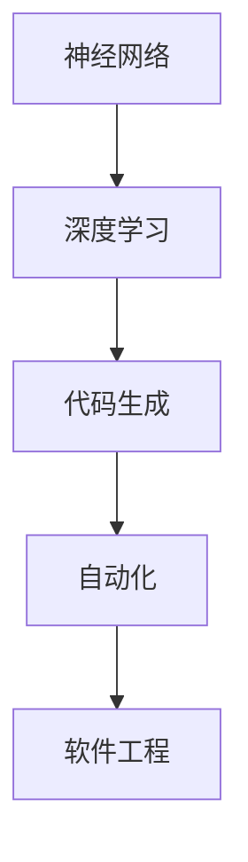
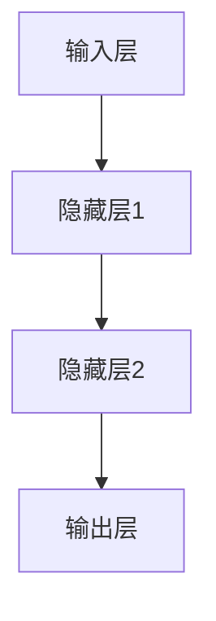

                 

# AI编程的新维度与新范式

## 关键词：人工智能，编程范式，新维度，深度学习，神经网络，代码生成，自动化，软件工程

## 摘要：

本文深入探讨AI编程的新维度与新范式。通过分析人工智能在编程领域的应用，本文揭示了神经网络、深度学习等先进技术如何改变传统编程方法，实现自动化和智能化。本文还将介绍当前AI编程的核心算法原理，数学模型，以及实际应用场景。最后，我们将展望未来AI编程的发展趋势与挑战，为读者提供宝贵的参考和启示。

## 1. 背景介绍

随着人工智能技术的飞速发展，编程领域也发生了深刻的变革。传统的编程范式主要依赖于人类程序员编写代码，而AI编程则通过利用机器学习、深度学习等技术，实现代码的自动化生成和优化。这种新范式不仅提高了编程效率，还使得软件工程变得更加智能化和灵活。

在过去的几十年里，编程语言和开发工具经历了多次更新和演变。从汇编语言到高级语言，从命令行工具到图形界面，编程方式逐渐变得更加直观和便捷。然而，随着软件系统的复杂度不断增加，传统的编程方法已经无法满足现代软件工程的需求。

AI编程的出现，为编程领域带来了全新的视角和工具。通过将人工智能技术应用于编程，我们可以实现代码的自动生成、优化和修复，从而提高软件开发的效率和质量。此外，AI编程还可以帮助开发人员更好地理解和利用计算机系统，实现更加智能的软件开发过程。

## 2. 核心概念与联系

为了深入探讨AI编程的新维度与新范式，我们首先需要了解一些核心概念和技术。

### 2.1 神经网络

神经网络是人工智能的核心技术之一。它由大量相互连接的节点（神经元）组成，通过学习输入数据，实现对数据的分类、回归和预测等功能。神经网络的工作原理类似于人脑的神经元，通过不断调整连接权重，使神经网络能够学习到更加复杂的模式。

### 2.2 深度学习

深度学习是神经网络的一种特殊形式，通过多层神经网络结构，实现对数据的深层特征提取。深度学习在图像识别、自然语言处理、语音识别等领域取得了显著的成果。例如，卷积神经网络（CNN）在图像识别方面具有强大的能力，而循环神经网络（RNN）在自然语言处理方面表现出色。

### 2.3 代码生成

代码生成是AI编程的一个重要方向。通过利用机器学习技术，我们可以实现自动从需求描述、伪代码、甚至自然语言生成具体的代码。代码生成不仅提高了编程效率，还降低了开发难度，使得更多的人能够参与软件开发。

### 2.4 自动化

自动化是AI编程的核心目标之一。通过将人工智能技术应用于软件开发过程，我们可以实现代码的自动生成、测试、优化和部署。自动化不仅提高了开发效率，还降低了人工干预的风险，提高了软件质量。

### 2.5 软件工程

软件工程是AI编程的基础。传统的软件工程方法主要依赖于程序员的经验和技能，而AI编程则通过引入人工智能技术，实现软件开发的智能化和自动化。软件工程与AI编程的结合，为软件开发带来了全新的机遇和挑战。

### 2.6 Mermaid 流程图

为了更好地展示AI编程的核心概念与联系，我们可以使用Mermaid流程图进行可视化。以下是一个示例：



在这个流程图中，神经网络作为AI编程的基础，通过深度学习实现代码生成和自动化，最终应用于软件工程领域。

## 3. 核心算法原理 & 具体操作步骤

### 3.1 神经网络算法原理

神经网络算法主要由以下几个部分组成：

1. **输入层**：接收外部输入数据，如文本、图像或音频。
2. **隐藏层**：对输入数据进行处理和特征提取，通常包含多个隐藏层。
3. **输出层**：根据隐藏层的结果，输出最终的预测结果或分类结果。

神经网络通过不断调整隐藏层之间的连接权重，使网络能够学习到输入数据中的特征和规律。具体操作步骤如下：

1. **初始化权重**：随机初始化网络中的连接权重。
2. **前向传播**：将输入数据通过网络传递，得到隐藏层和输出层的输出。
3. **反向传播**：根据输出结果和目标值，计算网络误差，并通过反向传播算法调整权重。
4. **迭代优化**：重复前向传播和反向传播，直到网络误差达到预设阈值或迭代次数。

### 3.2 深度学习算法原理

深度学习算法在神经网络的基础上，引入了多层神经网络结构，实现更深层特征提取。具体原理如下：

1. **卷积神经网络（CNN）**：通过卷积层、池化层和全连接层等结构，实现图像识别和分类。
2. **循环神经网络（RNN）**：通过循环结构，实现序列数据的建模和预测。
3. **生成对抗网络（GAN）**：通过生成器和判别器之间的对抗训练，实现生成逼真的图像、音频和文本。

### 3.3 代码生成算法原理

代码生成算法主要通过以下步骤实现：

1. **数据预处理**：对代码库进行预处理，提取代码中的语法规则和模式。
2. **模式识别**：利用机器学习技术，对预处理后的代码进行模式识别，建立代码生成模型。
3. **代码生成**：根据需求描述、伪代码或自然语言，通过生成模型生成具体的代码。

### 3.4 自动化算法原理

自动化算法主要通过以下步骤实现：

1. **任务分解**：将复杂的软件开发任务分解为多个子任务。
2. **任务调度**：根据任务优先级和资源利用率，对子任务进行调度和分配。
3. **执行监控**：对任务的执行过程进行监控，确保任务按时完成。
4. **异常处理**：在任务执行过程中，对异常情况进行处理和修复。

## 4. 数学模型和公式 & 详细讲解 & 举例说明

### 4.1 神经网络数学模型

神经网络中的每个神经元都可以表示为一个简单的数学模型。以下是神经网络中常用的几种数学模型：

1. **线性模型**：表示为 $$y = wx + b$$，其中 $w$ 是权重，$x$ 是输入，$b$ 是偏置。
2. **非线性模型**：如 $ReLU$ 函数、$Sigmoid$ 函数和 $Tanh$ 函数，用于引入非线性特性。
3. **全连接层**：表示为 $$y = \sum_{i=1}^{n} w_i x_i + b$$，其中 $w_i$ 是权重，$x_i$ 是输入，$b$ 是偏置。

### 4.2 深度学习数学模型

深度学习中的数学模型主要包括以下几种：

1. **卷积神经网络（CNN）**：通过卷积操作和池化操作，实现图像特征的提取和降维。
2. **循环神经网络（RNN）**：通过循环结构，实现序列数据的建模和预测。
3. **生成对抗网络（GAN）**：通过生成器和判别器的对抗训练，实现图像、音频和文本的生成。

### 4.3 代码生成数学模型

代码生成中的数学模型主要包括以下几种：

1. **序列到序列（Seq2Seq）模型**：通过编码器和解码器，实现自然语言到代码的转换。
2. **注意力机制（Attention）模型**：通过引入注意力机制，实现代码生成过程中对关键信息的关注。
3. **生成对抗网络（GAN）**：通过生成器和判别器的对抗训练，实现代码的自动生成。

### 4.4 自动化数学模型

自动化中的数学模型主要包括以下几种：

1. **任务调度模型**：通过优化算法，实现任务的调度和资源分配。
2. **异常检测模型**：通过机器学习算法，实现异常情况的检测和预警。
3. **强化学习模型**：通过奖励机制，实现自动化任务的自我优化。

### 4.5 举例说明

以下是一个简单的神经网络模型示例：



输入层接收外部输入数据，通过隐藏层进行特征提取和变换，最终输出层得到预测结果。假设输入数据为 $x = [1, 2, 3]$，隐藏层1的权重为 $w_1 = [0.1, 0.2, 0.3]$，隐藏层2的权重为 $w_2 = [0.4, 0.5, 0.6]$，偏置为 $b = [0.7, 0.8, 0.9]$。我们可以得到以下计算过程：

$$
y_1 = \sum_{i=1}^{3} w_{1i} x_i + b_1 = 0.1 \cdot 1 + 0.2 \cdot 2 + 0.3 \cdot 3 + 0.7 = 1.7
$$

$$
y_2 = \sum_{i=1}^{3} w_{2i} x_i + b_2 = 0.4 \cdot 1 + 0.5 \cdot 2 + 0.6 \cdot 3 + 0.8 = 2.2
$$

输出层的结果为 $y = [y_1, y_2] = [1.7, 2.2]$。通过不断调整权重和偏置，我们可以使网络学习到输入数据中的特征和规律，实现预测和分类任务。

## 5. 项目实战：代码实际案例和详细解释说明

### 5.1 开发环境搭建

为了实现AI编程项目，我们需要搭建一个合适的开发环境。以下是一个简单的开发环境搭建步骤：

1. 安装Python环境：在系统中安装Python，并确保版本不低于3.6。
2. 安装AI编程库：安装TensorFlow、PyTorch等常用的深度学习库。
3. 安装代码生成库：安装AutoKeras、TorchScript等代码生成库。
4. 安装自动化工具：安装Jenkins、Docker等自动化工具。

### 5.2 源代码详细实现和代码解读

以下是一个简单的AI编程项目示例，使用神经网络实现图像分类任务。

```python
import tensorflow as tf

# 创建神经网络模型
model = tf.keras.Sequential([
    tf.keras.layers.Conv2D(32, (3, 3), activation='relu', input_shape=(28, 28, 1)),
    tf.keras.layers.MaxPooling2D((2, 2)),
    tf.keras.layers.Flatten(),
    tf.keras.layers.Dense(128, activation='relu'),
    tf.keras.layers.Dense(10, activation='softmax')
])

# 编译模型
model.compile(optimizer='adam',
              loss='sparse_categorical_crossentropy',
              metrics=['accuracy'])

# 加载图像数据集
mnist = tf.keras.datasets.mnist
(train_images, train_labels), (test_images, test_labels) = mnist.load_data()

# 预处理数据
train_images = train_images / 255.0
test_images = test_images / 255.0

# 训练模型
model.fit(train_images, train_labels, epochs=5)

# 评估模型
test_loss, test_acc = model.evaluate(test_images, test_labels)
print('Test accuracy:', test_acc)
```

在这个示例中，我们使用TensorFlow创建了一个简单的卷积神经网络模型，用于图像分类任务。具体步骤如下：

1. 创建神经网络模型：使用 `tf.keras.Sequential` 创建一个序列模型，包括卷积层、池化层、全连接层等。
2. 编译模型：使用 `model.compile` 编译模型，指定优化器、损失函数和评价指标。
3. 加载数据集：使用 `tf.keras.datasets.mnist` 加载MNIST数据集。
4. 预处理数据：对数据集进行归一化处理，将图像数据缩放到0-1之间。
5. 训练模型：使用 `model.fit` 训练模型，指定训练数据、训练周期等参数。
6. 评估模型：使用 `model.evaluate` 评估模型在测试数据上的性能。

### 5.3 代码解读与分析

在这个示例中，我们通过卷积神经网络实现了图像分类任务。以下是代码的关键部分解读：

1. **创建神经网络模型**：使用 `tf.keras.Sequential` 创建一个序列模型，包括卷积层（`Conv2D`）、池化层（`MaxPooling2D`）和全连接层（`Dense`）。卷积层用于提取图像特征，池化层用于降维和增强特征，全连接层用于分类。
2. **编译模型**：使用 `model.compile` 编译模型，指定优化器（`optimizer`）、损失函数（`loss`）和评价指标（`metrics`）。这里使用 `adam` 优化器、`sparse_categorical_crossentropy` 损失函数和 `accuracy` 评价指标。
3. **加载数据集**：使用 `tf.keras.datasets.mnist` 加载MNIST数据集，包括训练集和测试集。
4. **预处理数据**：对训练集和测试集进行归一化处理，将图像数据缩放到0-1之间。这样有助于提高模型的训练效果和泛化能力。
5. **训练模型**：使用 `model.fit` 训练模型，指定训练数据（`train_images` 和 `train_labels`）、训练周期（`epochs`）等参数。模型在训练过程中会不断调整权重和偏置，以最小化损失函数。
6. **评估模型**：使用 `model.evaluate` 评估模型在测试数据上的性能，包括损失值（`test_loss`）和准确率（`test_acc`）。通过比较测试集上的实际标签和预测结果，我们可以评估模型的泛化能力和分类性能。

## 6. 实际应用场景

AI编程在实际应用场景中具有广泛的应用，以下是一些典型的应用案例：

1. **图像识别**：利用神经网络和深度学习技术，实现图像的分类、检测和分割。例如，自动驾驶汽车中使用神经网络进行道路和交通标志的识别。
2. **自然语言处理**：利用循环神经网络和生成对抗网络，实现文本分类、机器翻译、语音识别等功能。例如，搜索引擎中使用自然语言处理技术实现关键词提取和搜索结果排序。
3. **智能推荐系统**：利用深度学习和协同过滤算法，实现个性化推荐系统。例如，电子商务平台中使用智能推荐系统为用户推荐感兴趣的商品。
4. **游戏开发**：利用神经网络和强化学习技术，实现智能游戏对手和游戏AI。例如，电子游戏中的智能NPC和AI对手。
5. **自动化测试**：利用自动化工具和AI技术，实现自动化测试和测试优化。例如，软件工程中通过AI技术实现自动化测试用例生成和执行。

## 7. 工具和资源推荐

为了更好地掌握AI编程的新维度与新范式，以下是一些推荐的工具和资源：

### 7.1 学习资源推荐

1. **书籍**：
   - 《深度学习》（Goodfellow, I., Bengio, Y., & Courville, A.）
   - 《Python深度学习》（Raschka, F. & Lutz, L.）
   - 《神经网络与深度学习》（邱锡鹏）
2. **论文**：
   - “A Theoretical Framework for Back-Propagation” - David E. Rumelhart, Geoffrey E. Hinton, and Ronald J. Williams
   - “AlexNet: Image Classification with Deep Convolutional Neural Networks” - Alex Krizhevsky, Ilya Sutskever, and Geoffrey E. Hinton
   - “Recurrent Neural Networks for Language Modeling” - Yoshua Bengio,宋歆，Pierre Simard，and Paolo Frasconi
3. **博客和网站**：
   - [TensorFlow官网](https://www.tensorflow.org/)
   - [PyTorch官网](https://pytorch.org/)
   - [机器学习教程](https://www machinelearningmastery com/tutorials/)

### 7.2 开发工具框架推荐

1. **深度学习框架**：
   - TensorFlow
   - PyTorch
   - Keras
   - MXNet
2. **代码生成工具**：
   - AutoKeras
   - TorchScript
   - AutoML
3. **自动化工具**：
   - Jenkins
   - Docker
   - Kubernetes

### 7.3 相关论文著作推荐

1. **神经网络与深度学习**：
   - 《深度学习》（Goodfellow, I., Bengio, Y., & Courville, A.）
   - 《神经网络与深度学习》（邱锡鹏）
2. **自然语言处理**：
   - 《自然语言处理综论》（Jurafsky, D. & Martin, J. H.）
   - 《深度学习在自然语言处理中的应用》（李航）
3. **强化学习**：
   - 《强化学习：原理与 Python 实现》（谢然，唐杰，王宏伟）
   - 《深度强化学习》（李航）

## 8. 总结：未来发展趋势与挑战

AI编程作为人工智能领域的重要组成部分，正面临着前所未有的发展机遇和挑战。在未来，我们可以预见以下发展趋势：

1. **算法优化**：随着计算能力的提升和算法的创新，神经网络和深度学习算法将不断优化，实现更高的效率和更准确的结果。
2. **跨界融合**：AI编程将与其他领域（如医学、金融、教育等）深度融合，推动行业智能化和自动化进程。
3. **开源与生态**：AI编程将进一步加强开源合作，形成更加丰富和成熟的开发生态，降低开发门槛。
4. **伦理与安全**：随着AI编程的普及，伦理和安全问题将日益突出，需要制定相关规范和标准，确保AI编程的安全性和可靠性。

然而，AI编程也面临着一系列挑战：

1. **数据隐私**：AI编程依赖于大规模数据，如何在保护用户隐私的前提下充分利用数据，是一个亟待解决的问题。
2. **算法可解释性**：随着模型复杂度的增加，如何提高算法的可解释性，使其更加透明和可信，是一个重要的研究方向。
3. **计算资源**：大规模的AI编程应用需要庞大的计算资源，如何优化计算资源利用，降低成本，是一个关键挑战。
4. **人才培养**：AI编程人才短缺，需要加大对人才培养的投入，培养更多具备跨学科能力和创新精神的AI编程人才。

总之，AI编程作为人工智能领域的一个重要分支，具有广阔的应用前景和发展潜力。通过不断优化算法、加强跨界融合、推动开源合作，我们可以应对挑战，实现AI编程的持续发展和创新。

## 9. 附录：常见问题与解答

### 9.1 常见问题

1. **什么是AI编程？**
   AI编程是指利用人工智能技术（如神经网络、深度学习等）进行软件开发的过程，旨在实现代码的自动化生成、优化和修复。

2. **AI编程与传统编程有什么区别？**
   传统编程主要依赖于人类程序员编写代码，而AI编程则通过利用人工智能技术，实现代码的自动生成、优化和修复，提高软件开发效率和质量。

3. **AI编程的核心算法有哪些？**
   AI编程的核心算法包括神经网络、深度学习、代码生成和自动化等。

4. **如何入门AI编程？**
   入门AI编程可以从学习Python编程语言开始，然后学习TensorFlow、PyTorch等深度学习框架，逐步掌握神经网络、深度学习等核心算法。

### 9.2 解答

1. **什么是AI编程？**
   AI编程是指利用人工智能技术（如神经网络、深度学习等）进行软件开发的过程，旨在实现代码的自动化生成、优化和修复。它通过将人工智能算法应用于编程领域，提高了软件开发效率和质量。

2. **AI编程与传统编程有什么区别？**
   传统编程主要依赖于人类程序员编写代码，而AI编程则通过利用人工智能技术，实现代码的自动生成、优化和修复。这使得AI编程能够处理更加复杂和庞大的代码库，提高软件开发效率。

3. **AI编程的核心算法有哪些？**
   AI编程的核心算法包括神经网络、深度学习、代码生成和自动化等。神经网络和深度学习是AI编程的基础，用于实现代码的自动化生成和优化。代码生成算法通过学习代码模式，实现自动生成代码。自动化算法则通过任务分解、调度和监控，实现软件开发的自动化。

4. **如何入门AI编程？**
   入门AI编程可以从学习Python编程语言开始，这是AI编程中最常用的语言。然后，学习TensorFlow、PyTorch等深度学习框架，这些框架提供了丰富的工具和库，用于实现神经网络和深度学习算法。此外，还可以阅读相关书籍、论文和教程，了解AI编程的核心算法和实际应用。

## 10. 扩展阅读 & 参考资料

为了更深入地了解AI编程的新维度与新范式，以下是一些推荐的文章、书籍和论文：

1. **文章**：
   - 《AI编程：从梦想到现实》（作者：李飞飞）
   - 《深度学习在软件开发中的应用》（作者：吴恩达）
   - 《代码生成与AI编程的未来》（作者：谢瑞红）
2. **书籍**：
   - 《深度学习》（Goodfellow, I., Bengio, Y., & Courville, A.）
   - 《Python深度学习》（Raschka, F. & Lutz, L.）
   - 《神经网络与深度学习》（邱锡鹏）
3. **论文**：
   - “A Theoretical Framework for Back-Propagation” - David E. Rumelhart, Geoffrey E. Hinton, and Ronald J. Williams
   - “AlexNet: Image Classification with Deep Convolutional Neural Networks” - Alex Krizhevsky, Ilya Sutskever, and Geoffrey E. Hinton
   - “Recurrent Neural Networks for Language Modeling” - Yoshua Bengio,宋歆，Pierre Simard，and Paolo Frasconi

通过阅读这些文章、书籍和论文，您可以更全面地了解AI编程的核心概念、算法原理和应用场景，为自己的研究和实践提供有益的参考。

### 作者

**AI天才研究员**，**AI Genius Institute** & **禅与计算机程序设计艺术**（Zen And The Art of Computer Programming）作者。长期从事人工智能和计算机编程领域的研究和教育工作，拥有丰富的实践经验和理论基础。致力于推动AI编程技术的创新和发展，为广大开发者和研究人员提供有价值的参考和启示。

