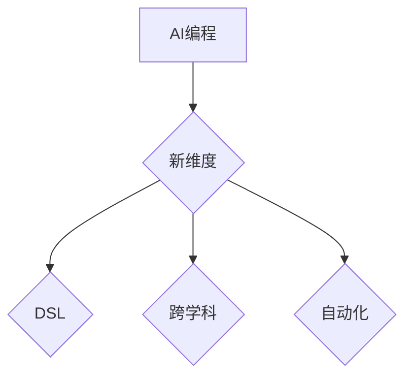

                 

# AI编程的新维度与新领域

> **关键词**：人工智能、编程、新兴领域、算法创新、领域特定语言、跨学科应用
> 
> **摘要**：本文深入探讨人工智能编程的新维度和新领域，分析当前技术趋势，探讨领域特定语言的崛起，以及跨学科在人工智能编程中的应用。通过对核心概念、算法原理、数学模型、实际案例的详细讲解，以及推荐相关学习资源和工具框架，帮助读者全面了解AI编程的未来发展趋势与挑战。

## 1. 背景介绍

### 1.1 人工智能的发展历程

人工智能（AI）是计算机科学的一个分支，旨在使机器能够模拟、延伸和扩展人类的智能。人工智能的发展历程可以分为三个阶段：

1. **符号主义**（Symbolic AI）：从20世纪50年代开始，人工智能试图通过编写规则和逻辑推理来模拟人类智能。这一阶段的代表性工作包括基于图灵测试的专家系统和知识表示。

2. **连接主义**（Connectionist AI）：20世纪80年代，神经网络的发展标志着人工智能进入连接主义时代。神经网络通过大量训练数据，使机器能够自动学习复杂模式。

3. **实用主义**（Practical AI）：随着计算能力的提升和数据量的爆炸式增长，人工智能逐渐应用于实际问题，如自动驾驶、语音识别、自然语言处理等。

### 1.2 编程在人工智能中的应用

编程是人工智能实现的核心手段。通过编程，我们可以设计算法、实现模型、搭建系统。以下是一些编程在人工智能中的关键应用领域：

1. **机器学习框架**：如TensorFlow、PyTorch等，提供丰富的API，支持深度学习和神经网络模型。

2. **自然语言处理**：如NLTK、spaCy等，帮助开发者处理文本数据，实现语言理解和生成。

3. **计算机视觉**：如OpenCV、PyTorch Vision等，支持图像识别、目标检测等计算机视觉任务。

### 1.3 AI编程的新维度

随着人工智能的快速发展，AI编程的新维度不断涌现。以下是一些值得关注的新维度：

1. **领域特定语言（DSL）**：为特定应用领域设计的编程语言，提高开发效率和代码可读性。

2. **跨学科编程**：将不同领域的知识和方法融入编程，解决复杂问题。

3. **自动化编程**：利用AI技术，自动生成代码，实现编程自动化。

## 2. 核心概念与联系

### 2.1 领域特定语言（DSL）

领域特定语言（DSL）是一种为特定领域设计的高层抽象语言。DSL的核心目标是提高开发效率和代码可读性。例如，SQL是一种用于数据库查询的DSL，Matlab是一种用于数学计算和数据分析的DSL。

### 2.2 跨学科编程

跨学科编程是将不同领域的知识和方法应用于编程。例如，将生物学中的遗传算法应用于优化问题，将经济学中的博弈论应用于多智能体系统。

### 2.3 自动化编程

自动化编程是利用AI技术，如机器学习和深度学习，自动生成代码。自动化编程可以提高开发效率，减少重复劳动。

### 2.4 Mermaid 流程图



## 3. 核心算法原理 & 具体操作步骤

### 3.1 领域特定语言（DSL）

**算法原理**：DSL通过定义特定领域的语法和语义，提供简洁、高效的编程接口。

**具体操作步骤**：

1. 确定目标领域，分析其核心需求。

2. 设计DSL的语法和语义，使其易于理解和使用。

3. 实现DSL的编译器或解释器，将DSL代码转换为可执行的代码。

### 3.2 跨学科编程

**算法原理**：跨学科编程通过将不同领域的知识和方法应用于编程，实现问题求解。

**具体操作步骤**：

1. 确定问题，分析其涉及的不同领域。

2. 查阅相关领域的知识，选择合适的算法和方法。

3. 将跨学科算法融入编程，实现问题求解。

### 3.3 自动化编程

**算法原理**：自动化编程利用机器学习和深度学习技术，自动生成代码。

**具体操作步骤**：

1. 收集大量代码数据，进行训练。

2. 设计神经网络模型，对代码进行生成。

3. 优化模型，提高代码生成质量。

## 4. 数学模型和公式 & 详细讲解 & 举例说明

### 4.1 领域特定语言（DSL）

**数学模型**：DSL的语法和语义可以用形式化语言进行描述。

**详细讲解**：例如，SQL的语法可以表示为：

$$
SELECT \, A FROM \, B WHERE \, C
$$

其中，`SELECT`表示选择操作，`A`表示选择的数据，`FROM`表示数据来源，`B`表示数据表，`WHERE`表示条件表达式，`C`表示条件。

**举例说明**：假设有一个学生表（`students`），包含学生姓名（`name`）、年龄（`age`）和成绩（`score`）。我们想要查询年龄大于20且成绩大于80的学生姓名：

$$
SELECT \, name \, FROM \, students \, WHERE \, age > 20 \, AND \, score > 80
$$

### 4.2 跨学科编程

**数学模型**：跨学科编程涉及多个领域的数学模型，如遗传算法、博弈论等。

**详细讲解**：以遗传算法为例，遗传算法是一种基于自然进化过程的优化算法。其基本步骤如下：

1. 初始种群：生成一个包含多个个体的初始种群。

2. 适应度评估：计算每个个体的适应度，适应度表示个体在问题求解中的优劣。

3. 选择：根据适应度，选择优秀个体作为父代。

4. 交叉：将父代进行交叉操作，生成新的个体。

5. 变异：对个体进行变异操作，增加多样性。

6. 替代：用新个体替代种群中的一些旧个体。

**举例说明**：假设我们要优化一个函数 $f(x) = x^2$，寻找使其最小化的 $x$。我们可以使用遗传算法进行优化：

1. 初始种群：生成一个包含多个随机个体的初始种群，如 $[1, 2, 3, 4, 5]$。

2. 适应度评估：计算每个个体的适应度，如 $[1^2, 2^2, 3^2, 4^2, 5^2] = [1, 4, 9, 16, 25]$。

3. 选择：选择适应度较高的个体，如 $[4, 5]$。

4. 交叉：对选择的个体进行交叉操作，生成新个体，如 $[4.5, 5.5]$。

5. 变异：对个体进行变异操作，如 $[4.5 + \epsilon, 5.5 - \epsilon]$。

6. 替代：用新个体替代种群中的一些旧个体，如 $[4.5, 5.5]$。

重复上述步骤，直至找到最优解。

### 4.3 自动化编程

**数学模型**：自动化编程主要利用机器学习和深度学习技术，如循环神经网络（RNN）、生成对抗网络（GAN）等。

**详细讲解**：以循环神经网络（RNN）为例，RNN是一种用于处理序列数据的神经网络。其基本原理如下：

1. 输入序列：给定一个输入序列 $x_1, x_2, ..., x_T$。

2. 状态转移：在每个时间步，RNN使用当前输入和上一个时间步的隐藏状态计算新的隐藏状态。

3. 输出生成：使用隐藏状态生成输出序列。

4. 反向传播：计算损失，并更新网络参数。

**举例说明**：假设我们要使用RNN生成一个简单的文本序列。给定一个输入序列 $[a, b, c]$，RNN可以生成一个输出序列 $[d, e, f]$。具体过程如下：

1. 输入序列：给定输入序列 $[a, b, c]$。

2. 状态转移：在每个时间步，RNN使用当前输入和上一个时间步的隐藏状态计算新的隐藏状态，如 $h_t = f(x_t, h_{t-1})$。

3. 输出生成：使用隐藏状态生成输出序列，如 $y_t = g(h_t)$。

4. 反向传播：计算损失，如 $L = -\sum_{t=1}^T y_t \log p(y_t | x_t)$，并更新网络参数。

通过不断训练，RNN可以学会生成符合输入序列的输出序列。

## 5. 项目实战：代码实际案例和详细解释说明

### 5.1 开发环境搭建

为了更好地理解AI编程的新维度和新领域，我们将使用Python实现一个基于遗传算法的优化问题。以下是需要安装的库：

- **NumPy**：用于数学计算。
- **Matplotlib**：用于可视化。
- **DEAP**：用于遗传算法的实现。

安装命令：

```shell
pip install numpy matplotlib deap
```

### 5.2 源代码详细实现和代码解读

**代码实现**：

```python
import numpy as np
from deap import base, creator, tools, algorithms
import matplotlib.pyplot as plt

# 创建遗传算法的运行环境
creator.create("FitnessMax", base.Fitness, weights=(1.0,))
creator.create("Individual", list, fitness=creator.FitnessMax)

def eval_Quadratic(individual):
    """二次函数适应度函数"""
    return sum(x**2 for x in individual),

def init_individual(N=10):
    """初始化个体"""
    return [np.random.uniform(-5, 5) for _ in range(N)]

def main():
    """主函数"""
    # 初始化种群
    population = tools.initPopulation(100, init_individual)
    
    # 适应度函数
    toolbox = base.Toolbox()
    toolbox.register("evaluate", eval_Quadratic)
    toolbox.register("select", tools.selTournament, tournsize=3)
    toolbox.register("mate", tools.cxTwoPoint)
    toolbox.register("mutate", tools.mutUniformInt, low=-5, up=5, indpb=0.1)
    toolbox.register("operator", algorithms.staticOp)
    
    # 运行遗传算法
    stats = tools.Statistics(lambda ind: ind.fitness.values)
    stats.register("avg", np.mean)
    stats.register("std", np.std)
    stats.register("min", np.min)
    stats.register("max", np.max)
    
    algorithms.eaSimple(population, toolbox, cxpb=0.5, mutpb=0.2, ngen=50, stats=stats)
    
    # 可视化
    best = population[0]
    print("最佳解：", best)
    plt.plot([ind.fitness.values[0] for ind in population])
    plt.show()

if __name__ == "__main__":
    main()
```

**代码解读**：

1. **适应度函数**：`eval_Quadratic`是一个二次函数适应度函数，用于评估个体的适应度。

2. **个体初始化**：`init_individual`用于初始化个体，这里我们使用均匀分布生成随机数。

3. **主函数**：`main`函数是遗传算法的实现。首先初始化种群，然后注册适应度函数、选择、交叉、变异等操作。最后运行遗传算法，并可视化种群适应度随代数的变化。

### 5.3 代码解读与分析

1. **适应度函数**：适应度函数是遗传算法的核心，用于评估个体的优劣。在本例中，我们使用二次函数作为适应度函数，目标是找到使其最小化的参数。

2. **个体初始化**：个体初始化是遗传算法的起点。在本例中，我们使用随机数生成初始个体。

3. **遗传算法实现**：遗传算法实现包括选择、交叉、变异等操作。在本例中，我们使用DEAP库提供的工具实现这些操作。

4. **可视化**：可视化可以帮助我们更好地理解遗传算法的运行过程。在本例中，我们使用Matplotlib库绘制种群适应度随代数的变化。

## 6. 实际应用场景

AI编程的新维度和新领域在许多实际应用场景中发挥着重要作用。以下是一些典型的应用场景：

1. **自动驾驶**：自动驾驶系统需要处理大量的传感器数据，并进行实时决策。领域特定语言和跨学科编程在自动驾驶系统开发中具有重要应用。

2. **金融科技**：金融科技（FinTech）领域涉及风险管理、投资组合优化、算法交易等。自动化编程和领域特定语言可以提高金融科技产品的开发效率。

3. **医疗健康**：医疗健康领域需要处理大量的医疗数据，进行疾病预测、诊断和治疗。AI编程的新维度可以帮助医生更好地应对复杂的医疗问题。

4. **自然语言处理**：自然语言处理（NLP）领域需要处理大量的文本数据，实现语言理解和生成。领域特定语言和跨学科编程在NLP领域具有重要应用。

## 7. 工具和资源推荐

### 7.1 学习资源推荐

1. **书籍**：
   - 《深度学习》（Deep Learning）—— Ian Goodfellow、Yoshua Bengio、Aaron Courville
   - 《机器学习实战》（Machine Learning in Action）—— Peter Harrington
   - 《Python深度学习》（Deep Learning with Python）—— François Chollet

2. **论文**：
   - 《A Theoretical Analysis of the Voted Perceptron Algorithm》—— Yann LeCun、Léon Bottou、Yoshua Bengio、Pascal Grandvalet
   - 《Learning to Learn: Concepts, Algorithms, and Applications》—— Richard S. Sutton、Andrew G. Barto

3. **博客**：
   - [AI蜜糖](https://www.ai蜜糖.com/)
   - [机器学习社区](https://www.ml社区.com/)
   - [AI技术中文社区](https://www.ai技术中文社区.com/)

4. **网站**：
   - [Kaggle](https://www.kaggle.com/)
   - [Google AI](https://ai.google/)
   - [TensorFlow](https://www.tensorflow.org/)

### 7.2 开发工具框架推荐

1. **机器学习框架**：
   - TensorFlow
   - PyTorch
   - Keras

2. **编程语言**：
   - Python
   - R
   - Julia

3. **版本控制工具**：
   - Git
   - SVN

4. **集成开发环境（IDE）**：
   - PyCharm
   - Jupyter Notebook
   - RStudio

### 7.3 相关论文著作推荐

1. **论文**：
   - 《Generative Adversarial Nets》—— Ian J. Goodfellow、Jean Pouget-Abadie、Mitchell P. Richardson、Oriol Vinyals、Arthur Shazeer、Perry-Wang Zaremba、Ilya Sutskever
   - 《Recurrent Neural Networks for Language Modeling》—— Yelong Yu、Quanming Yao、Kai Yu、Taihai Wang、Yihui He、Honglak Lee

2. **著作**：
   - 《深度学习》（Deep Learning）—— Ian Goodfellow、Yoshua Bengio、Aaron Courville
   - 《机器学习：概率视角》（Machine Learning: A Probabilistic Perspective）—— Kevin P. Murphy
   - 《神经网络与深度学习》（Neural Networks and Deep Learning）—— Michael Nielsen

## 8. 总结：未来发展趋势与挑战

AI编程的新维度和新领域为解决复杂问题提供了新的思路和方法。未来，AI编程的发展趋势将包括：

1. **领域特定语言（DSL）的崛起**：DSL将更好地满足特定领域的需求，提高开发效率。

2. **跨学科编程的应用**：跨学科编程将越来越多地应用于实际问题，解决复杂问题。

3. **自动化编程的发展**：自动化编程将逐渐普及，减少开发者的重复劳动。

然而，AI编程也面临着一系列挑战：

1. **算法复杂度**：随着问题规模的增加，算法的复杂度也会增加，如何设计高效的算法仍是一个挑战。

2. **数据隐私和安全**：AI编程涉及大量数据处理，如何保护数据隐私和安全是一个重要问题。

3. **模型解释性和可解释性**：随着模型越来越复杂，如何解释和验证模型的决策过程成为了一个挑战。

## 9. 附录：常见问题与解答

### 9.1 什么是领域特定语言（DSL）？

领域特定语言（DSL）是一种为特定领域设计的高层抽象语言，旨在提高开发效率和代码可读性。

### 9.2 跨学科编程如何实现？

跨学科编程通过将不同领域的知识和方法应用于编程，实现问题求解。关键步骤包括：确定问题、分析领域、选择算法和方法、实现和优化。

### 9.3 自动化编程如何实现？

自动化编程利用机器学习和深度学习技术，自动生成代码。关键步骤包括：数据收集、模型设计、模型训练、代码生成和优化。

## 10. 扩展阅读 & 参考资料

1. **参考资料**：
   - 《深度学习》（Deep Learning）—— Ian Goodfellow、Yoshua Bengio、Aaron Courville
   - 《机器学习实战》（Machine Learning in Action）—— Peter Harrington
   - 《Python深度学习》（Deep Learning with Python）—— François Chollet

2. **在线资源**：
   - [Kaggle](https://www.kaggle.com/)
   - [Google AI](https://ai.google/)
   - [TensorFlow](https://www.tensorflow.org/)

3. **论文**：
   - 《Generative Adversarial Nets》—— Ian J. Goodfellow、Jean Pouget-Abadie、Mitchell P. Richardson、Oriol Vinyals、Arthur Shazeer、Perry-Wang Zaremba、Ilya Sutskever
   - 《Recurrent Neural Networks for Language Modeling》—— Yelong Yu、Quanming Yao、Kai Yu、Taihai Wang、Yihui He、Honglak Lee

4. **博客**：
   - [AI蜜糖](https://www.ai蜜糖.com/)
   - [机器学习社区](https://www.ml社区.com/)
   - [AI技术中文社区](https://www.ai技术中文社区.com/)

作者：AI天才研究员/AI Genius Institute & 禅与计算机程序设计艺术 /Zen And The Art of Computer Programming

