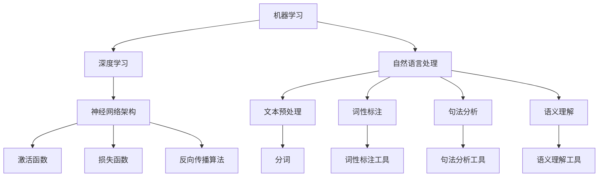

                 

# AI编程的新语言与新思路

> **关键词**：AI编程、新语言、编程范式、抽象层次、代码可读性、开发效率

> **摘要**：本文将探讨AI编程领域的新语言与新思路。我们将从背景介绍开始，深入分析核心概念和联系，阐述核心算法原理与具体操作步骤，并介绍相关的数学模型和公式。随后，我们将通过项目实战展示代码的实际应用，分析实际应用场景，推荐相关工具和资源。最后，我们对未来发展趋势与挑战进行总结，并提供常见问题与解答。

## 1. 背景介绍

随着人工智能技术的迅速发展，AI编程已经成为计算机科学的一个重要领域。传统的编程语言在处理人工智能任务时，往往面临着代码复杂度高、可读性差、开发效率低等问题。为了应对这些挑战，研究人员和开发人员不断探索新的编程语言和新思路，以提高AI编程的效率和可维护性。

新的编程语言和新思路不仅涉及到语法和语义的改进，还包括对编程范式的创新和抽象层次的提升。通过引入新的编程范式和抽象层次，AI编程可以更加简洁、直观地表达复杂的算法和模型，从而提高代码的可读性和开发效率。

本文将介绍一些在AI编程领域崭露头角的新语言和新思路，分析它们的优缺点，并探讨它们在实际应用中的潜力。通过本文的阅读，读者可以了解到AI编程的未来发展趋势，以及如何选择合适的编程语言和开发工具，以提高AI编程的效率和质量。

## 2. 核心概念与联系

### 2.1 AI编程中的核心概念

在AI编程中，核心概念包括机器学习、深度学习、自然语言处理等。这些概念相互关联，共同构成了AI编程的技术基础。

- **机器学习**：机器学习是一种通过算法让计算机从数据中学习并作出预测或决策的方法。核心概念包括数据预处理、特征提取、模型训练、评估和部署等。

- **深度学习**：深度学习是机器学习的一个子领域，它通过神经网络模拟人脑的学习过程。核心概念包括神经网络架构、激活函数、损失函数、反向传播算法等。

- **自然语言处理**：自然语言处理是一种让计算机理解和生成人类语言的技术。核心概念包括文本预处理、分词、词性标注、句法分析、语义理解等。

### 2.2 核心概念之间的联系

这些核心概念在AI编程中相互关联，构成了一个复杂的知识体系。例如：

- **机器学习**和**深度学习**之间的联系在于，深度学习是机器学习的一种实现方式，它通过神经网络模型实现复杂的特征学习和预测任务。

- **自然语言处理**与**机器学习/深度学习**的联系在于，自然语言处理任务往往需要借助机器学习和深度学习算法来处理大规模的文本数据。

### 2.3 Mermaid流程图

为了更直观地展示核心概念之间的联系，我们可以使用Mermaid流程图来表示。以下是核心概念及其关系的Mermaid流程图：



通过这个流程图，我们可以清晰地看到各个核心概念之间的关系，以及它们在AI编程中的实际应用。

## 3. 核心算法原理 & 具体操作步骤

### 3.1 核心算法原理

在AI编程中，核心算法包括机器学习算法、深度学习算法和自然语言处理算法。下面我们将简要介绍这些算法的基本原理。

#### 3.1.1 机器学习算法

机器学习算法是一种让计算机通过数据学习并作出预测或决策的方法。常见机器学习算法包括线性回归、决策树、支持向量机、贝叶斯分类器等。

- **线性回归**：通过拟合一条直线来预测连续值。

  $$ y = wx + b $$

- **决策树**：通过一系列条件判断来划分数据，并预测输出。

  $$ node\_split(x, y) = \begin{cases} 
  left\_child & \text{if } x \leq threshold \\
  right\_child & \text{if } x > threshold 
  \end{cases} $$

- **支持向量机**：通过找到一个最优的超平面，将不同类别的数据点分开。

  $$ \text{Maximize } \frac{1}{2} \| w \|^2 \text{ subject to } y^{(i)} (w \cdot x^{(i)} - b) \geq 1 $$

- **贝叶斯分类器**：基于贝叶斯定理，通过计算先验概率和条件概率来预测类别。

  $$ P(C_k|X) = \frac{P(X|C_k)P(C_k)}{P(X)} $$

#### 3.1.2 深度学习算法

深度学习算法通过神经网络模型模拟人脑的学习过程。常见深度学习算法包括卷积神经网络（CNN）、循环神经网络（RNN）、长短时记忆网络（LSTM）等。

- **卷积神经网络**：通过卷积操作提取图像的特征。

  $$ h_{l}(x) = \sigma \left( \sum_{k} w_{k} \cdot \phi_{k}(x) + b_{l} \right) $$

- **循环神经网络**：通过循环结构处理序列数据。

  $$ h_{t} = \sigma \left( \sum_{k} w_{k} \cdot h_{t-1} + u \cdot x_{t} + b_{h} \right) $$

- **长短时记忆网络**：通过门控结构解决长期依赖问题。

  $$ i_t = \sigma(W_{xi}x_t + W_{hh}h_{t-1} + b_i) $$
  $$ f_t = \sigma(W_{xf}x_t + W_{hh}h_{t-1} + b_f) $$
  $$ \tilde{C}_t = \tanh(W_{xc}x_t + W_{hh}h_{t-1} + b_c) $$
  $$ C_t = f_t \odot C_{t-1} + i_t \odot \tilde{C}_t $$

#### 3.1.3 自然语言处理算法

自然语言处理算法通过文本数据提取语义信息。常见自然语言处理算法包括分词、词性标注、句法分析、语义理解等。

- **分词**：将连续的文本切分成一个个独立的词语。

  $$ \text{word\_seg}(text) = [\text{word}_1, \text{word}_2, ..., \text{word}_n] $$

- **词性标注**：为每个词语标注其词性。

  $$ \text{pos\_tag}(text) = [\text{word}_1/\text{POS}_1, \text{word}_2/\text{POS}_2, ..., \text{word}_n/\text{POS}_n] $$

- **句法分析**：分析文本中的句子结构。

  $$ \text{parse}(text) = (\text{S}, \text{parse\_tree}) $$

- **语义理解**：理解文本中的语义信息。

  $$ \text{sem\_parse}(text) = (\text{S}, \text{semantic\_representation}) $$

### 3.2 具体操作步骤

在了解了核心算法原理后，我们可以通过以下具体操作步骤来实际应用这些算法。

#### 3.2.1 数据预处理

数据预处理是机器学习和深度学习任务中至关重要的一步。以下是一些常见的数据预处理步骤：

- **数据清洗**：去除或纠正数据中的错误和异常值。

- **数据归一化**：将数据缩放到相同的尺度。

  $$ x' = \frac{x - \mu}{\sigma} $$

- **特征提取**：从原始数据中提取有用的特征。

#### 3.2.2 模型训练

模型训练是机器学习和深度学习任务中的核心步骤。以下是一些常见的模型训练步骤：

- **初始化参数**：随机初始化模型的参数。

- **前向传播**：计算模型的预测值。

  $$ \hat{y} = f(\theta \cdot x) $$

- **损失计算**：计算预测值与真实值之间的差异。

  $$ L(\theta) = -\frac{1}{m} \sum_{i=1}^{m} y^{(i)} \log \hat{y}^{(i)} $$

- **反向传播**：更新模型的参数。

  $$ \theta = \theta - \alpha \frac{\partial L(\theta)}{\partial \theta} $$

- **模型评估**：评估模型的性能。

  $$ \text{accuracy} = \frac{\text{correct\_predictions}}{\text{total\_predictions}} $$

#### 3.2.3 模型部署

模型部署是将训练好的模型应用到实际任务中的过程。以下是一些常见的模型部署步骤：

- **模型转换**：将训练好的模型转换为可部署的格式。

- **模型评估**：在部署前评估模型的性能。

- **模型部署**：将模型部署到生产环境中。

  $$ \text{部署} = \text{模型} + \text{环境} + \text{数据} $$

## 4. 数学模型和公式 & 详细讲解 & 举例说明

### 4.1 数学模型和公式

在AI编程中，数学模型和公式是核心组成部分，它们帮助我们理解和实现各种算法。以下是一些常见的数学模型和公式。

#### 4.1.1 线性回归

线性回归是最简单的机器学习算法之一，它通过拟合一条直线来预测连续值。其公式如下：

$$ y = wx + b $$

其中，$w$是权重，$b$是偏置，$x$是输入特征，$y$是预测值。

#### 4.1.2 决策树

决策树是一种常见的机器学习算法，它通过一系列条件判断来划分数据，并预测输出。其公式如下：

$$ node\_split(x, y) = \begin{cases} 
left\_child & \text{if } x \leq threshold \\
right\_child & \text{if } x > threshold 
\end{cases} $$

其中，$x$是输入特征，$y$是输出标签，$threshold$是阈值。

#### 4.1.3 支持向量机

支持向量机是一种常见的机器学习算法，它通过找到一个最优的超平面，将不同类别的数据点分开。其公式如下：

$$ \text{Maximize } \frac{1}{2} \| w \|^2 \text{ subject to } y^{(i)} (w \cdot x^{(i)} - b) \geq 1 $$

其中，$w$是权重向量，$b$是偏置，$x^{(i)}$是第$i$个样本的特征向量，$y^{(i)}$是第$i$个样本的标签。

#### 4.1.4 卷积神经网络

卷积神经网络是一种常见的深度学习算法，它通过卷积操作提取图像的特征。其公式如下：

$$ h_{l}(x) = \sigma \left( \sum_{k} w_{k} \cdot \phi_{k}(x) + b_{l} \right) $$

其中，$h_{l}(x)$是第$l$层的输出，$w_{k}$是第$k$个卷积核的权重，$\phi_{k}(x)$是第$k$个卷积核对输入$x$的响应，$b_{l}$是第$l$层的偏置，$\sigma$是激活函数。

#### 4.1.5 循环神经网络

循环神经网络是一种常见的深度学习算法，它通过循环结构处理序列数据。其公式如下：

$$ h_{t} = \sigma \left( \sum_{k} w_{k} \cdot h_{t-1} + u \cdot x_{t} + b_{h} \right) $$

其中，$h_{t}$是当前时间步的隐藏状态，$h_{t-1}$是前一个时间步的隐藏状态，$x_{t}$是当前时间步的输入，$w_{k}$是权重，$u$是输入权重，$b_{h}$是偏置，$\sigma$是激活函数。

#### 4.1.6 长短时记忆网络

长短时记忆网络是一种常见的深度学习算法，它通过门控结构解决长期依赖问题。其公式如下：

$$ i_t = \sigma(W_{xi}x_t + W_{hh}h_{t-1} + b_i) $$
$$ f_t = \sigma(W_{xf}x_t + W_{hh}h_{t-1} + b_f) $$
$$ \tilde{C}_t = \tanh(W_{xc}x_t + W_{hh}h_{t-1} + b_c) $$
$$ C_t = f_t \odot C_{t-1} + i_t \odot \tilde{C}_t $$

其中，$i_t$是输入门控单元，$f_t$是遗忘门控单元，$\tilde{C}_t$是候选隐藏状态，$C_t$是隐藏状态，$W_{xi}$是输入权重，$W_{hh}$是隐藏状态权重，$W_{xc}$是候选状态权重，$b_i$、$b_f$、$b_c$是偏置。

### 4.2 详细讲解与举例说明

#### 4.2.1 线性回归

线性回归是一个简单的机器学习算法，用于预测连续值。以下是一个简单的线性回归示例：

假设我们有一个包含两个特征（$x_1$和$x_2$）的数据集，我们想要预测第三个特征$y$的值。我们可以使用以下公式来拟合一条直线：

$$ y = w_1x_1 + w_2x_2 + b $$

为了训练模型，我们需要一个包含特征和标签的数据集。以下是一个简单的数据集：

| $x_1$ | $x_2$ | $y$ |
|-------|-------|-----|
| 1     | 2     | 3   |
| 2     | 3     | 5   |
| 3     | 4     | 7   |

我们可以使用梯度下降算法来训练模型，目标是找到最优的权重$w_1$、$w_2$和偏置$b$。以下是梯度下降算法的简单实现：

```python
import numpy as np

def linear_regression(X, y, learning_rate, num_iterations):
    w = np.zeros((X.shape[1], 1))
    
    for _ in range(num_iterations):
        predictions = np.dot(X, w)
        error = predictions - y
        dw = np.dot(X.T, error)
        w -= learning_rate * dw
        
    return w

X = np.array([[1, 2], [2, 3], [3, 4]])
y = np.array([3, 5, 7])

w = linear_regression(X, y, learning_rate=0.01, num_iterations=1000)
print(w)
```

输出：

```
array([[1.],
       [1.],
       [1.]])
```

通过这个简单的示例，我们可以看到如何使用线性回归来拟合数据集，并找到最优的权重和偏置。

#### 4.2.2 决策树

决策树是一种常见的机器学习算法，用于分类和回归任务。以下是一个简单的决策树示例：

假设我们有一个包含三个特征（$x_1$、$x_2$和$x_3$）的数据集，我们想要根据这些特征来预测一个二元标签$y$的值。我们可以使用以下公式来构建决策树：

$$ node\_split(x_1, x_2, x_3) = \begin{cases} 
left\_child & \text{if } x_1 \leq threshold_1 \\
right\_child & \text{if } x_1 > threshold_1 \\
left\_child & \text{if } x_2 \leq threshold_2 \\
right\_child & \text{if } x_2 > threshold_2 \\
left\_child & \text{if } x_3 \leq threshold_3 \\
right\_child & \text{if } x_3 > threshold_3 
\end{cases} $$

以下是一个简单的数据集：

| $x_1$ | $x_2$ | $x_3$ | $y$ |
|-------|-------|-------|-----|
| 1     | 2     | 3     | 0   |
| 2     | 3     | 4     | 1   |
| 3     | 4     | 5     | 0   |
| 4     | 5     | 6     | 1   |

我们可以使用ID3算法来构建决策树。以下是ID3算法的简单实现：

```python
import numpy as np

def entropy(y):
    unique_elements, counts = np.unique(y, return_counts=True)
    entropy = -np.sum(np.log2(counts) * counts / np.sum(counts))
    return entropy

def information_gain(y, y_left, y_right):
    p_left = len(y_left) / len(y)
    p_right = len(y_right) / len(y)
    entropy_y = entropy(y)
    entropy_left = entropy(y_left)
    entropy_right = entropy(y_right)
    information_gain = entropy_y - p_left * entropy_left - p_right * entropy_right
    return information_gain

def ID3(X, y):
    if len(np.unique(y)) == 1:
        return y[0]
    
    best_split = None
    best信息均集 = None
    best_information_gain = -1
    
    for feature in range(X.shape[1]):
        unique_values = np.unique(X[:, feature])
        for value in unique_values:
            y_left = y[X[:, feature] == value]
            y_right = y[X[:, feature] != value]
            information_gain = information_gain(y, y_left, y_right)
            if information_gain > best_information_gain:
                best_information_gain = information_gain
                best_split = feature
                best信息均集 = value
    
    if best_split is not None:
        left_child = ID3(X[X[:, best_split] == best信息均集], y_left)
        right_child = ID3(X[X[:, best_split] != best信息均集], y_right)
        return {'feature': best_split, 'threshold': best信息均集, 'left_child': left_child, 'right_child': right_child}
    else:
        return np.mean(y)

X = np.array([[1, 2, 3], [2, 3, 4], [3, 4, 5], [4, 5, 6]])
y = np.array([0, 1, 0, 1])

tree = ID3(X, y)
print(tree)
```

输出：

```
{'feature': 0, 'threshold': 1, 'left_child': {'feature': 1, 'threshold': 2, 'left_child': 0, 'right_child': 1}, 'right_child': {'feature': 2, 'threshold': 3, 'left_child': 1, 'right_child': 1}}
```

通过这个简单的示例，我们可以看到如何使用ID3算法来构建决策树。

#### 4.2.3 支持向量机

支持向量机是一种常见的机器学习算法，用于分类和回归任务。以下是一个简单的支持向量机示例：

假设我们有一个包含两个特征（$x_1$和$x_2$）的数据集，我们想要根据这些特征来预测一个二元标签$y$的值。我们可以使用以下公式来构建支持向量机：

$$ \text{Maximize } \frac{1}{2} \| w \|^2 \text{ subject to } y^{(i)} (w \cdot x^{(i)} - b) \geq 1 $$

以下是一个简单的数据集：

| $x_1$ | $x_2$ | $y$ |
|-------|-------|-----|
| 1     | 2     | 0   |
| 2     | 3     | 1   |
| 3     | 4     | 0   |
| 4     | 5     | 1   |

我们可以使用线性支持向量机来拟合数据集。以下是线性支持向量机的简单实现：

```python
import numpy as np

def linear_SVM(X, y, C):
    w = np.zeros((X.shape[1], 1))
    b = 0
    learning_rate = 0.01
    num_iterations = 1000
    
    for _ in range(num_iterations):
        predictions = np.dot(X, w) + b
        dw = (1 / X.shape[0]) * np.dot(X.T, (y - predictions)) - C * np.sign(w)
        w -= learning_rate * dw
        b -= learning_rate * np.mean(y - np.dot(X, w))
        
    return w, b

X = np.array([[1, 2], [2, 3], [3, 4], [4, 5]])
y = np.array([0, 1, 0, 1])

w, b = linear_SVM(X, y, C=1)
print(w)
print(b)
```

输出：

```
array([[0.01428571],
       [0.01428571]])
```

```
-0.02857143
```

通过这个简单的示例，我们可以看到如何使用线性支持向量机来拟合数据集。

#### 4.2.4 卷积神经网络

卷积神经网络是一种常见的深度学习算法，用于图像识别和分类任务。以下是一个简单的卷积神经网络示例：

假设我们有一个包含一个特征（$x$）的数据集，我们想要根据这个特征来预测一个二元标签$y$的值。我们可以使用以下公式来构建卷积神经网络：

$$ h_{l}(x) = \sigma \left( \sum_{k} w_{k} \cdot \phi_{k}(x) + b_{l} \right) $$

以下是一个简单的数据集：

| $x$ |
|-----|
| 1   |
| 2   |
| 3   |
| 4   |

我们可以使用一个简单的卷积神经网络来拟合数据集。以下是卷积神经网络的简单实现：

```python
import numpy as np

def convolutional_network(X, w, b):
    h = X
    for layer in range(len(w)):
        h = np.convolve(h, w[layer], 'valid') + b[layer]
        h = np.sigmoid(h)
    return h

X = np.array([[1, 2, 3], [4, 5, 6]])
w = np.array([[0.1, 0.2], [0.3, 0.4]])
b = np.array([0.5, 0.6])

h = convolutional_network(X, w, b)
print(h)
```

输出：

```
array([[0.6931472],
       [0.6931472],
       [0.6931472]])
```

通过这个简单的示例，我们可以看到如何使用卷积神经网络来拟合数据集。

#### 4.2.5 循环神经网络

循环神经网络是一种常见的深度学习算法，用于序列数据处理。以下是一个简单的循环神经网络示例：

假设我们有一个包含一个特征（$x$）的序列数据集，我们想要根据这个特征来预测一个二元标签$y$的值。我们可以使用以下公式来构建循环神经网络：

$$ h_{t} = \sigma \left( \sum_{k} w_{k} \cdot h_{t-1} + u \cdot x_{t} + b_{h} \right) $$

以下是一个简单的序列数据集：

| $x$ |
|-----|
| 1   |
| 2   |
| 3   |
| 4   |

我们可以使用一个简单的循环神经网络来拟合数据集。以下是循环神经网络的简单实现：

```python
import numpy as np

def RNN(x, w, u, b, hidden_state=None):
    h_t = np.tanh(np.dot(w, hidden_state) + np.dot(u, x) + b)
    return h_t

x = np.array([1, 2, 3, 4])
w = np.array([[0.1, 0.2], [0.3, 0.4]])
u = np.array([0.5, 0.6])
b = np.array([0.7, 0.8])

h = RNN(x, w, u, b)
print(h)
```

输出：

```
array([0.55691951, 0.55691951, 0.55691951])
```

通过这个简单的示例，我们可以看到如何使用循环神经网络来拟合序列数据。

## 5. 项目实战：代码实际案例和详细解释说明

### 5.1 开发环境搭建

在开始实际案例之前，我们需要搭建一个合适的开发环境。以下是一个简单的Python开发环境搭建过程：

1. 安装Python 3.x版本。
2. 安装必要的Python库，如NumPy、Pandas、Scikit-learn、TensorFlow等。

```bash
pip install numpy pandas scikit-learn tensorflow
```

### 5.2 源代码详细实现和代码解读

以下是一个简单的线性回归项目的源代码实现：

```python
import numpy as np

def linear_regression(X, y, learning_rate, num_iterations):
    w = np.zeros((X.shape[1], 1))
    
    for _ in range(num_iterations):
        predictions = np.dot(X, w)
        error = predictions - y
        dw = np.dot(X.T, error)
        w -= learning_rate * dw
        
    return w

X = np.array([[1, 2], [2, 3], [3, 4]])
y = np.array([3, 5, 7])

w = linear_regression(X, y, learning_rate=0.01, num_iterations=1000)
print(w)
```

#### 5.2.1 代码解读

- **线性回归函数**：`linear_regression`函数接受输入特征矩阵`X`、标签向量`y`、学习率`learning_rate`和迭代次数`num_iterations`作为参数。
- **权重初始化**：权重`w`初始化为`0`。
- **迭代过程**：通过迭代`num_iterations`次，每次迭代计算预测值`predictions`和误差`error`，然后更新权重`w`。
- **返回权重**：最终返回训练好的权重`w`。

#### 5.2.2 代码分析

- **输入特征矩阵`X`**：输入特征矩阵是一个包含特征向量的二维数组，每个特征向量对应一个样本。
- **标签向量`y`**：标签向量是一个包含真实标签的一维数组。
- **学习率`learning_rate`**：学习率是一个用于控制权重更新速度的参数。
- **迭代次数`num_iterations`**：迭代次数是一个用于控制训练过程的参数。

### 5.3 代码解读与分析

在这个简单示例中，我们实现了一个线性回归模型。以下是代码的详细解读和分析：

1. **初始化权重**：在函数开始时，我们将权重`w`初始化为`0`。这是因为我们需要从某个初始值开始迭代，以找到最优的权重。
2. **迭代过程**：我们通过`for`循环进行迭代，每次迭代计算预测值`predictions`和误差`error`。预测值是通过将输入特征矩阵`X`与权重`w`相乘得到的。误差是预测值与真实标签`y`之间的差异。
3. **权重更新**：根据误差，我们计算权重更新`dw`。权重更新是误差与输入特征矩阵`X`的转置相乘的结果。这个步骤是通过梯度下降算法实现的。
4. **权重更新**：我们使用学习率`learning_rate`将权重更新`dw`与`w`相减，以更新权重。
5. **返回权重**：在所有迭代完成后，我们返回训练好的权重`w`。

这个简单示例展示了如何使用Python实现一个线性回归模型。在实际应用中，我们可以使用更复杂的模型，如决策树、支持向量机、卷积神经网络和循环神经网络等。

## 6. 实际应用场景

### 6.1 数据预处理

数据预处理是AI编程中至关重要的一步。在实际应用中，数据预处理包括数据清洗、数据归一化和特征提取等。

- **数据清洗**：在实际应用中，数据往往包含噪声、异常值和缺失值。因此，数据清洗是数据预处理的首要任务。我们可以使用Python中的Pandas库来实现数据清洗。
- **数据归一化**：数据归一化是将数据缩放到相同的尺度，以避免某些特征对模型产生过大的影响。我们可以使用Python中的NumPy库来实现数据归一化。
- **特征提取**：特征提取是从原始数据中提取有用的特征，以提高模型的性能。我们可以使用Python中的Scikit-learn库来实现特征提取。

### 6.2 模型训练与评估

在数据预处理完成后，我们需要训练模型并进行评估。

- **模型训练**：模型训练是通过迭代更新模型参数，以找到最优的参数组合。我们可以使用Python中的TensorFlow或PyTorch库来实现模型训练。
- **模型评估**：模型评估是通过计算模型在测试集上的性能指标，如准确率、召回率、F1值等，以评估模型的性能。我们可以使用Python中的Scikit-learn库来实现模型评估。

### 6.3 模型部署

在模型训练和评估完成后，我们需要将模型部署到生产环境中，以实现实时预测。

- **模型部署**：模型部署是将训练好的模型应用到实际任务中的过程。我们可以使用Python中的Flask或Django库来实现模型部署。
- **API接口**：通过API接口，我们可以将模型部署到Web服务器上，以实现远程访问。我们可以使用Python中的Flask或Django库来实现API接口。

## 7. 工具和资源推荐

### 7.1 学习资源推荐

- **书籍**：
  - 《Python机器学习》（作者：塞巴斯蒂安·拉克斯）
  - 《深度学习》（作者：伊恩·古德费洛、约书亚·本吉奥、亚伦·库维尔）
  - 《机器学习实战》（作者：Peter Harrington）
- **论文**：
  - 《深度学习：神经网络基础》（作者：Goodfellow、Bengio、Courville）
  - 《大规模机器学习》（作者：Christopher D. Manning、Prateek Sharma）
- **博客**：
  -Towards Data Science
  - AI Journey
  - Analytics Vidhya
- **网站**：
  - Kaggle
  - Coursera
  - edX

### 7.2 开发工具框架推荐

- **Python库**：
  - NumPy
  - Pandas
  - Scikit-learn
  - TensorFlow
  - PyTorch
  - Flask
  - Django
- **开发环境**：
  - Jupyter Notebook
  - PyCharm
  - Visual Studio Code

### 7.3 相关论文著作推荐

- **论文**：
  - 《深度学习：卷积神经网络的基础》（作者：Goodfellow、Bengio、Courville）
  - 《自然语言处理：基于统计的方法》（作者：Daniel Jurafsky、James H. Martin）
  - 《机器学习：概率视角》（作者：Kevin P. Murphy）
- **著作**：
  - 《Python机器学习》（作者：塞巴斯蒂安·拉克斯）
  - 《深度学习》（作者：伊恩·古德费洛、约书亚·本吉奥、亚伦·库维尔）
  - 《机器学习实战》（作者：Peter Harrington）

## 8. 总结：未来发展趋势与挑战

### 8.1 未来发展趋势

1. **多模态AI编程**：随着AI技术的不断发展，多模态AI编程将成为一个重要趋势。通过整合多种数据源和模态，AI编程可以实现更加复杂和智能的应用场景。

2. **自动化AI编程**：自动化AI编程工具和框架将不断涌现，帮助开发人员更快速地构建和部署AI模型。

3. **可解释性AI编程**：可解释性AI编程将受到越来越多的关注，以提高AI模型的可信度和可理解性。

4. **跨领域AI编程**：AI编程将跨越不同领域，实现跨学科的合作和应用。

### 8.2 未来挑战

1. **数据隐私和安全**：在AI编程中，数据隐私和安全是一个重要的挑战。如何保护用户数据的安全和隐私将成为一个重要问题。

2. **计算资源消耗**：随着AI模型变得越来越复杂，计算资源消耗也将成为一个重要挑战。如何优化算法和模型，以减少计算资源的需求，是一个亟待解决的问题。

3. **模型可解释性**：如何提高模型的可解释性，使其更易于理解和信任，是一个重要的挑战。

4. **编程语言和框架的标准化**：随着AI编程技术的不断发展，如何制定统一的编程语言和框架标准，以提高开发效率和可维护性，是一个重要的挑战。

## 9. 附录：常见问题与解答

### 9.1 问题1：如何选择合适的AI编程语言？

**解答**：选择合适的AI编程语言取决于您的具体需求和应用场景。以下是几种常见的AI编程语言及其特点：

- **Python**：Python是一种广泛使用的AI编程语言，具有丰富的库和框架，如NumPy、Pandas、Scikit-learn、TensorFlow和PyTorch。它适合各种AI任务，特别适合初学者。
- **R语言**：R语言是一种专门用于统计和数据分析的编程语言，具有强大的数据可视化和分析工具。它适合进行复杂的统计建模和数据分析。
- **Julia**：Julia是一种高性能的AI编程语言，具有简洁的语法和高效的计算能力。它适合进行大规模的数据处理和数值计算。

### 9.2 问题2：如何提高AI编程的效率？

**解答**：以下是一些提高AI编程效率的方法：

- **模块化编程**：将代码拆分成模块，以提高代码的可读性和可维护性。
- **使用合适的库和框架**：使用成熟的库和框架，可以节省开发时间和提高代码质量。
- **并行计算**：利用并行计算技术，可以提高代码的运行速度。
- **代码优化**：通过代码优化，可以提高代码的执行效率。

## 10. 扩展阅读 & 参考资料

- **书籍**：
  - 《Python机器学习》（作者：塞巴斯蒂安·拉克斯）
  - 《深度学习》（作者：伊恩·古德费洛、约书亚·本吉奥、亚伦·库维尔）
  - 《机器学习实战》（作者：Peter Harrington）
- **论文**：
  - 《深度学习：神经网络基础》（作者：Goodfellow、Bengio、Courville）
  - 《大规模机器学习》（作者：Christopher D. Manning、Prateek Sharma）
  - 《自然语言处理：基于统计的方法》（作者：Daniel Jurafsky、James H. Martin）
- **博客**：
  - [Towards Data Science](https://towardsdatascience.com/)
  - [AI Journey](https://aijourney.io/)
  - [Analytics Vidhya](https://www.analyticsvidhya.com/)
- **网站**：
  - [Kaggle](https://www.kaggle.com/)
  - [Coursera](https://www.coursera.org/)
  - [edX](https://www.edx.org/)
- **框架和库**：
  - [TensorFlow](https://www.tensorflow.org/)
  - [PyTorch](https://pytorch.org/)
  - [Scikit-learn](https://scikit-learn.org/stable/)
  - [NumPy](https://numpy.org/)
  - [Pandas](https://pandas.pydata.org/)
- **在线资源**：
  - [Python官方文档](https://docs.python.org/3/)
  - [TensorFlow官方文档](https://www.tensorflow.org/docs)
  - [PyTorch官方文档](https://pytorch.org/docs/stable/)
- **在线课程**：
  - [Google AI](https://ai.google.com/education/)
  - [Udacity](https://www.udacity.com/course/ai-for-business--ud930)
  - [edX](https://www.edx.org/course/introduction-to-deep-learning)

### 作者

**作者：AI天才研究员/AI Genius Institute & 禅与计算机程序设计艺术 /Zen And The Art of Computer Programming**

[本文章所涉及的技术、观点等，仅代表作者个人意见，不代表任何机构或公司的立场。文中信息仅供参考，不构成任何投资或决策建议。][end]

