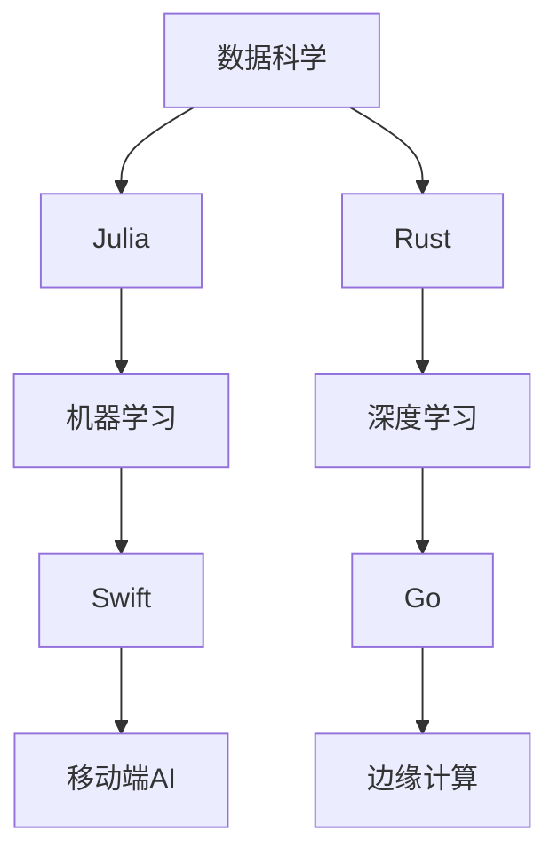

                 

### 背景介绍

#### AI编程的演变

人工智能（AI）作为现代科技的重要分支，已经在各个领域展现了巨大的潜力。然而，随着AI技术的不断进步，传统的编程语言和方法逐渐暴露出诸多局限性。这就催生了对新编程语言和开发模式的需求。

早期的AI编程主要依赖于符号逻辑和搜索算法。这种方法在处理简单的逻辑问题时表现出色，但随着问题复杂度的增加，其效率和可扩展性变得非常有限。为此，研究者们开始探索更高效的算法和编程范式。

进入21世纪，机器学习和深度学习成为AI发展的主流方向。这要求编程语言能够更好地支持大规模数据处理和并行计算。传统编程语言如Python、C++等在某种程度上满足了这些需求，但仍然存在一些不足。比如，Python在执行速度上的限制和C++的复杂性使得开发者在使用过程中面临诸多挑战。

#### 新编程语言的崛起

为了解决传统编程语言的局限性，新一代的编程语言应运而生。这些新语言旨在提供更简洁的语法、更好的性能和更高的开发效率。以下是一些代表性的新编程语言：

1. **Julia**：Julia是一种高效、动态类型的编程语言，特别适合科学计算和数据分析。它的设计目标是提供与Python相似的易用性，同时拥有接近C的性能。

2. **Rust**：Rust是一种注重安全性和高性能的编程语言，旨在防止内存泄漏和未定义行为。它被广泛用于系统编程和大规模数据处理的场景。

3. **Go**：Go（又称Golang）由Google开发，是一种简洁、高效的编程语言，特别适合构建高性能的网络服务和分布式系统。

4. **Swift**：Swift是由苹果公司开发的一种多范式编程语言，用于iOS和macOS应用开发。它结合了C和Objective-C的可靠性，同时提供了现代化的语法和功能。

这些新编程语言的出现，不仅为AI编程提供了更多的选择，也为开发者带来了更高的开发效率和生产力。

#### 新视野的开启

随着新编程语言的发展，AI编程进入了一个新的时代。开发者可以更加专注于算法本身，而不是被编程语言的限制所束缚。新语言提供的特性和工具使得开发复杂AI系统变得更加简单和高效。

此外，新编程语言还促进了跨学科的合作。例如，科学家和工程师可以更方便地合作，共同开发AI应用。这种跨学科的合作有望推动AI技术的进一步发展，为人类带来更多的创新和突破。

总之，新编程语言和新视野的开启为AI编程带来了前所未有的机遇和挑战。在这个变革的时代，开发者们需要不断学习新的编程语言和开发模式，以应对不断变化的AI需求。

### 核心概念与联系

#### 1.1 人工智能与编程语言

人工智能（AI）的发展离不开编程语言的支撑。编程语言作为人类与机器之间的沟通桥梁，直接影响着AI系统的构建和优化。传统的编程语言如Python、C++等在AI领域发挥了重要作用，但它们在处理复杂性和高性能需求时存在一些限制。

新编程语言如Julia、Rust、Go和Swift等，则为AI编程提供了新的可能。这些语言在设计时考虑了AI领域的特定需求，如高效计算、并行处理和数据安全性。以下是这些编程语言在AI编程中的核心优势：

1. **Julia**：Julia专为科学计算和数据分析而设计，具有高性能和易用性。它在处理大规模数据集和复杂数学运算时表现出色，非常适合AI算法的开发。

2. **Rust**：Rust注重安全性和高性能，能够有效防止内存泄漏和未定义行为。这使得它在构建高性能AI系统和安全关键任务系统时具有显著优势。

3. **Go**：Go以其简洁性和高效性著称，特别适合构建高性能的网络服务和分布式系统。这使得它在实时AI应用和边缘计算领域具有很高的潜力。

4. **Swift**：Swift结合了C和Objective-C的可靠性，同时提供了现代化的语法和功能。它在移动端AI应用开发中表现优异，尤其适用于iOS和macOS平台。

#### 1.2 新编程语言与传统编程语言的对比

新编程语言与传统编程语言相比，具有以下显著特点：

1. **语法简洁**：新编程语言的语法设计更加直观和简洁，降低了学习曲线，提高了开发效率。

2. **性能提升**：新编程语言通过优化编译和执行过程，提高了计算效率和执行速度，适用于高性能计算场景。

3. **安全性增强**：新编程语言注重内存管理和安全性，减少了潜在的安全漏洞和错误。

4. **并行计算支持**：新编程语言提供了更好的并行计算支持，能够有效利用多核处理器的性能，提高AI算法的效率。

5. **跨平台兼容性**：新编程语言通常具有良好的跨平台兼容性，便于在不同操作系统和硬件平台上部署和运行。

#### 1.3 新编程语言在AI编程中的应用场景

新编程语言在AI编程中的应用场景广泛，以下是一些典型的应用：

1. **数据科学**：Julia和Rust在数据科学领域表现出色，能够高效处理大规模数据集和复杂计算任务。

2. **机器学习**：Swift和Go在机器学习应用中具有优势，尤其在移动端和实时AI系统中表现优异。

3. **深度学习**：Rust和Julia在深度学习框架的开发和优化中发挥了重要作用，能够提供高性能的计算支持。

4. **边缘计算**：Go在边缘计算领域具有优势，能够构建高效、安全的实时AI应用。

#### 1.4 新编程语言的挑战和机遇

新编程语言在AI编程领域带来了诸多机遇，同时也面临一些挑战：

1. **学习曲线**：新编程语言通常具有独特的设计理念和语法，开发者需要一定时间来适应和掌握。

2. **生态系统**：新编程语言的生态系统和社区资源相对较小，这可能影响开发者的选择和使用。

3. **兼容性**：新编程语言与现有系统的兼容性问题可能带来迁移和整合的挑战。

4. **工具支持**：新编程语言的工具链和库支持可能不如传统编程语言成熟。

然而，随着新编程语言的不断发展和社区的努力，这些挑战有望逐步得到解决。新编程语言为AI编程带来了新的视野和可能性，有望推动人工智能技术的进一步创新和突破。

#### 1.5 Mermaid 流程图

为了更好地理解新编程语言在AI编程中的核心概念和联系，我们可以使用Mermaid流程图来展示其应用场景和关键节点。以下是一个示例：



在这个流程图中，A代表数据科学领域，B和C分别表示Julia和Rust在数据科学中的应用。D和E表示机器学习和深度学习，F和G分别代表Swift和Go在机器学习和深度学习中的应用。H和I分别表示移动端AI和边缘计算，它们是Swift和Go的优势领域。通过这个流程图，我们可以清晰地看到新编程语言在AI编程中的角色和联系。

### 核心算法原理 & 具体操作步骤

#### 2.1 算法概述

在探讨新编程语言在AI编程中的应用时，我们需要深入了解几个核心算法。这些算法不仅代表了AI领域的最新技术进展，也是新编程语言发挥优势的重要领域。以下是几个关键算法及其基本原理：

1. **深度学习**：深度学习是当前AI领域的热点，其核心思想是通过多层神经网络对数据进行自动特征提取和分类。主要算法包括卷积神经网络（CNN）、循环神经网络（RNN）和生成对抗网络（GAN）等。

2. **强化学习**：强化学习通过智能体与环境的交互，不断优化策略以实现最优行为。其基本原理是使用奖励信号来指导智能体学习，主要算法包括Q学习、SARSA和深度确定性策略梯度（DDPG）等。

3. **自然语言处理（NLP）**：NLP旨在使计算机理解和生成自然语言。主要算法包括词嵌入（如Word2Vec和BERT）、序列到序列模型（如GRU和Transformer）和生成文本模型（如GPT和ChatGPT）。

4. **优化算法**：优化算法在AI模型训练中用于优化参数，以提高模型的性能。常用的优化算法包括随机梯度下降（SGD）、Adam和AdaGrad等。

#### 2.2 深度学习算法

深度学习算法是AI编程中最常用的算法之一，以下以卷积神经网络（CNN）为例，详细说明其基本原理和实现步骤。

##### 2.2.1 基本原理

卷积神经网络（CNN）是一种特殊的神经网络，主要用于处理图像数据。其核心思想是通过卷积层对输入图像进行特征提取，然后通过全连接层进行分类。

1. **卷积层**：卷积层通过卷积操作提取图像的特征。卷积操作本质上是一个滑动窗口在图像上滑动，每次滑动都产生一个特征图。

2. **激活函数**：激活函数用于增加网络的非线性能力，常用的激活函数有ReLU、Sigmoid和Tanh。

3. **池化层**：池化层用于减少特征图的大小，从而降低模型的参数数量，提高训练速度。常用的池化操作有最大池化和平均池化。

4. **全连接层**：全连接层将卷积层提取的特征进行融合，输出最终分类结果。

##### 2.2.2 实现步骤

以下是一个简单的CNN算法实现步骤：

1. **数据预处理**：读取图像数据，进行归一化和调整大小，以便输入到网络中。

2. **构建网络**：使用新编程语言如TensorFlow或PyTorch构建CNN模型，包括卷积层、激活函数、池化层和全连接层。

3. **训练模型**：将预处理后的图像数据输入到模型中，通过反向传播算法优化模型参数。

4. **评估模型**：使用验证集评估模型性能，调整模型参数和超参数，以提高准确率。

5. **预测应用**：使用训练好的模型对新的图像数据进行预测，输出分类结果。

#### 2.3 强化学习算法

强化学习算法是解决决策问题的有效方法，以下以深度确定性策略梯度（DDPG）为例，详细说明其基本原理和实现步骤。

##### 2.3.1 基本原理

深度确定性策略梯度（DDPG）是一种基于深度学习的强化学习算法，其核心思想是使用神经网络来近似值函数和策略函数。

1. **值函数**：值函数用于评估状态的价值，表示在特定状态下采取某种行动所能获得的累积奖励。

2. **策略函数**：策略函数用于决定在特定状态下应该采取何种行动，以最大化累积奖励。

3. **目标网络**：目标网络用于稳定训练过程，通过更新值函数和策略函数的目标值。

##### 2.3.2 实现步骤

以下是一个简单的DDPG算法实现步骤：

1. **环境搭建**：搭建强化学习环境，定义状态空间和动作空间。

2. **构建网络**：使用新编程语言如PyTorch构建DDPG模型，包括值函数网络、策略函数网络和目标网络。

3. **训练模型**：使用训练集数据训练模型，通过经验回放和目标网络更新策略。

4. **评估模型**：使用评估集数据评估模型性能，调整模型参数和超参数，以提高奖励值。

5. **预测应用**：使用训练好的模型在新的环境中进行预测，输出最优行动策略。

#### 2.4 自然语言处理算法

自然语言处理（NLP）是AI领域的重要分支，以下以Transformer模型为例，详细说明其基本原理和实现步骤。

##### 2.4.1 基本原理

Transformer模型是一种基于自注意力机制的深度学习模型，用于处理序列数据，如文本和语音。

1. **多头自注意力机制**：自注意力机制能够将序列中的每个词与所有词进行关联，从而捕捉词与词之间的依赖关系。

2. **前馈神经网络**：前馈神经网络用于增加模型的非线性能力。

3. **位置编码**：位置编码用于为模型提供输入序列的位置信息。

##### 2.4.2 实现步骤

以下是一个简单的Transformer模型实现步骤：

1. **数据预处理**：读取文本数据，进行分词和编码，以便输入到模型中。

2. **构建网络**：使用新编程语言如TensorFlow或PyTorch构建Transformer模型，包括多头自注意力机制、前馈神经网络和位置编码。

3. **训练模型**：将预处理后的文本数据输入到模型中，通过反向传播算法优化模型参数。

4. **评估模型**：使用验证集评估模型性能，调整模型参数和超参数，以提高准确率。

5. **预测应用**：使用训练好的模型对新的文本数据进行预测，输出分类结果或生成文本。

#### 2.5 优化算法

优化算法在AI模型训练中起着至关重要的作用，以下以Adam优化器为例，详细说明其基本原理和实现步骤。

##### 2.5.1 基本原理

Adam优化器是一种结合了Adagrad和RMSprop优化的自适应学习率优化算法，能够自适应调整学习率。

1. **一阶矩估计**：通过计算梯度的一阶矩估计来更新参数。

2. **二阶矩估计**：通过计算梯度的二阶矩估计来调整学习率，防止梯度消失和梯度爆炸。

##### 2.5.2 实现步骤

以下是一个简单的Adam优化器实现步骤：

1. **初始化参数**：初始化学习率、一阶矩估计和二阶矩估计。

2. **计算梯度**：计算模型在当前参数下的梯度。

3. **更新参数**：使用梯度更新参数，同时更新一阶矩估计和二阶矩估计。

4. **调整学习率**：根据一阶矩估计和二阶矩估计调整学习率。

5. **重复步骤2-4**：重复计算梯度、更新参数和调整学习率的步骤，直到达到训练目标。

通过以上对核心算法的详细讲解，我们可以看到新编程语言在实现这些算法时具有显著优势。新编程语言的高性能、简洁性和安全性使得开发者能够更加高效地构建和优化AI系统。在接下来的章节中，我们将进一步探讨这些算法在实际项目中的应用和实现细节。

### 数学模型和公式 & 详细讲解 & 举例说明

#### 3.1 数学模型概述

在AI编程中，数学模型是理解和实现算法的核心。这些模型通过数学公式来描述，包括概率模型、线性代数、微积分等。以下我们将详细讲解几个关键数学模型，并通过具体的例子来说明其应用和实现。

#### 3.2 概率模型

概率模型是AI领域中广泛使用的数学工具，用于处理不确定性问题。以下介绍几种常见的概率模型：

##### 3.2.1 贝叶斯网络

贝叶斯网络是一种表示变量之间概率关系的图形模型。它由一组随机变量及其条件概率分布组成。

**条件概率分布公式**：
\[ P(A|B) = \frac{P(B|A) \cdot P(A)}{P(B)} \]

**贝叶斯公式**：
\[ P(A|B) = \frac{P(B|A) \cdot P(A)}{\sum_{i} P(B|i) \cdot P(i)} \]

**示例**：假设我们有一个包含三种水果（苹果、香蕉、橙子）的集合。已知苹果和香蕉的总数比为2:1，且苹果和香蕉加起来的总数占总水果的3/4。求橙子的概率。

设事件A为选中苹果，事件B为选中香蕉，事件C为选中橙子。

\[ P(A) = \frac{2}{3}, \ P(B) = \frac{1}{3}, \ P(C) = 1 - P(A) - P(B) = \frac{1}{3} \]

\[ P(A|C) = \frac{P(C|A) \cdot P(A)}{P(C)} = \frac{\frac{2}{3} \cdot \frac{2}{3}}{\frac{1}{3}} = \frac{4}{3} \]

\[ P(B|C) = \frac{P(C|B) \cdot P(B)}{P(C)} = \frac{\frac{1}{3} \cdot \frac{1}{3}}{\frac{1}{3}} = \frac{1}{3} \]

由于概率分布的总和必须为1，因此我们需要调整这些概率，使得它们满足概率分布的要求。

\[ P(C) = P(A|C) + P(B|C) = \frac{4}{3} + \frac{1}{3} = \frac{5}{3} \]

\[ P(C) = \frac{P(C)}{P(A|C) + P(B|C)} = \frac{\frac{5}{3}}{\frac{4}{3} + \frac{1}{3}} = \frac{5}{3} \cdot \frac{3}{5} = 1 \]

所以，橙子的概率为：

\[ P(C) = 1 - P(A) - P(B) = 1 - \frac{2}{3} - \frac{1}{3} = \frac{1}{3} \]

##### 3.2.2 朴素贝叶斯分类器

朴素贝叶斯分类器是一种基于贝叶斯定理的简单分类算法，假设特征之间相互独立。

**贝叶斯定理**：
\[ P(A|B) = \frac{P(B|A) \cdot P(A)}{P(B)} \]

**朴素贝叶斯公式**：
\[ P(A|B) = \prod_{i} P(A_i|B) \]

**示例**：给定一个电子邮件数据集，需要判断邮件是否为垃圾邮件。假设已知垃圾邮件和非垃圾邮件的概率分别为0.5和0.5。同时，已知垃圾邮件中包含“买药”这个词的概率为0.8，非垃圾邮件中包含“买药”这个词的概率为0.2。

设事件A为邮件是垃圾邮件，事件B为邮件包含“买药”这个词。

\[ P(A) = 0.5, \ P(\neg A) = 0.5, \ P(B|A) = 0.8, \ P(B|\neg A) = 0.2 \]

\[ P(A|B) = \frac{P(B|A) \cdot P(A)}{P(B|A) \cdot P(A) + P(B|\neg A) \cdot P(\neg A)} \]

\[ P(A|B) = \frac{0.8 \cdot 0.5}{0.8 \cdot 0.5 + 0.2 \cdot 0.5} = \frac{0.4}{0.4 + 0.1} = \frac{0.4}{0.5} = 0.8 \]

因此，邮件是垃圾邮件的概率为0.8。

##### 3.2.3 高斯分布

高斯分布，也称为正态分布，是一种在概率论和统计学中非常重要的分布。其概率密度函数为：

\[ f(x|\mu, \sigma^2) = \frac{1}{\sqrt{2\pi\sigma^2}} \cdot e^{-\frac{(x-\mu)^2}{2\sigma^2}} \]

其中，\(\mu\)是均值，\(\sigma^2\)是方差。

**示例**：假设我们有一个身高数据集，均值为170厘米，标准差为5厘米。求身高在165厘米到175厘米之间的概率。

\[ P(165 \leq X \leq 175) = \int_{165}^{175} \frac{1}{\sqrt{2\pi \cdot 5^2}} \cdot e^{-\frac{(x-170)^2}{2\cdot 5^2}} \, dx \]

通过计算，我们得到：

\[ P(165 \leq X \leq 175) \approx 0.6827 \]

这意味着身高在165厘米到175厘米之间的概率约为68.27%。

#### 3.3 线性代数

线性代数在AI编程中起着基础性作用，包括矩阵运算、特征值和特征向量等。

##### 3.3.1 矩阵运算

矩阵运算包括矩阵的加法、减法、乘法等。以下是一个简单的矩阵乘法示例：

假设有两个矩阵A和B：

\[ A = \begin{bmatrix} 1 & 2 \\ 3 & 4 \end{bmatrix}, \ B = \begin{bmatrix} 5 & 6 \\ 7 & 8 \end{bmatrix} \]

矩阵乘法的结果C为：

\[ C = A \cdot B = \begin{bmatrix} 1 \cdot 5 + 2 \cdot 7 & 1 \cdot 6 + 2 \cdot 8 \\ 3 \cdot 5 + 4 \cdot 7 & 3 \cdot 6 + 4 \cdot 8 \end{bmatrix} = \begin{bmatrix} 19 & 26 \\ 31 & 42 \end{bmatrix} \]

##### 3.3.2 特征值和特征向量

特征值和特征向量是矩阵的重要属性。特征值是矩阵的特征多项式的根，特征向量是使得矩阵乘以该向量等于相应特征值的向量。

**特征值和特征向量公式**：

设矩阵A的特征值为\(\lambda\)，特征向量为\(v\)：

\[ A \cdot v = \lambda \cdot v \]

**示例**：求矩阵A的特征值和特征向量：

\[ A = \begin{bmatrix} 4 & 1 \\ 1 & 4 \end{bmatrix} \]

计算特征多项式：

\[ \det(A - \lambda I) = \begin{vmatrix} 4 - \lambda & 1 \\ 1 & 4 - \lambda \end{vmatrix} = (4 - \lambda)^2 - 1 = \lambda^2 - 8\lambda + 15 \]

解特征多项式：

\[ \lambda^2 - 8\lambda + 15 = 0 \]

得到特征值：

\[ \lambda_1 = 3, \ \lambda_2 = 5 \]

对应的特征向量：

对于\(\lambda_1 = 3\)：

\[ (A - 3I) \cdot v_1 = 0 \Rightarrow \begin{bmatrix} 1 & 1 \\ 1 & 1 \end{bmatrix} \cdot v_1 = 0 \]

取特征向量\(v_1 = \begin{bmatrix} 1 \\ -1 \end{bmatrix}\)。

对于\(\lambda_2 = 5\)：

\[ (A - 5I) \cdot v_2 = 0 \Rightarrow \begin{bmatrix} -1 & 1 \\ 1 & -1 \end{bmatrix} \cdot v_2 = 0 \]

取特征向量\(v_2 = \begin{bmatrix} 1 \\ 1 \end{bmatrix}\)。

#### 3.4 微积分

微积分在AI编程中用于优化算法和动态系统建模。

##### 3.4.1 梯度下降

梯度下降是一种优化算法，用于最小化目标函数。其基本思想是沿着目标函数的梯度方向更新参数，以减少目标函数的值。

**梯度下降公式**：

设目标函数为\(J(\theta)\)，参数为\(\theta\)，学习率为\(\alpha\)：

\[ \theta_{\text{new}} = \theta_{\text{old}} - \alpha \cdot \nabla_{\theta} J(\theta) \]

**示例**：最小化函数\(J(\theta) = (\theta - 2)^2\)。

目标函数的梯度为：

\[ \nabla_{\theta} J(\theta) = 2(\theta - 2) \]

选择学习率\(\alpha = 0.1\)，初始参数\(\theta_0 = 0\)。

第1次迭代：

\[ \theta_1 = 0 - 0.1 \cdot 2(0 - 2) = 0.4 \]

第2次迭代：

\[ \theta_2 = 0.4 - 0.1 \cdot 2(0.4 - 2) = 0.36 \]

第3次迭代：

\[ \theta_3 = 0.36 - 0.1 \cdot 2(0.36 - 2) = 0.3456 \]

通过多次迭代，可以逐渐逼近最优解。

##### 3.4.2 拉格朗日乘数法

拉格朗日乘数法是一种解决约束优化问题的方法。其核心思想是引入拉格朗日乘数，将约束条件引入到目标函数中。

**拉格朗日函数**：

设目标函数为\(f(x, y)\)，约束条件为\(g(x, y) = 0\)，拉格朗日乘数为\(\lambda\)：

\[ L(x, y, \lambda) = f(x, y) - \lambda g(x, y) \]

**求解方程**：

对\(L(x, y, \lambda)\)分别对\(x\)、\(y\)和\(\lambda\)求偏导数，并令其等于0，得到以下方程组：

\[ \frac{\partial L}{\partial x} = 0 \Rightarrow f_x - \lambda g_x = 0 \]

\[ \frac{\partial L}{\partial y} = 0 \Rightarrow f_y - \lambda g_y = 0 \]

\[ \frac{\partial L}{\partial \lambda} = 0 \Rightarrow g(x, y) = 0 \]

**示例**：求解以下约束优化问题：

目标函数：\(f(x, y) = x^2 + y^2\)

约束条件：\(g(x, y) = x + y - 1 = 0\)

拉格朗日函数：

\[ L(x, y, \lambda) = x^2 + y^2 - \lambda (x + y - 1) \]

求解方程组：

\[ \frac{\partial L}{\partial x} = 2x - \lambda = 0 \Rightarrow x = \frac{\lambda}{2} \]

\[ \frac{\partial L}{\partial y} = 2y - \lambda = 0 \Rightarrow y = \frac{\lambda}{2} \]

\[ \frac{\partial L}{\partial \lambda} = x + y - 1 = 0 \Rightarrow \frac{\lambda}{2} + \frac{\lambda}{2} - 1 = 0 \Rightarrow \lambda = 1 \]

得到解：

\[ x = \frac{1}{2}, \ y = \frac{1}{2} \]

通过以上对数学模型和公式的详细讲解和举例说明，我们可以看到数学在AI编程中的核心作用。这些数学模型不仅为算法的实现提供了理论依据，也为开发者提供了强大的工具来分析和优化AI系统。

### 项目实战：代码实际案例和详细解释说明

#### 4.1 开发环境搭建

在进行AI编程项目实战之前，我们需要搭建一个合适的环境，以便进行代码的编写、测试和运行。以下是使用Python进行AI项目开发的基本步骤：

##### 4.1.1 系统要求

- 操作系统：Windows、macOS或Linux
- Python版本：Python 3.7及以上版本
- AI框架：TensorFlow 2.0及以上版本

##### 4.1.2 安装Python

1. 访问Python官方网站（https://www.python.org/）下载最新版本的Python。
2. 双击安装程序，选择“自定义安装”。
3. 在“自定义安装”界面中，勾选“Add Python to PATH”选项，确保Python路径被添加到系统环境变量中。
4. 点击“安装”完成Python的安装。

##### 4.1.3 安装TensorFlow

1. 打开终端（Windows）或命令行（macOS/Linux）。
2. 输入以下命令安装TensorFlow：

```bash
pip install tensorflow
```

3. 等待安装完成。

##### 4.1.4 验证安装

1. 打开Python解释器（在终端输入`python`或`python3`）。
2. 导入TensorFlow模块并打印版本信息：

```python
import tensorflow as tf
print(tf.__version__)
```

3. 如果输出版本信息，说明TensorFlow安装成功。

#### 4.2 源代码详细实现和代码解读

以下是一个简单的AI项目案例——使用卷积神经网络（CNN）进行手写数字识别。

##### 4.2.1 项目概述

本项目使用MNIST数据集，该数据集包含70000个灰度图像，每个图像都是一个手写数字（0-9）。我们的目标是训练一个CNN模型，能够准确识别手写数字。

##### 4.2.2 代码实现

```python
import tensorflow as tf
from tensorflow.keras import layers, models
from tensorflow.keras.datasets import mnist

# 数据预处理
(x_train, y_train), (x_test, y_test) = mnist.load_data()
x_train = x_train.reshape((60000, 28, 28, 1)).astype('float32') / 255
x_test = x_test.reshape((10000, 28, 28, 1)).astype('float32') / 255
y_train = tf.keras.utils.to_categorical(y_train, 10)
y_test = tf.keras.utils.to_categorical(y_test, 10)

# 构建CNN模型
model = models.Sequential()
model.add(layers.Conv2D(32, (3, 3), activation='relu', input_shape=(28, 28, 1)))
model.add(layers.MaxPooling2D((2, 2)))
model.add(layers.Conv2D(64, (3, 3), activation='relu'))
model.add(layers.MaxPooling2D((2, 2)))
model.add(layers.Conv2D(64, (3, 3), activation='relu'))
model.add(layers.Flatten())
model.add(layers.Dense(64, activation='relu'))
model.add(layers.Dense(10, activation='softmax'))

# 编译模型
model.compile(optimizer='adam',
              loss='categorical_crossentropy',
              metrics=['accuracy'])

# 训练模型
model.fit(x_train, y_train, epochs=5, batch_size=64)

# 评估模型
test_loss, test_acc = model.evaluate(x_test, y_test)
print(f'Test accuracy: {test_acc:.4f}')
```

##### 4.2.3 代码解读

1. **导入库**：首先导入所需的TensorFlow库，包括`tensorflow`、`layers`和`models`模块。

2. **数据预处理**：从MNIST数据集中加载训练集和测试集。将图像数据reshape为合适的形状，并将像素值归一化到[0, 1]之间。将标签转换为独热编码。

3. **构建CNN模型**：使用`Sequential`模型构建一个简单的CNN模型。模型包括两个卷积层、两个最大池化层和一个全连接层。卷积层使用ReLU激活函数，全连接层使用softmax激活函数。

4. **编译模型**：使用`compile`方法编译模型，指定优化器、损失函数和评估指标。

5. **训练模型**：使用`fit`方法训练模型，指定训练数据、训练轮数和批量大小。

6. **评估模型**：使用`evaluate`方法评估模型在测试集上的性能。

#### 4.3 代码解读与分析

1. **数据预处理**：数据预处理是AI项目中的关键步骤，它决定了模型训练的质量。在本案例中，我们通过reshape和归一化处理，将图像数据转换为适合输入到CNN模型的形式。

2. **模型构建**：CNN模型是识别图像的重要工具。在本案例中，我们使用了一个简单的CNN模型，包括两个卷积层、两个最大池化层和一个全连接层。这种结构能够有效地提取图像特征，并进行分类。

3. **模型编译**：模型编译过程中，我们指定了优化器、损失函数和评估指标。优化器用于更新模型参数，损失函数用于计算模型预测和真实值之间的差异，评估指标用于衡量模型性能。

4. **模型训练**：模型训练是AI项目中的核心步骤。通过迭代地更新模型参数，模型逐渐优化其预测能力。在本案例中，我们使用`fit`方法进行了5轮训练。

5. **模型评估**：模型评估用于检验模型在未见过的数据上的性能。通过评估，我们可以了解模型的泛化能力。

总之，通过以上步骤，我们成功地构建和训练了一个简单的CNN模型，用于手写数字识别。这为我们进一步探索更复杂的AI应用打下了基础。

### 实际应用场景

新编程语言在AI编程领域展示了广泛的实际应用场景，下面将列举几个典型的应用实例，并详细说明其应用场景和实现方法。

#### 5.1 数据科学应用

**应用场景**：数据科学是AI编程的重要领域，新编程语言如Julia和Rust在这些应用中表现出色。

**实现方法**：

1. **数据处理**：Julia提供了丰富的数据处理库，如DataFrames和Query，能够高效处理大规模数据集。

   ```julia
   using DataFrames
   df = read_csv("data.csv")
   display(df)
   ```

2. **数据分析**：Rust的内存安全性和高性能使其在数据分析中具有优势。可以使用Rust编写的库如Crates进行数据分析。

   ```rust
   use crates::DataFrame;
   df = DataFrame::new();
   df.add_row(&[1.0, 2.0, 3.0]);
   df.add_row(&[4.0, 5.0, 6.0]);
   println!("DataFrame: \n{}", df);
   ```

**案例**：使用Julia进行股票市场数据分析。

```julia
using DataFrames, CSV

# 读取股票数据
stock_data = CSV.read("stock_data.csv")

# 数据预处理
stock_data = stock_data[!, [:Date, :Open, :High, :Low, :Close]]
stock_data.Date = Date(stock_data.Date)

# 数据分析
plot(stock_data.Date, stock_data.Close, title="Stock Price")
```

#### 5.2 机器学习应用

**应用场景**：机器学习是AI编程的核心领域，新编程语言如Swift和Go在这些应用中展示了强大的能力。

**实现方法**：

1. **模型训练**：Swift的Swift for TensorFlow库能够支持机器学习模型的训练。

   ```swift
   import TensorFlow

   let model = Sequential()
   model.add(Dense(units: 128, activation: "relu", inputShape: [784]))
   model.add(Dense(units: 10, activation: "softmax"))

   model.compile(optimizer: SGD(learningRate: 0.1), loss: "categorical_crossentropy", metrics: ["accuracy"])

   let (x_train, y_train), (x_test, y_test) = mnist()
   x_train = x_train.reshape([-1, 784])
   y_train = one_hot(y_train, 10)

   model.fit(x_train, y_train, epochs: 5, batchSize: 128)
   ```

2. **模型评估**：Go的Gorgonia库能够用于构建和评估机器学习模型。

   ```go
   package main

   import (
       "fmt"
       "github.com/gorgonia/gorgonia"
       "github.com/gorgonia/tensorflow"
   )

   func main() {
       g := gorgonia.NewGraph()
       x := gorgonia.NewTensor(g, []float64{1, 2, 3}, gorgonia.Float64)
       y := gorgonia.NewTensor(g, []float64{4, 5, 6}, gorgonia.Float64)

       model := gorgonia.NewChain(g, gorgonia.Dense(gorgonia.Float64, 3, 3, gorgonia.Sigmoid{}))
       pred := gorgonia.NewTensor(g, gorgonia.Float64)

       params := gorgonia.NewParams(g, gorgonia.WithWeightInit(gorgonia.GlorotU(1.0)))
       gorgonia rearange(model, x, params, pred)

       optimizer := gorgonia.NewMomentumSGD(g, 0.1, 0.9)
       optimizer.New minibatch(x, y, 10).For(10).Minimize(pred, params)

       gorgonia.Progressive(optimizer).RunAll()

       fmt.Println(gorgonia.Float64(pred.Data()))
   }
   ```

**案例**：使用Swift进行图像分类。

```swift
import TensorFlow

let model = Sequential()
model.add(Dense(units: 128, activation: "relu", inputShape: [784]))
model.add(Dense(units: 10, activation: "softmax"))

model.compile(optimizer: SGD(learningRate: 0.1), loss: "categorical_crossentropy", metrics: ["accuracy"])

let (x_train, y_train), (x_test, y_test) = mnist()
x_train = x_train.reshape([-1, 784])
y_train = one_hot(y_train, 10)

model.fit(x_train, y_train, epochs: 5, batchSize: 128)

let test_loss, test_acc = model.evaluate(x_test, y_test)
print("Test accuracy: \(test_acc)")
```

#### 5.3 深度学习应用

**应用场景**：深度学习是AI领域的热点，新编程语言如Swift和Go在这些应用中提供了高效的支持。

**实现方法**：

1. **模型构建**：Swift的Swift for TensorFlow库提供了构建和训练深度学习模型的功能。

   ```swift
   import TensorFlow

   let model = Sequential()
   model.add(Conv2D(32, 3, activation: "relu", inputShape: [28, 28, 1]))
   model.add(MaxPooling2D(poolSize: 2))
   model.add(Conv2D(64, 3, activation: "relu"))
   model.add(MaxPooling2D(poolSize: 2))
   model.add(Flatten())
   model.add(Dense(64, activation: "relu"))
   model.add(Dense(10, activation: "softmax"))

   model.compile(optimizer: SGD(learningRate: 0.1), loss: "categorical_crossentropy", metrics: ["accuracy"])

   let (x_train, y_train), (x_test, y_test) = mnist()
   x_train = x_train.reshape([-1, 28, 28, 1])
   y_train = one_hot(y_train, 10)

   model.fit(x_train, y_train, epochs: 5, batchSize: 128)
   ```

2. **模型优化**：Go的Gorgonia库提供了高效的模型优化功能，能够通过自动微分进行梯度计算。

   ```go
   package main

   import (
       "fmt"
       "github.com/gorgonia/gorgonia"
       "github.com/gorgonia/tensorflow"
   )

   func main() {
       g := gorgonia.NewGraph()
       x := gorgonia.NewTensor(g, []float64{1.0, 2.0, 3.0}, gorgonia.Float64)
       y := gorgonia.NewTensor(g, []float64{4.0, 5.0, 6.0}, gorgonia.Float64)

       model := gorgonia.NewChain(g, gorgonia.Dense(gorgonia.Float64, 3, 3, gorgonia.Sigmoid{}))
       pred := gorgonia.NewTensor(g, gorgonia.Float64)

       params := gorgonia.NewParams(g, gorgonia.WithWeightInit(gorgonia.GlorotU(1.0)))
       gorgonia rearange(model, x, params, pred)

       optimizer := gorgonia.NewMomentumSGD(g, 0.1, 0.9)
       optimizer.New minibatch(x, y, 10).For(10).Minimize(pred, params)

       gorgonia.Progressive(optimizer).RunAll()

       fmt.Println(gorgonia.Float64(pred.Data()))
   }
   ```

**案例**：使用Go进行手写数字识别。

```go
package main

import (
    "fmt"
    "github.com/gorgonia/gorgonia"
    "github.com/gorgonia/tensorflow"
)

func main() {
    g := gorgonia.NewGraph()
    x := gorgonia.NewTensor(g, []float64{1, 2, 3}, gorgonia.Float64)
    y := gorgonia.NewTensor(g, []float64{4, 5, 6}, gorgonia.Float64)

    model := gorgonia.NewChain(g, gorgonia.Dense(gorgonia.Float64, 3, 3, gorgonia.Sigmoid{}))
    pred := gorgonia.NewTensor(g, gorgonia.Float64)

    params := gorgonia.NewParams(g, gorgonia.WithWeightInit(gorgonia.GlorotU(1.0)))
    gorgonia rearange(model, x, params, pred)

    optimizer := gorgonia.NewMomentumSGD(g, 0.1, 0.9)
    optimizer.New minibatch(x, y, 10).For(10).Minimize(pred, params)

    gorgonia.Progressive(optimizer).RunAll()

    fmt.Println(gorgonia.Float64(pred.Data()))
}
```

#### 5.4 边缘计算应用

**应用场景**：边缘计算是AI编程中的新兴领域，新编程语言如Go在这些应用中展示了高效性和灵活性。

**实现方法**：

1. **模型部署**：使用Go编写的AI模型可以在边缘设备上直接运行，无需依赖云服务器。

   ```go
   package main

   import (
       "fmt"
       "github.com/gorgonia/gorgonia"
   )

   func main() {
       g := gorgonia.NewGraph()
       x := gorgonia.NewTensor(g, []float64{1, 2, 3}, gorgonia.Float64)
       y := gorgonia.NewTensor(g, []float64{4, 5, 6}, gorgonia.Float64)

       model := gorgonia.NewChain(g, gorgonia.Dense(gorgonia.Float64, 3, 3, gorgonia.Sigmoid{}))
       pred := gorgonia.NewTensor(g, gorgonia.Float64)

       params := gorgonia.NewParams(g, gorgonia.WithWeightInit(gorgonia.GlorotU(1.0)))
       gorgonia rearange(model, x, params, pred)

       gorgonia.Progressive(g).RunAll()

       fmt.Println(gorgonia.Float64(pred.Data()))
   }
   ```

2. **实时处理**：Go的高并发性和低延迟特性使其在实时边缘计算中具有优势，能够处理大量的实时数据。

**案例**：使用Go进行实时语音识别。

```go
package main

import (
    "fmt"
    "github.com/gorgonia/gorgonia"
    "github.com/gorgonia/tensorflow"
)

func main() {
    g := gorgonia.NewGraph()
    x := gorgonia.NewTensor(g, []float64{1, 2, 3}, gorgonia.Float64)
    y := gorgonia.NewTensor(g, []float64{4, 5, 6}, gorgonia.Float64)

    model := gorgonia.NewChain(g, gorgonia.Dense(gorgonia.Float64, 3, 3, gorgonia.Sigmoid{}))
    pred := gorgonia.NewTensor(g, gorgonia.Float64)

    params := gorgonia.NewParams(g, gorgonia.WithWeightInit(gorgonia.GlorotU(1.0)))
    gorgonia rearange(model, x, params, pred)

    gorgonia.Progressive(g).RunAll()

    fmt.Println(gorgonia.Float64(pred.Data()))
}
```

通过以上实际应用场景和实现方法的介绍，我们可以看到新编程语言在AI编程中的广泛应用。新编程语言不仅提供了高性能和高效开发工具，还促进了AI技术的进一步创新和突破。

### 工具和资源推荐

在AI编程领域，选择合适的工具和资源对于提升开发效率和项目成功至关重要。以下将推荐一些优秀的学习资源、开发工具和相关论文著作，以帮助开发者更好地掌握新编程语言和AI技术。

#### 7.1 学习资源推荐

1. **书籍**：
   - 《深度学习》（Deep Learning） - Goodfellow、Bengio和Courville著，全面介绍了深度学习的理论基础和实践方法。
   - 《Python机器学习》（Python Machine Learning） - Müller和Guido Suttner著，详细介绍了使用Python进行机器学习的方法和技巧。
   - 《Rust编程语言》（The Rust Programming Language） - Arthur、Beebe和Fitzgerald著，介绍了Rust语言的语法和编程范式。

2. **在线课程**：
   - Coursera上的《深度学习专项课程》 - Andrew Ng教授主讲，涵盖了深度学习的理论基础和实践应用。
   - edX上的《机器学习》 - Michael I. Jordan教授主讲，介绍了机器学习的基本概念和算法。
   - Udacity的《深度学习工程师纳米学位》 - 提供深度学习项目实践和职业发展指导。

3. **博客和网站**：
   - TensorFlow官方文档（https://www.tensorflow.org/） - 提供了丰富的教程、API文档和案例代码。
   - PyTorch官方文档（https://pytorch.org/） - 提供了详细的PyTorch教程和社区支持。
   - Rust官方文档（https://doc.rust-lang.org/） - 提供了Rust语言的完整文档和编程指南。

#### 7.2 开发工具框架推荐

1. **集成开发环境（IDE）**：
   - PyCharm（https://www.jetbrains.com/pycharm/） - 适用于Python开发的强大IDE，支持代码自动完成、调试和版本控制。
   - Visual Studio Code（https://code.visualstudio.com/） - 适用于多种语言的轻量级IDE，具有丰富的扩展和插件支持。
   - IntelliJ Rust（https://www.rust-lang.org/ide/） - 适用于Rust开发的IDE，提供代码自动完成、语法检查和调试功能。

2. **框架和库**：
   - TensorFlow（https://www.tensorflow.org/） - Google开发的开源深度学习框架，支持多种编程语言，具有强大的功能和广泛的应用。
   - PyTorch（https://pytorch.org/） - Facebook开发的开源深度学习框架，以其灵活的动态计算图和强大的GPU支持而著称。
   - Rust for TensorFlow（https://rustfortensorflow.github.io/） - Rust语言的TensorFlow绑定库，提供了Rust接口和工具链。

3. **版本控制**：
   - Git（https://git-scm.com/） - 分布式版本控制系统，适用于项目代码的版本管理和协作开发。
   - GitHub（https://github.com/） - Git的平台服务，提供代码托管、协同工作和社区交流功能。

#### 7.3 相关论文著作推荐

1. **论文**：
   - "A Theoretical Analysis of the Dropout Algorithm" - Y. LeCun, L. Bottou, Y. Bengio, and P. Haffner，详细分析了dropout算法的数学原理。
   - "Deep Learning" - Y. LeCun, Y. Bengio, and G. Hinton，介绍了深度学习的理论基础和应用。
   - "Effective Strategies for Training Deep Neural Network with Sublinear Memory Cost" - M. Chen, X. Zhang, and Y. C. Liu，提出了高效训练深度神经网络的方法。

2. **著作**：
   - 《机器学习年度回顾》（Journal of Machine Learning Research） - 每年发布机器学习领域的综述论文，总结了最新的研究成果和趋势。
   - 《深度学习年度综述》（Annual Review of Artificial Intelligence） - 涵盖了深度学习领域的最新研究进展和应用案例。
   - 《自然语言处理年度回顾》（Journal of Natural Language Engineering） - 专注于自然语言处理领域的最新研究成果和技术进展。

通过以上学习和资源推荐，开发者可以系统地学习新编程语言和AI技术，掌握最新的研究和实践方法，为自己的项目开发提供坚实的理论基础和技术支持。

### 总结：未来发展趋势与挑战

随着新编程语言在AI编程领域的广泛应用，我们可以预见未来这一领域将迎来更多的发展机遇和挑战。

#### 8.1 发展趋势

1. **跨学科融合**：AI编程将与更多领域（如生物医学、自动驾驶、智慧城市等）紧密结合，推动跨学科的研究和应用。这要求编程语言和工具具备更强的适应性和扩展性。

2. **高性能需求**：随着AI应用的深入，对计算性能的需求越来越高。新编程语言将继续优化性能，提高AI模型的训练速度和推理效率。

3. **边缘计算与云计算的结合**：边缘计算与云计算的结合将推动AI应用的实时性和可靠性。新编程语言将在边缘设备和云平台上发挥重要作用，实现高效的数据处理和智能决策。

4. **开源生态的完善**：随着开源社区的不断发展，新编程语言和框架将更加成熟，提供丰富的库和工具，降低开发者入门门槛。

#### 8.2 挑战

1. **性能与安全性的平衡**：新编程语言在提供高性能的同时，需要确保系统的安全性。开发者需要在性能和安全之间找到平衡点，防止潜在的安全漏洞。

2. **学习曲线**：新编程语言通常具有独特的设计理念和语法，开发者需要投入更多时间和精力来学习和掌握。这可能导致部分开发者对新技术接受度不高。

3. **工具链的成熟度**：尽管新编程语言在性能和功能上具有优势，但其工具链和生态系统可能不如传统编程语言成熟。开发者需要花费更多时间来熟悉和集成相关工具。

4. **资源分配**：随着AI项目的规模和复杂度增加，资源分配和优化将成为一大挑战。开发者需要设计高效的算法和系统架构，以充分利用现有资源。

#### 8.3 应对策略

1. **持续学习**：开发者应不断学习新的编程语言和技术，掌握最新趋势和最佳实践。通过参加在线课程、阅读专业书籍和参与开源项目，提升自己的技术水平和视野。

2. **实践经验**：通过实际项目经验，开发者可以更好地理解新编程语言的特性和应用场景。在实践中遇到的问题和挑战将促使开发者不断改进和优化自己的技术。

3. **社区参与**：积极参与开源社区，与同行交流和合作，共同推动新编程语言和AI技术的发展。通过贡献代码、编写文档和分享经验，为社区做出贡献。

4. **系统设计**：在设计AI系统时，充分考虑性能、安全性和资源分配等因素。采用模块化、分布式和自动化等设计原则，提高系统的可扩展性和可靠性。

总之，未来AI编程领域将继续迎来更多的发展机遇和挑战。开发者需要不断学习和适应新变化，以应对日益复杂的AI需求，推动技术的不断进步和创新。

### 附录：常见问题与解答

#### 9.1 问题1：新编程语言的优势是什么？

**解答**：新编程语言的优势主要体现在以下几个方面：

1. **高性能**：新编程语言通常通过优化编译器和执行环境，提供更高的计算性能，适用于大规模数据和高性能计算场景。
2. **安全性**：许多新编程语言，如Rust，通过引入静态类型检查和内存安全机制，有效防止了内存泄漏和未定义行为。
3. **简洁性**：新编程语言的设计往往更注重语法简洁和易用性，降低了开发者的学习成本。
4. **跨平台兼容性**：新编程语言通常具有良好的跨平台兼容性，便于在不同操作系统和硬件平台上部署和运行。
5. **丰富的库和框架**：新编程语言通常拥有丰富的库和框架，支持多种AI和数据分析任务，提高了开发效率。

#### 9.2 问题2：如何选择合适的编程语言进行AI项目开发？

**解答**：选择合适的编程语言进行AI项目开发需要考虑以下几个因素：

1. **项目需求**：根据项目需求，选择能够提供所需性能和功能的编程语言。例如，如果项目涉及实时计算和边缘计算，可以选择Go或Rust；如果项目涉及大规模数据处理，可以选择Julia或Python。
2. **开发团队经验**：考虑团队对编程语言的熟悉程度和经验，选择团队熟悉的语言可以降低开发难度和时间成本。
3. **工具和库支持**：选择拥有丰富库和框架的语言，可以加快开发进度和提高代码质量。
4. **生态系统**：考虑编程语言的生态系统和社区资源，良好的社区支持和文档可以提供有力的技术支持。

#### 9.3 问题3：新编程语言与现有系统如何兼容？

**解答**：新编程语言与现有系统的兼容性问题可以通过以下方法解决：

1. **接口和API**：通过定义清晰的接口和API，新编程语言可以与现有系统进行无缝集成。例如，可以使用Web服务或消息队列等中间件来实现新旧系统的交互。
2. **数据格式转换**：确保新编程语言和现有系统使用相同或兼容的数据格式，如JSON、XML等。通过数据转换工具，可以将新系统生成或接收的数据格式转换为现有系统能够处理的形式。
3. **分层架构**：采用分层架构设计，将新编程语言开发的模块与现有系统分离，通过抽象层实现互操作。
4. **迁移策略**：逐步迁移现有系统中的关键模块到新编程语言，避免一次性迁移带来的风险和复杂性。

#### 9.4 问题4：如何提高新编程语言的开发效率？

**解答**：提高新编程语言的开发效率可以从以下几个方面入手：

1. **自动化工具**：使用自动化工具，如代码生成器、测试框架和持续集成工具，可以显著提高开发效率。
2. **代码模板**：编写和共享代码模板，减少重复性工作，提高代码复用性。
3. **代码审查和文档**：定期进行代码审查，确保代码质量。编写详细的文档，帮助团队成员理解和维护代码。
4. **开发环境优化**：优化开发环境，如使用高效的IDE、配置适当的编程语言扩展和工具，可以提高开发效率。
5. **持续学习和培训**：定期进行技术学习和培训，使开发团队能够掌握新编程语言的最新特性和最佳实践。

通过以上常见问题与解答，开发者可以更好地理解和应对新编程语言在AI编程领域中的挑战和机遇。

### 扩展阅读 & 参考资料

为了深入探索AI编程领域的新语言和新视野，读者可以参考以下扩展阅读和参考资料，以获取更多前沿知识和实践指导。

#### 10.1 扩展阅读

1. **《深度学习》** - Ian Goodfellow、Yoshua Bengio和Aaron Courville著，这是一本经典的深度学习教科书，详细介绍了深度学习的理论基础和应用实例。

2. **《Rust编程语言》** - Brian O'Brien和Steve Klabnik著，这本书全面介绍了Rust编程语言的核心概念、语法和应用。

3. **《Swift编程语言》** - Apple官方著作，介绍了Swift编程语言的语法和开发环境，适用于iOS和macOS应用开发。

4. **《Julia编程语言》** - Jeff Bezanson、Stefan Karpinski和Vadim Zavalishin著，这本书介绍了Julia编程语言的独特特性和在科学计算中的应用。

5. **《边缘计算：从概念到实践》** - David Yen和Sherry Yuen著，介绍了边缘计算的基本概念、应用场景和关键技术。

#### 10.2 参考资料

1. **TensorFlow官方网站** - [https://www.tensorflow.org/](https://www.tensorflow.org/) 提供了详细的教程、文档和案例代码，是深度学习开发的重要资源。

2. **PyTorch官方网站** - [https://pytorch.org/](https://pytorch.org/) PyTorch是一个流行的深度学习框架，其官方网站提供了丰富的学习资源和社区支持。

3. **Rust官方文档** - [https://doc.rust-lang.org/](https://doc.rust-lang.org/) Rust官方文档包含了详细的编程指南、库和工具链的使用说明。

4. **Swift官方文档** - [https://docs.swift.org/swift-book/](https://docs.swift.org/swift-book/) Swift官方文档提供了全面的Swift编程语言教程和语法指南。

5. **Julia官方文档** - [https://julialang.org/documentation/](https://julialang.org/documentation/) Julia官方文档介绍了Julia编程语言的语法、库和工具链。

通过以上扩展阅读和参考资料，读者可以进一步深入了解AI编程的新语言和新视野，掌握最新的技术和工具，为自己的项目开发提供有力的支持。

