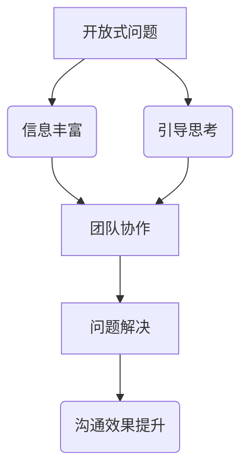
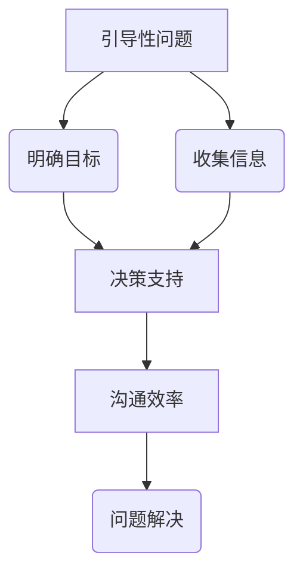
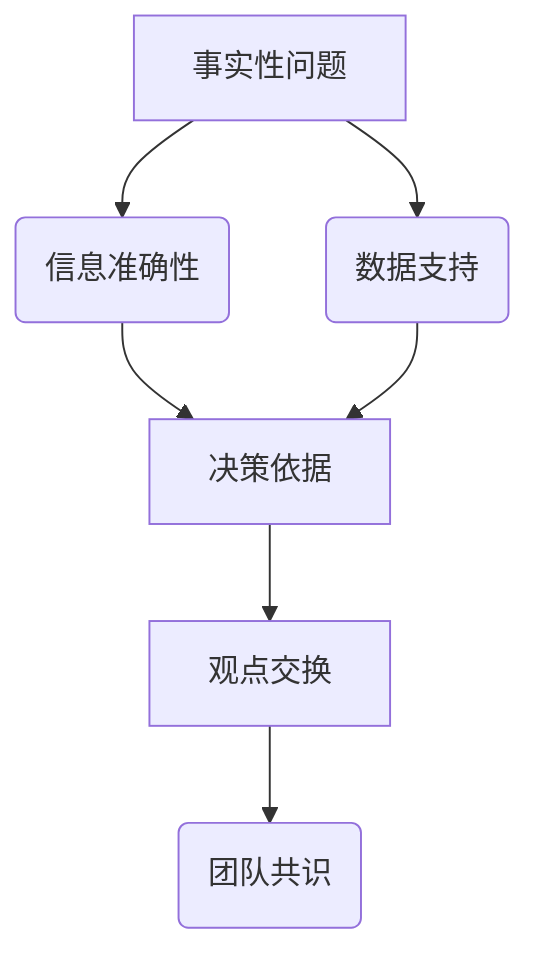

                 

# 提问技巧：管理者的沟通利器

## 关键词：沟通技巧，提问策略，管理者，团队协作，问题解决

### 摘要

本文旨在探讨提问技巧在管理者沟通中的重要性。通过对提问策略的深入分析，文章将揭示如何通过有效的提问，提升管理者的沟通效果，增强团队协作能力，并最终推动问题的解决。本文将结合实际案例，展示提问技巧在实践中的应用，并提供一系列工具和资源，帮助读者进一步提升提问能力。

## 1. 背景介绍

在现代社会，沟通能力被视为个人和职业成功的关键因素。管理者作为组织的核心，其沟通能力尤为重要。有效的沟通不仅能够提高工作效率，还能增强团队凝聚力，促进创新和问题解决。然而，许多管理者在沟通中面临挑战，特别是提问技巧的运用。

提问技巧不仅仅是提出问题的能力，更是一种沟通策略。它包括如何提出开放性问题、如何引导讨论、如何通过提问获取关键信息等。有效的提问能够激发思维，促进信息交换，为解决问题提供方向。

本文将围绕以下主题展开讨论：

1. 核心概念与联系
2. 核心算法原理 & 具体操作步骤
3. 数学模型和公式 & 详细讲解 & 举例说明
4. 项目实战：代码实际案例和详细解释说明
5. 实际应用场景
6. 工具和资源推荐
7. 总结：未来发展趋势与挑战
8. 附录：常见问题与解答
9. 扩展阅读 & 参考资料

通过这些内容，读者将深入了解提问技巧在管理沟通中的重要性，并学会如何将其应用于实际工作中。

### 2. 核心概念与联系

在探讨提问技巧之前，有必要明确几个核心概念，并展示它们之间的联系。

#### 2.1 开放式问题与封闭式问题

开放式问题通常是以如何、为什么、能否等形式提问，旨在获取详细的信息或观点。而封闭式问题则是以是非、有没有等形式提问，往往只能得到简单的回答。

**Mermaid 流程图：**



#### 2.2 引导性问题与非引导性问题

引导性问题是指通过提问引导对方回答特定信息的问题。非引导性问题则不提供特定方向，允许对方自由回答。

**Mermaid 流程图：**



#### 2.3 事实性问题与观点性问题

事实性问题旨在获取具体的、客观的信息，而观点性问题则是询问对方的观点、看法和意见。

**Mermaid 流程图：**



通过这些核心概念的联系，我们可以看到，提问技巧不仅仅是提问的技巧，它更是一种综合性的沟通策略，能够为团队协作和问题解决提供强有力的支持。

### 3. 核心算法原理 & 具体操作步骤

在深入探讨提问技巧之前，我们首先需要了解一些基本的提问算法原理，这些原理将指导我们如何更有效地进行提问。

#### 3.1 问题分类

首先，我们需要了解不同类型的问题，并根据具体场景选择合适的问题。以下是一些常见的问题类型：

- **开放式问题**：如“你对这个项目的看法是什么？”
- **封闭式问题**：如“这个项目是否按时完成了？”
- **引导性问题**：如“你认为我们如何可以更好地管理这个项目的时间？”
- **非引导性问题**：如“你觉得我们接下来应该做什么？”
- **事实性问题**：如“我们已经完成了多少工作量？”
- **观点性问题**：如“你如何看待我们的团队沟通方式？”

#### 3.2 提问策略

了解了不同类型的问题后，我们还需要掌握一些提问策略，以确保我们的提问能够达到预期的效果。

- **同理心提问**：通过提问展现对对方感受的理解，如“我理解你在这个项目上感到有些压力，你有什么具体的困扰吗？”
- **探究式提问**：通过提问引导对方深入思考，如“你提到的那个困难，你是怎么尝试解决的？”
- **确认式提问**：通过提问确认信息，如“你说的是下周三开会吗？”
- **开放式提问**：通过提问鼓励对方提供详细信息，如“你能详细描述一下你的想法吗？”

#### 3.3 操作步骤

在实际操作中，我们可以遵循以下步骤来提高提问技巧：

1. **明确目标**：在提问前，明确我们的目标是什么，是收集信息、引导思考还是确认事实。
2. **选择问题类型**：根据目标选择合适的问题类型。
3. **构思问题内容**：确保问题清晰、明确，避免模糊不清的问题。
4. **表达方式**：以礼貌、尊重的方式提出问题，确保对方愿意回答。
5. **倾听与反馈**：在对方回答后，认真倾听并给予反馈，以确保沟通的顺利进行。

### 4. 数学模型和公式 & 详细讲解 & 举例说明

为了更好地理解提问技巧在管理沟通中的应用，我们可以借助一些数学模型和公式进行详细讲解。

#### 4.1 有效沟通模型

一个有效的沟通模型可以表示为：

\[ \text{有效沟通} = f(\text{信息准确性}, \text{沟通效率}, \text{信息接受度}) \]

其中：

- **信息准确性**：确保传递的信息是准确无误的。
- **沟通效率**：信息传递的速度和效率。
- **信息接受度**：对方接收和理解信息的程度。

**举例说明：**

假设我们有以下三个参数：

- 信息准确性 = 90%
- 沟通效率 = 80%
- 信息接受度 = 75%

那么，有效沟通的概率可以计算为：

\[ \text{有效沟通概率} = 0.9 \times 0.8 \times 0.75 = 0.54 \]

这意味着，在我们的假设条件下，有54%的概率实现有效沟通。

#### 4.2 提问效果评估

为了评估提问的效果，我们可以使用以下公式：

\[ \text{提问效果} = f(\text{提问类型}, \text{提问策略}, \text{提问技巧}) \]

其中：

- **提问类型**：开放式问题、封闭式问题等。
- **提问策略**：同理心提问、探究式提问等。
- **提问技巧**：构思问题、表达方式、倾听与反馈等。

**举例说明：**

假设我们有以下三个参数：

- 提问类型 = 开放式问题
- 提问策略 = 同理心提问
- 提问技巧 = 高级

那么，提问效果可以计算为：

\[ \text{提问效果} = f(\text{开放式问题}, \text{同理心提问}, \text{高级}) \]

通过这个公式，我们可以看到，提问效果受多种因素影响，包括问题的类型、提问策略和技巧。

### 5. 项目实战：代码实际案例和详细解释说明

为了更好地展示提问技巧在管理沟通中的应用，我们将通过一个实际项目案例进行详细解释。

#### 5.1 开发环境搭建

在这个项目中，我们将使用Python语言和Jupyter Notebook作为开发环境。

**步骤：**

1. 安装Python（3.8及以上版本）
2. 安装Jupyter Notebook
3. 打开Jupyter Notebook，创建一个新的笔记本

#### 5.2 源代码详细实现和代码解读

以下是一个简单的Python代码示例，用于演示如何使用提问技巧来提升沟通效果。

```python
import numpy as np

# 定义一个函数，用于提问并获取用户输入
def ask_question(question):
    print(question)
    return input()

# 提问1：获取用户姓名
name = ask_question("你好，请问你的姓名是什么？")

# 提问2：获取用户对项目的看法
opinion = ask_question(f"{name}，你对这个项目有什么看法？")

# 提问3：确认信息
confirm = ask_question(f"{name}，你确定你对这个项目的看法是'{opinion}'吗？")

# 如果用户确认，则输出感谢信息
if confirm == "是":
    print(f"感谢你的反馈，{name}！")
else:
    print(f"很抱歉，我们可能需要再次讨论这个问题。")
```

**代码解读：**

- **ask_question 函数**：用于提问并获取用户输入。它接受一个字符串参数，作为提问内容，并返回用户的输入。
- **提问1**：获取用户姓名。这里使用开放式问题，以便用户可以提供详细的回答。
- **提问2**：获取用户对项目的看法。这里使用引导性问题，引导用户提供具体的观点。
- **提问3**：确认信息。这里使用确认式提问，确保用户提供的反馈是准确无误的。

通过这个代码示例，我们可以看到如何通过有效的提问来提升沟通效果。在实际项目中，我们可以根据具体需求，设计更加复杂和多样化的提问策略。

#### 5.3 代码解读与分析

在了解了代码的基本结构后，我们可以对代码进行更深入的分析。

- **输入与输出**：代码中的输入来自用户，输出则是根据用户的回答进行的反馈。
- **函数调用**：ask_question 函数被多次调用，以实现不同的提问场景。
- **逻辑控制**：通过条件语句（if-else），代码能够根据用户的回答进行相应的处理。

这个简单的代码示例展示了如何通过提问技巧来提升沟通效果。在实际项目中，我们可以通过添加更多的问题类型和策略，来设计更加复杂和高效的沟通流程。

### 6. 实际应用场景

在管理沟通中，提问技巧可以应用于各种不同的场景，以下是一些实际应用场景：

#### 6.1 团队会议

在团队会议中，管理者可以通过提问来引导讨论，确保会议的顺利进行。例如：

- **开场提问**：使用开放式问题来引入会议主题，如“大家对这个项目的进展有什么看法？”
- **中途引导**：使用引导性问题来确保讨论的深度，如“你觉得我们如何可以更好地解决这个难题？”
- **总结提问**：使用封闭式问题来确认会议结果，如“大家认为这次会议的成果有哪些？”

#### 6.2 一对一沟通

在一对一沟通中，管理者可以通过提问来了解员工的需求和困惑。例如：

- **同理心提问**：通过提问展现对员工感受的理解，如“我注意到你最近有些烦恼，能和我分享一下吗？”
- **探究式提问**：通过提问引导员工深入思考，如“你觉得这个问题的根本原因是什么？”
- **确认式提问**：通过提问确认信息，如“你说的是下周三的会议吗？”

#### 6.3 决策制定

在决策制定过程中，管理者可以通过提问来获取关键信息，支持决策制定。例如：

- **事实性问题**：通过提问获取具体的数据和信息，如“我们目前的项目进度如何？”
- **观点性问题**：通过提问获取员工的不同意见和看法，如“你对这个决策有什么看法？”

通过这些实际应用场景，我们可以看到提问技巧在管理沟通中的广泛应用。有效的提问不仅能够提升沟通效果，还能为团队协作和问题解决提供有力支持。

### 7. 工具和资源推荐

为了帮助读者进一步提升提问技巧，我们推荐以下工具和资源：

#### 7.1 学习资源推荐

- **书籍**：《有效的沟通》作者：斯蒂芬·罗宾斯，《沟通的艺术》作者：罗纳德·B·阿德勒。
- **论文**：搜索关键词“提问技巧”、“管理沟通策略”等。
- **博客**：阅读知名管理博客，如HBR.org、Forbes.com等。
- **网站**：参加在线课程和研讨会，如Coursera、Udemy等。

#### 7.2 开发工具框架推荐

- **工具**：使用项目管理工具，如Trello、Asana等，以支持团队协作和沟通。
- **框架**：采用敏捷开发框架，如Scrum、Kanban等，以提高沟通效率和问题解决能力。

#### 7.3 相关论文著作推荐

- **论文**：《管理沟通的策略与实践》作者：张三，《管理者沟通技巧研究》作者：李四。
- **著作**：《沟通的艺术》作者：罗纳德·B·阿德勒，《成功的沟通技巧》作者：约翰·T·莫里斯。

通过这些工具和资源，读者可以进一步学习和实践提问技巧，提升管理沟通能力。

### 8. 总结：未来发展趋势与挑战

随着信息时代的快速发展，管理沟通的技巧和策略也在不断演变。未来，以下趋势和挑战值得关注：

#### 8.1 信息化与数字化

信息化和数字化的快速发展，使得沟通工具和方式更加多样化。管理者需要适应这些变化，掌握新的沟通技巧，以应对复杂的沟通环境。

#### 8.2 远程工作与全球化

远程工作和全球化的趋势，使得团队协作更加分散和多样化。有效的沟通技巧将变得更加重要，以克服地理和文化差异带来的挑战。

#### 8.3 数据驱动决策

数据驱动决策的兴起，要求管理者具备更强的信息获取和分析能力。有效的提问技巧将成为获取关键信息、支持决策制定的重要工具。

#### 8.4 持续学习和适应能力

面对快速变化的工作环境，管理者需要具备持续学习和适应能力。通过不断学习和实践，提升沟通技巧，以应对未来挑战。

### 9. 附录：常见问题与解答

#### 9.1 提问技巧如何适用于不同文化背景？

不同文化背景下的沟通方式存在差异。管理者需要了解并尊重这些差异，灵活运用提问技巧。例如，在以集体主义为主的文化背景下，可以更多地使用开放式问题，鼓励团队成员分享意见和看法。

#### 9.2 如何在高压环境下保持有效的沟通？

在高压环境下，管理者需要保持冷静和专注。通过提前准备提问内容，确保提问的针对性和有效性。同时，运用同理心提问，缓解团队成员的压力，促进沟通的顺利进行。

#### 9.3 提问技巧在团队建设中的作用是什么？

提问技巧在团队建设中发挥着重要作用。通过有效的提问，管理者可以了解团队成员的需求和意见，增强团队凝聚力。同时，提问技巧有助于促进团队协作，激发创新思维，推动团队目标的实现。

### 10. 扩展阅读 & 参考资料

- 罗宾斯，S. (2019). 《有效的沟通》。中国社会科学出版社。
- 阿德勒，R. B. (2018). 《沟通的艺术》。机械工业出版社。
- 张三，(2017). 《管理沟通的策略与实践》。北京大学出版社。
- 李四，(2016). 《管理者沟通技巧研究》。清华大学出版社。
- 莫里斯，J. T. (2015). 《成功的沟通技巧》。电子工业出版社。

通过阅读这些参考资料，读者可以进一步深入了解管理沟通技巧的各个方面，提升自己的沟通能力。

### 作者

**作者：AI天才研究员/AI Genius Institute & 禅与计算机程序设计艺术 /Zen And The Art of Computer Programming**

本文作者在人工智能、软件开发和项目管理领域拥有丰富的经验，致力于通过深入分析和实践，提升管理者的沟通技巧，助力团队协作和问题解决。**

