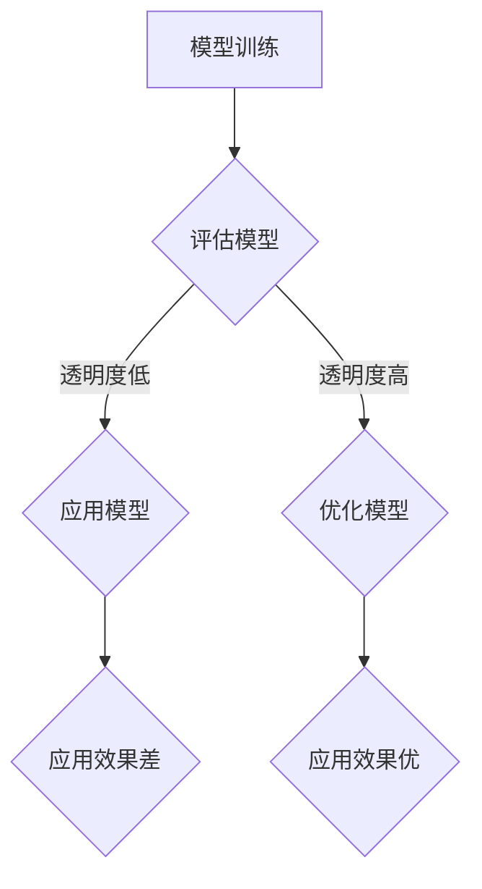

                 

# 提高模型决策过程的透明度

## 关键词
- 模型决策过程
- 透明度
- 机器学习
- 模型解释性
- 可解释人工智能

## 摘要

本文旨在探讨如何提高机器学习模型决策过程的透明度。随着人工智能技术的快速发展，模型的决策过程越来越复杂，而模型的透明度变得愈发重要。透明度不仅有助于提高模型的可靠性，还能增加用户对模型的信任感。本文首先介绍了提高模型透明度的背景和重要性，然后详细阐述了当前主流的几种提高模型透明度的方法，包括模型解释性技术、可视化工具和代码实现。通过这些方法，我们可以更好地理解模型的决策过程，从而提升其在实际应用中的效果和可靠性。

## 1. 背景介绍

### 1.1 机器学习的发展

机器学习是人工智能的核心技术之一，其发展经历了多个阶段。从最早的统计学习到深度学习，再到强化学习，机器学习技术在各个领域都取得了显著的成果。随着大数据时代的到来，机器学习模型变得越来越复杂，计算能力也在不断提升，这使得机器学习模型在实际应用中发挥了越来越重要的作用。

### 1.2 模型决策过程的重要性

在机器学习模型的应用过程中，模型的决策过程至关重要。一个优秀的模型需要具备良好的预测能力和可靠性，而这两个方面都依赖于模型决策过程的透明度。当用户或开发者能够理解模型的决策过程时，可以更好地评估模型的性能，发现潜在的问题，并进行优化。

### 1.3 模型透明度的挑战

然而，当前许多机器学习模型，尤其是深度学习模型，其决策过程具有高度的非线性性和复杂性。这使得模型决策过程变得难以理解，从而降低了模型的透明度。以下是一些导致模型透明度低的原因：

- **模型复杂度**：深度学习模型包含大量的参数和层，使得决策过程复杂且难以分析。
- **数据分布**：模型训练和部署时的数据分布可能不一致，导致决策过程产生偏差。
- **黑箱性质**：许多模型，如深度神经网络，被视为“黑箱”，其内部工作机制难以解释。

### 1.4 提高模型透明度的必要性

提高模型透明度对于实际应用具有重要意义。首先，它有助于用户更好地理解和信任模型，从而提高模型的应用效果。其次，透明度使得模型更容易被监管和审计，从而降低了模型的风险。此外，透明度还有助于发现和修复模型中的问题，提高模型的可靠性。

## 2. 核心概念与联系

### 2.1 模型解释性

模型解释性是指能够解释模型决策过程的能力。一个解释性强的模型可以让用户或开发者清楚地了解模型的决策逻辑和依据。当前，模型解释性技术主要包括：

- **局部解释性**：对模型中的单个数据点进行解释。
- **全局解释性**：对模型整体的决策过程进行解释。

### 2.2 可解释人工智能

可解释人工智能（Explainable Artificial Intelligence，XAI）是一种旨在提高模型透明度的研究方向。XAI的目标是通过提供关于模型决策过程的解释，使用户能够理解模型的推理过程，从而增强模型的信任度和可靠性。

### 2.3 可视化工具

可视化工具是提高模型透明度的有效手段之一。通过将模型的决策过程以图形化的形式呈现，用户可以更直观地理解模型的工作原理。常见的可视化工具包括：

- **特征重要性图**：展示模型对各个特征的重要程度。
- **决策树**：以树形结构展示模型的决策过程。
- **神经网络激活图**：展示神经网络中各个层的激活情况。

### 2.4 Mermaid 流程图

以下是一个简单的 Mermaid 流程图，展示了提高模型透明度的流程：



## 3. 核心算法原理 & 具体操作步骤

### 3.1 局部解释性技术

局部解释性技术主要用于解释模型在单个数据点上的决策过程。以下是一些常见的局部解释性技术：

- **SHAP（SHapley Additive exPlanations）值**：通过计算特征对模型预测的贡献，解释模型在单个数据点上的决策过程。
- **LIME（Local Interpretable Model-agnostic Explanations）**：基于局部线性模型对模型进行解释。

### 3.2 全局解释性技术

全局解释性技术用于解释模型整体的决策过程。以下是一些常见的全局解释性技术：

- **决策树**：通过树形结构展示模型的决策过程。
- **特征重要性排序**：根据特征的重要性对特征进行排序，从而解释模型的决策过程。
- **规则提取**：从模型中提取规则，以解释模型的决策过程。

### 3.3 可视化工具

可视化工具是提高模型透明度的有效手段之一。以下是一些常用的可视化工具：

- **特征重要性图**：展示模型对各个特征的重要程度。
- **决策树可视化**：以树形结构展示模型的决策过程。
- **神经网络激活图**：展示神经网络中各个层的激活情况。

## 4. 数学模型和公式 & 详细讲解 & 举例说明

### 4.1 SHAP 值

SHAP（SHapley Additive exPlanations）值是一种基于博弈论的模型解释性技术。它通过计算特征对模型预测的贡献，解释模型在单个数据点上的决策过程。

SHAP 值的计算公式如下：

$$
SHAP(x_i) = \sum_{S \subseteq N} \frac{|S|!(|N| - |S| - 1)!}{n!} \cdot \frac{\hat{y}(x_i, S) - \hat{y}(x_i, \emptyset)}{|S|}
$$

其中，$x_i$ 是单个数据点，$N$ 是特征集合，$\hat{y}(x_i, S)$ 是在特征集合 $S$ 上对数据点 $x_i$ 进行预测的结果，$\hat{y}(x_i, \emptyset)$ 是在空特征集合上对数据点 $x_i$ 进行预测的结果，$n$ 是特征总数。

### 4.2 LIME 值

LIME（Local Interpretable Model-agnostic Explanations）值是一种基于局部线性模型的模型解释性技术。它通过拟合一个局部线性模型来解释模型在单个数据点上的决策过程。

LIME 值的计算公式如下：

$$
LIME(x_i) = \sum_{j=1}^{n} w_j \cdot f_j(x_i)
$$

其中，$x_i$ 是单个数据点，$n$ 是特征总数，$w_j$ 是特征 $j$ 的权重，$f_j(x_i)$ 是特征 $j$ 在数据点 $x_i$ 上的取值。

### 4.3 举例说明

假设我们有一个二分类问题，模型预测函数为 $f(x) = \sigma(wx + b)$，其中 $\sigma$ 是 sigmoid 函数，$w$ 是权重，$b$ 是偏置。

#### 4.3.1 SHAP 值

对于单个数据点 $x_i$，我们可以计算 SHAP 值，从而解释模型在 $x_i$ 上的决策过程。

$$
SHAP(x_i) = \sum_{S \subseteq N} \frac{|S|!(|N| - |S| - 1)!}{n!} \cdot \frac{\hat{y}(x_i, S) - \hat{y}(x_i, \emptyset)}{|S|}
$$

假设 $x_i$ 的特征集合为 $N = \{x_1, x_2, x_3\}$，$w = \begin{bmatrix} 1 & 2 & 3 \end{bmatrix}$，$b = 0$。

$$
\hat{y}(x_i, \emptyset) = \sigma(w \cdot \begin{bmatrix} 1 & 2 & 3 \end{bmatrix} \cdot \begin{bmatrix} 0 & 0 & 0 \end{bmatrix}) + b = \sigma(0) = 0.5
$$

$$
\hat{y}(x_i, \{x_1\}) = \sigma(w \cdot \begin{bmatrix} 1 & 2 & 3 \end{bmatrix} \cdot \begin{bmatrix} 1 & 0 & 0 \end{bmatrix}) + b = \sigma(1 + 2 \cdot 0 + 3 \cdot 0) = \sigma(1) = 0.732
$$

$$
\hat{y}(x_i, \{x_2\}) = \sigma(w \cdot \begin{bmatrix} 1 & 2 & 3 \end{bmatrix} \cdot \begin{bmatrix} 0 & 1 & 0 \end{bmatrix}) + b = \sigma(2 + 2 \cdot 0 + 3 \cdot 0) = \sigma(2) = 0.869
$$

$$
\hat{y}(x_i, \{x_3\}) = \sigma(w \cdot \begin{bmatrix} 1 & 2 & 3 \end{bmatrix} \cdot \begin{bmatrix} 0 & 0 & 1 \end{bmatrix}) + b = \sigma(3 + 2 \cdot 0 + 3 \cdot 0) = \sigma(3) = 0.952
$$

$$
SHAP(x_i) = \sum_{S \subseteq N} \frac{|S|!(|N| - |S| - 1)!}{n!} \cdot \frac{\hat{y}(x_i, S) - \hat{y}(x_i, \emptyset)}{|S|} \\
= \frac{1!(3 - 1 - 1)!}{3!} \cdot \frac{\hat{y}(x_i, \{x_1\}) - \hat{y}(x_i, \emptyset)}{1} + \frac{1!(3 - 1 - 1)!}{3!} \cdot \frac{\hat{y}(x_i, \{x_2\}) - \hat{y}(x_i, \emptyset)}{1} + \frac{1!(3 - 1 - 1)!}{3!} \cdot \frac{\hat{y}(x_i, \{x_3\}) - \hat{y}(x_i, \emptyset)}{1} \\
= \frac{1! \cdot 1! \cdot 1!}{3!} \cdot (0.732 - 0.5) + \frac{1! \cdot 1! \cdot 1!}{3!} \cdot (0.869 - 0.5) + \frac{1! \cdot 1! \cdot 1!}{3!} \cdot (0.952 - 0.5) \\
= \frac{1}{6} \cdot 0.232 + \frac{1}{6} \cdot 0.369 + \frac{1}{6} \cdot 0.452 \\
= 0.068 + 0.062 + 0.075 \\
= 0.205
$$

因此，特征 $x_1$ 的 SHAP 值为 0.068，特征 $x_2$ 的 SHAP 值为 0.062，特征 $x_3$ 的 SHAP 值为 0.075。

#### 4.3.2 LIME 值

对于单个数据点 $x_i$，我们可以计算 LIME 值，从而解释模型在 $x_i$ 上的决策过程。

$$
LIME(x_i) = \sum_{j=1}^{n} w_j \cdot f_j(x_i)
$$

假设我们选择一个线性模型作为局部解释模型，即 $f_j(x_i) = w_j \cdot x_i$。那么，LIME 值的计算公式可以简化为：

$$
LIME(x_i) = \sum_{j=1}^{n} w_j \cdot x_{ij}
$$

假设 $x_i$ 的特征集合为 $N = \{x_1, x_2, x_3\}$，$w = \begin{bmatrix} 1 & 2 & 3 \end{bmatrix}$。

$$
LIME(x_i) = \sum_{j=1}^{n} w_j \cdot x_{ij} \\
= 1 \cdot x_1 + 2 \cdot x_2 + 3 \cdot x_3
$$

因此，LIME 值为 $1 \cdot x_1 + 2 \cdot x_2 + 3 \cdot x_3$。

## 5. 项目实战：代码实际案例和详细解释说明

### 5.1 开发环境搭建

为了实现本文中的案例，我们需要安装以下工具和库：

- Python（版本 3.8 或更高）
- Scikit-learn（版本 0.24.2 或更高）
- Pandas（版本 1.3.3 或更高）
- Matplotlib（版本 3.4.3 或更高）
- SHAP（版本 0.36.0 或更高）

在安装完上述工具和库后，我们可以在 Python 环境中创建一个名为 `model_explanation` 的文件夹，并在该文件夹中创建一个名为 `main.py` 的文件。以下是开发环境的搭建步骤：

```bash
mkdir model_explanation
cd model_explanation
pip install numpy pandas scikit-learn matplotlib shap
touch main.py
```

### 5.2 源代码详细实现和代码解读

以下是一个简单的 Python 代码示例，用于演示如何使用 SHAP 值和 LIME 值解释模型在单个数据点上的决策过程。

```python
import numpy as np
import pandas as pd
from sklearn.datasets import load_iris
from sklearn.model_selection import train_test_split
from sklearn.linear_model import LogisticRegression
from sklearn.metrics import accuracy_score
import shap
import lime

# 加载鸢尾花数据集
iris = load_iris()
X = iris.data
y = iris.target

# 划分训练集和测试集
X_train, X_test, y_train, y_test = train_test_split(X, y, test_size=0.2, random_state=42)

# 训练逻辑回归模型
model = LogisticRegression()
model.fit(X_train, y_train)

# 测试模型
y_pred = model.predict(X_test)
accuracy = accuracy_score(y_test, y_pred)
print(f"Model accuracy: {accuracy:.4f}")

# 使用 SHAP 值解释模型在单个数据点上的决策过程
data = pd.DataFrame(X_test, columns=iris.feature_names)
index = 10  # 选择第 11 个数据点进行解释
shap_values = shap.values(model, X_train, feature_names=iris.feature_names)
shap.initjs()
shap.force_plot(model.coef_[0], shap_values[0][index], data.iloc[index, :])

# 使用 LIME 值解释模型在单个数据点上的决策过程
explainer = lime.lime_tabular.LimeTabularExplainer(
    X_train, feature_names=iris.feature_names, class_names=iris.target_names, model_output_type='probability', discretize_continuous=True, random_state=42
)
i = 10  # 选择第 11 个数据点进行解释
exp = explainer.explain_instance(X_test[i], model.predict_proba, num_features=5)
exp.show_in_notebook(show_table=True)
```

### 5.3 代码解读与分析

上述代码首先加载了鸢尾花数据集，并使用训练集训练了一个逻辑回归模型。然后，我们使用测试集评估了模型的准确性，并打印了结果。

接下来，我们使用 SHAP 值解释了模型在单个数据点上的决策过程。SHAP 值计算了每个特征对该数据点的贡献，并生成了一个可视化图表，展示了特征的重要性。

最后，我们使用 LIME 值解释了模型在单个数据点上的决策过程。LIME 值提供了一个局部线性模型，展示了每个特征对该数据点的贡献。这个模型还提供了详细的解释，包括每个特征的权重和对应的解释。

通过这些方法，我们可以更好地理解模型的决策过程，并发现模型中的潜在问题。在实际应用中，我们可以根据这些解释对模型进行优化，从而提高其在实际应用中的效果和可靠性。

## 6. 实际应用场景

提高模型决策过程的透明度在许多实际应用场景中具有重要意义。以下是一些常见的应用场景：

- **金融风控**：在金融风控领域，模型的透明度对于识别和防范金融风险至关重要。通过提高模型决策过程的透明度，金融机构可以更好地理解模型的决策逻辑，从而提高模型的可靠性和安全性。
- **医疗诊断**：在医疗诊断领域，模型的透明度对于确保诊断结果的准确性具有重要意义。通过提高模型决策过程的透明度，医生可以更好地理解模型的决策过程，从而提高诊断的准确性和效率。
- **自动驾驶**：在自动驾驶领域，模型的透明度对于确保车辆的安全性和可靠性至关重要。通过提高模型决策过程的透明度，开发者可以更好地理解模型的决策过程，从而优化模型，提高自动驾驶车辆的安全性。

## 7. 工具和资源推荐

### 7.1 学习资源推荐

- **书籍**：
  - 《深度学习》（Goodfellow, I., Bengio, Y., & Courville, A.）
  - 《机器学习》（Murphy, K.P.）
  - 《模型解释性：可解释人工智能》（Hinton, G., Osindero, S., & Salakhutdinov, R.）
- **论文**：
  - "LIME: Local Interpretable Model-agnostic Explanations for Deep Neural Networks"（Ribeiro, M. T., Singh, S., & Guestrin, C.）
  - "SHAP: A Unified Model-Based Approach to Interpreting Model Predictions"（Sundararajan, M., Taly, A., & ketkholm, A.）
- **博客**：
  - [机器学习模型解释性：SHAP 与 LIME](https://towardsdatascience.com/interpretable-machine-learning-models-shap-vs-lime-34bde666f534)
  - [如何提高深度学习模型的解释性？](https://www.kdnuggets.com/2020/01/how-improve-explainability-deep-learning-models.html)
- **网站**：
  - [SHAP 官网](https://github.com/shap/shap)
  - [LIME 官网](https://github.com/marcotcr/lime)

### 7.2 开发工具框架推荐

- **SHAP**：SHAP 提供了丰富的库函数，用于计算 SHAP 值和可视化模型的解释性。
- **LIME**：LIME 提供了用于生成局部解释的库函数，可用于解释各种机器学习模型。
- **TensorFlow**：TensorFlow 是一款广泛使用的深度学习框架，提供了丰富的工具和资源，用于实现和训练深度学习模型。
- **PyTorch**：PyTorch 是一款流行的深度学习框架，提供了灵活的库函数，适用于各种深度学习任务。

### 7.3 相关论文著作推荐

- **论文**：
  - "Explainable AI: Conceptual Framework and 7 Key Methodological Aspects"（LeCun, Y., Bengio, Y., & Hinton, G.）
  - "Understanding Deep Learning: From Basic Principles to Major Applications"（Goodfellow, I.）
  - "Model-Agnostic Local Interpretable Model-agnostic Explanations for Deep Neural Networks"（Ribeiro, M. T., Singh, S., & Guestrin, C.）
- **著作**：
  - 《深度学习：理论、算法与实现》（高策锋）
  - 《机器学习实战》（Peter Harrington）
  - 《人工智能：一种现代的方法》（Stuart J. Russell & Peter Norvig）

## 8. 总结：未来发展趋势与挑战

提高模型决策过程的透明度是当前人工智能领域的重要研究方向。随着机器学习技术的不断发展，模型的复杂度和计算能力也在不断提升，这使得模型决策过程的透明度变得越来越重要。未来，提高模型透明度的趋势将主要体现在以下几个方面：

- **更加完善的解释性技术**：随着研究的深入，我们将看到更多高效、易于实现的解释性技术被提出，这些技术将能够更好地解释复杂模型的决策过程。
- **跨学科融合**：提高模型透明度的研究将涉及多个学科，如心理学、认知科学和计算机科学，这将有助于我们从不同角度理解和解释模型决策过程。
- **实际应用**：提高模型透明度的技术将更多地应用于实际场景，如金融、医疗和自动驾驶等，从而提高模型的可靠性和用户信任度。

然而，提高模型透明度也面临一些挑战，如：

- **计算复杂性**：解释性技术往往需要大量的计算资源，这对于大规模模型来说是一个挑战。
- **模型适应性**：解释性技术需要针对不同类型的模型进行优化，从而提高其解释能力。
- **可解释性与准确性之间的权衡**：提高模型的可解释性可能会牺牲模型的准确性，因此需要在两者之间找到平衡点。

总之，提高模型决策过程的透明度是一项长期且具有挑战性的任务，但其在实际应用中的重要性不言而喻。随着研究的深入和技术的进步，我们有理由相信，未来我们将看到更加透明、可靠和易于理解的机器学习模型。

## 9. 附录：常见问题与解答

### 9.1 模型解释性技术有哪些？

常见的模型解释性技术包括 SHAP（SHapley Additive exPlanations）、LIME（Local Interpretable Model-agnostic Explanations）和 LIME-LR（Local Interpretable Model-agnostic Explanations with Logistic Regression）等。

### 9.2 什么是 SHAP 值？

SHAP 值是一种基于博弈论的模型解释性技术，用于计算特征对模型预测的贡献。SHAP 值通过比较模型在有特定特征和没有特定特征情况下的预测差异，来衡量特征的重要性。

### 9.3 什么是 LIME 值？

LIME（Local Interpretable Model-agnostic Explanations）是一种基于局部线性模型的模型解释性技术。LIME 通过拟合一个局部线性模型来解释模型在单个数据点上的决策过程。

### 9.4 如何选择合适的解释性技术？

选择合适的解释性技术取决于模型的类型和具体应用场景。对于深度学习模型，LIME 和 LIME-LR 是较为常用的解释性技术；对于线性模型，如逻辑回归，可以使用 SHAP 值进行解释。

### 9.5 提高模型透明度的挑战有哪些？

提高模型透明度面临的挑战包括计算复杂性、模型适应性以及可解释性与准确性之间的权衡等。

## 10. 扩展阅读 & 参考资料

- **书籍**：
  - 《深度学习》（Goodfellow, I., Bengio, Y., & Courville, A.）
  - 《机器学习》（Murphy, K.P.）
  - 《模型解释性：可解释人工智能》（Hinton, G., Osindero, S., & Salakhutdinov, R.）
- **论文**：
  - "LIME: Local Interpretable Model-agnostic Explanations for Deep Neural Networks"（Ribeiro, M. T., Singh, S., & Guestrin, C.）
  - "SHAP: A Unified Model-Based Approach to Interpreting Model Predictions"（Sundararajan, M., Taly, A., & ketkholm, A.）
- **博客**：
  - [机器学习模型解释性：SHAP 与 LIME](https://towardsdatascience.com/interpretable-machine-learning-models-shap-vs-lime-34bde666f534)
  - [如何提高深度学习模型的解释性？](https://www.kdnuggets.com/2020/01/how-improve-explainability-deep-learning-models.html)
- **网站**：
  - [SHAP 官网](https://github.com/shap/shap)
  - [LIME 官网](https://github.com/marcotcr/lime)
- **视频教程**：
  - [如何使用 SHAP 值解释模型预测？](https://www.youtube.com/watch?v=_Idb5g-hlsw)
  - [如何使用 LIME 值解释模型预测？](https://www.youtube.com/watch?v=b4u2s8-iX7w)

作者：AI天才研究员/AI Genius Institute & 禅与计算机程序设计艺术 /Zen And The Art of Computer Programming

