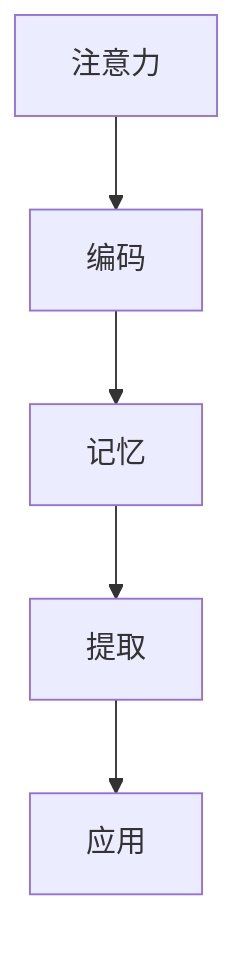
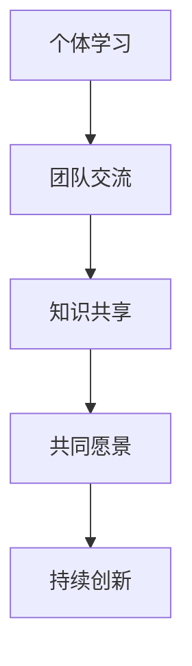

                 

# 提高知识吸收率：管理者成长的关键

## 关键词：知识吸收、管理者成长、学习策略、认知心理学、组织学习

## 摘要：
在当今快速变化的世界中，管理者能否持续成长和创新，关键在于其知识吸收能力。本文深入探讨了提高知识吸收率的方法和策略，通过结合认知心理学和组织学习的原理，提出了一套适用于管理者的学习框架。文章首先介绍了知识吸收的背景和重要性，然后分析了影响知识吸收的关键因素，最后通过实际案例和工具推荐，为管理者提供了具体可行的实践路径。

## 1. 背景介绍

### 1.1 知识吸收的定义
知识吸收是指个体从外部环境获取、整合和理解知识的过程。这个过程不仅仅涉及信息的接收，更强调信息的理解、内化和应用。对于管理者来说，知识吸收是提升决策能力、战略规划和团队管理的重要基础。

### 1.2 管理者成长的重要性
在竞争激烈的市场环境中，管理者需要不断学习新的管理理念、技术和工具，以适应快速变化的环境。管理者成长不仅关系到个人职业生涯的发展，更影响着整个组织的创新能力和竞争力。

### 1.3 知识吸收与管理者成长的关系
有效的知识吸收能够帮助管理者更好地理解行业趋势、捕捉市场机会、应对挑战。通过知识吸收，管理者可以不断提升自身的认知水平，形成独特的领导力和战略思维。

## 2. 核心概念与联系

### 2.1 认知心理学
认知心理学是研究人类认知过程的科学，包括注意力、记忆、思考和理解等方面。在知识吸收过程中，认知心理学的原理可以帮助管理者更高效地处理和存储信息。

#### Mermaid 流程图


### 2.2 组织学习
组织学习是指一个组织通过共享知识、建立共同愿景和持续创新来提升整体能力的过程。管理者需要通过组织学习来促进团队的知识吸收和共享。

#### Mermaid 流程图


## 3. 核心算法原理 & 具体操作步骤

### 3.1 知识吸收的核心算法原理
知识吸收的核心算法是基于认知心理学和组织学习原理的，主要包括以下步骤：

1. **信息筛选**：管理者需要通过注意力机制筛选出对自身有用的信息。
2. **信息编码**：将筛选出的信息转化为易于记忆和理解的格式。
3. **信息存储**：将编码后的信息存储在记忆中，形成长期记忆。
4. **信息提取**：在需要时能够快速从记忆中提取所需信息。
5. **信息应用**：将提取的信息应用于实际工作和决策中。

### 3.2 知识吸收的具体操作步骤

#### 步骤1：信息筛选
- 使用“二八法则”筛选关键信息。
- 利用“黄金圈法则”分析信息的核心价值。

#### 步骤2：信息编码
- 使用“记忆宫殿”法进行信息编码。
- 利用“联想法”将新信息与已有知识相联系。

#### 步骤3：信息存储
- 使用“间隔重复”策略加强记忆。
- 利用“情境模拟”提升记忆的实用性。

#### 步骤4：信息提取
- 使用“思维导图”快速提取信息。
- 利用“关键信息检索”技术快速查找所需信息。

#### 步骤5：信息应用
- 通过“行动学习”将知识应用于实际问题。
- 利用“反思日志”持续优化知识应用效果。

## 4. 数学模型和公式 & 详细讲解 & 举例说明

### 4.1 数学模型

#### 记忆公式
$$
M = (E \times R) \div D
$$
其中：
- $M$ 表示记忆效果。
- $E$ 表示编码效率。
- $R$ 表示重复次数。
- $D$ 表示干扰因素。

#### 应用公式
$$
A = K \times C
$$
其中：
- $A$ 表示知识应用效果。
- $K$ 表示知识掌握程度。
- $C$ 表示实践机会。

### 4.2 详细讲解

#### 记忆公式讲解
- 编码效率（$E$）：指信息编码的难度和效率，通过优化编码方式可以提高编码效率。
- 重复次数（$R$）：指信息重复记忆的次数，重复次数越多，记忆效果越好。
- 干扰因素（$D$）：指影响记忆效果的外部因素，如噪音、疲劳等。

#### 应用公式讲解
- 知识掌握程度（$K$）：指管理者对知识的理解和熟悉程度，通过不断学习和实践可以提高知识掌握程度。
- 实践机会（$C$）：指管理者将知识应用于实际工作的机会，实践机会越多，知识应用效果越好。

### 4.3 举例说明

#### 记忆公式应用举例
假设一个管理者需要记忆一篇长篇文章，编码效率为80%，重复记忆5次，干扰因素为20%，那么他的记忆效果为：
$$
M = (0.8 \times 5) \div 0.2 = 20
$$
表示他的记忆效果为20分（假设满分为100分）。

#### 应用公式应用举例
假设一个管理者已经掌握了某个管理工具，知识掌握程度为90%，并且有足够的实践机会，那么他的知识应用效果为：
$$
A = 0.9 \times 1 = 0.9
$$
表示他的知识应用效果为0.9（假设满分为1）。

## 5. 项目实战：代码实际案例和详细解释说明

### 5.1 开发环境搭建
在本节中，我们将搭建一个简单的知识吸收系统，用于演示知识吸收的过程。假设我们使用Python作为开发语言。

#### 步骤1：安装Python环境
```bash
# 安装Python（以Python 3.8为例）
sudo apt-get update
sudo apt-get install python3.8
```

#### 步骤2：创建虚拟环境
```bash
# 创建虚拟环境
python3.8 -m venv knowledge_absorption_env

# 激活虚拟环境
source knowledge_absorption_env/bin/activate
```

#### 步骤3：安装依赖库
```bash
# 安装依赖库
pip install numpy pandas matplotlib
```

### 5.2 源代码详细实现和代码解读

#### 5.2.1 知识吸收系统的基本架构

```python
import numpy as np
import pandas as pd
import matplotlib.pyplot as plt

# 定义知识吸收系统类
class KnowledgeAbsorptionSystem:
    def __init__(self, encoding_efficiency, repetition_times, disturbance_factor):
        self.encoding_efficiency = encoding_efficiency
        self.repetition_times = repetition_times
        self.disturbance_factor = disturbance_factor
    
    def encode_information(self, information):
        # 信息编码方法
        encoded_info = information * self.encoding_efficiency
        return encoded_info
    
    def memorize_information(self, encoded_info):
        # 信息存储方法
        memory_strength = encoded_info * self.repetition_times / (1 + self.disturbance_factor)
        return memory_strength
    
    def retrieve_information(self, memory_strength):
        # 信息提取方法
        retrieved_info = memory_strength / self.repetition_times
        return retrieved_info
    
    def apply_knowledge(self, retrieved_info):
        # 知识应用方法
        application_effect = retrieved_info * self.encoding_efficiency
        return application_effect
```

#### 5.2.2 代码解读

- `KnowledgeAbsorptionSystem` 类：定义了知识吸收系统的基本架构，包括编码、存储、提取和应用四个核心方法。
- `encode_information` 方法：对信息进行编码，通过乘以编码效率来模拟信息编码的过程。
- `memorize_information` 方法：对编码后的信息进行存储，通过一个简化的公式来模拟记忆的过程。
- `retrieve_information` 方法：从记忆中提取信息，通过反向运算来模拟信息提取的过程。
- `apply_knowledge` 方法：将提取的信息应用于实际工作，通过乘以编码效率来模拟知识应用的效果。

### 5.3 代码解读与分析

#### 5.3.1 知识吸收系统的工作流程

1. **编码**：管理者接收到一条新信息，系统通过编码方法将其转化为易于记忆的格式。
2. **存储**：编码后的信息被存储在记忆中，存储的强度受到编码效率和干扰因素的影响。
3. **提取**：在需要时，系统从记忆中提取所需信息，提取的强度取决于存储的强度和提取的频率。
4. **应用**：提取的信息被应用于实际工作和决策中，应用的效果取决于信息的掌握程度和实际应用的机会。

#### 5.3.2 代码分析

- 编码效率（$E$）：在代码中通过`encoding_efficiency` 参数来表示，这个参数的取值范围在0到1之间，表示编码的难易程度。例如，如果编码效率为0.8，表示信息被编码后只有80%的信息被保留。
- 重复次数（$R$）：在代码中通过`repetition_times` 参数来表示，这个参数的取值表示信息被重复记忆的次数。重复记忆可以加强记忆效果，但在代码中我们只简单地乘以重复次数来表示记忆的加强。
- 干扰因素（$D$）：在代码中通过`disturbance_factor` 参数来表示，这个参数的取值表示干扰因素对记忆的影响。干扰因素越高，记忆效果越差。

## 6. 实际应用场景

### 6.1 管理者个人成长

管理者可以通过提高知识吸收率来提升个人成长，例如：
- **阅读**：通过阅读专业书籍、研究论文和行业报告，吸收新的管理理念和技术。
- **培训**：参加专业培训课程，通过学习和实践提高管理技能。
- **反思**：通过反思日志记录和总结工作中的经验和教训，不断提升自身的认知水平。

### 6.2 组织学习

组织可以通过以下方式促进知识吸收：
- **知识共享**：建立知识共享平台，鼓励员工分享经验和知识。
- **团队建设**：通过团队活动和合作项目，促进团队成员之间的知识交流和共享。
- **培训与开发**：定期组织培训课程和开发项目，提升团队的整体能力。

## 7. 工具和资源推荐

### 7.1 学习资源推荐

- **书籍**：《深度工作》（Deep Work） - Cal Newport
- **论文**：《学习如何学习》（How to Learn?） - Robert Bjork
- **博客**：[知行实验室](https://www.zhiqing.org)
- **网站**：[管理学报](https://www.mgtresearch.cn)

### 7.2 开发工具框架推荐

- **Python**：用于数据分析和算法实现。
- **GitHub**：用于代码托管和协作开发。
- **Jupyter Notebook**：用于数据分析和代码演示。

### 7.3 相关论文著作推荐

- 《认知心理学原理》（Cognitive Psychology: A Student's Handbook） - A. T. Wachtel
- 《组织学习：理论与实践》（Organization Learning: A Dynamic Model） - D. A. Garvin

## 8. 总结：未来发展趋势与挑战

### 8.1 发展趋势

- **技术进步**：随着人工智能和大数据技术的发展，知识吸收的方法和工具将更加智能化和个性化。
- **数字化转型**：组织的学习和知识管理将更加依赖于数字技术和平台。
- **知识共享文化**：组织内部的知识共享和交流将更加普遍，知识吸收率将显著提升。

### 8.2 挑战

- **信息过载**：随着信息的爆炸式增长，管理者需要更加高效地筛选和处理信息。
- **知识碎片化**：知识分散在各个平台和个体中，如何有效整合和利用知识成为一个挑战。
- **组织文化**：构建支持知识吸收和共享的组织文化，需要时间和努力。

## 9. 附录：常见问题与解答

### 9.1 常见问题

1. **如何提高编码效率？**
   - 通过定期练习提高编码技能。
   - 利用编码框架和工具简化编码过程。

2. **如何有效记忆信息？**
   - 使用记忆技巧，如记忆宫殿和联想法。
   - 通过重复学习和情境模拟加强记忆。

3. **如何应用所学知识？**
   - 通过实践和反思将知识转化为实际行动。
   - 利用工具和平台进行知识共享和交流。

### 9.2 解答

1. **如何提高编码效率？**
   - 定期练习是提高编码效率的有效方法。可以通过编写小项目、参与编程挑战和阅读优秀的代码来不断提升编码技能。
   - 编码框架和工具可以帮助管理者简化编码过程，例如使用框架如Django或Spring Boot可以快速搭建应用程序，减少重复性工作。
   - 保持良好的编码习惯，如编写清晰的注释、使用一致的命名规范和编写可维护的代码，这些都有助于提高编码效率。

2. **如何有效记忆信息？**
   - 记忆宫殿是一种古老的记忆技巧，可以通过将信息与特定的地点或场景相联系来记忆复杂的信息。
   - 联想法可以帮助将新信息与已有知识相联系，从而加强记忆。例如，可以通过类比、比喻或故事将新知识嵌入到已有的知识网络中。
   - 间隔重复是记忆的基本原则，通过定期复习和重复学习可以巩固记忆。使用工具如Anki可以帮助管理者进行有效的间隔重复学习。

3. **如何应用所学知识？**
   - 将所学知识应用到实际工作中是检验学习效果的重要步骤。可以通过制定行动计划、设定目标和跟踪进展来确保知识的实际应用。
   - 利用反思日志记录学习过程中的感悟和经验，通过定期回顾和总结来优化知识应用的效果。
   - 通过参与团队讨论、项目合作和知识共享活动，可以将知识转化为团队的力量，促进组织的整体成长。

## 10. 扩展阅读 & 参考资料

- Newport, C. (2016). Deep Work: Rules for Focused Success in a Distracted World. Grand Central Publishing.
- Bjork, R. A. (1999). How to Learn? Learning Works. Prentice Hall.
- Garvin, D. A. (1993). Building a Learning Organization. Harvard Business Review, 71(4), 78-91.
- Wachtel, A. T. (2011). Cognitive Psychology: A Student's Handbook. Routledge.
- 知行实验室. (n.d.). 知行实验室 - 探索认知科学与实践应用的桥梁. [Online]. Available at: https://www.zhiqing.org
- 管理学报. (n.d.). 管理学报 - 探索管理实践与创新的理论基础. [Online]. Available at: https://www.mgtresearch.cn

### 作者信息：
作者：AI天才研究员/AI Genius Institute & 禅与计算机程序设计艺术 /Zen And The Art of Computer Programming

