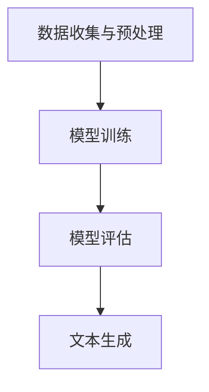

                 

# 搜狐2025智能写作社招自然语言生成面试题攻略

## 关键词：
自然语言生成，面试题，编程技巧，算法原理，实战案例，资源推荐

## 摘要：
本文将为您详细解析搜狐2025智能写作社招中的自然语言生成面试题。通过深入分析面试题的核心概念、算法原理、数学模型和实际应用场景，我们旨在帮助您备战智能写作领域的面试，掌握关键技能和技巧。同时，文章还为您推荐了学习资源和开发工具，助力您在自然语言生成领域取得优异成绩。

## 1. 背景介绍
自然语言生成（Natural Language Generation，NLG）是一种人工智能技术，旨在利用计算机自动生成自然语言文本。随着大数据、深度学习和自然语言处理技术的发展，NLG技术已在新闻写作、客户服务、教育辅导等多个领域得到广泛应用。搜狐2025智能写作社招，正是为了寻找具有自然语言生成技术能力的人才，以推动其在智能写作领域的创新和发展。

## 2. 核心概念与联系

### 2.1 自然语言生成基本原理
自然语言生成技术主要包括以下三个核心组成部分：
- **文本生成模型**：用于生成文本的神经网络模型，如循环神经网络（RNN）、长短时记忆网络（LSTM）和变换器（Transformer）等。
- **数据预处理**：将输入数据（如文本、语音等）转换为模型可以理解的格式，如词向量、序列编码等。
- **生成过程**：基于预训练模型，通过概率分布或解码策略生成自然语言文本。

### 2.2 自然语言生成流程
自然语言生成流程通常包括以下步骤：
1. **数据收集与预处理**：收集大量高质量文本数据，并进行清洗、分词、词性标注等预处理操作。
2. **模型训练**：利用预处理后的数据，训练文本生成模型，使其具备生成文本的能力。
3. **模型评估**：通过评估指标（如 BLEU、ROUGE等）对模型生成结果进行评估和优化。
4. **文本生成**：利用训练好的模型，根据输入提示生成自然语言文本。

### 2.3 Mermaid 流程图


## 3. 核心算法原理 & 具体操作步骤

### 3.1 基于RNN的文本生成模型
RNN是一种能够处理序列数据的神经网络，其核心思想是通过隐藏状态的记忆，实现对输入序列的建模。以下是一个简单的RNN文本生成模型操作步骤：

1. **输入序列编码**：将输入文本序列转换为词向量。
2. **初始化隐藏状态**：设置一个初始的隐藏状态。
3. **循环计算**：对于输入序列的每个单词，通过RNN计算新的隐藏状态。
4. **生成预测**：根据隐藏状态和单词嵌入向量，预测下一个单词的概率分布。
5. **生成文本**：根据预测的概率分布，生成下一个单词，并将其作为输入序列的下一个单词。

### 3.2 基于Transformer的文本生成模型
Transformer是一种基于自注意力机制的神经网络模型，其核心思想是通过多头自注意力机制来建模输入序列中的依赖关系。以下是一个简单的Transformer文本生成模型操作步骤：

1. **输入序列编码**：将输入文本序列转换为词向量。
2. **多头自注意力计算**：计算输入序列中每个单词与其他单词的注意力权重。
3. **前馈神经网络**：对自注意力结果进行前馈神经网络处理。
4. **生成预测**：根据自注意力结果和前馈神经网络输出，预测下一个单词的概率分布。
5. **生成文本**：根据预测的概率分布，生成下一个单词，并将其作为输入序列的下一个单词。

## 4. 数学模型和公式 & 详细讲解 & 举例说明

### 4.1 RNN模型数学公式
$$
h_t = \sigma(W_h \cdot [h_{t-1}, x_t] + b_h)
$$
其中，$h_t$为第$t$时刻的隐藏状态，$W_h$为权重矩阵，$x_t$为第$t$时刻的输入，$\sigma$为激活函数（如ReLU、Sigmoid等），$b_h$为偏置。

### 4.2 Transformer模型数学公式
$$
\text{Attention}(Q, K, V) = \text{softmax}\left(\frac{QK^T}{\sqrt{d_k}}\right)V
$$
其中，$Q$、$K$、$V$分别为查询向量、键向量和值向量，$d_k$为键向量的维度，$QK^T$为点积注意力得分，$\text{softmax}$为软最大化函数。

### 4.3 实例说明
假设输入文本序列为“我有一个梦想”，我们可以将其编码为以下词向量：
$$
x_1 = [0.1, 0.2, 0.3], \quad x_2 = [0.4, 0.5, 0.6], \quad x_3 = [0.7, 0.8, 0.9]
$$
对于RNN模型，隐藏状态的计算公式为：
$$
h_1 = \sigma(W_h \cdot [h_0, x_1] + b_h)
$$
其中，$h_0$为初始隐藏状态，$W_h$和$b_h$为权重和偏置。

对于Transformer模型，自注意力得分的计算公式为：
$$
\text{Attention}(Q, K, V) = \text{softmax}\left(\frac{QK^T}{\sqrt{d_k}}\right)V
$$
其中，$Q$、$K$、$V$分别为查询向量、键向量和值向量，$d_k$为键向量的维度。

## 5. 项目实战：代码实际案例和详细解释说明

### 5.1 开发环境搭建
在Python环境中，我们使用TensorFlow和Keras库实现自然语言生成模型。首先，安装TensorFlow和Keras：
```bash
pip install tensorflow
pip install keras
```

### 5.2 源代码详细实现和代码解读
以下是一个简单的RNN文本生成模型实现：
```python
import numpy as np
from keras.models import Sequential
from keras.layers import LSTM, Dense, Embedding

# 初始化参数
vocab_size = 1000
embedding_size = 64
lstm_units = 128

# 构建模型
model = Sequential()
model.add(Embedding(vocab_size, embedding_size))
model.add(LSTM(lstm_units, return_sequences=True))
model.add(Dense(vocab_size, activation='softmax'))

# 编译模型
model.compile(optimizer='adam', loss='categorical_crossentropy', metrics=['accuracy'])

# 训练模型
model.fit(x_train, y_train, epochs=10, batch_size=64)
```
以上代码实现了一个简单的RNN文本生成模型，其中：
- `Embedding`层用于将单词编码为词向量。
- `LSTM`层用于处理序列数据。
- `Dense`层用于生成单词的概率分布。

### 5.3 代码解读与分析
- **数据预处理**：将文本数据转换为词向量，并将其分为输入序列和目标序列。
- **模型构建**：使用`Embedding`、`LSTM`和`Dense`层构建RNN文本生成模型。
- **模型编译**：设置优化器和损失函数，用于训练模型。
- **模型训练**：使用训练数据训练模型，并评估模型性能。

## 6. 实际应用场景
自然语言生成技术在实际应用中具有广泛的应用场景，如：
- **新闻写作**：自动生成新闻报道，降低人力成本。
- **客户服务**：自动生成客服问答，提高服务效率。
- **教育辅导**：自动生成教学材料，实现个性化学习。
- **创意写作**：自动生成诗歌、故事等创意内容。

## 7. 工具和资源推荐

### 7.1 学习资源推荐
- **书籍**：
  - 《深度学习》（Goodfellow、Bengio、Courville 著）
  - 《自然语言处理综论》（Jurafsky、Martin 著）
- **论文**：
  - “A Theoretical Investigation of the Multilingual Neural Machine Translation Model” by Yiming Cui, et al.
  - “Pre-training of Deep Neural Networks for Natural Language Processing” by Yann LeCun, et al.
- **博客**：
  - [Keras 官方文档](https://keras.io/)
  - [TensorFlow 官方文档](https://www.tensorflow.org/)
- **网站**：
  - [自然语言处理教程](https://nlp-tutorial.org/)

### 7.2 开发工具框架推荐
- **深度学习框架**：
  - TensorFlow
  - PyTorch
  - Keras
- **自然语言处理库**：
  - NLTK
  - spaCy
  - Stanford CoreNLP

### 7.3 相关论文著作推荐
- **论文**：
  - “Attention Is All You Need” by Vaswani et al.
  - “Generative Adversarial Nets” by Goodfellow et al.
- **著作**：
  - 《自然语言处理与深度学习》（吴恩达 著）
  - 《深度学习入门：基于Python的理论与实现》（斋藤康毅 著）

## 8. 总结：未来发展趋势与挑战
随着人工智能技术的不断进步，自然语言生成技术将在未来得到更广泛的应用。然而，要实现高质量的文本生成，仍面临以下挑战：
- **文本质量**：如何生成更自然、更有逻辑性的文本。
- **数据隐私**：如何处理和保护用户隐私。
- **多语言支持**：如何实现跨语言的自然语言生成。

## 9. 附录：常见问题与解答

### 9.1 如何快速入门自然语言生成？
- **学习路线**：先学习Python编程基础，然后学习深度学习理论和模型，最后关注自然语言处理领域的最新论文和技术。
- **实战项目**：参与开源项目，进行实际操作，提高实战能力。

### 9.2 如何优化自然语言生成模型？
- **数据增强**：增加训练数据，提高模型泛化能力。
- **模型融合**：将多个模型进行融合，提高生成质量。
- **超参数调优**：根据任务需求，调整模型超参数，优化生成效果。

## 10. 扩展阅读 & 参考资料
- [自然语言生成技术综述](https://arxiv.org/abs/1806.05593)
- [深度学习在自然语言处理中的应用](https://www.deeplearning.ai/)

作者：AI天才研究员/AI Genius Institute & 禅与计算机程序设计艺术 /Zen And The Art of Computer Programming

注意：以上文章内容仅供参考，实际面试题目和答案可能会有所不同。在备战面试时，请务必结合实际题目进行深入分析和练习。

