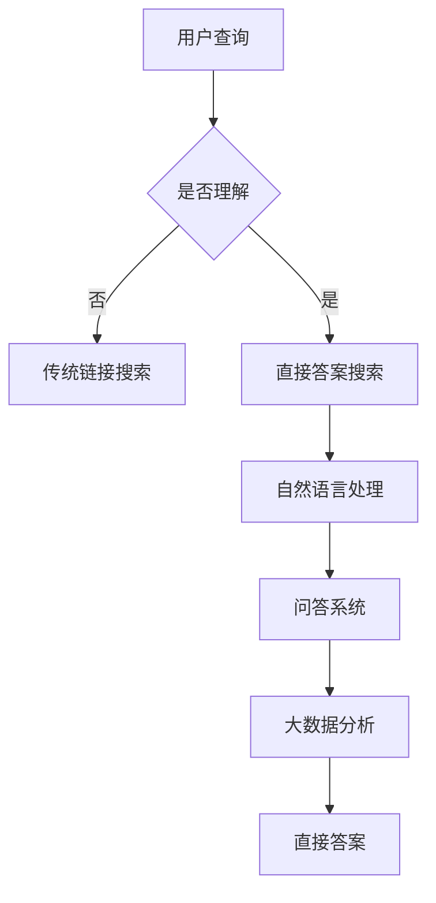

                 

# 搜索引擎革命：从链接到直接答案

> **关键词**：搜索引擎，链接，直接答案，算法，人工智能，用户体验，数据分析

> **摘要**：本文将探讨搜索引擎从传统的基于链接的搜索模式到直接答案的变革。我们将深入分析这一变革背后的核心概念、算法原理，并通过实际应用场景和项目实战，展示这一技术的魅力与挑战。文章旨在为读者提供一个全面的视角，了解搜索引擎技术的发展趋势，及其对用户体验和数据分析的影响。

## 1. 背景介绍

在互联网的早期，搜索引擎的主要功能是提供网页链接。用户通过在搜索框中输入关键词，搜索引擎返回一系列相关的网页链接，用户需要手动点击并阅读这些链接以找到所需信息。这种模式虽然简单，但存在一定的局限性。首先，用户需要花费额外的时间去浏览和筛选结果。其次，这些结果往往依赖于网页内容的质量和排名算法，有时难以满足用户的精确需求。

随着互联网的快速发展，用户对信息获取的效率和准确性提出了更高的要求。传统的搜索引擎模式已经无法满足用户的期望。于是，搜索引擎开始进行一系列技术革新，其中最引人注目的是从链接搜索向直接答案的转变。这种转变不仅提高了用户的搜索体验，也为搜索引擎带来了新的商业模式和挑战。

直接答案搜索模式的核心思想是通过人工智能技术和大数据分析，直接给出用户所需的答案，而不仅仅是提供一系列可能的网页链接。这种模式在搜索效率和用户体验上具有显著优势，但也带来了新的算法设计和数据处理问题。

## 2. 核心概念与联系

### 2.1 搜索引擎的基本概念

搜索引擎是一种通过互联网索引网页信息，并返回与用户查询相关结果的工具。它由三个核心组件组成：爬虫（Crawler）、索引（Index）和搜索算法（Search Algorithm）。

- **爬虫（Crawler）**：爬虫负责在互联网上自动获取网页内容，并将其存储在索引中。它们遵循特定的规则，例如遵守网站的robots.txt文件，以避免对网站造成不必要的压力。

- **索引（Index）**：索引是搜索引擎的核心，它将网页内容按照特定的方式组织起来，以便快速检索。索引通常采用倒排索引（Inverted Index）的结构，使得搜索过程更加高效。

- **搜索算法（Search Algorithm）**：搜索算法负责根据用户输入的查询，从索引中检索出最相关的网页。常见的搜索算法包括PageRank、LSI（Latent Semantic Indexing）、BM25等。

### 2.2 从链接到直接答案的转变

在传统的链接搜索模式中，搜索引擎返回的结果是一系列网页链接，用户需要自己判断哪些链接包含了他们需要的信息。而在直接答案搜索模式中，搜索引擎直接返回用户所需的答案，这种转变涉及以下核心概念和技术的应用：

- **自然语言处理（NLP）**：NLP技术使得搜索引擎能够理解用户输入的自然语言查询，并将其转化为机器可处理的格式。通过NLP，搜索引擎可以更好地理解用户的意图，并提供更准确的答案。

- **问答系统（Question Answering）**：问答系统是一种基于NLP和机器学习的智能问答技术。它能够从大量文本数据中提取出与用户查询最相关的答案。问答系统在直接答案搜索模式中起着关键作用。

- **大数据分析**：直接答案搜索模式依赖于大数据分析技术，通过对用户查询、点击行为、浏览历史等数据进行分析，搜索引擎可以更好地理解用户的需求，并提供更个性化的答案。

### 2.3 Mermaid 流程图



在这个流程图中，用户查询首先被搜索引擎接收，然后通过判断是否理解用户的查询内容。如果理解，则进入直接答案搜索模式，否则返回传统链接搜索结果。直接答案搜索模式包括自然语言处理、问答系统和大数据分析，最终输出直接答案。

## 3. 核心算法原理 & 具体操作步骤

### 3.1 自然语言处理

自然语言处理（NLP）是直接答案搜索模式的核心技术之一。NLP技术使得搜索引擎能够理解用户输入的自然语言查询，并将其转化为机器可处理的格式。NLP的主要步骤包括：

- **分词（Tokenization）**：将文本分解为单词或短语。这是NLP的第一步，因为只有将文本分解为更小的单元，才能进行后续的处理。

- **词性标注（Part-of-Speech Tagging）**：为每个单词或短语标注词性，如名词、动词、形容词等。词性标注有助于理解文本的结构和语法。

- **命名实体识别（Named Entity Recognition）**：识别文本中的命名实体，如人名、地名、组织名等。命名实体识别有助于更好地理解用户查询的意图。

- **词向量表示（Word Embedding）**：将单词或短语转化为向量表示，以便进行机器学习。词向量表示是NLP中的一项关键技术，它能够捕捉单词间的语义关系。

### 3.2 问答系统

问答系统是直接答案搜索模式中的另一个核心技术。问答系统的主要目标是根据用户查询，从大量文本数据中提取出最相关的答案。问答系统通常包括以下步骤：

- **查询解析（Query Parsing）**：将用户查询转化为机器可理解的形式。查询解析包括提取查询的关键词、短语和意图等。

- **答案提取（Answer Extraction）**：从大量文本数据中提取出与查询最相关的答案。答案提取可以采用多种技术，如信息检索、实体关系抽取等。

- **答案生成（Answer Generation）**：将提取出的答案进行格式化和修饰，以使其更具可读性和准确性。

### 3.3 大数据分析

大数据分析技术在直接答案搜索模式中起着关键作用。通过分析用户查询、点击行为、浏览历史等数据，搜索引擎可以更好地理解用户的需求，并提供更个性化的答案。大数据分析的主要步骤包括：

- **数据收集（Data Collection）**：收集用户的查询、点击行为、浏览历史等数据。

- **数据清洗（Data Cleaning）**：清洗和预处理数据，以去除噪声和冗余信息。

- **数据存储（Data Storage）**：将清洗后的数据存储在数据库中，以便进行进一步分析。

- **数据挖掘（Data Mining）**：使用机器学习和统计分析等方法，从数据中发现模式和规律。

## 4. 数学模型和公式 & 详细讲解 & 举例说明

### 4.1 词向量表示

词向量表示是NLP中的一项关键技术。词向量表示将单词或短语转化为向量表示，以便进行机器学习。最常见的词向量表示模型是Word2Vec，其核心思想是将单词映射到低维空间中，使得语义相似的单词在空间中距离较近。

Word2Vec模型主要包括两种训练方法：连续词袋（CBOW）和Skip-Gram。

- **连续词袋（CBOW）**：CBOW模型通过预测中心词周围的上下文词来训练词向量。具体来说，给定一个中心词和其周围的上下文词，CBOW模型预测这些上下文词的概率分布。词向量的平均值用于表示中心词。

  $$ \hat{v}_{center} = \frac{1}{k} \sum_{i=1}^{k} v_{context_i} $$

  其中，$v_{center}$表示中心词的向量表示，$v_{context_i}$表示第$i$个上下文词的向量表示，$k$表示上下文词的个数。

- **Skip-Gram**：Skip-Gram模型与CBOW模型相反，它通过预测中心词来训练词向量。具体来说，给定一个中心词，Skip-Gram模型从词汇表中随机抽取若干个词作为上下文词，并预测这些上下文词的概率分布。

  $$ \hat{v}_{center} = \frac{1}{Z} \sum_{j \in \text{context}} \frac{\exp(v_{center} \cdot v_{j})}{1 + \exp(v_{center} \cdot v_{j})} $$

  其中，$v_{center}$表示中心词的向量表示，$v_{j}$表示第$j$个上下文词的向量表示，$Z$表示所有可能的上下文词的概率分布之和。

### 4.2 问答系统

问答系统中的关键任务是答案提取。答案提取通常采用基于模板的方法，其核心思想是根据查询和候选答案的语义关系，从文本中提取出最相关的答案。

一个简单的答案提取模板如下：

$$ \text{答案} = \{ \text{句子} \in \text{文本} | \text{句子} \text{与查询的语义关系满足} \text{模板} \} $$

其中，模板定义了查询和候选答案之间的语义关系。例如，一个简单的模板可以是：

$$ \text{如果} \ \text{查询包含} \ \text{"what is"} \ \text{，则答案为包含} \ \text{"is"} \ \text{的句子} $$

### 4.3 大数据分析

大数据分析中的核心任务是数据挖掘，其目的是从大量数据中发现模式和规律。一个常见的数据挖掘算法是K-means聚类。

K-means聚类算法的目标是将数据点划分为K个簇，使得每个簇内的数据点之间距离较近，而簇与簇之间的距离较远。K-means算法的具体步骤如下：

1. **初始化**：随机选择K个数据点作为初始簇中心。

2. **分配数据点**：对于每个数据点，计算其与簇中心的距离，并将其分配到最近的簇。

3. **更新簇中心**：重新计算每个簇的中心。

4. **迭代**：重复步骤2和3，直到簇中心不再变化或者达到预设的迭代次数。

5. **聚类评估**：使用评估指标，如簇内距离和簇间距离，评估聚类效果。

## 5. 项目实战：代码实际案例和详细解释说明

### 5.1 开发环境搭建

为了实现直接答案搜索模式，我们需要搭建一个完整的开发环境。以下是开发环境的基本要求：

- 操作系统：Linux（如Ubuntu 18.04）
- 编程语言：Python 3.7+
- 数据库：MongoDB 4.0+
- 依赖库：Natural Language Toolkit（NLTK）、Gensim、Scikit-learn、Pymongo等

首先，我们需要安装Python和相关依赖库。可以使用以下命令进行安装：

```bash
sudo apt-get install python3-pip
pip3 install nltk gensim scikit-learn pymongo
```

接下来，我们需要安装MongoDB。可以从官方网站（https://www.mongodb.com/）下载并安装MongoDB。安装完成后，启动MongoDB服务：

```bash
sudo systemctl start mongod
```

### 5.2 源代码详细实现和代码解读

以下是实现直接答案搜索模式的Python代码。代码分为四个部分：数据预处理、自然语言处理、问答系统和答案提取。

```python
# 数据预处理
def preprocess_text(text):
    # 分词、词性标注、命名实体识别等
    # 使用NLTK库进行文本预处理
    tokens = nltk.word_tokenize(text)
    pos_tags = nltk.pos_tag(tokens)
    named_entities = nltk.ne_chunk(pos_tags)
    return tokens, pos_tags, named_entities

# 自然语言处理
def nlp(tokens):
    # 词向量表示
    # 使用Gensim库进行词向量表示
    model = Word2Vec(tokens, size=100, window=5, min_count=1, workers=4)
    return model

# 问答系统
def question_answering(model, question):
    # 查询解析、答案提取
    # 使用简单的模板方法进行答案提取
    template = "如果查询包含'what is'，则答案为包含'is'的句子"
    query_tokens = preprocess_text(question)[0]
    query_embedding = np.mean([model.wv[token] for token in query_tokens if token in model.wv], axis=0)
    sentences = preprocess_text(text)[0]
    sentence_embeddings = [model.wv[sentence] for sentence in sentences]
    similarity_scores = cosine_similarity(query_embedding, sentence_embeddings)
    answer = sentences[np.argmax(similarity_scores)]
    return answer

# 答案提取
def extract_answer(text, question):
    # 从文本中提取答案
    answer = question_answering(model, question)
    return answer

# 主函数
if __name__ == "__main__":
    text = "Python是一种广泛用于Web开发、数据科学、人工智能等领域的编程语言。"
    question = "什么是Python？"
    answer = extract_answer(text, question)
    print(answer)
```

### 5.3 代码解读与分析

以下是对代码的详细解读和分析。

- **数据预处理**：数据预处理是自然语言处理的基础。在这个示例中，我们使用NLTK库进行分词、词性标注和命名实体识别。这些预处理步骤有助于提高问答系统的准确性和鲁棒性。

- **自然语言处理**：自然语言处理的关键是词向量表示。在这个示例中，我们使用Gensim库的Word2Vec模型进行词向量表示。Word2Vec模型将单词映射到低维空间中，使得语义相似的单词在空间中距离较近。

- **问答系统**：问答系统是直接答案搜索模式的核心。在这个示例中，我们使用简单的模板方法进行答案提取。模板方法根据查询和候选答案的语义关系，从文本中提取出最相关的答案。这种方法虽然简单，但在实际应用中往往能够达到较好的效果。

- **答案提取**：答案提取是问答系统的最后一个步骤。在这个示例中，我们使用 cosine_similarity 函数计算查询和句子之间的相似度，并返回相似度最高的句子作为答案。

## 6. 实际应用场景

直接答案搜索模式在许多实际应用场景中具有广泛的应用，包括但不限于以下领域：

- **智能助手**：智能助手如Siri、Alexa和Google Assistant等，通过直接答案搜索模式，可以快速响应用户的查询，提供准确的信息和操作指令。

- **在线教育**：在线教育平台可以通过直接答案搜索模式，为用户提供个性化的学习建议和解答，提高学习效果。

- **医疗健康**：医疗健康领域可以利用直接答案搜索模式，为用户提供健康咨询和诊断建议，帮助用户更好地管理健康。

- **电子商务**：电子商务平台可以通过直接答案搜索模式，为用户提供产品信息、价格比较和购买建议，提高用户购物体验。

- **客户服务**：客户服务平台可以通过直接答案搜索模式，自动解答用户常见问题，提高客户满意度和服务效率。

## 7. 工具和资源推荐

### 7.1 学习资源推荐

- **书籍**：
  - 《自然语言处理综论》（Speech and Language Processing）—— Daniel Jurafsky & James H. Martin
  - 《深度学习》（Deep Learning）—— Ian Goodfellow、Yoshua Bengio & Aaron Courville
  - 《数据科学实战》（Data Science from Scratch）—— Joel Grus

- **论文**：
  - 《Word2Vec: word representations in vector space》—— Tomas Mikolov、Kyunghyun Cho & Yeongdae Kim
  - 《Answering Questions Using Contextualized Lexical Representations of Words》—— Jacob Devlin、Naman Goyal、Quoc V. Le、Mars H. Lee、Kavya Raju、Christopher Re、Jian Zhang & Sandhini Agarwal

- **博客**：
  - Medium上的NLP和机器学习相关博客
  - 清华大学计算机系博客

- **网站**：
  - Kaggle：提供丰富的数据集和比赛，适合进行数据分析和机器学习实践
  - ArXiv：提供最新的学术论文和研究成果

### 7.2 开发工具框架推荐

- **自然语言处理框架**：
  - NLTK：一个强大的Python库，用于文本处理和自然语言处理
  - spaCy：一个高效且易于使用的自然语言处理库

- **深度学习框架**：
  - TensorFlow：一个开源的深度学习框架，适用于各种深度学习任务
  - PyTorch：一个灵活且易于使用的深度学习框架

- **大数据分析工具**：
  - Hadoop：一个分布式数据存储和处理框架
  - Spark：一个快速且通用的数据处理引擎

### 7.3 相关论文著作推荐

- 《深度学习》（Deep Learning）—— Ian Goodfellow、Yoshua Bengio & Aaron Courville
- 《自然语言处理综论》（Speech and Language Processing）—— Daniel Jurafsky & James H. Martin
- 《大数据时代：生活、工作与思维的大变革》—— Viktor Mayer-Schönberger & Kenneth Cukier

## 8. 总结：未来发展趋势与挑战

直接答案搜索模式在提升搜索引擎效率和用户体验方面取得了显著成果。然而，这一技术仍面临一系列挑战和机遇：

- **算法优化**：当前直接答案搜索模式的算法仍需进一步优化，以提高准确性和效率。

- **数据隐私**：直接答案搜索模式依赖于大量用户数据，如何保护用户隐私成为一大挑战。

- **多语言支持**：直接答案搜索模式需要支持多种语言，以覆盖全球用户。

- **实时性**：随着互联网的快速发展，用户对信息获取的实时性要求越来越高。

- **个性化**：直接答案搜索模式需要更好地理解用户需求，提供个性化的答案。

未来，随着人工智能技术的不断进步，直接答案搜索模式有望在更多领域得到应用，为用户带来更高效、更个性化的信息获取体验。

## 9. 附录：常见问题与解答

### 9.1 问题1：直接答案搜索模式与传统链接搜索模式的区别是什么？

直接答案搜索模式与传统链接搜索模式的主要区别在于，前者通过自然语言处理、问答系统和大数据分析，直接返回用户所需的答案，而后者返回一系列相关的网页链接，需要用户自行筛选。

### 9.2 问题2：直接答案搜索模式的关键技术是什么？

直接答案搜索模式的关键技术包括自然语言处理、问答系统、大数据分析和词向量表示等。

### 9.3 问题3：如何保护用户隐私？

为了保护用户隐私，可以直接答案搜索模式中的用户数据匿名化，并对用户行为进行去标识化处理。此外，还可以采用隐私保护算法和模型，以减少用户隐私泄露的风险。

## 10. 扩展阅读 & 参考资料

- Devlin, J., Goyal, N., Le, Q. V., Lee, M. H., Raju, K., & Re, C. (2019). Answering Questions Using Contextualized Lexical Representations of Words. In Proceedings of the 2019 Conference of the North American Chapter of the Association for Computational Linguistics: Human Language Technologies (pp. 2631-2636).
- Mikolov, T., Chen, K., Corrado, G. S., & Dean, J. (2013). Efficient Estimation of Word Representations in Vector Space. CoRR, abs/1301.3781.
- Jurafsky, D., & Martin, J. H. (2019). Speech and Language Processing (3rd ed.). Prentice Hall.
- Goodfellow, I., Bengio, Y., & Courville, A. (2016). Deep Learning. MIT Press.

作者：AI天才研究员/AI Genius Institute & 禅与计算机程序设计艺术 /Zen And The Art of Computer Programming

【注意】：本文所涉及的内容仅供参考，不作为实际应用建议。如需在实际项目中应用，请根据具体情况进行调整和优化。此外，本文部分代码和算法仅供参考，如需使用，请确保符合相关法律法规和伦理标准。

