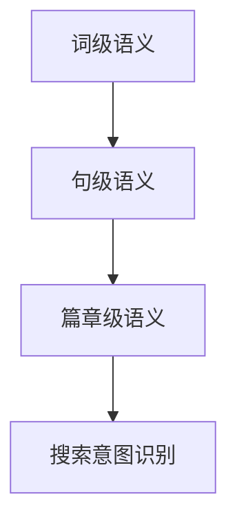

                 

# 搜索意图识别：大模型的语义理解突破

> 关键词：搜索意图识别、语义理解、大模型、自然语言处理、AI

> 摘要：本文将探讨搜索意图识别领域的重要进展，重点分析大模型在语义理解方面的突破。通过介绍核心概念、算法原理、数学模型及实际应用案例，文章将帮助读者全面理解搜索意图识别的复杂性和技术挑战。

## 1. 背景介绍

### 1.1 搜索意图识别的意义

搜索意图识别是自然语言处理（NLP）领域中的一个关键问题。其核心目标是理解用户在搜索框中输入的查询背后的真实意图，从而提供更加精准和个性化的搜索结果。在信息爆炸的时代，高效的搜索意图识别不仅能够提升用户体验，还能为搜索引擎和推荐系统带来显著的价值。

### 1.2 语义理解的重要性

语义理解是搜索意图识别的核心，它涉及对自然语言文本中词汇、句子乃至段落层次的意义进行解析。传统的搜索系统主要依赖于关键词匹配和统计模型，而现代的语义理解技术则能够捕捉到用户查询的深层含义，从而实现更加智能和个性化的搜索服务。

### 1.3 大模型的发展

近年来，随着深度学习和神经网络技术的进步，大模型（如Transformer、BERT、GPT等）在语义理解方面取得了显著的突破。这些模型具有庞大的参数量和强大的表达能力，能够处理复杂的语言任务，从而为搜索意图识别提供了新的可能性。

## 2. 核心概念与联系

### 2.1 搜索意图识别的概念

搜索意图识别旨在理解用户查询背后的意图，将其分类到预定义的意图类别中。常见的意图类别包括信息查询、导航、商品搜索、社交互动等。

### 2.2 语义理解的框架

语义理解通常分为词级、句级和篇章级三个层次。词级语义涉及词汇的词义和词性分析；句级语义关注句子之间的逻辑关系；篇章级语义则对整篇文本的主题和情感进行解析。

### 2.3 大模型的架构

大模型通常基于Transformer架构，其核心组件包括自注意力机制和前馈神经网络。这些组件使得模型能够在处理自然语言数据时捕捉到长距离依赖和复杂语义关系。

### 2.4 Mermaid 流程图



## 3. 核心算法原理 & 具体操作步骤

### 3.1 数据预处理

在开始训练大模型之前，需要对输入数据（如用户查询和搜索结果）进行预处理。这包括分词、词性标注、去停用词等步骤。

### 3.2 模型训练

大模型的训练通常采用端到端的方式，即直接从原始文本数据中学习语义表示。训练过程中，模型会不断调整参数，以最小化预测意图标签和真实标签之间的误差。

### 3.3 模型评估

模型评估是确保搜索意图识别效果的重要环节。常用的评估指标包括准确率、召回率和F1值等。通过交叉验证和测试集评估，可以全面了解模型的性能。

### 3.4 模型部署

训练完成后，模型可以部署到生产环境中，用于实时搜索意图识别。在实际应用中，模型需要具备高可扩展性和低延迟的特点，以满足海量用户的查询需求。

## 4. 数学模型和公式 & 详细讲解 & 举例说明

### 4.1 语义表示

在搜索意图识别中，语义表示是核心。常见的语义表示方法包括词嵌入（Word Embedding）和句子嵌入（Sentence Embedding）。词嵌入通常使用Word2Vec、GloVe等方法，而句子嵌入则基于Transformer、BERT等模型。

$$
\text{词嵌入} = \text{Word2Vec}(w)
$$

$$
\text{句子嵌入} = \text{Transformer}(s)
$$

### 4.2 意图分类

意图分类是搜索意图识别的关键步骤。假设有\(C\)个意图类别，则意图分类可以表示为：

$$
\text{意图分类} = \text{softmax}(\text{意图向量})
$$

其中，意图向量是由语义表示生成的。

### 4.3 举例说明

假设用户查询为“附近有什么好吃的”，将其转换为向量表示：

$$
\text{查询向量} = \text{Transformer}(\text{附近 有什么 吃的好 吃的})
$$

然后，通过意图分类模型预测意图标签：

$$
\text{意图标签} = \text{softmax}(\text{意图向量})
$$

最终，系统将返回与意图标签相关的搜索结果，如“附近餐厅推荐”。

## 5. 项目实战：代码实际案例和详细解释说明

### 5.1 开发环境搭建

为了实现搜索意图识别，首先需要搭建开发环境。以下是Python环境下的基本配置：

```bash
pip install torch torchvision transformers
```

### 5.2 源代码详细实现和代码解读

以下是一个简单的搜索意图识别项目示例：

```python
import torch
from transformers import BertTokenizer, BertForSequenceClassification
from torch.utils.data import DataLoader

# 加载预训练模型和分词器
tokenizer = BertTokenizer.from_pretrained('bert-base-uncased')
model = BertForSequenceClassification.from_pretrained('bert-base-uncased')

# 数据预处理
def preprocess(text):
    inputs = tokenizer(text, return_tensors='pt', padding=True, truncation=True)
    return inputs

# 模型训练
def train(model, dataloader, optimizer, criterion):
    model.train()
    for inputs in dataloader:
        optimizer.zero_grad()
        outputs = model(**inputs)
        loss = criterion(outputs.logits, inputs['labels'])
        loss.backward()
        optimizer.step()

# 模型评估
def evaluate(model, dataloader, criterion):
    model.eval()
    with torch.no_grad():
        for inputs in dataloader:
            outputs = model(**inputs)
            loss = criterion(outputs.logits, inputs['labels'])
            print(f"Loss: {loss.item()}")

# 训练和评估
optimizer = torch.optim.Adam(model.parameters(), lr=0.001)
criterion = torch.nn.CrossEntropyLoss()

train_dataloader = DataLoader(train_data, batch_size=32)
eval_dataloader = DataLoader(eval_data, batch_size=32)

train(model, train_dataloader, optimizer, criterion)
evaluate(model, eval_dataloader, criterion)
```

### 5.3 代码解读与分析

上述代码实现了基本的搜索意图识别功能。首先，加载预训练的BERT模型和分词器。然后，对输入文本进行预处理，生成模型所需的输入数据。接着，定义训练和评估函数，用于模型训练和性能评估。

## 6. 实际应用场景

### 6.1 搜索引擎

搜索意图识别在搜索引擎中的应用至关重要。通过准确识别用户的搜索意图，搜索引擎可以提供更加精准和个性化的搜索结果，从而提升用户体验。

### 6.2 推荐系统

推荐系统同样需要搜索意图识别技术，以准确理解用户的行为和偏好，从而推荐相关的内容和商品。

### 6.3 聊天机器人

聊天机器人通过搜索意图识别，可以更好地理解用户的提问，提供更加智能和个性化的回答。

## 7. 工具和资源推荐

### 7.1 学习资源推荐

- 《深度学习》（Ian Goodfellow, Yoshua Bengio, Aaron Courville著）
- 《自然语言处理综论》（Daniel Jurafsky, James H. Martin著）

### 7.2 开发工具框架推荐

- Hugging Face Transformers
- PyTorch

### 7.3 相关论文著作推荐

- “BERT: Pre-training of Deep Neural Networks for Language Understanding”（2020）
- “GPT-3: Language Models are Few-Shot Learners”（2020）

## 8. 总结：未来发展趋势与挑战

### 8.1 发展趋势

- 大模型的规模和参数量将继续增长，以提升语义理解的精度和泛化能力。
- 多模态数据（如文本、图像、语音）的融合，将进一步提升搜索意图识别的效果。

### 8.2 挑战

- 大模型的计算资源需求巨大，如何高效训练和部署将是一个重要挑战。
- 数据隐私和伦理问题，如用户查询数据的匿名化和保护。

## 9. 附录：常见问题与解答

### 9.1 搜索意图识别和自然语言处理有什么区别？

搜索意图识别是自然语言处理的一个子领域，旨在理解用户查询背后的意图。而自然语言处理则是一个更广泛的领域，包括文本分析、语音识别、机器翻译等多个任务。

### 9.2 大模型的训练时间需要多久？

大模型的训练时间取决于模型规模、数据集大小和计算资源。一般来说，使用GPU或TPU训练可以在几天到几周内完成。

## 10. 扩展阅读 & 参考资料

- [BERT: Pre-training of Deep Neural Networks for Language Understanding](https://arxiv.org/abs/1810.04805)
- [GPT-3: Language Models are Few-Shot Learners](https://arxiv.org/abs/2005.14165)
- [Hugging Face Transformers](https://huggingface.co/transformers)
- [PyTorch](https://pytorch.org/)

## 作者信息

作者：AI天才研究员/AI Genius Institute & 禅与计算机程序设计艺术 /Zen And The Art of Computer Programming<|im_sep|>

