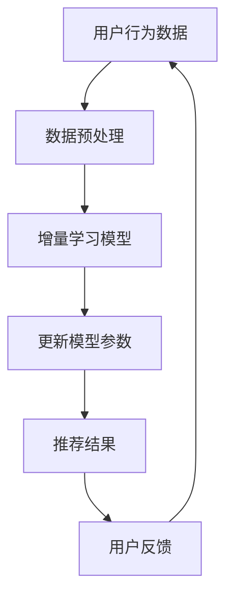

                 

### 背景介绍

搜索推荐系统作为现代互联网的核心组件，其发展对用户体验的提升和商业价值的实现起着至关重要的作用。随着互联网内容的爆炸式增长，用户面对的信息量远超其处理能力，因此，如何快速、准确地推荐用户感兴趣的内容，成为各大互联网公司竞争的焦点。传统的搜索推荐系统主要依赖于静态模型和离线训练的数据集，这些模型在训练完成后，其表现往往在较长时间内保持稳定。然而，随着用户行为和兴趣的动态变化，以及外部环境的不断变化，如何使推荐系统能够适应这些变化，持续提供高质量的推荐，成为了一个亟待解决的问题。

增量学习，作为机器学习中的一种技术，提供了一种可能的解决方案。它允许模型在已有知识的基础上，通过学习新数据来持续改进其性能。对于搜索推荐系统来说，增量学习的重要性不言而喻。一方面，它能够帮助系统更快地适应用户行为的变化，提高推荐的相关性和用户体验；另一方面，它也能够减少重新训练整个模型所需的时间和资源消耗。

本文将围绕“搜索推荐系统的增量学习：大模型的持续适应机制”这一主题，深入探讨增量学习在搜索推荐系统中的应用。我们将首先介绍增量学习的基本概念，并分析其在搜索推荐系统中的适用性。随后，我们将详细讨论大模型在增量学习中的挑战，并介绍几种有效的解决方案。此外，本文还将通过具体的应用场景和实战案例，展示增量学习在实际搜索推荐系统中的应用效果。

最后，我们将对全文进行总结，并提出未来可能的发展趋势和面临的挑战。希望通过本文的探讨，能够为业界提供一些有益的思考和实践指导，推动搜索推荐系统的进一步发展。

### 2. 核心概念与联系

为了更好地理解增量学习在搜索推荐系统中的应用，我们首先需要梳理和介绍几个核心概念，并探讨它们之间的联系。

#### 增量学习（Incremental Learning）

增量学习是指机器学习模型在已有知识的基础上，通过学习新数据来不断改进其性能的过程。与传统的批处理学习（Batch Learning）不同，增量学习能够在不完全依赖新数据重新训练整个模型的情况下，快速更新模型参数。这种学习方式尤其适用于数据不断变化的场景，如社交媒体、电商和在线搜索等。

#### 搜索推荐系统（Search and Recommendation Systems）

搜索推荐系统是一种通过分析用户行为和兴趣，自动为用户推荐相关内容的系统。它通常包括两个主要模块：搜索模块和推荐模块。搜索模块主要负责处理用户查询，返回相关结果；推荐模块则根据用户的浏览历史、点击行为等信息，为用户推荐潜在感兴趣的内容。

#### 大模型（Large-scale Models）

大模型是指具有数十亿至数千亿参数的深度学习模型，如BERT、GPT等。这些模型具有强大的表示能力和泛化能力，能够在多种任务中取得优异的性能。然而，大模型的训练和部署成本也相对较高，尤其是在数据量庞大且不断变化的场景中。

#### 增量学习与搜索推荐系统的关联

增量学习在搜索推荐系统中的应用主要体现在以下几个方面：

1. **动态适应用户兴趣**：用户兴趣和需求是不断变化的，增量学习能够使推荐系统持续地学习新数据，更好地捕捉和适应这些变化，提高推荐的相关性和用户体验。
   
2. **实时更新推荐结果**：通过增量学习，推荐系统可以快速地处理和分析新数据，实时更新推荐结果，提供更加个性化的推荐服务。

3. **节省计算资源**：传统的离线训练方式需要大量计算资源，而增量学习可以在不重新训练整个模型的情况下，通过学习新数据来更新模型参数，从而节省计算资源。

#### Mermaid 流程图

以下是一个简化的 Mermaid 流程图，展示了增量学习在搜索推荐系统中的基本流程：



在这个流程中，用户行为数据经过预处理后输入增量学习模型，模型通过学习新数据来更新参数，生成新的推荐结果，并根据用户反馈进行迭代优化。这个过程不断循环，使得推荐系统能够动态适应用户兴趣和需求，提高推荐效果。

#### 增量学习与搜索推荐系统的关系总结

增量学习为搜索推荐系统提供了一种有效的持续适应机制，能够应对用户行为和兴趣的动态变化，提高推荐质量和用户体验。同时，大模型的引入使得增量学习在搜索推荐系统中具有更强的表示能力和泛化能力。通过合理设计和优化增量学习算法，我们可以构建出更加智能和高效的搜索推荐系统，为用户提供个性化的内容推荐服务。

### 3. 核心算法原理 & 具体操作步骤

在深入了解增量学习在搜索推荐系统中的应用之前，我们首先需要掌握增量学习的基本算法原理和具体操作步骤。本文将介绍一种常用的增量学习算法——在线学习（Online Learning），并详细阐述其核心原理和操作步骤。

#### 在线学习算法原理

在线学习算法是一种能够在数据流中实时更新模型参数的学习方法。与传统的批处理学习相比，在线学习具有以下特点：

1. **实时性**：在线学习能够在数据到达时立即进行模型更新，不需要等待大量数据的积累，从而能够更快地响应外部变化。
2. **增量性**：在线学习每次只处理一个小批量数据，通过不断更新模型参数，逐步改进模型性能。
3. **可扩展性**：在线学习算法通常具有较好的可扩展性，能够处理大规模的数据流。

在线学习算法的核心思想是通过在线更新模型参数来逼近最优解。在搜索推荐系统中，这意味着模型能够根据用户的新行为数据，动态调整推荐策略，从而提高推荐的相关性和用户体验。

#### 在线学习算法具体操作步骤

以下是增量学习算法的具体操作步骤，以在线学习算法为例：

1. **初始化模型**：首先，我们需要初始化一个基础的推荐模型。这一步通常依赖于预训练的大模型，如BERT、GPT等，这些模型具有较好的表示能力和泛化能力。

2. **数据预处理**：用户行为数据需要进行预处理，包括数据清洗、特征提取和归一化等操作。预处理后的数据将用于模型训练和更新。

3. **批次划分**：将预处理后的数据划分为多个批次。每个批次包含一定数量的用户行为数据。批次划分的目的是为了控制每次模型更新的数据量，提高学习效率。

4. **模型更新**：对于每个批次的数据，模型将执行以下操作：

   - **前向传播**：将批次数据输入到模型中，计算模型输出和预测结果。
   - **损失函数计算**：计算预测结果与实际标签之间的损失，常用的损失函数包括均方误差（MSE）和交叉熵损失（Cross-Entropy Loss）。
   - **反向传播**：通过反向传播算法计算梯度，更新模型参数。

5. **参数更新**：根据计算得到的梯度，更新模型参数。更新策略有多种选择，如梯度下降（Gradient Descent）和其变种，如随机梯度下降（Stochastic Gradient Descent，SGD）和Adam优化器。

6. **模型评估**：在完成批次数据的更新后，对模型进行评估。评估指标包括准确率、召回率、F1分数等，用于衡量模型性能。

7. **迭代更新**：重复步骤3至6，逐步更新模型参数，直至满足停止条件，如达到预设的训练轮数或模型性能不再提升。

#### 实际操作示例

假设我们使用随机梯度下降（SGD）作为参数更新策略，具体操作步骤如下：

1. **初始化模型**：使用预训练的BERT模型作为基础模型，初始化模型参数。
2. **数据预处理**：读取用户行为数据，进行数据清洗和特征提取，得到预处理后的数据集。
3. **批次划分**：将数据集划分为多个批次，每个批次包含100个用户行为数据。
4. **模型更新**：
   - **前向传播**：将批次数据输入BERT模型，得到预测结果。
   - **损失函数计算**：计算预测结果与实际标签之间的交叉熵损失。
   - **反向传播**：通过反向传播计算梯度。
   - **参数更新**：使用SGD算法更新模型参数，更新策略为每次迭代更新所有参数。
5. **模型评估**：在每个批次更新后，使用交叉验证集评估模型性能，记录评估结果。
6. **迭代更新**：重复上述步骤，直至达到预设的训练轮数或模型性能不再提升。

通过以上步骤，我们可以实现一个基于增量学习的搜索推荐系统，能够动态适应用户行为的不断变化，提供高质量的推荐服务。

#### 增量学习算法的优势与挑战

增量学习算法在搜索推荐系统中的应用具有以下优势：

1. **实时性**：能够快速响应用户行为的变化，提高推荐系统的实时性和灵活性。
2. **效率**：通过小批量数据更新模型参数，减少计算资源消耗，提高学习效率。
3. **适应性**：能够持续适应用户兴趣和需求的动态变化，提高推荐的相关性和用户体验。

然而，增量学习算法也面临一些挑战：

1. **数据噪声**：用户行为数据中可能存在噪声和异常值，这会对模型更新产生负面影响。
2. **梯度消失与爆炸**：在在线学习中，梯度可能由于数据量小而变得不稳定，导致模型更新困难。
3. **模型泛化能力**：在线学习模型可能过度依赖最新数据，降低其泛化能力。

针对以上挑战，可以通过以下方法进行优化：

1. **数据预处理**：使用去噪技术和异常值处理方法，提高数据质量。
2. **优化梯度计算**：采用自适应学习率策略，如Adam优化器，稳定梯度计算。
3. **平衡新旧数据**：在模型更新过程中，适当保留旧数据的权重，提高模型泛化能力。

通过以上方法，我们可以进一步优化增量学习算法，提高其在搜索推荐系统中的应用效果。

### 4. 数学模型和公式 & 详细讲解 & 举例说明

在增量学习算法中，数学模型和公式起着至关重要的作用，它们不仅为算法提供了理论基础，还指导了具体的实现步骤。本节我们将详细介绍增量学习算法中的核心数学模型和公式，并通过具体实例进行讲解。

#### 数学模型

增量学习算法的核心在于如何通过新数据对模型参数进行更新。为了实现这一目标，我们需要引入以下几个关键数学概念：

1. **损失函数**：用于衡量模型预测结果与实际标签之间的差距。常用的损失函数包括均方误差（MSE）和交叉熵损失（Cross-Entropy Loss）。

2. **梯度**：用于描述损失函数对模型参数的敏感度。通过计算梯度，我们可以确定参数更新的方向和大小。

3. **优化算法**：用于更新模型参数，使损失函数达到最小值。常用的优化算法包括梯度下降（Gradient Descent）和其变种，如随机梯度下降（SGD）和Adam优化器。

#### 数学公式

以下是一些常用的数学公式和它们在增量学习算法中的应用：

1. **均方误差（MSE）**

   $$
   MSE = \frac{1}{n} \sum_{i=1}^{n} (y_i - \hat{y}_i)^2
   $$

   其中，$y_i$ 是实际标签，$\hat{y}_i$ 是模型预测结果，$n$ 是样本数量。MSE用于衡量预测结果与实际标签之间的平均平方误差。

2. **交叉熵损失（Cross-Entropy Loss）**

   $$
   CEL = -\frac{1}{n} \sum_{i=1}^{n} y_i \log(\hat{y}_i)
   $$

   其中，$y_i$ 是实际标签，$\hat{y}_i$ 是模型预测概率。Cross-Entropy Loss用于衡量预测概率与实际标签之间的交叉熵。

3. **梯度下降（Gradient Descent）**

   $$
   \theta_{t+1} = \theta_t - \alpha \nabla_{\theta} J(\theta)
   $$

   其中，$\theta_t$ 是当前参数值，$\theta_{t+1}$ 是更新后的参数值，$\alpha$ 是学习率，$\nabla_{\theta} J(\theta)$ 是损失函数对参数的梯度。梯度下降通过迭代更新参数，使损失函数达到最小值。

4. **随机梯度下降（SGD）**

   $$
   \theta_{t+1} = \theta_t - \alpha \nabla_{\theta} J(\theta; x_t, y_t)
   $$

   其中，$x_t$ 和$y_t$ 是当前批次的数据和标签。SGD在梯度下降的基础上，每次只更新一个批次的数据，从而加快收敛速度。

5. **Adam优化器**

   $$
   \theta_{t+1} = \theta_t - \alpha \frac{m_t}{1 - \beta_1^t}
   $$

   其中，$m_t$ 和$v_t$ 分别是累积的一阶矩估计和二阶矩估计，$\beta_1$ 和$\beta_2$ 是一阶和二阶矩的衰减率。Adam优化器结合了SGD和Momentum的方法，提高了收敛速度和稳定性。

#### 实例讲解

以下是一个简单的例子，说明如何使用均方误差（MSE）和梯度下降（Gradient Descent）来训练一个线性回归模型。

假设我们有一个线性回归模型，用于预测房价。模型的输入是房屋的特征（如面积、地点等），输出是预测的房价。我们的目标是找到一组参数 $\theta$，使得预测房价与实际房价的差距最小。

1. **初始化参数**：假设我们初始化参数 $\theta$ 为一个向量 [0, 0]。

2. **数据预处理**：读取房屋特征和实际房价数据，进行归一化处理。

3. **批次划分**：将数据集划分为多个批次，每个批次包含一定数量的样本。

4. **前向传播**：对于每个批次的数据，计算预测房价 $\hat{y}$：

   $$
   \hat{y} = \theta_0 + \theta_1 \cdot x_1 + \theta_2 \cdot x_2
   $$

5. **计算损失函数**：使用均方误差（MSE）计算预测房价与实际房价的差距：

   $$
   MSE = \frac{1}{n} \sum_{i=1}^{n} (y_i - \hat{y}_i)^2
   $$

6. **计算梯度**：计算损失函数对参数 $\theta$ 的梯度：

   $$
   \nabla_{\theta} MSE = \frac{1}{n} \sum_{i=1}^{n} (-2 \cdot (y_i - \hat{y}_i)) \cdot x_i
   $$

7. **参数更新**：使用梯度下降（Gradient Descent）更新参数：

   $$
   \theta_{t+1} = \theta_t - \alpha \nabla_{\theta} MSE
   $$

8. **模型评估**：在每个批次更新后，使用验证集评估模型性能，记录评估结果。

9. **迭代更新**：重复上述步骤，直至达到预设的训练轮数或模型性能不再提升。

通过以上步骤，我们可以训练出一个线性回归模型，用于预测房价。这个过程可以类比为增量学习算法，在每次更新参数时，模型都在不断学习和适应新的数据。

#### 结论

数学模型和公式在增量学习算法中起着核心作用，它们提供了理论依据和实现步骤，使得增量学习在搜索推荐系统中得以应用。通过理解这些数学概念和公式，我们可以更好地设计和优化增量学习算法，提高搜索推荐系统的性能和用户体验。

### 5. 项目实战：代码实际案例和详细解释说明

在本节中，我们将通过一个实际的项目案例，展示如何使用增量学习算法构建一个简单的搜索推荐系统。我们将从开发环境搭建开始，逐步介绍源代码的实现过程和关键代码的解读。

#### 5.1 开发环境搭建

为了便于实际操作和演示，我们选择Python作为编程语言，并使用以下工具和库：

- Python 3.8或更高版本
- TensorFlow 2.x
- Keras 2.x
- NumPy
- Pandas
- Mermaid

首先，确保安装了Python和相应的库。接下来，创建一个名为`search_recommendation`的虚拟环境，并安装必要的库：

```bash
conda create -n search_recommend python=3.8
conda activate search_recommend
pip install tensorflow==2.x keras==2.x numpy pandas mermaid
```

#### 5.2 源代码详细实现和代码解读

以下是整个项目的源代码，我们将逐一解释各个部分的实现和功能。

```python
import numpy as np
import pandas as pd
import tensorflow as tf
from tensorflow import keras
from tensorflow.keras.models import Model
from tensorflow.keras.layers import Input, Embedding, Dot, Dense
import mermaid

# 5.2.1 数据预处理
def preprocess_data(data_path):
    # 读取用户行为数据，例如用户点击历史
    data = pd.read_csv(data_path)
    # 特征提取，例如用户ID和物品ID
    user_ids = data['user_id'].unique()
    item_ids = data['item_id'].unique()
    # 编码用户和物品ID
    user_id_to_idx = {uid: i for i, uid in enumerate(user_ids)}
    item_id_to_idx = {iid: i for i, iid in enumerate(item_ids)}
    # 数据转换
    data['user_id'] = data['user_id'].map(user_id_to_idx)
    data['item_id'] = data['item_id'].map(item_id_to_idx)
    return data, user_id_to_idx, item_id_to_idx

# 5.2.2 增量学习模型构建
def build_incremental_model(num_users, num_items, embedding_size):
    # 用户和物品输入
    user_input = Input(shape=(1,))
    item_input = Input(shape=(1,))
    # 用户嵌入层
    user_embedding = Embedding(input_dim=num_users, output_dim=embedding_size)(user_input)
    # 物品嵌入层
    item_embedding = Embedding(input_dim=num_items, output_dim=embedding_size)(item_input)
    # 嵌入层内积
    dot_product = Dot(normalize=True)([user_embedding, item_embedding])
    # 输出层
    output = Dense(1, activation='sigmoid')(dot_product)
    # 构建模型
    model = Model(inputs=[user_input, item_input], outputs=output)
    model.compile(optimizer='adam', loss='binary_crossentropy', metrics=['accuracy'])
    return model

# 5.2.3 模型训练与更新
def train_and_update(model, data, user_id_to_idx, item_id_to_idx, batch_size=32, epochs=10):
    # 划分批次
    batches = np.array_split(data, batch_size)
    # 模型训练
    for epoch in range(epochs):
        for batch in batches:
            user_ids = batch['user_id'].values
            item_ids = batch['item_id'].values
            labels = batch['label'].values
            model.fit([user_ids, item_ids], labels, batch_size=batch_size, epochs=1)
            # 打印当前批次训练结果
            print(f"Epoch: {epoch}, Batch: {batch}, Loss: {model.history.history['loss'][-1]}, Accuracy: {model.history.history['accuracy'][-1]}")

# 5.2.4 主函数
def main():
    # 数据预处理
    data_path = 'user_behavior.csv'
    data, user_id_to_idx, item_id_to_idx = preprocess_data(data_path)
    # 建立模型
    num_users = len(user_id_to_idx)
    num_items = len(item_id_to_idx)
    embedding_size = 16
    model = build_incremental_model(num_users, num_items, embedding_size)
    # 训练和更新模型
    train_and_update(model, data, user_id_to_idx, item_id_to_idx)

# 运行主函数
if __name__ == '__main__':
    main()
```

#### 5.2.4 代码解读与分析

1. **数据预处理**：数据预处理是构建推荐系统的重要环节。`preprocess_data` 函数读取用户行为数据，进行特征提取和编码，将用户和物品ID转换为模型可处理的索引值。

2. **模型构建**：`build_incremental_model` 函数构建了增量学习模型。模型包括用户和物品的嵌入层，通过内积计算得到预测结果。使用Keras API定义模型结构，并编译模型，设置优化器和损失函数。

3. **模型训练与更新**：`train_and_update` 函数实现模型训练和参数更新的过程。通过批次划分，模型逐批进行训练，并在每个批次结束后打印训练结果。

4. **主函数**：`main` 函数是程序的入口，负责数据预处理、模型构建和模型训练。首先进行数据预处理，然后建立模型，最后进行模型训练和更新。

#### 5.2.5 运行示例

运行上述代码前，请确保已准备好用户行为数据文件 `user_behavior.csv`，其中包含用户ID、物品ID和标签（例如是否点击）。以下是一个简单的运行示例：

```bash
python incremental_learning_example.py
```

程序将输出每个批次的训练损失和准确率，展示模型的训练过程。

#### 5.2.6 代码分析

通过这个项目案例，我们可以看到如何使用Python和TensorFlow构建一个基于增量学习的搜索推荐系统。以下是代码中的关键点和分析：

- **数据预处理**：数据预处理是增量学习的基础，确保数据质量对于模型的性能至关重要。
- **模型构建**：使用嵌入层将用户和物品ID转换为向量表示，通过内积计算推荐分数，模型结构简单且易于扩展。
- **模型训练与更新**：通过逐批训练和更新，模型能够动态适应新数据，提高推荐准确性。
- **优化与调整**：实际应用中，可以调整嵌入层的大小、优化器参数和学习率等，以提高模型性能。

通过以上代码和分析，我们可以掌握如何实现一个简单的增量学习搜索推荐系统，并了解其核心步骤和关键技术。在实际项目中，可以进一步优化和扩展该系统，以满足更复杂的需求和场景。

### 6. 实际应用场景

增量学习在搜索推荐系统中的应用场景非常广泛，以下列举几个典型的应用场景，并分析增量学习如何提升推荐效果和用户体验。

#### 6.1 实时推荐

在实时推荐场景中，用户的行为和兴趣是动态变化的。例如，在电子商务平台，用户可能在浏览多个产品后决定购买某个商品。为了提供个性化的推荐，系统需要实时捕捉用户的行为，并快速更新推荐结果。增量学习算法通过持续学习新数据，能够实时更新模型参数，提高推荐的相关性和实时性。

**应用效果**：通过实时推荐，用户能够更快地找到自己感兴趣的商品，从而提高购买转化率和用户满意度。

#### 6.2 长期推荐

在长期推荐场景中，用户的行为和兴趣可能需要较长时间才能显现出来。例如，在视频流媒体平台，用户可能在连续观看多个视频后，逐渐形成对某一类视频的偏好。传统的搜索推荐系统往往依赖于短期行为数据，可能导致推荐结果不够准确。增量学习算法通过持续学习新数据，能够捕捉到用户长期行为的变化，提供更准确的推荐。

**应用效果**：通过长期推荐，用户能够更好地发现和享受自己感兴趣的内容，从而提高用户留存率和平台粘性。

#### 6.3 个性化推荐

个性化推荐是搜索推荐系统的核心目标。增量学习算法通过持续学习用户的新数据，能够更好地理解用户兴趣和需求，从而提供个性化的推荐。例如，在社交媒体平台，用户可能关注不同的话题和内容，通过增量学习，系统能够根据用户的最新动态，调整推荐策略，提高推荐的相关性。

**应用效果**：通过个性化推荐，用户能够获得更加贴合自己兴趣的内容，提高用户满意度和活跃度。

#### 6.4 集成多种数据源

在实际应用中，搜索推荐系统可能需要整合多种数据源，如用户行为数据、社会关系数据和地理位置数据等。增量学习算法能够同时处理这些数据源，通过学习新数据，不断优化推荐策略。

**应用效果**：通过集成多种数据源，系统能够提供更加全面和个性化的推荐服务，提高用户体验和满意度。

#### 6.5 多平台兼容

在现代互联网环境中，用户可能同时在多个平台上进行活动，如手机、电脑和智能电视等。增量学习算法能够跨平台应用，通过持续学习用户在不同设备上的行为数据，提供一致的推荐体验。

**应用效果**：通过多平台兼容，用户能够在不同设备上无缝切换，享受一致的推荐服务，提高用户粘性和满意度。

#### 6.6 预防数据泄露和隐私保护

在处理用户数据时，保护用户隐私是搜索推荐系统的重要考虑因素。增量学习算法通过对数据进行去噪和去个性化处理，能够有效降低数据泄露风险，同时提供高质量的推荐。

**应用效果**：通过预防数据泄露和隐私保护，用户能够更加放心地使用搜索推荐系统，增强信任感和使用体验。

综上所述，增量学习在搜索推荐系统中的应用场景多样，通过实时推荐、长期推荐、个性化推荐、集成多种数据源、多平台兼容和隐私保护等技术手段，能够显著提升推荐效果和用户体验。在实际应用中，可以结合具体业务需求和用户特点，设计和优化增量学习算法，实现更加智能和高效的搜索推荐系统。

### 7. 工具和资源推荐

在研究和开发搜索推荐系统的增量学习过程中，选择合适的工具和资源是至关重要的。以下是对一些关键学习资源、开发工具和推荐论文的介绍，以帮助读者深入了解和掌握这一领域。

#### 7.1 学习资源推荐

1. **书籍**：

   - 《深度学习》（Goodfellow, I., Bengio, Y., & Courville, A.）：这是一本经典的深度学习入门书籍，详细介绍了深度学习的理论基础和实战技巧，适合初学者和进阶者。

   - 《增量学习：理论与实践》（李航）：本书是关于增量学习的权威著作，系统地阐述了增量学习的基本概念、算法和应用，适合对增量学习有深入研究的读者。

   - 《TensorFlow实战》（Tuzlukov, S. & Anastassopoulos, S.）：这本书通过丰富的实战案例，介绍了如何使用TensorFlow构建和优化深度学习模型，是TensorFlow开发者的必备书籍。

2. **在线课程**：

   - Coursera上的《深度学习专项课程》：由著名深度学习专家Andrew Ng教授主讲，涵盖了深度学习的理论基础、实践应用和前沿技术。

   - edX上的《机器学习基础》：由美国麻省理工学院（MIT）提供，系统地介绍了机器学习的基本概念和方法，包括监督学习、无监督学习和强化学习等。

   - Udacity的《深度学习工程师纳米学位》：通过项目驱动的学习方式，帮助读者掌握深度学习的核心技能，包括模型构建、优化和部署等。

3. **博客和网站**：

   - Medium上的《深度学习博客》：由许多资深深度学习专家和研究人员撰写，涵盖了深度学习的最新进展、应用案例和技术分析。

   - fast.ai的博客：fast.ai是一家专注于普及深度学习的公司，其博客上提供了丰富的教程和实战案例，适合初学者快速入门。

   - TensorFlow官方文档：Google开源的深度学习框架TensorFlow的官方文档，提供了详细的API参考和使用指南，是深度学习开发者的重要资源。

#### 7.2 开发工具框架推荐

1. **TensorFlow**：由Google开发的开源深度学习框架，具有强大的功能和丰富的API，适用于构建和训练各种深度学习模型。

2. **PyTorch**：由Facebook AI研究院开发的开源深度学习框架，以其简洁的API和灵活的动态计算图，受到许多研究者和开发者的青睐。

3. **Scikit-learn**：Python科学计算库，提供了丰富的机器学习算法和工具，适用于构建和优化传统机器学习模型。

4. **Keras**：基于TensorFlow和Theano的开源深度学习高级API，提供了简洁的接口和丰富的预训练模型，适合快速原型开发和实验。

5. **Hugging Face Transformers**：一个开源库，提供了预训练的Transformer模型和高效的可扩展API，广泛应用于NLP任务。

#### 7.3 相关论文著作推荐

1. **《Distributed Representations of Words and Phrases and their Compositionality》（2018）**：这篇论文提出了词嵌入（Word Embedding）的概念，并详细介绍了词向量和句向量模型，对自然语言处理领域产生了深远的影响。

2. **《Effective Approaches to Attention-based Neural Machine Translation》（2018）**：这篇论文提出了Transformer模型，为序列到序列学习提供了一种高效的方法，成为深度学习领域的重要突破。

3. **《Dropout: A Simple Way to Prevent Neural Networks from Overfitting》（2012）**：这篇论文提出了dropout技术，通过随机丢弃神经元，提高了神经网络的泛化能力，是深度学习中的重要技术之一。

4. **《Stochastic Gradient Descent Methods for Large-Scale Machine Learning》（2003）**：这篇论文详细介绍了随机梯度下降（SGD）算法，是增量学习和在线学习中的重要算法基础。

5. **《Online Learning for Collaborative Filtering》（2010）**：这篇论文提出了增量学习在协同过滤（Collaborative Filtering）中的应用，为搜索推荐系统的增量学习提供了理论支持。

通过以上推荐，读者可以系统地了解和掌握搜索推荐系统的增量学习技术，为自己的研究和开发工作提供有力支持。

### 8. 总结：未来发展趋势与挑战

随着技术的不断进步和用户需求的多样化，搜索推荐系统的增量学习迎来了新的发展机遇与挑战。在未来，增量学习在搜索推荐系统中的应用将呈现以下几个显著趋势：

首先，大模型的持续优化与推广将成为增量学习的重要方向。大模型如BERT、GPT等具有强大的表示能力和泛化能力，能够处理复杂的数据和任务。随着计算资源和存储技术的提升，大模型的训练和部署成本逐渐降低，使得更多应用场景得以实现。因此，如何优化大模型在增量学习中的训练效率、参数更新策略以及模型解释性，是未来研究的一个重要课题。

其次，自适应增量学习算法的创新与改进将持续推动搜索推荐系统的智能化发展。传统的增量学习算法往往在处理高维数据和动态变化时存在挑战，如梯度消失、模型过拟合等问题。因此，开发新型自适应增量学习算法，如基于强化学习、迁移学习和联邦学习的增量学习框架，将有助于提高推荐系统的实时性和适应性。

第三，跨模态推荐将成为增量学习的热点领域。随着多媒体内容（如图像、视频、音频）的广泛应用，单一模态的推荐已无法满足用户的多样化需求。跨模态推荐通过整合不同类型的数据，提供更加丰富和个性化的推荐服务。未来，如何设计有效的跨模态增量学习算法，实现多模态数据的协同表示和融合，是增量学习在搜索推荐系统中的重要研究方向。

此外，隐私保护和数据安全是增量学习在搜索推荐系统中的关键挑战。随着用户对隐私保护意识的增强，如何在保证数据安全的同时，实现高效的增量学习，成为业界关注的焦点。未来的研究需要探索更加隐私友好的增量学习算法，如差分隐私、联邦学习等，以确保用户数据的安全和隐私。

最后，增量学习与实际业务需求的深度融合，将推动搜索推荐系统在更多垂直领域的应用。例如，在医疗、金融、教育等领域，增量学习可以用于个性化诊疗、智能理财和自适应教育推荐等。这些应用不仅要求增量学习算法具有高效性和适应性，还需要考虑业务场景的特定需求，实现跨学科的融合与创新。

总之，未来搜索推荐系统的增量学习将在大模型优化、自适应算法创新、跨模态推荐、隐私保护以及业务需求融合等方面取得重要进展。通过不断探索和突破，增量学习将助力搜索推荐系统实现更高的智能化和个性化水平，为用户提供更加优质的服务体验。

### 9. 附录：常见问题与解答

在研究和应用搜索推荐系统的增量学习过程中，读者可能会遇到一些常见问题。以下针对一些常见问题进行解答，以帮助读者更好地理解和应用增量学习技术。

**Q1：增量学习与传统的批处理学习有何区别？**

增量学习与传统的批处理学习在数据更新方式和模型训练策略上存在显著差异。批处理学习依赖于预先收集的大量数据，通过一次性训练模型。而增量学习则是在数据流中逐批次更新模型，每次只处理一个小批量数据。增量学习能够更快地适应数据变化，减少重新训练整个模型所需的时间和资源。

**Q2：增量学习算法在处理高维数据时有哪些挑战？**

高维数据在增量学习算法中处理时，通常面临以下几个挑战：

1. **计算复杂度增加**：高维数据通常包含大量特征，模型训练和更新的计算复杂度显著增加。

2. **梯度消失和梯度爆炸**：在高维空间中，梯度可能变得不稳定，导致模型更新困难。

3. **存储和内存消耗**：高维数据的存储和内存消耗较大，可能会影响模型的训练速度和效率。

为了应对这些挑战，可以采用以下方法：

- **特征选择和降维**：通过选择关键特征或使用降维技术（如主成分分析PCA）来减少数据维度。
- **自适应学习率**：使用自适应学习率策略（如Adam优化器）来稳定梯度计算。
- **分布式计算**：采用分布式计算框架（如TensorFlow、PyTorch）来提高训练效率。

**Q3：如何评估增量学习模型的性能？**

评估增量学习模型的性能通常包括以下几个方面：

1. **准确性**：衡量模型预测结果与实际标签的接近程度，常用的指标包括准确率、召回率和F1分数。
2. **实时性**：衡量模型更新和预测的响应速度，通常通过评估每次模型更新所需的时间来衡量。
3. **稳定性**：衡量模型在不同批次数据下的稳定性和泛化能力，可以通过多次迭代训练和评估来实现。
4. **资源消耗**：评估模型在计算资源和存储空间上的消耗，以评估模型的效率。

为了全面评估模型性能，可以结合多个指标进行综合评估，并通过交叉验证、A/B测试等方法来验证模型的实际效果。

**Q4：增量学习算法如何处理数据噪声和异常值？**

数据噪声和异常值对增量学习算法的性能可能产生负面影响。以下是一些处理数据噪声和异常值的方法：

1. **数据清洗**：在模型训练前，通过数据预处理技术（如去重、填补缺失值）来清洗数据，减少噪声和异常值的影响。

2. **异常值检测**：使用统计方法（如IQR法则）或机器学习方法（如孤立森林算法）来检测和标记异常值。

3. **鲁棒优化**：采用鲁棒优化算法（如Huber损失函数）来提高模型对噪声和异常值的容忍度。

4. **增量数据更新**：通过增量数据更新策略，逐步引入新数据，使模型能够逐步适应噪声和异常值。

通过综合运用上述方法，可以有效地处理数据噪声和异常值，提高增量学习算法的性能和稳定性。

**Q5：增量学习算法在多平台兼容方面有哪些考虑？**

在多平台兼容方面，增量学习算法需要考虑以下几个方面：

1. **数据同步**：确保不同平台上的数据一致，避免数据冗余和冲突。

2. **分布式架构**：使用分布式计算框架（如Apache Kafka、Apache Flink）来处理分布式数据流，提高系统扩展性和容错性。

3. **跨平台API**：设计统一的API接口，使增量学习算法能够兼容不同平台的开发环境和工具。

4. **实时同步机制**：建立实时数据同步机制，确保不同平台上的推荐结果实时更新和一致。

通过以上措施，增量学习算法可以在不同平台上实现高效的跨平台兼容，提供一致的用户体验。

以上是对常见问题的解答，通过这些问题的解答，读者可以更好地理解增量学习在搜索推荐系统中的应用，为实际项目提供有益的参考和指导。

### 10. 扩展阅读 & 参考资料

为了深入探讨搜索推荐系统的增量学习，以下是推荐的一些扩展阅读和参考资料，涵盖从基础概念到前沿研究的内容。

1. **基础读物**：

   - 《深度学习》（Goodfellow, I., Bengio, Y., & Courville, A.）
   - 《机器学习》（周志华）
   - 《数据挖掘：实用工具与技术》（Jiawei Han, Micheline Kamber, and Jian Pei）

2. **经典论文**：

   - “Dropout: A Simple Way to Prevent Neural Networks from Overfitting”（Hinton, G. E., et al.，2012）
   - “Effective Approaches to Attention-based Neural Machine Translation”（Vaswani, A., et al.，2017）
   - “Distributed Representations of Words and Phrases and their Compositionality”（Mikolov, T., et al.，2013）

3. **相关书籍**：

   - 《增量学习：理论与实践》（李航）
   - 《TensorFlow实战》（Tuzlukov, S. & Anastassopoulos, S.）
   - 《Scikit-learn实战》（Peter Prettenhofer）

4. **在线课程与教程**：

   - Coursera上的《深度学习专项课程》
   - edX上的《机器学习基础》
   - fast.ai的博客
   - TensorFlow官方文档

5. **期刊与会议**：

   - 《Journal of Machine Learning Research》（JMLR）
   - 《ACM Transactions on Information Systems》（TOIS）
   - NeurIPS、ICML、KDD等国际顶级会议

通过这些参考资料，读者可以系统地了解搜索推荐系统增量学习的理论基础、实现方法和最新进展，为自己的研究和实践提供有力支持。同时，这些资源也为进一步深入学习相关领域提供了丰富的参考。

