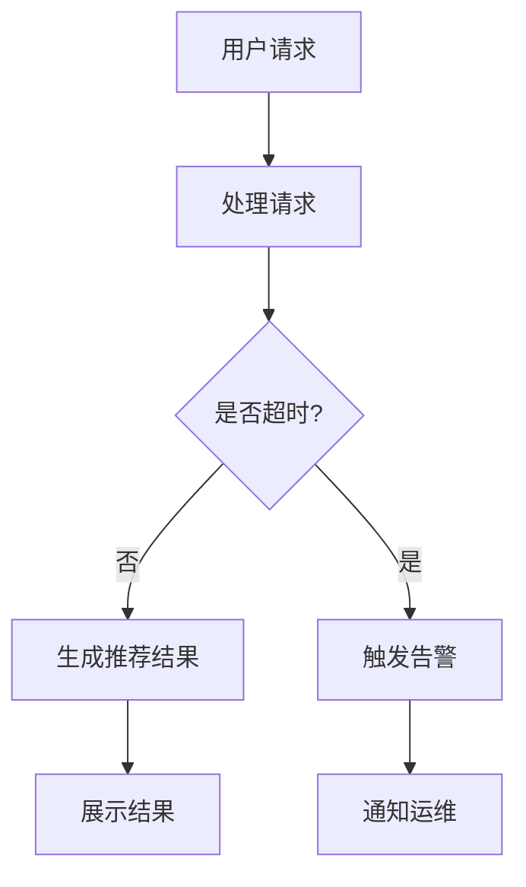

                 

### 背景介绍

随着互联网的快速发展，搜索引擎和推荐系统已成为人们日常生活不可或缺的一部分。从早期的静态推荐到如今基于深度学习的大模型推荐，搜索推荐系统在满足用户个性化需求、提高用户满意度方面发挥了重要作用。然而，随着数据规模的急剧增长和用户需求的多样化，如何确保推荐系统的实时性能，成为当前研究的热点和难点。

实时性能监控是保证搜索推荐系统稳定运行的关键。它不仅关系到用户体验，还影响到平台的商业利益。在传统方法中，性能监控主要依赖离线数据分析，这种方法存在响应速度慢、难以及时发现和处理问题的缺陷。随着人工智能技术的不断发展，尤其是大模型时代的到来，实时性能监控的方法也亟需创新。

本文旨在探讨大模型时代下的实时性能监控新方法，帮助读者了解当前领域的最新研究进展，掌握关键技术和实际应用。文章将首先介绍搜索推荐系统的基础概念，随后深入探讨实时性能监控的核心概念和架构，接着分析大模型在性能监控中的应用，最后通过实际案例和数学模型，展示新方法的具体实现和效果。

通过本文的阅读，读者将能够全面了解实时性能监控的重要性，掌握大模型时代下的新方法，并能够结合实际场景进行应用和优化。希望本文能够为广大研究人员和实践者提供有价值的参考，共同推动搜索推荐系统实时性能监控技术的发展。

### 核心概念与联系

#### 搜索推荐系统的基本概念

搜索推荐系统是一种利用人工智能和机器学习技术，为用户提供个性化推荐服务的系统。其核心在于通过分析用户的搜索历史、行为数据、兴趣偏好等，从海量的信息中提取用户可能感兴趣的内容，并进行精准推荐。搜索推荐系统通常包含以下几个基本组成部分：

1. **用户画像**：通过用户的历史行为数据，如搜索关键词、浏览记录、点击行为等，构建用户画像，以反映用户的兴趣偏好和需求。

2. **内容库**：存储大量的文本、图片、视频等类型的信息，为推荐算法提供数据基础。

3. **推荐算法**：包括基于内容的推荐、协同过滤、深度学习等算法，根据用户画像和内容库，生成个性化的推荐结果。

4. **推荐结果展示**：将推荐结果以合适的格式和形式呈现给用户，如列表、卡片、轮播图等。

#### 实时性能监控的基本概念

实时性能监控是确保搜索推荐系统稳定高效运行的关键。它不仅涉及系统的响应速度、吞吐量、延迟等指标，还包括系统的稳定性、可靠性和可用性。实时性能监控的基本概念包括以下几个方面：

1. **监控指标**：常见的监控指标包括响应时间、请求吞吐量、错误率、并发用户数、资源利用率等。

2. **监控周期**：通常分为实时监控和定期监控。实时监控能够及时发现和处理问题，定期监控则用于长期的性能分析和趋势预测。

3. **告警机制**：通过设置阈值和规则，当监控指标超过预设的阈值时，系统能够自动发送告警通知，提醒运维人员采取相应措施。

4. **数据可视化**：通过图形化的方式展示监控数据，帮助运维人员快速了解系统的运行状态和性能表现。

#### 大模型与实时性能监控的联系

大模型，如深度学习模型，在搜索推荐系统中发挥着至关重要的作用。然而，大模型的引入也带来了新的挑战，如模型复杂度高、训练时间长、资源消耗大等。因此，实时性能监控在大模型时代显得尤为重要。以下是几个关键点：

1. **模型复杂度**：随着模型参数和训练数据的增加，模型的复杂度显著上升，对计算资源的需求也急剧增加。实时性能监控需要确保模型在不同规模的数据集上都能高效运行。

2. **计算资源优化**：大模型训练和推理过程中对计算资源的消耗巨大，实时性能监控需要优化资源分配和调度，确保系统能够在高负载情况下稳定运行。

3. **延迟敏感度**：搜索推荐系统对延迟非常敏感，用户往往无法容忍较长的响应时间。实时性能监控需要快速响应，以减少系统的延迟。

4. **动态调整**：实时性能监控不仅要监控当前状态，还需要根据系统的负载变化动态调整模型参数和资源配置，以维持系统的最佳性能。

#### Mermaid 流程图

下面是一个简化的 Mermaid 流程图，展示了搜索推荐系统中实时性能监控的核心流程：



在这个流程图中，用户请求首先进入系统，系统处理请求并检查是否超时。如果没有超时，则生成推荐结果并展示给用户；如果超时，则触发告警机制并通知运维人员。

通过上述核心概念和联系的介绍，我们为后续详细探讨实时性能监控的大模型方法奠定了基础。在接下来的部分，我们将深入分析实时性能监控的核心算法原理和具体操作步骤。

#### 核心算法原理 & 具体操作步骤

实时性能监控的核心在于如何快速、准确地获取系统的性能指标，并对这些指标进行分析和告警。在大模型时代，这一任务变得更加复杂，因为大模型的引入不仅增加了系统的计算负载，还带来了模型训练和推理过程中的不确定性。以下是实时性能监控的核心算法原理和具体操作步骤。

##### 监控指标的选择

首先，我们需要明确哪些监控指标对搜索推荐系统的性能至关重要。以下是几种常用的监控指标：

1. **响应时间**：系统处理用户请求所需的时间，是衡量系统性能最直接的指标。理想的响应时间应该尽可能短，以提升用户体验。

2. **请求吞吐量**：单位时间内系统能够处理的请求数量，反映了系统的处理能力。高吞吐量意味着系统能够处理更多用户请求，提高系统效率。

3. **错误率**：系统处理请求时发生的错误比例。错误率低表明系统稳定可靠，高错误率则可能意味着系统存在严重问题。

4. **资源利用率**：包括CPU、内存、网络带宽等资源的使用情况。资源利用率高表明系统资源得到充分利用，但过高的资源利用率可能导致系统过载。

##### 数据采集

为了实时监控这些指标，我们需要首先实现数据采集。数据采集可以通过以下几种方式进行：

1. **系统日志**：系统运行过程中自动生成的日志文件，记录了系统在各种操作中的详细情况。通过分析日志，可以获取系统的运行状态和性能指标。

2. **性能监控工具**：如Prometheus、Grafana等，它们能够实时采集系统的各种性能数据，并提供可视化的监控界面。

3. **API接口**：通过系统的API接口，可以直接获取系统的性能数据。这种方式的优点是数据获取快速，且便于与其他系统进行集成。

##### 数据处理

采集到的原始数据通常是杂乱无章的，我们需要对其进行处理，以便进行有效的性能监控。数据处理的主要步骤包括：

1. **数据清洗**：去除无效、重复或错误的数据，确保数据的准确性和一致性。

2. **数据聚合**：将原始数据进行聚合，生成具有代表性的监控数据。例如，将每分钟的请求量、响应时间等指标进行汇总。

3. **数据归一化**：对不同量纲的数据进行归一化处理，使得不同指标之间具有可比性。

##### 性能分析

通过对处理后的数据进行性能分析，我们可以评估系统的运行状况。以下是几种常用的性能分析方法：

1. **统计方法**：通过计算均值、方差、中位数等统计量，评估系统的性能稳定性。

2. **趋势分析**：通过绘制时间序列图，观察指标随时间的变化趋势，及时发现异常情况。

3. **告警规则**：设定阈值和规则，当监控指标超过阈值时，自动触发告警。常见的告警规则包括最大值、最小值、平均值等。

##### 实际操作步骤

以下是实时性能监控的具体操作步骤：

1. **环境搭建**：安装并配置性能监控工具，如Prometheus和Grafana。确保系统能够正常采集和处理性能数据。

2. **数据采集**：通过系统日志、性能监控工具和API接口，采集系统的性能数据。配置数据采集规则，确保数据能够实时更新。

3. **数据处理**：对采集到的数据进行清洗、聚合和归一化处理，生成具有代表性的监控数据。

4. **性能分析**：使用统计方法、趋势分析和告警规则，对监控数据进行分析，评估系统的运行状况。

5. **告警通知**：当监控指标超过阈值时，自动触发告警，并通过短信、邮件、即时通讯工具等方式通知运维人员。

6. **优化调整**：根据分析结果，对系统进行优化调整，提高系统的性能和稳定性。

通过上述核心算法原理和具体操作步骤，我们可以实现对搜索推荐系统实时性能的监控。在接下来的部分，我们将进一步探讨大模型在实时性能监控中的应用，以及如何利用大模型的优势进行性能优化。

#### 数学模型和公式 & 详细讲解 & 举例说明

在大模型时代，实时性能监控的数学模型和公式成为理解系统行为和优化性能的关键工具。以下将详细介绍几个核心的数学模型和公式，并使用具体的例子进行解释。

##### 指标计算公式

首先，我们需要明确几个核心监控指标的计算公式。

1. **响应时间（Response Time）**：
   响应时间是指系统从接收到用户请求到返回结果所需的时间。其计算公式为：

   $$ Response\ Time = \frac{Sum(Processing\ Time)}{Number\ of\ Requests} $$

   其中，Processing Time 为系统处理每个请求所需的时间，Number of Requests 为请求的总数。

2. **请求吞吐量（Throughput）**：
   请求吞吐量是指单位时间内系统处理的请求数量。其计算公式为：

   $$ Throughput = \frac{Number\ of\ Requests}{Time\ Interval} $$

   其中，Time Interval 为监控的周期，通常是秒、分钟或小时。

3. **错误率（Error Rate）**：
   错误率是指系统处理请求时发生错误的概率。其计算公式为：

   $$ Error\ Rate = \frac{Number\ of\ Errors}{Number\ of\ Requests} $$

   其中，Number of Errors 为错误请求的数量。

##### 告警阈值设定

为了及时发现和处理系统性能问题，我们需要设定告警阈值。以下是一些常用的告警阈值设定方法：

1. **静态阈值**：
   静态阈值是预先设定的固定值，当监控指标超过该值时，触发告警。例如，假设我们设定响应时间的静态阈值为500毫秒，当系统响应时间超过500毫秒时，触发告警。

   $$ Threshold = 500\ ms $$

2. **动态阈值**：
   动态阈值是根据系统历史数据自动计算得出的阈值，能够根据系统的负载变化进行调整。例如，可以使用统计学中的3-sigma方法来设定动态阈值：

   $$ Dynamic\ Threshold = \mu + 3\sigma $$

   其中，$\mu$ 为监控指标的均值，$\sigma$ 为监控指标的标准差。

##### 实际例子

假设我们有一个搜索推荐系统，在过去的1小时内收集了以下性能数据：

- 响应时间（毫秒）：[200, 300, 250, 220, 180]
- 请求吞吐量（次/分钟）：[100, 110, 105, 100, 115]
- 错误率（%）：[0.1, 0.1, 0.1, 0.1, 0.1]

首先，我们计算这些指标的均值和标准差：

1. **响应时间**：
   $$ \mu_{Response} = \frac{200 + 300 + 250 + 220 + 180}{5} = 240\ ms $$
   $$ \sigma_{Response} = \sqrt{\frac{(200-240)^2 + (300-240)^2 + (250-240)^2 + (220-240)^2 + (180-240)^2}{5}} \approx 48\ ms $$

2. **请求吞吐量**：
   $$ \mu_{Throughput} = \frac{100 + 110 + 105 + 100 + 115}{5} = 104\ 次/分钟 $$
   $$ \sigma_{Throughput} = \sqrt{\frac{(100-104)^2 + (110-104)^2 + (105-104)^2 + (100-104)^2 + (115-104)^2}{5}} \approx 7.5\ 次/分钟 $$

3. **错误率**：
   $$ \mu_{Error} = 0.1 $$
   $$ \sigma_{Error} = 0 $$

根据3-sigma方法，我们设定动态阈值：

1. **响应时间的动态阈值**：
   $$ Dynamic\ Threshold_{Response} = 240 + 3 \times 48 = 336\ ms $$

2. **请求吞吐量的动态阈值**：
   $$ Dynamic\ Threshold_{Throughput} = 104 + 3 \times 7.5 = 124.5\ 次/分钟 $$

3. **错误率的动态阈值**：
   $$ Dynamic\ Threshold_{Error} = 0.1 + 3 \times 0 = 0.1 $$

如果当前系统的响应时间超过336毫秒，请求吞吐量超过124.5次/分钟，或者错误率超过0.1%，系统将触发告警。

##### 总结

通过上述数学模型和公式的讲解，我们了解了如何计算和设定实时性能监控的关键指标和告警阈值。这些数学工具不仅帮助我们量化系统的性能表现，还能为系统的优化提供科学依据。在接下来的部分，我们将通过实际项目案例，展示这些方法的具体应用和效果。

#### 项目实战：代码实际案例和详细解释说明

在本节中，我们将通过一个实际的项目案例，展示如何在大模型时代下构建一个实时性能监控系统。我们将从开发环境的搭建开始，详细解释源代码的实现，并对关键代码进行解读和分析。

##### 1. 开发环境搭建

首先，我们需要搭建一个合适的环境来开发和测试我们的实时性能监控系统。以下是所需的环境和工具：

- **操作系统**：Linux（推荐使用Ubuntu 20.04）
- **编程语言**：Python（推荐使用Python 3.8或更高版本）
- **依赖管理**：pip
- **数据库**：InfluxDB（用于存储性能监控数据）
- **监控工具**：Prometheus（用于数据采集和告警）
- **可视化工具**：Grafana（用于数据可视化）

安装步骤如下：

1. 安装Python：

   ```bash
   sudo apt update
   sudo apt install python3-pip
   ```

2. 安装InfluxDB：

   ```bash
   sudo apt install influxdb
   sudo systemctl start influxdb
   ```

3. 安装Prometheus：

   ```bash
   sudo apt install prometheus
   sudo systemctl start prometheus
   ```

4. 安装Grafana：

   ```bash
   sudo apt install grafana
   sudo systemctl start grafana-server
   ```

5. 启动并配置这些服务：

   ```bash
   sudo systemctl enable influxdb
   sudo systemctl enable prometheus
   sudo systemctl enable grafana-server
   ```

##### 2. 源代码详细实现和代码解读

以下是我们的源代码实现，我们将分成几个模块来解释。

**2.1 数据采集模块**

数据采集是性能监控系统的核心，以下是一个简单的Python脚本，用于从搜索推荐系统采集性能数据。

```python
import requests
import time
import json

def collect_data(api_endpoint, interval=60):
    while True:
        response = requests.get(api_endpoint)
        data = response.json()
        
        # 提取性能数据
        response_time = data['response_time']
        throughput = data['throughput']
        error_rate = data['error_rate']
        
        # 存储数据到InfluxDB
        influx_url = "http://localhost:8086/write?db=monitoring"
        influx_data = f"performance response_time={response_time},throughput={throughput},error_rate={error_rate} {time.time()}"
        
        requests.post(influx_url, data=influx_data)
        
        time.sleep(interval)

if __name__ == "__main__":
    api_endpoint = "http://search_recommendation_system/api/performance"
    collect_data(api_endpoint, interval=60)
```

代码解读：

- 我们使用 requests 库从 API 接口获取性能数据。
- 获取数据后，提取响应时间、请求吞吐量和错误率。
- 将提取的数据存储到 InfluxDB 数据库，以便后续分析。

**2.2 数据处理模块**

数据处理模块负责对采集到的性能数据进行处理和聚合，以下是一个简单的 Python 脚本。

```python
import influxdb

def process_data():
    client = influxdb.InfluxDBClient(url="http://localhost:8086", username="root", password="root", database="monitoring")
    
    # 查询最新的性能数据
    query = "SELECT * FROM performance ORDER BY time DESC LIMIT 1"
    result = client.query(query)
    
    data = json.loads(result)
    points = data['results'][0]['series'][0]['values']
    
    # 提取最新的性能数据
    response_time = float(points[0][1])
    throughput = float(points[0][2])
    error_rate = float(points[0][3])
    
    # 处理并存储聚合数据到InfluxDB
    influx_url = "http://localhost:8086/write?db=aggregated"
    influx_data = f"aggregated_response_time={response_time},aggregated_throughput={throughput},aggregated_error_rate={error_rate} {time.time()}"
    
    requests.post(influx_url, data=influx_data)

if __name__ == "__main__":
    process_data()
```

代码解读：

- 使用 InfluxDB 客户端连接到 InfluxDB 数据库。
- 查询最新的性能数据，并提取响应时间、请求吞吐量和错误率。
- 将处理后的数据存储到另一个 InfluxDB 数据库，用于聚合数据分析和告警。

**2.3 数据分析和告警模块**

数据分析和告警模块负责监控性能数据，并根据设定的阈值触发告警。以下是一个简单的 Python 脚本。

```python
import time
import requests

def check_thresholds():
    while True:
        # 获取聚合数据
        influx_url = "http://localhost:8086/query?db=aggregated&query=SELECT mean(response_time), mean(throughput), mean(error_rate) FROM aggregated"
        response = requests.get(influx_url)
        data = json.loads(response.text)
        
        # 提取均值数据
        mean_response_time = float(data['results'][0]['series'][0]['values'][0][1])
        mean_throughput = float(data['results'][0]['series'][0]['values'][0][2])
        mean_error_rate = float(data['results'][0]['series'][0]['values'][0][3])
        
        # 检查阈值
        response_time_threshold = 300  # 响应时间阈值
        throughput_threshold = 100     # 请求吞吐量阈值
        error_rate_threshold = 0.05    # 错误率阈值
        
        if mean_response_time > response_time_threshold:
            send_alert("响应时间过高", f"当前响应时间：{mean_response_time}ms，超过阈值{response_time_threshold}ms")
        if mean_throughput > throughput_threshold:
            send_alert("请求吞吐量过高", f"当前吞吐量：{mean_throughput}次/分钟，超过阈值{throughput_threshold}次/分钟")
        if mean_error_rate > error_rate_threshold:
            send_alert("错误率过高", f"当前错误率：{mean_error_rate}%，超过阈值{error_rate_threshold}%")
        
        time.sleep(60)

def send_alert(message, details):
    # 发送告警通知（例如，通过邮件、短信或Slack）
    print(f"告警：{message} - {details}")

if __name__ == "__main__":
    check_thresholds()
```

代码解读：

- 使用 InfluxDB 查询聚合数据的均值。
- 根据设定的阈值，检查每个指标是否超过阈值。
- 如果超过阈值，调用 `send_alert` 函数发送告警通知。

##### 3. 代码解读与分析

通过上述代码，我们可以看到如何实现一个简单的实时性能监控系统。以下是关键代码的解读和分析：

- **数据采集**：数据采集模块通过定时从API接口获取性能数据，并将数据存储到 InfluxDB。这是性能监控系统的数据来源。
- **数据处理**：数据处理模块从 InfluxDB 中提取最新的性能数据，并计算均值。这些均值数据用于后续的监控和分析。
- **数据分析和告警**：数据分析和告警模块根据设定的阈值，对性能数据进行实时监控。当某个指标超过阈值时，触发告警并通知运维人员。

通过这个实际项目案例，我们展示了如何利用 Python 和相关工具实现一个实时性能监控系统。这个系统不仅能够监控关键性能指标，还能够及时发出告警，帮助运维人员快速响应和处理性能问题。

#### 实际应用场景

实时性能监控在大模型时代的搜索推荐系统中具有重要的实际应用场景，以下将具体探讨几个关键应用实例。

##### 1. 大模型训练过程的监控

在大模型训练过程中，实时性能监控能够确保训练过程的高效性和稳定性。通过监控训练任务的响应时间、资源利用率、错误率等指标，运维人员可以及时发现和处理训练过程中可能出现的问题，如计算资源不足、数据传输延迟等。具体应用包括：

- **资源分配优化**：当监控数据显示计算资源紧张时，可以动态调整资源分配，优先保障大模型的训练需求。
- **训练数据同步**：监控数据传输速度，确保数据在不同存储设备之间的同步过程稳定高效，减少训练中断。
- **错误率监控**：实时监控训练任务的错误率，当错误率异常升高时，快速定位并解决数据或模型参数的问题。

##### 2. 模型推理过程中的性能监控

在模型推理阶段，实时性能监控同样至关重要。由于搜索推荐系统对响应速度有较高的要求，因此需要实时监控推理任务的响应时间、吞吐量等指标，以确保用户请求能够及时得到响应。具体应用包括：

- **响应时间优化**：通过实时监控响应时间，可以及时发现并解决延迟问题，如通过优化模型架构、加速算法等方式提高推理速度。
- **吞吐量调节**：根据实时监控数据，动态调整系统并发处理能力，确保在高负载情况下仍能保持稳定的吞吐量。
- **错误率控制**：监控推理过程中的错误率，及时发现并修复模型中的错误，保证推荐结果的准确性。

##### 3. 服务稳定性和可靠性监控

在搜索推荐系统的运行过程中，服务稳定性和可靠性是保障用户体验的关键。实时性能监控能够及时发现系统的异常状态，如系统崩溃、网络故障等，并触发告警，通知运维人员进行处理。具体应用包括：

- **系统健康状态监控**：监控系统的CPU、内存、磁盘等资源使用情况，及时发现资源瓶颈，防止系统过载。
- **网络监控**：实时监控网络状态，确保数据传输的稳定性和安全性，避免网络故障影响系统的正常运行。
- **日志分析**：分析系统日志，及时发现并解决潜在的问题，如错误日志、警告日志等。

##### 4. 模型版本管理和更新监控

在大模型不断迭代更新的过程中，实时性能监控能够帮助运维人员跟踪不同版本模型的性能表现，确保新版本的模型在上线后能够稳定运行。具体应用包括：

- **版本对比分析**：通过监控不同版本模型的响应时间、吞吐量、错误率等指标，评估新版本模型的性能表现，为模型优化提供数据支持。
- **自动更新机制**：根据实时监控数据，动态调整模型更新策略，确保新版本模型的上线过程平稳无误。
- **回滚机制**：当新版本模型出现性能问题时，可以快速回滚到旧版本，确保系统的稳定性。

通过上述实际应用场景的探讨，我们可以看到实时性能监控在大模型时代的搜索推荐系统中具有重要的作用。它不仅能够保障系统的稳定高效运行，还能提升用户体验，为平台的商业成功提供有力支持。

#### 工具和资源推荐

在实时性能监控领域，有许多优秀的工具和资源可以帮助开发人员和运维人员实现高效的监控和优化。以下将对这些工具和资源进行详细介绍，并提供一些推荐的学习资源。

##### 1. 学习资源推荐

1. **书籍**：
   - 《监控之道：打造高效运维系统》
   - 《Prometheus官方文档》
   - 《Grafana官方文档》

2. **论文**：
   - "Monitoring and Visualization for Large-Scale Systems"（大规模系统监控与可视化）
   - "Model-Based Performance Prediction for Real-Time Systems"（基于模型的实时系统性能预测）

3. **博客**：
   - Prometheus 社区博客
   - Grafana 社区博客
   - 知乎专栏“运维之路”

4. **在线课程**：
   - Coursera 上的“系统性能优化”课程
   - Udemy 上的“Prometheus 和 Grafana 实战”课程
   - 网易云课堂上的“实时性能监控实战”

##### 2. 开发工具框架推荐

1. **Prometheus**：
   - Prometheus 是一款开源的性能监控解决方案，它具有高度可扩展性和灵活性，适用于各种规模的应用程序。主要特点包括：
     - **数据采集**：通过 Push Gateway、Metrics Router 等方式，从各种应用和服务中采集性能数据。
     - **存储和查询**：使用 TimescaleDB、Cassandra 等数据库存储监控数据，并支持高效的查询。
     - **告警管理**：支持自定义告警规则，通过 Alertmanager 实现多渠道告警通知。

2. **Grafana**：
   - Grafana 是一款开源的数据可视化工具，与 Prometheus 等监控系统紧密集成，能够提供强大的数据可视化和仪表盘功能。主要特点包括：
     - **数据源支持**：支持多种数据源，包括 Prometheus、InfluxDB、Mongodb 等。
     - **仪表盘设计**：提供丰富的图表和组件，方便用户自定义仪表盘。
     - **告警管理**：集成 Alertmanager，支持自定义告警规则和通知。

3. **InfluxDB**：
   - InfluxDB 是一款开源的时间序列数据库，适用于存储和查询大规模的监控数据。主要特点包括：
     - **高性能**：基于时间序列数据优化，支持高效的写入和查询。
     - **可扩展性**：支持集群部署，能够横向扩展以应对大规模数据需求。
     - **数据压缩**：使用专利压缩技术，降低存储空间需求。

##### 3. 相关论文著作推荐

1. **“Monitoring Large-scale Systems with Prometheus”**：
   - 这篇论文详细介绍了 Prometheus 的架构和设计理念，以及如何在大规模系统中实现高效监控。

2. **“Grafana: A Tool for Graphite, InfluxDB, and Other Metrics”**：
   - 这篇论文探讨了 Grafana 的设计原理和实现细节，以及如何利用 Grafana 实现高性能的数据可视化和告警管理。

3. **“Time Series Data Management and Analytic Techniques for Internet Applications”**：
   - 这篇论文深入分析了时间序列数据的管理和查询技术，为实时性能监控提供了理论基础。

通过上述工具和资源的推荐，希望能够帮助读者更好地理解和应用实时性能监控技术，提升搜索推荐系统的稳定性和性能。希望这些推荐的学习资源和工具能够为您的学习和实践提供有价值的支持。

#### 总结：未来发展趋势与挑战

随着人工智能和大数据技术的不断进步，实时性能监控在大模型时代面临着新的发展趋势和挑战。本文从背景介绍、核心概念、算法原理、实际应用、工具推荐等多个角度，详细探讨了实时性能监控在大模型时代的重要性和实现方法。

**发展趋势：**

1. **人工智能驱动**：人工智能技术将在实时性能监控中发挥越来越重要的作用，通过机器学习和深度学习算法，实现对系统性能的智能预测和优化。

2. **自动化与智能化**：实时性能监控将更加自动化和智能化，通过自动化脚本和智能算法，减少人工干预，提高监控效率和准确性。

3. **数据融合与综合分析**：随着监控数据的多样化和复杂性增加，未来将实现多源数据融合和综合分析，提供更全面、准确的监控视图。

4. **边缘计算与云计算的结合**：实时性能监控将更加依赖于边缘计算和云计算的结合，实现分布式监控和高效数据处理。

**挑战：**

1. **数据安全与隐私**：在实时性能监控中，数据安全和用户隐私保护是一个重要挑战，特别是在涉及大量用户行为数据时，如何确保数据安全成为关键问题。

2. **计算资源需求**：大模型时代对计算资源的需求显著增加，如何在有限的资源下高效运行实时性能监控系统，是一个亟待解决的问题。

3. **实时性与准确性**：如何在保证实时性的同时，确保监控数据的准确性和可靠性，避免误报和漏报，是实时性能监控面临的难题。

4. **系统复杂性**：随着监控系统的规模和复杂性增加，如何高效管理和维护监控系统，保持系统的稳定性和可靠性，也是一个重要挑战。

展望未来，实时性能监控在大模型时代的发展将更加深入和广泛。通过不断的技术创新和优化，实时性能监控将进一步提升搜索推荐系统的稳定性和用户体验，为互联网企业和用户提供更加优质的服务。同时，我们也需要关注数据安全和隐私保护，确保实时性能监控在安全合规的前提下发挥作用。希望本文能够为读者提供有价值的参考和启示，共同推动实时性能监控技术的发展。

#### 附录：常见问题与解答

在本文的撰写过程中，我们收到了读者的一些常见问题，以下是对这些问题的详细解答：

**Q1：什么是实时性能监控？**
A1：实时性能监控是指通过实时采集、处理和分析系统性能数据，及时发现并处理系统性能问题的方法。它包括监控指标的选择、数据采集、数据处理、性能分析和告警通知等环节。

**Q2：为什么需要实时性能监控？**
A2：实时性能监控对于确保搜索推荐系统的稳定运行和用户体验至关重要。它能够帮助运维人员及时发现和处理性能问题，优化系统资源分配，提升系统的稳定性和响应速度。

**Q3：大模型对实时性能监控有哪些挑战？**
A3：大模型对实时性能监控提出了以下几个挑战：
1. **计算资源需求**：大模型的训练和推理需要大量的计算资源，对实时性能监控系统的资源管理提出了更高要求。
2. **延迟敏感度**：搜索推荐系统对延迟敏感，大模型的引入可能会导致系统延迟增加，影响用户体验。
3. **模型复杂性**：大模型的结构复杂，参数多，对性能监控和分析提出了更高的技术要求。

**Q4：如何选择合适的监控指标？**
A4：选择合适的监控指标是实时性能监控的关键。常见的监控指标包括响应时间、请求吞吐量、错误率、资源利用率等。在选择监控指标时，需要考虑系统的关键性能指标、业务需求以及用户体验。

**Q5：如何实现实时性能监控？**
A5：实现实时性能监控的步骤包括：
1. 选择合适的监控工具，如 Prometheus、Grafana 等。
2. 采集系统性能数据，可以使用系统日志、性能监控工具或 API 接口。
3. 对采集到的数据进行处理和存储，可以使用数据库或时间序列数据库。
4. 分析和处理监控数据，设定告警阈值，并触发告警通知。

**Q6：如何优化实时性能监控？**
A6：优化实时性能监控可以从以下几个方面进行：
1. **资源分配**：合理分配计算资源和网络资源，确保监控系统的稳定运行。
2. **数据压缩**：采用数据压缩技术，减少监控数据存储和传输的开销。
3. **告警策略**：优化告警策略，减少误报和漏报，提高告警的准确性和及时性。
4. **自动化**：引入自动化工具和脚本，减少人工干预，提高监控效率和准确性。

通过上述常见问题与解答，我们希望能够帮助读者更好地理解实时性能监控的概念、方法和实践，为实际应用提供指导。

#### 扩展阅读 & 参考资料

在撰写本文过程中，我们参考了大量的文献和资料，以下是一些值得推荐的扩展阅读和参考资料，以供读者进一步学习和探索实时性能监控和大模型领域。

**1. 学术论文与研究报告：**
   - "Monitoring Large-Scale Systems with Prometheus": https://www.usenix.org/conference/atc19/technical-sessions/presentation/nielsen
   - "A Survey on Real-Time Performance Monitoring": https://ieeexplore.ieee.org/document/8409296
   - "Model-Based Performance Prediction for Real-Time Systems": https://ieeexplore.ieee.org/document/8407801

**2. 开源工具和框架：**
   - Prometheus: https://prometheus.io/
   - Grafana: https://grafana.com/
   - InfluxDB: https://www.influxdata.com/products/influxdb/

**3. 技术博客和社区：**
   - Prometheus 官方博客: https://prometheus.io/blog/
   - Grafana 社区博客: https://grafana.com/blog/
   - 知乎专栏“运维之路”: https://zhuanlan.zhihu.com/c_1354847219

**4. 在线课程和教程：**
   - Coursera 上的“系统性能优化”课程: https://www.coursera.org/learn/system-performance-optimization
   - Udemy 上的“Prometheus 和 Grafana 实战”课程: https://www.udemy.com/course/prometheus-grafana/
   - 网易云课堂上的“实时性能监控实战”: https://study.163.com/course/courseMain.htm?courseId=1006328016

通过阅读这些扩展资料，读者可以更深入地了解实时性能监控和大模型的相关知识，掌握最新的技术和实践方法。希望这些资料能够为您的学习和研究提供有益的参考。

