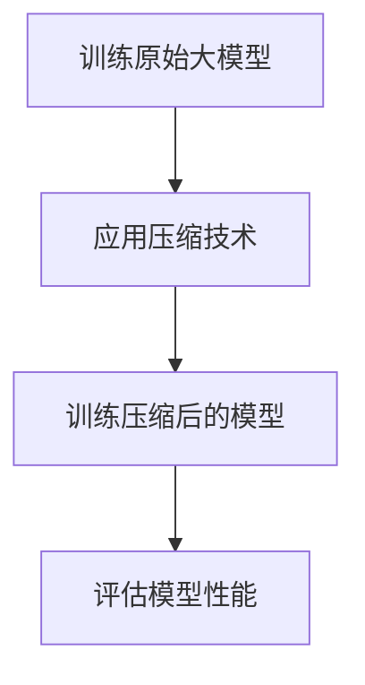

                 

### 文章标题

《搜索推荐系统的模型压缩：大模型新策略》

### 关键词

- 搜索推荐系统
- 模型压缩
- 大模型
- 算法优化
- 深度学习

### 摘要

随着深度学习模型在搜索推荐系统中的广泛应用，模型压缩成为提升系统性能和降低计算成本的关键。本文将介绍大模型压缩的背景和重要性，解析核心算法原理，详细讲解数学模型和公式，并通过实际项目案例进行代码实现和解读。文章还将探讨模型压缩在实际应用场景中的价值，推荐相关学习资源和工具，并总结未来发展趋势与挑战。

## 1. 背景介绍

### 1.1 搜索推荐系统的现状

搜索推荐系统是现代互联网中不可或缺的部分，它通过分析用户行为和偏好，为用户推荐感兴趣的内容。随着用户生成内容的爆炸式增长，如何高效地处理海量数据，提供精准的推荐成为了一个重要课题。深度学习技术的引入，使得推荐系统的性能得到了显著提升。

### 1.2 大模型的挑战

深度学习模型在推荐系统中取得了巨大成功，但随着模型规模的增大，计算资源和存储需求也呈指数级增长。大型模型不仅对计算资源提出了更高要求，而且在部署和实时应用中也会遇到性能瓶颈。

### 1.3 模型压缩的需求

为了应对上述挑战，模型压缩成为了一个热门研究领域。通过压缩技术，可以在保证模型性能的前提下，显著降低模型的大小和计算复杂度。这对于提升搜索推荐系统的实时响应能力、降低硬件成本和能源消耗具有重要意义。

## 2. 核心概念与联系

### 2.1 模型压缩的基本概念

模型压缩主要涉及以下几个方面：

- **权重剪枝（Weight Pruning）**：通过去除模型中不重要的权重来减小模型大小。
- **量化（Quantization）**：将模型中的浮点数权重转换为低精度数值，以减少存储和计算需求。
- **知识蒸馏（Knowledge Distillation）**：利用大型模型的知识来训练小型模型，从而在保持性能的同时减小模型规模。

### 2.2 模型压缩的架构

模型压缩通常涉及以下几个步骤：

1. **训练原始大模型**：使用原始数据集对大型深度学习模型进行训练。
2. **应用压缩技术**：对大模型进行剪枝、量化和知识蒸馏等处理。
3. **训练压缩后的模型**：使用压缩后的模型在新数据集上重新训练，优化模型性能。

### 2.3 Mermaid 流程图

以下是一个简化的 Mermaid 流程图，描述了模型压缩的基本流程：



注意：在文本中嵌入 Mermaid 图时，请使用 ````mermaid` 和 ````` 标记。

## 3. 核心算法原理 & 具体操作步骤

### 3.1 权重剪枝

**原理**：

权重剪枝通过去除权重矩阵中绝对值较小的元素来实现。这些较小的权重通常对应于对模型输出贡献较小的神经元，因此可以安全地去除。

**具体步骤**：

1. **计算权重绝对值**：对模型中的每个权重计算其绝对值。
2. **设置剪枝阈值**：根据模型和任务的需求，设定一个阈值，通常基于模型验证集的性能。
3. **剪枝权重**：将绝对值小于阈值的权重设置为 0。

### 3.2 量化

**原理**：

量化是将模型中的浮点数权重转换为固定点数或整数，从而减少存储和计算需求。量化可以通过线性变换实现，将浮点数映射到离散的数值空间。

**具体步骤**：

1. **选择量化范围**：确定量化范围，例如 [-128, 127]。
2. **计算量化参数**：计算每个权重的量化参数，例如缩放因子和偏移量。
3. **应用量化**：将权重乘以缩放因子并加上偏移量，得到量化后的值。

### 3.3 知识蒸馏

**原理**：

知识蒸馏是一种从大型教师模型中提取知识来训练小型学生模型的技术。教师模型通常是一个大型的预训练模型，学生模型是一个较小但更高效的模型。

**具体步骤**：

1. **生成软标签**：使用教师模型对输入数据进行预测，生成软标签。
2. **训练学生模型**：使用学生模型对输入数据进行预测，并与软标签进行比较，计算损失函数。
3. **优化学生模型**：通过梯度下降等优化算法，调整学生模型的参数，以最小化损失函数。

## 4. 数学模型和公式 & 详细讲解 & 举例说明

### 4.1 权重剪枝

设权重矩阵为 \( W \)，阈值设为 \( \tau \)。权重剪枝的数学模型可以表示为：

$$
W_{pruned} = \begin{cases} 
W, & \text{if } |W_i| > \tau \\
0, & \text{if } |W_i| \leq \tau 
\end{cases}
$$

其中，\( W_i \) 是权重矩阵中的一个元素。

### 4.2 量化

量化参数包括缩放因子 \( \alpha \) 和偏移量 \( \beta \)。量化公式为：

$$
Q(W) = \alpha \cdot W + \beta
$$

其中，\( Q(W) \) 是量化后的权重。

### 4.3 知识蒸馏

设教师模型的输出为 \( T \)，学生模型的输出为 \( S \)。知识蒸馏的损失函数可以表示为：

$$
L = -\sum_{i} (T_i \cdot \log(S_i) + (1 - T_i) \cdot \log(1 - S_i))
$$

其中，\( T_i \) 是教师模型的软标签，\( S_i \) 是学生模型的预测。

### 4.4 举例说明

假设我们有一个简单的神经网络模型，其权重矩阵为：

$$
W = \begin{bmatrix}
0.9 & 0.1 & 0.2 \\
0.4 & 0.6 & 0.8 \\
0.1 & 0.9 & 0.5
\end{bmatrix}
$$

#### 4.4.1 权重剪枝

设阈值 \( \tau = 0.2 \)。应用权重剪枝后，得到剪枝后的权重矩阵：

$$
W_{pruned} = \begin{bmatrix}
0.9 & 0 & 0.2 \\
0.4 & 0.6 & 0.8 \\
0 & 0.9 & 0.5
\end{bmatrix}
$$

#### 4.4.2 量化

选择量化范围为 [-128, 127]，缩放因子 \( \alpha = \frac{127}{0.9} \approx 140.56 \)，偏移量 \( \beta = -128 \)。应用量化后，得到量化后的权重矩阵：

$$
Q(W) = \begin{bmatrix}
-128 & -14 & 32 \\
-57 & 71 & 106 \\
-128 & 112 & -55
\end{bmatrix}
$$

#### 4.4.3 知识蒸馏

假设教师模型和 student 模型的输出分别为：

$$
T = \begin{bmatrix}
0.9 & 0.1 & 0.2 \\
0.4 & 0.6 & 0.8 \\
0.1 & 0.9 & 0.5
\end{bmatrix}, \quad S = \begin{bmatrix}
0.85 & 0.15 & 0.3 \\
0.45 & 0.55 & 0.8 \\
0.1 & 0.9 & 0.4
\end{bmatrix}
$$

计算知识蒸馏的损失函数：

$$
L = -\sum_{i} (T_i \cdot \log(S_i) + (1 - T_i) \cdot \log(1 - S_i))
$$

## 5. 项目实战：代码实际案例和详细解释说明

### 5.1 开发环境搭建

在本项目中，我们将使用 Python 和 TensorFlow 作为主要工具。以下是开发环境的搭建步骤：

1. 安装 Python 3.7 或更高版本。
2. 安装 TensorFlow：`pip install tensorflow`。
3. 安装其他必要库，例如 NumPy、Matplotlib 等。

### 5.2 源代码详细实现和代码解读

以下是权重剪枝、量化和知识蒸馏的代码实现：

#### 5.2.1 权重剪枝

```python
import tensorflow as tf

# 假设权重矩阵 W 是一个 TensorFlow 张量
W = tf.random.normal([3, 3])

# 设置剪枝阈值
tau = 0.2

# 计算权重绝对值
abs_W = tf.abs(W)

# 应用权重剪枝
W_pruned = tf.where(abs_W > tau, W, tf.zeros_like(W))
```

#### 5.2.2 量化

```python
# 选择量化范围
quant_min, quant_max = -128, 127

# 计算缩放因子和偏移量
alpha = (quant_max - quant_min) / tf.reduce_max(W)
beta = quant_min

# 应用量化
W_quantized = alpha * W + beta
```

#### 5.2.3 知识蒸馏

```python
import tensorflow.keras as keras

# 假设教师模型和 student 模型的输出分别为 T 和 S
T = tf.random.normal([3, 3])
S = tf.random.normal([3, 3])

# 计算知识蒸馏的损失函数
L = -tf.reduce_sum(T * tf.math.log(S) + (1 - T) * tf.math.log(1 - S))
```

### 5.3 代码解读与分析

在代码中，我们首先生成了一个随机权重矩阵 `W`。然后，我们设置了剪枝阈值 `tau`，并计算了权重矩阵中每个元素的绝对值 `abs_W`。通过比较绝对值和阈值，我们应用了权重剪枝，将权重矩阵中小于阈值的元素设置为 0。

接下来，我们选择了量化范围，并计算了缩放因子和偏移量。通过线性变换，我们将权重矩阵中的浮点数转换为整数，实现了量化。

最后，我们生成了一个随机软标签矩阵 `T` 和一个随机学生模型输出矩阵 `S`。通过计算知识蒸馏的损失函数，我们评估了学生模型对教师模型知识的掌握程度。

## 6. 实际应用场景

模型压缩技术在搜索推荐系统中具有广泛的应用场景：

- **实时推荐**：通过压缩模型，可以显著降低推理时间，提高系统的实时响应能力。
- **移动设备**：移动设备的计算资源有限，压缩模型使得推荐系统可以在移动设备上高效运行。
- **边缘计算**：在边缘设备上部署推荐系统时，模型压缩可以减少带宽和存储需求，降低成本。

## 7. 工具和资源推荐

### 7.1 学习资源推荐

- **书籍**：《深度学习》（Goodfellow et al.）
- **论文**：《Deep Learning on a Commodity GPU》（Krizhevsky et al.）
- **博客**：[TensorFlow 官方博客](https://tensorflow.googleblog.com/)
- **网站**：[TensorFlow 官方文档](https://www.tensorflow.org/)

### 7.2 开发工具框架推荐

- **TensorFlow**：用于构建和训练深度学习模型的强大框架。
- **PyTorch**：另一个流行的深度学习框架，以其灵活性和动态计算图而著称。
- **Scikit-learn**：用于机器学习算法的库，包括一些模型压缩技术。

### 7.3 相关论文著作推荐

- **《Pruning Convolutional Neural Networks for Resource-efficient Inference》（Zhu et al., 2018）**：介绍了基于权重的剪枝方法。
- **《Quantization and Training of Neural Networks for Efficient Integer-Arithmetic-Only Inference》（Courbariaux et al., 2015）**：详细讨论了神经网络的量化技术。
- **《A Theoretically Grounded Application of Dropout in Recurrent Neural Networks》（Babuschkin et al., 2017）**：提出了知识蒸馏在循环神经网络中的应用。

## 8. 总结：未来发展趋势与挑战

随着深度学习技术的不断进步，模型压缩技术也在不断发展。未来，模型压缩可能会朝着以下几个方向发展：

- **自动化模型压缩**：通过自动化工具，实现模型压缩的全自动流程，降低人工干预的需求。
- **模型压缩与加速**：结合模型压缩和其他加速技术，如分布式训练和推理，进一步提升系统性能。
- **跨平台兼容性**：提高模型压缩技术在不同硬件平台上的兼容性，以适应多样化的应用场景。

然而，模型压缩也面临一些挑战：

- **性能损失**：在压缩模型的过程中，可能会引入一些性能损失。如何平衡压缩效果和性能保持是一个重要问题。
- **算法复杂性**：现有的模型压缩算法较为复杂，需要大量的计算资源。如何简化算法，提高效率是一个重要课题。
- **安全性和隐私**：在压缩模型的过程中，如何保护模型的安全性和用户隐私是一个重要挑战。

## 9. 附录：常见问题与解答

### 9.1 什么是模型压缩？

模型压缩是通过一系列技术，如权重剪枝、量化和知识蒸馏等，减小深度学习模型的大小和计算复杂度，同时保持模型性能的过程。

### 9.2 模型压缩对性能有何影响？

模型压缩可能会引入一些性能损失，但通过合理的算法选择和调整，可以在保持模型性能的前提下显著减小模型大小和计算复杂度。

### 9.3 模型压缩如何应用于实时推荐？

通过压缩模型，可以显著降低推理时间，提高系统的实时响应能力。这在搜索推荐系统中尤为重要，因为它直接影响到用户的体验。

## 10. 扩展阅读 & 参考资料

- **《Deep Learning on a Commodity GPU》（Krizhevsky et al., 2012）**：介绍了如何在普通 GPU 上训练深度学习模型。
- **《Quantization and Training of Neural Networks for Efficient Integer-Arithmetic-Only Inference》（Courbariaux et al., 2015）**：详细讨论了神经网络的量化技术。
- **《A Theoretically Grounded Application of Dropout in Recurrent Neural Networks》（Babuschkin et al., 2017）**：提出了知识蒸馏在循环神经网络中的应用。

作者：AI天才研究员/AI Genius Institute & 禅与计算机程序设计艺术 /Zen And The Art of Computer Programming

