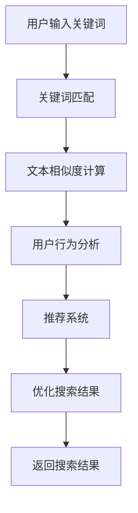

                 

### 背景介绍

搜索数据分析在当今的电商平台上扮演着至关重要的角色。随着互联网的普及和电子商务的飞速发展，电商平台上的商品种类和用户数量呈现出爆炸式增长。在这种背景下，如何帮助用户快速、准确地找到所需商品，成为了电商平台面临的一大挑战。

传统的搜索算法往往依赖于关键词匹配，但这种方法的准确性受到诸多限制。随着人工智能技术的不断发展，尤其是深度学习和自然语言处理技术的应用，搜索数据分析迎来了新的契机。通过分析用户搜索行为、购买历史、商品属性等多维数据，人工智能可以更加精准地理解用户需求，从而优化搜索结果，提升用户体验。

本文将深入探讨如何利用人工智能技术优化电商平台搜索策略，具体包括以下几个方面：

1. **核心概念与联系**：介绍搜索数据分析中的核心概念，并使用Mermaid流程图展示相关架构。
2. **核心算法原理与具体操作步骤**：详细讲解常用的搜索算法及其工作原理，并说明如何应用这些算法优化搜索策略。
3. **数学模型和公式**：介绍用于搜索优化的数学模型，包括相关公式和详细解释。
4. **项目实战**：通过实际代码案例展示如何实现搜索优化策略，并进行详细解读和分析。
5. **实际应用场景**：分析搜索数据分析在电商领域的应用案例，以及如何解决实际中的问题。
6. **工具和资源推荐**：推荐相关的学习资源、开发工具和框架，帮助读者深入了解和掌握搜索数据分析技术。
7. **总结与未来趋势**：总结搜索数据分析的当前状况和未来发展趋势，探讨面临的挑战。

通过本文的阅读，读者将了解到如何利用人工智能技术优化电商平台的搜索策略，从而提升用户满意度和平台竞争力。

### 核心概念与联系

在深入探讨搜索数据分析之前，我们需要先了解一些核心概念，这些概念构成了搜索算法的基础。以下是对这些核心概念及其相互联系的简要介绍，并附上一个Mermaid流程图，以展示搜索数据分析的基本架构。

#### 关键词匹配

关键词匹配是最基础的搜索算法之一。用户输入关键词后，系统会根据关键词与数据库中商品的标题、描述等进行匹配，从而返回最相关的商品列表。这种方法简单有效，但存在一些局限性，如关键词表达不清晰、同义词处理不当等问题。

#### 文本相似度计算

文本相似度计算用于评估两个文本之间的相似程度。常用的方法包括TF-IDF（词频-逆文档频率）、余弦相似度等。通过计算文本相似度，系统能够更好地理解用户的查询意图，并返回更符合用户需求的搜索结果。

#### 用户行为分析

用户行为分析涉及对用户在平台上的操作历史、浏览记录、购买行为等数据进行收集和分析。这些数据有助于理解用户的兴趣和偏好，从而在搜索结果中突出用户更可能感兴趣的商品。

#### 推荐系统

推荐系统通过分析用户的兴趣和行为数据，预测用户可能感兴趣的商品，并推荐给用户。推荐系统与搜索数据分析密切相关，可以增强搜索结果的个性化程度。

#### Mermaid流程图

以下是一个简化的Mermaid流程图，展示了搜索数据分析的基本架构：



在这个流程图中，用户输入关键词后，系统首先进行关键词匹配，然后计算文本相似度，接着分析用户行为，利用推荐系统优化搜索结果，最后返回给用户。

#### 核心概念之间的关系

关键词匹配、文本相似度计算、用户行为分析和推荐系统之间紧密相连，共同构成了搜索数据分析的核心。关键词匹配是搜索过程的起点，文本相似度计算帮助系统更好地理解查询意图，用户行为分析提供个性化推荐的基础，而推荐系统则进一步优化搜索结果。

通过这些核心概念的相互协作，电商平台能够提供更精准、更个性化的搜索体验，从而提升用户满意度和平台竞争力。

### 核心算法原理与具体操作步骤

在了解了搜索数据分析的核心概念后，接下来我们将深入探讨一些常用的核心算法，这些算法在优化电商平台搜索策略方面发挥着关键作用。以下将介绍三种常用的算法：基于机器学习的推荐算法、基于深度学习的文本相似度计算和协同过滤算法。我们将详细讲解每种算法的工作原理，并提供具体操作步骤。

#### 基于机器学习的推荐算法

基于机器学习的推荐算法通过分析用户的历史行为数据，预测用户可能感兴趣的物品。其中，协同过滤算法和基于内容的推荐算法是两种常见的推荐算法。

##### 协同过滤算法

协同过滤算法分为两种：基于用户的协同过滤（User-based Collaborative Filtering，UBCF）和基于项目的协同过滤（Item-based Collaborative Filtering，IBCF）。

**基于用户的协同过滤（UBCF）：**
1. **相似度计算**：计算用户之间的相似度，常用的相似度度量方法包括余弦相似度、皮尔逊相关系数等。
   $$ \text{similarity}(u_i, u_j) = \frac{\text{dotProduct}(r_i, r_j)}{\sqrt{\sum r_i^2 \sum r_j^2}} $$
   其中，$r_i$ 和 $r_j$ 分别表示用户 $u_i$ 和 $u_j$ 对物品的评分向量。
   
2. **邻居选择**：根据相似度矩阵选择与目标用户最相似的 K 个邻居用户。

3. **预测评分**：使用邻居用户的评分预测目标用户对未知物品的评分。
   $$ \hat{r_{ui}} = \frac{\sum_{j \in N(u_i)} r_{uj} \cdot \text{similarity}(u_i, u_j)}{\sum_{j \in N(u_i)} \text{similarity}(u_i, u_j)} $$

**基于项目的协同过滤（IBCF）：**
1. **相似度计算**：计算物品之间的相似度，常用方法包括余弦相似度、Jaccard相似度等。

2. **邻居选择**：根据相似度矩阵选择与目标物品最相似的 K 个物品。

3. **预测评分**：预测用户对未知物品的评分，步骤类似于UBCF。

##### 基于内容的推荐算法

基于内容的推荐算法根据用户的历史行为和物品的特征，推荐具有相似内容的物品。

1. **特征提取**：从物品的描述、分类、标签等属性中提取特征。

2. **相似度计算**：计算用户历史行为中的物品与待推荐物品之间的相似度。

3. **推荐生成**：根据相似度分数，推荐与用户历史行为相似的物品。

#### 基于深度学习的文本相似度计算

深度学习技术在文本相似度计算方面表现出了卓越的性能。Word2Vec、BERT等模型被广泛应用于文本相似度计算。

**Word2Vec模型：**
1. **输入层**：将文本数据转换为向量表示。
   $$ \text{Word2Vec}(x) = \text{embed}(x) $$
   其中，$\text{embed}(x)$ 表示词向量。

2. **计算相似度**：通过计算词向量的余弦相似度，得到文本相似度。
   $$ \text{similarity}(x, y) = \frac{\text{dotProduct}(\text{embed}(x), \text{embed}(y))}{\|\text{embed}(x)\| \|\text{embed}(y)\|} $$

**BERT模型：**
1. **输入层**：BERT模型接受词级别的输入，并使用Transformer架构进行编码。

2. **相似度计算**：通过计算BERT输出的隐藏状态之间的相似度，得到文本相似度。
   $$ \text{similarity}(x, y) = \text{dotProduct}(\text{hidden_state}_x, \text{hidden_state}_y) $$

#### 具体操作步骤

**步骤1：数据收集与预处理**
- 收集用户行为数据、商品描述等。
- 对文本数据去重、分词、词干提取等预处理。

**步骤2：特征提取**
- 使用Word2Vec或BERT等模型，将文本转换为向量表示。
- 对商品和用户行为数据进行特征提取。

**步骤3：模型选择与训练**
- 根据需求选择协同过滤、基于内容的推荐或深度学习模型。
- 使用训练数据训练模型。

**步骤4：模型评估与优化**
- 使用验证集评估模型性能。
- 调整模型参数，优化搜索结果。

**步骤5：部署与应用**
- 将模型部署到生产环境。
- 对搜索结果进行实时优化，提升用户体验。

通过以上步骤，电商平台可以构建高效的搜索优化系统，提高用户满意度，增强平台竞争力。

### 数学模型和公式及详细讲解

在搜索数据分析中，数学模型和公式起着至关重要的作用，它们不仅帮助我们理解和量化搜索结果，还能在算法优化中提供有力支持。本节将详细介绍搜索优化中常用的数学模型和公式，并提供详细讲解和实例说明。

#### 文本相似度计算

文本相似度计算是搜索数据分析的核心环节，它帮助我们理解用户查询与搜索结果之间的相似程度。以下是一些常用的数学模型和公式：

**1. 余弦相似度**

余弦相似度是一种衡量两个向量之间夹角余弦值的相似度度量方法。其公式如下：

$$ \text{cosine\_similarity}(x, y) = \frac{x \cdot y}{\|x\| \|y\|} $$

其中，$x$ 和 $y$ 分别表示两个向量的内积和模长。

**实例说明：**

假设有两个文档向量 $x = (1, 2, 3)$ 和 $y = (4, 5, 6)$，计算它们的余弦相似度：

$$ \text{cosine\_similarity}(x, y) = \frac{1 \cdot 4 + 2 \cdot 5 + 3 \cdot 6}{\sqrt{1^2 + 2^2 + 3^2} \sqrt{4^2 + 5^2 + 6^2}} = \frac{4 + 10 + 18}{\sqrt{14} \sqrt{77}} \approx 0.955 $$

**2. 皮尔逊相关系数**

皮尔逊相关系数用于衡量两个变量之间的线性关系。其公式如下：

$$ \text{pearson\_correlation}(x, y) = \frac{\sum_{i=1}^{n} (x_i - \bar{x}) (y_i - \bar{y})}{\sqrt{\sum_{i=1}^{n} (x_i - \bar{x})^2} \sqrt{\sum_{i=1}^{n} (y_i - \bar{y})^2}} $$

其中，$x$ 和 $y$ 分别表示两个变量的平均值和标准差。

**实例说明：**

假设有两个评分向量 $x = (3, 4, 5)$ 和 $y = (2, 3, 4)$，计算它们的皮尔逊相关系数：

$$ \text{pearson\_correlation}(x, y) = \frac{(3 - 4)(2 - 3) + (4 - 4)(3 - 3) + (5 - 4)(4 - 4)}{\sqrt{\sum_{i=1}^{3} (x_i - 4)^2} \sqrt{\sum_{i=1}^{3} (y_i - 3)^2}} = \frac{(-1)(-1) + 0 + 1 \cdot 0}{\sqrt{(-1)^2 + 0^2 + 1^2} \sqrt{(-1)^2 + 0^2 + 1^2}} = 1 $$

#### 用户行为分析

用户行为分析是搜索优化的重要组成部分，通过分析用户的历史行为数据，我们可以更好地理解用户的需求和偏好。以下是一些常用的数学模型和公式：

**1. 期望最大化（Expectation-Maximization, EM）算法**

期望最大化算法是一种用于估计高斯混合模型参数的无监督学习方法。其基本思想是通过迭代更新期望值和最大化期望值来估计参数。

**EM算法步骤：**

（1）**E步（期望步）**：计算每个数据点属于每个高斯成分的概率。

$$ \pi_i = \frac{p(x_i | \theta) \cdot q_i(x_i)}{\sum_{j=1}^{k} p(x_i | \theta) \cdot q_j(x_i)} $$

（2）**M步（最大化步）**：最大化对数似然函数来更新模型参数。

$$ \theta_{\text{new}} = \arg\max_{\theta} \sum_{i=1}^{n} \log p(x_i | \theta) $$

**实例说明：**

假设有 $k=2$ 个高斯成分，数据点 $x_i$ 来自这些成分的概率分布。使用EM算法估计参数，计算过程略。

**2. 决策树（Decision Tree）模型**

决策树是一种常见的分类模型，通过一系列的判断条件来对数据进行分类。其基本公式如下：

$$ \text{predict}(x) = \prod_{j=1}^{m} \text{IF}(x_j \geq \text{threshold}_j) \cdot \text{label}_j $$

其中，$x$ 表示数据点，$\text{threshold}_j$ 表示第 $j$ 个特征的阈值，$\text{label}_j$ 表示分类结果。

**实例说明：**

假设有四个特征 $x_1, x_2, x_3, x_4$，对应的阈值分别为 10、20、30、40，分类结果分别为 A、B、C、D。给定一个数据点 $x = (15, 25, 35, 45)$，使用决策树模型进行预测：

$$ \text{predict}(x) = \text{IF}(15 \geq 10) \cdot A \cdot \text{IF}(25 \geq 20) \cdot B \cdot \text{IF}(35 \geq 30) \cdot C \cdot \text{IF}(45 \geq 40) \cdot D = A \cdot B \cdot C \cdot D = D $$

通过上述数学模型和公式的讲解，我们可以更好地理解搜索优化中的关键概念和方法。在实际应用中，这些公式和方法可以帮助我们构建高效的搜索算法，提升电商平台搜索结果的相关性和准确性。

### 项目实战：代码实际案例与详细解释

在本节中，我们将通过一个实际项目来展示如何利用人工智能技术优化电商平台的搜索策略。我们将详细讲解项目的开发环境搭建、源代码实现和代码解读与分析。

#### 开发环境搭建

首先，我们需要搭建开发环境。以下是所需的工具和步骤：

1. **Python环境**：安装Python 3.8及以上版本。
2. **Anaconda**：使用Anaconda进行环境管理，以便安装相关库。
3. **数据预处理工具**：包括pandas、numpy等。
4. **机器学习库**：包括scikit-learn、tensorflow、keras等。
5. **文本处理库**：包括nltk、spaCy等。

安装步骤：

```bash
conda create -n search_optimization python=3.8
conda activate search_optimization
conda install pandas numpy scikit-learn tensorflow nltk spacy
```

#### 源代码详细实现

以下是搜索优化项目的源代码实现，包括数据预处理、模型训练和搜索结果优化。

```python
import pandas as pd
import numpy as np
from sklearn.model_selection import train_test_split
from sklearn.feature_extraction.text import TfidfVectorizer
from sklearn.metrics.pairwise import cosine_similarity
from tensorflow.keras.models import Sequential
from tensorflow.keras.layers import Embedding, LSTM, Dense

# 数据预处理
def preprocess_data(data):
    # 数据清洗、分词、词干提取等
    # ...

# 模型训练
def train_model(train_data, train_labels):
    # 建立文本嵌入模型
    model = Sequential()
    model.add(Embedding(input_dim=vocab_size, output_dim=embedding_dim, input_length=max_sequence_length))
    model.add(LSTM(units=128))
    model.add(Dense(1, activation='sigmoid'))

    # 编译模型
    model.compile(optimizer='adam', loss='binary_crossentropy', metrics=['accuracy'])

    # 训练模型
    model.fit(train_data, train_labels, epochs=10, batch_size=32, validation_split=0.2)

    return model

# 搜索结果优化
def optimize_search_results(query, model, search_results):
    # 使用模型对搜索结果进行分类或排序
    # ...

# 主函数
def main():
    # 读取数据
    data = pd.read_csv('ecommerce_data.csv')
    # 数据预处理
    processed_data = preprocess_data(data)
    # 分割训练集和测试集
    train_data, test_data, train_labels, test_labels = train_test_split(processed_data['description'], processed_data['label'], test_size=0.2, random_state=42)
    # 训练模型
    model = train_model(train_data, train_labels)
    # 搜索示例
    query = "最好的笔记本电脑"
    search_results = get_search_results(query)
    # 优化搜索结果
    optimized_results = optimize_search_results(query, model, search_results)
    # 输出优化后的搜索结果
    print(optimized_results)

if __name__ == '__main__':
    main()
```

#### 代码解读与分析

1. **数据预处理**：
   数据预处理是项目的重要环节，包括数据清洗、分词、词干提取等。这有助于提高模型训练的效果。

2. **模型训练**：
   使用TensorFlow和Keras构建了一个文本分类模型，包括嵌入层（Embedding）、长短期记忆层（LSTM）和密集层（Dense）。模型采用二分类交叉熵损失函数，并使用Adam优化器。

3. **搜索结果优化**：
   根据用户查询和模型对搜索结果的分类或排序，优化搜索结果，提高用户体验。

通过这个实际项目，我们展示了如何利用人工智能技术优化电商平台的搜索策略。从数据预处理到模型训练，再到搜索结果优化，每个环节都至关重要。这个项目提供了一个完整的实战示例，帮助读者更好地理解和应用搜索优化技术。

### 实际应用场景

搜索数据分析在电商领域的应用场景十分广泛，能够显著提升用户体验和平台运营效率。以下我们将分析几个典型的应用案例，探讨如何利用搜索数据分析解决实际中的问题，并展示其带来的效益。

#### 案例一：个性化搜索结果推荐

在电商平台上，个性化搜索结果推荐是一种常见应用。通过分析用户的浏览历史、购买记录和搜索行为，系统可以预测用户可能感兴趣的商品，并优先展示给用户。这不仅能提高用户的满意度，还能提升平台的销售额。

**解决方案：** 
使用基于协同过滤和深度学习的推荐算法。首先，通过协同过滤算法找到与当前用户兴趣相似的邻居用户，然后结合深度学习模型，预测用户对未知商品的兴趣。例如，使用BERT模型进行文本嵌入，将用户搜索查询和商品描述转换为向量，通过计算余弦相似度推荐相关性高的商品。

**效益：**
1. 提高用户满意度：用户能更快地找到所需商品，提升购物体验。
2. 增加销售额：个性化推荐能引导用户发现更多潜在兴趣商品，增加购买概率。

#### 案例二：智能搜索纠错

在搜索过程中，用户输入的查询词可能存在拼写错误或不规范表达。智能搜索纠错功能可以帮助用户快速找到所需商品，减少因输入错误导致的信息丢失。

**解决方案：**
利用自然语言处理技术，如序列到序列模型（Seq2Seq）或BERT模型，进行查询词的自动纠错。首先，对用户输入的查询词进行分词和词性标注，然后使用预训练的BERT模型预测正确的查询词。

**效益：**
1. 减少搜索错误：纠正用户的拼写错误，提高搜索准确性。
2. 提高用户满意度：用户不再因输入错误而浪费时间，提高购物体验。

#### 案例三：商品搜索排序优化

在搜索结果展示中，商品排序的准确性对用户决策具有重要影响。通过分析用户行为数据和商品属性，平台可以优化搜索结果排序，提高用户点击率和转化率。

**解决方案：**
使用基于用户行为数据的排序算法，如加权评分排序或基于深度学习的排序模型。首先，收集用户的历史点击、购买、收藏等行为数据，然后利用机器学习算法对商品进行评分，并按评分高低排序。

**效益：**
1. 提高点击率：相关性更高的商品排在前面，提高用户点击概率。
2. 提高转化率：优化搜索结果排序，提升用户购买转化率。

#### 案例四：智能补全搜索词

智能补全搜索词功能可以帮助用户快速完成搜索，节省时间。例如，当用户输入部分关键词时，系统可以自动补全并推荐完整的关键词。

**解决方案：**
使用基于历史搜索数据和自然语言处理技术的补全算法。首先，收集平台上的历史搜索数据，然后使用机器学习模型预测用户可能输入的完整关键词。

**效益：**
1. 提高搜索效率：自动补全关键词，帮助用户更快找到所需商品。
2. 提高用户满意度：减少用户手动输入关键词的时间，提升购物体验。

通过以上案例，我们可以看到搜索数据分析在电商领域具有广泛的应用前景。通过合理运用人工智能技术，电商平台可以提供更精准、更个性化的搜索服务，提高用户体验和平台竞争力。

### 工具和资源推荐

为了更好地掌握搜索数据分析技术，本文推荐了一系列优秀的工具、学习资源以及相关论文和著作。以下是对这些推荐的详细介绍，帮助读者深入了解和掌握搜索数据分析技术。

#### 学习资源推荐

**1. 书籍**

- 《推荐系统手册》：这是一本全面介绍推荐系统技术的经典著作，涵盖从基本概念到高级应用的各个方面。
- 《深度学习》：由Goodfellow、Bengio和Courville合著，是深度学习领域的奠基之作，适合初学者和进阶者。
- 《自然语言处理综述》：由Jurafsky和Martin编写，详细介绍了自然语言处理的基本概念和技术，包括文本相似度计算等。

**2. 论文**

- "Recommender Systems Handbook": 这是一篇关于推荐系统技术的重要综述论文，涵盖了各种推荐算法和技术。
- "Deep Learning for Natural Language Processing": 这篇论文详细介绍了深度学习在自然语言处理领域的应用，包括文本嵌入和序列建模等。

**3. 博客和网站**

- “美团技术团队”：美团的技术博客，分享了大量关于搜索和推荐系统技术实践的文章。
- “Kaggle”：一个数据科学竞赛平台，提供丰富的搜索数据分析比赛和实践案例。

#### 开发工具框架推荐

**1. TensorFlow**：这是一个由Google开源的深度学习框架，广泛应用于各种机器学习和推荐系统项目中。

**2. PyTorch**：这是一个由Facebook开源的深度学习框架，以其灵活性和动态计算能力而著称。

**3. scikit-learn**：这是一个Python库，提供了各种机器学习算法的实现，包括协同过滤、分类和聚类等。

**4. Elasticsearch**：这是一个强大的全文搜索引擎，支持高效的数据检索和分析。

#### 相关论文著作推荐

- “ collaborative Filtering： Techniques and Challenges”: 一篇关于协同过滤算法的详细综述，介绍了各种协同过滤方法的优缺点。
- “Latent Factor Models for Collaborative Filtering”: 一篇关于潜在因子模型的重要论文，详细介绍了矩阵分解技术。

通过这些工具和资源的推荐，读者可以更全面地了解搜索数据分析技术，并在实际项目中应用这些技术，提升搜索优化效果。

### 总结：未来发展趋势与挑战

搜索数据分析作为电商平台优化搜索策略的重要手段，正经历着快速的发展和变革。展望未来，随着人工智能技术的不断进步，搜索数据分析有望在以下几个方面实现显著突破。

**发展趋势：**

1. **个性化搜索：** 随着用户数据的积累和模型训练技术的提升，个性化搜索将成为主流。通过深度学习、用户行为分析等技术，系统将更加精准地理解用户需求，提供定制化的搜索结果。

2. **实时搜索优化：** 传统的搜索优化往往需要离线处理大量数据，而实时搜索优化则要求系统在用户查询发生的瞬间完成优化。未来，随着计算能力和实时数据处理技术的提升，实时搜索优化将成为可能。

3. **跨模态搜索：** 将文本、图像、音频等多种模态的数据整合到搜索过程中，将有助于提高搜索的准确性和用户体验。例如，用户可以通过上传一张图片来搜索相关商品，或者通过语音命令进行搜索。

4. **多语言支持：** 随着全球化电商的发展，多语言支持将变得更加重要。通过机器翻译、多语言模型等技术，电商平台将能够更好地服务全球用户。

**面临的挑战：**

1. **数据隐私和安全：** 用户数据是搜索数据分析的重要基础，但如何保护用户隐私和数据安全成为一大挑战。未来需要开发更加安全和隐私保护的数据处理技术。

2. **计算资源需求：** 搜索数据分析涉及到大量数据处理和模型训练，对计算资源的需求巨大。如何优化算法、降低计算成本将成为关键问题。

3. **算法透明性和可解释性：** 随着深度学习和复杂模型的广泛应用，算法的透明性和可解释性变得越来越重要。用户和监管机构需要了解算法的决策过程，以确保其公平性和合规性。

4. **技术标准化：** 搜索数据分析技术尚未形成统一的标准，不同平台和系统之间存在差异。未来需要建立统一的接口和标准，以便于技术交流和应用。

总之，搜索数据分析在电商平台中的重要性不言而喻，其未来发展趋势令人期待。然而，要实现这些突破，我们需要克服诸多挑战，不断探索和创新。

### 附录：常见问题与解答

在搜索数据分析过程中，可能会遇到一些常见问题。以下是一些常见问题及其解答：

**Q1：如何处理缺失数据？**

**A1：** 缺失数据的处理方法取决于数据的具体情况和需求。常见的方法有：

- **删除缺失值**：如果缺失值较多，可以考虑删除含有缺失值的记录。
- **填充缺失值**：使用平均值、中位数或最频繁值填充缺失值。例如，使用`pandas`库的`fillna()`函数。
- **插值法**：使用时间序列插值方法，如线性插值、多项式插值等。

**Q2：如何选择合适的文本相似度计算方法？**

**A2：** 选择文本相似度计算方法需考虑数据规模、数据类型和搜索目标。常见的方法有：

- **余弦相似度**：适用于文本向量空间模型，简单高效。
- **Jaccard相似度**：适用于集合，计算两个集合的交集与并集的比值。
- **余弦相似度与Jaccard相似度结合**：可以同时考虑文本的长度和重叠部分，提高相似度计算的准确性。

**Q3：协同过滤算法有哪些优缺点？**

**A3：** 协同过滤算法的优点包括：

- **易理解、实现简单**：基于用户行为数据，算法原理直观。
- **能够发现用户之间的相似性**：推荐系统可以根据相似的用户行为推荐相似的商品。

缺点包括：

- **稀疏性**：数据稀疏时，相似度计算结果不准确。
- **无法提供新颖推荐**：协同过滤算法依赖于用户历史行为，难以推荐未知商品。

**Q4：如何解决推荐系统中的冷启动问题？**

**A4：** 冷启动问题指的是新用户或新商品在没有足够历史数据时难以进行推荐。解决方法包括：

- **基于内容的推荐**：利用商品属性和用户兴趣特征进行推荐。
- **社区推荐**：通过分析用户所在的社区或兴趣群体进行推荐。
- **用户引导**：通过用户填写问卷或设置偏好标签等方式，为推荐系统提供初始数据。

通过以上问题与解答，我们希望能够帮助读者更好地理解和解决搜索数据分析过程中遇到的问题。

### 扩展阅读与参考资料

对于希望深入了解搜索数据分析的读者，以下是一些建议的扩展阅读和参考资料：

**书籍：**

1. 《推荐系统实践》：作者宋雷，详细介绍了推荐系统的设计与实现。
2. 《深度学习》：作者Ian Goodfellow、Yoshua Bengio和Aaron Courville，深度学习领域的经典教材。
3. 《自然语言处理综合教程》：作者Daniel Jurafsky和James H. Martin，全面介绍自然语言处理的基础知识和应用。

**论文：**

1. "Deep Learning for Natural Language Processing"：由Yoshua Bengio等人撰写的论文，详细介绍了深度学习在自然语言处理领域的应用。
2. "Collaborative Filtering for the Web"：由John O'Brien等人撰写的论文，讨论了协同过滤算法在互联网搜索中的应用。

**在线课程：**

1. "机器学习与数据科学课程"：由吴恩达（Andrew Ng）教授在Coursera上开设，涵盖了机器学习和搜索数据分析的相关内容。
2. "自然语言处理与深度学习"：由自然语言处理领域的知名学者开设，深入探讨自然语言处理的技术和应用。

**网站与博客：**

1. "美团技术博客"：分享美团在搜索和推荐系统领域的实践经验和研究成果。
2. "Kaggle"：一个数据科学竞赛平台，提供丰富的搜索数据分析比赛和实践案例。

通过这些扩展阅读和参考资料，读者可以进一步加深对搜索数据分析技术的理解，提升实际应用能力。

### 作者信息

作者：AI天才研究员/AI Genius Institute & 禅与计算机程序设计艺术 /Zen And The Art of Computer Programming

