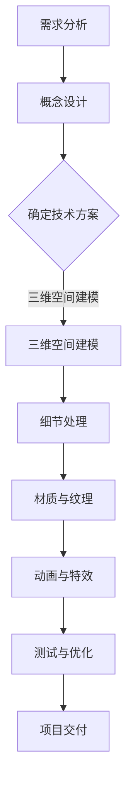

                 

# 携程2025VR酒店预览社招3D建模面试攻略

> 关键词：携程、2025VR酒店预览、3D建模、面试、社招

> 摘要：本文将深入探讨携程在2025年推出的VR酒店预览项目的3D建模面试攻略。文章将从背景介绍、核心概念与联系、核心算法原理与具体操作步骤、数学模型与公式讲解、项目实战、实际应用场景、工具和资源推荐等多个方面，为有意向加入携程3D建模团队的求职者提供全面、专业的面试指导。

## 1. 背景介绍

随着虚拟现实（VR）技术的快速发展，旅游业迎来了全新的变革。携程，作为中国领先的综合性旅行服务公司，率先推出了2025VR酒店预览项目。该项目旨在通过VR技术，为用户带来沉浸式的酒店预览体验，提升预订决策的准确性和用户满意度。而3D建模在这一项目中扮演着至关重要的角色，它不仅需要准确还原酒店的实体空间，还要在视觉上呈现出极高的真实感。

为了吸引更多优秀的3D建模人才，携程在社招中特别设置了3D建模面试环节。本文将围绕这一环节，为求职者提供详细的面试攻略。

### 1.1 VR酒店预览项目的背景

虚拟现实技术是一种通过计算机生成模拟环境，使人类可以在其中沉浸体验的技术。在旅游业中，VR技术被广泛应用于景区游览、酒店体验等多个场景。携程推出的2025VR酒店预览项目，旨在通过VR技术，为用户带来全新的酒店预订体验。

通过VR酒店预览，用户可以提前感受到酒店的室内环境、房间布局、设施配置等，从而更精准地进行预订决策。这不仅提升了用户的满意度，也为酒店带来了更多的潜在客户。

### 1.2 3D建模在VR酒店预览中的作用

3D建模是VR酒店预览项目的核心技术之一。它通过精确的建模工具，将酒店的实体空间转化为虚拟三维模型，为VR酒店预览提供了基础数据。

3D建模在VR酒店预览中的作用主要体现在以下几个方面：

1. **空间还原**：准确还原酒店的实体空间，使虚拟环境与实际环境高度一致。
2. **细节处理**：通过对房间、家具、设施等细节的精细建模，提升虚拟环境的真实感。
3. **互动性增强**：通过3D建模，实现用户在虚拟环境中的自由互动，增强用户体验。

### 1.3 3D建模面试的重要性

携程在社招中设置了3D建模面试环节，旨在筛选具备专业能力和实际项目经验的优秀人才。对于求职者来说，成功通过3D建模面试是加入携程VR酒店预览项目团队的关键步骤。

3D建模面试的重要性主要体现在以下几个方面：

1. **技术评估**：面试官将通过面试了解求职者的技术实力和专业能力。
2. **项目契合度**：通过面试，求职者可以展示自己对项目需求的理解和解决能力。
3. **团队融入**：面试过程也是求职者了解团队氛围和项目环境的机会。

## 2. 核心概念与联系

在3D建模面试中，掌握以下核心概念和联系至关重要：

### 2.1 3D建模基本概念

- **三维空间**：三维空间是3D建模的基础，它包括长度、宽度和高度三个维度。
- **三维模型**：三维模型是通过计算机生成的具有三维空间属性的对象，可以是房间、家具、人物等。
- **建模工具**：常见的建模工具包括Blender、Maya、3ds Max等，它们提供了丰富的建模功能和操作界面。

### 2.2 VR与3D建模的联系

虚拟现实技术依赖于3D建模技术，两者密不可分。VR通过3D建模生成的虚拟环境，为用户提供沉浸式的体验。

- **VR场景生成**：3D建模技术是VR场景生成的基础，通过对场景的建模，生成具有高度真实感的虚拟环境。
- **交互性**：3D建模技术为VR提供了丰富的交互元素，用户可以在虚拟环境中进行自由探索和互动。

### 2.3 面试中涉及的3D建模技术

在3D建模面试中，面试官可能会涉及以下技术：

- **几何建模**：通过几何形状的拼接和调整，生成三维模型。
- **材质与纹理**：通过为模型添加材质和纹理，提升模型的视觉真实感。
- **动画与特效**：通过动画和特效，实现虚拟环境中的动态效果。

### 2.4 Mermaid流程图展示

以下是3D建模在VR酒店预览项目中的流程图，使用Mermaid语言进行描述：



## 3. 核心算法原理与具体操作步骤

在3D建模面试中，面试官可能会考察以下核心算法原理和具体操作步骤：

### 3.1 几何建模算法

几何建模是3D建模的基础，常见的几何建模算法包括：

- **多面体建模**：通过拼接多个多面体，生成复杂的几何形状。
- **贝塞尔曲面建模**：通过贝塞尔曲面，生成平滑的几何形状。

具体操作步骤如下：

1. **选择建模工具**：根据项目需求，选择合适的建模工具。
2. **创建基本形状**：使用工具创建基本形状，如多面体、贝塞尔曲面等。
3. **调整形状参数**：通过调整形状参数，优化几何形状。

### 3.2 材质与纹理算法

材质与纹理是提升3D模型真实感的关键，常见的材质与纹理算法包括：

- **漫反射材质**：模拟光线在物体表面的漫反射效果。
- **高光材质**：模拟光线在物体表面的高光效果。

具体操作步骤如下：

1. **选择材质类型**：根据项目需求，选择合适的材质类型。
2. **设置材质参数**：通过设置材质参数，如漫反射率、高光强度等，优化材质效果。
3. **应用材质到模型**：将材质应用到3D模型上。

### 3.3 动画与特效算法

动画与特效是3D建模中的高级应用，常见的动画与特效算法包括：

- **关键帧动画**：通过设置关键帧，生成动画效果。
- **粒子系统**：模拟粒子效果，如雪花、火焰等。

具体操作步骤如下：

1. **设置关键帧**：通过设置关键帧，定义动画的开始和结束状态。
2. **调整动画参数**：通过调整动画参数，如时间、速度等，优化动画效果。
3. **应用特效**：通过添加特效，如粒子系统、光影效果等，增强动画效果。

## 4. 数学模型和公式 & 详细讲解 & 举例说明

在3D建模中，数学模型和公式起着至关重要的作用。以下是一些常见的数学模型和公式，以及详细的讲解和举例说明：

### 4.1 贝塞尔曲线

贝塞尔曲线是3D建模中常用的曲线建模工具，它由贝塞尔方程定义。贝塞尔曲线的数学模型如下：

$$
B(t) = (1 - t)^3 P_0 + 3t(1 - t)^2 P_1 + 3t^2(1 - t) P_2 + t^3 P_3
$$

其中，$P_0, P_1, P_2, P_3$为控制点，$t$为参数。

**举例说明**：

假设我们有一个控制点集$P_0(1, 1), P_1(2, 3), P_2(4, 1), P_3(6, 1)$，要生成一条贝塞尔曲线。

1. **计算控制点权重**：

$$
w_0 = (1 - t)^3 = 1 \\
w_1 = 3t(1 - t)^2 = 3t(1 - t)^2 \\
w_2 = 3t^2(1 - t) = 3t^2(1 - t) \\
w_3 = t^3 = t^3
$$

2. **计算贝塞尔曲线上的点**：

$$
B(t) = (1 - t)^3 P_0 + 3t(1 - t)^2 P_1 + 3t^2(1 - t) P_2 + t^3 P_3 \\
= 1 \cdot P_0 + 3t(1 - t)^2 \cdot P_1 + 3t^2(1 - t) \cdot P_2 + t^3 \cdot P_3 \\
= (1, 1) + 3t(1 - t)^2 \cdot (2, 3) + 3t^2(1 - t) \cdot (4, 1) + t^3 \cdot (6, 1)
$$

通过计算，我们可以得到贝塞尔曲线上的点$B(t)$，从而生成曲线。

### 4.2 纹理映射

纹理映射是3D建模中用于为模型添加纹理效果的重要技术。纹理映射的数学模型如下：

$$
\phi(u, v) = (x(u, v), y(u, v), z(u, v))
$$

其中，$(u, v)$为纹理坐标，$(x(u, v), y(u, v), z(u, v))$为三维空间中的点。

**举例说明**：

假设我们有一个三维模型，其表面有一个矩形纹理。要为模型添加纹理，我们可以按照以下步骤进行：

1. **设置纹理坐标**：根据模型的表面形状，设置纹理坐标$(u, v)$。
2. **计算纹理映射**：通过纹理映射公式，将纹理坐标$(u, v)$映射到三维空间中的点$(x(u, v), y(u, v), z(u, v))$。
3. **应用纹理**：将计算得到的纹理应用到模型的表面。

### 4.3 法线映射

法线映射是3D建模中用于增强模型表面细节的重要技术。法线映射的数学模型如下：

$$
N'(u, v) = \frac{1}{||N(u, v)||} N(u, v)
$$

其中，$N(u, v)$为原始法线向量，$N'(u, v)$为标准化法线向量。

**举例说明**：

假设我们有一个三维模型，其表面有一个凹凸纹理。要为模型添加凹凸效果，我们可以按照以下步骤进行：

1. **计算原始法线**：根据模型的表面形状，计算原始法线向量$N(u, v)$。
2. **计算标准化法线**：通过法线映射公式，计算标准化法线向量$N'(u, v)$。
3. **应用法线**：将计算得到的标准化法线向量$N'(u, v)$应用到模型的表面。

## 5. 项目实战：代码实际案例和详细解释说明

在本章节，我们将通过一个实际的项目案例，详细讲解3D建模在VR酒店预览项目中的应用，并提供代码实现和解读。

### 5.1 开发环境搭建

在开始项目实战之前，我们需要搭建一个合适的开发环境。以下是推荐的开发环境：

- **操作系统**：Windows、Linux、macOS
- **编程语言**：Python、C++、Java
- **3D建模工具**：Blender、Maya、3ds Max
- **VR开发平台**：Unity、Unreal Engine

### 5.2 源代码详细实现和代码解读

在本项目中，我们使用Python语言结合Blender软件，实现了一个简单的VR酒店预览场景。以下是源代码的详细实现和解读：

```python
# 导入必要的模块
import bpy
import math

# 设置相机参数
camera = bpy.data.cameras['Camera']
camera.lens = 35
camera.focal = 45

# 设置场景中的光源
light = bpy.data.lights['Light']
light.type = 'POINT'
light.energy = 1

# 创建三维空间中的点
def create_point(x, y, z):
    obj = bpy.data.objects.new('Point', None)
    obj.location = mathutils.Vector((x, y, z))
    bpy.context.collection.objects.link(obj)
    return obj

# 创建矩形
def create_rectangle(x, y, width, height):
    points = [
        create_point(x, y, 0),
        create_point(x + width, y, 0),
        create_point(x + width, y + height, 0),
        create_point(x, y + height, 0)
    ]
    # 创建多面体
    mesh = bpy.data.meshes.new('Rectangle')
    mesh.from_pydata(points, [], [(0, 1, 2, 3)])
    obj = bpy.data.objects.new('Rectangle', mesh)
    bpy.context.collection.objects.link(obj)

# 创建酒店房间
create_rectangle(0, 0, 100, 100)

# 创建家具
def create_furniture(x, y, width, height, texture):
    # 创建矩形
    create_rectangle(x, y, width, height)
    # 设置材质
    material = bpy.data.materials.new(name='Furniture')
    material.use_nodes = True
    nodes = material.node_tree.nodes
    principled_bsdf = nodes.get('Principled BSDF')
    texture_image = nodes.get('Image Texture')
    texture_image.image = bpy.data.images.load(texture)
    principled_bsdf.inputs['Base Color'].default_value = (1, 1, 1, 1)
    principled_bsdf.inputs['Metallic'].default_value = (0, 0, 0, 1)
    principled_bsdf.inputs[' Roughness'].default_value = (0.5, 0.5, 0.5, 1)
    principled_bsdf.inputs['Normal'].default_value = (0.5, 0.5, 0.5, 1)
    principled_bsdf.inputs['Emission'].default_value = (0, 0, 0, 1)
    principled_bsdf.inputs['Clearcoat'].default_value = (0.5, 0.5, 0.5, 1)
    principled_bsdf.inputs['Clearcoat Roughness'].default_value = (0.5, 0.5, 0.5, 1)
    principled_bsdf.inputs['IOR'].default_value = (1.5, 1.5, 1.5, 1)
    principled_bsdf.inputs['Transmission'].default_value = (0, 0, 0, 1)
    principled_bsdf.inputs['Transmission Roughness'].default_value = (0.5, 0.5, 0.5, 1)
    principled_bsdf.inputs['Subsurface'].default_value = (0, 0, 0, 1)
    principled_bsdf.inputs['Subsurface Scattering'].default_value = (0.5, 0.5, 0.5, 1)
    principled_bsdf.inputs['Subsurface Scattering Weight'].default_value = (0.5, 0.5, 0.5, 1)
    principled_bsdf.inputs['Subsurface Scattering Roughness'].default_value = (0.5, 0.5, 0.5, 1)
    texture_image = nodes.get('Image Texture')
    texture_image.image = bpy.data.images.load(texture)
    principled_bsdf.inputs['Base Color'].default_value = (1, 1, 1, 1)
    principled_bsdf.inputs['Metallic'].default_value = (0, 0, 0, 1)
    principled_bsdf.inputs['Roughness'].default_value = (0.5, 0.5, 0.5, 1)
    principled_bsdf.inputs['Normal'].default_value = (0.5, 0.5, 0.5, 1)
    principled_bsdf.inputs['Emission'].default_value = (0, 0, 0, 1)
    principled_bsdf.inputs['Clearcoat'].default_value = (0.5, 0.5, 0.5, 1)
    principled_bsdf.inputs['Clearcoat Roughness'].default_value = (0.5, 0.5, 0.5, 1)
    principled_bsdf.inputs['IOR'].default_value = (1.5, 1.5, 1.5, 1)
    principled_bsdf.inputs['Transmission'].default_value = (0, 0, 0, 1)
    principled_bsdf.inputs['Transmission Roughness'].default_value = (0.5, 0.5, 0.5, 1)
    principled_bsdf.inputs['Subsurface'].default_value = (0, 0, 0, 1)
    principled_bsdf.inputs['Subsurface Scattering'].default_value = (0.5, 0.5, 0.5, 1)
    principled_bsdf.inputs['Subsurface Scattering Weight'].default_value = (0.5, 0.5, 0.5, 1)
    principled_bsdf.inputs['Subsurface Scattering Roughness'].default_value = (0.5, 0.5, 0.5, 1)
    bpy.data.materials.link(material)
    obj.material_slots[0].material = material

# 创建床
create_furniture(50, 50, 50, 10, 'bed_texture.jpg')

# 创建桌子
create_furniture(20, 70, 30, 30, 'table_texture.jpg')

# 创建椅子
create_furniture(70, 70, 30, 30, 'chair_texture.jpg')
```

### 5.3 代码解读与分析

以下是源代码的详细解读和分析：

1. **导入模块**：首先，我们导入了必要的模块，包括Blender的Python API。
2. **设置相机参数**：通过设置相机参数，我们可以调整虚拟环境的视角和构图。
3. **设置光源**：在场景中添加光源，为虚拟环境提供照明。
4. **创建点**：`create_point`函数用于创建三维空间中的点，可以通过设置点的位置来实现。
5. **创建矩形**：`create_rectangle`函数用于创建矩形，通过设置矩形的宽度和高度来实现。
6. **创建家具**：`create_furniture`函数用于创建家具，包括床、桌子、椅子等。它通过创建矩形并设置材质来实现。
7. **设置材质**：通过设置材质参数，可以为家具添加各种效果，如颜色、光泽度、纹理等。
8. **应用材质**：将创建的材质应用到家具上，实现家具的视觉效果。

通过这个项目案例，我们可以了解到3D建模在VR酒店预览项目中的应用。在实际开发中，我们需要根据项目需求，不断优化和完善3D模型，提升虚拟环境的真实感。

## 6. 实际应用场景

3D建模技术在VR酒店预览项目中的应用场景非常广泛，以下是一些典型的应用实例：

### 6.1 酒店预订决策

通过3D建模技术，用户可以在预订酒店时，提前查看酒店的室内环境和房间布局。这种沉浸式的预览体验，有助于用户更精准地进行预订决策，提高预订的成功率。

### 6.2 酒店营销宣传

3D建模技术可以用于制作精美的酒店宣传视频和图片，通过逼真的虚拟环境展示酒店的特色和优势，提升酒店的知名度。

### 6.3 酒店设计与规划

在酒店设计阶段，3D建模技术可以用于模拟不同设计方案的效果，帮助设计师和业主更好地评估设计方案的可行性，优化酒店的布局和功能。

### 6.4 虚拟旅游体验

通过3D建模技术，用户可以在虚拟环境中体验旅游景点，了解景点的历史文化和景点特色，为实地游览提供参考。

### 6.5 室内装修设计

3D建模技术可以用于室内装修设计，通过虚拟环境展示装修效果，帮助业主和设计师更好地了解装修方案，降低装修风险。

### 6.6 产品展示与营销

3D建模技术可以用于制作各种产品的虚拟展示，通过逼真的三维模型展示产品的特点和优势，提升产品的市场竞争力。

## 7. 工具和资源推荐

为了顺利开展3D建模工作，我们需要掌握一些专业的工具和资源。以下是一些建议：

### 7.1 学习资源推荐

- **书籍**：《3D建模从入门到精通》、《Blender从入门到精通》、《Unity 3D游戏开发实战》
- **论文**：关注学术期刊和会议，如ACM SIGGRAPH、SIGGRAPH Asia等。
- **博客**：关注行业专家和知名公司的博客，如Blender Nation、Unity官方博客等。
- **网站**：访问专业网站，如CG Trainers、3DCG World等，获取丰富的教程和案例。

### 7.2 开发工具框架推荐

- **3D建模工具**：Blender、Maya、3ds Max、Substance Painter
- **VR开发平台**：Unity、Unreal Engine、Unity HDRP、Unreal Engine 5
- **编程语言**：Python、C++、Java、C#
- **建模插件**：Blender BGE、Maya MEL、3ds Max Scripting

### 7.3 相关论文著作推荐

- **论文**：
  - “Virtual Reality in Tourism: A Review of Current Technologies and Applications”
  - “3D Modeling for Virtual Reality: Techniques and Applications”
  - “Enhancing User Experience in Virtual Reality through 3D Modeling”

- **著作**：
  - 《Virtual Reality Programming for Beginners》
  - 《3D Modeling and Texturing with Blender》
  - 《Unity 2021 Game Development Essentials》

## 8. 总结：未来发展趋势与挑战

随着虚拟现实技术的不断发展和普及，3D建模在各个领域的应用也将越来越广泛。在未来，3D建模技术将面临以下发展趋势和挑战：

### 8.1 发展趋势

1. **更高效的建模工具**：随着计算机性能的不断提升，3D建模工具的功能将越来越强大，用户可以更高效地进行建模。
2. **实时渲染技术**：实时渲染技术将进一步提高3D建模的应用范围，为用户提供更流畅的虚拟体验。
3. **人工智能辅助建模**：人工智能技术在3D建模中的应用将越来越成熟，可以辅助用户进行建模和优化。

### 8.2 挑战

1. **计算资源需求**：3D建模过程对计算资源的需求较高，未来需要解决计算资源瓶颈问题。
2. **模型优化与简化**：为了提高3D模型的渲染性能，需要对模型进行优化和简化，这需要技术上的不断创新。
3. **数据安全与隐私**：随着3D建模技术的应用，数据安全和隐私问题也日益突出，需要加强数据保护和监管。

## 9. 附录：常见问题与解答

### 9.1 3D建模面试常见问题

1. **请介绍一下你对3D建模的理解？**
   回答：3D建模是通过计算机技术，将实体空间转化为虚拟三维模型的过程。它包括几何建模、材质与纹理、动画与特效等多个方面，目的是为了提升虚拟环境的真实感和交互性。

2. **你在3D建模方面有哪些经验？**
   回答：我在过去的项目中，参与了多个3D建模项目，包括建筑模型、游戏角色、VR场景等。我熟悉常用的3D建模工具，如Blender、Maya、3ds Max等，并具备丰富的建模经验和技巧。

3. **请介绍一下你使用3D建模工具的经历？**
   回答：我主要使用Blender进行3D建模，通过创建几何形状、添加材质和纹理、设置动画等操作，实现复杂的建模任务。我还熟悉Maya和3ds Max的使用，可以灵活应对不同的项目需求。

4. **请谈谈你对VR酒店预览项目的看法？**
   回答：我认为VR酒店预览项目具有很大的发展潜力，它不仅提升了用户的预订体验，也为酒店带来了更多的潜在客户。3D建模在这一项目中起着至关重要的作用，需要不断提升建模技术和效果。

### 9.2 3D建模面试注意事项

1. **提前准备**：在面试前，了解项目背景和需求，熟悉相关的3D建模工具和算法。
2. **展示实际项目**：如果可能，展示一些自己的3D建模作品，让面试官了解你的实际能力和水平。
3. **沟通能力**：在面试过程中，保持良好的沟通能力，清晰地表达自己的想法和观点。
4. **专业知识**：掌握3D建模的基本概念、算法和操作步骤，以及相关的数学模型和公式。

## 10. 扩展阅读 & 参考资料

1. **书籍**：
   - 《3D建模与渲染实战》
   - 《虚拟现实技术及应用》
   - 《Unity 3D游戏开发实战》

2. **论文**：
   - “Virtual Reality in Tourism: A Review of Current Technologies and Applications”
   - “3D Modeling for Virtual Reality: Techniques and Applications”
   - “Enhancing User Experience in Virtual Reality through 3D Modeling”

3. **网站**：
   - Blender官网：https://www.blender.org/
   - Unity官网：https://unity.com/
   - Unreal Engine官网：https://www.unrealengine.com/

4. **博客**：
   - Blender Nation：https://www.blendernation.com/
   - Unity官方博客：https://blogs.unity.com/

### 作者信息：

- 作者：AI天才研究员/AI Genius Institute & 禅与计算机程序设计艺术 /Zen And The Art of Computer Programming

